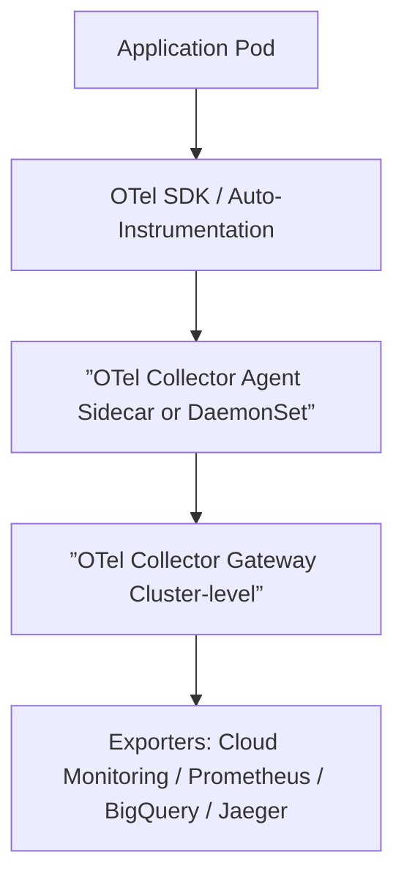
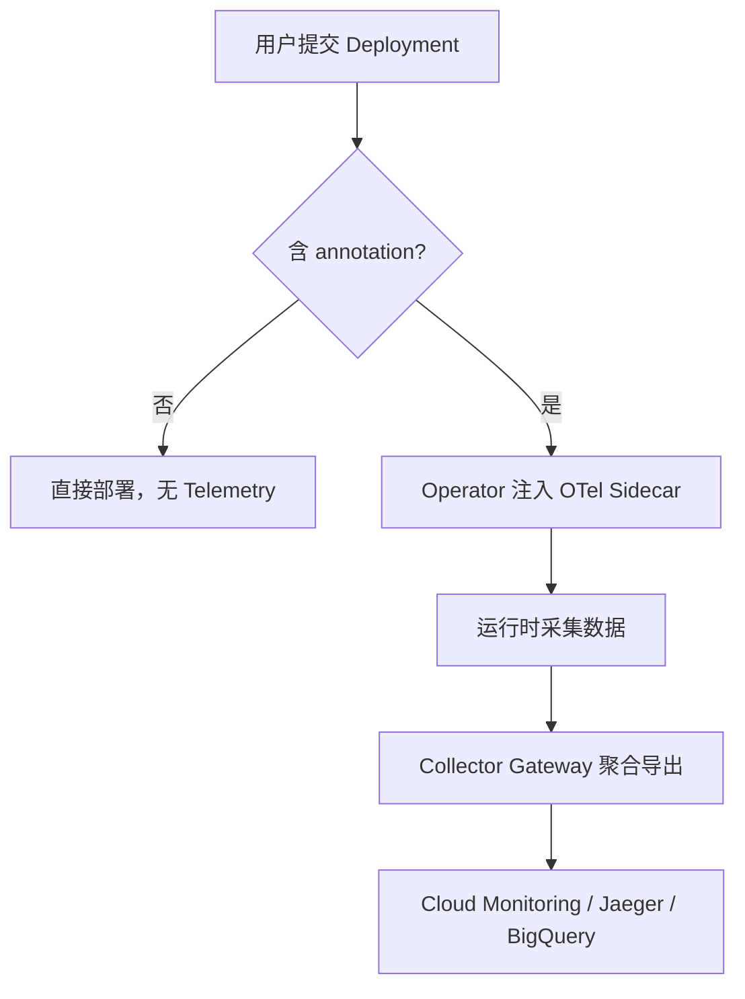
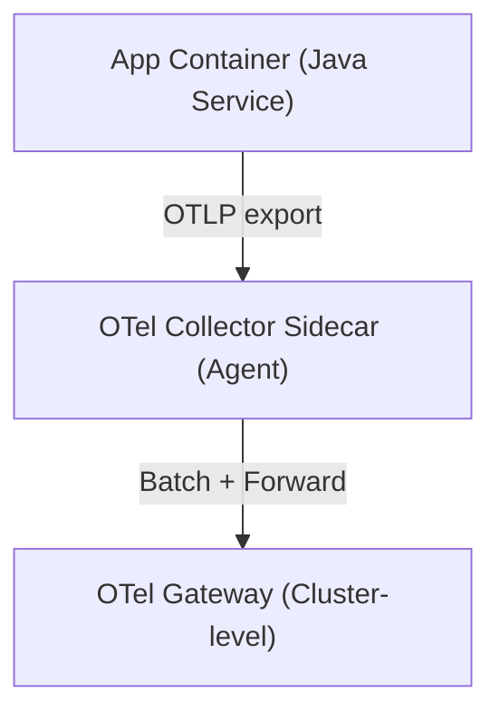

非常好的问题，这实际上涉及 可观测性架构设计 中两个关键层面：

1️⃣ 采集方式的选择（initContainer / sidecar / operator / agent）

2️⃣ 平台可扩展性与用户自治的平衡（集中式 vs 用户自定义）

下面我分层分析，并结合 OpenTelemetry (OTel) 的最佳实践提出推荐方案。

一、问题分析

你提到的两种模式：

|                  |                                                        |          |                                            |                                      |
| ---------------- | ------------------------------------------------------ | -------- | ------------------------------------------ | ------------------------------------ |
| 方案             | 部署方式                                               | 生命周期 | 优点                                       | 缺点                                 |
| initContainer    | 在 Pod 启动时执行一次                                  | 临时运行 | 适合做前置配置（如注入配置文件、环境变量） | 无法持续收集数据                     |
| Operator / Agent | Operator 负责统一管理采集逻辑；Agent 常驻节点或 Pod 内 | 长期运行 | 可统一配置、热更新、低侵入                 | 对平台治理要求高（权限、资源隔离等） |

结论：

- initContainer 更适合 初始化配置或注入（例如在启动前生成 OpenTelemetry SDK 所需配置文件）。
- Operator 或 Agent 模式适合 持续收集与导出 Telemetry 数据，是主流实践。

二、解决方案：平台级 OTel 最佳实践

1. 架构设计

推荐采用以下分层采集结构：



说明：

- 应用层：由用户部署的容器（Java、Go、Python 等）负责生成 Trace/Metric/Log 数据；
- Agent 层：以 Sidecar 或 DaemonSet 形式存在，负责采集本地 Pod 的 Telemetry；
- Gateway 层：平台层的 OTel Collector Gateway，集中做数据聚合与导出；
- Operator 层（可选）：自动化注入 Sidecar、配置 Endpoint、动态调整采集策略。

2. 平台集成策略

针对平台场景，推荐两种模式结合使用：

|                          |                                          |                                                                                                                                               |
| ------------------------ | ---------------------------------------- | --------------------------------------------------------------------------------------------------------------------------------------------- |
| 模式                     | 场景                                     | 实现方式                                                                                                                                      |
| 自动注入 (Operator)      | 平台统一控制 OTel 启用与配置             | 使用 [OpenTelemetry Operator](https://github.com/open-telemetry/opentelemetry-operator)，在用户部署的 Deployment 中自动注入 Sidecar Collector |
| 手动启用 (Template Flag) | 允许用户在 Deployment 模板中选择启用采集 | 例如通过注解控制：otel.openplatform.io/enabled: "true"，Operator 检测到后自动注入                                                             |

这种方式兼顾了：

- 平台统一治理（Operator）
- 用户可配置选择（模板开关）

3. 推荐配置实践

以 Java 应用为例：

```yaml
apiVersion: apps/v1

kind: Deployment

metadata:

  name: sample-app

  annotations:

    otel.openplatform.io/enabled: "true"

spec:

  template:

    spec:

      containers:

      - name: app

        image: sample/java-service:latest

        env:

        - name: OTEL_EXPORTER_OTLP_ENDPOINT

          value: http://localhost:4317

      # 当 Operator 检测到 annotation=true 时自动注入以下 sidecar

      # - name: otel-collector

      #   image: otel/opentelemetry-collector:latest

      #   ports:

      #   - containerPort: 4317
 ```

这种模式的核心逻辑：


- 平台定义好 OpenTelemetry Operator；
- 用户只需在 Deployment 加一个 annotation；
- Operator 自动完成注入、配置、回收。


三、流程图：平台 OTel 启用流程



四、注意事项与最佳实践

1. 性能与成本

- 避免每个 Pod 都有独立 Collector，推荐 DaemonSet 模式或集中 Gateway；
- 采样率 (sampling rate) 建议平台统一下发。

3.

4. 安全

- OTel Collector Sidecar 与主容器间通信仅限 localhost；
- Gateway 层需要限制外部访问，配置 TLS。

6.

7. 可观测性一致性

- 平台应统一：

- Trace ID Propagation 标准（如 W3C Trace Context）
- Exporter 协议（OTLP）

-

9.

10. 多租户隔离

- 不同团队或命名空间可通过 Gateway 层的 pipeline 分流到不同后端。

12.

✅ 总结推荐方案

|                      |                                       |
| -------------------- | ------------------------------------- |
| 场景                 | 推荐方案                              |
| 平台级统一管理       | OpenTelemetry Operator + Gateway 模式 |
| 用户可自定义是否启用 | Deployment annotation 触发注入        |
| 轻量场景或测试环境   | DaemonSet Agent + SDK 自动采集        |
| 重度治理、多租户平台 | Operator 动态注入 + Gateway 分流      |

是否希望我帮你画出针对「平台架构级别」的 OTel 部署方案（包括 Operator、Agent、Gateway 的拓扑图）？这能更直观展示平台如何插入 OTel 采集流程。

非常好 👍

以下是针对 平台级 OpenTelemetry 采集体系 的完整架构设计示意图，展示了从 用户应用层 到 平台网关层 的数据流、注入逻辑与治理关系。

🧩 平台级 OpenTelemetry 架构拓扑图

```mermaid
graph TD

    subgraph "用户层 (Application Layer)"

        A1["User Deployment: 应用容器"]

        A2["OTel SDK / Auto-Instrumentation"]

        A3["(annotation) otel.openplatform.io/enabled=true"]

        A1 --> A2

    end


    subgraph "Operator 层 (控制与注入层)"

        B1["OpenTelemetry Operator"]

        B2["自动检测 annotation"]

        B3["注入 OTel Collector Sidecar"]

        B1 --> B2 --> B3

    end


    subgraph "Pod 内 (采集层)"

        C1["App Container"]

        C2["OTel Collector Sidecar (Agent 模式)"]

        C1 -->|"OTLP Exporter"| C2

    end


    subgraph "集群层 (Gateway 层)"

        D1["OTel Collector Gateway (Deployment)"]

        D2["Pipeline: trace/metric/log"]

        D1 --> D2

    end


    subgraph "平台后端 (可观测性后端)"

        E1["Google Cloud Monitoring"]

        E2["Jaeger / Tempo (Tracing)"]

        E3["BigQuery / Loki (Logging)"]

        D2 --> E1

        D2 --> E2

        D2 --> E3

    end


    %% 关系连接

    A3 --> B1

    B3 --> C2

    C2 --> D1
   
    ```


⚙️ 架构说明


|   |   |   |
|---|---|---|
|层级|组件|主要职责|
|用户层|应用容器 + OTel SDK|应用端产出 telemetry 数据（trace、metrics、logs）|
|Operator 层|OTel Operator|自动注入 Sidecar、统一配置、动态管理 OTel collector|
|Pod 采集层|OTel Collector (sidecar)|采集当前 Pod 内的 telemetry 数据，转发至集群级 Collector|
|集群网关层|OTel Collector Gateway|聚合、过滤、导出到后端系统|
|平台后端层|Cloud Monitoring、Jaeger、BigQuery 等|数据存储与可视化分析|


🧠 流程说明


```mermaid
sequenceDiagram

    participant User as 用户提交 Deployment

    participant Operator as OTel Operator

    participant Pod as 应用 Pod

    participant Gateway as OTel Collector Gateway

    participant Backend as 可观测性后端


    User->>Operator: 部署含 annotation 的 Deployment

    Operator->>Pod: 自动注入 Sidecar Collector

    Pod->>Pod: 应用生成 trace/metric/log

    Pod->>Gateway: Sidecar 转发 OTLP 数据

    Gateway->>Backend: 导出数据到 Cloud Monitoring / Jaeger / BigQuery
 ```


✅ 平台实施要点


|   |   |
|---|---|
|项目|建议实践|
|注入控制|通过 Deployment annotation 控制是否启用 OTel|
|配置统一性|由 Operator 管理 Collector 配置模板（ConfigMap）|
|采集通道|Pod 内使用 localhost 通信 (4317/4318)|
|出口层安全|Gateway 层启用 mTLS，确保数据上送安全|
|多租户隔离|根据 Namespace / Label 动态路由到不同 pipeline|
|可扩展性|Gateway 可横向扩展，支持流量分层聚合与分区导出|


🚀 推荐落地路径


1. 部署 OpenTelemetry Operator（官方 Helm Chart 支持 GKE）
2. 平台统一配置一个或多个 OTel Collector Gateway
3. 定义平台标准注解，例如：


otel.openplatform.io/enabled: "true"

otel.openplatform.io/pipeline: "teamA"


3.

4. Operator 根据注解自动注入 Sidecar 并关联对应 pipeline
5. 后端统一接入 Cloud Monitoring + Jaeger + BigQuery 等服务


是否希望我帮你输出一份完整的 GKE 平台 OTel 部署示例（含 Operator + Collector + Gateway YAML 样例）？

那份内容会包括：


- Operator 安装
- Collector Gateway 配置
- 应用 Deployment 启用示例（annotation 控制）
    这将帮助你在平台中直接落地。


好的 👍

下面是针对 GKE 平台集成 OpenTelemetry 的完整落地模板，包含：


1. OTel Operator 安装
2. OTel Collector Gateway 部署
3. 用户应用 Deployment 示例（通过 annotation 启用采集）


所有内容均可直接复制至 .yaml 文件中使用。


🧩 一、部署 OpenTelemetry Operator


# 推荐使用官方 Helm Chart 方式安装

helm repo add open-telemetry https://open-telemetry.github.io/opentelemetry-helm-charts

helm repo update


helm install opentelemetry-operator open-telemetry/opentelemetry-operator \

  --namespace opentelemetry-system \

  --create-namespace


✅ 验证安装


kubectl get pods -n opentelemetry-system

预期输出示例：

NAME                                      READY   STATUS    AGE

opentelemetry-operator-7f8c8d8bb4-xyz12   1/1     Running   1m


🧠 二、部署 OTel Collector Gateway（平台层）


平台层 Collector 负责统一接收来自 Pod 的 telemetry 数据并导出到后端系统。

此处以 Google Cloud Monitoring (OTLP) 与 Jaeger 为例。
```yaml
apiVersion: opentelemetry.io/v1alpha1

kind: OpenTelemetryCollector

metadata:

  name: otel-gateway

  namespace: opentelemetry-system

spec:

  mode: deployment

  config: |

    receivers:

      otlp:

        protocols:

          grpc:

          http:

    processors:

      batch:

      memory_limiter:

        check_interval: 1s

        limit_mib: 400

        spike_limit_mib: 100

    exporters:

      googlecloud:

        project: YOUR_GCP_PROJECT_ID

      jaeger:

        endpoint: "jaeger-collector.monitoring.svc.cluster.local:14250"

        tls:

          insecure: true

    service:

      pipelines:

        traces:

          receivers: [otlp]

          processors: [memory_limiter, batch]

          exporters: [googlecloud, jaeger]

        metrics:

          receivers: [otlp]

          processors: [memory_limiter, batch]

          exporters: [googlecloud]

```


🚀 应用部署


kubectl apply -f otel-gateway.yaml

验证服务是否启动：

kubectl get pods -n opentelemetry-system -l app.kubernetes.io/name=otel-gateway


🧩 三、定义平台标准 Annotation 规则


建议定义统一的注解约定：

|   |   |
|---|---|
|注解键|作用|
|otel.openplatform.io/enabled|是否启用 OpenTelemetry|
|otel.openplatform.io/pipeline|指定数据输出 pipeline（可按团队、命名空间等区分）|
|otel.openplatform.io/sampling|采样率配置（如 0.1、1.0）|

Operator 会根据这些 annotation 自动注入 Sidecar。


⚙️ 四、用户应用 Deployment 示例


以下示例展示了如何让用户 通过 annotation 启用 OTel Sidecar 注入：
```yaml
apiVersion: apps/v1

kind: Deployment

metadata:

  name: sample-app

  namespace: team-a

  annotations:

    otel.openplatform.io/enabled: "true"

    otel.openplatform.io/pipeline: "team-a"

spec:

  replicas: 2

  selector:

    matchLabels:

      app: sample-app

  template:

    metadata:

      labels:

        app: sample-app

    spec:

      containers:

      - name: app

        image: sample/java-service:latest

        ports:

        - containerPort: 8080

        env:

        - name: OTEL_SERVICE_NAME

          value: "sample-app"

        - name: OTEL_EXPORTER_OTLP_ENDPOINT

          value: "http://localhost:4317"

        - name: OTEL_TRACES_SAMPLER

          value: "parentbased_traceidratio"

        - name: OTEL_TRACES_SAMPLER_ARG

          value: "1.0"

```

💡 Operator 注入后的 Pod 实际结构如下：
---




🔍 五、验证与观测


查看 Collector 是否收到数据


kubectl logs -n opentelemetry-system deploy/otel-gateway | grep "Exporting"


验证应用是否成功注入 Sidecar


kubectl describe pod -n team-a | grep otel-collector


验证后端（Jaeger 或 Cloud Monitoring）


- Jaeger UI：搜索 sample-app
- Cloud Monitoring Metrics Explorer：查询 workload.googleapis.com/opentelemetry/*


🧱 六、注意事项与最佳实践


|   |   |
|---|---|
|项目|建议|
|性能优化|Sidecar 模式适合中小规模；大规模集群建议使用 DaemonSet Agent|
|安全性|Collector Gateway 出口启用 mTLS 或 VPC 内访问|
|配置管理|Collector 配置放入 ConfigMap，Operator 动态热加载|
|多租户隔离|通过 annotation 或 namespace 自动映射不同 pipeline|
|采样策略|平台统一下发默认采样率，用户可通过 annotation 覆盖|


✅ 总结


|   |   |   |
|---|---|---|
|层级|实现方式|说明|
|控制层|OpenTelemetry Operator|自动注入、集中配置|
|采集层|Sidecar 或 DaemonSet Collector|采集应用数据|
|聚合层|OTel Collector Gateway|聚合、导出、隔离 pipeline|
|后端层|Cloud Monitoring / Jaeger / BigQuery|分析与展示|


是否希望我继续补充一个 多团队多 pipeline（TeamA/TeamB）Collector Gateway 配置模板？

这样你可以让平台通过 annotation 动态分流 trace 到不同后端（例如 Jaeger-A / Jaeger-B）。
