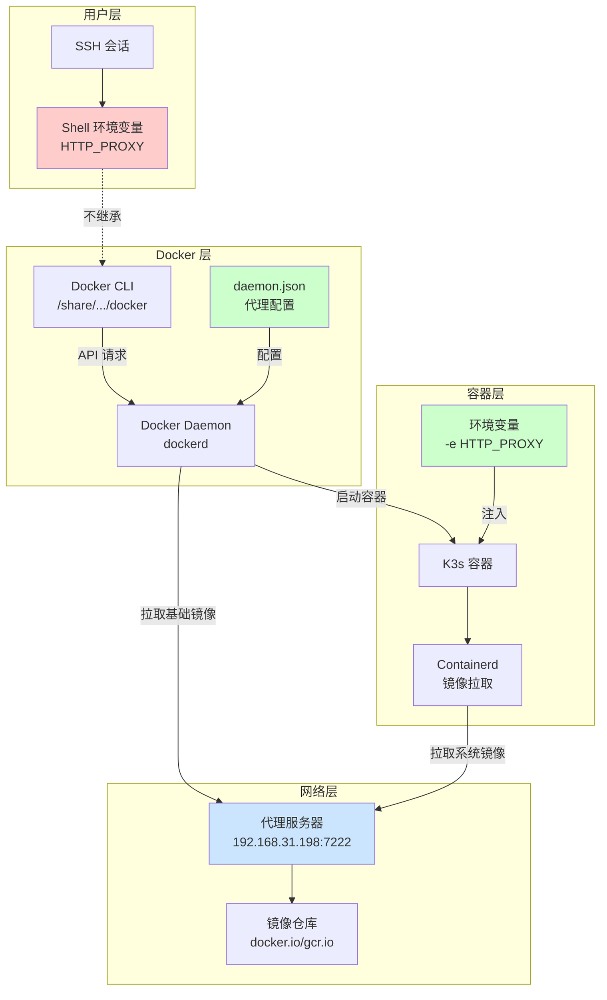
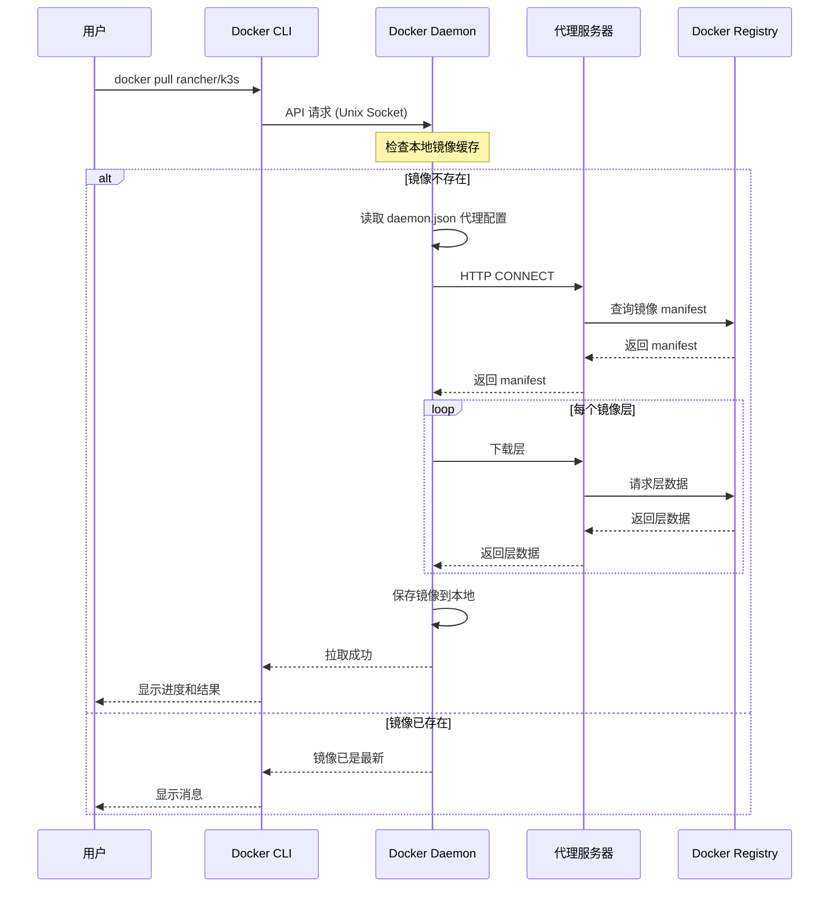
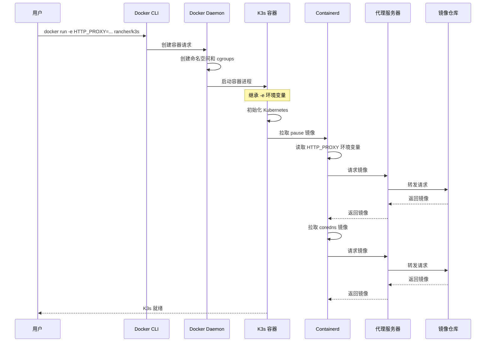
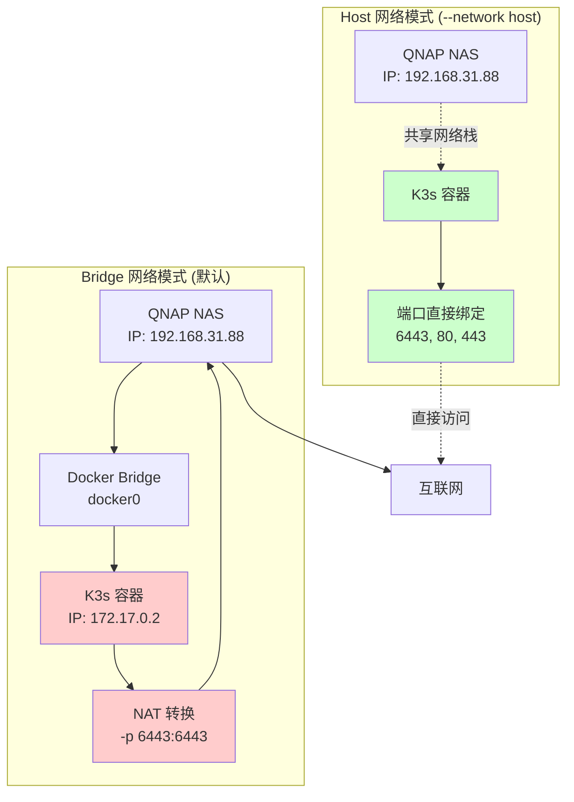
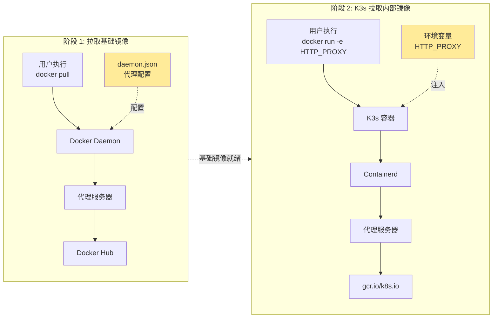
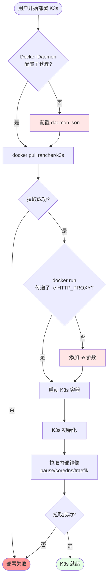
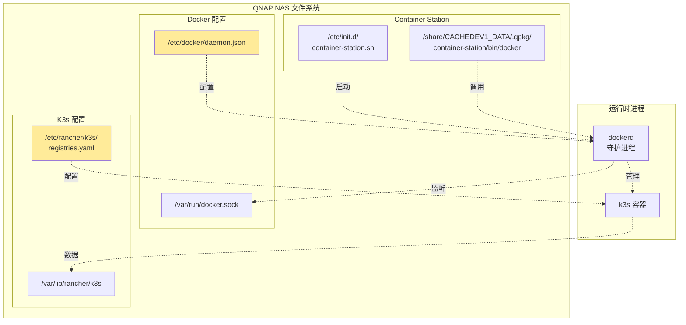
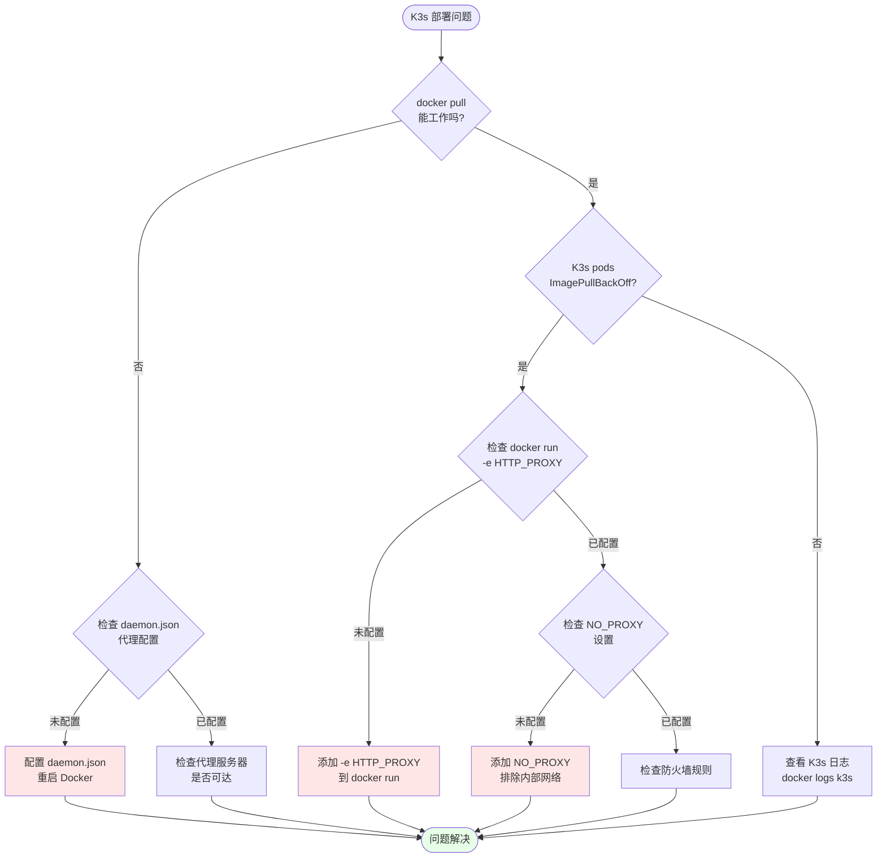
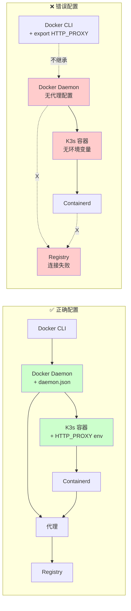

# Docker 网络流程图集

本文档包含多个 Mermaid 图表，用于可视化 Docker 在 QNAP NAS 上的网络架构和流程。

## 1. Docker 三层架构总览

## 2. Docker Pull 详细流程

## 3. Docker Run 与 K3s 启动流程

## 4. 网络模式对比：Host vs Bridge

## 5. 代理配置的两个阶段

## 6. 完整的网络数据流

## 7. QNAP 特定路径和组件

## 8. 故障排查决策树

## 9. 网络流量路径对比

## 10. 时间线：从零到 K3s 运行

```mermaid
gantt
    title K3s 部署时间线
    dateFormat X
    axisFormat %s
    
    section 准备阶段
    配置 daemon.json           :done, prep1, 0, 30
    重启 Docker Daemon        :done, prep2, 30, 40
    
    section 镜像拉取
    docker pull rancher/k3s   :active, pull1, 40, 120
    验证镜像                   :pull2, 120, 130
    
    section 容器启动
    docker run with -e        :run1, 130, 140
    K3s 初始化                :run2, 140, 160
    
    section 内部镜像
    拉取 pause 镜像           :internal1, 160, 180
    拉取 coredns 镜像         :internal2, 180, 210
    拉取 traefik 镜像         :internal3, 210, 240
    
    section 就绪
    K3s 集群就绪              :crit, ready, 240, 250
```

---

## 使用说明

这些图表可以帮助你：

1. **理解架构**：图 1、4、7 展示了整体架构
2. **追踪流程**：图 2、3、6 展示了详细的执行流程
3. **对比方案**：图 4、9 对比了不同的配置方式
4. **排查问题**：图 8 提供了故障排查路径
5. **规划部署**：图 10 展示了部署时间线

所有图表都可以在支持 Mermaid 的 Markdown 查看器中渲染（如 GitHub、GitLab、Obsidian、Typora 等）。
