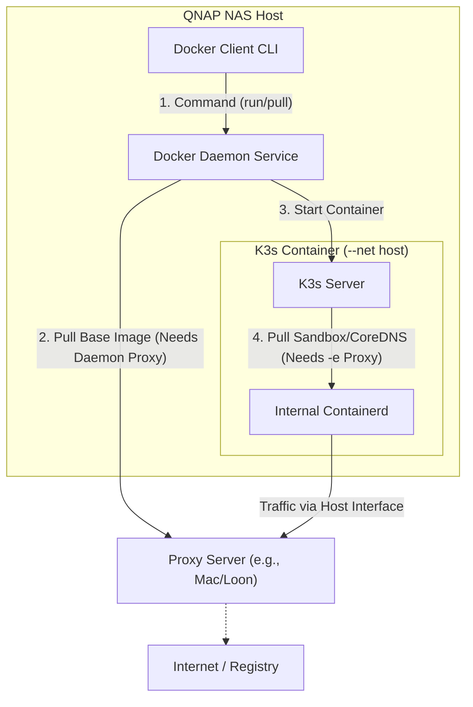

# Docker Process and Networking on QNAP NAS

This document explores the execution flow of Docker on QNAP NAS, specifically focusing on the `rancher/k3s` scenario. It clarifies the network paths, dependency resolution, and proxy configurations required at different stages (Image Pull vs. Container Runtime).

## 1. Architecture Overview: QNAP Container Station

On a QNAP NAS, **Container Station** provides the Docker environment. It differs slightly from a standard Linux installation:

*   **Docker Client (`docker` CLI)**:
    *   Location: `/share/CACHEDEV1_DATA/.qpkg/container-station/bin/docker`
    *   Role: Sends commands (like `run`, `pull`) to the Docker Daemon.
    *   Network: Does **not** perform network operations itself (except for `build` context transfer).
*   **Docker Daemon (`dockerd`)**:
    *   Role: Background process that manages containers, images, and networks. **It performs the actual `docker pull`.**
    *   Network: Uses the NAS's host network connection directly.
*   **Containers (e.g., K3s)**:
    *   Role: The actual running application.
    *   Network: Depends on the `--network` mode chosen.

---

## 2. The `docker pull` Process (Image Retrieval)

When you run `docker pull rancher/k3s:v1.21.1-k3s1`, the flow is:

1.  **Command**: You execute the command in the shell.
2.  **Request**: The Docker Client sends an API request to the Docker Daemon via a Unix socket (`/var/run/docker.sock`).
3.  **Resolution**:
    *   The Daemon checks local storage for the image.
    *   If missing, it queries the configured Registry (default: Docker Hub `index.docker.io`).
4.  **Download**: The Daemon downloads the image layers.
    *   **Dependency**: If a layer download fails (e.g., network timeout, GFW), the entire pull fails.
    *   **Network Path**: Traffic goes from **NAS Host Interface** -> **Gateway** -> **Internet**.
    *   **Proxy**: The Daemon **DOES NOT** automatically use QNAP's system proxy settings. It ignores shell environment variables like `export HTTP_PROXY` set in your SSH session.

### 🔴 Critical Point: Proxying `docker pull`
To make `docker pull` work behind a proxy, you must configure the **Docker Daemon** itself.

*   **Standard Linux**: Edit `/etc/systemd/system/docker.service.d/http-proxy.conf`.
*   **QNAP Container Station**: Since QNAP often resets system files or lacks standard systemd paths, you usually need to modify the startup script or inject the environment into the daemon's start sequence.
    *   *Refer to `docker-proxy.md` in this directory for the specific QNAP hack involving `docker.service.d` or `daemon.json`.*

---

## 3. The `docker run` Process (Container Execution)

When you run `docker run ... rancher/k3s:v1.21.1-k3s1`, the flow is:

1.  **Startup**: The Daemon creates the container environment (namespaces, cgroups).
2.  **Network Mode**:
    *   **`--network host` (Recommended for K3s on NAS)**:
        *   The container shares the **exact same network stack** as the NAS.
        *   IP Address: Same as NAS IP (e.g., `192.168.31.88`).
        *   Ports: K3s listens directly on NAS ports (6443, etc.). No NAT translation needed.
        *   **Traffic**: Outbound traffic from K3s looks exactly like traffic from the NAS OS itself.
    *   **`--network bridge` (Default)**:
        *   Container gets an internal IP (e.g., `172.17.0.2`).
        *   Traffic is NATed through the NAS IP.
        *   Requires `-p` port mapping.

### 🔴 Critical Point: Proxying the Container (K3s)
Even if the Daemon has a proxy configured for *pulling* the base image, the **running container** does NOT inherit this proxy automatically.

**Scenario**: K3s starts up. It needs to pull internal images (sandbox `pause`, `coredns`, `traefik`) from registries like `k8s.gcr.io` or `docker.io`.
*   **If missing proxy**: K3s will fail to pull these internal images, resulting in `ImagePullBackOff` for system pods.
*   **Solution**: You must pass proxy variables **into the container** at runtime.

```bash
docker run -d --name k3s \
  --network host \
  -e HTTP_PROXY="http://192.168.31.198:7222" \
  -e HTTPS_PROXY="http://192.168.31.198:7222" \
  -e NO_PROXY="localhost,127.0.0.1,192.168.0.0/16,10.0.0.0/8" \
  rancher/k3s:v1.21.1-k3s1 server
```

---

## 4. Summary of Dependencies & Flows

| Action | Component Responsible | Network Identity | Proxy Configuration Location |
| :--- | :--- | :--- | :--- |
| **`docker pull`** | **Docker Daemon** (`dockerd`) | NAS Host IP | Daemon Config (`daemon.json` or `systemd` env) |
| **`docker run`** | **Docker Client** (`docker`) | N/A (API Call) | Shell Env (only affects client-server comms, rarely needed) |
| **K3s Startup** | **Container Process** (k3s) | NAS Host IP (if `--net host`) | **`-e HTTP_PROXY` flags in `docker run`** |
| **K3s Pulling Images** | **Containerd** (inside K3s) | NAS Host IP (if `--net host`) | Inherits from K3s Container Env (`-e` flags) |

## 5. QNAP Specific Path Analysis

You mentioned: `/share/CACHEDEV1_DATA/.qpkg/container-station/bin/docker`

*   **Setting Proxy on this binary**:
    *   Running `export HTTP_PROXY=...` before running this binary **ONLY** affects the client.
    *   It **WILL NOT** help `docker pull` (because the Daemon does the work).
    *   It **WILL NOT** help the container (unless you explicitly pass `-e`).

*   **Correct Strategy for QNAP**:
    1.  **For Pulling Images**: Configure the Daemon (Global setting).
    2.  **For Running K3s**: Pass `-e HTTP_PROXY` args in your `docker run` command. This ensures K3s can reach the internet to fetch its dependencies.

## 6. Diagram: Network Flow


