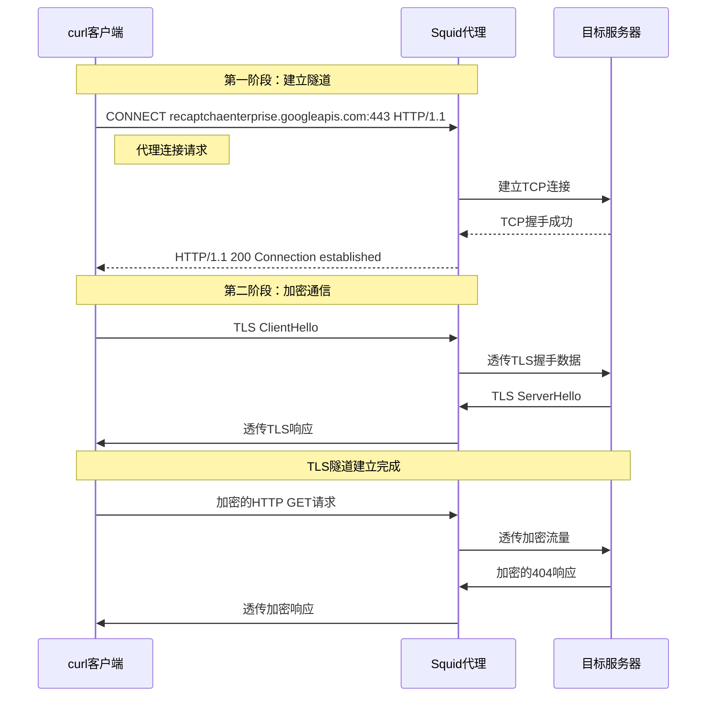

# my request
- error
```bash
$ curl -v recaptchaenterprise.googleapis.com:443 -x my.squid.proxy.aibang:3128
* Trying 192.168.1.133:3128...
* Connected to my.squid.proxy.aibang (192.168.1.133) port 3128 (#0)
> GET http://recaptchaenterprise.googleapis.com:443/ HТТР/1.1
> Host: recaptchaenterprise.googleapis.com: 443
> User-Agent: curl/8.1.2
› Accept: */*
> Proxy-Connection: Keep-Alive
>
< НTTP/1.1 502 Bad Gateway
< Server: squid/4.15
< Mime-Version: 1.0
< Date: Wed, 12 Feb 2025 09:59:59 GMT
Content-Type: text/html;charset=utf-8
‹ Content-Length: 3597
X-Squid-Error: ERR_ZERO_SIZE_OBJECT o
< Vary: Accept-Language < Content-Language: en
< X-Cache: MISS from proxy-instance < X-Cache-Lookup: MISS from proxy-instance: 3128
‹ Via: 1.1 proxy-instance (squid/4.15)
< Connection: keep-alive
```
---
- success 
```bash
$ curl -v https://recaptchaenterprise.googleapis.com:443 -x my.squid.proxy.aibang:3128
* Trying 192.168.1.133:3128...
* Connected to my.squid.proxy.aibang (192.168.1.133) port 3128 (#0)
* CONNECT tunnel: HTTP/1.1 negotiated
* allocate connect buffer
* Establish HTTP proxy tunnel to recaptchaenterprise.googleapis.com:443
> CONNECT recaptchaenterprise.googleapis.com:443 HTTP/1.1
> Host: recaptchaenterprise.googleapis.com:443
> User-Agent: curl/8.1.2
> Proxy-Connection: Keep-Alive
>

< HTTP/1.1 200 Connection established
<
* CONNECT phase completed
* CONNECT tunnel established, response 200
* schannel: disabled automatic use of client certificate
* using HTTP/1.x
> GET / HTTP/1.1
> Host: recaptchaenterprise.googleapis.com
> User-Agent: curl/8.1.2
> Accept: */*
>

< HTTP/1.1 404 Not Found
< Date: Wed, 12 Feb 2025 10:28:17 GMT
< Content-Type: text/html; charset=UTF-8
< Server: scaffolding on HTTPServer2
< Content-Length: 1561
< X-XSS-Protection: 0
< X-Frame-Options: SAMEORIGIN
< X-Content-Type-Options: nosniff
<
```
# Deepseek
以下是对两个请求的分析及正确的CONNECT方法可视化：

# 请求差异分析

| 特征                | 失败请求 (502)                                                                 | 成功请求 (404)                                                                 |
|---------------------|-------------------------------------------------------------------------------|-------------------------------------------------------------------------------|
| 协议类型            | 明文HTTP请求到443端口                                                        | HTTPS加密连接                                                                 |
| 代理交互方式        | 直接发送HTTP GET请求                                                          | 先建立CONNECT隧道                                                             |
| Squid处理方式       | 尝试代理HTTP请求到HTTPS端口                                                   | 仅建立TCP隧道，不干预加密流量                                                 |
| 错误原因            | 协议不匹配（HTTP over TLS端口）                                               | 隧道成功建立，404是目标服务器响应                                             |
| 关键头部            | `Proxy-Connection: Keep-Alive`                                                | `CONNECT`方法                                                                 |
| Squid配置影响       | 需要允许HTTP到HTTPS端口的转换                                                 | 需要允许CONNECT到443端口                                                      |
| 实际通信层次        | 应用层（HTTP）                                                                | 传输层（TCP隧道）                                                             |

# CONNECT方法时序图



# 关键问题解析

1. **端口 vs 协议**：
   - 443端口是HTTPS的默认端口，但使用`http://`协议前缀时：
   ```bash
   # 实际发送明文HTTP请求（虽然到443端口）
   curl http://target:443 -x proxy:3128
   ```
   - 正确做法应显式指定协议：
   ```bash
   # 触发HTTPS处理流程
   curl https://target:443 -x proxy:3128
   ```

2. **Squid行为差异**：
   - 对于HTTP请求到443端口：
     - Squid尝试作为普通HTTP代理
     - 目标服务器期待TLS握手，但收到明文HTTP请求
     - 导致协议不匹配，返回`ERR_ZERO_SIZE_OBJECT`

   - 对于HTTPS请求：
     - 触发CONNECT隧道机制
     - Squid仅建立TCP管道，不解析加密流量
     - 实际通信由客户端-服务器直接加密协商

3. **502错误根本原因**：
   ```text
   Squid错误日志：
   ERR_ZERO_SIZE_OBJECT|HTTP:404
   ```
   - 表示代理从目标服务器收到空响应
   - 原因：服务器拒绝处理明文HTTP请求到TLS端口

4. **配置建议**：
   ```squid
   # squid.conf 关键配置
   acl SSL_ports port 443
   http_access allow CONNECT SSL_ports
   http_access deny CONNECT !SSL_ports
   ```
   - 确保允许CONNECT到443端口
   - 检查ACL规则是否过于严格

5. **404响应说明**：
   - 隧道建立成功后，curl发送了：
   ```http
   GET / HTTP/1.1
   Host: recaptchaenterprise.googleapis.com
   ```
   - 目标服务器API端点不存在根路径的GET请求处理
   - 属于正常业务逻辑错误，说明代理隧道工作正常

# Gemini

这两个 `curl` 请求的区别在于 **URL 的协议部分**。

**请求 1:**

```bash
curl -v recaptchaenterprise.googleapis.com:443 -x my.squid.proxy.aibang:3128
```

* **URL:** `recaptchaenterprise.googleapis.com:443`  **没有指定协议** (`http://` 或 `https://`)。
* **curl 的行为 (默认):**  当 URL 没有指定协议时，并且使用了代理，**curl 默认会使用 HTTP 协议来请求代理**。  它会构造一个 **HTTP 代理请求**，请求代理服务器去访问 `http://recaptchaenterprise.googleapis.com:443/`。  注意这里即使你指定了端口 `443`，但因为没有 `https://`，curl 仍然将其视为 **HTTP 请求**。
* **Squid 的行为 (502 Bad Gateway):**  Squid 收到一个 `GET http://recaptchaenterprise.googleapis.com:443/` 的 HTTP 请求，并且尝试去处理。  但是由于以下可能的原因，Squid 返回了 `502 Bad Gateway` 和 `ERR_ZERO_SIZE_OBJECT`:
    * **Squid 配置限制:**  Squid 可能被配置为 **不允许或限制 HTTP 请求访问 443 端口**。  通常 443 端口是 HTTPS 的默认端口，Squid 可能期望在这个端口上看到的是 HTTPS 连接，而不是 HTTP 请求。  Squid 的配置可能包含 `http_access deny` 规则，阻止对特定端口或目标的 HTTP 请求。
    * **Squid 认为目标服务器需要 HTTPS:**  Squid 可能内部有一些机制或配置，认为 `recaptchaenterprise.googleapis.com:443` 应该使用 HTTPS 协议。 当它尝试用 HTTP 去连接时，目标服务器可能直接断开连接或者返回错误，导致 Squid 无法获取有效的响应，最终返回 `502` 和 `ERR_ZERO_SIZE_OBJECT` (表示收到了一个零字节大小的响应，这通常意味着连接异常中断)。
    * **ERR_ZERO_SIZE_OBJECT:**  这个错误表明 Squid 在尝试获取资源时，收到了一个内容长度为零的响应。 这可能发生在多种情况下，例如：
        * 目标服务器立即关闭了连接。
        * 网络问题导致响应不完整。
        * Squid 自身处理错误导致返回空响应。

**请求 2:**

```bash
curl -v https://recaptchaenterprise.googleapis.com:443 -x my.squid.proxy.aibang:3128
```

* **URL:** `https://recaptchaenterprise.googleapis.com:443`  **明确指定了 `https://` 协议**。
* **curl 的行为 (CONNECT 隧道):**  当 URL 指定了 `https://` 协议并使用代理时，curl 会使用 **HTTP CONNECT 方法** 来建立一个 **HTTPS 隧道** 通过代理。
    * **CONNECT 请求:** curl 首先向代理服务器发送 `CONNECT recaptchaenterprise.googleapis.com:443 HTTP/1.1` 请求。 这个请求告诉代理 "我想要建立一个到 `recaptchaenterprise.googleapis.com:443` 的 TCP 连接，请你帮我建立隧道"。
    * **代理响应 200 Connection established:** 如果代理允许建立隧道，它会返回 `HTTP/1.1 200 Connection established` 响应，表示隧道建立成功。
    * **隧道建立后:**  隧道建立后，curl 和 `recaptchaenterprise.googleapis.com:443` 之间的所有通信都将 **通过这个隧道进行加密传输 (HTTPS)**。 代理服务器只负责转发 TCP 数据包，不再解析 HTTP 请求的内容。
* **Squid 的行为 (200 Connection established, 允许 CONNECT):**  Squid 接收到 `CONNECT` 请求，并且 **允许建立到 `recaptchaenterprise.googleapis.com:443` 的隧道**，返回 `200 Connection established`。 这表明 Squid 配置允许 CONNECT 请求到 443 端口 (通常 HTTPS 是默认允许的)。
* **后续 HTTP 请求和 404 Not Found:**  隧道建立成功后，curl 会在 **隧道内部** 发起实际的 HTTPS 请求 `GET / HTTP/1.1` 到 `recaptchaenterprise.googleapis.com:443`。 这次的 `404 Not Found` 是 **目标服务器 `recaptchaenterprise.googleapis.com` 返回的**，而不是 Squid。  `404 Not Found` 表示在 `recaptchaenterprise.googleapis.com` 这个域名下的根路径 `/` 上没有找到资源。 这与代理无关，而是目标服务器的响应。

**总结区别:**

| 请求类型 | URL 协议 | curl 行为 | Squid 行为 | 最终结果 | 原因分析 |
|---|---|---|---|---|---|
| 请求 1 | 无 (默认 HTTP) | HTTP 代理请求 `GET http://recaptchaenterprise.googleapis.com:443/` | 502 Bad Gateway, ERR_ZERO_SIZE_OBJECT | 失败 | Squid 可能限制 HTTP 请求到 443 端口，或认为目标应使用 HTTPS。 |
| 请求 2 | HTTPS | HTTP CONNECT 隧道，然后通过隧道发送 HTTPS 请求 | 200 Connection established (允许 CONNECT) | 目标服务器 404 Not Found (请求成功通过代理，但目标服务器找不到资源) | Squid 允许 HTTPS CONNECT 隧道，请求成功到达目标服务器，但目标服务器根路径无内容。 |

**为什么一个成功 (部分成功)，一个 502?**

* **成功 (请求 2):**  使用了 `https://` 明确告知 curl 需要 HTTPS 连接，curl 使用 `CONNECT` 方法建立隧道，Squid 允许隧道，HTTPS 连接成功建立到目标服务器。 虽然最终得到 404，但 **代理部分是成功的**。
* **502 (请求 1):**  没有指定协议，curl 默认使用 HTTP 代理请求，Squid 可能配置了限制，拒绝或无法正确处理 HTTP 请求到 443 端口，导致 502 错误。

**Squid 特殊配置限制分析:**

Squid 的配置可能包含以下类型的限制，导致请求 1 失败:

* **`http_access deny CONNECT !SSL_ports`:**  这条规则可能允许 CONNECT 请求到默认的 SSL 端口 (通常是 443)，但拒绝非 SSL 端口的 CONNECT 请求 (虽然这里不是 CONNECT 请求，但 Squid 的规则可能更复杂，影响到 HTTP 请求到 443 端口)。
* **`http_access deny port 443` (针对 HTTP):**  更直接的规则，禁止 HTTP 访问 443 端口。
* **`acl Safe_ports port 80 443 ...` 和 `http_access deny !Safe_ports` (针对 HTTP):**  Squid 通常会定义 `Safe_ports` ACL 来限制允许 HTTP 请求访问的端口。 如果 443 没有被包含在 `Safe_ports` 中，并且有 `http_access deny !Safe_ports` 规则，那么 HTTP 请求到 443 端口会被拒绝。
* **MIME 类型或内容检查规则:**  虽然不太可能直接导致 502 和 `ERR_ZERO_SIZE_OBJECT`，但某些内容检查或 MIME 类型规则的错误配置也可能间接导致问题。

**正确请求 (请求 2) 的 CONNECT 方法可视化 Sequence Diagram:**


**Sequence Diagram 解释:**

1. **curl -> Squid Proxy: CONNECT ...:**  curl 发送 `CONNECT` 请求到 Squid 代理，请求建立到 `recaptchaenterprise.googleapis.com:443` 的隧道。
2. **Squid Proxy -> curl: HTTP/1.1 200 ...:** Squid 代理允许建立隧道并响应 `200 Connection established`，确认隧道已建立。
3. **Tunnel Established (Note):**  此时，curl 和 `recaptchaenterprise.googleapis.com:443` 之间建立了一条加密的隧道，Squid 代理只负责转发数据，不再解析内容。
4. **curl -> Target Server: GET ... (Encrypted HTTPS):** curl 通过建立的隧道，向 `recaptchaenterprise.googleapis.com:443` 发送加密的 HTTPS `GET /` 请求。
5. **Target Server -> curl: HTTP/1.1 404 ... (Encrypted HTTPS):**  目标服务器 `recaptchaenterprise.googleapis.com:443` 处理 HTTPS 请求，并返回 `404 Not Found` 响应 (也是通过加密隧道返回)。
6. **HTTPS Communication through Tunnel (Note):**  后续的 HTTPS 通信都通过这个隧道进行，保证了安全性和隐私。

**总结:**

要成功通过 Squid 代理访问 HTTPS 站点，**必须在 URL 中明确指定 `https://` 协议**，curl 才会使用 `CONNECT` 方法建立隧道。  如果你不指定协议或错误地使用 `http://`，可能会导致 Squid 代理因为配置限制或协议不匹配而返回错误，例如 502 Bad Gateway。  请求 2 的成功 (代理层面) 验证了 Squid 允许 HTTPS CONNECT 隧道，但最终的 404 Not Found 是目标服务器的响应，与代理无关。


