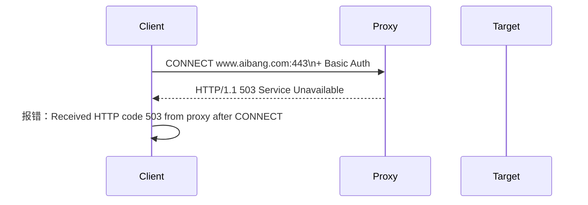

你遇到的 503 Service Unavailable 是由 代理服务器（inpproxy.aibang.com:8080）返回的，而不是目标站点 www.aibang.com。这意味着连接还没有真正建立到目标 HTTPS 服务，错误已经发生在 CONNECT 隧道握手阶段。

⸻

⚠️ 核心信息提取：

* Received HTTP code 503 from proxy after CONNECT

表示你的 curl 使用 --proxy 连接代理服务器，在通过 CONNECT 方式建立 HTTPS 隧道到目标地址 www.aibang.com:443 时，被代理拒绝。

⸻

✅ 请求流程图


⸻

🎯 可能的原因分析：

原因分类	详细说明
🔒 代理认证失败	提供的 Authorization: Basic Passwd 无效（比如格式错误、账号无权限访问目标域名）
🚫 ACL/IP拦截	代理对访问的目标地址 www.aibang.com:443 有域名或IP黑名单限制
🔧 代理内部服务异常	代理本身负载过高、内部连接池用尽、SSL转发配置错误
🌐 DNS 问题	代理无法解析 www.aibang.com 的 DNS
🧱 防火墙	公司出口防火墙对 www.aibang.com 做了拦截，代理请求出去时被拒绝
⚠️ 拼写错误	你命令中有两个问题（后面会说）导致请求格式异常或目标路径错误，代理解析失败也可能返回 503


⸻

🚑 你的命令存在两个问题：
```bash
curl --key ./cn-cn-aibang-client.key \
     --cert ./cn-cn-aibang-client.cer \
     --request GET \
     --url https://www.aibang.com/health/v1/.well_know \
     --header 'Authorization: Basic Passwd' \
     --proxy inpproxy.aibang.com:8080


```
⸻

✅ 建议排查步骤
	1.	确认 Authorization 格式正确：

echo -n 'username:password' | base64

并使用：

--header "Proxy-Authorization: Basic <base64-encoded>"


	2.	更换 curl 版本进行测试（你的是 curl 7.29，较旧）
	3.	排查 Proxy 限制域名：
例如尝试：

curl --proxy inpproxy.aibang.com:8080 https://www.google.com


	4.	联系网络管理员 检查该 Proxy 是否允许访问 www.aibang.com

⸻

📌 结论：

你这个 503 是代理在 CONNECT 阶段拒绝建立隧道，通常是认证、ACL限制或配置问题，与目标服务 www.aibang.com 本身无关。

如果需要进一步诊断，建议抓包 (tcpdump) 或请求网络团队查看 Proxy 的访问日志。

如果你需要我帮你写一个 curl 脚本，带上代理、mTLS 和 Basic Auth 的标准写法，我也可以帮你生成。