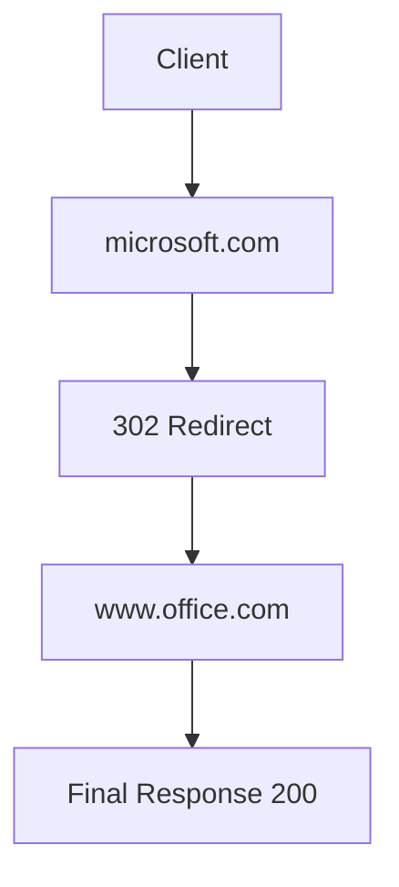

这种现象在网络和代理场景里，一般可以这样理解和表达：

域名级访问 ≠ 实际最终访问域名
实际请求过程中可能存在 重定向链（Redirect Chain）/ 间接依赖域名（Indirect Domain Dependency）。

你描述的现象本质不是“递归”，而更接近 HTTP Redirect / Domain Dependency / Upstream Domain Expansion 这类概念。

⸻

现象本质

当你允许访问：

microsoft.com

但真实访问过程中浏览器或 curl 发现：

microsoft.com → 302 → www.office.com → 200

这说明：
	•	microsoft.com 只是入口域名
	•	实际业务落在 www.office.com
	•	你的代理只放行了入口域名，没有放行“后续跳转域名”

⸻

更准确的术语

在架构 / 安全 / SRE 文档中，可以用以下表达：

术语	推荐程度	含义
HTTP Redirect Chain	⭐⭐⭐⭐⭐	HTTP 302/301 多次跳转
Domain Dependency	⭐⭐⭐⭐	域名依赖关系
Upstream Domain Expansion	⭐⭐⭐	上游域名扩展
Recursive Domain	⭐	不太准确，容易误解为 DNS 递归

最推荐：

Domain Redirect Chain
Indirect Domain Dependency

⸻

Curl 为什么能看到？

因为：

curl -sL https://microsoft.com

参数含义：

参数	含义
-s	silent
-L	follow redirect

-L 会自动跟随 30x 跳转，所以你能看到最终结果。

如果去掉 -L：

curl -I https://microsoft.com

你会看到：

HTTP/1.1 302 Found
Location: https://www.office.com/

⸻

从代理 / 防火墙视角

这类场景属于：

Domain Allowlist 不完整导致的间接访问失败

也可以在平台文档中这样描述：
	•	Primary Domain：用户配置的域名
	•	Secondary Domain：实际跳转域名
	•	Implicit Domain Dependency：隐式域名依赖

⸻

流程示意图

⸻

在平台/安全策略里的专业表达示例

可以写成：

当前策略仅允许 Primary Domain，但未覆盖其 Redirect Chain 中的 Secondary Domain，导致访问失败。建议扩展 Allowlist 以包含 Indirect Domain Dependencies。

或者更工程化一点：

该域名存在 HTTP Redirect Chain，需要在出口代理策略中增加后续跳转域名白名单。

⸻

总结一句话

这不是递归，而是：

HTTP Redirect Chain 引发的隐式域名依赖问题（Implicit Domain Dependency）

可以这样用英文表达，既专业又容易被同事理解。下面给你一封可直接发给同事的示例说明邮件：

Hi Team,

We’ve identified that allowing only the primary domain is not sufficient in some cases, because the initial request may be redirected to one or more secondary domains during the HTTP redirect chain.

To ensure the full access path works correctly through the proxy, we need to allow not only the Primary Domain, but also all Secondary Domains that appear in the redirect chain or are indirectly required by the service.

In other words, the proxy allowlist should cover:
	•	The entry domain (Primary Domain)
	•	Any downstream or redirected domains (Secondary / Redirect Domains)
	•	Indirect domain dependencies discovered during request tracing

Without including these additional domains, the request may fail even though the main domain is already permitted.

Therefore, the recommended configuration approach is to expand the allowlist to include all domains observed in the redirect chain to maintain end-to-end connectivity.

Best regards,

我们发现，在某些情况下，仅允许主域名是不够的，因为在HTTP重定向链中，初始请求可能会被重定向到一个或多个次级域名。为确保通过代理的完整访问路径能正常工作，我们不仅需要允许主域名，还需要允许重定向链中出现的所有次级域名，以及服务间接需要的所有次级域名。

换句话说，代理允许列表应包含：
• 入口域名（主域名）
• 任何下游或被重定向的域名（次级/重定向域名）
• 在请求追踪过程中发现的间接域名依赖项

如果不包含这些额外的域名，即使主域名已被允许，请求也可能失败。因此，建议的配置方法是扩展允许列表，将重定向链中观察到的所有域名都包含进来，以维持端到端的连接。

如果只是口头或在聊天工具里一句话解释，可以用更短的版本：

Short Version（口头/IM）：
“We need to allow not only the primary domain but also any secondary domains in the HTTP redirect chain, otherwise the request may fail even though the main domain is already whitelisted.”

我们不仅需要允许主域名，还需要允许HTTP重定向链中的任何次域名，否则即使主域名已被列入白名单，请求也可能失败。