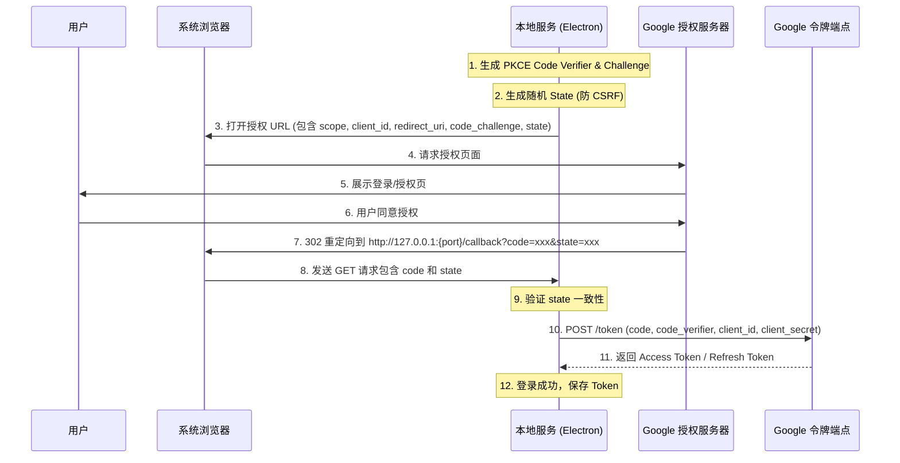

# OAuth 2.0 Authorization Code Flow for Native Apps (RFC 8252)

本文档详细描述了 Native App（如 Electron 应用）通过 OAuth 2.0 获取 Google 访问令牌的标准流程，以及常见网络问题的排查指南。

## 1. 核心流程分析

你提供的流程图描述了 **Loopback IP Address** 模式，这是 RFC 8252 推荐的 Native App 授权方式。

### 标准流程图 (Mermaid)



### 关键组件说明

1.  **PKCE (Proof Key for Code Exchange)**:
    *   **作用**: 防止授权码（Authorization Code）被恶意程序拦截。
    *   **机制**: 在第 3 步发送 `code_challenge`，第 10 步发送原始 `code_verifier`，Google 验证两者匹配才颁发 Token。
    *   **建议**: 虽然 Google 目前对部分旧客户端不强制 PKCE，但**强烈建议**在 Electron 应用中实现 PKCE 以提高安全性。

2.  **State 参数**:
    *   **作用**: 防止 CSRF 攻击。
    *   **机制**: 生成随机字符串随请求发送，回调时验证返回的 `state` 是否与发送的一致。

3.  **Loopback Redirect URI**:
    *   通常使用 `http://127.0.0.1:{random_port}/callback`。
    *   **注意**: 避免使用 `localhost`，推荐显式使用 `127.0.0.1` 以避免 DNS 解析问题。

---

## 2. 故障排查指南 (Troubleshooting)

### 🔴 错误 1: `Proxy connection ended before receiving CONNECT response`

**现象**:
```log
[OAuth] Token exchange failed: GaxiosError: request to https://oauth2.googleapis.com/token failed, reason: Proxy connection ended before receiving CONNECT response
```

**原因分析**:
*   **Node.js 网络环境**: Electron 的主进程（Main Process）运行在 Node.js 环境中，它发出的 HTTP 请求（如使用 `axios`, `node-fetch`, or `google-auth-library`）默认**不会自动**完全遵循系统的代理设置，或者遵循了错误的环境变量。
*   **代理中断**: 你的请求尝试通过一个代理服务器（可能是系统默认代理，如 127.0.0.1:7890），但在建立 HTTPS 隧道（CONNECT 方法）时，代理服务器关闭了连接。
*   **常见场景**: 本地开启了 VPN/代理软件，但 Node.js 客户端配置不当，或者代理软件不稳定。

**解决方案**:

1.  **检查环境变量**:
    确保启动 Electron 时，环境变量中包含正确的代理配置。
    ```bash
    export http_proxy=http://127.0.0.1:7890
    export https_proxy=http://127.0.0.1:7890
    # 注意：Node.js 对大写 HTTPS_PROXY 更敏感，建议大小写都设置
    ```

2.  **在代码中显式配置代理 (推荐)**:
    如果使用 `axios` 或 `google-auth-library`，建议显式传入 `httpsAgent`。
    ```javascript
    const { HttpsProxyAgent } = require('https-proxy-agent');
    const axios = require('axios');

    // 自动检测系统代理或硬编码
    const proxyUrl = process.env.HTTPS_PROXY || 'http://127.0.0.1:7890';
    
    const agent = new HttpsProxyAgent(proxyUrl);

    const res = await axios.post('https://oauth2.googleapis.com/token', data, {
      httpsAgent: agent,
      // ...其他配置
    });
    ```

3.  **关闭 SSL 验证 (仅调试用)**:
    如果代理涉及自签名证书（如 Charles/Fiddler），可能需要临时关闭验证（**生产环境禁止**）：
    ```javascript
    process.env.NODE_TLS_REJECT_UNAUTHORIZED = '0';
    ```

---

### 🔴 错误 2: `net_error -101 (ERR_CONNECTION_RESET)` / SSL Handshake Failed

**现象**:
```log
[76223:0215/181811.501900:ERROR:net/socket/ssl_client_socket_impl.cc:916] handshake failed; returned -1, SSL error code 1, net_error -101
```

**原因分析**:
*   **网络阻断**: `-101` 是 `ERR_CONNECTION_RESET`。在中国大陆地区访问 `googleapis.com` 若不经过代理，TCP 连接会被 GFW 重置（RST 包）。
*   **代理不稳定**: 即使配置了代理，如果代理服务器与 Google 的连接不稳定，或者代理协议握手超时，也会导致 SSL 握手失败。
*   **Electron Chromium 网络栈**: 此错误日志来自 Chromium 网络层（Electron 的底层），说明是渲染进程或使用了 Chromium 网络栈发起的请求失败。

**解决方案**:

1.  **确保全局/规则模式正确**:
    确保你的代理软件（Clash, V2Ray 等）规则中，`googleapis.com` 走的是代理（Proxy/Global），而不是直连（Direct）。

2.  **Electron 应用代理设置**:
    Electron 可能会读取系统代理，但有时需要显式通过 API 设置。
    ```javascript
    // 在 main process 中应用启动时
    app.whenReady().then(() => {
    // 强制走本地代理
        session.defaultSession.setProxy({
            mode: 'fixed_servers',
            proxyRules: 'http=127.0.0.1:7890;https=127.0.0.1:7890'
        });
    });
    ```
    *注意*: 这会影响 `BrowserWindow` 和 `net` 模块的请求。Node.js 原生模块 (`http`/`https`/`axios`) 不受此 API 影响，需按错误 1 的方案处理。

3.  **检查本地防火墙/杀毒软件**:
    有时本地安全软件会拦截并重置加密连接。

## 总结

你的流程设计是正确的。遇到的问题核心在于 **Node.js/Electron 环境下的网络代理配置**。

*   **Token 交换失败** 是因为 Node.js 进程没走通代理 -> **修复代码中的 Agent 配置**。
*   **SSL 错误** 是因为网络层连接被重置 -> **检查代理软件规则和连通性**。


在 Loon 里，你的目标不是“让 Google 直连”（因为网络本身不可达），而是：

让 OAuth 走「纯代理隧道」，不要走 MITM / HTTPS 解密。

也就是：允许 Proxy，但禁止证书劫持。

下面给你一个最稳的配置思路。

⸻

一、核心原则

在 Loon 里需要满足两点：
	1.	googleapis.com / accounts.google.com 必须走代理
	2.	绝对不能进入 MITM 列表

否则 Electron / Node 一定 TLS 握手失败。

⸻

二、规则层（Rule）配置

在 Rule 里加一组 强制走代理 的域名规则（顺序要靠前）：

DOMAIN-SUFFIX,googleapis.com,Proxy
DOMAIN-SUFFIX,gstatic.com,Proxy
DOMAIN-SUFFIX,google.com,Proxy
DOMAIN-SUFFIX,accounts.google.com,Proxy

说明：
	•	Proxy 是你实际使用的策略组名（例如 🚀 Proxy）
	•	这一步的意义是：保证能出国访问

⸻

三、MITM（最关键）

进入：

Loon → MITM → Domain

必须确保 没有 以下域名：

googleapis.com
google.com
gstatic.com
accounts.google.com

如果存在，删除。

⸻

四、HTTPS 解密开关

路径：

Loon → MITM → Enable HTTPS Decryption

两种安全做法：

做法 A（推荐）

开启 MITM，但 Google 域名不在列表里

做法 B（最干净）

直接关闭 MITM：

Disable HTTPS Decryption


⸻

五、为什么不能 MITM Google OAuth？

OAuth Token 阶段是：

Electron → TLS → oauth2.googleapis.com

如果 MITM：

Loon 伪造证书
→ Electron 不信任
→ TLS handshake fail
→ net_error -101

浏览器能过是因为：
	•	iOS/macOS Keychain 信任
	•	Electron/Node 不一定信任

⸻

六、验证是否成功

可以用两种方式：

方式 1：看 Loon 连接日志

目标域名应显示：

CONNECT oauth2.googleapis.com:443

而不是：

MITM oauth2.googleapis.com


⸻

方式 2：openssl 测试

openssl s_client -connect oauth2.googleapis.com:443

正常颁发者应包含：

Google Trust Services

如果看到：

Loon CA

说明仍在 MITM。

⸻

七、一个稳定配置模型

可以理解为三层：

Rule:     Google → Proxy
MITM:     Google → 排除
Proxy:    CONNECT 隧道


⸻

八、常见误区

错误做法	结果
Google 设为 DIRECT	直接连不上
Google 加入 MITM	TLS 握手失败
全局 MITM	Electron 登录必炸
不写 Rule	可能走国内直连失败


⸻

一句话总结

在 Loon 中的正确姿势不是“Google 直连”，而是：

Google 走代理，但绝不走 MITM。
只要看到的是 CONNECT 隧道而不是 MITM，OAuth 就能稳定工作。

---

## 勘误与补充（保持原文不变）

下面是对“OAuth2 正确认证逻辑和过程”的补充说明，以及对原文中可能引发实现偏差的点做的纠正。该段仅追加用于对比，不修改原文内容。

### 1) 先澄清：OAuth 2.0 不是“认证”，是“授权”

- OAuth 2.0 Authorization Code Flow 的产物是 `access_token`（以及可选的 `refresh_token`），用于访问资源服务器 API，不等价于“用户已完成身份认证”。  
- 如果你的业务目标是“确认用户是谁”（登录态/身份），通常应使用 OpenID Connect（OIDC）：在授权请求中加入 `scope=openid ...`，并在回调/换 token 后获取并校验 `id_token`（JWT），身份以 `id_token` 为准，`access_token` 用于调用 Google API。

### 2) 原流程图里 `client_secret` 的位置容易误导（Native App 通常是 Public Client）

你在第 10 步写了：

`POST /token (code, code_verifier, client_id, client_secret)`

对 RFC 8252 的 Native App（桌面/Electron）而言，更准确的逻辑是：

- Native App 属于 **Public Client**：`client_secret` 无法保密，协议设计上不应依赖 `client_secret` 来证明客户端身份。
- 正确的防护手段是 **PKCE**（建议视为必选）：`code_challenge(S256)` + `code_verifier`。

更标准的 token 交换请求字段通常是（表单参数示例）：

- `grant_type=authorization_code`
- `code=...`
- `redirect_uri=http://127.0.0.1:<port>/callback`（或你的实际 redirect URI）
- `client_id=...`
- `code_verifier=...`

说明：

- 某些厂商文档/SDK 仍会出现 `client_secret` 字段（历史兼容或控制台发放形式），但对 Native App 不应把它当成“秘密”或安全边界，更不应基于它做强安全假设。

### 3) `redirect_uri`：`127.0.0.1` vs `localhost` 的建议需要加前提

原文建议“避免使用 `localhost`，推荐显式 `127.0.0.1`”。补充更准确的表述：

- RFC 8252 推荐 Loopback Redirect（`127.0.0.1` / `::1` + 随机端口）是对的。
- 但**是否能用 `127.0.0.1`**取决于 OAuth 提供方的控制台/客户端类型配置与允许的 redirect URI 规则。
- 对 Google 而言，很多情况下“Desktop App”客户端在控制台里默认/推荐的 redirect URI 是 `http://localhost`（允许动态端口）。如果你使用 `127.0.0.1`，需要确认 Google 控制台是否允许并已配置匹配（否则会在授权或换 token 阶段失败）。

建议落地写法：

- 以“提供方允许的 redirect URI 规则”为准；如果提供方支持 `127.0.0.1`，优先用 `127.0.0.1`/`::1`；如果控制台只支持 `localhost` 的模式，则按其要求使用 `localhost`。

### 4) `state` 的作用不只 CSRF：也用于“会话绑定/防混淆”

原文对 `state` 的描述方向是对的，补充两点实现要求：

- `state` 应和“本次登录会话”绑定（例如只允许一次性使用），回调校验通过后立即作废。
- 回调处理要覆盖拒绝授权/异常路径：例如 `error=access_denied`、`state` 缺失、`code` 缺失等。

### 5) PKCE 落地细节（建议明确写成强制 S256）

补充实现要点，避免“实现了但不安全”：

- `code_challenge_method` 建议固定为 `S256`（不要用 plain）。
- `code_verifier` 按 RFC 7636 生成（高熵随机，长度/字符集符合要求），不要用可预测字符串。

### 6) 刷新令牌（Refresh Token）获取条件与存储建议

原文第 11 步提到会返回 Refresh Token，但在 Google 实际落地中经常会踩坑，建议补充：

- 需要 `access_type=offline` 才可能拿到 `refresh_token`（取决于提供方与账号策略）。
- Google 场景下若用户已授权过，后续可能不再返回 `refresh_token`；通常需配合 `prompt=consent`（或清理授权）才能再次发放（具体受 Google 策略影响）。
- `refresh_token` 必须安全存储（macOS Keychain / Windows DPAPI 等），不要明文落盘。

### 7) 代理排障补充：别让 Loopback 回调也走代理

你排障部分主要聚焦 “token 交换阶段走代理”，建议再补一句常见坑：

- 为避免本地回调 `http://127.0.0.1` / `http://localhost` 被错误地代理出去，可设置 `NO_PROXY=127.0.0.1,localhost`（或对应语言/库的 no-proxy 机制）。

### 8) 其他建议（可选）

- 若你的目标是“登录并识别用户”，建议在文档里显式写清：`access_token` 用于调用 API，身份以 OIDC `id_token` 校验为准，并说明校验点（`iss/aud/exp/nonce` 等）。
- 本地回调服务建议“单次请求后立刻关闭监听端口”，减少被同机其他进程探测/抢占的窗口。
