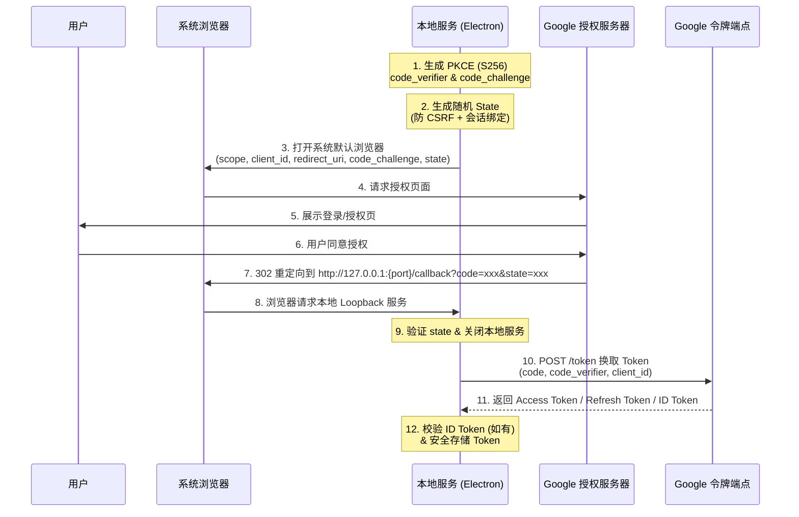
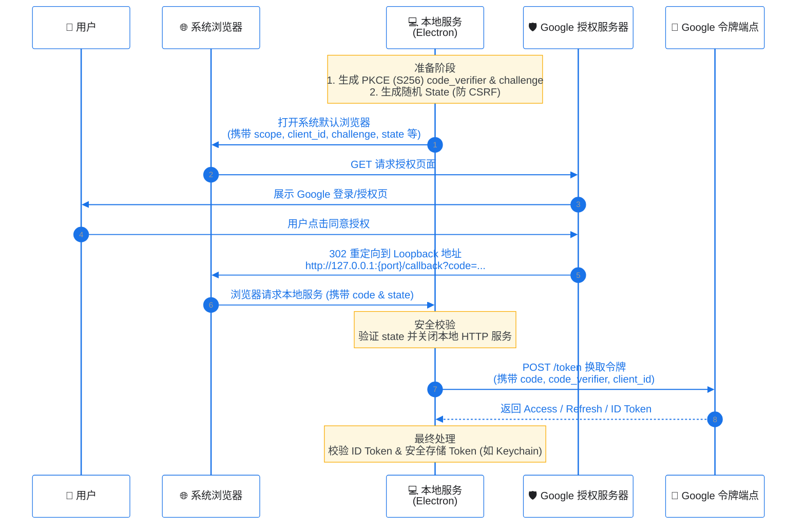

- export NODE_TLS_REJECT_UNAUTHORIZED=0
- `./Electron --open-url "antigravity://auth"`
- `./Electron --open-url "antigravity://auth" --ignore-certificate-errors`
- trace-warningsis这个好像没用
# OAuth 2.0 Authorization Code Flow for Native Apps (RFC 8252)


```bash
# Clash/V2Ray 代理示例（端口7890）
export HTTP_PROXY=http://127.0.0.1:7222
export HTTPS_PROXY=http://127.0.0.1:7222
export ALL_PROXY=socks5://127.0.0.1:7221  # 可选，SOCKS代理

./Electron --open-url "antigravity://auth"


./Electron \
  --proxy-server="http://127.0.0.1:7222" \
  --proxy-bypass-list="localhost;127.0.0.1;*.local" \
  --ignore-certificate-errors \
  --open-url "antigravity://auth"


```


./Electron \
  --proxy-server="http://127.0.0.1:7890" \
  --proxy-bypass-list="localhost;127.0.0.1;*.local" \
  --ignore-certificate-errors \
  --open-url "antigravity://auth"


- [RFC 8252: OAuth 2.0 for Native Apps](https://datatracker.ietf.org/doc/html/rfc8252)

本文档详细描述了 Native App（如 Electron 应用）通过 OAuth 2.0 获取 Google 访问令牌的标准流程，特别针对网络代理环境下的配置与排查进行了深度优化。

## 1. 核心流程分析 (Loopback Loop Flow)

采用 **Loopback IP Address** 模式，这是 RFC 8252 推荐的 Native App 授权方式。

### 1.1 标准流程图 (Mermaid)


---

### 1.2 关键组件与安全规范

1.  **Public Client 身份**:
    *   Native App 是 **Public Client**，无法安全保存 `client_secret`。
    *   **切勿** 在代码中硬编码 `client_secret` 用于身份证明。
    *   安全依赖于 **PKCE** 和 **Redirect URI** 匹配。

2.  **PKCE (Proof Key for Code Exchange)** (强制):
    *   **机制**: 必须使用 `code_challenge_method=S256`。
    *   **生成**: `code_verifier` 需为高熵随机字符串（43-128字符），`code_challenge` 为其 SHA256 哈希的 Base64URL 编码。

3.  **State 参数**:
    *   **作用**: 除了防止 CSRF，还应与**本地会话绑定**。无论是从内存还是持久化存储中，验证回调的 `state` 必须与发起时的一致。
    *   **处理**: 验证通过后立即作废，防止重放。

4.  **Redirect URI (Loopback)**:
    *   **规范**: RFC 8252 推荐使用 `http://127.0.0.1:{random_port}/callback`。
    *   **实践**: 
        *   优先使用 `127.0.0.1` 避免 DNS 解析风险。
        *   **注意**: 需确认 Google Cloud Console 中 Client ID 配置是否允许 `127.0.0.1`。部分旧 Client ID 可能仅支持 `localhost`。以控制台允许的配置为准。

## 2. 网络配置指南 (Loon / Proxy & MITM)

在受限网络环境下（如需通过代理访问 Google），**“SSL 错误”** (Connection Reset / Handshake Failed) 是最常见的问题。

### 核心原则
在代理软件（如 Loon, Surge, Clash）中，OAuth 2.0 流量必须满足：
1.  **必须走代理 (Proxy)**：访问 `googleapis.com` 等域名。
2.  **绝对禁止 MITM (HTTPS 解密)**：Native App 无法信任代理软件自签发的 CA 证书。

### Loon 配置最佳实践

#### 1. 规则层 (Rule)
确保 Google 相关域名强制走代理隧道：
```text
DOMAIN-SUFFIX,googleapis.com,Proxy
DOMAIN-SUFFIX,gstatic.com,Proxy
DOMAIN-SUFFIX,google.com,Proxy
DOMAIN-SUFFIX,accounts.google.com,Proxy
```

#### 2. MITM 设置 (❌ 关键排错点)
进入 `Loon -> MITM -> Domain`，**必须删除**以下域名（如果存在）：
*   `googleapis.com`
*   `google.com`
*   `gstatic.com`
*   `accounts.google.com`

**推荐策略**: 开启 MITM 功能，但将 Google 域名排除在 Hostname 列表之外。

#### 3. 验证方法
*   **查看日志**: 请求 `oauth2.googleapis.com:443` 时，Loon 日志应显示 `CONNECT` 方法，而**不是** `MITM`。
*   **OpenSSL 测试**:
    ```bash
    openssl s_client -connect oauth2.googleapis.com:443
    ```
    正常证书颁发者应为 `Google Trust Services`，而非 `Loon CA`。

## 3. 开发实现故障排查

### 🔴 错误 1: `Proxy connection ended before receiving CONNECT response`
*   **原因**: Node.js/Electron 主进程未走代理，或代理配置错误。
*   **解决**:
    1.  **显式代理**: 在代码中使用 `https-proxy-agent`。
    2.  **环境变量**: 确保 `HTTPS_PROXY=http://127.0.0.1:7890` 已被 Node 进程读取。
    3.  **本地回调隔离**: 确保本地 Loopback 请求**不走代理**。设置 `NO_PROXY=127.0.0.1,localhost`。

### 🔴 错误 2: `net_error -101 (ERR_CONNECTION_RESET)`
*   **原因**: 
    1.  流量未走代理，直连被阻断。
    2.  流量走了代理，但被代理软件进行了 **MITM (HTTPS 解密)**，导致 Electron 底层证书校验失败。
*   **解决**: 参考上述 [Loon 配置最佳实践](#loon-配置最佳实践)，将 Google 域名移出 MITM 列表。

## 4. 补充说明 (Errata)

*   **RefreshToken**: 需显式请求 `access_type=offline` 及 `prompt=consent` 才可获取。
*   **Security**: Refresh Token 属于高敏感凭据，必须使用系统级安全存储（macOS Keychain, Windows DPAPI），严禁明文存文件。
*   **Identity**: OAuth2 `access_token` 仅用于授权 API 调用。如需验证“当前用户是谁”，请使用 OpenID Connect (OIDC) 流程解析 `id_token`。
