# 10 Popular Network Protocols Explained with Diagrams

This document explains 10 fundamental network protocols with visual diagrams to help understand their flow and interactions.

## 1. HTTP/HTTPS (HyperText Transfer Protocol)

HTTP is the foundation of data communication on the World Wide Web. HTTPS adds SSL/TLS encryption for security.

### HTTP Request-Response Flow

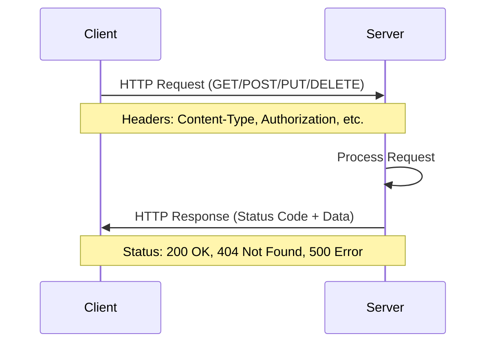
```mermaid
sequenceDiagram
    participant Client
    participant Server

    Client->>Server: HTTP Request (GET/POST/PUT/DELETE)
    Note over Client,Server: Headers: Content-Type, Authorization, etc.
    Server->>Server: Process Request
    Server->>Client: HTTP Response (Status Code + Data)
    Note over Client,Server: Status: 200 OK, 404 Not Found, 500 Error
```

### HTTPS Handshake Process

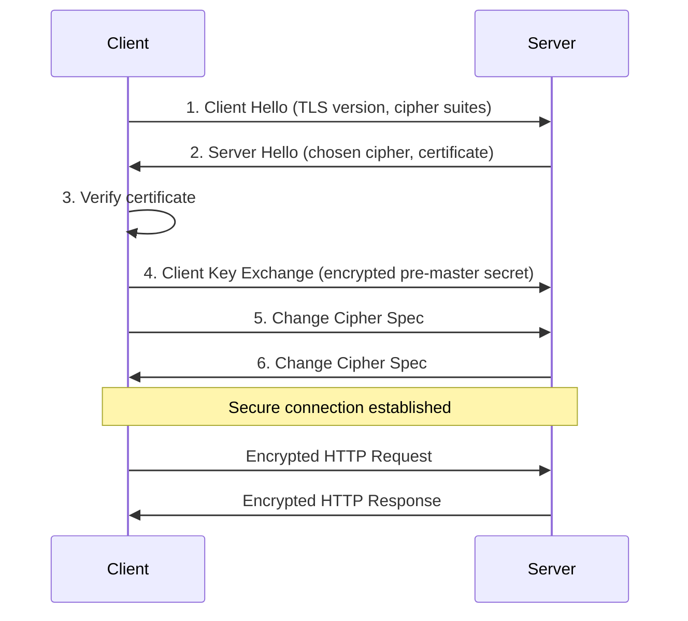
```mermaid
sequenceDiagram
    participant Client
    participant Server

    Client->>Server: 1. Client Hello (TLS version, cipher suites)
    Server->>Client: 2. Server Hello (chosen cipher, certificate)
    Client->>Client: 3. Verify certificate
    Client->>Server: 4. Client Key Exchange (encrypted pre-master secret)
    Client->>Server: 5. Change Cipher Spec
    Server->>Client: 6. Change Cipher Spec
    Note over Client,Server: Secure connection established
    Client->>Server: Encrypted HTTP Request
    Server->>Client: Encrypted HTTP Response
```

**Key Features:**

- Stateless protocol
- Request-response model
- Status codes (1xx, 2xx, 3xx, 4xx, 5xx)
- HTTPS provides encryption, authentication, and data integrity

---

## 2. TCP (Transmission Control Protocol)

TCP provides reliable, ordered, and error-checked delivery of data between applications.

### TCP Three-Way Handshake

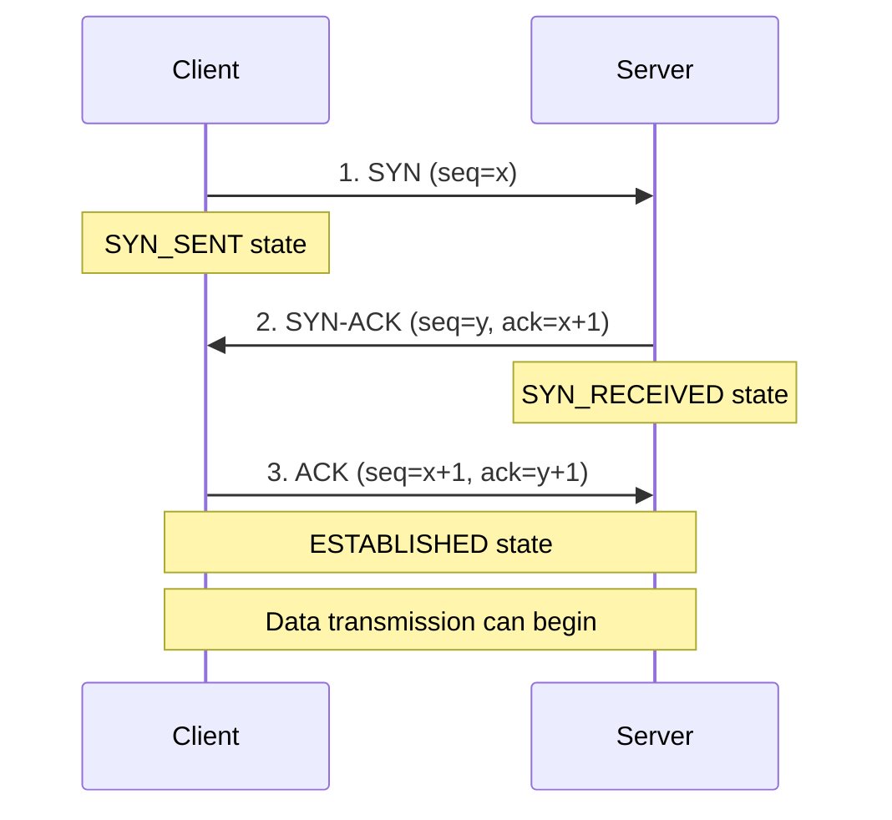
```mermaid
sequenceDiagram
    participant Client
    participant Server

    Client->>Server: 1. SYN (seq=x)
    Note over Client: SYN_SENT state
    Server->>Client: 2. SYN-ACK (seq=y, ack=x+1)
    Note over Server: SYN_RECEIVED state
    Client->>Server: 3. ACK (seq=x+1, ack=y+1)
    Note over Client,Server: ESTABLISHED state

    Note over Client,Server: Data transmission can begin
```

### TCP Connection Termination

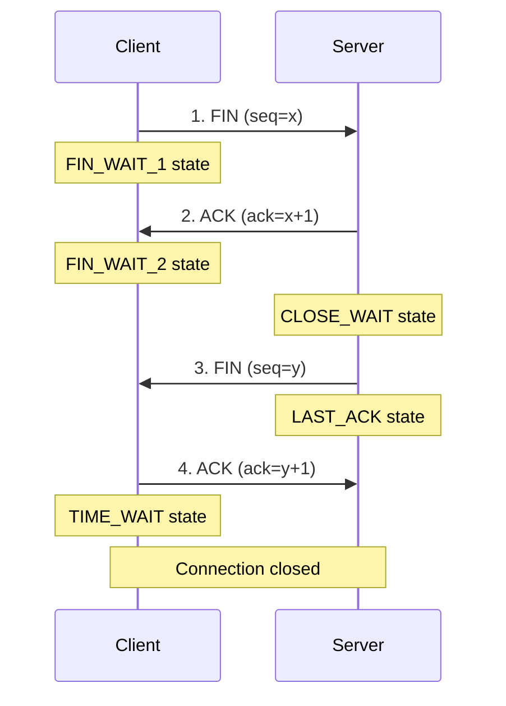
```mermaid
sequenceDiagram
    participant Client
    participant Server

    Client->>Server: 1. FIN (seq=x)
    Note over Client: FIN_WAIT_1 state
    Server->>Client: 2. ACK (ack=x+1)
    Note over Client: FIN_WAIT_2 state
    Note over Server: CLOSE_WAIT state
    Server->>Client: 3. FIN (seq=y)
    Note over Server: LAST_ACK state
    Client->>Server: 4. ACK (ack=y+1)
    Note over Client: TIME_WAIT state
    Note over Client,Server: Connection closed
```

**Key Features:**

- Connection-oriented
- Reliable delivery with acknowledgments
- Flow control and congestion control
- Ordered data delivery

---

## 3. UDP (User Datagram Protocol)

UDP is a connectionless protocol that provides fast, lightweight communication without reliability guarantees.

### UDP Communication Flow

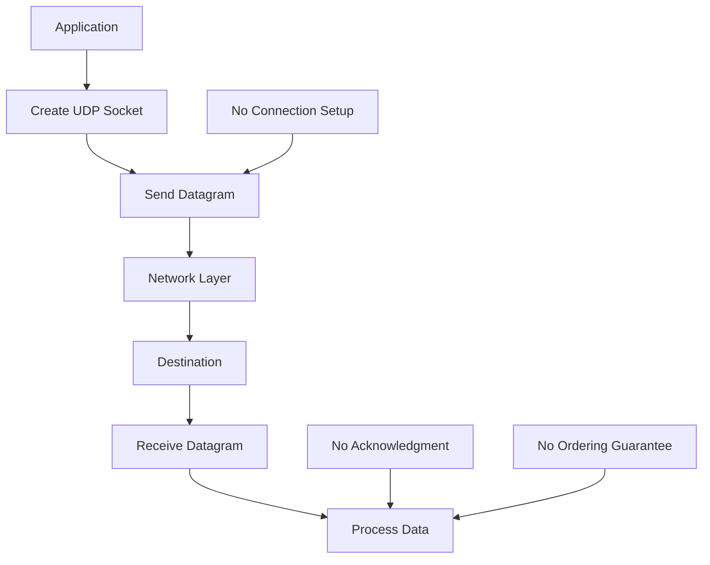
```mermaid
flowchart TD
    A[Application] --> B[Create UDP Socket]
    B --> C[Send Datagram]
    C --> D[Network Layer]
    D --> E[Destination]
    E --> F[Receive Datagram]
    F --> G[Process Data]

    H[No Connection Setup] --> C
    I[No Acknowledgment] --> G
    J[No Ordering Guarantee] --> G
```

### UDP vs TCP Comparison

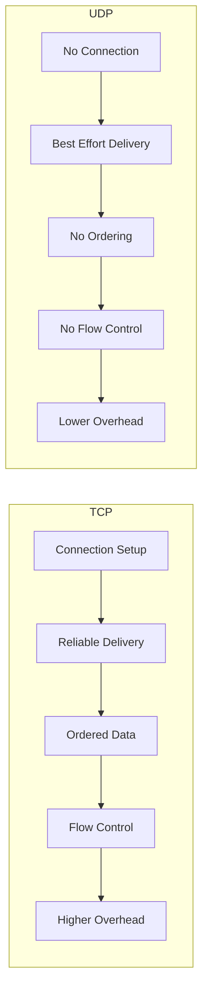
```mermaid
graph LR
    subgraph TCP
        A1[Connection Setup] --> A2[Reliable Delivery]
        A2 --> A3[Ordered Data]
        A3 --> A4[Flow Control]
        A4 --> A5[Higher Overhead]
    end

    subgraph UDP
        B1[No Connection] --> B2[Best Effort Delivery]
        B2 --> B3[No Ordering]
        B3 --> B4[No Flow Control]
        B4 --> B5[Lower Overhead]
    end
```

**Key Features:**

- Connectionless
- Fast and lightweight
- No reliability guarantees
- Used for real-time applications (gaming, streaming, DNS)

---

## 4. DNS (Domain Name System)

DNS translates human-readable domain names into IP addresses.

### DNS Resolution Process

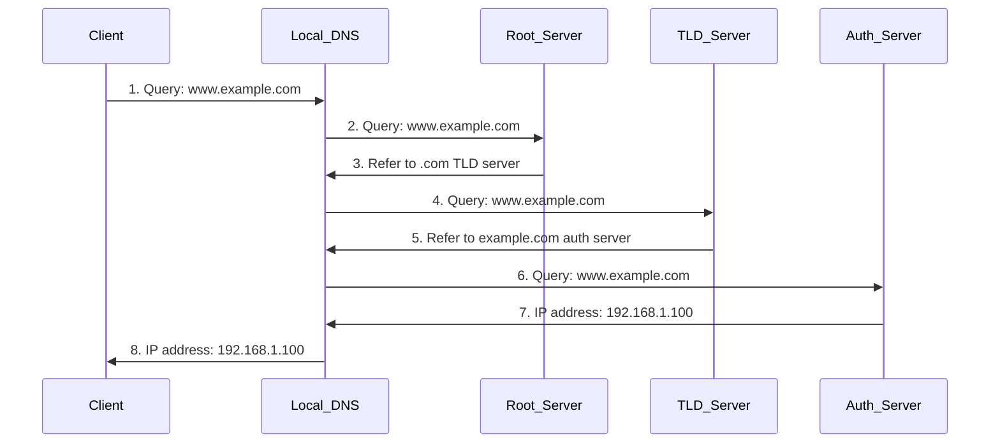
```mermaid
sequenceDiagram
    participant Client
    participant Local_DNS
    participant Root_Server
    participant TLD_Server
    participant Auth_Server

    Client->>Local_DNS: 1. Query: www.example.com
    Local_DNS->>Root_Server: 2. Query: www.example.com
    Root_Server->>Local_DNS: 3. Refer to .com TLD server
    Local_DNS->>TLD_Server: 4. Query: www.example.com
    TLD_Server->>Local_DNS: 5. Refer to example.com auth server
    Local_DNS->>Auth_Server: 6. Query: www.example.com
    Auth_Server->>Local_DNS: 7. IP address: 192.168.1.100
    Local_DNS->>Client: 8. IP address: 192.168.1.100
```

### DNS Hierarchy

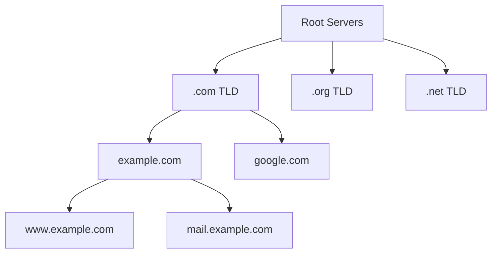
```mermaid
flowchart TD
    A[Root Servers] --> B[.com TLD]
    A --> C[.org TLD]
    A --> D[.net TLD]
    B --> E[example.com]
    B --> F[google.com]
    E --> G[www.example.com]
    E --> H[mail.example.com]
```

**Key Features:**

- Hierarchical distributed database
- Caching for performance
- Multiple record types (A, AAAA, CNAME, MX, etc.)
- Critical internet infrastructure

---

## 5. DHCP (Dynamic Host Configuration Protocol)

DHCP automatically assigns IP addresses and network configuration to devices.

### DHCP Lease Process (DORA)

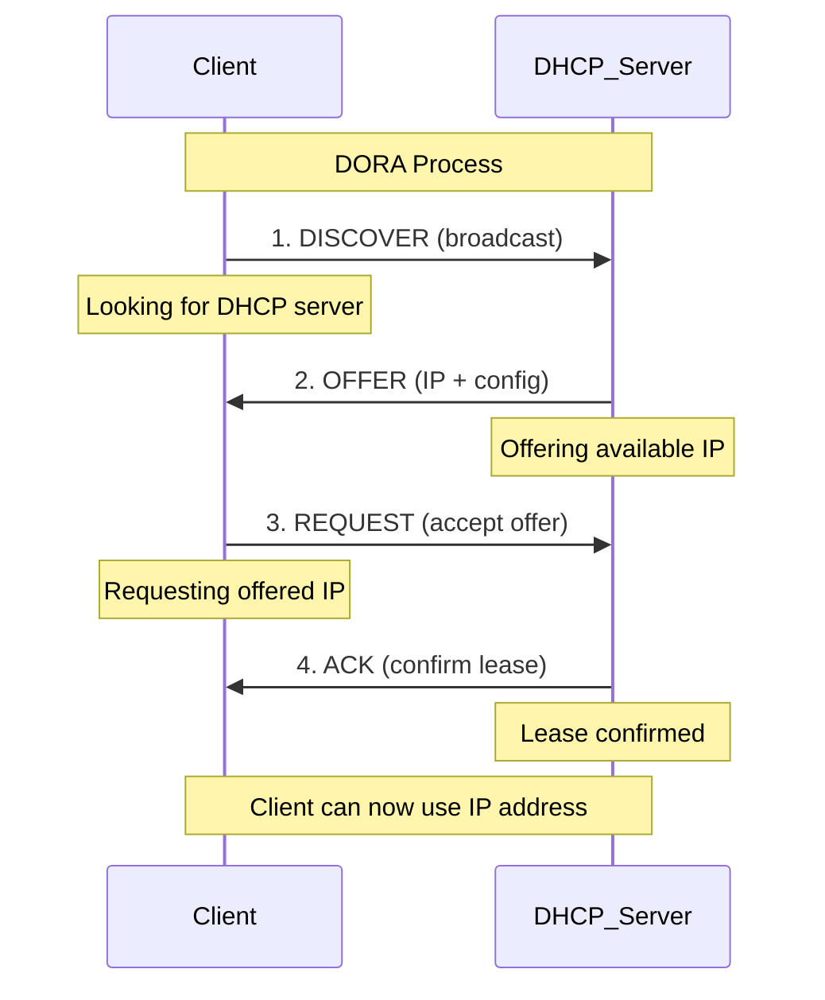
```mermaid
sequenceDiagram
    participant Client
    participant DHCP_Server

    Note over Client,DHCP_Server: DORA Process
    Client->>DHCP_Server: 1. DISCOVER (broadcast)
    Note over Client: Looking for DHCP server
    DHCP_Server->>Client: 2. OFFER (IP + config)
    Note over DHCP_Server: Offering available IP
    Client->>DHCP_Server: 3. REQUEST (accept offer)
    Note over Client: Requesting offered IP
    DHCP_Server->>Client: 4. ACK (confirm lease)
    Note over DHCP_Server: Lease confirmed

    Note over Client,DHCP_Server: Client can now use IP address
```

### DHCP Configuration Flow

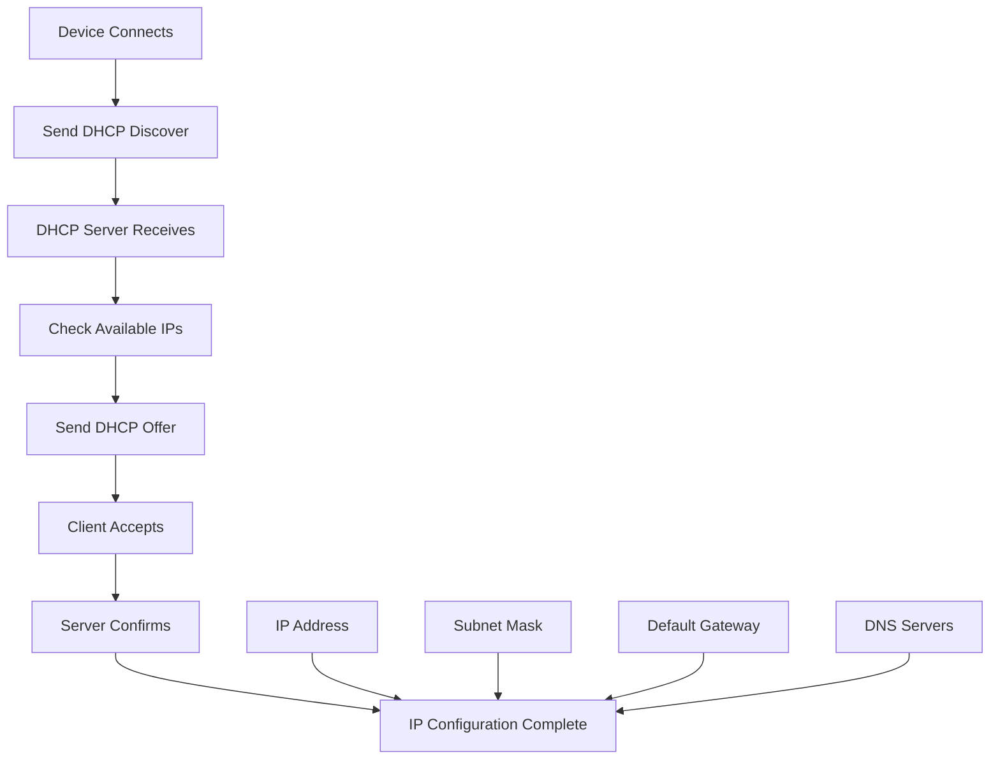
```mermaid
flowchart TD
    A[Device Connects] --> B[Send DHCP Discover]
    B --> C[DHCP Server Receives]
    C --> D[Check Available IPs]
    D --> E[Send DHCP Offer]
    E --> F[Client Accepts]
    F --> G[Server Confirms]
    G --> H[IP Configuration Complete]

    I[IP Address] --> H
    J[Subnet Mask] --> H
    K[Default Gateway] --> H
    L[DNS Servers] --> H
```

**Key Features:**

- Automatic IP address assignment
- Network configuration distribution
- Lease management
- Reduces manual configuration errors

---

## 6. FTP (File Transfer Protocol)

FTP enables file transfer between client and server over a network.

### FTP Connection Model

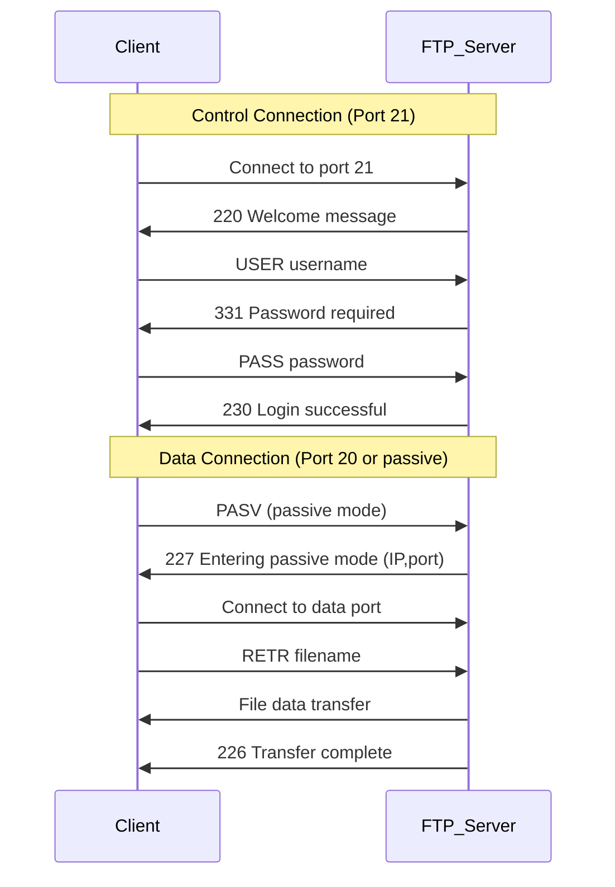
```mermaid
sequenceDiagram
    participant Client
    participant FTP_Server

    Note over Client,FTP_Server: Control Connection (Port 21)
    Client->>FTP_Server: Connect to port 21
    FTP_Server->>Client: 220 Welcome message
    Client->>FTP_Server: USER username
    FTP_Server->>Client: 331 Password required
    Client->>FTP_Server: PASS password
    FTP_Server->>Client: 230 Login successful

    Note over Client,FTP_Server: Data Connection (Port 20 or passive)
    Client->>FTP_Server: PASV (passive mode)
    FTP_Server->>Client: 227 Entering passive mode (IP,port)
    Client->>FTP_Server: Connect to data port
    Client->>FTP_Server: RETR filename
    FTP_Server->>Client: File data transfer
    FTP_Server->>Client: 226 Transfer complete
```

### FTP Active vs Passive Mode

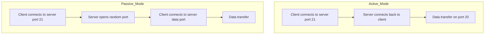
```mermaid
graph TD
    subgraph Active_Mode
        A1[Client connects to server port 21] --> A2[Server connects back to client]
        A2 --> A3[Data transfer on port 20]
    end

    subgraph Passive_Mode
        B1[Client connects to server port 21] --> B2[Server opens random port]
        B2 --> B3[Client connects to server data port]
        B3 --> B4[Data transfer]
    end
```

**Key Features:**

- Separate control and data connections
- Active and passive modes
- ASCII and binary transfer modes
- Directory navigation and file management

---

## 7. SMTP (Simple Mail Transfer Protocol)

SMTP is used for sending email messages between servers.

### Email Sending Process

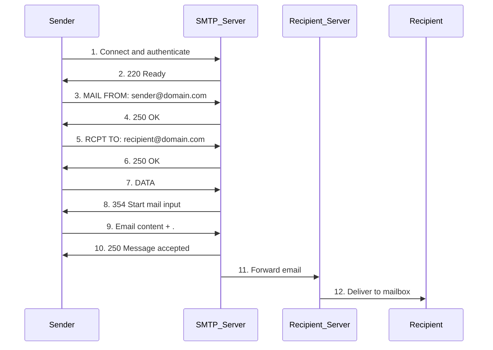
```mermaid
sequenceDiagram
    participant Sender
    participant SMTP_Server
    participant Recipient_Server
    participant Recipient

    Sender->>SMTP_Server: 1. Connect and authenticate
    SMTP_Server->>Sender: 2. 220 Ready
    Sender->>SMTP_Server: 3. MAIL FROM: sender@domain.com
    SMTP_Server->>Sender: 4. 250 OK
    Sender->>SMTP_Server: 5. RCPT TO: recipient@domain.com
    SMTP_Server->>Sender: 6. 250 OK
    Sender->>SMTP_Server: 7. DATA
    SMTP_Server->>Sender: 8. 354 Start mail input
    Sender->>SMTP_Server: 9. Email content + .
    SMTP_Server->>Sender: 10. 250 Message accepted

    SMTP_Server->>Recipient_Server: 11. Forward email
    Recipient_Server->>Recipient: 12. Deliver to mailbox
```

### Email System Architecture

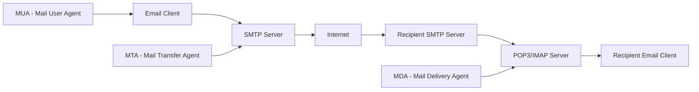
```mermaid
flowchart LR
    A[Email Client] --> B[SMTP Server]
    B --> C[Internet]
    C --> D[Recipient SMTP Server]
    D --> E[POP3/IMAP Server]
    E --> F[Recipient Email Client]

    G[MUA - Mail User Agent] --> A
    H[MTA - Mail Transfer Agent] --> B
    I[MDA - Mail Delivery Agent] --> E
```

**Key Features:**

- Text-based protocol
- Store-and-forward mechanism
- Authentication and security extensions
- Works with POP3/IMAP for email retrieval

---

## 8. SSH (Secure Shell)

SSH provides secure remote access and command execution over an encrypted connection.

### SSH Connection Establishment

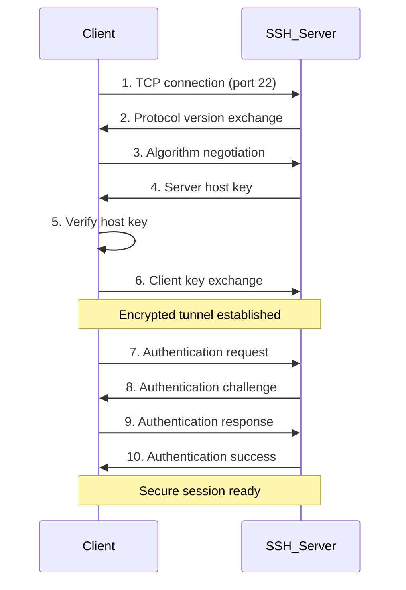
```mermaid
sequenceDiagram
    participant Client
    participant SSH_Server

    Client->>SSH_Server: 1. TCP connection (port 22)
    SSH_Server->>Client: 2. Protocol version exchange
    Client->>SSH_Server: 3. Algorithm negotiation
    SSH_Server->>Client: 4. Server host key
    Client->>Client: 5. Verify host key
    Client->>SSH_Server: 6. Client key exchange
    Note over Client,SSH_Server: Encrypted tunnel established

    Client->>SSH_Server: 7. Authentication request
    SSH_Server->>Client: 8. Authentication challenge
    Client->>SSH_Server: 9. Authentication response
    SSH_Server->>Client: 10. Authentication success

    Note over Client,SSH_Server: Secure session ready
```

### SSH Authentication Methods

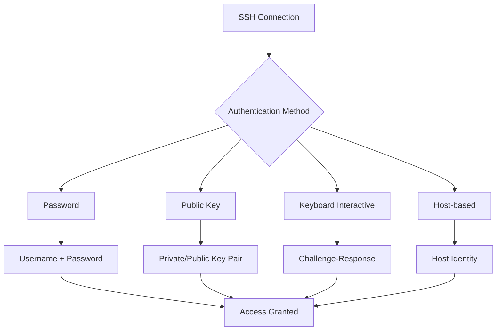
```mermaid
flowchart TD
    A[SSH Connection] --> B{Authentication Method}
    B --> C[Password]
    B --> D[Public Key]
    B --> E[Keyboard Interactive]
    B --> F[Host-based]

    C --> G[Username + Password]
    D --> H[Private/Public Key Pair]
    E --> I[Challenge-Response]
    F --> J[Host Identity]

    G --> K[Access Granted]
    H --> K
    I --> K
    J --> K
```

**Key Features:**

- Strong encryption (AES, ChaCha20)
- Multiple authentication methods
- Port forwarding and tunneling
- Secure file transfer (SCP, SFTP)

---

## 9. WebSockets

WebSockets provide full-duplex communication between client and server over a single TCP connection, enabling real-time bidirectional data exchange.

### WebSocket Handshake Process

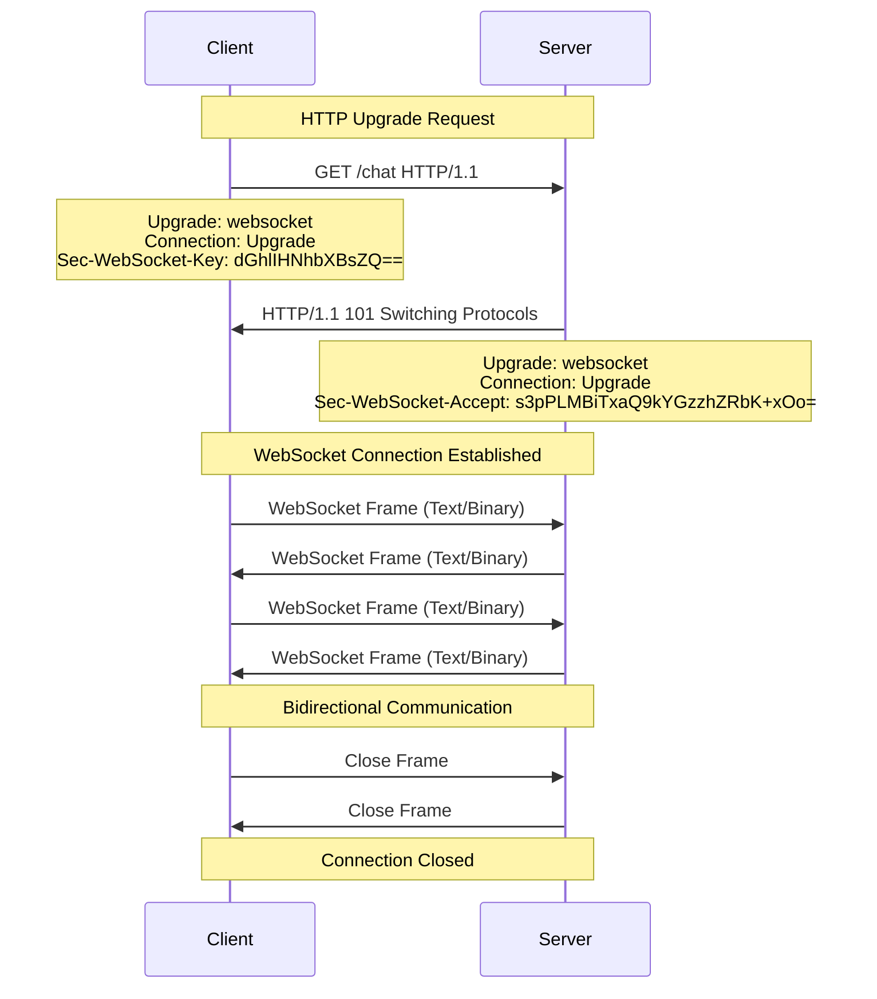
```mermaid
sequenceDiagram
    participant Client
    participant Server

    Note over Client,Server: HTTP Upgrade Request
    Client->>Server: GET /chat HTTP/1.1
    Note over Client: Upgrade: websocket<br/>Connection: Upgrade<br/>Sec-WebSocket-Key: dGhlIHNhbXBsZQ==
    Server->>Client: HTTP/1.1 101 Switching Protocols
    Note over Server: Upgrade: websocket<br/>Connection: Upgrade<br/>Sec-WebSocket-Accept: s3pPLMBiTxaQ9kYGzzhZRbK+xOo=

    Note over Client,Server: WebSocket Connection Established
    Client->>Server: WebSocket Frame (Text/Binary)
    Server->>Client: WebSocket Frame (Text/Binary)
    Client->>Server: WebSocket Frame (Text/Binary)
    Server->>Client: WebSocket Frame (Text/Binary)

    Note over Client,Server: Bidirectional Communication
    Client->>Server: Close Frame
    Server->>Client: Close Frame
    Note over Client,Server: Connection Closed
```

### WebSocket vs HTTP Communication

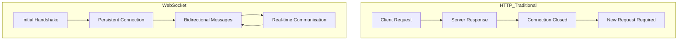
```mermaid
graph TD
    subgraph HTTP_Traditional
        A1[Client Request] --> A2[Server Response]
        A2 --> A3[Connection Closed]
        A3 --> A4[New Request Required]
    end

    subgraph WebSocket
        B1[Initial Handshake] --> B2[Persistent Connection]
        B2 --> B3[Bidirectional Messages]
        B3 --> B4[Real-time Communication]
        B4 --> B3
    end
```

### WebSocket Frame Structure

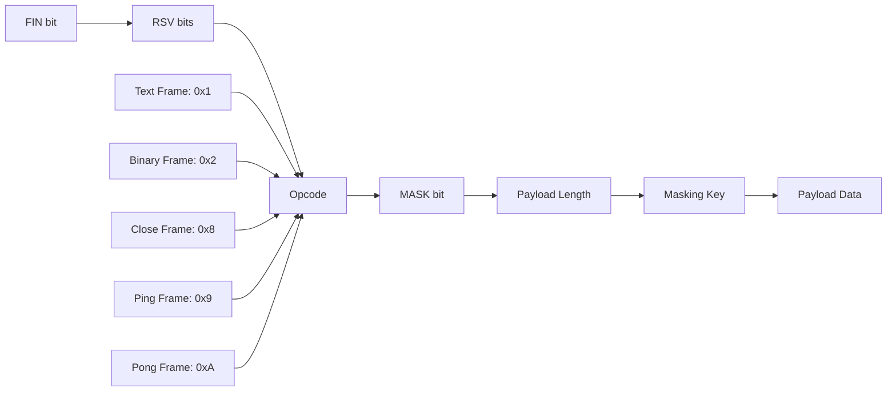
```mermaid
flowchart LR
    A[FIN bit] --> B[RSV bits]
    B --> C[Opcode]
    C --> D[MASK bit]
    D --> E[Payload Length]
    E --> F[Masking Key]
    F --> G[Payload Data]

    H[Text Frame: 0x1] --> C
    I[Binary Frame: 0x2] --> C
    J[Close Frame: 0x8] --> C
    K[Ping Frame: 0x9] --> C
    L[Pong Frame: 0xA] --> C
```

### WebSocket Use Cases Flow

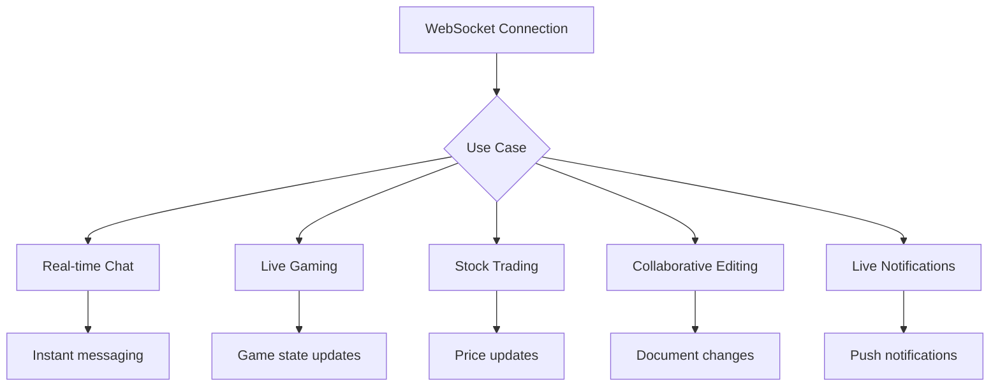
```mermaid
flowchart TD
    A[WebSocket Connection] --> B{Use Case}
    B --> C[Real-time Chat]
    B --> D[Live Gaming]
    B --> E[Stock Trading]
    B --> F[Collaborative Editing]
    B --> G[Live Notifications]

    C --> H[Instant messaging]
    D --> I[Game state updates]
    E --> J[Price updates]
    F --> K[Document changes]
    G --> L[Push notifications]
```

**Key Features:**

- Full-duplex communication
- Low latency and overhead
- Persistent connection
- Support for text and binary data
- Built on top of HTTP upgrade mechanism

---

## 10. HTTP/3 and QUIC

HTTP/3 is the latest version of HTTP built on QUIC (Quick UDP Internet Connections), providing improved performance and security over UDP.

### HTTP/3 vs HTTP/2 vs HTTP/1.1

```mermaid
graph TD
    subgraph HTTP1_1
        A1[Single Request/Response] --> A2[Head-of-line Blocking]
        A2 --> A3[Multiple TCP Connections]
        A3 --> A4[No Server Push]
    end

    subgraph HTTP2
        B1[Multiplexing] --> B2[Binary Protocol]
        B2 --> B3[Server Push]
        B3 --> B4[Header Compression]
        B4 --> B5[Still TCP-based]
    end

    subgraph HTTP3_QUIC
        C1[UDP-based] --> C2[Built-in Encryption]
        C2 --> C3[0-RTT Connection]
        C3 --> C4[Stream-level Flow Control]
        C4 --> C5[Connection Migration]
    end
```

### QUIC Connection Establishment

```mermaid
sequenceDiagram
    participant Client
    participant Server

    Note over Client,Server: Initial Connection (1-RTT)
    Client->>Server: Initial Packet (Client Hello + TLS)
    Note over Client: Connection ID, Version, Crypto params
    Server->>Client: Initial + Handshake Packets
    Note over Server: Server Hello, Certificate, Finished
    Client->>Server: Handshake Packet (Finished)
    Note over Client,Server: Connection Established

    Note over Client,Server: Subsequent Connections (0-RTT)
    Client->>Server: 0-RTT Packet (with cached params)
    Note over Client: Resume with cached session
    Server->>Client: 1-RTT Response
    Note over Client,Server: Immediate data transmission
```

### QUIC Stream Management

```mermaid
flowchart TD
    A[QUIC Connection] --> B[Multiple Streams]
    B --> C[Stream 1: HTML]
    B --> D[Stream 2: CSS]
    B --> E[Stream 3: JavaScript]
    B --> F[Stream 4: Images]

    G[Independent Flow Control] --> C
    G --> D
    G --> E
    G --> F

    H[No Head-of-line Blocking] --> I[Stream 2 can complete<br/>even if Stream 1 is blocked]
```

### HTTP/3 Performance Benefits

```mermaid
sequenceDiagram
    participant Client
    participant Network
    participant Server

    Note over Client,Server: Connection Migration
    Client->>Server: Request via WiFi (Connection ID: ABC)
    Note over Network: Network change (WiFi to 4G)
    Client->>Server: Continue same connection via 4G (Connection ID: ABC)
    Server->>Client: Response continues seamlessly

    Note over Client,Server: Reduced Latency
    Client->>Server: 0-RTT: Request with cached params
    Server->>Client: Immediate response (no handshake delay)
```

### QUIC Packet Structure

```mermaid
flowchart LR
    A[Header Form] --> B[Fixed Bit]
    B --> C[Packet Type]
    C --> D[Connection ID]
    D --> E[Packet Number]
    E --> F[Payload]

    G[Long Header<br/>Initial/Handshake] --> A
    H[Short Header<br/>Application Data] --> A
```

**Key Features:**

- Built on UDP for reduced latency
- Integrated TLS 1.3 encryption
- 0-RTT connection resumption
- Connection migration support
- Stream-level multiplexing without head-of-line blocking
- Improved congestion control

---

## Protocol Comparison Summary

| Protocol      | Layer       | Connection          | Reliability         | Use Case                |
| ------------- | ----------- | ------------------- | ------------------- | ----------------------- |
| HTTP/HTTPS    | Application | Stateless           | Reliable (over TCP) | Web browsing            |
| TCP           | Transport   | Connection-oriented | Reliable            | General data transfer   |
| UDP           | Transport   | Connectionless      | Best effort         | Real-time applications  |
| DNS           | Application | Connectionless      | Best effort         | Domain name resolution  |
| DHCP          | Application | Connectionless      | Best effort         | IP address assignment   |
| FTP           | Application | Connection-oriented | Reliable            | File transfer           |
| SMTP          | Application | Connection-oriented | Reliable            | Email transmission      |
| SSH           | Application | Connection-oriented | Reliable            | Secure remote access    |
| WebSockets    | Application | Persistent          | Reliable (over TCP) | Real-time bidirectional |
| HTTP/3 (QUIC) | Application | Connection-oriented | Reliable (over UDP) | Modern web performance  |

## Network Stack Visualization

```mermaid
flowchart TD
    subgraph Application_Layer
        A1[HTTP/HTTPS]
        A2[DNS]
        A3[DHCP]
        A4[FTP]
        A5[SMTP]
        A6[SSH]
        A7[WebSockets]
        A8[HTTP/3]
    end

    subgraph Transport_Layer
        T1[TCP]
        T2[UDP]
    end

    subgraph Network_Layer
        N1[IP]
    end

    subgraph Data_Link_Layer
        D1[Ethernet]
    end

    Application_Layer --> Transport_Layer
    Transport_Layer --> Network_Layer
    Network_Layer --> Data_Link_Layer
```

This document provides a comprehensive overview of 10 essential network protocols with visual diagrams to help understand their operation and relationships within the network stack.

## Modern Protocol Evolution

```mermaid
timeline
    title Network Protocol Evolution

    1970s-1980s : TCP/IP Suite
                : SMTP (1982)
                : DNS (1983)

    1990s       : HTTP/1.0 (1996)
                : DHCP (1993)
                : SSH (1995)

    2000s       : HTTP/1.1 (1997)
                : FTP improvements

    2010s       : WebSockets (2011)
                : HTTP/2 (2015)
                : QUIC development

    2020s       : HTTP/3 (2022)
                : QUIC standardization
                : Modern web protocols
```
