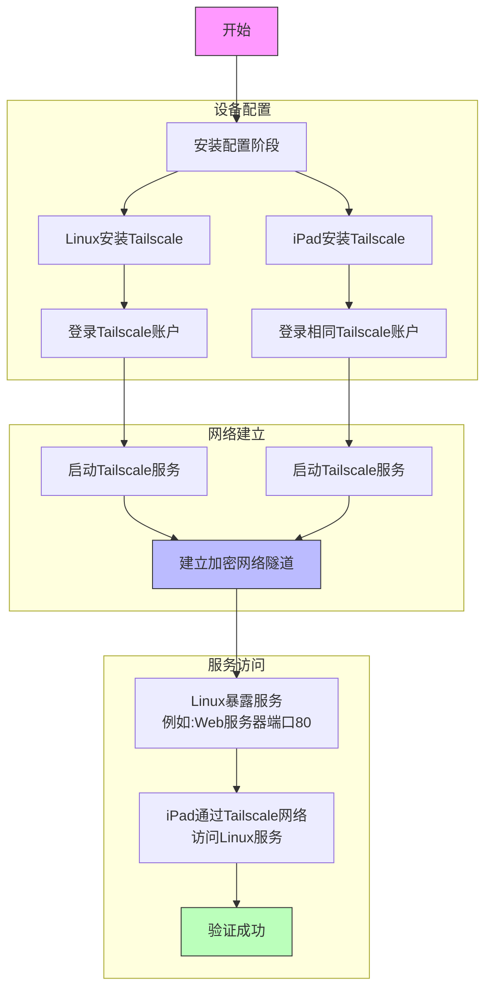

我会创建一个 Mermaid 流程图来展示 Tailscale 的工作原理和您描述的场景。

是的，您描述的过程是正确的。让我详细解释这个流程：

1. **初始设置**
   - 在 Linux 系统上安装并配置 Tailscale
   - 在 iPad 上安装 Tailscale 应用
   - 两个设备都使用相同的 Tailscale 账户登录

2. **网络建立**
   - Tailscale 会在后台自动建立加密的点对点连接
   - 通过 Tailscale 的控制服务器进行身份验证
   - 为每个设备分配唯一的 IP 地址

3. **服务访问**
   - Linux 系统上的服务（如网页服务器）会在 Tailscale 网络中可见
   - iPad 可以通过分配的 Tailscale IP 直接访问 Linux 的服务
   - 所有通信都是加密的，就像设备在同一个局域网内

需要注意的几点：
- 确保 Linux 系统上的防火墙允许来自 Tailscale 网络的连接
- 在 Tailscale 管理控制台中可以设置访问控制策略
- 首次连接时需要确认设备授权

您想了解更具体的配置步骤或者其他细节吗？
