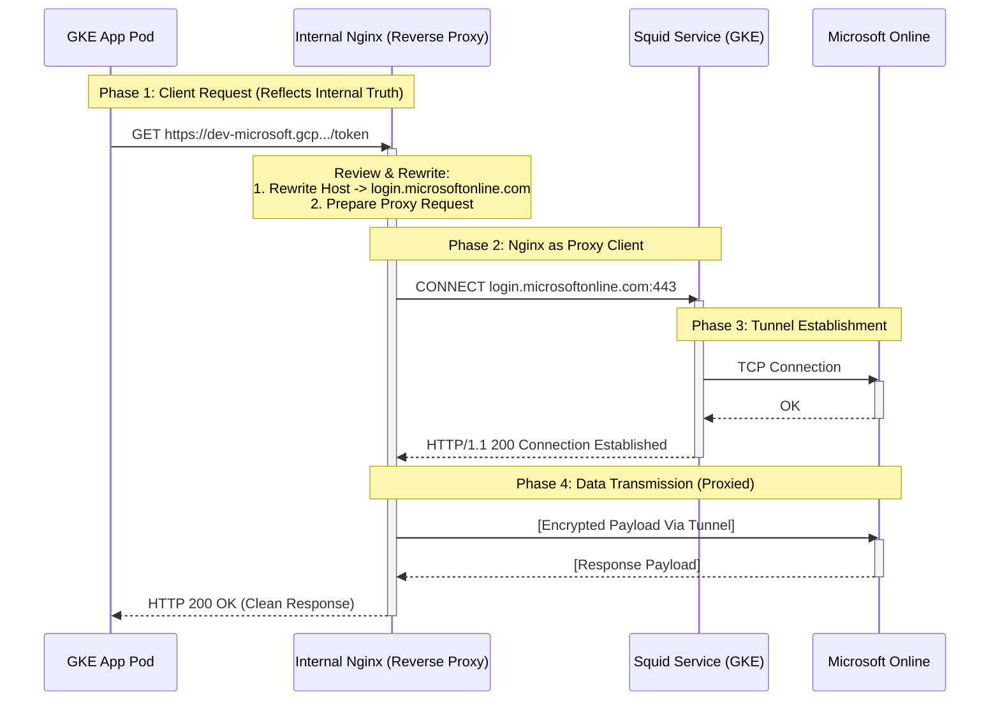
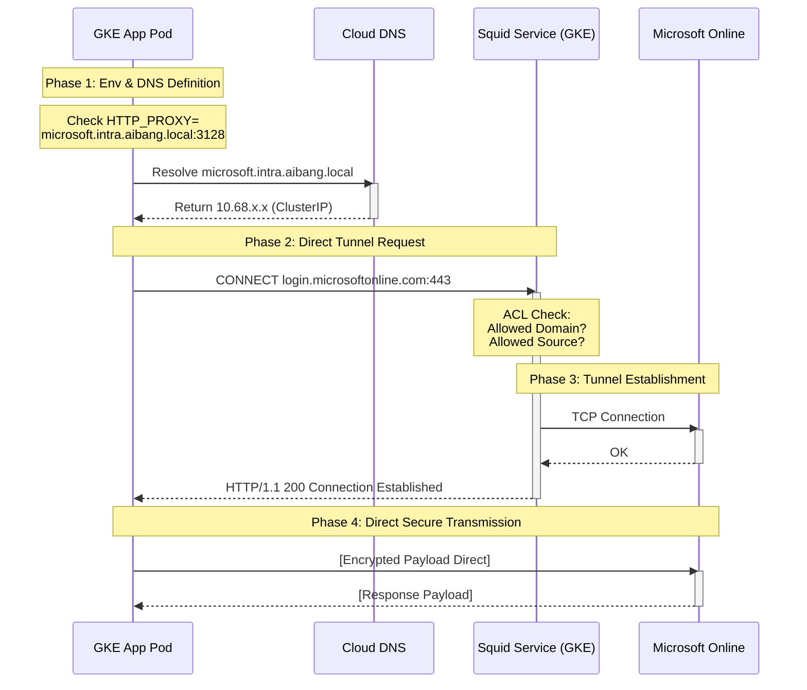
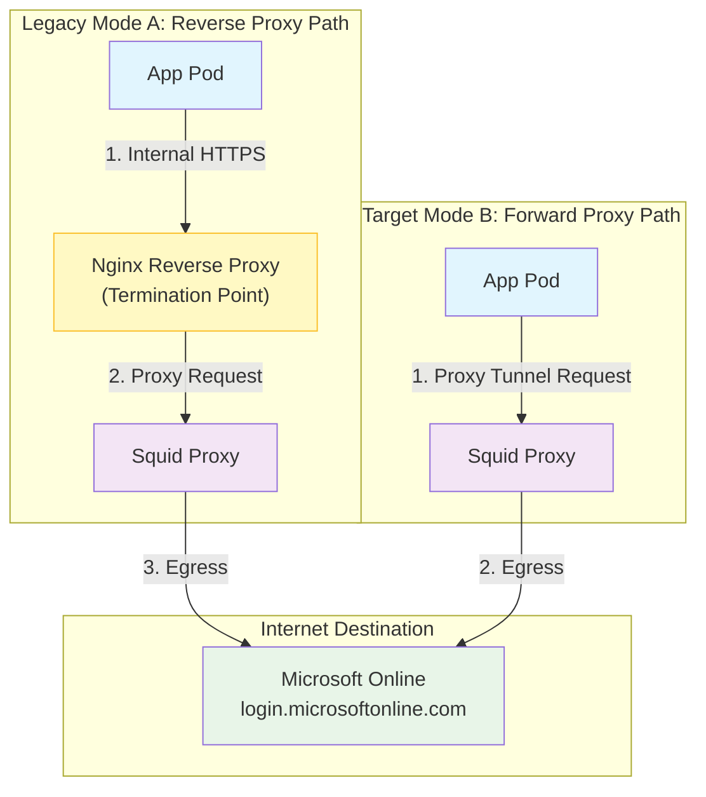
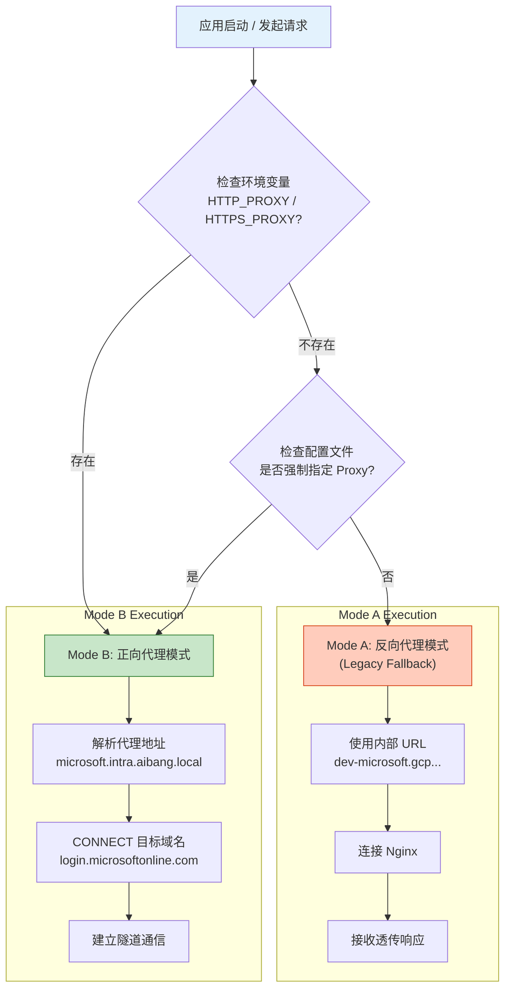

# Compare and Migrate: Reverse Proxy vs. Forward Proxy

## 1. 核心概念对比：真相代理 (Truth Proxy) vs. 反向代理 (Reverse Proxy)

在网络架构中，"代理"的角色决定了谁拥有连接的"控制权"和"知情权"。我们用 **"真相" (Truth)** 来比喻**目的地地址**的可见性。

### 1.1 反向代理 (Reverse Proxy) - 模式 A (Hidden Truth)
**"客户端无需知道真相，服务器替你完成一切。"**

*   **定义**：客户端将代理服务器视为**最终目的地**。客户端不知道真实的服务端在哪里，甚至不知道背后有代理的存在。
*   **机制**: 业务代码向内部 Nginx 发起普通的 HTTPS 请求。Nginx 负责 URL 重写 (`rewrite`) 和 转发 (`proxy_pass`) 到 Squid，最后由 Squid 出网。
*   **代码视角**:
    ```python
    # 伪代码：反向代理模式 - 只有 url 是特殊的，behavior 就像访问普通网站
    requests.post("https://dev-microsoft.gcp.cloud.env.aibang/login/...") 
    ```

### 1.2 正向代理 (Forward Proxy) - 模式 B (Explicit Truth)
**"客户端知道真相，并主动寻求代理的帮助。"**

*   **定义**：客户端明确知道**最终目的地**是谁，但无法直接到达，于是主动连接代理服务器，请它帮忙中转。
*   **机制**: 业务代码利用 HTTP 协议的 `CONNECT` 方法，告诉 Squid："我想去 Microsoft，请帮我建立隧道"。
*   **代码视角**:
    ```python
    # 伪代码：正向代理模式 - URL 是真实的 Microsoft 地址，但配置了 proxy
    requests.post(
        "https://login.microsoftonline.com/...",
        proxies={"https": "http://microsoft.intra.aibang.local:3128"}
    )
    ```

---

## 2. 深度流程分析与可视化

### 2.1 Mode A: 现有反向代理链路 (Legacy Flow)
这个模式是对遗留代码最友好的，因为代码不需要改动，但架构最复杂（双跳）。



### 2.2 Mode B: 目标正向代理链路 (Target Flow)
这个模式是云原生推荐的，符合 "Smart Endpoint, Dumb Pipes" 原则。



### 2.3 架构对比 (Topology View)



---

## 3. 迁移决策流程图 (Decision Flow)

这个流程图展示了代码或配置应该如何根据环境自动选择模式。



---

## 4. 迁移策略 (Migration Strategy)

### 4.1 基础设施层
*   **Done**: 你已经部署了 Squid 并且验证了 `curl -x` (Mode B) 是通的。
*   **To Do**: 确保 Squid 的 ACL 规则覆盖了所有 `cache_peer` 的场景，因为 Mode A 中 Nginx 可能隐藏了一些 header 或 path 逻辑，Mode B 中这些由客户端直接发起，必须确保 Squid 允许这些流量。

### 4.2 代码层适配 (关键)
这是迁移的核心。由于我们不能强迫所有业务代码立刻重写，我们需要设计一个**兼容层**。

**设计理念**：
1.  **优先正向代理**: 如果检测到 `HTTP_PROXY` 或 `HTTPS_PROXY` 环境变量，则认为应用具备出网能力，直接使用真实 URL + 代理配置。
2.  **回退反向代理**: 如果没有这些变量，或者显式配置了 `FORCE_REVERSE_PROXY`，则使用为了兼容保留的 Nginx 内部域名。
3.  **配置模板化**: 将 "目标地址" 从硬编码字符串提取为配置项。

### 4.3 环境变量注入 (Kubernetes)
GKE `ConfigMap` 示例:

```yaml
# 推荐的 Pod 环境变量配置
env:
  - name: MICROSOFT_AUTH_URL
    # 迁移后，这个值应该是真实的 URL
    value: "https://login.microsoftonline.com/<tenant_id>/oauth2/v2.0/token"
  - name: HTTPS_PROXY
    # 你的正向代理地址
    value: "http://microsoft.intra.aibang.local:3128"
  - name: NO_PROXY
    # 确保内部服务不走代理
    value: ".cluster.local,.svc,.internal,10.0.0.0/8,127.0.0.1,localhost"
```

如果代码还未改造（必须用 Mode A），则环境变量设为：
```yaml
env:
  - name: MICROSOFT_AUTH_URL
    value: "https://dev-microsoft.gcp.cloud.env.aibang/login/<tenant_id>/oauth2/v2.0/token"
  # 不设置 HTTPS_PROXY
```

---

## 5. Python 代码模拟与适配示例

为了演示这种"双模"兼容性，我们将编写一个 Python 脚本 (`proxy_simulator.py`)。它展示了如何编写一段既能适应旧环境（反向代理），又能无缝迁移到新环境（正向代理）的代码。

*(请参考同目录下的 proxy_simulator.py)*
