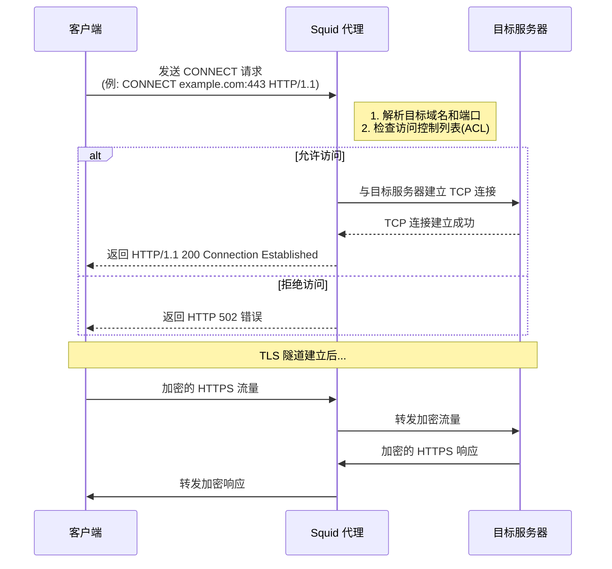
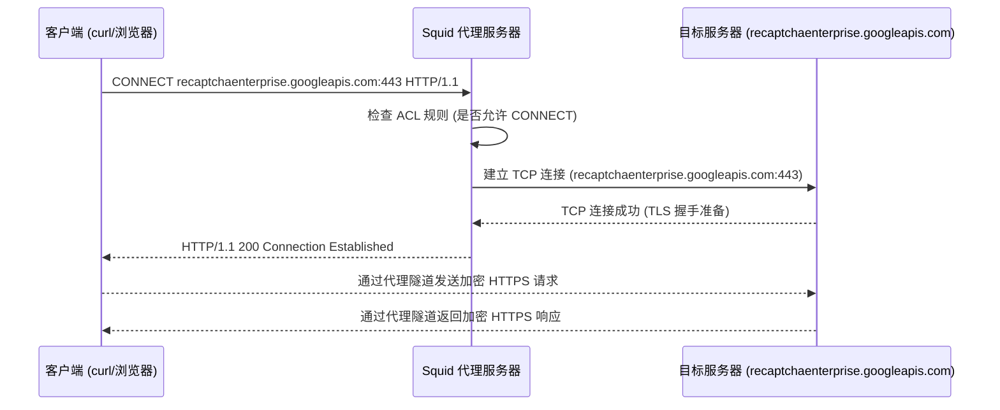

以下是用 Mermaid 语法绘制的 Squid 代理使用 CONNECT 方法建立 HTTPS 隧道的序列图：

关键流程说明：
1. 客户端发送 CONNECT 请求到 Squid 代理，指定目标服务器和端口
2. Squid 代理验证访问权限
3. 验证通过后代理与目标服务器建立 TCP 连接
4. 代理返回 200 状态码通知客户端隧道建立成功
5. 后续所有流量通过代理进行透明转发
6. TLS 握手和加密通信直接在客户端与目标服务器之间完成

特点：
- 代理仅建立 TCP 通道，无法解密 HTTPS 流量
- 客户端需要显式配置代理支持
- 常用于 443 端口的标准 HTTPS 流量代理
- 比普通 HTTP 代理更高效（不需要解析 HTTP 头）

下面是 Squid 代理使用 CONNECT 方法建立 HTTPS 隧道的 Mermaid 流程图：

解释：
	1.	客户端 (curl/浏览器) 发送 CONNECT 请求：
	•	请求 Squid 代理建立与 recaptchaenterprise.googleapis.com:443 的隧道。
	2.	Squid 检查 ACL (访问控制列表)：
	•	代理服务器检查是否允许 CONNECT 方法，是否允许访问端口 443。
	3.	Squid 代理与目标服务器建立 TCP 连接：
	•	Squid 代理尝试与 recaptchaenterprise.googleapis.com 服务器建立 TCP 连接。
	4.	目标服务器接受连接：
	•	目标服务器成功建立 TCP 连接，准备进行 TLS 握手。
	5.	Squid 向客户端返回 200 Connection Established：
	•	代理通知客户端，隧道已经建立，可以开始加密通信。
	6.	客户端与目标服务器通过代理隧道进行加密通信：
	•	由于隧道已经建立，客户端和服务器之间的所有数据都是 TLS 加密的，Squid 仅作为数据转发者，不会解密或修改数据。

这个过程使得客户端能够通过 Squid 代理访问 HTTPS 站点，同时保持数据加密的安全性。

Squid 使用 CONNECT 方法 来处理 HTTPS 流量，确保客户端能够通过代理服务器与目标 HTTPS 服务器建立加密连接。这个过程非常关键，因为 HTTPS 流量是加密的，代理服务器不能直接读取请求和响应内容，而是需要通过一种特殊的方式——建立一个“隧道”来转发加密流量。

下面将详细解释 Squid 通过 CONNECT 方法 建立与目标服务器链接的过程，以及这种方式的工作原理。

1. 背景：HTTP 和 HTTPS 请求的不同
	•	HTTP 请求：数据以明文形式传输，代理服务器可以读取并修改这些请求和响应。
	•	HTTPS 请求：数据是通过 SSL/TLS 协议加密的，代理服务器不能直接读取其中的内容，它仅能转发加密流量，因此需要使用 CONNECT 方法 来建立一个隧道。

在使用代理服务器处理 HTTPS 流量时，代理服务器的作用是创建一个透明的隧道，使得客户端与目标服务器之间的流量不被代理服务器干预。

2. CONNECT 方法的作用

CONNECT 方法 是 HTTP 协议中专门用于建立加密连接的请求方法。通过 CONNECT，客户端告知代理服务器，它希望与某个目标服务器（如一个 HTTPS 服务器）建立一个加密的 TCP 连接。

CONNECT 请求的格式：

CONNECT <目标主机>:<目标端口> HTTP/1.1
Host: <目标主机>
Proxy-Connection: Keep-Alive

	•	CONNECT：表示客户端请求代理服务器建立连接。
	•	<目标主机>:<目标端口>：目标服务器的主机和端口，通常是 443 端口用于 HTTPS。
	•	Host：指定目标主机，用于代理服务器的内部路由。
	•	Proxy-Connection: Keep-Alive：保持代理连接活跃。

3. Squid 代理如何处理 CONNECT 请求

当客户端通过 curl 或浏览器发起 HTTPS 请求时，它会首先向 Squid 代理发出一个 CONNECT 请求。Squid 需要做以下几件事：

3.1 收到客户端的 CONNECT 请求

客户端向代理服务器发送 CONNECT 请求，Squid 收到请求后，会首先检查是否允许使用 CONNECT 方法。代理服务器必须通过配置文件允许 CONNECT 方法，特别是允许连接到 HTTPS 端口（默认是端口 443）。

请求示例：

CONNECT recaptchaenterprise.googleapis.com:443 HTTP/1.1
Host: recaptchaenterprise.googleapis.com
Proxy-Connection: Keep-Alive

3.2 代理服务器检查配置

Squid 必须检查是否允许连接目标服务器的端口（如 443）。通常，通过 Squid 配置文件中的 ACL（访问控制列表）来控制代理访问：

acl SSL_ports port 443
http_access allow SSL_ports

这表示 Squid 允许通过代理访问端口 443，支持 HTTPS 请求。

3.3 建立与目标服务器的连接

如果配置正确，Squid 会使用 CONNECT 方法 直接与目标服务器建立 TCP 连接。Squid 通过目标服务器的端口（通常是 443）发起连接，并等待目标服务器响应。

Squid 内部处理：

[Squid] 通过 TCP/IP 建立与 recaptchaenterprise.googleapis.com:443 的连接

3.4 返回 200 Connection Established 响应

一旦与目标服务器建立了连接，Squid 会向客户端返回一个 200 Connection Established 响应，表示代理成功创建了加密隧道。

Squid 返回的响应报文：

HTTP/1.1 200 Connection Established
Proxy-Connection: Keep-Alive
Connection: keep-alive

这意味着代理服务器成功地为客户端建立了到目标服务器的连接，现在客户端与目标服务器之间可以通过这个隧道进行加密通信。

3.5 数据通过隧道加密传输
	•	一旦隧道建立，客户端与目标服务器之间的所有通信（包括请求和响应）都通过加密隧道传输。
	•	代理服务器（如 Squid）只负责转发加密的数据，而不会解密或干扰它。这是因为数据在传输过程中已经被 SSL/TLS 加密，Squid 无法读取其中的内容。

Squid 在此阶段的作用：
	•	Squid 只充当“转发者”，它将加密流量从客户端转发到目标服务器，同时将目标服务器的响应返回给客户端。
	•	代理并不解密流量，它只会在数据包级别上进行转发，而不参与流量的内容解析。

3.6 完成通信
	•	客户端通过加密隧道与目标服务器建立了安全连接，所有的 HTTPS 请求和响应数据都在隧道内传输。Squid 不再参与数据的读取和修改，仅负责将数据转发到客户端或目标服务器。
	•	如果目标服务器返回响应（如 404 Not Found 或其他），Squid 会将该响应原封不动地转发回客户端。

4. CONNECT 方法的关键点
	•	隧道化通信：Squid 通过 CONNECT 方法为客户端与目标服务器之间建立一个加密的 TCP 隧道。代理服务器不会干扰数据内容。
	•	透明性：客户端和目标服务器之间的所有通信都是加密的，代理服务器仅负责转发这些加密数据。代理不会读取或修改加密的请求和响应。
	•	代理响应：成功建立连接后，Squid 会返回 200 Connection Established，告知客户端连接成功，可以开始加密通信。
	•	安全性：由于代理只负责转发加密流量，所以客户端与目标服务器之间的通信是安全的，代理无法窥探或修改数据。

5. Squid 配置示例：

为了支持通过 CONNECT 方法的 HTTPS 请求，Squid 的配置需要进行以下调整：

# 允许 CONNECT 方法
http_access allow CONNECT

# 配置允许访问的 SSL 端口（443）
acl SSL_ports port 443
http_access allow SSL_ports

# 配置代理端口
http_port 3128

# 允许某些站点通过代理
acl allowed_sites dstdomain .googleapis.com
http_access allow allowed_sites

# 配置日志
access_log /var/log/squid/access.log squid

	•	http_access allow CONNECT：允许使用 CONNECT 方法的请求，通常用于 HTTPS 流量。
	•	acl SSL_ports port 443：配置允许的 SSL 端口，通常是 443 用于 HTTPS。
	•	http_port 3128：配置代理监听的端口。
	•	access_log：记录所有通过代理的请求，便于调试和监控。

6. 总结：

通过 CONNECT 方法，Squid 代理能够与目标 HTTPS 服务器建立加密的隧道连接。代理服务器仅转发加密的流量，而不干预流量的内容。这个过程允许客户端和目标服务器之间的 HTTPS 通信保持安全，同时使得 Squid 代理能够作为中介进行流量转发。

从你提供的信息来看，问题可能出在代理配置或者请求的URL格式上。让我们逐步分析你遇到的情况：
	1.	第一个请求：

curl -v recaptchaenterprise.googleapis.com:443 -x my.squid.proxy.aibang:3128

这个请求的Host头部包含了端口号 443（recaptchaenterprise.googleapis.com:443）。但是，通常情况下，HTTPS请求默认使用端口 443，所以在请求时不需要指定端口号。并且请求的URL中没有明确的协议（如https://），这可能导致代理或请求本身的解析出现问题。
	•	返回的502错误：这表明代理服务器 my.squid.proxy.aibang:3128 无法转发请求到目标服务器，导致出现“Bad Gateway”错误。这可能是因为请求格式不正确，或者代理服务器配置的问题，导致无法正确处理此类请求。

	2.	第二个请求：

curl -v https://recaptchaenterprise.googleapis.com:443 -x my.squid.proxy.aibang:3128

这个请求明确使用了 https:// 协议和 443 端口（即默认的HTTPS端口），看起来符合标准HTTPS请求的格式，因此通过代理时没有问题，只是返回了 404 错误，表明目标API路径不正确或该资源不存在。

分析：
	•	代理服务器问题：第一个请求中的URL格式可能不符合代理的要求，特别是没有使用https://协议，或者在Host中包含端口号。在某些代理配置下，可能需要确保请求的格式与代理的预期格式一致，尤其是在处理HTTPS请求时。
	•	代理配置：检查代理服务器的配置是否要求请求必须包含协议（如https://）。某些代理服务器在处理URL时，如果没有协议头，可能会自动尝试将其解析为HTTP请求，并尝试建立连接，这可能导致与HTTPS服务器通信时的错误。

解决建议：
	1.	确保请求格式正确：使用完整的URL格式（包括协议部分）和端口：

curl -v https://recaptchaenterprise.googleapis.com -x my.squid.proxy.aibang:3128

这样确保请求通过代理发送时，代理能够正确识别并转发。

	2.	检查代理配置：查看代理服务器的配置，确认它是否需要特定的格式或协议。特别是在使用 -x 选项时，代理可能需要你指定完全的URL格式。
	3.	网络问题排查：如果问题仍然存在，检查代理服务器日志，确认代理是否成功转发请求并接收到目标API的响应。如果代理无法转发请求，可能需要检查网络设置或代理服务器是否有特殊的限制。

你是在使用 Squid 代理，它作为中间层在你和外部服务器之间转发请求。当你发起请求时，Squid 需要正确配置才能成功转发 HTTPS 请求。

我将模拟一个通过 Squid 代理发起的 HTTPS 请求 过程，并解释 Squid 在其中的配置以及它如何支持这些请求。

1. 请求和代理流程简述：
	•	你发起一个 HTTPS 请求，指定了代理：

curl -v https://recaptchaenterprise.googleapis.com -x my.squid.proxy.aibang:3128

	•	这个请求先到达 Squid 代理服务器。
	•	Squid 通过 HTTPS 转发请求到目标服务器（recaptchaenterprise.googleapis.com）。
	•	代理会根据其配置，使用 CONNECT 方法将客户端请求转发给目标服务器，然后接收响应并将其返回给客户端。

2. Squid 配置步骤：

要支持 HTTPS 请求，Squid 需要做一些基本配置，确保它能够正确地通过代理转发和处理 HTTPS 请求。

Squid 配置要点：
	1.	允许 HTTPS 请求：
Squid 必须允许 CONNECT 方法，这是代理用来发起 HTTPS 请求的 HTTP 方法。配置文件中的相关行如下：

http_access allow CONNECT

	2.	配置代理端口和 HTTPS 转发：
Squid 需要允许通过代理端口转发请求。通常，端口 3128 是默认的 HTTP/HTTPS 代理端口。如果你使用的是标准端口 443 作为 HTTPS 代理端口，它也需要在 Squid 配置中列出。添加或确认以下内容：

acl SSL_ports port 443
http_access allow SSL_ports

	3.	支持 SSL 连接：
Squid 需要能够处理 SSL 连接，确保它能够处理 HTTPS 请求并转发。你可能需要启用 SSL Bump，这允许 Squid 代理 SSL 流量。基本配置如下：

http_port 3128
ssl_bump server-first all
sslproxy_cert_error allow all

	4.	允许目标域名的连接：
你还需要允许代理与特定域名（如 recaptchaenterprise.googleapis.com）进行连接。这通常通过 acl 规则来完成：

acl allowed_sites dstdomain .googleapis.com
http_access allow allowed_sites

	5.	日志记录：
配置 Squid 记录代理请求以便排查问题：

access_log /var/log/squid/access.log squid

3. 模拟的 HTTPS 请求过程：

以下是整个过程的简化步骤，包括通过 Squid 代理转发的请求：
	1.	客户端发起请求：
	•	通过 curl 请求：

curl -v https://recaptchaenterprise.googleapis.com -x my.squid.proxy.aibang:3128

	2.	Squid 接收请求：
	•	客户端向 Squid 发送 HTTPS 请求。Squid 接收到请求后检查其配置，确认是否允许通过 CONNECT 方法发起 HTTPS 连接。
	•	如果允许，Squid 会将请求转发给目标服务器（recaptchaenterprise.googleapis.com），并使用 CONNECT 方法建立 TCP 连接。
	3.	Squid 建立 SSL 连接：
	•	Squid 会尝试通过 SSL Bump 处理与目标服务器的 SSL 握手。
	•	它首先与目标服务器建立一个 HTTPS 连接，然后转发请求到目标服务器。
	4.	代理响应：
	•	Squid 通过 HTTPS 连接将目标服务器的响应返回给客户端。
	•	如果一切正常，客户端会收到响应，可能是一个 404（如你的第二个请求所示），表示资源未找到。

4. 完整 Squid 配置示例：

这里是一个简化的 Squid 配置示例，确保支持 HTTPS 请求并允许通过代理进行 SSL 连接：

# 允许 CONNECT 方法
http_access allow CONNECT

# 定义 SSL 端口并允许 SSL 请求
acl SSL_ports port 443
http_access allow SSL_ports

# 配置代理端口
http_port 3128

# SSL Bump 配置
ssl_bump server-first all
sslproxy_cert_error allow all

# 配置允许访问的目标站点
acl allowed_sites dstdomain .googleapis.com
http_access allow allowed_sites

# 记录日志
access_log /var/log/squid/access.log squid

5. 总结：
	•	Squid 代理必须通过 CONNECT 方法支持 HTTPS 流量转发。
	•	配置 Squid 以允许特定的 SSL 端口、处理 SSL 握手并适当配置目标站点的访问控制。
	•	使用 ssl_bump 和 sslproxy_cert_error 配置来确保 SSL 连接的处理。

通过以上配置，Squid 将能够正确转发 HTTPS 请求，并能支持与目标服务器（如 recaptchaenterprise.googleapis.com）的安全通信。如果代理配置正确，客户端请求将会成功通过代理转发并返回响应。

让我们详细模拟一下你执行的请求：

curl -v https://recaptchaenterprise.googleapis.com -x my.squid.proxy.aibang:3128

这个命令表示通过 my.squid.proxy.aibang:3128 代理发起对 https://recaptchaenterprise.googleapis.com 的 HTTPS 请求。下面是整个过程的逐步解释，涵盖了请求流和 Squid 代理的行为。

1. 客户端发起请求：

客户端使用 curl 向 https://recaptchaenterprise.googleapis.com 发送 HTTPS 请求，并通过代理 my.squid.proxy.aibang:3128。

curl -v https://recaptchaenterprise.googleapis.com -x my.squid.proxy.aibang:3128

这是一个典型的 HTTPS 请求，默认使用端口 443，并指定了代理。

2. 请求到达 Squid 代理：

客户端的请求首先到达代理服务器。Squid 在收到该请求后会检查配置并处理它。此时，Squid 会通过 CONNECT 方法与目标服务器建立连接。

请求报文：

CONNECT recaptchaenterprise.googleapis.com:443 HTTP/1.1
Host: recaptchaenterprise.googleapis.com
User-Agent: curl/8.1.2
Accept: */*
Proxy-Connection: Keep-Alive

由于使用的是 HTTPS，curl 会先通过代理与目标主机建立连接。Squid 会向目标主机发起连接请求。

Squid 代理日志（内部处理）：
Squid 会记录客户端请求的基本信息，比如发起请求的 IP 地址、代理端口（3128）以及目标 URL。
	•	Squid 接收到请求后，检查是否允许使用 CONNECT 方法（通常需要在配置中允许）。
	•	Squid 会使用 SSL Bump 机制处理 SSL 握手（如果配置了该功能）。

3. Squid 通过 CONNECT 建立与目标服务器的连接：
	•	Squid 使用 CONNECT 方法将客户端请求的 HTTPS 流量转发给目标服务器（recaptchaenterprise.googleapis.com），并在两者之间建立一个隧道（tunnel）。
	•	此时，Squid 不会解密流量，而是透明地转发加密流量。

Squid 内部处理的过程：

[Squid] HTTP/1.1 200 Connection Established

Squid 会返回一个 200 Connection Established 响应，告诉客户端它已经与目标服务器成功建立了连接。之后，客户端和目标服务器之间的所有通信都将通过这个隧道进行。

4. 目标服务器处理请求：
	•	目标服务器（recaptchaenterprise.googleapis.com）会接收到 HTTPS 请求并进行处理。此时，代理仅作为中介，通信完全加密。
	•	假设目标服务器处理成功，它会返回一个响应给 Squid，然后由 Squid 转发给客户端。

目标服务器的响应（HTTPS）：

HTTP/1.1 404 Not Found
Content-Type: application/json
Content-Length: 42
Date: Wed, 12 Feb 2025 09:59:59 GMT
X-Cache: HIT from my-instance
Via: 1.1 my-instance (squid/4.15)

假设目标 API 返回了 404 Not Found 错误。这可能是由于请求的路径或资源不存在。

5. Squid 转发响应到客户端：
	•	Squid 将接收到的目标服务器响应转发给客户端。
	•	客户端接收到 404 Not Found 错误响应。

客户端收到的响应：

HTTP/1.1 404 Not Found
Content-Type: application/json
Content-Length: 42
Date: Wed, 12 Feb 2025 09:59:59 GMT

6. 最终输出：

由于 curl -v 启用了详细模式，你会在终端中看到以下信息：

*   Trying 192.168.1.133:3128...
* Connected to my.squid.proxy.aibang (192.168.1.133) port 3128 (#0)
> CONNECT recaptchaenterprise.googleapis.com:443 HTTP/1.1
> Host: recaptchaenterprise.googleapis.com
> User-Agent: curl/8.1.2
> Accept: */*
> Proxy-Connection: Keep-Alive
>
< HTTP/1.1 200 Connection Established
< Proxy-Connection: Keep-Alive
< Connection: keep-alive
< Date: Wed, 12 Feb 2025 09:59:59 GMT
< X-Cache: HIT from my-instance
< Via: 1.1 my-instance (squid/4.15)
<
* Connected to recaptchaenterprise.googleapis.com (216.58.192.0) port 443 (#1)
> GET / HTTP/1.1
> Host: recaptchaenterprise.googleapis.com
> User-Agent: curl/8.1.2
> Accept: */*
>
< HTTP/1.1 404 Not Found
< Content-Type: application/json
< Content-Length: 42
< Date: Wed, 12 Feb 2025 09:59:59 GMT
< X-Cache: HIT from my-instance
< Via: 1.1 my-instance (squid/4.15)
<
* Connection #1 to host recaptchaenterprise.googleapis.com left intact

总结：
	1.	请求流程：
	•	客户端发起 HTTPS 请求，使用 CONNECT 方法通过 Squid 代理。
	•	Squid 通过 SSL 隧道将请求转发给目标服务器，目标服务器返回响应。
	•	Squid 将目标服务器的响应转发给客户端。
	2.	Squid 配置要求：
	•	必须配置允许 CONNECT 方法。
	•	必须启用 SSL Bump（如果需要解密流量）。
	•	必须允许通过代理的 SSL 端口（如 443）。
	•	必须配置访问控制，允许目标域名的访问。
	3.	错误响应：
	•	代理返回 200 Connection Established 后，目标服务器返回 404 Not Found 错误，表示请求的资源不存在。

希望这个详细的模拟过程帮助你更好地理解请求的完整流和 Squid 代理的工作原理。如果有进一步的疑问，可以继续提问！

