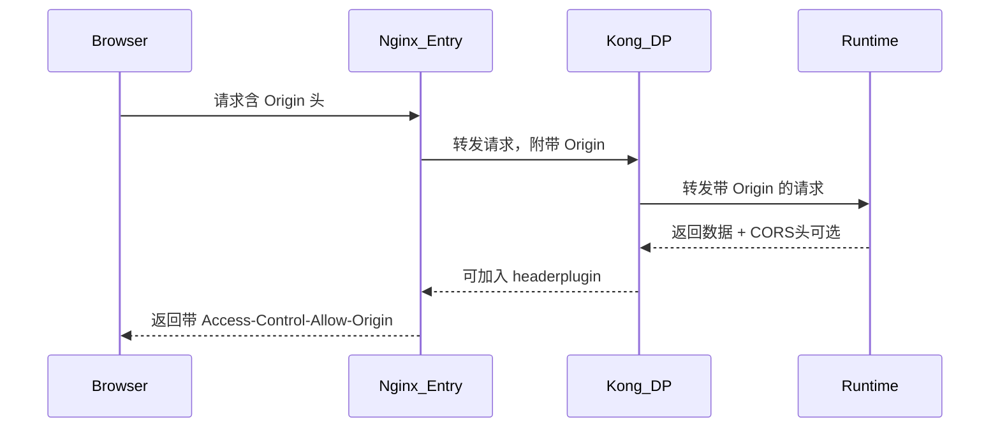
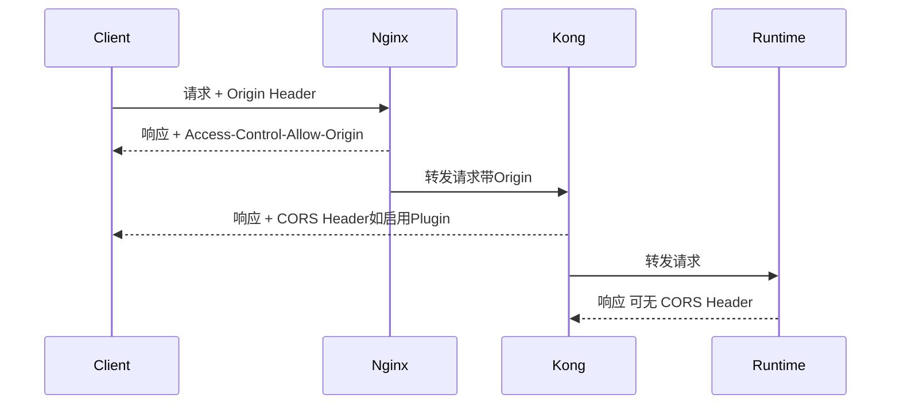

这个 “misconfigured Access-Control-Allow-Origin Header” 的漏洞（通常映射到 CWE-942）意味着你的服务器返回的 Access-Control-Allow-Origin 响应头配置不当，可能允许任意跨域请求，从而导致 潜在的跨站点请求伪造（CSRF）或数据泄露风险。

⸻

一、常见错误配置方式
	1.	配置为通配符 *：

Access-Control-Allow-Origin: *

这在开放API中常见，但对于需要认证的接口（如带 Cookie 或 Token 的请求），这是危险的，并且浏览器会拒绝带凭据的跨域请求。

	2.	动态返回Origin但未校验来源：

add_header Access-Control-Allow-Origin $http_origin;

若未限定 $http_origin 的来源，攻击者可构造任意 origin 导致泄露。

⸻

二、正确配置方法（Nginx 示例）

场景 1：允许特定域跨域访问（推荐）
```nginx.conf
location /api/ {
    if ($http_origin ~* "^https://(www\.abc\.com|trusted-client\.com)$") {
        add_header 'Access-Control-Allow-Origin' "$http_origin" always;
        add_header 'Access-Control-Allow-Credentials' 'true' always;
        add_header 'Access-Control-Allow-Methods' 'GET, POST, OPTIONS' always;
        add_header 'Access-Control-Allow-Headers' 'Authorization, Content-Type' always;
    }
}
```
	•	动态地返回 Access-Control-Allow-Origin，但限制来源白名单。
	•	若你使用的是 credentials（如 Authorization header 或 Cookie），必须设置：

Access-Control-Allow-Credentials: true

同时 不能用通配符 *。

⸻

三、检测和验证配置是否生效

1. 使用 curl 模拟跨域请求：

`curl -k -H "Origin: https://www.abc.com" -I https://www.abc.com/api/v1/resource`

检查响应中是否返回：
```bash
Access-Control-Allow-Origin: https://www.abc.com
Access-Control-Allow-Credentials: true
```
2. 使用浏览器 DevTools 检查跨域行为

在前端控制台，发起跨域请求后浏览器会明确标识 CORS 错误。

⸻

四、最佳实践总结

项目	建议配置
Access-Control-Allow-Origin	精确匹配可信 Origin，不使用通配符
Access-Control-Allow-Credentials	若使用 Cookie/Token，必须设置为 true
OPTIONS 预检请求	返回 200 并包含所有允许的方法和头
不信任请求处理	拒绝不在白名单内的 Origin，或不返回 CORS header


⸻

五、Mermaid 图：多层反向代理 + CORS 流程



⸻

是否需要我提供一个多层 nginx.conf + Kong plugin 示例来完整修复这个问题？
下面是你在 Nginx + Kong + Runtime 多层反向代理场景下，逐跳点验证 Access-Control-Allow-Origin header 的方法与配置建议，以及修复“misconfigured Access-Control-Allow-Origin Header”漏洞的 详细步骤。

⸻

一、你需要的核心目标
	•	确保每一跳（Nginx、Kong DP、Runtime）都能正确返回且不泛化的 Access-Control-Allow-Origin 头。
	•	避免使用通配符 *，尤其在认证请求中。
	•	能使用 curl 或浏览器 DevTools 验证每跳 CORS header。

⸻

二、配置建议

1. Nginx 层（www.abc.com）

# 在 http 或 server 或每个 location 块内判断 origin 来源
```nginx.conf
location /apiname1/v1/ {
    if ($http_origin ~* "^https://(www\.abc\.com|trusted\.com)$") {
        add_header 'Access-Control-Allow-Origin' "$http_origin" always;
        add_header 'Access-Control-Allow-Credentials' 'true' always;
        add_header 'Access-Control-Allow-Methods' 'GET, POST, OPTIONS' always;
        add_header 'Access-Control-Allow-Headers' 'Authorization, Content-Type' always;
    }

    proxy_pass https://kong.dp.internal;
    proxy_set_header Host $host;
    proxy_set_header X-Real-IP $remote_addr;
}
```
2. Kong DP 层

使用 Kong 的 CORS Plugin（开源版支持）：
```bash
curl -i -X POST http://localhost:8001/services/your-service/plugins \
    --data "name=cors" \
    --data "config.origins=https://www.abc.com" \
    --data "config.credentials=true"
```
每个 Service 或 Route 都可以独立挂上 CORS 插件。

3. Runtime 层（最终服务）
	•	若返回体中未包含 Access-Control-*，可在应用或 Sidecar Proxy（如 Envoy）中添加。
	•	通常建议让 Kong 或 Nginx 添加这类公共 header，由应用控制容易出错。

⸻

三、curl 逐跳验证方法

你可以模拟请求并观察 每一跳的响应 header 是否正确返回：

检查 Nginx 层是否返回 header：
```bash
curl -k -I -H "Origin: https://www.abc.com" https://www.abc.com/apiname1/v1/.well-known/health
```
期望输出中应包含：

Access-Control-Allow-Origin: https://www.abc.com
Access-Control-Allow-Credentials: true

检查 Kong 层是否正确返回（可在 Kong 前添加一个临时测试接口）：

curl -k -I -H "Origin: https://www.abc.com" https://kong.dp.internal/apiname1/v1/.well-known/health


⸻

四、Mermaid 图：逐跳 CORS 添加流程



⸻

五、总结：避免“misconfigured Access-Control-Allow-Origin Header”漏洞的关键

项目	是否推荐	原因说明
使用 * 通配符	否	无法支持凭据请求，容易放大攻击面
精准匹配 origin 白名单	是	限制跨域来源，只允许可信站点
Access-Control-Allow-Credentials	是（如使用 Cookie/Auth）	增加安全性，但必须和具体 Origin 一起使用
应用层处理 CORS	不推荐	推荐由 Nginx 或 Kong 统一处理，更可控、标准


⸻

是否需要我提供一个 curl 验证 shell 脚本，来批量验证多个 URL 或服务？


下面是你需要的完整修复建议与验证方法，帮助你彻底解决：

⸻

一、什么是 Misconfigured Access-Control-Allow-Origin Header

此类 CWE-942 漏洞通常由以下原因引起：

错误方式	风险
Access-Control-Allow-Origin: *	在认证请求中允许任意来源，信息泄露
动态回显 Origin 而未做校验	可被伪造 Origin 利用，CORS绕过攻击
多个 Access-Control-Allow-Origin 头	浏览器忽略或行为不一致，功能不可靠


⸻

二、正确配置方式（Nginx 层）

1. 推荐写法（严格来源白名单 + 动态匹配）
```nginx.conf
map $http_origin $cors_origin {
    default "";
    "~^https://(www\.abc\.com|trusted\.com)$" "$http_origin";
}

server {
    ...

    location /apiname1/v1/ {
        if ($request_method = 'OPTIONS') {
            add_header Access-Control-Allow-Origin "$cors_origin" always;
            add_header Access-Control-Allow-Methods 'GET, POST, OPTIONS' always;
            add_header Access-Control-Allow-Headers 'Authorization, Content-Type' always;
            add_header Access-Control-Allow-Credentials true always;
            return 204;
        }

        add_header Access-Control-Allow-Origin "$cors_origin" always;
        add_header Access-Control-Allow-Credentials true always;

        proxy_pass https://kong.internal;
    }
}
```
说明：
	•	map 块提前匹配安全来源。
	•	避免硬编码 *。
	•	OPTIONS 请求中返回 204，防止跨域预检失败。

⸻

三、Kong 层修复建议（如使用开源版）

启用 CORS 插件并配置安全来源：
```bash
curl -X POST http://localhost:8001/services/your-service/plugins \
     --data "name=cors" \
     --data "config.origins=https://www.abc.com,https://trusted.com" \
     --data "config.credentials=true"

```

⸻

四、如何逐跳验证 Header 是否生效

使用 curl 工具模拟跨域请求：
```bash
curl -i -H "Origin: https://www.abc.com" \
     -H "Access-Control-Request-Method: GET" \
     -X OPTIONS https://www.abc.com/apiname1/v1/.well-known/health
```
输出应包含：

HTTP/1.1 204 No Content
Access-Control-Allow-Origin: https://www.abc.com
Access-Control-Allow-Credentials: true

验证中间跳点（如 Kong）

如你有内部网段 IP，可直接测试：

curl -i -H "Origin: https://www.abc.com" https://kong.dp.internal/apiname1/v1/.well-known/health

浏览器中验证（DevTools）

打开浏览器 F12 > Network > 请求详情 > Response Headers，确认：
	•	没有重复的 Access-Control-Allow-Origin
	•	没有设置 * 与 credentials: true 同时存在

⸻

五、总结建议

位置	建议
Nginx	设置 CORS Header（使用 map + add_header + always）
Kong	启用 CORS 插件，配置安全来源
应用服务	不设置或仅作为兜底，防止重复 header
验证	curl 结合浏览器 DevTools 检查 header 传递路径


⸻

需要我帮你生成一个完整的 Nginx CORS 配置模版吗？


