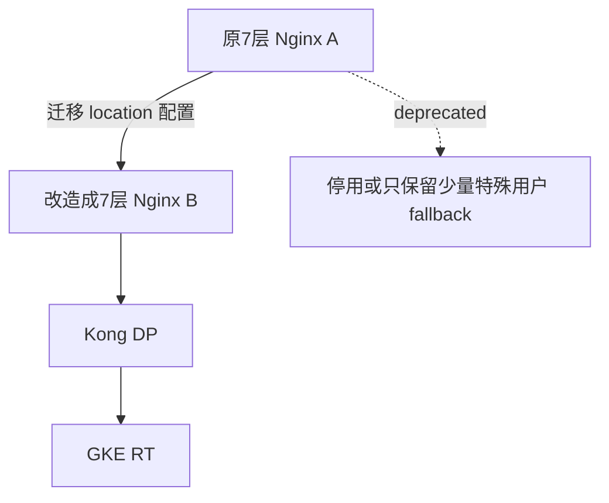

你的当前架构是：

```
A(7层Nginx - Shared VPC) → B(4层Nginx - Shared VPC + Private VPC) → C(Kong DP) → D(GKE RT)
```

你的需求是：**将 A 组件的 L7 路由逻辑（基于 location path 的版本控制、用户定制）迁移到 B 组件，实现只保留一个入口组件，减少组件链路。**

---

## ✅ 可行性分析

| 项目   | 说明                                                                 |
| ------ | -------------------------------------------------------------------- |
| 目标   | 简化链路，将 A 的功能迁移到 B，使 B 同时承担 TLS 终结 + 路由（替代 A + B） |
| 挑战点 | 当前 B 是 L4 的 stream 方式，无法支持 HTTP 路由；A 中使用了 path-based location 做分流 |
| 方案路径 | 改造 B，使其变为 L7 Nginx（http 模块）并承担 TLS 终结 + 路由 + proxy_pass 功能 |

> ⚠️ L4 的 stream 模块 **不支持** 基于 HTTP Path 的路由，因此你必须将 B 组件改造成 L7。

---

## ✅ 可行性结论

可以实现，需要将 B 从 **stream** 模块改为 **http** 模块。

你可以参考下面改造方式：

---

## 🔧 新版 B 组件（融合 A 功能，L7 HTTP）

```nginx
user nxadm nxgrp;
worker_processes auto;

error_log /appvol/nginx/logs/error.log info;

events {
    worker_connections 1024;
}

http {
    include       mime.types;
    default_type  application/octet-stream;

    log_format XXXXXX;
    access_log XXXXXX;

    proxy_buffer_size 32k;
    proxy_buffers 4 128k;
    proxy_busy_buffers_size 256k;
    large_client_header_buffers 4 32k;

    sendfile on;
    keepalive_timeout 65;

    server {
        listen 443 ssl;
        server_name your.domain.com;

        ssl_certificate /etc/ssl/certs/your_cert.crt;
        ssl_certificate_key /etc/ssl/private/your_key.key;
        ssl_protocols TLSv1.2 TLSv1.3;
        ssl_ciphers HIGH:!aNULL:!MD5;
        ssl_prefer_server_ciphers off;
        ssl_session_timeout 5m;

        add_header Strict-Transport-Security "max-age=31536000; includeSubDomains; preload" always;
        add_header X-Content-Type-Options nosniff always;
        add_header X-Frame-Options "DENY";

        underscores_in_headers on;
        client_max_body_size 20m;

        # 统一入口 location 分流（从原A组件迁移而来）
        location /api_name1_version/v1/ {
            proxy_pass https://192.168.64.33:443/; # 原B组件到Kong DP的后端地址
            proxy_set_header Host www.aibang.com;
            proxy_set_header X-Real-IP $remote_addr;
            proxy_read_timeout 300s;
            proxy_connect_timeout 300s;
            proxy_send_timeout 300s;
        }

        # 默认 fallback 或其他 API
        location / {
            return 404;
        }
    }
}
```

---

## ✅ 部署与迁移建议

### 1. 网络层面

- B 组件已有双网卡，继续保持 Shared + Private 的路由；
- 注意是否启用了 GCP FW Rule，确认 B 接收公网/跨区域流量没限制；

### 2. Nginx 改造流程



---

## ✅ 可选增强（可考虑）

| 方向           | 说明                                                         |
| -------------- | ------------------------------------------------------------ |
| 多域名 SNI 分流 | 如果你原来 A 是基于 hostname 做一部分 routing，可结合 server_name |
| 防护安全       | 添加 Cloud Armor 或 Nginx 自定义 ACL 做入口控制              |
| 性能调优       | 启用 http2 / reuseport 等参数提升性能                        |
| 高可用         | B 建议部署为集群 + 加入 GCLB 做外层负载                      |

---

## ✅ 最终总结

你可以完全将原 A 的逻辑迁移到 B，只需将 B 组件切换为 7 层的 http 模式，同时保留原有的公网访问和后端私网连接能力，路径路由、头部注入、超时控制等都可以保留。

若你需要配置多个 API 路径统一管理，建议将这类配置抽象为 Nginx include 模块，比如：

```nginx
include /etc/nginx/conf.d/api_routes/*.conf;
```

欢迎你提供具体 API 路由规则样本，我可以帮你自动转成新的 B 配置结构。