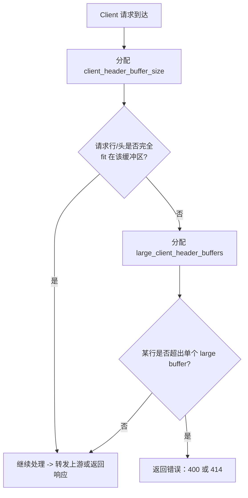

# large-client-header-buffers

好问题，这个点非常多人会误解，而且你问得已经到 Nginx 行为层面 了 👍  
我先把结论一句话给你，然后再把"为什么"讲透。

---

## 一句话结论（先记住）

绝大多数情况下，只设置 `large_client_header_buffers` 就足够了；`client_header_buffer_size` 通常不需要显式配置，除非你在处理"极端单行 Header"的场景。

---

## 一、这两个参数在 Nginx 里的真实含义（不是表面翻译）

我们先把"官方定义"翻译成运行时行为，这一步非常关键。

---

### 1️⃣ client_header_buffer_size（初始 / 单行小缓冲）

**它在干什么？**

用于读取「请求头的第一行 + 较小的 header 行」的初始缓冲区大小

更准确地说：
- 用来读取：
  - Request-Line（GET /xxx HTTP/1.1）
  - 单行较小的 Header
- 默认值（大多数 Linux）：
  - 1k 或 4k（取决于 OS page size）

**它的行为特点**
- 只分配 1 个
- 只在"header 还不大"的阶段使用
- 如果发现：
  「当前 header 行放不下」
  👉 立刻切换到 `large_client_header_buffers`

📌 你可以把它理解成：

"试探用的小杯子"

---

### 2️⃣ large_client_header_buffers（真正处理大 Header 的地方）

**它在干什么？**

用于存放"单行较大的 Header（如 Cookie / Authorization / JWT）"

**配置格式：**

```
large_client_header_buffers <number> <size>;
```

例如：

```
large_client_header_buffers 4 32k;
```

**含义是：**

| 参数 | 含义 |
|------|------|
| 4 | 最多允许 4 个大 header 行 |
| 32k | 每一个 header 行最大 32KB |

👉 这是你解决 `Request Header Or Cookie Too Large` 的真正核心参数

---

## 二、Nginx 实际处理流程（你关心的"为什么没看到第二个"）

我们用一个真实运行时流程来看：

```
客户端发请求
 ↓
Nginx 用 client_header_buffer_size 读取
 ↓
如果 header 行 <= buffer
   → 直接成功
如果 header 行 > buffer
   → 分配 large_client_header_buffers
 ↓
如果 header 行 > large buffer size
   → 400 Request Header Or Cookie Too Large
```

**关键点来了 👇**

只要请求头稍微"大一点"，Nginx 几乎立刻就会用 `large_client_header_buffers`

这就是为什么：
- 你 **经常看到** 只配置了 `large_client_header_buffers`
- 却 **很少看到** 有人显式配置 `client_header_buffer_size`

---

## 三、为什么很多生产环境"只配第一个，不配第二个"

### 原因 1：client_header_buffer_size 默认值已经够用

请求行一般是：

```
GET /api/user/profile HTTP/1.1
```

- 几个小 header：

```
Host:
User-Agent:
Accept:
```

👉 1k / 4k 完全够

---

### 原因 2：真正炸的都是 Cookie / Authorization

你现在遇到的 400，99% 来自：
- Cookie
- `Authorization: Bearer <JWT>`
- SSO / OAuth / OIDC token

这些 一行就 5k / 10k / 20k  
👉 直接落在 `large_client_header_buffers`

---

### 原因 3：large_client_header_buffers 是"硬门槛"

这条规则非常重要：

**单行 header 的最大允许值 = `large_client_header_buffers` 的 size**

和 `client_header_buffer_size` 没有叠加关系

---

## 四、那你到底"需不需要"设置 client_header_buffer_size？

✅ **绝大多数 API 平台（你的场景）**

不需要

你的典型配置已经是正确的：

```
large_client_header_buffers 4 32k;
```

这已经能处理：
- 单个 header 行 ≤ 32k
- 最多 4 个大 header

---

⚠️ **什么时候才"建议一起设置"？**

下面这些少见但真实存在：

### 场景 1：极长的 URL / Query String

```
GET /api/search?filter=xxxx...(10k)... HTTP/1.1
```

👉 请求行本身就超过默认 buffer

这时候可以：

```
client_header_buffer_size 8k;
```

---

### 场景 2：安全设备 / WAF 插了很长的 header
例如：

```
X-Forwarded-For: ip1, ip2, ip3, ... (很多)
X-Trace-Context: 超长
```

---

### 场景 3：你想"统一可读性 + 明确基线"
在平台级配置中（不是强需求）：

```
client_header_buffer_size 8k;
large_client_header_buffers 4 32k;
```

这样做的好处是：
- 行为更可预期
- 不依赖 OS page size

---

## 五、你现在这个问题的"最正确姿势"（直接给答案）

如果你看到：

**已经有**

```
large_client_header_buffers 4 32k;
```

那么：
- ✅ 你已经解决 99% 的 Header Too Large 问题
- ❌ 不配置 `client_header_buffer_size` 也完全 OK
- ❌ 不是必须项
- ❌ 不会导致问题没解决

---

## 六、一个很重要但常被忽略的点（送你）

真正的瓶颈往往在 Upstream，而不是 Nginx

如果你已经：
- Ingress / Nginx：32k
- 但还是 400

那你该立刻看的是：

| 后端 | 参数 |
|------|------|
| Spring Boot | `server.max-http-header-size` |
| Tomcat | `maxHttpHeaderSize` |
| Jetty | `requestHeaderSize` |
| Node.js | `--max-http-header-size` |

👉 通过阈值 = Min(Nginx, Backend)

---

## 最终一句话压轴总结（给你一个可以"盖章"的说法）

`large_client_header_buffers` 才是决定请求头是否过大的"硬限制"，而 `client_header_buffer_size` 只是前置读取用的小缓冲；在 API 平台场景下，只配置前者通常已经足够，后者不是必须项。

如果你愿意，下一步我可以直接帮你做一个  
「Ingress / Nginx / Spring Boot Header Size 对照表」，  
非常适合你们平台级文档或 Support Runbook。

# **问题分析**

`client_header_buffer_size 4k` 这个配置项控制 Nginx 用来读取**客户端请求首部（request line + header lines）**的初始缓冲区大小。默认值通常是 1k，当首部较长（例如很长的 Cookie、很长的请求 URI、或代理/中间件附加了大量头）无法放入这个初始缓冲区时，Nginx 会改用由 `large_client_header_buffers` 指定的更大缓冲区来继续读取。

---

# **详细说明（行为与影响）**

- **作用对象**：读取 _请求行_（比如 `GET /path HTTP/1.1`）和随后的 _Header 行_（如 `Cookie:`、`Authorization:` 等）。若这些内容能全部放入 `client_header_buffer_size` 指定的缓冲区，则不再分配额外缓冲区。
- **回退逻辑**：如果内容超出初始缓冲区，Nginx 会申请由 `large_client_header_buffers` 配置的若干较大缓冲区来存放剩余数据（每一行头部必须完全放入某一个单独缓冲区，不能跨缓冲区拆分）。若某行头部超过单个 `large_client_header_buffers` 指定的大小，则会返回错误（URI 超过限制会返回 414，头部行超过限制会返回 400）。
- **内存/性能影响**：初始缓冲区本身很小（一般以 KB 为单位）；但如果流量很大且经常命中"回退到 large buffers"，会导致更多内存分配（每次请求/连接可能会分配这些缓冲区），从而在高并发下增加内存占用。通常把 `client_header_buffer_size` 从 1k 提高到 4k 是常见的做法，用来避免因 Cookie 等造成的 400/414 错误，但应同时考虑 `large_client_header_buffers` 的配套设置。

---

# **什么时候把它设为** `4k` **（实用建议）**

- 客户端/代理会发送很长的 Cookie 或长 Authorization（JWT）头。
- 上游或前端代理（如 CDN、应用网关）会在请求中注入大量头字段。
- 遇到大量 400 Bad Request / 414 Request-URI Too Large 且排查到是 header/URI 很长时。  
    设置到 4k 可以解决大多数浏览器/常见场景下的头部过长问题，但若仍不够，应同时调整 `large_client_header_buffers`。

---

# **推荐配置示例（放在** `http` **或** `server` **块中）**

```nginx
http {
    # 初始读取缓冲区：从默认 1k 提升到 4k
    client_header_buffer_size 4k;

    # 回退使用的"更大"缓冲区：4 个，每个 16k（按需调整）
    large_client_header_buffers 4 16k;

    server {
        listen 80;
        server_name example.com;

        location / {
            proxy_pass http://backend;
        }
    }
}
```

---

# **如何验证 / 测试**

- 查看生效配置（未重载）：

```bash
nginx -T | sed -n '1,200p' | grep -E 'client_header_buffer_size|large_client_header_buffers'
```

- 修改后平滑重载：

```bash
nginx -t && nginx -s reload
```

- 人为构造超大 header 测试（示例：构造 5000 字符的 Cookie）：

```bash
LONG=$(python3 -c "print('a'*5000)")
curl -v -H "Cookie: $LONG" http://your-nginx-host/
```

- 测试超长请求 URI：

```bash
LONG=$(python3 -c "print('a'*5000)")
curl -v "http://your-nginx-host/${LONG}"
```

观察是否返回 400 / 414，以及 Nginx error 日志里对应的提示。

---

# **流程图（简要，展示读取与回退逻辑）**



---

# **注意事项 & 排查建议**

- `client_header_buffer_size` 的**上下文**通常写在 http 或 server 块。修改后请用 `nginx -t` 校验并平滑重载。
- **每个 header 行必须能完整放入某个缓冲区**：增大初始缓冲区可以避免频繁分配 large buffers，但若某单行超长（例如极长的单个 Cookie/URI），仍需增大 `large_client_header_buffers` 的单个 size，否则会出现 400/414。
- 与上游服务（如 Tomcat、Apache、应用网关）保持一致：上游也可能有 header 大小限制（否则即使 Nginx 接受了，上游也会拒绝）。
- 内存权衡：不要盲目把所有缓冲区设为非常大（如每个连接都分配几十 KB 在高并发下会扩展成大量内存），应基于实际请求特征与并发进行测试。

---

# **快速总结**

- `client_header_buffer_size 4k` 是把 Nginx 的**初始 header 读取缓冲区**从默认 1k 提升到 4k，常用来避免因 Cookie/长头导致的 400/404 错误。
- 若仍然发生问题，请同时调整 `large_client_header_buffers` 并检查上游服务的 header 限制与日志；在高并发场景下注意内存消耗。

如果你愿意，我可以：

- 根据你当前的 Nginx 配置（把 `nginx -T` 输出贴来）给出基于流量/并发的推荐值；或者
- 帮你写一个小脚本用来批量模拟不同大小 header 的请求并收集返回情况（curl + 并发测试）。