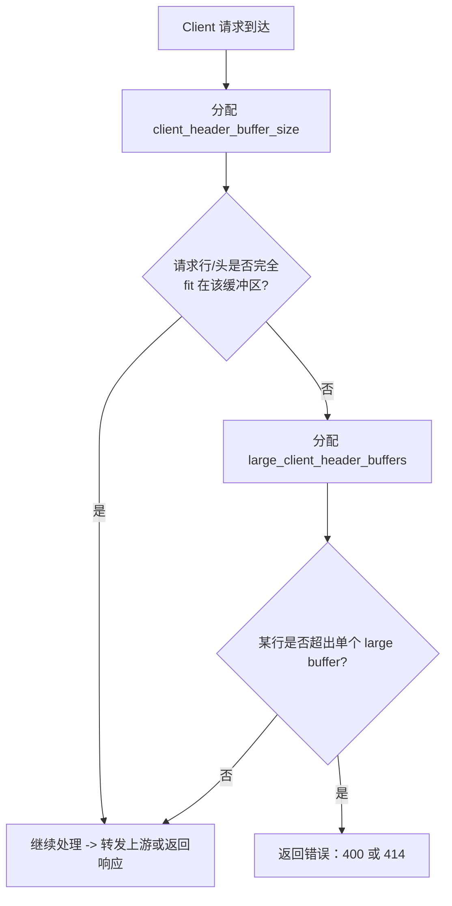

# **问题分析**

client_header_buffer_size 4k 这个配置项控制 Nginx 用来读取**客户端请求首部（request line + header lines）**的初始缓冲区大小。默认值通常是 1k，当首部较长（例如很长的 Cookie、很长的请求 URI、或代理/中间件附加了大量头）无法放入这个初始缓冲区时，Nginx 会改用由 large_client_header_buffers 指定的更大缓冲区来继续读取。

---

# **详细说明（行为与影响）**

- **作用对象**：读取 _请求行_（比如 GET /path HTTP/1.1）和随后的 _Header 行_（如 Cookie:、Authorization: 等）。若这些内容能全部放入 client_header_buffer_size 指定的缓冲区，则不再分配额外缓冲区。
- **回退逻辑**：如果内容超出初始缓冲区，Nginx 会申请由 large_client_header_buffers 配置的若干较大缓冲区来存放剩余数据（每一行头部必须完全放入某一个单独缓冲区，不能跨缓冲区拆分）。若某行头部超过单个 large_client_header_buffers 指定的大小，则会返回错误（URI 超过限制会返回 414，头部行超过限制会返回 400）。
- **内存/性能影响**：初始缓冲区本身很小（一般以 KB 为单位）；但如果流量很大且经常命中“回退到 large buffers”，会导致更多内存分配（每次请求/连接可能会分配这些缓冲区），从而在高并发下增加内存占用。通常把 client_header_buffer_size 从 1k 提高到 4k 是常见的做法，用来避免因 Cookie 等造成的 400/414 错误，但应同时考虑 large_client_header_buffers 的配套设置。

---

# **什么时候把它设为** **4k****（实用建议）**

- 客户端/代理会发送很长的 Cookie 或长 Authorization（JWT）头。
- 上游或前端代理（如 CDN、应用网关）会在请求中注入大量头字段。
- 遇到大量 400 Bad Request / 414 Request-URI Too Large 且排查到是 header/URI 很长时。
    设置到 4k 可以解决大多数浏览器/常见场景下的头部过长问题，但若仍不够，应同时调整 large_client_header_buffers。

---

# **推荐配置示例（放在** **http****或** **server****块中）**

```
http {
    # 初始读取缓冲区：从默认 1k 提升到 4k
    client_header_buffer_size 4k;

    # 回退使用的“更大”缓冲区：4 个，每个 16k（按需调整）
    large_client_header_buffers 4 16k;

    server {
        listen 80;
        server_name example.com;

        location / {
            proxy_pass http://backend;
        }
    }
}
```

---

# **如何验证 / 测试**

- 查看生效配置（未重载）：

```
nginx -T | sed -n '1,200p' | grep -E 'client_header_buffer_size|large_client_header_buffers'
```

- 修改后平滑重载：

```
nginx -t && nginx -s reload
```

- 人为构造超大 header 测试（示例：构造 5000 字符的 Cookie）：

```
LONG=$(python3 -c "print('a'*5000)")
curl -v -H "Cookie: $LONG" http://your-nginx-host/
```

- 测试超长请求 URI：

```
LONG=$(python3 -c "print('a'*5000)")
curl -v "http://your-nginx-host/${LONG}"
```

观察是否返回 400 / 414，以及 Nginx error 日志里对应的提示。

---

# **流程图（简要，展示读取与回退逻辑）**



---

# **注意事项 & 排查建议**

- client_header_buffer_size 的**上下文**通常写在 http 或 server 块。修改后请用 nginx -t 校验并平滑重载。
- **每个 header 行必须能完整放入某个缓冲区**：增大初始缓冲区可以避免频繁分配 large buffers，但若某单行超长（例如极长的单个 Cookie/URI），仍需增大 large_client_header_buffers 的单个 size，否则会出现 400/414。
- 与上游服务（如 Tomcat、Apache、应用网关）保持一致：上游也可能有 header 大小限制（否则即使 Nginx 接受了，上游也会拒绝）。
- 内存权衡：不要盲目把所有缓冲区设为非常大（如每个连接都分配几十 KB 在高并发下会扩展成大量内存），应基于实际请求特征与并发进行测试。

---

# **快速总结**

- client_header_buffer_size 4k 是把 Nginx 的**初始 header 读取缓冲区**从默认 1k 提升到 4k，常用来避免因 Cookie/长头导致的 400/414 错误。
- 若仍然发生问题，请同时调整 large_client_header_buffers 并检查上游服务的 header 限制与日志；在高并发场景下注意内存消耗。

如果你愿意，我可以：

- 根据你当前的 Nginx 配置（把 nginx -T 输出贴来）给出基于流量/并发的推荐值；或者
- 帮你写一个小脚本用来批量模拟不同大小 header 的请求并收集返回情况（curl + 并发测试）。
