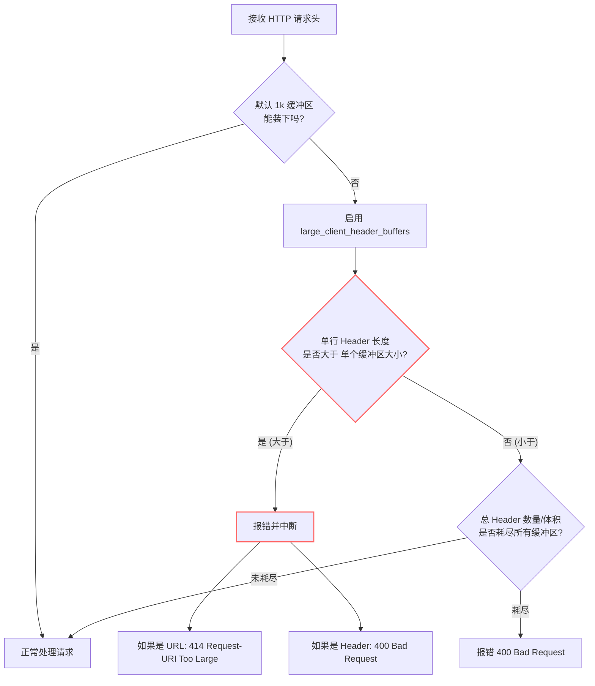

# large-client-header-buffers

好问题，这个点非常多人会误解，而且你问得已经到 Nginx 行为层面 了 👍
我先把结论一句话给你，然后再把"为什么"讲透。

---

## 一句话结论（先记住）

绝大多数情况下，只设置 `large_client_header_buffers` 就足够了；`client_header_buffer_size` 通常不需要显式配置，除非你在处理"极端单行 Header"的场景。

---

## 一、这两个参数在 Nginx 里的真实含义（不是表面翻译）

我们先把"官方定义"翻译成运行时行为，这一步非常关键。

---

### 1️⃣ client_header_buffer_size（初始 / 单行小缓冲）

**它在干什么？**

用于读取「请求头的第一行 + 较小的 header 行」的初始缓冲区大小

更准确地说：

- 用来读取：
  - Request-Line（GET /xxx HTTP/1.1）
  - 单行较小的 Header
- 默认值（大多数 Linux）：
  - 1k 或 4k（取决于 OS page size）

**它的行为特点**

- 只分配 1 个
- 只在"header 还不大"的阶段使用
- 如果发现：
    「当前 header 行放不下」
    👉 立刻切换到 `large_client_header_buffers`

📌 你可以把它理解成：

"试探用的小杯子"

---

### 2️⃣ large_client_header_buffers（真正处理大 Header 的地方）

**它在干什么？**

用于存放"单行较大的 Header（如 Cookie / Authorization / JWT）"

**配置格式：**

```
large_client_header_buffers <number> <size>;
```

例如：

```
large_client_header_buffers 4 32k;
```

**含义是：**

| 参数 | 含义                      |
| ---- | ------------------------- |
| 4    | 最多允许 4 个大 header 行 |
| 32k  | 每一个 header 行最大 32KB |

👉 这是你解决 `Request Header Or Cookie Too Large` 的真正核心参数

---

## 二、Nginx 实际处理流程（你关心的"为什么没看到第二个"）

我们用一个真实运行时流程来看：

```
客户端发请求
 ↓
Nginx 用 client_header_buffer_size 读取
 ↓
如果 header 行 <= buffer
   → 直接成功
如果 header 行 > buffer
   → 分配 large_client_header_buffers
 ↓
如果 header 行 > large buffer size
   → 400 Request Header Or Cookie Too Large
```

**关键点来了 👇**

只要请求头稍微"大一点"，Nginx 几乎立刻就会用 `large_client_header_buffers`

这就是为什么：

- 你 **经常看到** 只配置了 `large_client_header_buffers`
- 却 **很少看到** 有人显式配置 `client_header_buffer_size`

---

## 三、为什么很多生产环境"只配第一个，不配第二个"

### 原因 1：client_header_buffer_size 默认值已经够用

请求行一般是：

```
GET /api/user/profile HTTP/1.1
```

- 几个小 header：

```
Host:
User-Agent:
Accept:
```

👉 1k / 4k 完全够

---

### 原因 2：真正炸的都是 Cookie / Authorization

你现在遇到的 400，99% 来自：

- Cookie
- `Authorization: Bearer <JWT>`
- SSO / OAuth / OIDC token

这些 一行就 5k / 10k / 20k
👉 直接落在 `large_client_header_buffers`

---

### 原因 3：large_client_header_buffers 是"硬门槛"

这条规则非常重要：

**单行 header 的最大允许值 = `large_client_header_buffers` 的 size**

和 `client_header_buffer_size` 没有叠加关系

---

## 四、那你到底"需不需要"设置 client_header_buffer_size？

✅ **绝大多数 API 平台（你的场景）**

不需要

你的典型配置已经是正确的：

```
large_client_header_buffers 4 32k;
```

这已经能处理：

- 单个 header 行 ≤ 32k
- 最多 4 个大 header

---

⚠️ **什么时候才"建议一起设置"？**

下面这些少见但真实存在：

### 场景 1：极长的 URL / Query String

```
GET /api/search?filter=xxxx...(10k)... HTTP/1.1
```

👉 请求行本身就超过默认 buffer

这时候可以：

```
client_header_buffer_size 8k;
```

---

### 场景 2：安全设备 / WAF 插了很长的 header

例如：

```
X-Forwarded-For: ip1, ip2, ip3, ... (很多)
X-Trace-Context: 超长
```

---

### 场景 3：你想"统一可读性 + 明确基线"

在平台级配置中（不是强需求）：

```
client_header_buffer_size 8k;
large_client_header_buffers 4 32k;
```

这样做的好处是：

- 行为更可预期
- 不依赖 OS page size

---

## 五、你现在这个问题的"最正确姿势"（直接给答案）

如果你看到：

**已经有**

```
large_client_header_buffers 4 32k;
```

那么：

- ✅ 你已经解决 99% 的 Header Too Large 问题
- ❌ 不配置 `client_header_buffer_size` 也完全 OK
- ❌ 不是必须项
- ❌ 不会导致问题没解决

---

## 六、一个很重要但常被忽略的点（送你）

真正的瓶颈往往在 Upstream，而不是 Nginx

如果你已经：

- Ingress / Nginx：32k
- 但还是 400

那你该立刻看的是：

| 后端        | 参数                          |
| ----------- | ----------------------------- |
| Spring Boot | `server.max-http-header-size` |
| Tomcat      | `maxHttpHeaderSize`           |
| Jetty       | `requestHeaderSize`           |
| Node.js     | `--max-http-header-size`      |

👉 通过阈值 = Min(Nginx, Backend)

---

## 最终一句话压轴总结（给你一个可以"盖章"的说法）

`large_client_header_buffers` 才是决定请求头是否过大的"硬限制"，而 `client_header_buffer_size` 只是前置读取用的小缓冲；在 API 平台场景下，只配置前者通常已经足够，后者不是必须项。

如果你愿意，下一步我可以直接帮你做一个
「Ingress / Nginx / Spring Boot Header Size 对照表」，
非常适合你们平台级文档或 Support Runbook。

# **问题分析**

`client_header_buffer_size 4k` 这个配置项控制 Nginx 用来读取**客户端请求首部（request line + header lines）**的初始缓冲区大小。默认值通常是 1k，当首部较长（例如很长的 Cookie、很长的请求 URI、或代理/中间件附加了大量头）无法放入这个初始缓冲区时，Nginx 会改用由 `large_client_header_buffers` 指定的更大缓冲区来继续读取。

---

# **详细说明（行为与影响）**

- **作用对象**：读取 _请求行_（比如 `GET /path HTTP/1.1`）和随后的 _Header 行_（如 `Cookie:`、`Authorization:` 等）。若这些内容能全部放入 `client_header_buffer_size` 指定的缓冲区，则不再分配额外缓冲区。
- **回退逻辑**：如果内容超出初始缓冲区，Nginx 会申请由 `large_client_header_buffers` 配置的若干较大缓冲区来存放剩余数据（每一行头部必须完全放入某一个单独缓冲区，不能跨缓冲区拆分）。若某行头部超过单个 `large_client_header_buffers` 指定的大小，则会返回错误（URI 超过限制会返回 414，头部行超过限制会返回 400）。
- **内存/性能影响**：初始缓冲区本身很小（一般以 KB 为单位）；但如果流量很大且经常命中"回退到 large buffers"，会导致更多内存分配（每次请求/连接可能会分配这些缓冲区），从而在高并发下增加内存占用。通常把 `client_header_buffer_size` 从 1k 提高到 4k 是常见的做法，用来避免因 Cookie 等造成的 400/414 错误，但应同时考虑 `large_client_header_buffers` 的配套设置。

---

# **什么时候把它设为** `4k` **（实用建议）**

- 客户端/代理会发送很长的 Cookie 或长 Authorization（JWT）头。
- 上游或前端代理（如 CDN、应用网关）会在请求中注入大量头字段。
- 遇到大量 400 Bad Request / 414 Request-URI Too Large 且排查到是 header/URI 很长时。
     设置到 4k 可以解决大多数浏览器/常见场景下的头部过长问题，但若仍不够，应同时调整 `large_client_header_buffers`。

---

# **推荐配置示例（放在** `http` **或** `server` **块中）**

```nginx
http {
    # 初始读取缓冲区：从默认 1k 提升到 4k
    client_header_buffer_size 4k;

    # 回退使用的"更大"缓冲区：4 个，每个 16k（按需调整）
    large_client_header_buffers 4 16k;

    server {
        listen 80;
        server_name example.com;

        location / {
            proxy_pass http://backend;
        }
    }
}
```

---

# **如何验证 / 测试**

- 查看生效配置（未重载）：

```bash
nginx -T | sed -n '1,200p' | grep -E 'client_header_buffer_size|large_client_header_buffers'
```

- 修改后平滑重载：

```bash
nginx -t && nginx -s reload
```

- 人为构造超大 header 测试（示例：构造 5000 字符的 Cookie）：

```bash
LONG=$(python3 -c "print('a'*5000)")
curl -v -H "Cookie: $LONG" http://your-nginx-host/
```

- 测试超长请求 URI：

```bash
LONG=$(python3 -c "print('a'*5000)")
curl -v "http://your-nginx-host/${LONG}"
```

观察是否返回 400 / 414，以及 Nginx error 日志里对应的提示。

---

# **流程图（简要，展示读取与回退逻辑）**


---

# **注意事项 & 排查建议**

- `client_header_buffer_size` 的**上下文**通常写在 http 或 server 块。修改后请用 `nginx -t` 校验并平滑重载。
- **每个 header 行必须能完整放入某个缓冲区**：增大初始缓冲区可以避免频繁分配 large buffers，但若某单行超长（例如极长的单个 Cookie/URI），仍需增大 `large_client_header_buffers` 的单个 size，否则会出现 400/414。
- 与上游服务（如 Tomcat、Apache、应用网关）保持一致：上游也可能有 header 大小限制（否则即使 Nginx 接受了，上游也会拒绝）。
- 内存权衡：不要盲目把所有缓冲区设为非常大（如每个连接都分配几十 KB 在高并发下会扩展成大量内存），应基于实际请求特征与并发进行测试。

---

# **快速总结**

- `client_header_buffer_size 4k` 是把 Nginx 的**初始 header 读取缓冲区**从默认 1k 提升到 4k，常用来避免因 Cookie/长头导致的 400/404 错误。
- 若仍然发生问题，请同时调整 `large_client_header_buffers` 并检查上游服务的 header 限制与日志；在高并发场景下注意内存消耗。

如果你愿意，我可以：

- 根据你当前的 Nginx 配置（把 `nginx -T` 输出贴来）给出基于流量/并发的推荐值；或者
- 帮你写一个小脚本用来批量模拟不同大小 header 的请求并收集返回情况（curl + 并发测试）。

# 评估参数对比

下面我**只聚焦在 Nginx 语义本身**，把这两个配置拆开、对比清楚，顺带给你一些**真实可落地的选型建议**。

---

## **一、问题分析**

你给出的两种配置：

```
large_client_header_buffers 4 32k;
large_client_header_buffers 4 64k;
```

**唯一差别只有一个：单个 buffer 的大小不同（32KB vs 64KB）**

buffer 的数量（4 个）是完全一样的。

但这个差别，在 **HTTP Header 较大、并发较高、代理链路较长** 的架构里，影响非常实际。

---

## **二、参数本身是什么意思（拆开解释）**

### **1️⃣**

### **large_client_header_buffers**

> 用来处理 **"超出默认 header buffer 的 HTTP 请求头"**

Nginx 解析请求头时：

1. 先用 **小 buffer（client_header_buffer_size，默认 8k / 16k）**
2. 如果 header 太大 → **切换到 large_client_header_buffers**
3. 如果还放不下 → **直接 400 / 414 错误**

---

### **2️⃣**

### **4 32k vs 4 64k 的精确定义**

| **配置**  | **含义**                                    |
| --------- | ------------------------------------------- |
| 4         | 每个连接最多可分配 **4 个大 header buffer** |
| 32k / 64k | **每个 buffer 的大小**                      |

---

### **3️⃣ 最大可接收 Header 大小（理论上）**

| **配置** | **理论最大 Header**  |
| -------- | -------------------- |
| 4 32k    | 4 × 32KB = **128KB** |
| 4 64k    | 4 × 64KB = **256KB** |

⚠️ 注意：

这是 **单个请求头的上限**，不是 Body。

---

## **三、两种配置的真实行为差异**

### 🔹4 32k 的行为特征

```
large_client_header_buffers 4 32k;
```

**优点**

- 内存占用更小
- 适合普通 API / Web 请求
- 对大多数 OAuth / JWT / 常规 Cookie 足够

**缺点**

- 以下情况容易触发 400：
  - Cookie 非常多
  - JWT 很长
  - 经过多层代理反复追加 Header
  - 自定义 Header 过多（X-\*）

---

### **🔹**

### **4 64k**

### **的行为特征**

```
large_client_header_buffers 4 64k;
```

**优点**

- 明显提升对"大 Header"的容忍度
- 对以下场景更安全：
  - API Gateway（Kong / Apigee / Envoy）
  - 多租户平台
  - SSO / OAuth / MTLS + cert info 注入 header
  - Cloud Load Balancer → Nginx → Nginx → App

**代价**

- **每个连接**可能多占用内存
- 在高并发下内存压力上升

---

## **四、内存影响（这是很多人忽略的重点）**

### **单连接潜在内存占用**

| **配置** | **最大 header 内存** |
| -------- | -------------------- |
| 4 32k    | 128KB / 连接         |
| 4 64k    | 256KB / 连接         |

### **假设场景（举例）**

| **并发连接** | **32k 配置** | **64k 配置** |
| ------------ | ------------ | ------------ |
| 1,000        | ~128MB       | ~256MB       |
| 5,000        | ~640MB       | ~1.25GB      |

⚠️ Nginx 是 **per connection** 分配，不是 per request。

---

## **五、什么时候你"必须"选 64k？**

你可以用下面这张判断表：

| **场景**                     | **推荐**     |
| ---------------------------- | ------------ |
| 普通 Web / 内部 API          | 4 32k        |
| Kong / API Gateway 前置      | 4 64k        |
| JWT + 多 Cookie              | 4 64k        |
| 多层反向代理（≥2）           | 4 64k        |
| 出现过偶发 400 / 414         | **直接 64k** |
| MTLS + cert info 注入 header | **64k**      |

结合你**API 平台 + 多级 Nginx + Kong** 的背景（我看过你之前的链路），**64k 是更稳妥的选择**。

---

## **六、常见误区澄清**

### **❌ "64k 会让每个连接固定占用 256k 内存"**

**不完全对**

- Nginx 是 **按需分配**
- 只有 header 超出默认 buffer 才会用到
- 但高并发下，确实要按最坏情况评估

---

### **❌ "只改 large_client_header_buffers 就够了"**

通常你还要确认：

```
client_header_buffer_size 16k;
```

避免小 header 也频繁触发 large buffer。

---

## **七、推荐的实战组合（API 平台）**

如果你让我给一个 **稳态生产建议**：

```
client_header_buffer_size 16k;
large_client_header_buffers 4 64k;
```

这是 **API Gateway / 平台型 Nginx** 的常见安全组合。

---

## **八、如果你愿意，我可以继续帮你做的**

- 帮你 **从真实请求中估算 header 大小**
- 教你用 nginx debug log 看 buffer 使用情况
- 分析 **Ingress Controller / Kong 到底用了哪一层的 Nginx**
- 帮你评估 **是不是该降 buffer 数量而不是 size**

你可以直接说：

👉 _"结合我现在这条链路，帮我定一个最优 buffer 方案"_

你好！我是 GKE 和 Linux 基础设施专家。关于 Nginx 中 `large_client_header_buffers` 配置的差异，这是一个非常经典的性能调优与请求处理限制问题，特别是在处理携带大量 Cookie 或超长 URL 的现代 Web 应用（如包含复杂 JWT 令牌的请求）时至关重要。

以下是针对 `4 32k` 和 `4 64k` 这两个配置的详细深度解析。

---

## 1. 问题分析

**核心概念**：`large_client_header_buffers` 指令用于控制 Nginx 用于读取大型客户端请求头的**缓冲区数量**和**每个缓冲区的大小**。

Nginx 处理请求头的逻辑如下：

1. 首先使用默认的 `client_header_buffer_size`（通常为 1k）读取请求头。
2. 如果请求头（Request Line 或 Header Line）超过默认大小，Nginx 将开始按需分配 `large_client_header_buffers` 定义的缓冲区。
3. **关键限制**：HTTP 请求中的**单行**（例如一个超长的 URL，或者一个巨大的 `Cookie: ...` 头）必须能够放入**单个**缓冲区中。它不能被拆分到两个缓冲区里。

## 2. 详细对比与解决方案

### 配置含义拆解

语法：`large_client_header_buffers <数量> <大小>;`

| **配置项** | **缓冲区数量** | **单个缓冲区大小**   | **单个 Header 最大长度** | **总容量上限 (理论)** |
| ---------- | -------------- | -------------------- | ------------------------ | --------------------- |
| **配置 A** | `4`            | `32k` (32 kilobytes) | **32k**                  | 128k                  |
| **配置 B** | `4`            | `64k` (64 kilobytes) | **64k**                  | 256k                  |

### 具体差别解析

#### 1. 对"单行"数据的限制 (最核心的区别)

这是两者最本质的区别。

- **场景**：假设你有一个 OAuth2 / OIDC 认证流程，生成的 JWT Token 放在 Cookie 中，长度达到了 **40KB**。
- **4 32k**：Nginx 会报错。因为单个缓冲区只有 32KB，装不下 40KB 的单行 Cookie 数据。
  - 如果是 URL 超长，报 `414 Request-URI Too Large`。
  - 如果是 Header（如 Cookie）超长，报 `400 Bad Request`。
- **4 64k**：Nginx 能正常处理。因为 40KB < 64KB，可以放入一个缓冲区。

#### 2. 内存消耗

- **分配机制**：这些缓冲区是**按需分配**的。如果连接建立但请求头很小，不会立即占满所有内存。
- **峰值消耗**：
  - **4 32k**：每个连接处理大头时，最多消耗 $4 \times 32k = 128k$ 内存。
  - **4 64k**：每个连接处理大头时，最多消耗 $4 \times 64k = 256k$ 内存。
- **影响**：在高并发场景下（例如 10,000 个并发连接），如果攻击者故意发送大包触发大缓冲区分配，`4 64k` 会比 `32k` 多消耗一倍的内存，更容易引发 OOM（内存溢出）风险。

### 总结：应该选哪个？

- **选 32k**：如果你的业务是标准的 API 或网页，没有极长的 URL 或巨大的 Cookie，且对内存敏感。这是更安全的保守设置。
- **选 64k**：如果你的业务涉及复杂的**单点登录 (SSO)**、**大型 JWT 传递**、或者 URL 中携带了大量 Base64 编码参数。

---

## 3. 请求处理流程图 (Mermaid)

为了更直观地理解 Nginx 是如何判定是否报错的，请参考以下流程：



---

## 4. 配置代码示例

以下展示如何在 Nginx 配置文件中正确应用这两个配置。通常建议配置在 `http` 块中，对所有 server 生效；或者单独配置在 `server` 块中。

```nginx
http {
    include       mime.types;
    default_type  application/octet-stream;

    # ==================================================
    # 缓冲区配置示例
    # ==================================================

    # 默认缓冲区，处理绝大多数标准请求
    client_header_buffer_size 1k;

    # 方案 A: 适用于大多数通用 Web 服务
    # large_client_header_buffers 4 32k;

    # 方案 B: 适用于携带大 Token/Cookie 的企业级应用
    large_client_header_buffers 4 64k;

    server {
        listen       80;
        server_name  example.com;

        location / {
            root   html;
            index  index.html index.htm;
        }
    }
}
```

### 在 Kubernetes Ingress (Nginx) 中的配置

如果您是在 GKE 环境使用 Nginx Ingress Controller，通常通过 ConfigMap 或 Annotation 进行配置。

**ConfigMap 方式 (推荐全局):**

```yaml
apiVersion: v1
kind: ConfigMap
metadata:
  name: nginx-configuration
  namespace: ingress-nginx
data:
  large-client-header-buffers: "4 64k"
```

**Annotation 方式 (针对单个 Ingress):**

```yaml
apiVersion: networking.k8s.io/v1
kind: Ingress
metadata:
  name: my-app-ingress
  annotations:
    nginx.ingress.kubernetes.io/server-snippet: |
      large_client_header_buffers 4 64k;
spec:
  ...
```

---

## 5. 注意事项与最佳实践

1. **木桶效应**：请记住，**单行** Header 的长度限制完全取决于第二个参数（Size）。增加第一个参数（数量 4 -> 8）只能让你容纳更多行的 Header，而不能让你容纳更长的那一行 Cookie。
2. **DDoS 风险**：不要盲目设置过大的值（如 `4 10m`）。这会成为 HTTP 洪水攻击的漏洞，攻击者可以发送大量刚好填满缓冲区的垃圾请求，耗尽服务器内存。
3. **调试建议**：如果你不确定设置多少合适，可以先设置为 `4 32k`。然后监控 Nginx 的 `error.log`。如果你频繁看到 `client sent too long header line` 错误，再将其升级为 `4 64k`。

---

**下一步建议**：

如果您正在排查具体的 `400` 或 `414` 错误，我可以为您提供一段具体的 `tcpdump` 或 `curl` 调试命令，来捕获并分析您当前的实际请求头大小，从而确定最精准的缓冲区数值。需要我提供这个调试脚本吗？
