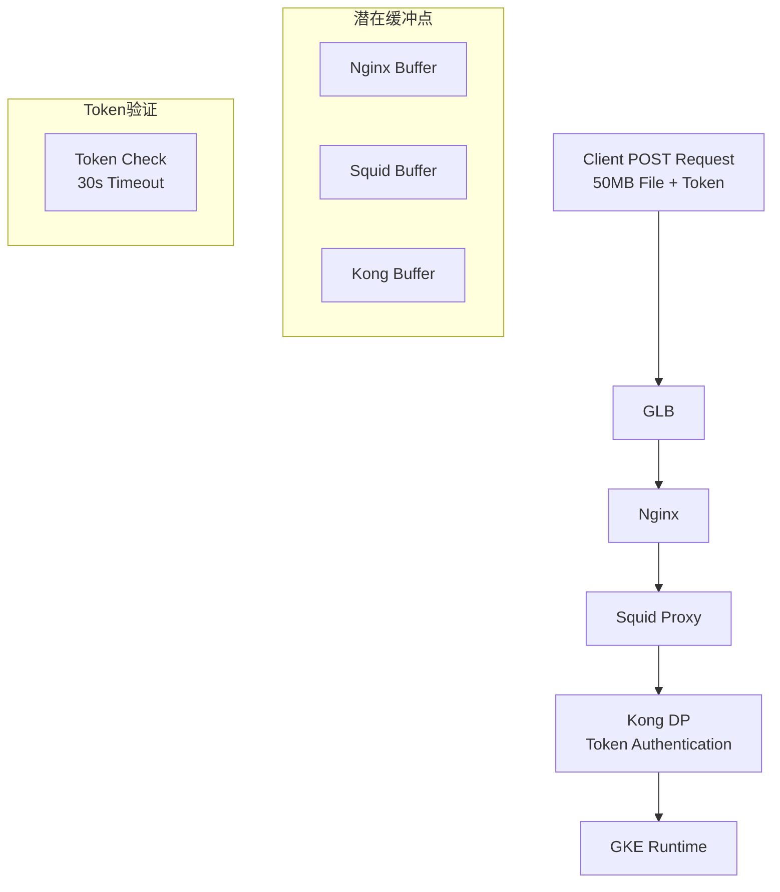
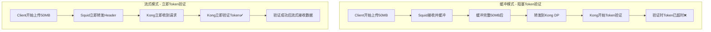
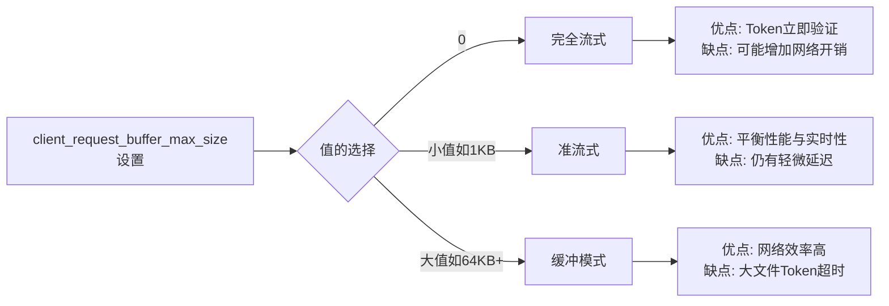
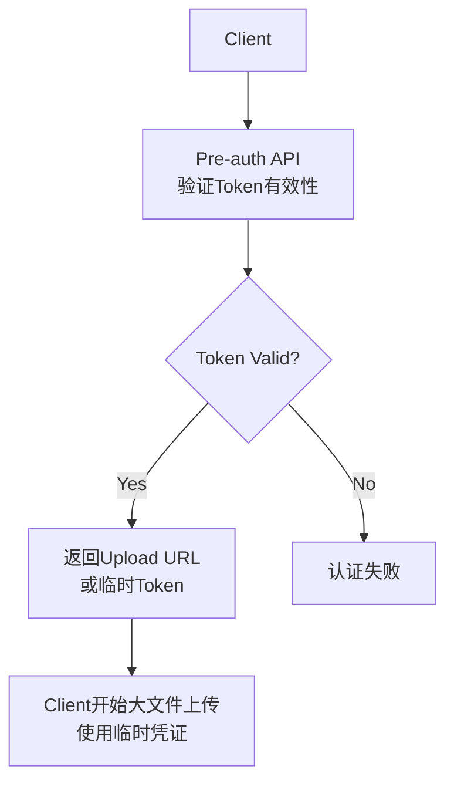
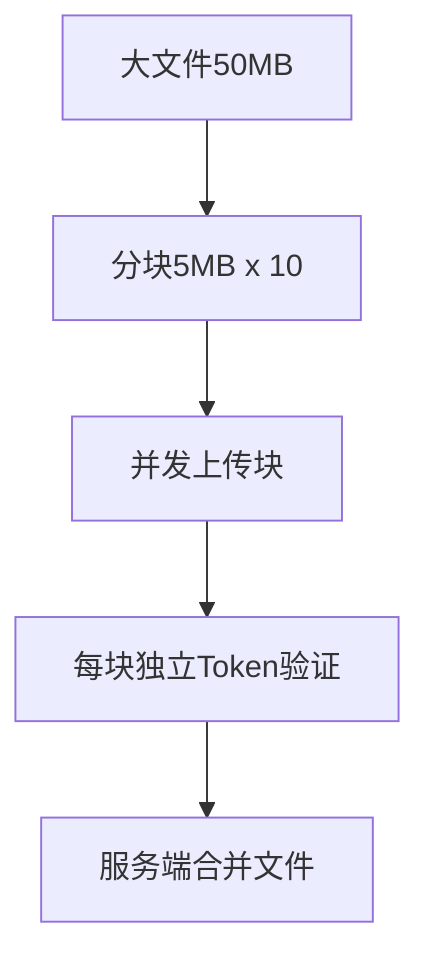

这个问题很典型，你遇到的是大文件上传与Token认证时效性冲突的问题。让我帮你分析整个请求流和解决方案。


# Summary 
- Token timeout setting nginx and squid

- nginx.conf 
```bash
    proxy_request_buffering off;
    proxy_buffering off;
```
- squid config 
```bash
https://www.squid-cache.org/Doc/config/client_request_buffer_max_size/
This specifies the maximum buffer size of a client request.
	It prevents squid eating too much memory when somebody uploads
	a large file.
	这指定了客户端请求的最大缓冲区大小。它可以防止有人上传大文件时，Squid占用过多内存。
    Default Value:	client_request_buffer_max_size 512 KB
- 如果緩衝值設置過大,應該會引起校驗延遲,導致Token過期。 所以我這裡最終在我們的環境裡面走了默認值,也就是說刪除了這個配置。 以前有錯誤的配置值是50MB。
- 如果设置为了50M,那会大文件上传50M内都会先缓存如内存,再处理==> timeout 

- 支持大文件上传 request_body_max_size 100 MB 
- https://www.squid-cache.org/Doc/config/request_body_max_size/ Default Value:	No limit.
- 这个值官方是没有配置的,也就是说都没有做任何限制,所以说基于我的实际情况来说,我这个文件大小的上传限制在我的前端nginx,所以说这里我不需要再另行配置,这样也能保证我整个流程中的最简化配置,只需要在入口做上传限制就可以了。
- 

```

## 请求流分析



## 核心问题分析

你的Token超时30秒是在Kong DP层面验证的，关键问题是：

- 如果任何一层有缓冲，Token验证会延迟到缓冲完成后才开始
- 50MB文件传输可能超过30秒，导致Token在验证时已过期

## 解决方案

### 1. 确保全链路流式传输

#### Nginx配置

```nginx
location /api/ {
    proxy_pass http://squid_backend;
    proxy_request_buffering off;
    proxy_buffering off;
    proxy_http_version 1.1;
    client_max_body_size 100m;
    proxy_read_timeout 300s;
    proxy_send_timeout 300s;
}
```

## proxy_buffering
在这种 **大文件上传 + 流式传输** 的场景下，

proxy_request_buffering off; 和 proxy_buffering off; 通常会 **配合一起使用更合理**。

---

## **1. 两个指令的区别**

  

### **proxy_request_buffering off;**

- 控制 **客户端请求体** 如何处理。
    
- 默认是 on，Nginx 会先把整个请求体读完、缓存到内存/磁盘，再转发给上游。
    
- 设为 off 后，客户端请求体会 **边读边转发** 给上游（流式）。
    
- 典型用途：大文件上传、避免本地磁盘写入延迟。
    

---

### **proxy_buffering off;**

- 控制 **上游响应体** 如何处理。
    
- 默认是 on，Nginx 会先把上游响应读到缓冲区，再返回给客户端。
    
- 设为 off 后，Nginx 会 **上游响应一到就立刻转发**，不额外缓存。
    
- 典型用途：
    
    - 流式下载/实时推送（如 SSE、WebSocket-like 长连接）。
        
    - 避免大响应写入磁盘缓存。
        
    

---

## **2. 两者关系**

- **上传方向**：受 proxy_request_buffering 控制。
    
- **下载方向**：受 proxy_buffering 控制。
    

  

在你的流程里：

- **POST 大文件上传** → proxy_request_buffering off 必须用。
    
- 如果你的 **下游服务返回的响应也可能很大或需要实时返回** → 建议加 proxy_buffering off。
    
- 如果响应只是一个小的 JSON（比如 token 校验 OK/Fail），proxy_buffering 就算开着问题也不大。
    

---

## **3. 推荐配置片段**

```
location /api/ {
    proxy_pass http://squid_backend;

    # 上传大文件时避免缓存请求体
    proxy_request_buffering off;

    # 下游响应实时转发，不做额外缓冲
    proxy_buffering off;

    # 避免磁盘写缓存
    proxy_max_temp_file_size 0;
}
```

---

## **4. 注意点**

- 关闭 buffering 会 **增加 upstream 和客户端之间的耦合度**：
    
    - 如果上游处理慢，客户端也会被拖慢（因为没有缓存/解耦）。
        
    
- 如果请求/响应都可能很大，最好确认 **Nginx、Squid、Kong、GKE Runtime** 的链路都支持流式转发。
    

---

✅ 总结：

在你的场景里，

- proxy_request_buffering off; **必开**（大文件上传）。
    
- proxy_buffering off; **建议开**（避免大响应/实时传输时被缓存）。
    

---

要不要我帮你画一张 **上传 vs 响应链路的 buffer 对比图 (mermaid)**，让你清楚看到 request/response 分别在哪些层可能被缓存？


#### Squid配置检查

```bash
# 检查Squid是否支持流式传输
# squid.conf 中确认以下配置
request_body_max_size 100 MB # 允许客户端发送的最大请求体大小
client_request_buffer_max_size 0
```
## squid.conf 

## client_request_buffer_max_size 详细解释

### 配置含义

`client_request_buffer_max_size` 控制Squid在转发请求到后端服务器之前，最多缓冲多少客户端请求数据。

```bash
# squid.conf 配置示例
client_request_buffer_max_size 0        # 不缓冲，立即转发 这个说法不对 
client_request_buffer_max_size 1 KB     # 最多缓冲1KB
client_request_buffer_max_size 64 KB    # 默认值，缓冲64KB
```

### 缓冲 vs 流式传输对比



### 关键配置对比

|配置值|行为|对Token验证的影响|适用场景|
|---|---|---|---|
|`0`|不缓冲，立即转发|Token立即验证|大文件上传|
|`1 KB`|缓冲1KB后转发|几乎立即验证|平衡性能|
|`64 KB` (默认)|缓冲64KB后转发|小文件无影响，大文件延迟|一般场景|
|`1 MB`|缓冲1MB后转发|大文件显著延迟|不适合你的场景|

### 完整Squid配置示例

```bash
# /etc/squid/squid.conf

# 关键配置 - 实现流式传输
client_request_buffer_max_size 0

# 支持大文件上传
request_body_max_size 100 MB

# 超时配置
connect_timeout 30 seconds
read_timeout 300 seconds
request_timeout 300 seconds

# 禁用不必要的缓冲
cache deny all

# 日志配置用于调试
access_log /var/log/squid/access.log squid
```

### 验证配置是否生效

#### 方法1: 查看Squid日志

```bash
# 开启详细日志
echo "debug_options ALL,1 33,2" >> /etc/squid/squid.conf

# 重启Squid
systemctl restart squid

# 监控日志，观察请求转发时机
tail -f /var/log/squid/cache.log | grep -E "(clientReadRequest|serverSendRequest)"
```

#### 方法2: 网络抓包验证

```bash
# 在Squid服务器上抓包
tcpdump -i eth0 -w squid_traffic.pcap host kong-dp-ip

# 分析数据包时序
# 1. 客户端开始发送POST请求
# 2. 观察Squid何时开始向Kong转发
# 3. 确认Token验证请求的时机
```

#### 方法3: 测试脚本

```bash
#!/bin/bash

echo "Testing Squid streaming behavior..."

# 创建测试文件
dd if=/dev/zero of=test_10mb.bin bs=1M count=10

# 使用curl测试，记录时间点
curl -X POST \
  -H "Authorization: Bearer $TOKEN" \
  -H "Content-Type: application/octet-stream" \
  --data-binary @test_10mb.bin \
  -w "DNS: %{time_namelookup}s\nConnect: %{time_connect}s\nStart Transfer: %{time_starttransfer}s\nTotal: %{time_total}s\n" \
  -v \
  https://your-api-endpoint/upload 2>&1 | tee upload_test.log

# 分析关键时间点
echo "分析结果:"
echo "- 如果Start Transfer时间很短(<1s)，说明Token验证立即开始"
echo "- 如果Start Transfer时间很长，说明Squid在缓冲"
```

### 性能权衡考虑



### 针对你的场景的最佳配置

```bash
# 推荐配置 - 优先保证Token验证时效性
client_request_buffer_max_size 0

# 如果网络性能要求很高，可以设置很小的缓冲
# client_request_buffer_max_size 1 KB
```

### 配置生效验证

```bash
# 重新加载配置
squid -k reconfigure

# 验证配置解析正确
squid -k parse

# 检查当前生效的配置
squid -k show-config | grep client_request_buffer_max_size
```

这个配置的核心目的就是确保Squid不会等待接收完整个大文件才转发给Kong，而是立即转发请求头和开始的数据，让Kong能够立即进行Token验证。


#### Kong DP配置

```yaml
# Kong插件或路由配置
plugins:
- name: request-size-limiting
  config:
    allowed_payload_size: 104857600  # 100MB
- name: your-auth-plugin
  config:
    # 确保认证插件不缓冲请求体
```

### 2. 调整Token认证策略

#### 方案A: 预验证Token



#### 方案B: 延长Token有效期

```bash
# Kong JWT Plugin配置示例
curl -X POST http://kong-admin:8001/plugins \
  --data "name=jwt" \
  --data "config.secret_is_base64=false" \
  --data "config.run_on_preflight=false" \
  --data "config.claims_to_verify=exp" \
  --data "config.maximum_expiration=3600"  # 1小时
```

### 3. 分离认证和数据传输

#### 方案C: Header-Only认证

```nginx
# Nginx中提取并转发认证头
location /upload/ {
    # 立即转发认证头给Kong进行验证
    access_by_lua_block {
        local auth_header = ngx.var.http_authorization
        # 可以在这里做预验证API调用
    }
    
    proxy_pass http://backend;
    proxy_request_buffering off;
    proxy_set_header Authorization $http_authorization;
}
```

### 4. 使用分块上传



#### 实现示例

```javascript
// 客户端分块上传
const uploadChunks = async (file, token) => {
    const chunkSize = 5 * 1024 * 1024; // 5MB
    const chunks = Math.ceil(file.size / chunkSize);
    
    for (let i = 0; i < chunks; i++) {
        const chunk = file.slice(i * chunkSize, (i + 1) * chunkSize);
        await uploadChunk(chunk, i, token);
    }
};
```

### 5. 验证配置有效性

#### 测试脚本

```bash
#!/bin/bash
# 测试流式传输是否生效

echo "Testing streaming upload..."

# 创建测试大文件
dd if=/dev/zero of=test_50mb.bin bs=1M count=50

# 使用curl测试，观察传输开始时间
curl -X POST \
  -H "Authorization: Bearer $TOKEN" \
  -H "Content-Type: application/octet-stream" \
  --data-binary @test_50mb.bin \
  -w "Time: %{time_total}s\nStart Transfer: %{time_starttransfer}s\n" \
  https://your-api-endpoint/upload
```

## 推荐实施顺序

1. **立即实施**: 确认Squid流式配置
2. **短期**: 实施预验证Token方案
3. **中期**: 考虑分块上传架构
4. **长期**: 优化整体文件上传流程

## Squid流式配置检查

```bash
# 检查当前Squid配置
squid -k parse

# 关键配置项
grep -E "(request_body_max_size|client_request_buffer)" /etc/squid/squid.conf
```

这样可以确保Token在请求开始时就被验证，而不是等待整个文件传输完成。