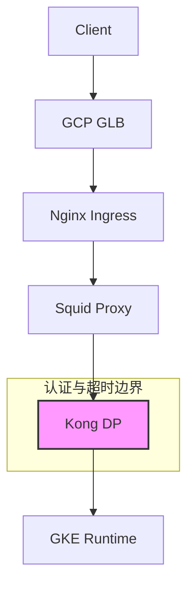
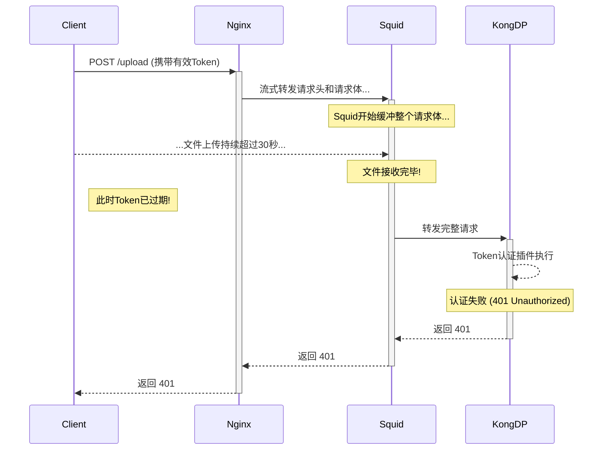
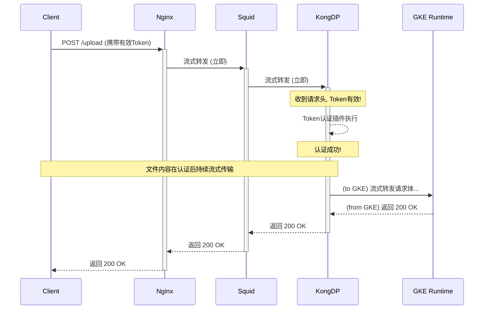

# 解决复杂代理链路中的大文件上传与 Token 超时问题

## 1. 问题场景分析

我们面临一个在复杂云原生环境中非常典型的问题：一个包含大文件上传的 `POST` 请求，在经过多层代理后，因为其中某个环节的请求缓冲（Buffering），导致请求到达最终认证节点（Kong DP）时已经耗时过长，使得请求头中的认证 Token（有效期30秒）失效，最终导致认证失败。

### 1.1. 请求链路架构

首先，我们必须清晰地描绘出整个请求的路径：



- **关键点**：Token 认证发生在 **Kong DP** 层。这意味着，从客户端发起请求到 Kong DP 开始处理这个请求的**时间**，必须小于 Token 的有效期（30秒）。

### 1.2. 核心矛盾：上传时间 vs Token 有效期

- **错误理解**：整个文件上传过程必须在30秒内完成。
- **正确理解**：**请求头（Headers）** 必须在30秒内到达 Kong DP 并通过认证。一旦认证通过，请求体（文件内容）的传输可以持续更长的时间。

问题的根源在于，如果链路中的任何一个代理（Nginx, Squid）启用了请求缓冲，它会尝试接收完**整个**50MB的文件体，然后再将完整的请求转发给下一级。如果上传这50MB文件花费了超过30秒，那么当请求最终到达 Kong DP 时，Token 早已过期。

## 2. 定位瓶颈：端到端流式处理的断点

你已经正确地在 Nginx 和 Kong DP 上禁用了缓冲（`proxy_request_buffering off`），这非常好。然而，效果不理想，这强烈暗示链路中间的 **Squid 代理** 成为了新的瓶颈。

### 2.1. 两种模式的对比

让我们通过时序图来直观地看到区别：

#### 模式 A：链路中存在缓冲（当前的问题）



#### 模式 B：端到端流式处理（我们的目标）



## 3. 解决方案：构建端到端的流式处理链路

为了实现 **模式 B**，我们必须确保从 Nginx 到 Kong DP 的每一个环节都以流式（Streaming）方式处理请求。

### 3.1. 链路配置检查清单

#### ✅ **Nginx 层 (已完成)**
- **确认配置**: `proxy_request_buffering off;`
- **推荐优化**:
  - 开启 HTTP/1.1 以支持 `chunked` 编码转发。
  - 延长超时时间，防止长连接被意外断开。
```nginx
# location /...
proxy_request_buffering off;
proxy_http_version 1.1;
proxy_set_header Connection ""; # 清除 Connection header，支持长连接

# 延长超时，给大文件上传足够的时间
proxy_connect_timeout 60s;
proxy_send_timeout 3600s;
proxy_read_timeout 3600s;
```

#### ⚠️ **Squid 层 (关键瓶颈)**
Squid 默认配置通常会为了内容扫描或缓存而缓冲请求体。我们必须禁用它。

- **核心配置 (`squid.conf`)**:
  - **`request_body_max_size 0`**: 这条指令的含义是**不对请求体的大小做任何限制**。这对于流式处理至关重要，因为在流开始时，代理不知道最终文件有多大。将其设置为 `0` (无限制) 是开启大文件流式处理的前提。
  - **`cache deny all`**: 强烈建议为这类动态上传的 API 创建一条 `acl`，并明确禁止缓存，以避免任何形式的磁盘写入。
  - **关闭内容适配 (ICAP/eCAP)**: 如果你使用了 ICAP 等功能，它们通常需要完整的 body，需要为流式API单独禁用。

- **示例 `squid.conf` 配置**:
```squid
# 定义一个 ACL 来匹配你的 API URL 路径
acl streaming_api urlpath_regex ^/your/upload/path

# 对这个 API 路径禁用缓存
cache deny streaming_api

# 对这个 API 路径不限制请求体大小
request_body_max_size 0 allow streaming_api
# 对其他普通请求，可以设置一个合理的限制
request_body_max_size 10 MB all
```

#### ✅ **Kong DP 层 (已完成)**
- **确认配置**: 在对应的 Kong Service/Route 上，确保 `request_buffering` 设置为 `false`。
- **推荐优化**: 在 Kong 的 Route/Service 上同样需要配置足够长的超时时间。
```yaml
# Kong Service apec
protocol: http
host: my-gke-service
port: 80
request_buffering: false
connect_timeout: 60000
write_timeout: 3600000
read_timeout: 3600000
```

#### ✅ **GKE Runtime 层**
- **确认应用逻辑**: 确保你的后端应用（如 Spring Boot, Node.js, Go 服务）能够处理**分块传输编码（Chunked Transfer Encoding）**的请求，而不是设计为一次性将整个请求读入内存。大部分现代Web框架默认都支持。

## 4. 验证方案

1.  **构造大文件**: 在本地创建一个大的虚拟文件。
    ```bash
    # 创建一个 60MB 的文件
    mkfile 60m largefile.bin
    ```
2.  **使用 cURL 测试**: 使用 `curl` 的 `-T` 选项来模拟流式上传，并观察响应。
    ```bash
    curl -v -X POST \
      -H "Authorization: Bearer <你的有效Token>" \
      -H "Content-Type: application/octet-stream" \
      -T largefile.bin \
      https://your-api-url/upload
    ```
3.  **观察日志**: 监控 Nginx, Squid, Kong 的日志，确认没有出现 `401 Unauthorized` 或 `413 Request Entity Too Large` 的错误。
4.  **抓包分析 (高级)**: 在 Squid 服务器上使用 `tcpdump`，同时监视流入（来自Nginx）和流出（去往Kong）的网络接口。你应该能看到数据包几乎是实时地从一个接口转发到另一个，而不是等待60MB全部接收完才开始发送。

## 5. 总结

你的问题根源在于请求链路中存在**“缓冲断点”**，最可疑的就是 **Squid 代理**。要解决这个问题，必须实现**端到端的全链路流式处理**。

**核心行动项**：
1.  **检查并修改 Squid 配置**，确保它不会缓冲大文件的请求体。
2.  **统一并延长**整个链路（Nginx, Squid, Kong）的超时时间。
3.  **验证**你的后端应用能处理流式输入。

完成以上改造后，你的大文件上传请求头将能在几毫秒内到达 Kong DP 完成认证，彻底解决30秒Token超时的问题。
