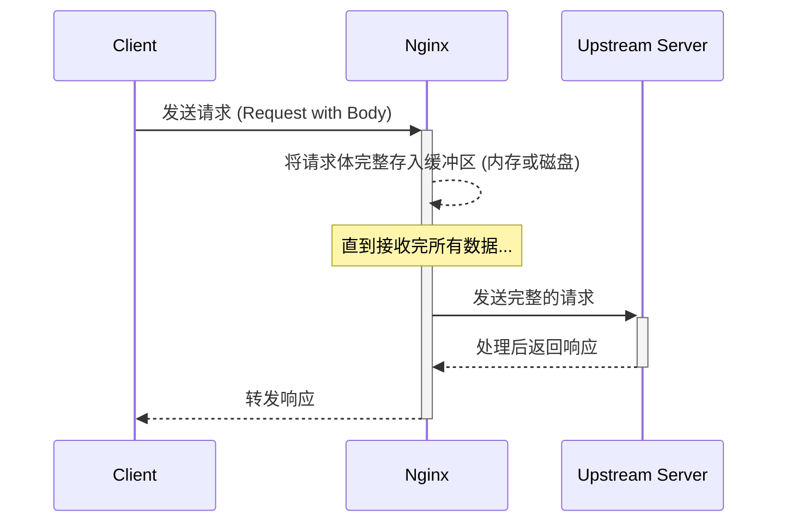
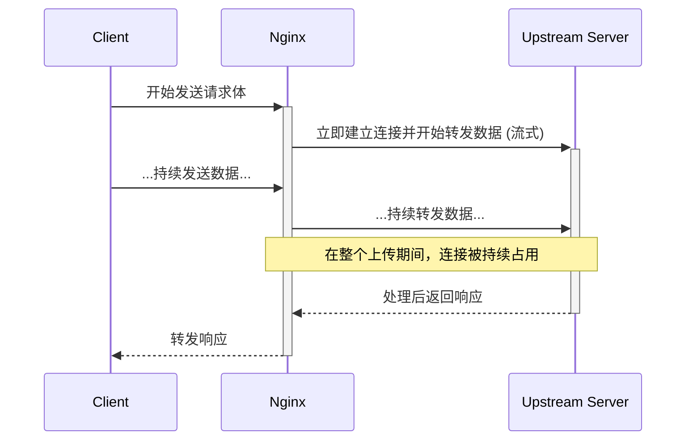
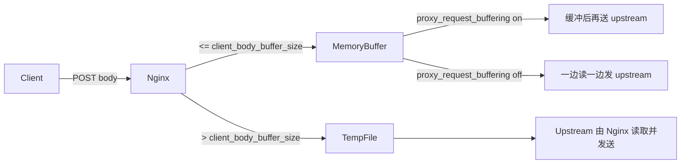
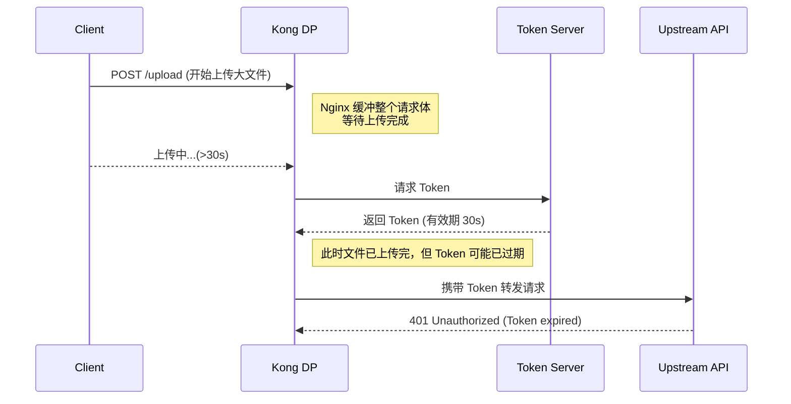
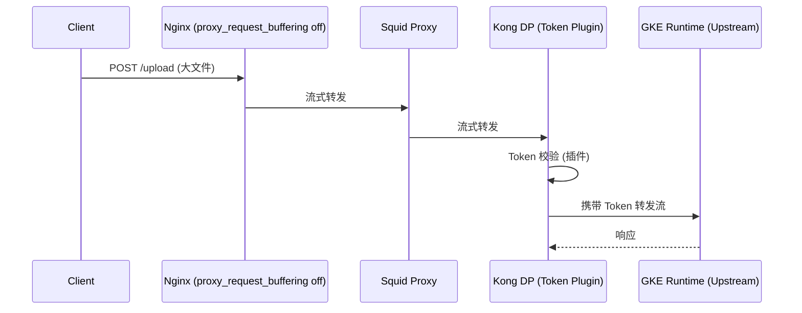

# Nginx `proxy_request_buffering` 详解

`proxy_request_buffering` 是 Nginx 中一个至关重要的代理指令，它决定了 Nginx 在将客户端的请求发送到上游（Upstream）服务器之前，是否要完整地缓冲（buffer）整个请求体（Request Body）。

## 默认配置

在 Nginx 中，此指令的默认值是 `on`。

```nginx
# 语法: proxy_request_buffering on | off;
# 默认: proxy_request_buffering on;
# 上下文: http, server, location
```

默认开启此功能，意味着 Nginx 会先将从客户端接收到的请求体完整地读入一个缓冲区，然后再将整个请求一次性发送给后端服务。

---

## 工作机制与影响

`proxy_request_buffering` 的开启与关闭，对服务器的性能、资源使用和客户端体验有着截然不同的影响。

### 1. `proxy_request_buffering on;` (默认行为)

当指令开启时，Nginx 的工作流程如下：

1.  Nginx 接收到客户端的请求头。
2.  Nginx 开始接收请求体，并将其写入内存中的缓冲区（由 `client_body_buffer_size` 定义）。
3.  如果请求体大小超过了内存缓冲区，Nginx 会将超出部分写入一个临时的磁盘文件。
4.  只有当 Nginx 接收到**完整**的请求体后，它才会与后端上游服务器建立连接，并将整个请求体一次性发送过去。
5.  上游服务器处理请求，并将响应返回给 Nginx，Nginx 再将响应转发给客户端。

#### 工作流程图 (Mermaid)



#### 优点

-   **保护上游服务器**：上游服务器只需处理一个完整的、快速的请求，而无需等待可能很慢的客户端网络。这使得上游服务器的连接可以被快速处理和释放，极大地提高了其吞吐能力和资源利用率。
-   **提高后端效率**：后端服务可以专注于业务逻辑，而不必处理慢速网络连接带来的复杂性。

#### 缺点

-   **延迟增加**：对于客户端而言，特别是上传大文件时，必须等到整个文件上传到 Nginx 并被完整接收后，后端服务才开始处理。这会增加客户端感受到的“首字节响应时间”（Time to First Byte, TTFB）。
-   **Nginx 资源消耗**：如果并发上传量很大，会消耗 Nginx 服务器大量的内存和磁盘 I/O，因为每个请求都需要一个缓冲区。

### 2. `proxy_request_buffering off;`

当指令关闭时，Nginx 的行为会发生根本性改变：

1.  Nginx 接收到客户端请求头后，会立即与上游服务器建立连接。
2.  Nginx 会以“流式”（Streaming）的方式，一边接收客户端的数据，一边将其同步转发给上游服务器。请求体不会被完整地保存在 Nginx 的缓冲区中。

#### 工作流程图 (Mermaid)



#### 优点

-   **低延迟**：后端服务几乎可以实时地接收到客户端发送的数据，非常适合需要即时处理数据的场景（如流式上传、实时通信）。
-   **减少 Nginx 资源消耗**：Nginx 不需要为每个请求分配大块内存或写入磁盘文件，资源占用更少。

#### 缺点

-   **占用上游服务器连接**：如果客户端网络很慢，那么这个慢速的上传过程会长时间占用一个宝贵的上游服务器连接。在高并发场景下，这很容易耗尽上游服务器的可用工作进程（Worker Processes），导致其无法处理新的请求，从而造成服务阻塞甚至雪崩。

---

## 配置示例

你可以在 `http`, `server`, 或 `location` 块中配置此指令。

```nginx
location /upload {
    # 对于需要即时处理的大文件上传或流式 API，建议关闭
    proxy_request_buffering off;
    proxy_pass http://my_backend;
}

location /api {
    # 对于普通的 API 请求（如 POST JSON 数据），建议保持默认开启
    proxy_request_buffering on;
    proxy_pass http://my_backend;
}
```

## 总结与最佳实践

| 配置 | 优点 | 缺点 | 适用场景 |
| :--- | :--- | :--- | :--- |
| **`on` (默认)** | 保护和解放后端服务，提高后端吞吐量。 | 增加客户端上传延迟，消耗 Nginx 资源。 | 大多数 Web 应用、API 接口、常规文件上传。 |
| **`off`** | 低延迟，数据实时传递，Nginx 资源占用少。 | 长时间占用后端连接，易受慢客户端攻击。 | 视频/音频流式上传、gRPC、WebSocket 代理、需要实时处理数据的长连接服务。 |

总的来说，`proxy_request_buffering` 的默认设置为 `on` 是一个安全且高效的选择，它优化了后端服务器的性能。只有在你明确知道需要进行流式处理，并且能够接受其对后端连接占用的影响时，才应该考虑将其设置为 `off`。

---

## 在 Kong 与 GKE 环境下的延伸探讨

在 `Nginx + Kong DP + GKE Runtime` 这样的现代云原生架构中，对请求缓冲的控制同样重要，但配置方式和理解层面需要结合 Kong 的抽象来考虑。

### `proxy_request_buffering off` 与 `client_body_buffer_size` 的关系

这是一个常见的混淆点。简单来说，**这两个指令的作用完全不同，不能等同看待**。

-   **`proxy_request_buffering`**: 这是控制 **代理行为模式** 的“总开关”。`off` 意味着 Nginx 收到任何请求体数据后，会立刻将其转发给后端（流式），而不是等待整个请求体接收完毕。
-   **`client_body_buffer_size`**: 这个指令定义了 Nginx 用来 **接收客户端请求体** 的初始内存缓冲区大小。**无论 `proxy_request_buffering` 是 `on` 还是 `off`，这个缓冲区都会被使用**。
    -   当 `proxy_request_buffering` 为 `on` 时，它是缓冲完整请求体的第一块内存区域，如果不够，数据会溢出到磁盘。
    -   当 `proxy_request_buffering` 为 `off` 时，Nginx 依然使用这个缓冲区来临时存放从客户端收到的数据块。一旦这个缓冲区被填满，Nginx 就会将这部分数据“刷送”（flush）给后端服务，然后清空缓冲区继续接收下一块数据。

**结论**：`proxy_request_buffering off` 是开启流式代理的**唯一正确方式**。将 `client_body_buffer_size` 设置为 `0` 并不能达到同样的效果，这不符合 Nginx 的设计，可能会导致其行为异常或自动回退到某个默认的最小缓冲区大小。在流式模式下，`client_body_buffer_size` 影响的是数据块转发的“粒度”，而不是“是否缓冲”这个行为本身。

**不冲突，但不等同；不要把 client_body_buffer_size 设为 0 作为“关闭内存缓冲”的手段**。
  

# **结论（一句话）**

- proxy_request_buffering off 控制 **是否把整个客户端请求体缓存在 Nginx 再统一转发给上游**（off = 一边读一边转发，流式转发）。
    
- client_body_buffer_size 控制 **Nginx 在内存中为读取客户端请求体分配的缓冲区大小**；如果请求体超过该大小，剩余部分会写入临时文件。把它设为 0 不是官方用法且可能引发异常（有人报 400/异常行为），不要用 0 来“禁用内存缓冲”。
    

  

# **细节解释（要点式）**

1. **proxy_request_buffering 的语义**
    
    - on（默认）：Nginx 会先把**整个**请求体读完（可能在内存也可能落到临时文件），然后再把请求交给 upstream。这样的好处是上游可以立即收到完整的请求（便于重试/负载均衡），坏处是会占用磁盘/内存并增加延迟。
        
    - off：Nginx 一边从客户端读取数据一边向 upstream 转发（streaming）。优点：不需要事先把大文件全部写到磁盘，适合大文件/长时间上传。缺点：一旦开始转发就不能再切换到其他 upstream（不能重试）；上游必须能接受 chunked/流式请求。
        
    
2. **client_body_buffer_size 的语义**
    
    - 这是读客户端请求体时的**内存缓冲区大小**（可以在 http/server/location 设置）。默认等于**两页内存**（常见平台为 8k 或 16k）。如果请求体 > 该缓冲区，则 Nginx 会把剩余写到 client_body_temp_path 指定的临时文件。
        
    
3. **为什么不要用 client_body_buffer_size 0**
    
    - 官方文档没有把 0 当作关闭内存缓冲的标准方式。社区/issue 中有用户把 0 设为“想强制写入磁盘”，结果遇到 400 或其他异常行为的报告（实现/版本差异会导致不稳定）。用 client_body_in_file_only 才是强制写回磁盘的正确手段（但该指令也有副作用，见下）。
        
        那么client_body_buffer_size 0的含义是什么?
        好问题 👍官方 **nginx 文档** 对 client_body_buffer_size 的说明是：

  

> 设置在读取客户端请求体时分配的缓冲区大小。默认是两页内存（通常是 8k 或 16k）。如果请求体大于这个值，则多余部分会写到 client_body_temp_path。

> （文档里没有提到 0 是合法取值）

---

### **那么** ### **client_body_buffer_size 0**

###  **到底是什么含义？**

1. **不是标准语义**
    
    - 在官方文档中，0 没有明确说明代表什么，也没有“关闭内存缓冲”的说法。
        
    - 不同版本的 Nginx/OpenResty/Ingress Controller，0 可能会被当成非法值，或者被解析成 **0 字节内存缓冲**。
        
    
2. **可能的实现逻辑（源码层面）**
    
    - Nginx 在分配请求体缓冲区时会调用 ngx_parse_size()，0 就是“0 字节”。
        
    - 这意味着 **没有内存缓冲**，一旦读到数据就立刻写入 client_body_temp_path 的临时文件。
        
    - 这不是设计上的常规用法，实际运行中有用户反馈会导致 400 Bad Request 或者 Nginx 无法正常处理请求体。
        
    
3. **社区反馈（经验）**
    
    - 一些用户想通过 client_body_buffer_size 0 来“强制全部写入磁盘”，结果遇到异常。
        
    - 正确的方式是用 [client_body_in_file_only](http://nginx.org/en/docs/http/ngx_http_core_module.html#client_body_in_file_only) 来强制写文件，而不是用 0。
        
    

---

### **小结**

- client_body_buffer_size 0 ≈ **0 字节内存缓冲**，也就是所有请求体数据直接落盘，不走内存。
    
- 但这不是官方推荐方式，容易出问题。
    
- 如果确实想避免内存缓冲，请用：
    

```
client_body_in_file_only on;
```

而不是 client_body_buffer_size 0。

---

要不要我帮你把 **“client_body_buffer_size 的几种不同配置值含义对比表格”**（比如 0 / 8k / 1m / 很大值）整理出来？这样你在文档里也能一眼看明白不同取值的实际效果。
    
4. **chunked（Transfer-Encoding: chunked） 的陷阱**
    
    - 如果客户端使用 chunked 传输，Nginx 在某些情况下仍然会缓存请求体，**除非**你同时为 proxy 设置 proxy_http_version 1.1（并保证上游能处理 chunked）；否则 chunked 请求常被写入临时文件或导致 buffering 行为不同。也就是说：proxy_request_buffering off + chunked 请求时需要额外注意 proxy_http_version。
        
    
5. **client_body_in_file_only**（如果你确实要“只写文件”）
    
    - 该指令可以强制把请求体写入文件（用于调试或特殊场景），但会保留临时文件（on 会保留，clean 可清理），并且可能影响你如何把 body 交给 upstream（需用 $request_body_file 等或调整 proxy_pass_request_body）。不是普通生产场景下用来“节省内存”的首选。
        
    

  

# **实际配置示例（直接可复制）**

```
# 1) 推荐：流式上传到 upstream（减少 Nginx IO / disk 临时文件）
location /upload {
    proxy_pass http://backend;
    proxy_request_buffering off;       # 一边读一边发给 upstream
    proxy_http_version 1.1;            # 支持 chunked 转发到 upstream
    client_body_buffer_size 16k;       # 小缓冲即可（默认通常 8k/16k）
    proxy_read_timeout 3600s;
    proxy_send_timeout 3600s;
}
```

（说明：适用于 upstream 能流式接收并支持 chunked 的场景；注意超时、上游兼容性）

```
# 2) 如果你想强制写入磁盘（调试或特殊场景），使用官方指令
location /upload2 {
    client_body_in_file_only on;       # 强制写入临时文件（会保留）
    client_body_temp_path /var/nginx/client_body_temp;
    proxy_pass http://backend;
    # 注意：此模式下，处理临时文件、权限和清理非常重要
}
```

```
# 3) 不要这样做（示例：避免）
# client_body_buffer_size 0;   # 不推荐：未被官方说明为“合法”关闭方式，可能导致异常
```

# **快速决策表（三句话）**

- 想**立即把上传的每一块转发到上游**：proxy_request_buffering off + proxy_http_version 1.1，并确保上游支持流式（chunked）。
    
- 想**减少内存临时占用但不破坏正常传递**：把 client_body_buffer_size 设小（比如 8k 或 16k），让大体写到 tmp 文件；不要设 0。
    
- 要**强制写盘且用到 $request_body_file**：使用 client_body_in_file_only（并处理临时文件）。
    

  

# **小提示 & 风险**

- 流式（proxy_request_buffering off）**会降低 Nginx 在上游故障时重试的能力**（因为已经开始发送 body，不能安全切换到别的 upstream）。
    
- 如果上游是 HTTP/1.0 或不支持 chunked，你可能必须保证 proxy_http_version 1.1 且上游能处理；否则 Nginx 仍会做 buffering 或失败。
    
- 监控 client_body_temp_path 的磁盘使用，避免临时文件堆积。
    
- 各 Nginx 版本/patch（例如 OpenResty / Kong / ingress-nginx）在实现细节上可能有差异，部署前请在目标版本做小规模验证。
    

  

# **帮你快速可视化（mermaid）**



---

需要我帮你基于你当前的 Nginx 版本（或 Ingress/Kong 变体）把上面的配置写成完整 server {} 配置并列出测试步骤与注意点吗？如果给我你现在的 Nginx 版本 / 是不是在 k8s ingress / Kong 之类的环境里，我可以直接给出更精确的配置片段。

### 在 Kong Gateway (DP) 中的配置

在你的架构中，请求首先到达 Nginx（可能作为四层负载均衡器），然后进入 Kong 数据平面（DP），最后由 Kong 代理到 GKE 中运行的后端服务。你应当在 Kong 的层面进行配置，而不是直接修改底层的 Nginx 配置文件。

Kong 已经将 `proxy_request_buffering` 抽象为一个简单的布尔配置。你可以在 Kong 的 **Service** 对象上进行设置。

-   `request_buffering: true` (默认值) -> 对应 Nginx 的 `proxy_request_buffering on;`
-   `request_buffering: false` -> 对应 Nginx 的 `proxy_request_buffering off;`

#### Kong for Kubernetes (Ingress Controller) 配置示例

如果你使用 Kong Ingress Controller 在 GKE 中管理服务，可以通过修改 `KongIngress` 自定义资源或直接在 Service 的注解中实现。更推荐的方式是直接配置 Service 本身。

这是一个通过 `annotations` 在 Kubernetes Service 上禁用请求缓冲的例子：

```yaml
apiVersion: v1
kind: Service
metadata:
  name: my-streaming-app
  annotations:
    # 通过注解将 Kong 的 request_buffering 设置为 false
    konghq.com/request-buffering: "false" 
spec:
  ports:
  - name: http
    port: 80
    protocol: TCP
    targetPort: 8080
  selector:
    app: my-streaming-app
```

当 Kong Ingress Controller 处理这个 Service 时，它会自动在生成的 Nginx 配置中为对应的 `upstream` 设置 `proxy_request_buffering off;`。

### 架构总结与建议

| 层次 | 关注点 | 推荐配置 | 效果 |
| :--- | :--- | :--- | :--- |
| **Client** | 发起流式请求 | (例如：上传大文件) | - |
| **Nginx (L4 LB)** | TCP 负载均衡 | `proxy_protocol` (可选) | 将流量转发到 Kong DP 节点，可选传递真实客户端 IP。 |
| **Kong DP** | **核心配置层** | 在 Kong Service 设置 `request_buffering: false` | **实现流式代理的关键**。Kong DP 不会缓冲整个请求体。 |
| **GKE Runtime** | 后端业务逻辑 | 能够处理流式请求 | 服务可以实时处理传入的数据流。 |

综上所述，在 `Nginx + Kong DP + GKE` 架构中想要实现流式、低延迟的请求转发，正确的做法是在 Kong 的 Service 定义中明确设置 **`request_buffering: false`**。你不需要，也不应该尝试通过设置 `client_body_buffer_size: 0` 来达到此目的。


好的 👍 我帮你画两个对比时序图（一个是 proxy_request_buffering on，一个是 off），这样你能直观看到 Token 的使用时机和超时风险。

---

### **场景一：**

### **proxy_request_buffering on**

### **（默认，容易超时）**



---

### **场景二：**

### **proxy_request_buffering off**

### **（推荐，流式转发）**

```
sequenceDiagram
    participant Client as Client
    participant KongDP as Kong DP
    participant TokenSrv as Token Server
    participant Upstream as Upstream API

    Client->>KongDP: POST /upload (开始上传大文件)
    KongDP->>TokenSrv: 请求 Token
    TokenSrv-->>KongDP: 返回 Token (有效期 30s)
    note right of KongDP: Token 拿到后立即使用<br>开启流式转发
    Client-->>KongDP: 上传中...(文件流式传输)
    KongDP->>Upstream: 携带 Token，边收边转发
    Upstream-->>KongDP: 200 OK (上传成功)
```

---

✅ 对比可以看出：

- **buffering on** → Token 在上传完成后才发起，可能超时失效。
    
- **buffering off** → Token 一拿到就用，整个大文件可以在 Token 有效期内建立连接并流式传输。
    

---

要不要我再帮你总结成一个 **决策表**（buffering on vs off 对 Token 的影响、优缺点）？这样你在文档里能一页对比清晰。

# Q
那么现在帮我分析这样一个问题 我有一个POST的请求 发送到一个URL 我这个定义的URL的follow流会经过一个nginx然后后面是一个Squid 代理把请求发送到KongDP 然后再到我的GKE的Runtime

 然后我这个Post API必须有一个token需要认证 也就是说我的token这个插件是配置在我的KongDP上面 

那么我想了解 这个整个的follow流里面 我POST的请求是发送了一个大的文件 这个文件比较大 然后我的token的超时时间设置的就是30秒 那么我如何平衡这个问题 也就是说这个超时时间的30秒的设置是针对哪些地方的? 我已经在nginx设置了proxy_request_buffering off


很好，你这个问题问到点子上了，我帮你把链路和 **30 秒 Token 有效期** 的关系拆解一下。

---

## **你的请求链路**



---

## **关键点：Token 的 30 秒超时，作用在哪里？**

1. **Token 插件是在 KongDP 上配置的**
    
    - 也就是说，**请求必须在 KongDP 收到时，Token 仍然有效**。
        
    - Token 是用来认证客户端请求，而不是用来控制整个上传时长。
        
    - 验证动作发生在 **KongDP 收到请求的最初时刻**，而不是等文件传完。
        
    
2. **Nginx 已经设置了 proxy_request_buffering off**
    
    - 客户端上传数据时，Nginx 不会等整个文件接收完才转发，而是边收边转。
        
    - 所以请求会很快到达 Squid → KongDP。
        
    - 这保证了 **KongDP 能在 Token 过期前拿到请求并校验**。
        
    
3. **校验通过后，流式转发到 GKE Runtime**
    
    - 一旦 Token 在 KongDP 通过认证，KongDP 就不会再次去验证或刷新 Token。
        
    - 上传可以持续超过 30 秒，甚至几分钟，只要连接不断，Token 不会再次检查。
        
    
4. **Token 超时的关键边界**
    
    - **30 秒的有效期只要求：KongDP 收到请求时，Token 仍然有效。**
        
    - 并不是要求整个上传都必须在 30 秒内完成。
        
    - 如果请求建立太慢（比如客户端上传慢 + buffering on），那可能在 **到达 KongDP 前就过期**，认证失败。
        
    

---

## **所以怎么平衡？**

- **核心点**：让请求在 Token 过期前到达 KongDP 并完成认证。
    
- 你已经在 Nginx 配置了 proxy_request_buffering off → ✅ 正确，这样 Token 不会因为大文件而延迟到过期。
    
- **Squid** 要确认也支持 **streaming（不缓冲 body）**，否则它会变成瓶颈，延迟到达 KongDP。
    
- **KongDP 校验通过后**，上传时间就和 Token 过期无关了。
    

---

## **总结**

- **30 秒超时时间作用点**：只在 KongDP 校验 Token 的那一刻。
    
- **与大文件上传关系**：只要请求能在 30 秒内到达 KongDP 并完成校验，后续文件上传时间可以远超 30 秒。
    
- **你的关键配置**：
    
    - Nginx: proxy_request_buffering off（✅）
        
    - Squid: 需要配置为 **不缓存请求体**，保证流式转发
        
    - KongDP: Token 插件在入口处校验，请求一旦通过，长时间上传不会受影响
        
    

---

要不要我帮你写一个 **链路检查清单**（Nginx、Squid、KongDP 三层都要确认哪些配置项，保证不会出现 buffering 导致 Token 过期的问题）？

👌 那我给你整理一份 **链路检查清单**，确保大文件上传在整个链路中不会因为 buffering 导致请求到达 KongDP 太晚，从而触发 **30 秒 Token 过期**的问题。

---

# **大文件上传链路检查清单（Nginx → Squid → KongDP → GKE）**

  

### **1.** 

### **Nginx 层**

- **关闭请求缓冲**
    

```
proxy_request_buffering off;
```

- ✅ 确保大文件请求体不被缓冲，而是流式转发。
    
- **开启 HTTP/1.1**（支持 chunked transfer）
    

```
proxy_http_version 1.1;
proxy_set_header Connection "";
```

-   
    
- **调整超时**（避免大文件被过早断开）
    

```
proxy_read_timeout 3600s;
proxy_send_timeout 3600s;
```

  

---

### **2.** 

### **Squid 层**

  

> ⚠️ Squid 默认可能会缓存/缓冲请求体，必须确认其为透明代理模式或已调优。

  

- **禁用 request body 缓存**
    
    Squid 配置 squid.conf 中：
    

```
request_body_max_size 0
cache deny all
```

- - request_body_max_size 0 表示不限制 body 大小（流式转发）。
        
    - cache deny all 避免缓存 body。
        
    
- **保持连接**
    
    确保 Squid 和后端使用 **persistent connections**（HTTP/1.1），不要反复建立连接导致延迟。
    
- **确认无额外 buffering**
    
    使用 tcpdump/strace 验证 Squid 是边收边发，而不是接收完整 body 后才发给 KongDP。
    

---

### **3.** 

### **Kong DP 层**

- **Token 插件校验时机**
    
    - 插件（如 JWT、OAuth2）在 **请求到达 Kong 时立即校验**。
        
    - 只要 Token 在 30 秒内有效，请求就能通过。
        
    - 上传数据流后续不会再次触发校验。
        
    
- **关闭 request buffering**（若 Kong 后面还有 proxy）
    
    在 Kong 配置 / Nginx 模块：
    

```
proxy_request_buffering off;
```

-   
    
- **上游连接超时设置**
    
    在 Kong route/service 层配置合理的：
    

```
connect_timeout: 60000   # 连接超时
read_timeout: 3600000    # 大文件读取超时
write_timeout: 3600000   # 大文件写入超时
```

  

---

### **4.** 

### **GKE Runtime 层**

- **应用端支持流式接收**
    
    - 上游 API 必须支持 chunked request body。
        
    - 确保没有逻辑要求必须一次性读取完整请求体。
        
    
- **容器资源调优**
    
    - 大文件上传时会消耗内存/磁盘 → 确保 Pod 有足够的 memory 和 ephemeral-storage。
        
    

---

## **✅ 结论**

- **Token 的 30 秒超时时间作用点** = 请求到达 **KongDP 并完成认证的时刻**。
    
- 你的任务是保证 **整个链路（Nginx → Squid → KongDP）都能流式转发**，这样大文件上传不会卡在前置代理，导致 Token 校验时已过期。
    
- 一旦请求在 30 秒内到达 KongDP 并通过认证，后续上传时间可以很长（>30s），不会再受 Token 影响。
    

---

要不要我再帮你画一个 **流程风险图**（标注在哪些环节 buffering 会导致 Token 过期风险），这样一眼就能看出链路里的“风险点”？


有影响 ✅，而且影响的点需要仔细拆分：

  

### **1. Squid 的** 

### **request_body_max_size**

###  **含义**

- **作用**：限制客户端单个 HTTP 请求体的最大大小。
    
- **位置**：发生在 **Squid 接收请求时**，即请求还没被转发到 Kong DP 之前。
    
- **效果**：
    
    - 如果请求体大小 **超过 50M**，Squid 会直接返回 413 Request Entity Too Large，请求不会继续走到 Kong。
        
    - 如果请求体 **小于等于 50M**，Squid 会允许请求正常转发。
        
    

  

### **2. 对你的流程的影响**

  

你的请求流是：

```
Client --> Nginx --> Squid --> Kong DP (Token Plugin) --> GKE Runtime
```

- **Nginx**：proxy_request_buffering off 让大文件直接流式传给下游，不写磁盘缓冲。
    
- **Squid**：在流式过程中，会检查整个请求体大小。如果超过 request_body_max_size，Squid 就拒绝。
    
- **Kong DP**：
    
    - 先校验 Token（30 秒过期）。
        
    - Token 校验通过后，才会把流继续转发到 GKE Runtime。
        
    

  

⚠️ **注意点**：

- Token 的 30 秒并不是针对整个上传过程，而是针对 **验证阶段**。
    
- 但是，如果请求在 Squid 被拦截（超过 50M），Kong 根本拿不到请求，也就没有 Token 验证。
    
- 所以你设置 request_body_max_size 50M 相当于硬性限制了 API 的最大上传文件。
    

  

### **3. 实际影响场景**

- 如果客户端上传 **60M 文件**：
    
    - Nginx → OK
        
    - Squid → 拦截，返回 413，不会走到 Kong → GKE。
        
    
- 如果客户端上传 **40M 文件**：
    
    - Nginx → OK
        
    - Squid → OK
        
    - Kong DP → Token 插件校验（只要校验动作 ≤30 秒，没问题）。
        
    - 文件流式传到 Runtime。
        
    

  

### **4. 建议平衡方案**

- 如果 **上传大文件**是常态（例如 >50M），request_body_max_size 不能设置太小，否则 Squid 会直接拒绝。
    
- 你需要确认：
    
    - Token 的 30 秒是否 **从请求开始**计时，还是 **单独的认证请求**计时。
        
        - 如果是认证 API 调用超时 30 秒，那大文件上传本身不会受影响。
            
        - 如果是整个请求必须在 30 秒内完成认证，那大文件上传可能会冲突。
            
        
    
- 一般推荐：
    
    - Squid request_body_max_size 设置为 **略大于最大文件需求**（比如 200M）。
        
    - 保证 Nginx、Kong、GKE Runtime 的配置也一致，否则会出现中间层拒绝的情况。
        
    

---

要不要我帮你画一个 **请求流 + 超时/限制点的 Mermaid 图**，让你直观看到 Nginx、Squid、Kong Token、Runtime 各自的作用点和风险点？


很好的问题 👍 我来帮你拆解下 **Squid 的 request_body_max_size 和缓存(body buffering)** 之间的关系。

---

## **1.** 

## **request_body_max_size**

##  **的语义**

  

在 **Squid** 中：

```
request_body_max_size <bytes> allow|deny [acl...]
```

- **作用**：限制客户端请求体的最大大小。
    
- 默认值：**0** → 不限制大小。
    
- 如果设置成 50 MB，超过就直接 413；如果是 0，就没有大小限制。
    

---

## **2. Squid 的缓存行为**

- Squid 作为 HTTP 代理，在转发 POST/PUT 等请求时，**可能会缓存请求 body 到磁盘**，特别是在需要 **replay** 或 **content adaptation (ICAP/eCAP)** 的场景。
    
- 如果你希望 **全程流式转发大文件**，通常会：
    
    - 关闭或绕过 **store/replay** 的功能（避免写磁盘）。
        
    - 并不是靠 request_body_max_size 0，而是靠 **配置流式转发**。
        
    

---

## **3.** 

## **request_body_max_size 0**

##  **是否必须？**

- **不是必须**。
    
- 它的含义是「**不限制请求体大小**」。
    
- 和「是否缓存 body」**没有直接关系**。
    
- 真正影响 Squid 是否写磁盘的是：
    
    - pipeline_prefetch、collapsed_forwarding 等配置（影响请求如何转发）。
        
    - 是否启用了 ICAP/eCAP、store_id、cache_peer 这种需要完整 body 的特性。
        
    

---

## **4. 实际场景对比**

  

你的流是：

```
Client → Nginx (proxy_request_buffering off) → Squid → Kong DP (Token Plugin) → Runtime
```

- 如果你在 Squid 设置 request_body_max_size 0：
    
    - 等价于「允许无限大请求体」。
        
    - 上传 1GB、2GB 也不会被 Squid 限制。
        
    
- 如果你设置 request_body_max_size 50M：
    
    - 超过 50M → 直接被 Squid 拦截（413）。
        
    - **这和缓存是否发生没有关系**，只决定 Squid 接不接受。
        
    

---

## **5. 建议**

- 如果你的需求是「不限制上传文件大小」→ 用 **request_body_max_size 0**。
    
- 如果你只想「禁止缓存 request body」→ 不靠这个参数，而是调整 **cache/store/ICAP** 配置。
    
- 两者是 **不同维度**：
    
    - **大小限制**：request_body_max_size。
        
    - **缓存/流式**：Squid forwarding 模式 + Nginx proxy_request_buffering off。
        
    

---

✅ 总结一句话：

request_body_max_size 0 只是「不限制大小」，和禁止缓存 **不是一回事**；要实现大文件直通转发（不缓存），你需要同时：

- Nginx: proxy_request_buffering off
    
- Squid: 关闭与缓存相关的配置 (比如禁用存储、ICAP)
    
- Squid: 如果不想限制大小，就设置 request_body_max_size 0
    

---

要不要我帮你写一个 **Squid + Nginx 的最小化配置片段**，专门适合大文件上传场景（流式传输 + 不缓存 + 无大小限制）？