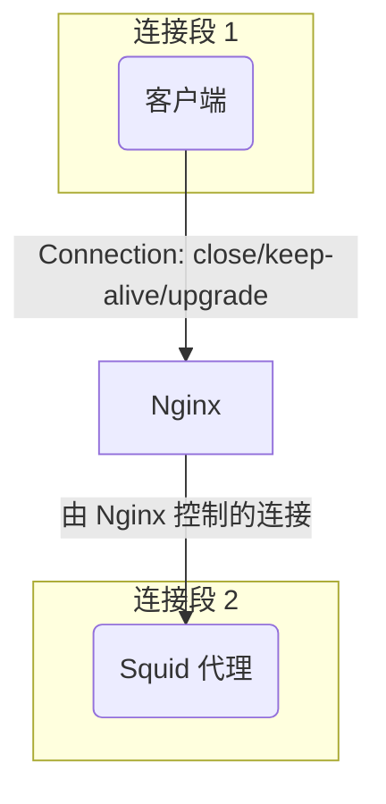

# Nginx proxy_set_header Connection "" 详细分析

## 配置概述

```nginx
proxy_set_header Connection "";
```

这个指令清除了从客户端传递到后端服务器的 `Connection` header。

## 技术原理

### HTTP Connection Header 的作用
- `Connection` header 控制当前连接的行为
- 常见值：
  - `Connection: close` - 请求完成后关闭连接
  - `Connection: keep-alive` - 保持连接开启以供后续请求使用
  - `Connection: upgrade` - 请求协议升级

### 为什么要清除 Connection Header

#### 1. HTTP/1.1 长连接支持
```nginx
proxy_http_version 1.1;
proxy_set_header Connection "";
```

- HTTP/1.1 默认使用长连接（persistent connections）
- 清除 `Connection` header 让 Nginx 和后端服务器协商最佳连接方式
- 避免客户端的连接策略影响代理层的连接管理

#### 2. 连接池优化
- Nginx 维护到后端服务器的连接池
- 清除 Connection header 允许 Nginx 重用现有连接
- 提高性能，减少连接建立/断开的开销

## 使用场景分析

### 正确使用的好处

#### 性能提升
```nginx
# 推荐配置
location /api/ {
    proxy_pass http://backend;
    proxy_http_version 1.1;
    proxy_set_header Connection "";
    # 其他配置...
}
```

**优势：**
- 减少 TCP 连接建立时间
- 降低服务器资源消耗
- 提高并发处理能力
- 减少网络延迟

#### 连接管理优化
- Nginx 可以智能管理连接生命周期
- 支持连接复用和负载均衡
- 避免不必要的连接断开

### 错误使用的风险

#### 1. 不清除 Connection Header 的问题

```nginx
# 问题配置 - 未清除 Connection header
location /api/ {
    proxy_pass http://backend;
    proxy_http_version 1.1;
    # 缺少: proxy_set_header Connection "";
}
```

**潜在问题：**
- 客户端的 `Connection: close` 会传递给后端
- 强制每次请求都建立新连接
- 性能显著下降
- 后端服务器连接数激增

#### 2. 与其他 Header 冲突

```nginx
# 错误示例
proxy_set_header Connection "upgrade";
proxy_set_header Connection "";  # 后面的会覆盖前面的
```

## 特定场景：后端是另一层代理（如 Squid）

当 Nginx 的后端是另一个代理服务器（例如 Squid）时，`proxy_set_header Connection` 的配置原则同样适用，但需要根据流量类型进行更精细的控制。

### 场景分析：Nginx -> Squid

在这种架构中，存在两个独立的连接段：
1.  **客户端 <-> Nginx**
2.  **Nginx <-> Squid**

Nginx 的作用是高效地将客户端请求转发给 Squid。



### 配置策略

#### 1. 对于普通 HTTP/HTTPS 流量

**结论：依然强烈推荐开启。**

```nginx
location / {
    proxy_pass http://squid_backend;
    proxy_http_version 1.1;
    proxy_set_header Connection "";
    proxy_set_header Host $host;
    # ... 其他 headers
}
```

- **原因**：为了性能。设置 `Connection ""` 可以让 Nginx 和 Squid 之间建立持久的 `keep-alive` 连接。这避免了为每个请求都重新建立 TCP 连接的开销，显著降低了延迟并减少了 Nginx 和 Squid 的资源消耗。如果不设置，客户端的 `Connection: close` 头可能会被传递给 Squid，导致性能下降。

#### 2. 对于需要协议升级的流量（如 WebSocket）

**结论：必须禁用 `Connection ""`，并设置为 `upgrade`。**

用户的担忧是正确的：如果流量需要协议升级（例如从 HTTP 升级到 WebSocket），`proxy_set_header Connection "";` 会破坏这个过程，因为它会清除 `Connection: upgrade` 这个关键的头部。

**正确配置**：
应该为需要协议升级的特定路径创建一个独立的 `location` 块。

```nginx
location /websocket_path/ {
    proxy_pass http://squid_backend;
    proxy_http_version 1.1;
    
    # 关键：为协议升级设置正确的 headers
    proxy_set_header Upgrade $http_upgrade;
    proxy_set_header Connection "upgrade";
    
    proxy_set_header Host $host;
}
```

- **影响**：这样配置后，Nginx 会正确地将客户端的协议升级请求传递给 Squid。如果错误地使用了 `Connection ""`，WebSocket 或其他协议升级会握手失败。

### 总结与建议

- **不应该全局禁用**：不建议因为可能存在协议升级流量就完全不使用 `proxy_set_header Connection "";`，这会牺牲大部分普通 HTTP 流量的性能。
- **采用分离配置**：最佳实践是根据 URL 路径分离配置。
    - 为通用 API 或网页访问设置 `Connection ""` 以优化性能。
    - 为需要协议升级的特定端点（如 `/ws/`, `/graphql` 等）设置 `Connection "upgrade"`。
- **对 Squid 的影响**：
    - **开启 `Connection ""`**：降低了 Squid 的连接负载，使其能更高效地处理请求。
    - **不开启 `Connection ""`**：可能导致 Squid 承受大量短暂的连接，增加其 CPU 和内存负担，甚至耗尽文件描述符。
    - **错误用于升级流量**：导致需要通过 Squid 代理的协议升级功能完全无法使用。

## 实际影响分析

### 对用户体验的影响

#### 正确配置时：
- **响应时间**：减少 20-50ms 的连接建立时间
- **并发能力**：支持更高的并发请求
- **稳定性**：减少连接相关的错误

#### 错误配置时：
- **性能下降**：每个请求都需要新建连接
- **超时增加**：在高负载时容易出现连接超时
- **资源浪费**：服务器需要处理更多的连接状态

### 对后端服务的影响

#### 连接数对比
```bash
# 正确配置 - 连接复用
netstat -an | grep :8080 | wc -l
# 结果：10-50 个连接

# 错误配置 - 每次新建连接  
netstat -an | grep :8080 | wc -l
# 结果：200-1000+ 个连接
```

#### 资源消耗
- **内存使用**：每个连接消耗 4-8KB 内存
- **文件描述符**：错误配置可能导致 fd 耗尽
- **CPU 开销**：频繁的连接建立/断开消耗 CPU

## 最佳实践配置

### 完整的反向代理配置
```nginx
upstream backend_servers {
    server 192.168.1.10:8080;
    server 192.168.1.11:8080;
    keepalive 32;  # 保持 32 个长连接
}

location /api/ {
    proxy_pass http://backend_servers;
    
    # HTTP 版本和连接管理
    proxy_http_version 1.1;
    proxy_set_header Connection "";
    
    # 基础 headers
    proxy_set_header Host $host;
    proxy_set_header X-Real-IP $remote_addr;
    proxy_set_header X-Forwarded-For $proxy_add_x_forwarded_for;
    proxy_set_header X-Forwarded-Proto $scheme;
    
    # 缓冲和超时
    proxy_buffering off;
    proxy_request_buffering off;
    proxy_read_timeout 300s;
    proxy_send_timeout 300s;
    
    # 请求大小限制
    client_max_body_size 100m;
}
```

### WebSocket 支持配置
```nginx
location /ws/ {
    proxy_pass http://websocket_backend;
    proxy_http_version 1.1;
    proxy_set_header Upgrade $http_upgrade;
    proxy_set_header Connection "upgrade";  # WebSocket 需要特殊处理
    proxy_set_header Host $host;
}
```

## 监控和调试

### 检查连接状态
```bash
# 查看 Nginx 到后端的连接
ss -tuln | grep :8080

# 查看连接复用情况
nginx -T | grep -A 10 "upstream"
```

### 性能测试对比
```bash
# 测试配置前后的性能差异
ab -n 1000 -c 10 http://your-domain/api/test

# 监控连接数变化
watch 'ss -tuln | grep :8080 | wc -l'
```

## 常见问题排查

### 问题 1：连接数过多
**症状**：后端服务器连接数持续增长
**原因**：未正确配置 `proxy_set_header Connection ""`
**解决**：添加该配置并重载 Nginx

### 问题 2：性能下降
**症状**：响应时间增加，吞吐量下降
**原因**：每次请求都建立新连接
**解决**：确保 HTTP/1.1 + Connection header 清除

### 问题 3：WebSocket 连接失败
**症状**：WebSocket 握手失败
**原因**：WebSocket 需要特殊的 Connection header
**解决**：为 WebSocket 路径单独配置

## 总结

`proxy_set_header Connection "";` 是 Nginx 反向代理配置中的关键指令：

- **必要性**：在 HTTP/1.1 环境下几乎是必需的
- **性能影响**：正确使用可显著提升性能
- **风险控制**：错误配置会导致连接数激增和性能下降
- **最佳实践**：与 `proxy_http_version 1.1` 和 `keepalive` 配合使用

正确理解和使用这个配置对于构建高性能的反向代理系统至关重要。