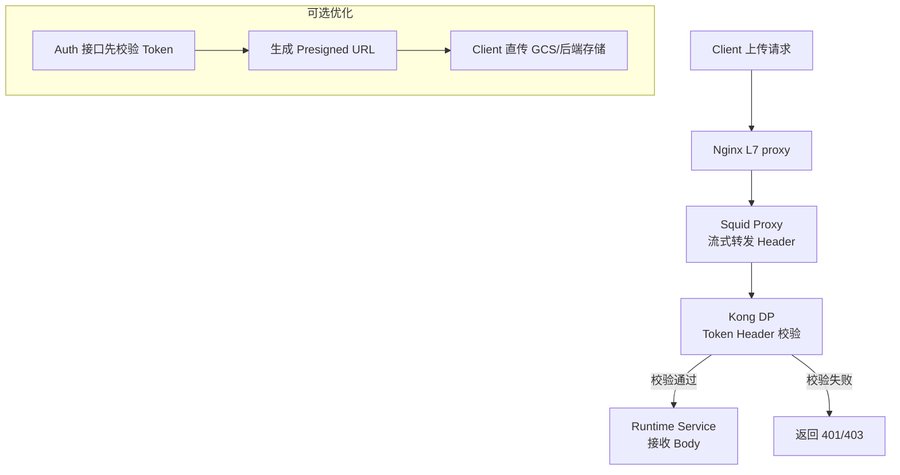
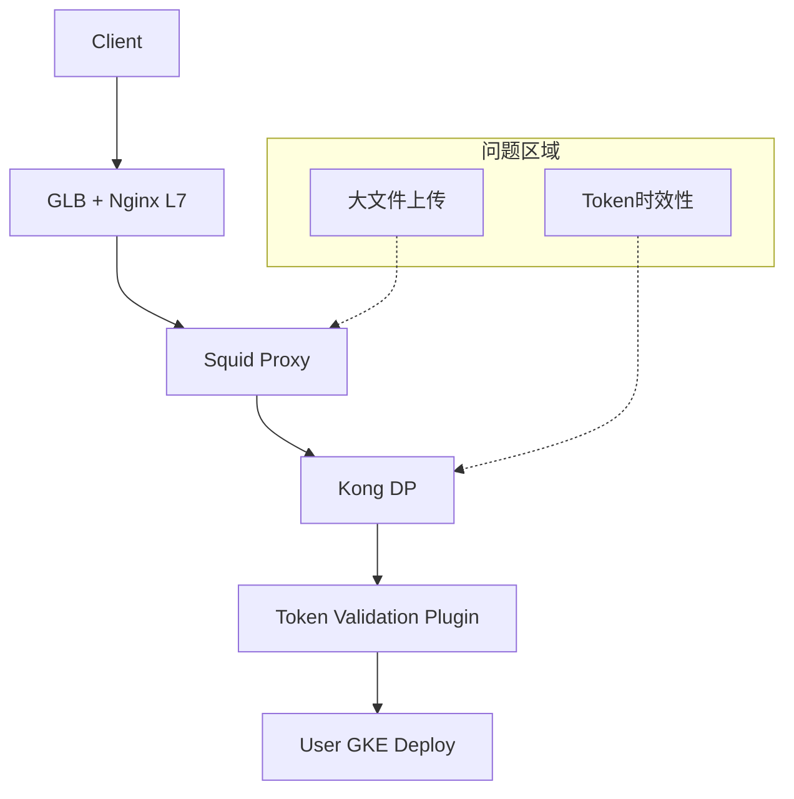
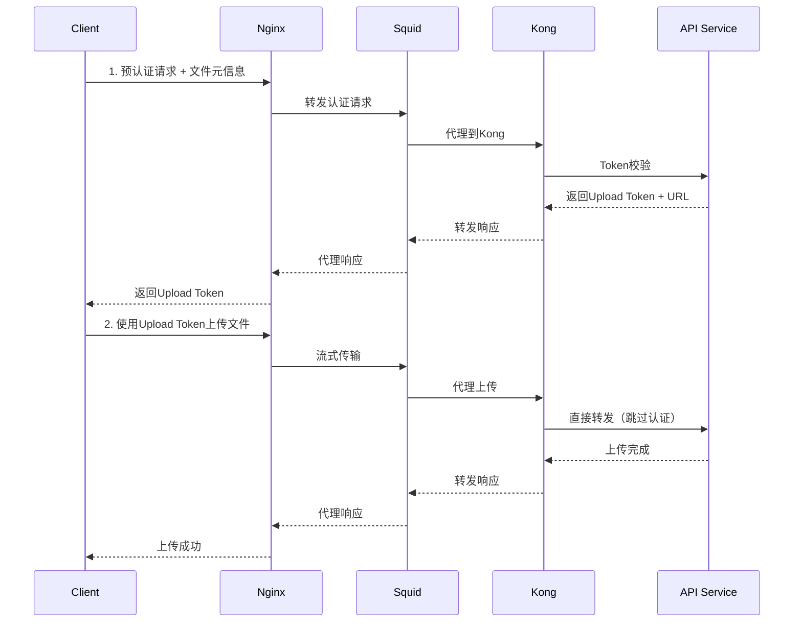
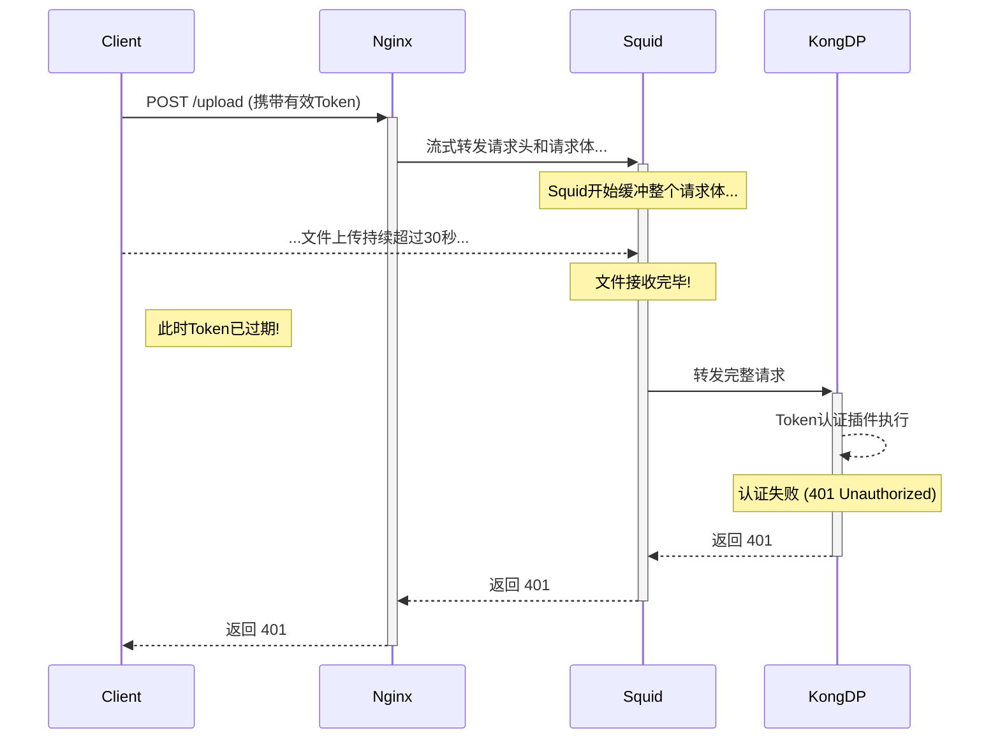
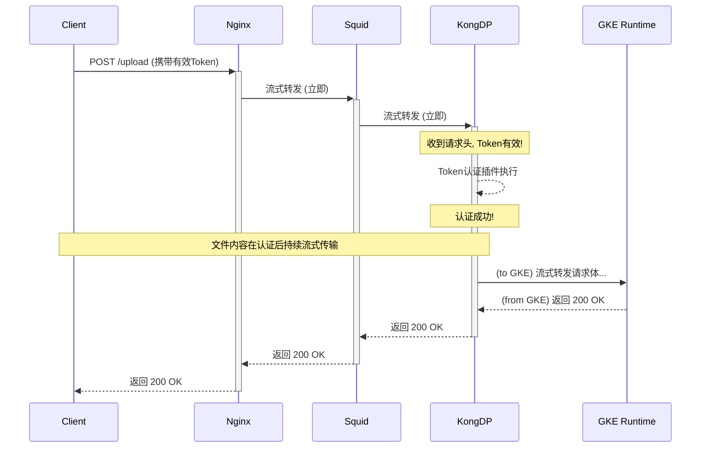

- [Q](#q)
- [Summary 2](#summary-2)
		- [1. `client_request_buffer_max_size`](#1-client_request_buffer_max_size)
		- [2. `request_body_max_size`](#2-request_body_max_size)
		- [总结](#总结)
		- [示例场景](#示例场景)
- [nginx 配置](#nginx-配置)

# Q

```bash
我们是运行在Google的GKE API平台,平台接入各个Team的API.API都是经过Kong Gateway流入到我们的Runtime
大概的流程如下
GLB+nginxL7==>Squid==>KongDP==> User GKE Deploy
Squid因为我们网络隔离所以需要Squid做代理跳转到哪步环境的Kong DP
我们遇到了一个大文件上传与Token认证[我们使用KongDP的Plug做校验]时效性冲突的问题。那么对于我类似这样的架构来说 最佳的实践方案应该是什么?  
比如在nginx上面如下配置
```nginx.conf
location /api/ {
    proxy_pass http://squid_backend;
    proxy_request_buffering off;
    proxy_buffering off;
    proxy_http_version 1.1;
    client_max_body_size 100m;
    proxy_read_timeout 300s;
    proxy_send_timeout 300s;
}
```

Squid上如下配置

```squid.conf
request_body_max_size 50 MB
client_request_buffer_max_size 64 KB 
```

上面是我已经探索的一些解决方案. 比如在限制用户最大上传文件大小的同时,能满足我们的用户能完成快速Token校验.

# summary 1

你这个场景里主要矛盾是 **大文件上传 + Token 校验时效性**。

问题点在于：

- **KongDP 的 Token 校验必须等到请求体传输到达时才能开始**（尤其如果代理节点先缓存/缓冲请求体）。
- **Squid 和 Nginx 的 buffering 配置**直接决定了 Token 校验是“先校验 header，再流式转发 body”还是“必须完整收下 body 才能转发”。
- 如果缓冲过大（如 client_request_buffer_max_size=50M），校验会延迟，导致 Token 过期。

---

## **最佳实践方向**

### **1.** 

### **流式转发 + Header 优先校验**

- 在 **Nginx** 和 **Squid** 上开启 **流式转发**，即不缓存完整请求体：
    - Nginx 用 proxy_request_buffering off（你已配置 ✅）。
    - Squid 建议 client_request_buffer_max_size 设置为较小值（如 64KB），只缓存头部 + 少量 body 片段即可。
    - 这样 Squid 会先把 header 送到 KongDP，KongDP 能够先做 Token 校验，再决定是否继续读取 body。

### **2.** 

### **在 KongDP 提前校验 Token（Header-only auth）**

- 在 KongDP 的插件逻辑里，尽量做到**只基于 Header 校验 Token**，不依赖请求体。
- 一旦 header 校验通过，再继续接收/转发大文件。
- 如果你们的 Token 校验需要 payload 参与（例如签名覆盖 body），就必须要调整架构（见第 4 点）。

### **3.** 

### **超时参数的匹配**

- Nginx proxy_read_timeout、proxy_send_timeout 已经设置较大（300s），可以保障大文件上传。
- Squid 需要配合设置 request_body_max_size（控制最大文件大小），避免过大文件拖垮代理。

### **4.** 

### **更高级的方案（推荐改造思路）**

如果未来你们上传的文件还会更大，或者对 Token 时效要求更严格，可以考虑：

1. **分离 Auth 与 Upload**

    - 先调用一个小请求接口验证 Token（由 KongDP 完成）。
    - 验证通过后返回一个 **一次性上传 URL**（Presigned URL，存储在 GCS/Bucket 或后端服务）。
    - 用户用这个 URL 直接上传大文件，不再走 KongDP 认证链路。
    - KongDP 只管鉴权，不管大文件传输。
    - 优点：避免大文件长链路 + Token 过期问题。

2. **短时 Token + Refresh 机制**

    - 上传接口签发 **短时有效 Token**，上传过程中即便用户长时间占用链路，也不会因为初始 Token 过期而失败。
    - KongDP 插件只检查头部 Token，不感知 Body。

---

## **总结**

在你当前的架构下，推荐组合方案：

1. **Nginx + Squid 都开启流式转发**（避免缓存完整 body）。

```
proxy_request_buffering off;
proxy_buffering off;
```

```
client_request_buffer_max_size 64 KB   # 保持小值
request_body_max_size 50 MB           # 限制最大文件
```

1.

2.  **KongDP 插件只校验 header 中的 Token**，避免依赖 body。
3.  **如果后续文件更大** → 改造为 **预签名直传方案**，Kong 只负责鉴权，文件走存储系统。

---

### **Mermaid 流程图**



---

要不要我帮你写一份 **完整的推荐配置清单**（Nginx + Squid + Kong 插件侧），方便你直接套用对比？

# summay2 Claude

基于您的架构和当前遇到的问题，我来分析一下最佳实践方案。

## 架构流程图



## 核心问题分析

您的问题主要集中在：

1. **大文件上传延迟** vs **Token快速校验**的冲突
2. 当前配置在处理大文件时，Token可能在上传完成前过期

## 最佳实践方案

### 1. Nginx层优化

```nginx
location /api/upload/ {
    # 大文件上传专用路径
    proxy_pass http://squid_backend;
    proxy_request_buffering off;
    proxy_buffering off;
    proxy_http_version 1.1;
    client_max_body_size 500m;  # 增大限制
    proxy_read_timeout 900s;    # 15分钟
    proxy_send_timeout 900s;
    
    # 启用流式传输
    proxy_set_header Connection "";
    proxy_set_header X-Upload-Content-Length $content_length;
}

location /api/ {
    # 普通API请求
    proxy_pass http://squid_backend;
    proxy_request_buffering on;
    proxy_buffering on;
    proxy_http_version 1.1;
    client_max_body_size 10m;
    proxy_read_timeout 60s;
    proxy_send_timeout 60s;
}
```

### 2. Squid配置优化

```bash
# 基础配置保持不变，添加以下优化
request_body_max_size 500 MB
client_request_buffer_max_size 1 MB  # 增大缓冲区

# 添加大文件处理优化
range_offset_limit -1
quick_abort_min -1 KB
quick_abort_max -1 KB
quick_abort_pct 95

# 连接池优化
server_persistent_connections on
client_persistent_connections on
half_closed_clients off

# 内存使用优化
cache_mem 512 MB
maximum_object_size_in_memory 512 KB
```

### 3. Kong层解决方案

#### 方案A：Token预验证 + 长效Token

```lua
-- Kong插件配置
local token_validator = {
  name = "enhanced-token-validator",
  config = {
    pre_validate_upload = true,
    extended_token_ttl = 1800,  -- 30分钟
    upload_threshold = 10485760  -- 10MB
  }
}
```

#### 方案B：分离认证和上传流程



### 4. 推荐的完整解决方案

|组件|优化配置|说明|
|---|---|---|
|Nginx|分路径处理|大文件上传单独路径，关闭缓冲|
|Squid|增大缓冲区|1MB缓冲区，500MB最大请求体|
|Kong|双Token机制|认证Token + 上传Token分离|
|API服务|流式处理|支持chunked传输和断点续传|

### 5. 监控和调优

```bash
# Squid监控脚本
#!/bin/bash
# squid_monitor.sh

echo "=== Squid连接状态 ==="
netstat -an | grep :3128 | awk '{print $6}' | sort | uniq -c

echo "=== 大文件传输统计 ==="
tail -1000 /var/log/squid/access.log | awk '$7 > 10000000 {print $1, $7, $6}' | head -10

echo "=== 内存使用情况 ==="
squidclient -p 3128 mgr:mem
```

### 6. 性能调优参数

```bash
# 系统层面优化
echo 'net.core.rmem_max = 67108864' >> /etc/sysctl.conf
echo 'net.core.wmem_max = 67108864' >> /etc/sysctl.conf
echo 'net.ipv4.tcp_rmem = 4096 87380 67108864' >> /etc/sysctl.conf
echo 'net.ipv4.tcp_wmem = 4096 65536 67108864' >> /etc/sysctl.conf

sysctl -p
```

### 7. 关键建议

1. **使用预认证机制**：先验证Token，获取临时上传凭证
2. **实施流式传输**：避免在代理层缓存大文件
3. **设置合理超时**：根据文件大小动态调整超时时间
4. **监控关键指标**：连接数、传输速率、错误率

这种架构可以很好地平衡大文件上传性能和Token安全性，同时保持系统的可扩展性。

# Summary 3

1.  **KongDP 的认证插件**：当请求到达 KongDP 时，认证插件会提取 Token 并验证其有效性。这个 30 秒的超时是针对 Token 本身的有效期，而不是针对请求的传输时间。

2.  **请求的抵达时间**：如果整个请求体（包括文件）在 Token 过期之前没有完全抵达 KongDP，并被 KongDP 的认证插件处理，那么请求就会失败。

3. 分析 Squid 的日志去看看是不是这里卡在那?
    - https://www.squid-cache.org/Doc/config/client_request_buffer_max_size/
    - 这指定了客户端请求的最大缓冲区大小。当有人上传大文件时，它可以防止 squid 占用过多内存。
    - This specifies the maximum buffer size of a client request. It prevents squid eating too much memory when somebody uploads a large file.
    -

```bash
client_request_buffer_max_size 50 MB 是最大的问题
client_request_buffer_max_size 0        # 取消了请求缓冲区的大小限制
client_request_buffer_max_size 1 KB     # 最多缓冲1KB
client_request_buffer_max_size 64 KB    # 默认值，缓冲64KB

如果上传文件是50MB，而这个值也设置为50MB。这意味着Squid会尝试将整个50MB的请求体完全缓冲到内存中，然后再转发给上游。这正是导致Token在文件上传期间超时的主因

如果上传文件是30M,也就是小于50MB.

最重要： 将 client_request_buffer_max_size 50 MB 调整为 1 KB (或更小)，或者直接移除此行，让Squid在cache deny all的背景下尝试流式处理。
比如我可以设置为32K就可以了 ==> 而不是50MB ?

所以这个值比如我设置为2M 也就是说 存储请求头和请求体的缓冲区的最大大小 是2M 这样也不会影响我用户上传50M文件,还能快速完成我的TOken认证?


```

非常好的问题 👍 你把 Squid 的两个参数搞清楚以后，逻辑就通了：

⸻

1. client_request_buffer_max_size
   • 作用：控制 单个请求 body 在内存中缓存的最大大小。
   • 行为：
   • 如果请求体 ≤ 这个值 → Squid 会一次性读完放到内存，再转发。
   • 如果请求体 > 这个值 → Squid 只在内存保留这一块，剩余部分会 流式转发 到上游（不会阻塞上传）。

👉 所以，这个参数主要决定的是 是否全量缓冲在内存，还是流式转发。

⸻

2. request_body_max_size
   • 作用：控制 允许的最大请求体大小。
   • 行为：超过这个大小，Squid 直接返回 413 Request Entity Too Large，请求不会转发。

👉 它是一个 硬限制，独立于 client_request_buffer_max_size。

⸻

3. 你提到的场景分析
   • 如果 client_request_buffer_max_size 50M：
   • 用户上传 50M 文件时，Squid 会先等 50M 全部收完，缓存在内存里，再发给 Kong。
   • 这确实可能导致 Token 插件在等待文件上传时就超时（因为 Kong 要等 Squid 交完请求头和 body 才能处理）。
   • 如果 client_request_buffer_max_size 64K：
   • 用户上传 50M 文件时，Squid 只会在内存里保留 64K 的片段，剩下部分直接流式转发给 Kong。
   • 这样 Kong 可以 尽早收到请求头和 Token，马上进行 Token 校验，而不用等 50M 上传完。
   • 文件大小限制仍然由 request_body_max_size 控制（比如 50M 以内允许）。

👉 所以 调小 client_request_buffer_max_size 可以避免大文件被 Squid 阻塞，让 Token 逻辑更及时。

⸻

4. 建议配置

```squid.conf
最大允许上传文件大小
request_body_max_size 50 MB

单次内存缓冲大小，超过部分流式转发
client_request_buffer_max_size 64 KB
```

这样：
• 文件 > 50M → 直接被拒绝（符合业务规则）。
• 文件 ≤ 50M → 走流式转发，避免 Squid 卡住大文件，Kong 能尽快做 Token 验证。

⸻

5. ✅ 总结
   • request_body_max_size = 文件上传允许的 最大大小。
   • client_request_buffer_max_size = 内存中最多缓存多少，超过就 边收边转发。
   • 设置 client_request_buffer_max_size 太大，Squid 就会阻塞在本地缓冲，导致 Token 超时。
   • 设置成 64K 这种较小的值 不会限制文件大小，反而能提高 Token 插件的响应及时性。

⸻

1. 增加一个配置
    - https://www.squid-cache.org/Doc/config/request_body_max_size/
    - request_body_max_size 这个才是控制用户上传大小的

```
request_body_max_size = 50MB

这规定了HTTP请求体的最大大小。
换句话说，就是PUT/POST请求的最大大小。
如果用户尝试发送的请求体超过此限制，将会收到“无效请求”的错误信息。
如果将此参数设置为零（默认值），则不会施加任何限制。

另请参阅client_request_buffer_max_size，它是另一种可配置的对客户端上传的限制。
```

下面是对您提到的 SQUID 配置项的详细解释：

### 1. `client_request_buffer_max_size`

**配置项:**

```plaintext
client_request_buffer_max_size 64 KB
```

**解释:**

- **作用:** 该配置项用于指定 SQUID 在处理客户端请求时用于存储请求头和请求体的缓冲区的最大大小。具体来说，这是指从客户端请求中完全读取数据所允许的最大字节数。
- **单位:** 可以用字节（B），千字节（KB），兆字节（MB）等单位来设置，默认为 64 KB。
- **影响:** 如果请求头或请求体的大小超过这个限制，SQUID 将会拒绝请求并返回一个错误响应（通常是 400 Bad Request）。设置这个值可以帮助防止客户端发送过大的请求，对服务器的内存资源造成压力或者恶意请求。

### 2. `request_body_max_size`

**配置项:**

```plaintext
request_body_max_size = 50MB
```

**解释:**

- **作用:** 该选项定义了客户请求主体（request body）的最大允许大小。请求主体通常是在 HTTP POST 请求或者 PUT 请求中包含的数据。例如，文件上传。
- **单位:** 也可以使用字节（B），千字节（KB），兆字节（MB）等单位来设置。此处设置为 50MB。
- **影响:** 如果客户端发送的请求体超过了这一限制，SQUID 会立即中止请求并返回错误响应。这个选项对于控制上传文件的大小非常有用，防止恶意用户利用过大的请求破坏服务器。

### 总结

这两个配置项的目的都是为了确保服务器的稳定性和安全性，避免大请求给服务器造成负担或被用于拒绝服务攻击。在进行配置时，根据自身的具体应用场景和需求调整这两个参数是十分重要的，以平衡可用性和安全性。

### 示例场景

- 如果你的应用中通常处理小文件上传，如用户头像，则可以将 `request_body_max_size` 设置为相对较小的值（如 2MB）。
- 在高负载环境中合理设置 `client_request_buffer_max_size` 则可以防止服务因处理大量大请求而崩溃。

通过对这两个配置进行合理设置，您可以更好地管理和控制应用服务的安全和性能。

# nginx 配置

```yaml
location /api/ {
    proxy_pass http://squid_backend;
    proxy_request_buffering off;
    proxy_buffering off; 
    proxy_http_version 1.1;
    proxy_set_header Connection ""; # 清除 Connection header，支持长连接.需要用户确认
    client_max_body_size 100m;
    proxy_read_timeout 300s;
    proxy_send_timeout 300s;
}
```

增加一个 proxy_buffering off;




