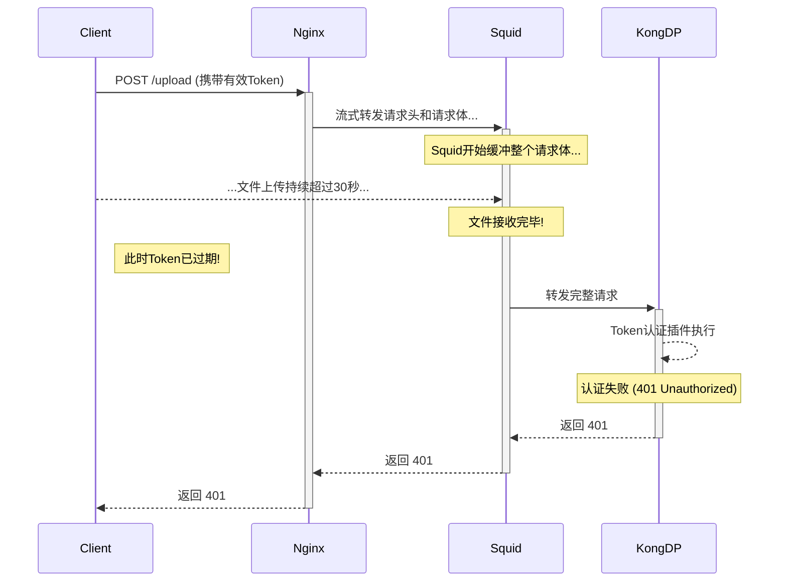
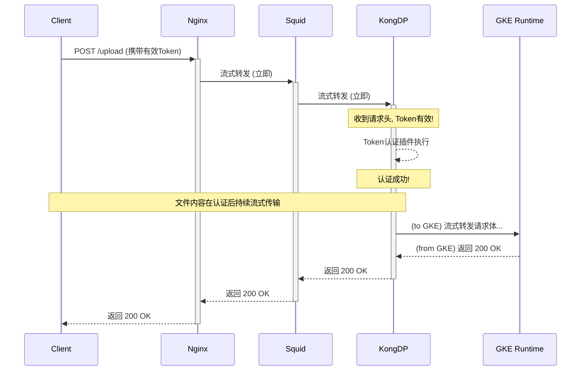

- [Q](#q)
- [Summary](#summary)
    - [1. `client_request_buffer_max_size`](#1-client_request_buffer_max_size)
    - [2. `request_body_max_size`](#2-request_body_max_size)
    - [总结](#总结)
    - [示例场景](#示例场景)
- [nginx 配置](#nginx-配置)

# Q
```
那么现在帮我分析这样一个问题 

GCP工程里面

我有一个POST的请求 发送到一个API URL 我这个API的URL的follow流会经过一个GLB + Nginx然后后面是一个Squid 代理把请求发送到KongDP 然后再到我的GKE的Runtime

然后我这个Post API必须有一个token需要认证 也就是说我的token这个插件是配置在我的KongDP上面 

那么我想了解 这个整个的follow流里面 我POST的请求比如上传一个大的文件 比如说50M

然后我的token的超时时间设置的就是30秒 那么我如何实现我的需求.比如可能单独文件上传就超过了30S.那么就会Token超时.

那么我如何平衡这个问题 也就是说这个超时时间的30秒的设置是针对哪些地方的? 

比如找到类似这个办法 在nginx设置了proxy_request_buffering off 

同时我确定我的Kong DP针对这个API也设置了buffering off 但是现在看起来还不能实现目的?
**Squid** 要确认也支持 **streaming? Squid 默认配置通常会为了内容扫描或缓存而缓冲请求体 重点集中在这里看看怎么去实现**

或者是否还有更多的思路

其实就是想实现请求在 Token 过期前到达 KongDP 并完成认证

就是想让上传大文件的时候不要Block我的Token的校验 
```

# Summary 
1.  **KongDP 的认证插件**：当请求到达 KongDP 时，认证插件会提取 Token 并验证其有效性。这个 30 秒的超时是针对 Token 本身的有效期，而不是针对请求的传输时间。

2.  **请求的抵达时间**：如果整个请求体（包括文件）在 Token 过期之前没有完全抵达 KongDP，并被 KongDP 的认证插件处理，那么请求就会失败。

3. 分析 Squid 的日志去看看是不是这里卡在那?
    - https://www.squid-cache.org/Doc/config/client_request_buffer_max_size/
    - 这指定了客户端请求的最大缓冲区大小。当有人上传大文件时，它可以防止squid占用过多内存。
    - This specifies the maximum buffer size of a client request. It prevents squid eating too much memory when somebody uploads a large file.
    - 

```bash
client_request_buffer_max_size 50 MB 是最大的问题
client_request_buffer_max_size 0        # 取消了请求缓冲区的大小限制
client_request_buffer_max_size 1 KB     # 最多缓冲1KB
client_request_buffer_max_size 64 KB    # 默认值，缓冲64KB

如果上传文件是50MB，而这个值也设置为50MB。这意味着Squid会尝试将整个50MB的请求体完全缓冲到内存中，然后再转发给上游。这正是导致Token在文件上传期间超时的主因

如果上传文件是30M,也就是小于50MB.

最重要： 将 client_request_buffer_max_size 50 MB 调整为 1 KB (或更小)，或者直接移除此行，让Squid在cache deny all的背景下尝试流式处理。
比如我可以设置为32K就可以了 ==> 而不是50MB ?

所以这个值比如我设置为2M 也就是说 存储请求头和请求体的缓冲区的最大大小 是2M 这样也不会影响我用户上传50M文件,还能快速完成我的TOken认证?


```

非常好的问题 👍 你把 Squid 的两个参数搞清楚以后，逻辑就通了：

⸻

1. client_request_buffer_max_size
	•	作用：控制 单个请求 body 在内存中缓存的最大大小。
	•	行为：
	•	如果请求体 ≤ 这个值 → Squid 会一次性读完放到内存，再转发。
	•	如果请求体 > 这个值 → Squid 只在内存保留这一块，剩余部分会 流式转发 到上游（不会阻塞上传）。

👉 所以，这个参数主要决定的是 是否全量缓冲在内存，还是流式转发。

⸻

2. request_body_max_size
	•	作用：控制 允许的最大请求体大小。
	•	行为：超过这个大小，Squid 直接返回 413 Request Entity Too Large，请求不会转发。

👉 它是一个 硬限制，独立于 client_request_buffer_max_size。

⸻

3. 你提到的场景分析
	•	如果 client_request_buffer_max_size 50M：
	•	用户上传 50M 文件时，Squid 会先等 50M 全部收完，缓存在内存里，再发给 Kong。
	•	这确实可能导致 Token 插件在等待文件上传时就超时（因为 Kong 要等 Squid 交完请求头和 body 才能处理）。
	•	如果 client_request_buffer_max_size 64K：
	•	用户上传 50M 文件时，Squid 只会在内存里保留 64K 的片段，剩下部分直接流式转发给 Kong。
	•	这样 Kong 可以 尽早收到请求头和 Token，马上进行 Token 校验，而不用等 50M 上传完。
	•	文件大小限制仍然由 request_body_max_size 控制（比如 50M 以内允许）。

👉 所以 调小 client_request_buffer_max_size 可以避免大文件被 Squid 阻塞，让 Token 逻辑更及时。

⸻

4. 建议配置
```squid.conf
最大允许上传文件大小
request_body_max_size 50 MB

单次内存缓冲大小，超过部分流式转发
client_request_buffer_max_size 64 KB
```
这样：
	•	文件 > 50M → 直接被拒绝（符合业务规则）。
	•	文件 ≤ 50M → 走流式转发，避免 Squid 卡住大文件，Kong 能尽快做 Token 验证。

⸻

5. ✅ 总结
	•	request_body_max_size = 文件上传允许的 最大大小。
	•	client_request_buffer_max_size = 内存中最多缓存多少，超过就 边收边转发。
	•	设置 client_request_buffer_max_size 太大，Squid 就会阻塞在本地缓冲，导致 Token 超时。
	•	设置成 64K 这种较小的值 不会限制文件大小，反而能提高 Token 插件的响应及时性。

⸻


1. 增加一个配置 
   - https://www.squid-cache.org/Doc/config/request_body_max_size/
   - request_body_max_size 这个才是控制用户上传大小的
```
request_body_max_size = 50MB 

这规定了HTTP请求体的最大大小。
换句话说，就是PUT/POST请求的最大大小。
如果用户尝试发送的请求体超过此限制，将会收到“无效请求”的错误信息。
如果将此参数设置为零（默认值），则不会施加任何限制。

另请参阅client_request_buffer_max_size，它是另一种可配置的对客户端上传的限制。
```

下面是对您提到的 SQUID 配置项的详细解释：

### 1. `client_request_buffer_max_size`

**配置项:**
```plaintext
client_request_buffer_max_size 64 KB
```

**解释:**
- **作用:** 该配置项用于指定 SQUID 在处理客户端请求时用于存储请求头和请求体的缓冲区的最大大小。具体来说，这是指从客户端请求中完全读取数据所允许的最大字节数。
- **单位:** 可以用字节（B），千字节（KB），兆字节（MB）等单位来设置，默认为 64 KB。
- **影响:** 如果请求头或请求体的大小超过这个限制，SQUID 将会拒绝请求并返回一个错误响应（通常是 400 Bad Request）。设置这个值可以帮助防止客户端发送过大的请求，对服务器的内存资源造成压力或者恶意请求。

### 2. `request_body_max_size`

**配置项:**
```plaintext
request_body_max_size = 50MB
```

**解释:**
- **作用:** 该选项定义了客户请求主体（request body）的最大允许大小。请求主体通常是在 HTTP POST 请求或者 PUT 请求中包含的数据。例如，文件上传。
- **单位:** 也可以使用字节（B），千字节（KB），兆字节（MB）等单位来设置。此处设置为 50MB。
- **影响:** 如果客户端发送的请求体超过了这一限制，SQUID 会立即中止请求并返回错误响应。这个选项对于控制上传文件的大小非常有用，防止恶意用户利用过大的请求破坏服务器。

### 总结

这两个配置项的目的都是为了确保服务器的稳定性和安全性，避免大请求给服务器造成负担或被用于拒绝服务攻击。在进行配置时，根据自身的具体应用场景和需求调整这两个参数是十分重要的，以平衡可用性和安全性。 

### 示例场景
- 如果你的应用中通常处理小文件上传，如用户头像，则可以将 `request_body_max_size` 设置为相对较小的值（如 2MB）。
- 在高负载环境中合理设置 `client_request_buffer_max_size` 则可以防止服务因处理大量大请求而崩溃。

通过对这两个配置进行合理设置，您可以更好地管理和控制应用服务的安全和性能。


# nginx 配置

```yaml
location /api/ {
    proxy_pass http://squid_backend;
    proxy_request_buffering off;
    proxy_buffering off; 
    proxy_http_version 1.1;
    proxy_set_header Connection ""; # 清除 Connection header，支持长连接.需要用户确认
    client_max_body_size 100m;
    proxy_read_timeout 300s;
    proxy_send_timeout 300s;
}
```

增加一个 proxy_buffering off;




