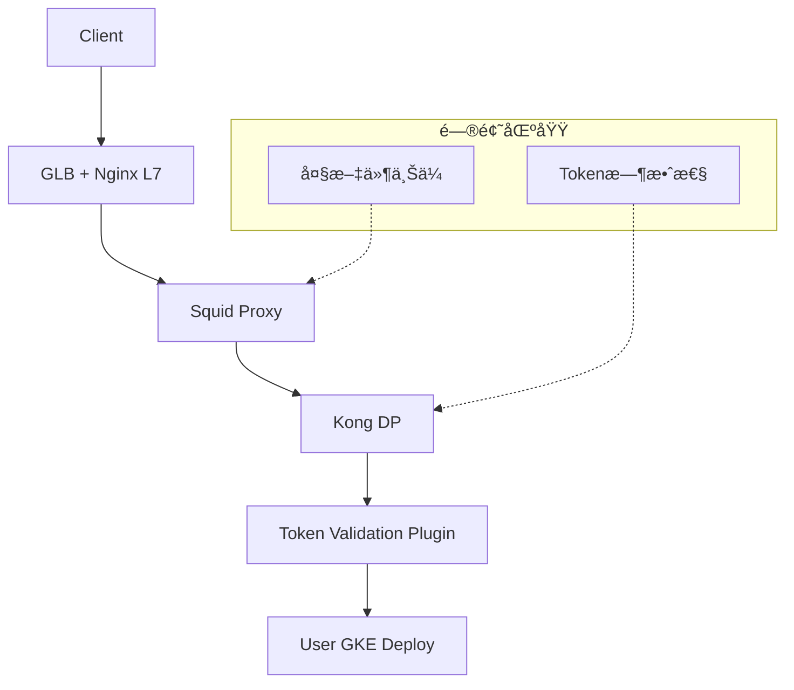
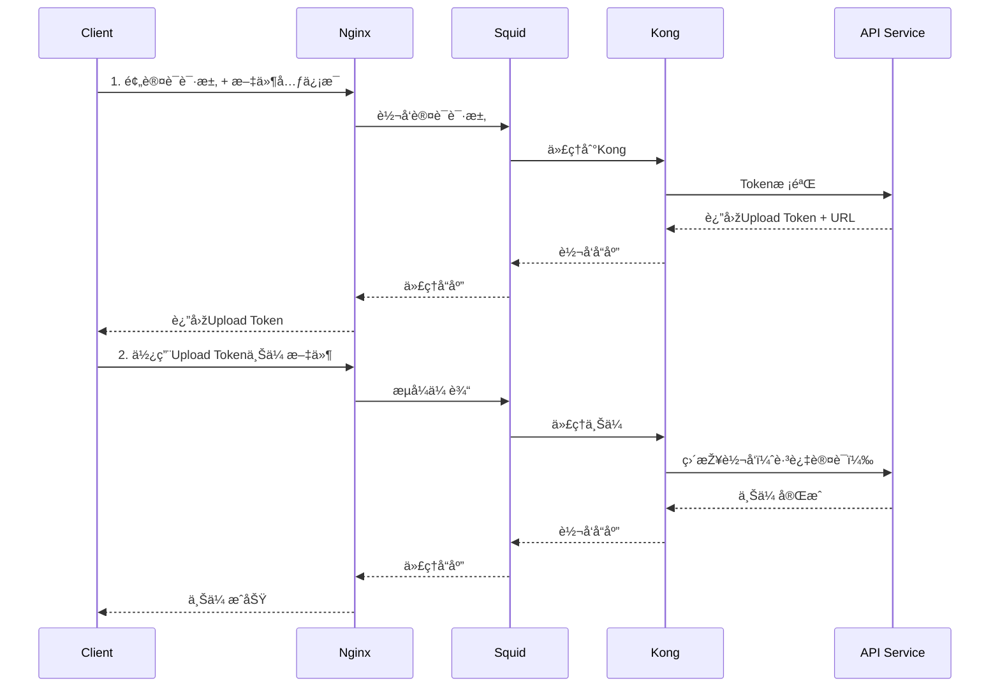

- [Q](#q)
- [Summary 2](#summary-2)
		- [1. `client_request_buffer_max_size`](#1-client_request_buffer_max_size)
		- [2. `request_body_max_size`](#2-request_body_max_size)
		- [总结](#总结)
		- [示例场景](#示例场景)
- [nginx é…ç½®](#nginx-é…ç½®)

# Q

```bash
我们是è¿è¡Œåœ¨Googleçš„GKE APIå¹³å°,å¹³å°æŽ¥å…¥å„个Teamçš„API.API都是ç»è¿‡Kong Gatewayæµå…¥åˆ°æˆ‘们的Runtime
大概的æµç¨‹å¦‚下
GLB+nginxL7==>Squid==>KongDP==> User GKE Deploy
Squid因为我们网络隔离所以需è¦Squidåšä»£ç†è·³è½¬åˆ°å“ªæ­¥çŽ¯å¢ƒçš„Kong DP
我们é‡åˆ°äº†ä¸€ä¸ªå¤§æ–‡ä»¶ä¸Šä¼ ä¸ŽToken认è¯[我们使用KongDPçš„Plugåšæ ¡éªŒ]时效性冲çªçš„问题。那么对于我类似这样的架构æ¥è¯´ 最佳的实践方案应该是什么?  
比如在nginx上é¢å¦‚下é…ç½®
```nginx.conf
location /api/ {
    proxy_pass http://squid_backend;
    proxy_request_buffering off;
    proxy_buffering off;
    proxy_http_version 1.1;
    client_max_body_size 100m;
    proxy_read_timeout 300s;
    proxy_send_timeout 300s;
}
```

Squid上如下é…ç½®

```squid.conf
request_body_max_size 50 MB
client_request_buffer_max_size 64 KB 
```

上é¢æ˜¯æˆ‘å·²ç»æŽ¢ç´¢çš„一些解决方案. 比如在é™åˆ¶ç”¨æˆ·æœ€å¤§ä¸Šä¼ æ–‡ä»¶å¤§å°çš„åŒæ—¶,能满足我们的用户能完æˆå¿«é€ŸToken校验.

# summary 1

你这个场景里主è¦çŸ›ç›¾æ˜¯ **大文件上传 + Token 校验时效性**。

问题点在于：

- **KongDP çš„ Token 校验必须等到请求体传输到达时æ‰èƒ½å¼€å§‹**（尤其如果代ç†èŠ‚点先缓存/缓冲请求体）。
- **Squid å’Œ Nginx çš„ buffering é…ç½®**直接决定了 Token 校验是“先校验 header，å†æµå¼è½¬å‘ bodyâ€è¿˜æ˜¯â€œå¿…须完整收下 body æ‰èƒ½è½¬å‘â€ã€‚
- 如果缓冲过大（如 client_request_buffer_max_size=50M），校验会延迟，导致 Token 过期。

---

## **最佳实践方å‘**

### **1.** 

### **æµå¼è½¬å‘ + Header 优先校验**

- 在 **Nginx** å’Œ **Squid** ä¸Šå¼€å¯ **æµå¼è½¬å‘**，å³ä¸ç¼“存完整请求体：
    - Nginx 用 proxy_request_buffering off（你已é…ç½® ✅）。
    - Squid 建议 client_request_buffer_max_size 设置为较å°å€¼ï¼ˆå¦‚ 64KB），åªç¼“存头部 + å°‘é‡ body 片段å³å¯ã€‚
    - 这样 Squid 会先把 header é€åˆ° KongDP，KongDP èƒ½å¤Ÿå…ˆåš Token 校验，å†å†³å®šæ˜¯å¦ç»§ç»­è¯»å– body。

### **2.** 

### **在 KongDP æå‰æ ¡éªŒ Token（Header-only auth）**

- 在 KongDP çš„æ’件逻辑里，尽é‡åšåˆ°**åªåŸºäºŽ Header 校验 Token**，ä¸ä¾èµ–请求体。
- 一旦 header 校验通过，å†ç»§ç»­æŽ¥æ”¶/转å‘大文件。
- 如果你们的 Token æ ¡éªŒéœ€è¦ payload å‚与（例如签å覆盖 body），就必须è¦è°ƒæ•´æž¶æž„（è§ç¬¬ 4 点）。

### **3.** 

### **超时å‚数的匹é…**

- Nginx proxy_read_timeoutã€proxy_send_timeout å·²ç»è®¾ç½®è¾ƒå¤§ï¼ˆ300s），å¯ä»¥ä¿éšœå¤§æ–‡ä»¶ä¸Šä¼ ã€‚
- Squid 需è¦é…åˆè®¾ç½® request_body_max_size（控制最大文件大å°ï¼‰ï¼Œé¿å…过大文件拖垮代ç†ã€‚

### **4.** 

### **更高级的方案（推è改造æ€è·¯ï¼‰**

如果未æ¥ä½ ä»¬ä¸Šä¼ çš„文件还会更大，或者对 Token 时效è¦æ±‚更严格，å¯ä»¥è€ƒè™‘：

1. **分离 Auth 与 Upload**

    - 先调用一个å°è¯·æ±‚接å£éªŒè¯ Token（由 KongDP 完æˆï¼‰ã€‚
    - 验è¯é€šè¿‡åŽè¿”回一个 **一次性上传 URL**（Presigned URL，存储在 GCS/Bucket 或åŽç«¯æœåŠ¡ï¼‰ã€‚
    - 用户用这个 URL 直接上传大文件，ä¸å†èµ° KongDP 认è¯é“¾è·¯ã€‚
    - KongDP åªç®¡é‰´æƒï¼Œä¸ç®¡å¤§æ–‡ä»¶ä¼ è¾“。
    - 优点：é¿å…大文件长链路 + Token 过期问题。

2. **短时 Token + Refresh 机制**

    - 上传接å£ç­¾å‘ **短时有效 Token**，上传过程中å³ä¾¿ç”¨æˆ·é•¿æ—¶é—´å ç”¨é“¾è·¯ï¼Œä¹Ÿä¸ä¼šå› ä¸ºåˆå§‹ Token 过期而失败。
    - KongDP æ’件åªæ£€æŸ¥å¤´éƒ¨ Token，ä¸æ„ŸçŸ¥ Body。

---

## **总结**

在你当å‰çš„架构下，推è组åˆæ–¹æ¡ˆï¼š

1. **Nginx + Squid 都开å¯æµå¼è½¬å‘**（é¿å…缓存完整 body）。

```
proxy_request_buffering off;
proxy_buffering off;
```

```
client_request_buffer_max_size 64 KB   # ä¿æŒå°å€¼
request_body_max_size 50 MB           # é™åˆ¶æœ€å¤§æ–‡ä»¶
```

1.

2.  **KongDP æ’件åªæ ¡éªŒ header 中的 Token**，é¿å…ä¾èµ– body。
3.  **如果åŽç»­æ–‡ä»¶æ›´å¤§** → 改造为 **预签å直传方案**，Kong åªè´Ÿè´£é‰´æƒï¼Œæ–‡ä»¶èµ°å­˜å‚¨ç³»ç»Ÿã€‚

---

### **Mermaid æµç¨‹å›¾**

```mermaid
graph TD;
    A[Client 上传请求] --> B[Nginx L7 proxy]
    B --> C[Squid Proxy<br/>æµå¼è½¬å‘ Header]
    C --> D[Kong DP<br/>Token Header 校验]
    D -->|校验通过| E[Runtime Service<br/>接收 Body]
    D -->|校验失败| F[返回 401/403]

    subgraph å¯é€‰ä¼˜åŒ–
        G[Auth 接å£å…ˆæ ¡éªŒ Token]
        G --> H[ç”Ÿæˆ Presigned URL]
        H --> I[Client ç›´ä¼  GCS/åŽç«¯å­˜å‚¨]
    end
```

---

è¦ä¸è¦æˆ‘帮你写一份 **完整的推èé…置清å•**（Nginx + Squid + Kong æ’件侧），方便你直接套用对比？

# summay2 Claude

基于您的架构和当å‰é‡åˆ°çš„问题，我æ¥åˆ†æžä¸€ä¸‹æœ€ä½³å®žè·µæ–¹æ¡ˆã€‚

## 架构æµç¨‹å›¾



## 核心问题分æž

您的问题主è¦é›†ä¸­åœ¨ï¼š

1. **大文件上传延迟** vs **Token快速校验**的冲çª
2. 当å‰é…置在处ç†å¤§æ–‡ä»¶æ—¶ï¼ŒTokenå¯èƒ½åœ¨ä¸Šä¼ å®Œæˆå‰è¿‡æœŸ

## 最佳实践方案

### 1. Nginx层优化

```nginx
location /api/upload/ {
    # 大文件上传专用路径
    proxy_pass http://squid_backend;
    proxy_request_buffering off;
    proxy_buffering off;
    proxy_http_version 1.1;
    client_max_body_size 500m;  # 增大é™åˆ¶
    proxy_read_timeout 900s;    # 15分钟
    proxy_send_timeout 900s;
    
    # å¯ç”¨æµå¼ä¼ è¾“
    proxy_set_header Connection "";
    proxy_set_header X-Upload-Content-Length $content_length;
}

location /api/ {
    # 普通API请求
    proxy_pass http://squid_backend;
    proxy_request_buffering on;
    proxy_buffering on;
    proxy_http_version 1.1;
    client_max_body_size 10m;
    proxy_read_timeout 60s;
    proxy_send_timeout 60s;
}
```

### 2. Squidé…置优化

```bash
# 基础é…ç½®ä¿æŒä¸å˜ï¼Œæ·»åŠ ä»¥ä¸‹ä¼˜åŒ–
request_body_max_size 500 MB
client_request_buffer_max_size 1 MB  # 增大缓冲区

# 添加大文件处ç†ä¼˜åŒ–
range_offset_limit -1
quick_abort_min -1 KB
quick_abort_max -1 KB
quick_abort_pct 95

# 连接池优化
server_persistent_connections on
client_persistent_connections on
half_closed_clients off

# 内存使用优化
cache_mem 512 MB
maximum_object_size_in_memory 512 KB
```

### 3. Kong层解决方案

#### 方案A：Tokené¢„éªŒè¯ + 长效Token

```lua
-- Kongæ’件é…ç½®
local token_validator = {
  name = "enhanced-token-validator",
  config = {
    pre_validate_upload = true,
    extended_token_ttl = 1800,  -- 30分钟
    upload_threshold = 10485760  -- 10MB
  }
}
```

#### 方案B：分离认è¯å’Œä¸Šä¼ æµç¨‹



### 4. 推è的完整解决方案

|组件|优化é…ç½®|说明|
|---|---|---|
|Nginx|分路径处ç†|大文件上传å•ç‹¬è·¯å¾„，关闭缓冲|
|Squid|增大缓冲区|1MB缓冲区，500MB最大请求体|
|Kong|åŒToken机制|认è¯Token + 上传Token分离|
|APIæœåŠ¡|æµå¼å¤„ç†|支æŒchunked传输和断点续传|

### 5. 监控和调优

```bash
# Squid监控脚本
#!/bin/bash
# squid_monitor.sh

echo "=== Squidè¿žæŽ¥çŠ¶æ€ ==="
netstat -an | grep :3128 | awk '{print $6}' | sort | uniq -c

echo "=== 大文件传输统计 ==="
tail -1000 /var/log/squid/access.log | awk '$7 > 10000000 {print $1, $7, $6}' | head -10

echo "=== 内存使用情况 ==="
squidclient -p 3128 mgr:mem
```

### 6. 性能调优å‚æ•°

```bash
# 系统层é¢ä¼˜åŒ–
echo 'net.core.rmem_max = 67108864' >> /etc/sysctl.conf
echo 'net.core.wmem_max = 67108864' >> /etc/sysctl.conf
echo 'net.ipv4.tcp_rmem = 4096 87380 67108864' >> /etc/sysctl.conf
echo 'net.ipv4.tcp_wmem = 4096 65536 67108864' >> /etc/sysctl.conf

sysctl -p
```

### 7. 关键建议

1. **使用预认è¯æœºåˆ¶**：先验è¯Token，获å–临时上传凭è¯
2. **实施æµå¼ä¼ è¾“**：é¿å…在代ç†å±‚缓存大文件
3. **设置åˆç†è¶…æ—¶**：根æ®æ–‡ä»¶å¤§å°åŠ¨æ€è°ƒæ•´è¶…时时间
4. **监控关键指标**：连接数ã€ä¼ è¾“速率ã€é”™è¯¯çŽ‡

è¿™ç§æž¶æž„å¯ä»¥å¾ˆå¥½åœ°å¹³è¡¡å¤§æ–‡ä»¶ä¸Šä¼ æ€§èƒ½å’ŒToken安全性，åŒæ—¶ä¿æŒç³»ç»Ÿçš„å¯æ‰©å±•æ€§ã€‚

# Summary 3

1.  **KongDP 的认è¯æ’件**：当请求到达 KongDP 时，认è¯æ’件会æå– Token 并验è¯å…¶æœ‰æ•ˆæ€§ã€‚这个 30 秒的超时是针对 Token 本身的有效期，而ä¸æ˜¯é’ˆå¯¹è¯·æ±‚的传输时间。

2.  **请求的抵达时间**：如果整个请求体（包括文件）在 Token 过期之å‰æ²¡æœ‰å®Œå…¨æŠµè¾¾ KongDP，并被 KongDP 的认è¯æ’件处ç†ï¼Œé‚£ä¹ˆè¯·æ±‚就会失败。

3. åˆ†æž Squid 的日志去看看是ä¸æ˜¯è¿™é‡Œå¡åœ¨é‚£?
    - https://www.squid-cache.org/Doc/config/client_request_buffer_max_size/
    - 这指定了客户端请求的最大缓冲区大å°ã€‚当有人上传大文件时，它å¯ä»¥é˜²æ­¢ squid å ç”¨è¿‡å¤šå†…存。
    - This specifies the maximum buffer size of a client request. It prevents squid eating too much memory when somebody uploads a large file.
    -

```bash
client_request_buffer_max_size 50 MB 是最大的问题
client_request_buffer_max_size 0        # å–消了请求缓冲区的大å°é™åˆ¶
client_request_buffer_max_size 1 KB     # 最多缓冲1KB
client_request_buffer_max_size 64 KB    # 默认值，缓冲64KB

如果上传文件是50MB，而这个值也设置为50MB。这æ„味ç€Squid会å°è¯•å°†æ•´ä¸ª50MB的请求体完全缓冲到内存中，然åŽå†è½¬å‘给上游。这正是导致Token在文件上传期间超时的主因

如果上传文件是30M,也就是å°äºŽ50MB.

最é‡è¦ï¼š å°† client_request_buffer_max_size 50 MB 调整为 1 KB (或更å°)，或者直接移除此行，让Squid在cache deny all的背景下å°è¯•æµå¼å¤„ç†ã€‚
比如我å¯ä»¥è®¾ç½®ä¸º32Kå°±å¯ä»¥äº† ==> 而ä¸æ˜¯50MB ?

所以这个值比如我设置为2M 也就是说 å­˜å‚¨è¯·æ±‚å¤´å’Œè¯·æ±‚ä½“çš„ç¼“å†²åŒºçš„æœ€å¤§å¤§å° æ˜¯2M 这样也ä¸ä¼šå½±å“我用户上传50M文件,还能快速完æˆæˆ‘çš„TOken认è¯?


```

éžå¸¸å¥½çš„问题 👠你把 Squid 的两个å‚æ•°æžæ¸…楚以åŽï¼Œé€»è¾‘就通了：

⸻

1. client_request_buffer_max_size
   • 作用：控制 å•ä¸ªè¯·æ±‚ body 在内存中缓存的最大大å°ã€‚
   • 行为：
   • 如果请求体 ≤ 这个值 → Squid 会一次性读完放到内存，å†è½¬å‘。
   • 如果请求体 > 这个值 → Squid åªåœ¨å†…å­˜ä¿ç•™è¿™ä¸€å—，剩余部分会 æµå¼è½¬å‘ 到上游（ä¸ä¼šé˜»å¡žä¸Šä¼ ï¼‰ã€‚

👉 所以，这个å‚数主è¦å†³å®šçš„是 是å¦å…¨é‡ç¼“冲在内存，还是æµå¼è½¬å‘。

⸻

2. request_body_max_size
   • 作用：控制 å…许的最大请求体大å°ã€‚
   • 行为：超过这个大å°ï¼ŒSquid 直接返回 413 Request Entity Too Large，请求ä¸ä¼šè½¬å‘。

👉 它是一个 硬é™åˆ¶ï¼Œç‹¬ç«‹äºŽ client_request_buffer_max_size。

⸻

3. ä½ æ到的场景分æž
   • 如果 client_request_buffer_max_size 50M：
   • 用户上传 50M 文件时，Squid 会先等 50M 全部收完，缓存在内存里，å†å‘ç»™ Kong。
   • 这确实å¯èƒ½å¯¼è‡´ Token æ’件在等待文件上传时就超时（因为 Kong è¦ç­‰ Squid 交完请求头和 body æ‰èƒ½å¤„ç†ï¼‰ã€‚
   • 如果 client_request_buffer_max_size 64K：
   • 用户上传 50M 文件时，Squid åªä¼šåœ¨å†…存里ä¿ç•™ 64K 的片段，剩下部分直接æµå¼è½¬å‘ç»™ Kong。
   • 这样 Kong å¯ä»¥ 尽早收到请求头和 Token，马上进行 Token 校验，而ä¸ç”¨ç­‰ 50M 上传完。
   • 文件大å°é™åˆ¶ä»ç„¶ç”± request_body_max_size 控制（比如 50M 以内å…许）。

👉 所以 è°ƒå° client_request_buffer_max_size å¯ä»¥é¿å…大文件被 Squid 阻塞，让 Token 逻辑更åŠæ—¶ã€‚

⸻

4. 建议é…ç½®

```squid.conf
最大å…许上传文件大å°
request_body_max_size 50 MB

å•æ¬¡å†…存缓冲大å°ï¼Œè¶…过部分æµå¼è½¬å‘
client_request_buffer_max_size 64 KB
```

这样：
• 文件 > 50M → 直接被拒ç»ï¼ˆç¬¦åˆä¸šåŠ¡è§„则）。
• 文件 ≤ 50M → èµ°æµå¼è½¬å‘，é¿å… Squid å¡ä½å¤§æ–‡ä»¶ï¼ŒKong èƒ½å°½å¿«åš Token 验è¯ã€‚

⸻

5. ✅ 总结
   • request_body_max_size = 文件上传å…许的 最大大å°ã€‚
   • client_request_buffer_max_size = 内存中最多缓存多少，超过就 边收边转å‘。
   • 设置 client_request_buffer_max_size 太大，Squid 就会阻塞在本地缓冲，导致 Token 超时。
   • è®¾ç½®æˆ 64K è¿™ç§è¾ƒå°çš„值 ä¸ä¼šé™åˆ¶æ–‡ä»¶å¤§å°ï¼Œå而能æ高 Token æ’件的å“应åŠæ—¶æ€§ã€‚

⸻

1. 增加一个é…ç½®
    - https://www.squid-cache.org/Doc/config/request_body_max_size/
    - request_body_max_size 这个æ‰æ˜¯æŽ§åˆ¶ç”¨æˆ·ä¸Šä¼ å¤§å°çš„

```
request_body_max_size = 50MB

这规定了HTTP请求体的最大大å°ã€‚
æ¢å¥è¯è¯´ï¼Œå°±æ˜¯PUT/POST请求的最大大å°ã€‚
如果用户å°è¯•å‘é€çš„请求体超过此é™åˆ¶ï¼Œå°†ä¼šæ”¶åˆ°â€œæ— æ•ˆè¯·æ±‚â€çš„错误信æ¯ã€‚
如果将此å‚数设置为零（默认值），则ä¸ä¼šæ–½åŠ ä»»ä½•é™åˆ¶ã€‚

å¦è¯·å‚阅client_request_buffer_max_size，它是å¦ä¸€ç§å¯é…置的对客户端上传的é™åˆ¶ã€‚
```

下é¢æ˜¯å¯¹æ‚¨æ到的 SQUID é…置项的详细解释：

### 1. `client_request_buffer_max_size`

**é…置项:**

```plaintext
client_request_buffer_max_size 64 KB
```

**解释:**

- **作用:** 该é…置项用于指定 SQUID 在处ç†å®¢æˆ·ç«¯è¯·æ±‚时用于存储请求头和请求体的缓冲区的最大大å°ã€‚具体æ¥è¯´ï¼Œè¿™æ˜¯æŒ‡ä»Žå®¢æˆ·ç«¯è¯·æ±‚中完全读å–æ•°æ®æ‰€å…许的最大字节数。
- **å•ä½:** å¯ä»¥ç”¨å­—节（B），åƒå­—节（KB），兆字节（MB）等å•ä½æ¥è®¾ç½®ï¼Œé»˜è®¤ä¸º 64 KB。
- **å½±å“:** 如果请求头或请求体的大å°è¶…过这个é™åˆ¶ï¼ŒSQUID 将会拒ç»è¯·æ±‚并返回一个错误å“应（通常是 400 Bad Request）。设置这个值å¯ä»¥å¸®åŠ©é˜²æ­¢å®¢æˆ·ç«¯å‘é€è¿‡å¤§çš„请求，对æœåŠ¡å™¨çš„内存资æºé€ æˆåŽ‹åŠ›æˆ–者æ¶æ„请求。

### 2. `request_body_max_size`

**é…置项:**

```plaintext
request_body_max_size = 50MB
```

**解释:**

- **作用:** 该选项定义了客户请求主体（request body）的最大å…许大å°ã€‚请求主体通常是在 HTTP POST 请求或者 PUT 请求中包å«çš„æ•°æ®ã€‚例如，文件上传。
- **å•ä½:** 也å¯ä»¥ä½¿ç”¨å­—节（B），åƒå­—节（KB），兆字节（MB）等å•ä½æ¥è®¾ç½®ã€‚此处设置为 50MB。
- **å½±å“:** 如果客户端å‘é€çš„请求体超过了这一é™åˆ¶ï¼ŒSQUID 会立å³ä¸­æ­¢è¯·æ±‚并返回错误å“应。这个选项对于控制上传文件的大å°éžå¸¸æœ‰ç”¨ï¼Œé˜²æ­¢æ¶æ„用户利用过大的请求破åæœåŠ¡å™¨ã€‚

### 总结

这两个é…置项的目的都是为了确ä¿æœåŠ¡å™¨çš„稳定性和安全性，é¿å…大请求给æœåŠ¡å™¨é€ æˆè´Ÿæ‹…或被用于拒ç»æœåŠ¡æ”»å‡»ã€‚在进行é…置时，根æ®è‡ªèº«çš„具体应用场景和需求调整这两个å‚数是å分é‡è¦çš„，以平衡å¯ç”¨æ€§å’Œå®‰å…¨æ€§ã€‚

### 示例场景

- 如果你的应用中通常处ç†å°æ–‡ä»¶ä¸Šä¼ ï¼Œå¦‚用户头åƒï¼Œåˆ™å¯ä»¥å°† `request_body_max_size` 设置为相对较å°çš„值（如 2MB）。
- 在高负载环境中åˆç†è®¾ç½® `client_request_buffer_max_size` 则å¯ä»¥é˜²æ­¢æœåŠ¡å› å¤„ç†å¤§é‡å¤§è¯·æ±‚而崩溃。

通过对这两个é…置进行åˆç†è®¾ç½®ï¼Œæ‚¨å¯ä»¥æ›´å¥½åœ°ç®¡ç†å’ŒæŽ§åˆ¶åº”用æœåŠ¡çš„安全和性能。

# nginx é…ç½®

```yaml
location /api/ {
    proxy_pass http://squid_backend;
    proxy_request_buffering off;
    proxy_buffering off; 
    proxy_http_version 1.1;
    proxy_set_header Connection ""; # 清除 Connection header，支æŒé•¿è¿žæŽ¥.需è¦ç”¨æˆ·ç¡®è®¤
    client_max_body_size 100m;
    proxy_read_timeout 300s;
    proxy_send_timeout 300s;
}
```

增加一个 proxy_buffering off;

```mermaid

sequenceDiagram

    participant Client

    participant Nginx

    participant Squid

    participant KongDP


    Client->>+Nginx: POST /upload (æºå¸¦æœ‰æ•ˆToken)

    Nginx->>+Squid: æµå¼è½¬å‘请求头和请求体...

    note over Squid: Squid开始缓冲整个请求体...

    Client-->>Squid: ...文件上传æŒç»­è¶…过30秒...

    note over Squid: 文件接收完毕!

    note right of Client: 此时Token已过期!

    Squid->>+KongDP: 转å‘完整请求

    KongDP-->>KongDP: Token认è¯æ’件执行

    note over KongDP: 认è¯å¤±è´¥ (401 Unauthorized)

    KongDP-->>-Squid: 返回 401

    Squid-->>-Nginx: 返回 401

    Nginx-->>-Client: 返回 401

```

```mermaid

sequenceDiagram

    participant Client

    participant Nginx

    participant Squid

    participant KongDP


    Client->>+Nginx: POST /upload (æºå¸¦æœ‰æ•ˆToken)

    Nginx->>+Squid: æµå¼è½¬å‘ (ç«‹å³)

    Squid->>+KongDP: æµå¼è½¬å‘ (ç«‹å³)

    note over KongDP: 收到请求头, Token有效!

    KongDP-->>KongDP: Token认è¯æ’件执行

    note over KongDP: 认è¯æˆåŠŸ!

    note over Client, KongDP: 文件内容在认è¯åŽæŒç»­æµå¼ä¼ è¾“

    KongDP->>GKE Runtime: (to GKE) æµå¼è½¬å‘请求体...

    GKE Runtime-->>KongDP: (from GKE) 返回 200 OK

    KongDP-->>-Squid: 返回 200 OK

    Squid-->>-Nginx: 返回 200 OK

    Nginx-->>-Client: 返回 200 OK

```
