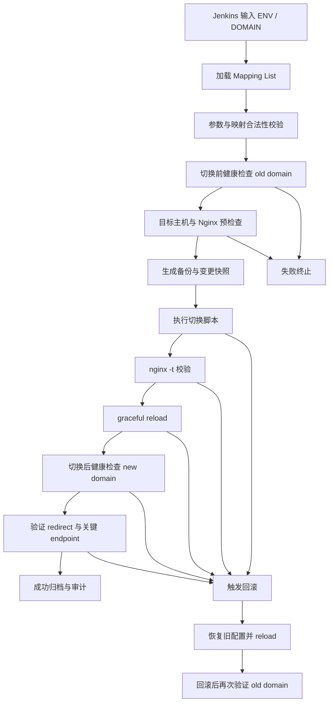

# Nginx 域名切换 Pipeline 设计

## 1. Goal and Constraints

### 目标

设计一个用于 `Nginx` 域名路由切换的 `Jenkins Pipeline`，把现有脚本封装成一个受控、可审计、可回滚的发布流程。

核心目标：

- 输入参数只有两个：`ENV`、`DOMAIN`
- 切换前必须验证原始域名链路健康
- 切换时通过脚本更新 `Nginx` 配置、替换同名文件、应用 redirect 规则
- 切换后必须验证新域名链路可用
- 整个过程以 `Zero Downtime` 和 `Safe Cutover` 为优先目标

### 已知输入

- `ENV`
  - 例如：`test`、`staging`、`prod`
- `DOMAIN`
  - 例如：`long-fqdn.com`
- 一份映射清单 `mapping list`
  - 记录原始信息和切换后信息
  - 至少包含：
    - 原始域名
    - 新域名
    - 健康检查 URL
    - 目标配置文件
    - redirect 规则标识

### 边界约束

- 本设计只定义流程和控制面，不展开脚本内部实现
- 脚本本身视为一个黑盒执行器，例如：
  - `switch_nginx.sh ${ENV} ${DOMAIN}`
- 假设 `Nginx reload` 采用平滑重载方式，不允许粗暴重启
- 默认按生产环境标准设计

### 问题分类

- 类型：`Deployment` + `Traffic Switching` + `Reliability`
- 复杂度：`Moderate`

## 2. Recommended Architecture (V1)

### 设计原则

- `Jenkins` 只负责编排、校验、审计、回滚触发
- 你的 Shell 脚本只负责“执行切换动作”
- 域名映射清单作为唯一事实源，避免人工拼接参数
- 切换动作必须建立在“前置校验通过”基础上
- 切换完成必须建立在“后置验证通过”基础上
- 任一步失败都进入失败闭环，而不是继续推进

### V1 组件划分

| 组件 | 责任 | 说明 |
|---|---|---|
| Jenkins Pipeline | 编排总流程 | 参数输入、审批、阶段控制、失败处理 |
| Mapping List | 切换事实源 | 描述 old/new 域名、health URL、配置路径 |
| Pre-check 模块 | 切换前验证 | 校验旧域名、DNS、目标主机连通性、Nginx 配置可用性 |
| Switch Script | 执行动作 | 更新配置、替换文件、生成 redirect、reload Nginx |
| Post-check 模块 | 切换后验证 | 校验新域名健康、redirect 行为、reload 结果 |
| Rollback 模块 | 故障恢复 | 回退备份配置并重新 reload |
| Audit/Log | 审计留痕 | 保存参数、操作人、切换结果、失败原因 |

### 逻辑流



## 3. Trade-offs and Alternatives

### 推荐方案

采用“单次串行切换 + 强前置校验 + 强后置验证 + 自动回滚”的模式。

优点：

- 实现成本低，适合快速落地
- 能复用你现有脚本
- 风险边界清晰，容易审计
- 对 Jenkins 运维团队最友好

缺点：

- 仍然属于“配置切换型发布”，不是完全的流量分批发布
- 如果新链路依赖外部 DNS 生效，验证窗口要更谨慎

### 可选增强方案

#### 方案 A：当前推荐的 V1

- Jenkins 调脚本
- 脚本改配置并 reload Nginx
- 用 health endpoint 做前后验证

适合：

- 当前就要上线
- 已有稳定脚本
- 路由切换逻辑主要在 Nginx 层

#### 方案 B：双配置预置 + 原子切换

- 提前把新配置文件生成好
- 切换时只做软链接替换或 include 文件切换
- 切换动作保持原子性

优点：

- 切换窗口更短
- 回滚更简单

建议：

- 这是非常值得做的结构性改进

#### 方案 C：灰度切换

- 在 Nginx 或更上游入口层做小流量验证
- 确认成功后再全量切换

优点：

- 风险最低

缺点：

- 复杂度明显上升
- 对当前“单脚本切换”模型不一定必要

## 4. Implementation Steps

### 4.1 Mapping List 设计

建议不要只传一个 `DOMAIN` 就直接执行，而是先通过 `DOMAIN` 去匹配一条映射记录。

建议每条记录至少包含以下字段：

| 字段 | 说明 |
|---|---|
| `env` | 对应环境 |
| `domain_old` | 原始域名 |
| `domain_new` | 新域名 |
| `health_old` | 原始域名健康检查 URL |
| `health_new` | 新域名健康检查 URL |
| `nginx_target` | 需要更新的 Nginx 配置文件 |
| `backup_path` | 备份路径 |
| `redirect_policy` | 关联的 redirect 规则标识 |
| `switch_enabled` | 是否允许切换 |

说明：

- `ENV + DOMAIN` 应该唯一命中一条记录
- 不允许 Pipeline 中手工拼接 old/new URL
- 映射清单建议版本化管理，放在 Git 中

### 4.2 Pipeline 阶段设计

#### Stage 1: 参数校验

目的：

- 保证输入合法，避免误操作

校验项：

- `ENV` 是否属于允许环境
- `DOMAIN` 是否为空
- `ENV + DOMAIN` 是否能在 mapping list 中找到唯一记录
- 当前记录是否 `switch_enabled=true`

失败策略：

- 任一失败直接终止

#### Stage 2: 切换前业务健康检查

目的：

- 先证明旧链路是健康的，再允许切换

必须校验：

- 原始域名健康检查地址可访问
- 返回码符合预期，例如 `200`
- 响应体包含期望关键字，避免“返回了错误页但状态码正常”
- 多次探测连续成功，例如连续 3 次成功

你给出的核心示例：

```text
https://short-fqdn.com/endpoint/.well-know/health
```

建议检查策略：

- 单次成功不算通过
- 至少 `3/3` 成功才允许继续
- 记录每次响应码、耗时、解析 IP

#### Stage 3: 基础设施预检查

目的：

- 确保切换宿主机和配置环境本身可执行

校验项：

- Jenkins 到目标主机的 SSH 或执行通道正常
- 目标主机磁盘空间足够
- 目标配置文件存在且可读写
- 当前 `Nginx` 进程存在
- 当前配置语法基线正常，可先执行一次 `nginx -t`

这是必要的，因为如果旧域名健康、但当前 Nginx 环境已坏，切换会把问题扩大。

#### Stage 4: 变更快照与备份

目的：

- 给回滚提供可恢复点

建议动作：

- 备份当前生效配置
- 备份将被替换的同名文件
- 保存当前版本号、时间戳、操作人、Git commit id
- 生成本次切换快照目录

建议备份内容：

- Nginx 主配置
- include 配置
- redirect 规则文件
- 变更涉及的静态文件或模板文件

#### Stage 5: 执行切换脚本

目的：

- 由现有脚本完成实际变更

脚本在设计上应只负责：

- 更新目标 Nginx 配置
- 替换同名文件
- 写入或更新 redirect 规则
- 输出明确的执行日志

Jenkins 需要控制的不是脚本逻辑，而是脚本的执行前后边界。

#### Stage 6: 配置语法验证与平滑加载

目的：

- 确保切换后的配置可加载且尽量零中断

建议顺序：

1. 脚本执行完成
2. 执行 `nginx -t`
3. 通过后再执行 `nginx -s reload`
4. reload 后检查进程状态和 error log

原则：

- `nginx -t` 不通过，绝不 reload
- reload 失败立即回滚

#### Stage 7: 切换后健康检查

目的：

- 验证新链路已真正生效

你当前的核心目标示例：

```text
https://long-fqdn.com/endpoint/.well-know/health
```

建议检查项：

- 新域名 health endpoint 返回 `200`
- 响应体符合预期
- 连续多次探测成功
- TLS 握手正常
- redirect 行为符合预期

如果业务允许，建议增加：

- 关键 header 校验
- 关键下游 endpoint 抽样验证

#### Stage 8: 回滚判定

以下任一条件满足，应触发自动回滚：

- 脚本执行失败
- `nginx -t` 失败
- reload 失败
- 新域名健康检查失败
- redirect 规则异常
- 新链路响应码正确但响应体错误

#### Stage 9: 回滚执行

回滚目标：

- 恢复切换前状态，而不是“修修补补”

建议动作：

- 恢复备份配置
- 恢复被替换文件
- 恢复 redirect 规则
- 再次执行 `nginx -t`
- 再次执行平滑 reload
- 再次验证原始域名健康检查地址

#### Stage 10: 审计与通知

输出内容建议包括：

- 操作人
- ENV
- DOMAIN
- 命中的 mapping 记录
- 切换前检查结果
- 切换后检查结果
- 是否发生回滚
- 回滚结果
- 日志归档位置

通知建议：

- 成功通知：附带变更摘要
- 失败通知：附带失败阶段与首个错误
- 回滚通知：附带回滚是否成功

## 5. Validation and Rollback

### 切换门禁

推荐把切换门禁定义为以下规则：

| 门禁项 | 要求 | 不满足时动作 |
|---|---|---|
| 参数合法性 | `ENV`、`DOMAIN`、mapping 唯一命中 | 终止 |
| 旧域名健康 | 连续多次成功 | 终止 |
| 目标主机可操作 | SSH/执行通道正常 | 终止 |
| 当前 Nginx 基线正常 | `nginx -t` 成功 | 终止 |
| 备份成功 | 配置和文件备份完成 | 终止 |
| 新配置语法正确 | `nginx -t` 成功 | 回滚 |
| reload 成功 | 进程与日志正常 | 回滚 |
| 新域名健康 | 连续多次成功 | 回滚 |

### 推荐的健康检查标准

建议把“健康”定义为多维通过，而不是单一 `HTTP 200`：

- DNS 解析成功
- TCP 建连成功
- TLS 握手成功
- HTTP 状态码正确
- 响应体包含期望标记
- 连续探测成功
- 总耗时不超过阈值

### 回滚策略

建议采用“自动回滚 + 人工确认复盘”的模式。

自动回滚触发点：

- 切换脚本报错
- 配置语法检查报错
- reload 报错
- post-check 报错

自动回滚完成后：

- 再次验证 `old domain` 的 health endpoint
- 如果回滚后仍不健康，立即升级为人工介入事件

### 为什么这个回滚设计更稳

因为你的核心诉求不是“把配置改掉”，而是“确保切换过程严谨且服务不中断”。

所以判断标准必须是：

- 切换前旧链路健康
- 切换后新链路健康
- 若新链路不健康，必须能恢复旧链路

## 6. Reliability and Cost Optimizations

### 高可用建议

- `Nginx reload` 替代 restart
- 配置采用 `include` 分层，减少整文件覆盖风险
- 切换文件采用“预生成 + 原子替换”模式
- 同一时间只允许一个 `ENV + DOMAIN` 任务执行，避免并发覆盖

### 零停机建议

- 绝不直接重启 `Nginx`
- 先校验再 reload
- post-check 失败立即回滚
- 如条件允许，先做新域名预热检查再暴露正式流量

### 可观测性建议

最低建议采集：

- Jenkins stage 结果
- 脚本标准输出和错误输出
- `nginx -t` 结果
- `Nginx error log`
- health check 响应码和耗时

建议加上：

- 切换前后解析到的 IP
- 证书信息摘要
- redirect 命中日志

### 成本与复杂度平衡

当前阶段没有必要直接引入更重的网关编排系统。

对你的场景，优先级建议如下：

1. 先把 Jenkins 编排、门禁、回滚做扎实
2. 再做配置文件原子切换
3. 最后才考虑灰度能力或更复杂流量治理

## 7. Handoff Checklist

上线前建议确认以下清单：

- 已定义 `ENV` 和 `DOMAIN` 的参数规范
- 已准备 mapping list，且 `ENV + DOMAIN` 唯一命中
- 已定义 old/new health endpoint
- 已定义健康检查通过标准
- 已具备配置和文件备份路径
- 已明确 `nginx -t` 和 reload 的执行账号
- 已定义自动回滚触发条件
- 已定义失败通知和升级路径
- 已确认 Jenkins 禁止并发切换同一目标

## 推荐落地结论

你的这个需求最稳妥的实现方式，不是把切换动作直接塞进 Jenkins，而是把 Jenkins 设计成一个“严格的发布控制器”：

- 切换前，验证 `short-fqdn` 链路健康
- 切换时，只允许在备份完成后执行脚本
- 切换后，验证 `long-fqdn` 链路健康
- 如果任一环节失败，自动回滚到旧配置

这样设计以后，你现有脚本可以保持专注在“怎么改配置”，而 Jenkins Pipeline 专注在“什么时候能改、改完如何验证、失败如何恢复”。

如果你下一步需要，我可以继续帮你补一版：

- `Jenkins Pipeline` 的阶段设计草图
- `mapping list` 的 YAML/JSON 结构样例
- 切换前后检查清单模板
