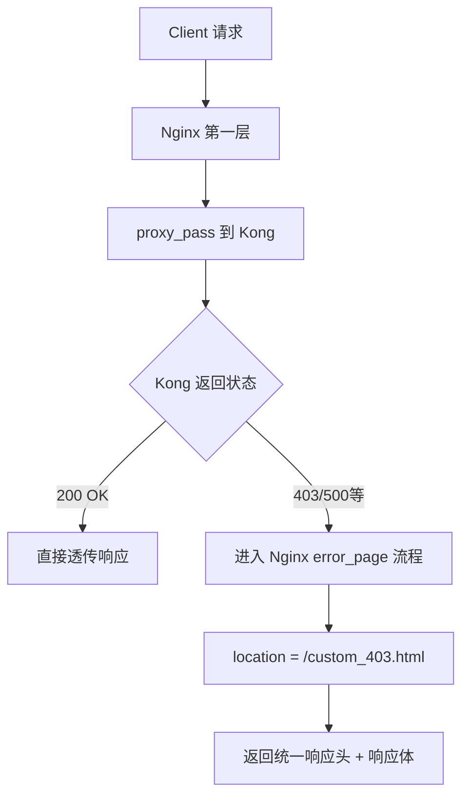
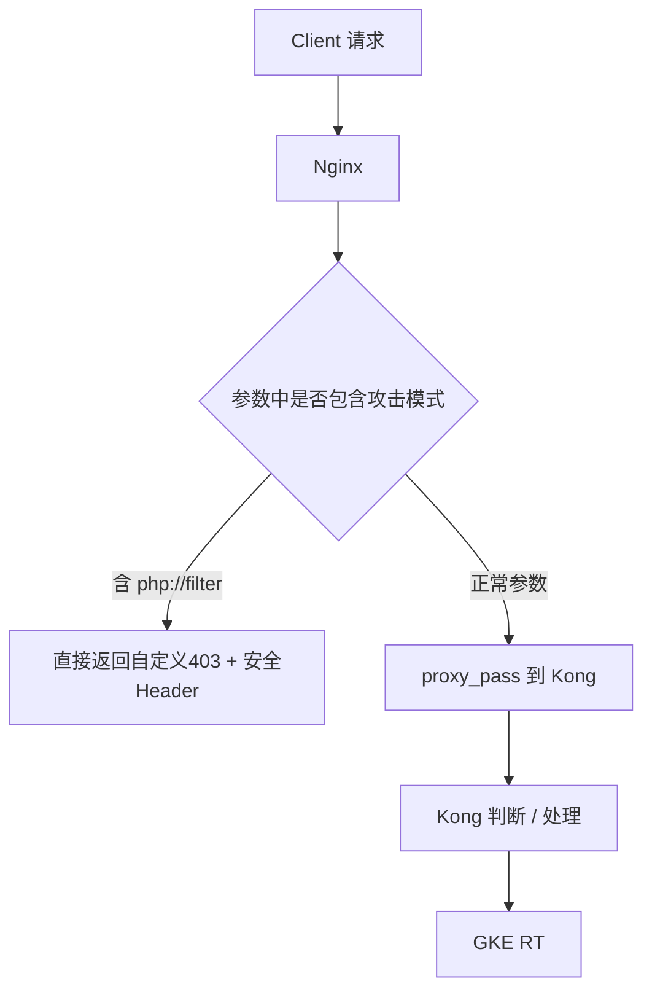

要完整跟踪请求在「多层 Nginx + Kong Gateway + 后端 Runtime」中的每一跳响应头
（尤其是安全相关 header 如 X-Content-Type-Options），可以采用如下方法分层定位与验证：

```nginx
add_header X-Content-Type-Options nosniff always;
proxy_hide_header x-content-type-options;
```
⸻

一、使用 curl 分层查看各层响应头

示例 1：请求入口 Nginx 层（www.abc.com）

curl -k -I https://www.abc.com/apiname1/v1/.well-known/health

	•	-I：只获取响应头
	•	-k：忽略证书（如是自签发）
	•	可看到最外层 Nginx 返回的 headers，包括你是否正确设置了 add_header。


	X-Content-Type-Options: nosniff

https://www.abc.com/apiname1/v1/.well-known/health?php://filter/resouce=http://pada.abc.me/p/


        
              
# Nginx安全头在错误响应中缺失的问题分析与解决方案

您遇到的问题是典型的安全头在错误响应中缺失的情况。通过分析您提供的信息，我发现：

1. 正常请求 `https://www.abc.com/apiname1/v1/.well-known/health` 返回了正确的安全头 `X-Content-Type-Options: nosniff`
2. 但带有特殊参数的请求 `https://www.abc.com/apiname1/v1/.well-known/health?php://filter/resouce=http://pada.abc.me/p/` 返回403错误，且没有包含该安全头

## 问题原因

这个问题的根本原因是：

- 虽然您在Nginx配置中添加了 `add_header X-Content-Type-Options nosniff always;`
- 但当请求被拦截并返回403错误时，这个错误可能是由上游服务器（如Kong或其他安全组件）生成的，而不是由您配置的Nginx直接生成的
- 当上游服务器返回错误时，您的Nginx可能没有拦截这些错误并添加安全头

## 解决方案

要确保所有响应（包括错误响应）都包含必要的安全头，您需要：

### 1. 在Nginx配置中添加错误拦截

```nginx
# 在相关的server或location块中添加
proxy_intercept_errors on;
```

这个指令会让Nginx拦截来自上游服务器的错误响应（包括403），使您可以对这些错误进行自定义处理。

### 2. 确保安全头在所有位置都正确配置

```nginx
# 在server块中添加（确保这些头应用于所有响应）
add_header X-Content-Type-Options "nosniff" always;

# 如果您使用了error_page指令处理特定错误，也要在那里添加头
error_page 403 /403.html;
location = /403.html {
    add_header X-Content-Type-Options "nosniff" always;
    # 其他配置...
}
```

### 3. 处理上游服务器的头部

如果上游服务器（如Kong）也设置了自己的头，但格式不同，您可以使用：

```nginx
# 隐藏上游服务器可能发送的不符合要求的头
proxy_hide_header x-content-type-options;

# 添加您自己的标准头
add_header X-Content-Type-Options "nosniff" always;
```

### 4. 验证配置是否生效

修改配置后，使用以下命令测试带有特殊参数的URL：

```bash
curl -k -I "https://www.abc.com/apiname1/v1/.well-known/health?php://filter/resouce=http://pada.abc.me/p/"
```

确认响应中包含 `X-Content-Type-Options: nosniff` 头。

## 重要说明

1. `always` 参数非常关键，它确保头部在所有响应中都存在，包括错误响应
2. 如果您的架构是多层代理（Nginx → Kong → 后端），确保最终面向用户的Nginx正确配置了这些安全头
3. 对于复杂的多层架构，可能需要在每一层都进行适当的配置，以确保安全头在所有情况下都能正确传递

通过以上配置，您应该能够解决cyberflows系统扫描时发现的安全头缺失问题。


你的情况是：正常请求路径的响应头中已经包含 X-Content-Type-Options: nosniff，但是某些带 payload（恶意 payload 或非法 query param，例如 php://filter）的请求返回 403 时，该响应中没有包含这个 header，从而导致 Cyberflows 或其他 scanner 认为存在 violation。

这类问题核心是：

错误响应（如 403、404、500 等）没有走到正常的 add_header 路径，或者没有配置 always 参数。

⸻

✅ 正确修复方式

在你的 Nginx 配置中，确保所有返回路径（不论是 200 OK 还是 4xx/5xx）都带上该安全 header。

🔧 解决方案一：使用 always 强制添加 header

你已经有：

add_header X-Content-Type-Options nosniff always;

但仍无效的情况可能是：
	•	该 add_header 放在 location、server、或 if 块中，不适用于 error 页面；
	•	某些 error 由 Nginx 默认的 error 页面直接返回，没有走你定义的 location；

✅ 推荐的全局配置方法：

在 http 块 或 server 块最外层添加如下配置，并确保为 error 页面启用：

# 添加所有响应都必须包含 nosniff，无论状态码
add_header X-Content-Type-Options "nosniff" always;

# 强制所有 error response 都返回统一 error 页面
error_page 403 /custom_403.html;
location = /custom_403.html {
    internal;
    add_header X-Content-Type-Options "nosniff" always;
    return 403 'Forbidden';
}


⸻

📌 额外补充：Nginx 的 add_header 陷阱

默认情况下，add_header 只对 200、204、301、302、303、304、307 和 308 有效。

只有加上 always 才会对如 403、404、500 也生效。

⸻

🧪 测试验证

你可以通过以下方式确认是否生效：

curl -k -I "https://www.abc.com/apiname1/v1/.well-known/health?php://filter/resource=http://pada.abc.me/p/"

返回应包含：

HTTP/1.1 403 Forbidden
X-Content-Type-Options: nosniff


⸻

🔄 如果有 Kong 参与

如果这类请求是由 Kong 拒绝（比如因为插件、路由拦截），你还需要确认 Kong 层是否配置返回头：

# Kong global plugins or Kong error responses 也要带上该 header
header_filter_by_lua_block {
    ngx.header["X-Content-Type-Options"] = "nosniff"
}

或在 kong.conf 通过插件配置安全 headers，比如 response-transformer。

⸻

✅ 总结

问题点	是否修复
200 OK 时有安全头	✅
403 返回时丢失安全头	❌（需修复）
修复建议	在 error_page + location 中添加 add_header ... always，或使用统一 error 页面
若 Kong 拦截	用 Lua 插件或配置 headers

如你希望我生成一段 Mermaid 图表示这个请求流中 Header 的处理分支，也可以告诉我，我可以附上。


是的，proxy_intercept_errors on; 确实可以在某些情况下解决你遇到的问题，特别是下面这种场景：

当 Kong 返回了 403 Forbidden，你希望第一个 Nginx 能“接管”这个错误响应，并返回你自己定义的统一页面和 headers。

⸻

✅ proxy_intercept_errors 作用解析

在 Nginx 中，默认情况下，如果反向代理上游（比如 Kong）返回了错误（如 403、404、500），Nginx 会直接将原始响应透传给客户端。

而当你启用了：

proxy_intercept_errors on;

Nginx 就会在 上游返回 4xx 或 5xx 错误时中断响应流程，转而走本地的 error_page 配置逻辑，这样你可以：
	•	返回自定义页面内容；
	•	添加自定义响应头；
	•	控制响应体格式。

⸻

🧪 示例配置

假设你的 Nginx 位于 Kong 之前，想接管来自 Kong 的 403 响应：

server {
    listen 443 ssl;
    server_name www.abc.com;

    proxy_intercept_errors on;

    location / {
        proxy_pass http://kong-upstream;
        proxy_set_header Host $host;
    }

    error_page 403 /custom_403.html;
    location = /custom_403.html {
        internal;
        add_header X-Content-Type-Options "nosniff" always;
        return 403 'Forbidden';
    }
}


⸻

⚠️ 注意事项

注意点	描述
①	必须启用 proxy_intercept_errors on; 才会触发 error_page
②	只会拦截 4xx 和 5xx 错误码，2xx/3xx 正常透传
③	上游必须没有 Content-Length + 响应体过长等情况，否则会冲突
④	若想保留上游响应头，请使用 proxy_pass_request_headers on; 等相关设置，但这会绕开 error_page 流程


⸻

✅ 整体流程（Mermaid）


⸻

✅ 小结

配置项	作用
proxy_intercept_errors on;	拦截 Kong 等 upstream 的错误响应（如 403）
error_page 403 /custom_403.html;	指定本地 Nginx 处理该错误
add_header X-Content-Type-Options "nosniff" always;	添加统一响应头

所以，答案是：是的，开启 proxy_intercept_errors on; 很可能是你目前问题的关键解决手段之一。

如果你希望我进一步帮你根据你当前的 Nginx 和 Kong 实际架构给出精简的完整配置样例，也可以继续发给我你的结构。


对于这种请求
curl -k -I https://www.abc.com/apiname1/v1/.well-known/health?php://filter/resouce=http://pada.abc.me/p/
看起来就是一个非法请求?
因为我看到我们服务配置了Cloud Armor规则会对这个规则进行拦截 这种异常请求如何避


是的，curl -k -I https://www.abc.com/apiname1/v1/.well-known/health?php://filter/resouce=http://pada.abc.me/p/ 这样的请求 **属于“异常请求”或“攻击探测”类型**，常出现在自动化漏洞扫描工具（如 CyberFlows、Burp、Nikto、OWASP ZAP）中。

---

## **✅ 该请求的问题点分析**

  

请求中的参数：

```
?php://filter/resouce=http://pada.abc.me/p/
```

- php://filter 是 PHP 的一个伪协议，可用于文件读取、代码注入等攻击。
    
- 类似结构常用于扫描服务是否存在 **远程文件包含漏洞（RFI）** 或 **本地文件包含（LFI）**。
    
- 即便你服务不使用 PHP，扫描器依然会尝试各种攻击路径。
    

---

## **✅ 拦截机制建议**

|**层级**|**机制**|**描述**|
|---|---|---|
|L7 GCLB / Cloud Armor|自定义规则拦截|如通过 MATCHES_REGEX 检测 php:// 等关键词|
|Nginx 网关层|返回统一错误页 + 安全头|统一 403 响应，并加 X-Content-Type-Options 等 headers|
|Kong Gateway|插件验证|可使用 request-transformer、ip-restriction、bot-detection 等插件|
|Runtime 后端|校验参数合法性|确保服务端不解析/使用非法参数，避免异常崩溃或意外行为|

---

## **✅ Cloud Armor 规则建议**

  

你可以添加一条类似如下的 **正则匹配 URI 查询参数的 Cloud Armor 规则**：

```
request.query:matches("(?i)php://filter")
```

**含义**：匹配 query string 中包含 php://filter（忽略大小写）的请求。

  

**完整规则配置建议如下：**

```
expression = "request.query:matches('(?i)php://filter')"
action     = "deny(403)"
description = "Block suspicious PHP wrapper attack probes"
```

你也可以结合更多扫描器常见 Payload：

```
request.query:matches("(?i)(php://|gopher://|file://|dict://|expect://)")
```

---

## **✅ 如何统一响应头（补充）**

  

即使 Cloud Armor 返回的是 403，也不会附带你期望的：

```
X-Content-Type-Options: nosniff
```

因为 Cloud Armor 是边缘组件，**响应是由 Google 生成的默认页面**，你控制不了 header。

  

👉 **解决方案：**

1. **优先由 Nginx 自行处理错误**：
    
    - 使用 proxy_intercept_errors on; 让 Nginx 接管 Kong 返回的 403；
        
    - 或者，在 Nginx 内部添加逻辑判断（如 $arg_php_filter）并主动返回自定义 403 响应；
        
    
2. **在 Cloud Armor 拦截前，对敏感参数早期识别和清洗**；
    
3. **最终确保：统一错误响应路径都由你自己的 Nginx 返回。**
    

---

## **✅ 总结建议（配合 Flow）**



|**问题**|**建议**|
|---|---|
|请求中出现 php://filter|属于攻击扫描，建议拦截|
|Cloud Armor 拦截后无 nosniff header|无法自定义 Cloud Armor 响应头|
|想返回统一响应头|用 Nginx 提前识别并统一返回自定义错误页|

如需我帮你写出完整的 Cloud Armor 策略、Nginx config 示例（针对 URI 参数过滤），也可以继续提问。

