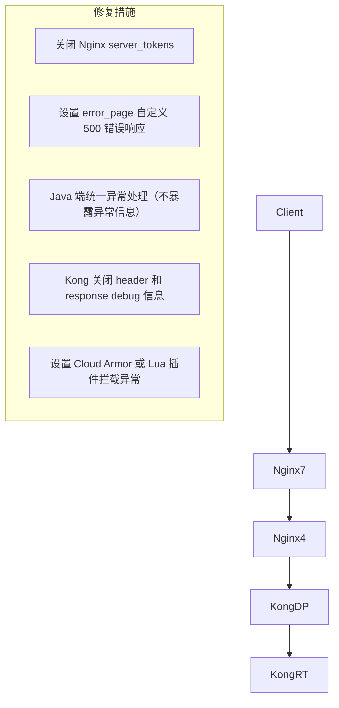
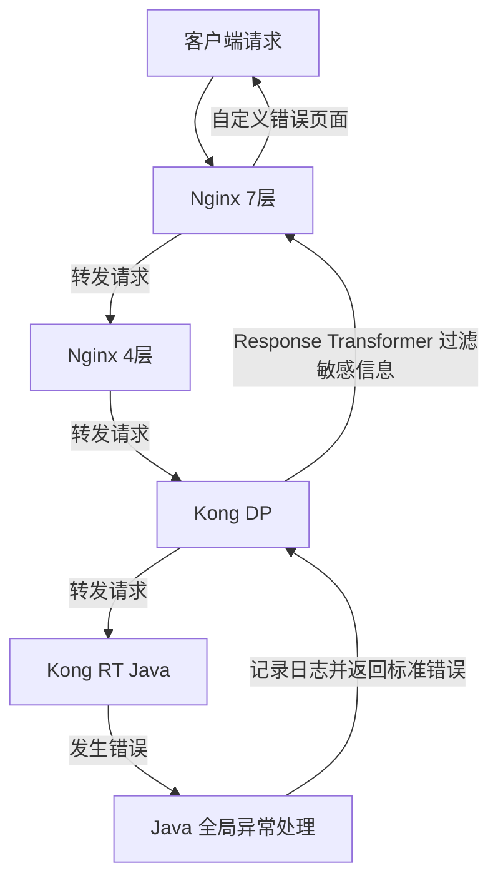
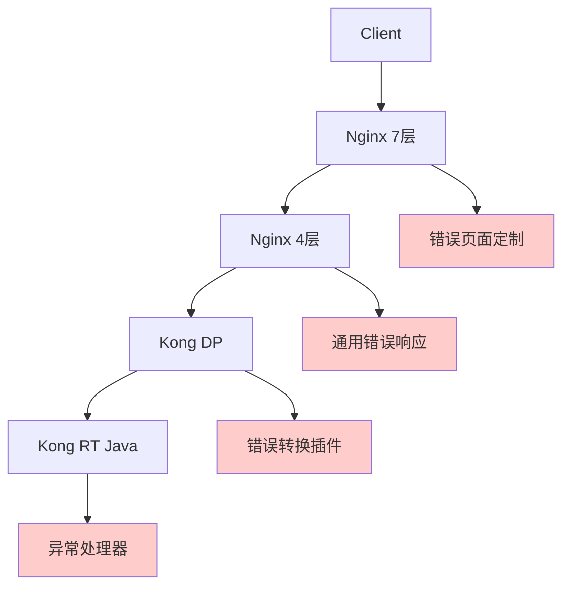

https://cwe.mitre.org/data/definitions/550.html

针对 CWE-550: Information Exposure Through Server Error Message（服务端错误信息泄露）漏洞，我的链路是：

```
Client --> Nginx(7层) --> Nginx(4层) --> Kong DP --> Kong RT(Java)
```

这个漏洞的核心问题在于：**内部错误信息（如 stacktrace、exception message、server signature 等）被返回给客户端**，可能泄露敏感实现细节，攻击者可以借此发起进一步攻击（如路径探测、命令注入、敏感接口调用等）。

---

## **一、常见泄露点**

|**层级**|**泄露内容示例**|
|---|---|
|Java 应用（Kong RT）|NullPointerException, SQLException, StackTrace, Java 类路径等|
|Kong DP|Upstream 连接失败原始返回，例如 "An unexpected error occurred"|
|Nginx|默认的 500, 502, 504 等错误页面中含有 nginx/1.x.x 等版本信息|
|响应头|Server: nginx, X-Powered-By: Java/1.8, Via, X-Kong-* 等头信息|

---

## **二、修复建议（逐层）**

  

### **1.** 

### **Java 应用（Kong RT）**

  

确保应用不会在返回响应时暴露错误细节：

```
// 不应该直接返回异常信息给用户
try {
    // logic
} catch (Exception e) {
    logger.error("Internal error", e); // log it
    response.sendError(500, "Internal Server Error"); // or return sanitized JSON
}
```

✅ 建议统一使用全局异常处理器（如 Spring 的 @ControllerAdvice）拦截异常并返回统一格式：

```
@RestControllerAdvice
public class GlobalExceptionHandler {
    @ExceptionHandler(Exception.class)
    public ResponseEntity<?> handleAllExceptions(Exception ex) {
        // 不暴露 ex.getMessage() 到外部
        return ResponseEntity.status(500).body(Map.of("error", "Internal Server Error"));
    }
}
```

---

### **2.** 

### **Kong Gateway (DP 和 RT)**

  

#### **a. 屏蔽 Kong 响应头：**

  

在 kong.conf 中配置：

```
headers = off
```

或者在 GKE/K8S 中通过环境变量传入：

```
env:
  - name: KONG_HEADERS
    value: "off"
```

#### **b. 自定义错误响应：**

  

使用插件如 [response-transformer](https://docs.konghq.com/hub/kong-inc/response-transformer/) 或 [custom plugin]，对 500 错误进行拦截和内容替换。

---

### **3.** 

### **Nginx 层（7层和4层）**

  

#### **a. 关闭版本号泄露**

```
server_tokens off;  # 禁止在 header 中显示 nginx/x.x.x
```

#### **b. 自定义错误页面（避免显示默认500/502/504页面内容）**

```
error_page 500 502 503 504 /custom_50x.html;

location = /custom_50x.html {
    root /etc/nginx/html;
    internal;
}
```

#### **c. 移除 Server header（如果默认配置没移除）**

```
proxy_hide_header Server;
more_clear_headers Server;
```

> ⚠️ more_clear_headers 需要配合 headers-more 模块，Kong 自带支持。

---

### **4.** 

### **额外建议：Cloud Armor / WAF**

  

如果你使用 GCP，可以在前置加 Cloud Armor，检测并阻断扫描/探测类请求，并统一响应结构，防止过度暴露内部结构：

```
rules:
  - action: deny(403)
    expression: "request.path.matches('/admin/.*') || origin.region_code != 'JP'"
```

---

## **三、示意修复流程图（Mermaid）**



---

## **四、检查清单**

|**检查项**|**已处理**|**说明**|
|---|---|---|
|Java 应用是否统一处理异常|✅ / ⛔|不返回 stacktrace 等|
|Kong 是否关闭 X-Kong-* header|✅ / ⛔|KONG_HEADERS=off|
|Nginx 是否关闭 server_tokens|✅ / ⛔|server_tokens off;|
|是否使用 error_page 自定义错误页面|✅ / ⛔|防止暴露默认500页面|
|是否移除响应头 Server/X-Powered-By|✅ / ⛔|more_clear_headers Server|
|是否部署 Cloud Armor WAF|✅ / ⛔|可作为防御加层|

---

如果你能提供示例响应头或实际错误信息，我可以帮你进一步判断泄露点。是否需要我帮你写一段 Lua 插件示例，用于 Kong DP 拦截错误响应内容？


针对 CWE-550: 信息泄露（Internal Server Error） 漏洞，在你当前的架构中：

```
Client --> Nginx (L7统一入口) --> Nginx (L4) --> Kong DP --> Kong RT (Java 应用)
```

且你在 Nginx L7 层是做统一入口，根据 api_name 匹配 location 再 proxy_pass。

---

## **✅** 

## **最佳修复着手点优先级建议（从外往内防护原则）**

|**优先级**|**层级**|**原因**|**说明**|
|---|---|---|---|
|⭐️⭐️⭐️ 第一优先|**Nginx L7（统一入口）**|外层是最靠近用户，最容易拦截/改写泄露内容|- 屏蔽版本信息- 自定义错误响应- 移除 Server 头部- 对下游 500/502 等错误包进行统一处理|
|⭐️⭐️ 第二优先|**Kong DP**|默认会带 X-Kong-* header，部分插件可能返回 debug 内容|- 设置 headers = off- 使用 Lua 插件统一处理错误响应（可脱敏）|
|⭐️⭐️ 第二优先|**Kong RT (Java 应用)**|如果逻辑层直接抛出异常，任何保护都可能失效|- 使用 @ControllerAdvice 或统一异常拦截器- 禁止把异常信息返回给客户端|
|⭐️ 第三优先|**Nginx L4**|无逻辑能力，作用主要在网络层|- 无需处理，仅作为透明层转发即可|

---

## **🛠 推荐修复顺序和配置建议**

  

### **第一步：Nginx L7**

  

#### **1. 屏蔽版本号和** 

#### **Server**

####  **响应头**

```
server_tokens off;

proxy_hide_header Server;
more_clear_headers Server;  # 如果支持 headers-more 模块
```

#### **2. 自定义错误响应页面，避免默认 502/504 输出泄露 Kong/Nginx 内部状态**

```
error_page 500 502 503 504 /custom_50x.html;

location = /custom_50x.html {
    root /etc/nginx/html;
    internal;
}
```

#### **3. 统一 proxy_pass 并隐藏 Kong 返回错误的 detail（如 StackTrace）**

```
location ~ ^/api/(?<api_name>[^/]+)/ {
    proxy_pass http://backend_$api_name;
    
    # 限制 header 泄露
    proxy_hide_header X-Kong-Error-Code;
    proxy_hide_header X-Kong-Response-Latency;
    proxy_intercept_errors on;
}
```

---

### **第二步：Kong DP**

  

#### **1. 配置隐藏响应头**

  

在 kong.conf 或环境变量中设置：

```
headers = off
```

#### **2. 可选：写一个简易 Lua 插件统一处理错误响应**

```
-- handler.lua
local BasePlugin = require "kong.plugins.base_plugin"
local handler = BasePlugin:extend()

function handler:access(conf)
  handler.super.access(self)
end

function handler:header_filter(conf)
  handler.super.header_filter(self)

  if ngx.status >= 500 then
    ngx.header["Content-Type"] = "application/json"
    ngx.header["X-Custom-Error"] = "internal_error"
    ngx.header["X-Kong-Error-Code"] = nil
    ngx.header["X-Kong-Response-Latency"] = nil
    ngx.header["Server"] = nil
    ngx.arg[1] = '{"error":"Internal Server Error"}'
  end
end

return handler
```

---

### **第三步：Java 应用（Kong RT）**

  

确保你使用全局异常处理器，不向客户端返回任何内部堆栈信息：

```
@RestControllerAdvice
public class GlobalExceptionHandler {
    @ExceptionHandler(Exception.class)
    public ResponseEntity<Map<String, String>> handle(Exception e) {
        // logging 可保留堆栈日志
        log.error("Unhandled exception", e);
        return ResponseEntity.status(500).body(Map.of("error", "Internal Server Error"));
    }
}
```

---

## **🔍 最终建议流程图**

```
graph TD;
    A[Client] --> B[Nginx L7 统一入口];
    B --> C[Nginx L4];
    C --> D[Kong DP];
    D --> E[Kong RT - Java];

    subgraph 安全处理建议
        B1[server_tokens off]
        B2[proxy_hide_header]
        B3[error_page 500 自定义]
        D1[KONG_HEADERS=off]
        D2[Lua 插件脱敏错误信息]
        E1[全局异常处理器 @ControllerAdvice]
    end

    B -->|处理| B1 & B2 & B3
    D -->|配置| D1 & D2
    E -->|代码| E1
```

---

## **✅ 总结**

  

> **最佳起点：从 Nginx L7 着手**。它是对用户响应的第一道防线，配置简单、效果直接。

  

然后：

- 控制 Kong 的 headers 和插件行为；
    
- 最后确保 Java 应用不输出内部细节；
    
- 所有 500 系列错误都统一响应 "Internal Server Error"。
    

  

需要我帮你生成完整的 Nginx 配置模板或 Lua 插件 demo 吗？


以下是一个针对你架构场景（Nginx L7 作为统一入口，后端为 Nginx4、Kong DP、Kong RT）的安全强化 **Nginx 配置模板**，可有效缓解 CWE-550 等信息泄露风险：

---

```
# nginx.conf 示例片段（推荐作为 L7 层统一入口 Nginx 使用）

server {
    listen 443 ssl http2;
    server_name api.example.com;

    ssl_certificate     /etc/nginx/ssl/fullchain.pem;
    ssl_certificate_key /etc/nginx/ssl/privkey.pem;

    # ✅ 安全推荐：隐藏 Nginx 自身版本
    server_tokens off;

    # ✅ 设置合理的返回头部，避免暴露后端服务信息
    proxy_hide_header Server;
    proxy_hide_header X-Kong-Error-Code;
    proxy_hide_header X-Kong-Response-Latency;

    # 如果启用了 headers-more 模块（建议开启）
    more_clear_headers Server;
    more_clear_headers X-Powered-By;
    more_clear_headers X-Kong-Error-Code;
    more_clear_headers X-Kong-Response-Latency;

    # ✅ 避免直接显示后端 5xx 错误
    proxy_intercept_errors on;

    # ✅ 自定义错误页面（可以简单返回 JSON，也可以返回 HTML）
    error_page 500 502 503 504 /custom_50x.html;

    location = /custom_50x.html {
        internal;
        default_type application/json;
        return 500 '{"error":"Internal Server Error"}';
    }

    # ✅ 动态匹配路径，基于 api_name 做 proxy_pass
    location ~ ^/api/(?<api_name>[a-zA-Z0-9_-]+)/ {
        # 假设后端有多个 service 可动态匹配，也可写成一个统一的 upstream
        proxy_pass http://kong_upstream$request_uri;

        # 推荐设置
        proxy_set_header Host $host;
        proxy_set_header X-Real-IP $remote_addr;
        proxy_set_header X-Forwarded-For $proxy_add_x_forwarded_for;
        proxy_set_header X-Forwarded-Proto $scheme;

        proxy_http_version 1.1;
        proxy_connect_timeout 5s;
        proxy_read_timeout 10s;

        # 隐藏 Kong 返回的 debug header
        proxy_hide_header X-Kong-Upstream-Latency;
        proxy_hide_header X-Kong-Proxy-Latency;
        proxy_hide_header Via;
    }

    # 可选：拦截其他未匹配路径
    location / {
        return 404 '{"error":"Not Found"}';
        default_type application/json;
    }
}
```

---

## **✅ 配置说明**

|**项目**|**说明**|
|---|---|
|server_tokens off|隐藏 Nginx 自身版本号|
|proxy_hide_header|屏蔽后端传来的 Server、X-Kong-* 等泄露头部|
|error_page + return JSON|自定义错误内容，防止后端异常内容直接暴露|
|proxy_intercept_errors|使得自定义 error_page 生效|
|location ~ /api/...|动态匹配 API 名，支持灵活扩展|
|default_type application/json|统一输出 JSON 错误信息|

---

## **⛳️ 温馨提示**

- 如果你没有 headers-more 模块支持，可以删除 more_clear_headers 部分，但推荐使用带该模块的构建。
    
- proxy_pass 之后不建议使用 $1 这种拼接动态变量去拼后端地址，推荐统一的 kong_upstream 名称由 upstream 来做服务解析（更稳定可控）。
    

---

需要我帮你生成对应的 upstream 配置或基于 api_name 的动态路由示例也可以告诉我。


# Grok
# CWE-550: 服务端错误信息泄露修复方案

针对 CWE-550 漏洞（Information Exposure Through Server Error Message），您的链路为 `Client --> Nginx(7层) --> Nginx(4层) --> Kong DP --> Kong RT(Java)`，以下是修复该漏洞的最佳实践方案。我将从问题核心入手，分析如何防止内部错误信息（如 stacktrace、exception message、server signature 等）泄露给客户端，并提供详细的步骤和配置示例。

## 问题核心分析

CWE-550 漏洞的关键在于服务端在发生错误时返回了详细的错误信息，这些信息可能包含敏感的实现细节（如代码路径、堆栈跟踪、服务器版本等）。攻击者可以利用这些信息进行进一步攻击，例如路径遍历、命令注入或针对特定版本的漏洞利用。

在您的链路中，错误信息可能在以下环节泄露：
1. **后端 Kong RT (Java)**：Java 应用程序可能在异常时返回详细的 stacktrace。
2. **Kong DP (Data Plane)**：Kong 网关可能未对后端返回的错误信息进行过滤。
3. **Nginx (4层/7层)**：Nginx 可能直接转发错误信息或自身产生带有服务器签名的错误页面。

修复目标是确保在整个链路上，错误信息被规范化，敏感信息被隐藏或替换为通用的错误提示。

---

## 修复方案与最佳实践

### 1. 从后端 (Kong RT - Java) 入手：规范化错误响应
Java 应用程序是错误信息的源头，首先需要确保后端不会将详细的 stacktrace 或异常信息返回给客户端。

#### 步骤：
- **全局异常处理**：在 Java 应用中实现全局异常处理器，捕获所有未处理的异常，并返回标准化的错误响应。
- **禁用详细错误信息**：确保在生产环境中禁用调试模式，避免返回 stacktrace。
- **日志分离**：将详细错误信息记录到服务器日志中，而不是返回给客户端。

#### 示例代码 (Spring Boot)：
```java
import org.springframework.http.HttpStatus;
import org.springframework.http.ResponseEntity;
import org.springframework.web.bind.annotation.ControllerAdvice;
import org.springframework.web.bind.annotation.ExceptionHandler;
import org.springframework.web.context.request.WebRequest;

@ControllerAdvice
public class GlobalExceptionHandler {

    @ExceptionHandler(Exception.class)
    public ResponseEntity<?> handleGlobalException(Exception ex, WebRequest request) {
        // 记录详细错误信息到日志
        log.error("Internal Server Error: ", ex);
      
        // 返回标准化错误响应
        return new ResponseEntity<>("Internal Server Error. Please contact support.", HttpStatus.INTERNAL_SERVER_ERROR);
    }
}
```

#### 配置生产环境：
在 `application.properties` 中禁用详细错误信息：
```properties
server.error.include-stacktrace=never
server.error.include-exception=false
server.error.include-message=never
```

---

### 2. 在 Kong DP (Data Plane) 配置错误处理插件
Kong 作为 API 网关，可以通过插件对后端返回的错误信息进行过滤和规范化，确保敏感信息不会传递到客户端。

#### 步骤：
- 使用 Kong 的 **Response Transformer** 插件或自定义插件，检查响应内容是否包含敏感信息（如 "stacktrace"、"exception" 等关键字），并替换为通用错误信息。
- 配置 Kong 的 **Error Handling** 策略，返回标准化的错误响应。

#### 示例：配置 Response Transformer 插件
```yaml
plugins:
  - name: response-transformer
    config:
      remove:
        headers:
          - Server
          - X-Powered-By
      add:
        headers:
          - "X-Error-Message: Internal Server Error"
      replace:
        body:
          - search: "stacktrace"
            replace: "Error occurred. Contact support."
```

#### 配置说明：
- 移除可能泄露服务器信息的头（如 `Server`、`X-Powered-By`）。
- 检查响应体中是否包含敏感信息，并替换为通用错误信息。

---

### 3. 在 Nginx (7层) 配置错误页面
Nginx 作为反向代理，可以拦截后端返回的错误响应，并返回自定义的错误页面，避免泄露敏感信息。

#### 步骤：
- 配置自定义错误页面，覆盖默认的错误响应。
- 禁用 Nginx 默认的服务器签名。

#### 示例配置：
```nginx
http {
    server_tokens off; # 禁用服务器签名，隐藏 Nginx 版本信息

    server {
        listen 80;
        server_name example.com;

        # 自定义错误页面
        error_page 500 502 503 504 /custom_error.html;
        location = /custom_error.html {
            root /var/www/html;
            internal;
        }

        # 代理设置，确保不直接透传错误信息
        proxy_intercept_errors on;
        proxy_pass http://kong_dp;
    }
}
```

#### 自定义错误页面 (`/var/www/html/custom_error.html`)：
```html
<!DOCTYPE html>
<html>
<head>
    <title>Internal Server Error</title>
</head>
<body>
    <h1>500 - Internal Server Error</h1>
    <p>An error occurred. Please contact support for assistance.</p>
</body>
</html>
```

---

### 4. 在 Nginx (4层) 配置 TCP 错误处理
如果 4 层 Nginx 仅作为 TCP 代理，错误信息通常由上层处理。但为确保安全，可以限制其暴露的信息。

#### 步骤：
- 确保 4 层 Nginx 不返回任何自定义错误信息，直接转发到 7 层。
- 如果使用 `stream` 模块，禁用详细日志或错误信息输出。

#### 示例配置：
```nginx
stream {
    server {
        listen 443;
        proxy_pass kong_dp:443;
        proxy_timeout 10s;
        proxy_connect_timeout 5s;
    }
}
```

---

### 5. 全局检查与测试
在整个链路上配置完成后，进行以下检查：
- 使用工具（如 `curl`）模拟请求，触发 500 错误，检查返回内容是否包含敏感信息。
- 扫描响应头，确认 `Server`、`X-Powered-By` 等头已被移除。
- 审查服务器日志，确保详细错误信息被记录，而非返回给客户端。

#### 示例：测试命令
```bash
curl -X GET http://example.com/invalid_endpoint -v
```

检查输出中是否包含 stacktrace 或服务器版本信息。

---

## 流程图：错误信息处理流程



---

## 总结与建议

修复 CWE-550 漏洞的核心在于**多层防御**，从源头（Java 应用）到中间层（Kong、Nginx）逐层过滤和规范化错误信息。以下是优先级建议：
1. **优先修复后端 (Java)**：确保源头不泄露详细信息。
2. **配置 Kong 插件**：通过网关过滤敏感信息。
3. **优化 Nginx 配置**：自定义错误页面并禁用服务器签名。
4. **定期测试**：使用自动化工具（如 OWASP ZAP）扫描 API 响应，检查是否仍有信息泄露。

如果您有具体的环境配置或遇到问题，可以进一步提供细节，我会针对性提供更详细的指导。


#  Claude
针对CWE-550漏洞，需要在整个链路的每一层都实施错误信息过滤。以下是最佳实践方案：

## 修复策略概览



## 1. Kong RT (Java) - 源头控制

### 全局异常处理器

```java
@RestControllerAdvice
public class GlobalExceptionHandler {
    
    private static final Logger logger = LoggerFactory.getLogger(GlobalExceptionHandler.class);
    
    @ExceptionHandler(Exception.class)
    public ResponseEntity<ErrorResponse> handleGenericException(Exception ex, HttpServletRequest request) {
        // 记录详细错误信息到日志
        logger.error("Unhandled exception for request: {}", request.getRequestURI(), ex);
        
        // 返回通用错误信息
        ErrorResponse error = ErrorResponse.builder()
            .code("INTERNAL_ERROR")
            .message("An internal error occurred")
            .timestamp(Instant.now())
            .build();
            
        return ResponseEntity.status(HttpStatus.INTERNAL_SERVER_ERROR).body(error);
    }
    
    @ExceptionHandler(ValidationException.class)
    public ResponseEntity<ErrorResponse> handleValidationException(ValidationException ex) {
        ErrorResponse error = ErrorResponse.builder()
            .code("VALIDATION_ERROR")
            .message("Invalid request parameters")
            .timestamp(Instant.now())
            .build();
            
        return ResponseEntity.status(HttpStatus.BAD_REQUEST).body(error);
    }
}
```

### 配置Spring Boot错误处理

```yaml
# application.yml
server:
  error:
    include-stacktrace: never
    include-message: never
    include-binding-errors: never
    include-exception: false
    
logging:
  level:
    org.springframework.web: ERROR
    org.springframework.security: ERROR
```

## 2. Kong DP - 网关层过滤

### 错误转换插件配置

```lua
-- kong/plugins/error-transformer/handler.lua
local ErrorTransformerHandler = {}

function ErrorTransformerHandler:access(conf)
    -- 在access阶段不做处理
end

function ErrorTransformerHandler:header_filter(conf)
    local status = kong.response.get_status()
    
    if status >= 400 then
        -- 清除可能泄露信息的头部
        kong.response.clear_header("Server")
        kong.response.clear_header("X-Powered-By")
        kong.response.clear_header("X-Runtime")
    end
end

function ErrorTransformerHandler:body_filter(conf)
    local status = kong.response.get_status()
    
    if status >= 500 then
        -- 替换5xx错误的响应体
        local generic_error = {
            error = {
                code = "INTERNAL_ERROR",
                message = "An internal error occurred"
            }
        }
        
        kong.response.set_header("Content-Type", "application/json")
        local body = cjson.encode(generic_error)
        kong.response.set_raw_body(body)
    end
end

return ErrorTransformerHandler
```

### Kong配置

```yaml
# kong.yml
plugins:
  - name: error-transformer
    config:
      hide_server_errors: true
      custom_error_messages:
        500: "Internal server error"
        502: "Bad gateway"
        503: "Service unavailable"
        504: "Gateway timeout"
```

## 3. Nginx 4层 - 传输层处理

```nginx
# nginx-l4.conf
stream {
    map $status $generic_error {
        ~^5 "HTTP/1.1 500 Internal Server Error\r\nContent-Type: application/json\r\n\r\n{\"error\":\"Internal server error\"}";
        default "";
    }
    
    upstream kong_upstream {
        server kong-dp:8000;
        keepalive 32;
    }
    
    server {
        listen 80;
        proxy_pass kong_upstream;
        proxy_timeout 30s;
        proxy_connect_timeout 5s;
        
        # 错误处理
        error_page 500 502 503 504 =500 @error_page;
    }
}
```

## 4. Nginx 7层 - 应用层防护

```nginx
# nginx-l7.conf
http {
    # 隐藏服务器信息
    server_tokens off;
    more_clear_headers 'Server';
    more_clear_headers 'X-Powered-By';
    
    # 自定义错误页面
    error_page 400 401 403 404 /4xx.json;
    error_page 500 502 503 504 /5xx.json;
    
    server {
        listen 80;
        
        location /4xx.json {
            internal;
            return 400 '{"error":{"code":"CLIENT_ERROR","message":"Bad request"}}';
            add_header Content-Type application/json;
        }
        
        location /5xx.json {
            internal;
            return 500 '{"error":{"code":"INTERNAL_ERROR","message":"Internal server error"}}';
            add_header Content-Type application/json;
        }
        
        location / {
            proxy_pass http://nginx-l4;
            proxy_set_header Host $host;
            proxy_set_header X-Real-IP $remote_addr;
            
            # 拦截错误响应
            proxy_intercept_errors on;
            
            # 隐藏上游错误
            proxy_hide_header X-Runtime;
            proxy_hide_header X-Powered-By;
        }
    }
}
```

## 修复优先级和实施步骤

|优先级|组件|修复内容|影响范围|实施难度|
|---|---|---|---|---|
|1|Kong RT (Java)|全局异常处理器|所有Java应用错误|中等|
|2|Nginx 7层|错误页面定制|所有客户端请求|简单|
|3|Kong DP|错误转换插件|网关层错误|中等|
|4|Nginx 4层|传输层错误处理|连接层错误|简单|

## 验证和测试

### 测试脚本

```bash
#!/bin/bash
# test-error-handling.sh

echo "Testing error handling..."

# 测试各种错误场景
test_cases=(
    "GET /non-existent-endpoint"
    "POST /api/invalid-data"
    "GET /api/trigger-500-error"
)

for test_case in "${test_cases[@]}"; do
    echo "Testing: $test_case"
    response=$(curl -s -w "\nStatus: %{http_code}\n" -X ${test_case%% *} "http://your-domain${test_case##* }")
    
    # 检查是否包含敏感信息
    if echo "$response" | grep -E "(stacktrace|exception|SQLException|java\.|org\.)" > /dev/null; then
        echo "❌ FAIL: Response contains sensitive information"
        echo "$response"
    else
        echo "✅ PASS: Response is clean"
    fi
    echo "---"
done
```

## 监控和告警

```yaml
# prometheus-rules.yml
groups:
  - name: error-exposure
    rules:
      - alert: SensitiveErrorExposure
        expr: increase(nginx_http_requests_total{status=~"5.."}[5m]) > 10
        for: 2m
        annotations:
          summary: "High rate of 5xx errors detected"
          description: "Potential information exposure through server errors"
```

## 关键要点

1. **分层防护**: 每一层都要有错误处理机制
2. **源头控制**: Java应用层是最重要的防护点
3. **统一错误格式**: 所有层返回一致的错误响应格式
4. **详细日志记录**: 错误详情记录到日志而非返回给客户端
5. **持续监控**: 监控错误率和响应内容

通过这个多层防护策略，可以有效防止CWE-550漏洞，确保敏感信息不会泄露给客户端。