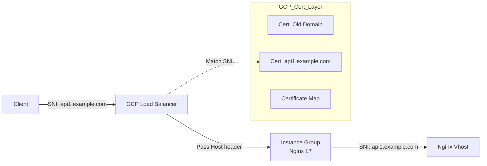

# GCLB 层面的证书适配 (GCLB Certificate Management)

发现问题的关键点非常敏锐！既然流量经过了 Google Cloud Load Balancer (GCLB)，且 GCLB 负责了 TLS 终止 (Termination)，那么 **GCLB 必须拥有所有域名的证书**，否则在第一跳通过 GCLB 时就会因为证书不匹配而报错。

## 1. 核心原理：前置的 SNI 终止

请求链路发生了变化：
*   **Client** --(HTTPS, SNI=api1.example.com)--> **GCLB** --(HTTP/HTTPS)--> **Nginx**

如果 GCLB 上只挂了 `old.example.com` 的证书：
1.  Client 发送 SNI `api1.example.com`。
2.  GCLB 只有旧证书，无法匹配，只能返回默认旧证书。
3.  Client 浏览器/OpenSSL 报错：`Subject Mismatch`。
4.  请求可能根本都不会到达 Nginx，或者到达了也是错误的。

## 2. 解决方案：在 GCLB 上挂载多证书

Google Cloud 的 Load Balancer (Target HTTPS Proxy) 原生支持挂载多个证书（最多 15 个，配额可申请增加）。

### 操作步骤 (Console / gcloud)

1.  **上传新证书到 GCP**:
    你需要把 `api1.example.com` 的证书 (CRT + KEY) 上传到 GCP Certificate Manager 或 Classic Certificates。

    ```bash
    gcloud compute ssl-certificates create cert-api1-example \
        --certificate=api1_example.crt \
        --private-key=api1_example.key \
        --global
    ```

2.  **更新 Target HTTPS Proxy**:
    找到你的负载均衡器使用的 Target Proxy，**追加**这个新证书。

    ```bash
    # 获取当前的证书列表（假设有 cert-old）
    # 更新 proxy，同时挂载 cert-old 和 cert-api1-example
    gcloud compute target-https-proxies update YOUR_TARGET_PROXY_NAME \
        --ssl-certificates=cert-old,cert-api1-example \
        --global
    ```
--ssl-certificates=SSL_CERTIFICATE,[…]
References to at most 15 SSL certificate resources that are used for server-side authentication. The first SSL certificate in this list is considered the primary SSL certificate associated with the load balancer. The SSL certificates must exist and cannot be deleted while referenced by a target HTTPS proxy.
https://docs.cloud.google.com/sdk/gcloud/reference/compute/target-https-proxies/update#--ssl-certificates

**结果**: GCLB 会根据 Client 发来的 SNI，智能选择返回 `cert-old` 还是 `cert-api1-example`。

## 3. 面向未来：如何管理大量域名？ (Scalability)

如果你以后会有几十个、上百个域名，靠手动一个个往 Proxy 上挂证书（有数量限制）是不可持续的。

### 推荐方案 A: 使用 Certificate Manager (Map) —— 最推荐
GCP 推出的 Certificate Manager 支持 **Certificate Map**。
1.  创建一个 Map。
2.  创建 Map Entry: `*.example.com` -> 对应的一张泛域名证书。
3.  或者 Map Entry: `api1.example.com` -> 对应证书1；`api2.example.com` -> 对应证书2。
4.  将这个 Map 挂载到 Target Proxy 上，而不是挂载单个证书。
*   **优势**: 支持百万级证书，即使每个客户都有独立域名也能轻松应对。

### 推荐方案 B: 泛域名证书 (Wildcard)
如果你的新域名都是 `*.example.com` 下的子域名：
1.  申请一张 `*.example.com` 的泛域名证书。
2.  在 GCLB 上只挂这一张证书。
3.  它可以同时服务 `api1.example.com`、`api2.example.com` 等。

## 4. 总结架构图



**结论**: 必须在 GCP L7 Load Balancer 上添加新域名的证书。这是流量入口的第一道关卡。

# 补充：GCLB 多证书管理与泛域名策略 (GCLB Multi-Cert Strategy)

在实际的迁移架构中，如果后端使用 Nginx 做 SNI 分流，**GCLB (Google Cloud Load Balancer) 作为流量入口，必须拥有所有域名的证书**，否则在 GCLB 层面就会发生 SSL 握手失败，流量根本到达不了 Nginx。

## 1. 核心论点确认

*   **结论**: **正确**。
*   **原因**: GCLB 是 Layer 7 负载均衡器，并在边缘节点进行 **TLS Termination** (TLS 终止)。客户端是与 GCLB 建立加密连接，而不是直接与你的 Nginx。因此，GCLB 必须持有能验证 `api1.example.com` 的证书。

## 2. GCLB 证书数量限制

*   **Target HTTPS Proxy 限制**:
    *   **Compute Engine SSL certificates**: 默认情况下，一个 Target HTTPS Proxy 最多挂载 **15** 个 Compute Engine SSL 证书。此限制无法提升。(Reference: [Google Cloud Load Balancing Quotas](https://cloud.google.com/load-balancing/docs/quotas#target-proxy))
    *   **Certificate Manager certificates**: 当直接引用 Certificate Manager 证书时，一个 Target HTTPS Proxy 最多可挂载 **100** 个证书。此限制也无法提升。(Reference: [Google Cloud Load Balancing Quotas](https://cloud.google.com/load-balancing/docs/quotas#target-proxy))
    *   **Certificate Manager certificate maps**: 一个 Target HTTPS Proxy 可以引用 **1** 个证书地图(Certificate Map)，该地图可支持数千个条目，默认可扩展至数百万个证书。(Reference: [Certificate Manager Best Practices](https://cloud.google.com/certificate-manager/docs/certificate-manager-best-practices))

## 3. 应对海量域名的策略

如果你的业务需要支持大量域名（例如 SaaS 平台为每个租户提供独立子域名），靠堆叠单域名证书是行不通的。

### 策略 A: 泛域名证书 (Wildcard Certificates) —— **推荐（如果是子域名）**
*   **适用场景**: 所有域名都是 `*.example.com` 的子域名。
*   **做法**: 只需要申请一张 `*.example.com` 的证书，挂载到 GCLB 上。
*   **效果**: 这 **1** 张证书可以覆盖无限个一级子域名 (`api1.example.com`, `api2.example.com`)。

### 策略 B: Certificate Manager (Certificate Map) —— **推荐（如果是不同主域名）**
*   **适用场景**: 有 `a.com`, `b.net`, `c.org` 等完全不同的主域名。
*   **做法**: 使用 Google Certificate Manager 的 **Certificate Map** 功能。
*   **能力**: Certificate Map 支持挂载 **百万级** 的证书，通过 Map 规则将域名映射到对应的证书，然后将整个 Map 挂载到 Target Proxy。

## 4. 总结 Q&A

| 问题 | 答案 | 关键点 |
| :--- | :--- | :--- |
| **GCLB 没挂证书，后端 Nginx 挂了有用吗？** | **没用** | 流量在 GCLB 握手失败，直接断开。 |
| **GCLB 默认能挂多少证书？** | **15 个 (Compute Engine SSL)**, **100 个 (Certificate Manager)**, **或通过 Certificate Map 支持数百万个** | Target HTTPS Proxy 的限制取决于证书类型。 |
| **以后有更多域名怎么办？** | **泛域名** 或 **Certificate Map** | 泛域名解决子域名无限扩展；Cert Map解决多主域名无限扩展。 |

## 5. 验证与参考资料 (Verification and References)

### 关于证书数量限制的验证：

原始文档中提到 "Google Cloud 的 Load Balancer (Target HTTPS Proxy) 原生支持挂载多个证书（最多 15 个，配额可申请增加）" 这一说法**部分准确但不够完整**。

根据官方文档，实际情况如下：

1. **Compute Engine SSL 证书**: 每个目标代理最多支持 **15** 个证书，此限制**无法提升**。
2. **Certificate Manager 证书**: 每个目标代理最多支持 **100** 个证书，此限制**同样无法提升**。
3. **Certificate Manager 证书地图**: 每个目标代理支持 **1** 个证书地图，该地图可扩展至**数百万个证书**。

**参考来源**:
- [Google Cloud Load Balancing Quotas and Limits](https://cloud.google.com/load-balancing/docs/quotas#target-proxy)
- [Google Cloud Certificate Manager Documentation](https://cloud.google.com/certificate-manager/docs)
- [Certificate Manager Best Practices](https://cloud.google.com/certificate-manager/docs/certificate-manager-best-practices)
- [SSL Certificates Overview for Cloud Load Balancing](https://cloud.google.com/load-balancing/docs/ssl-certificates)