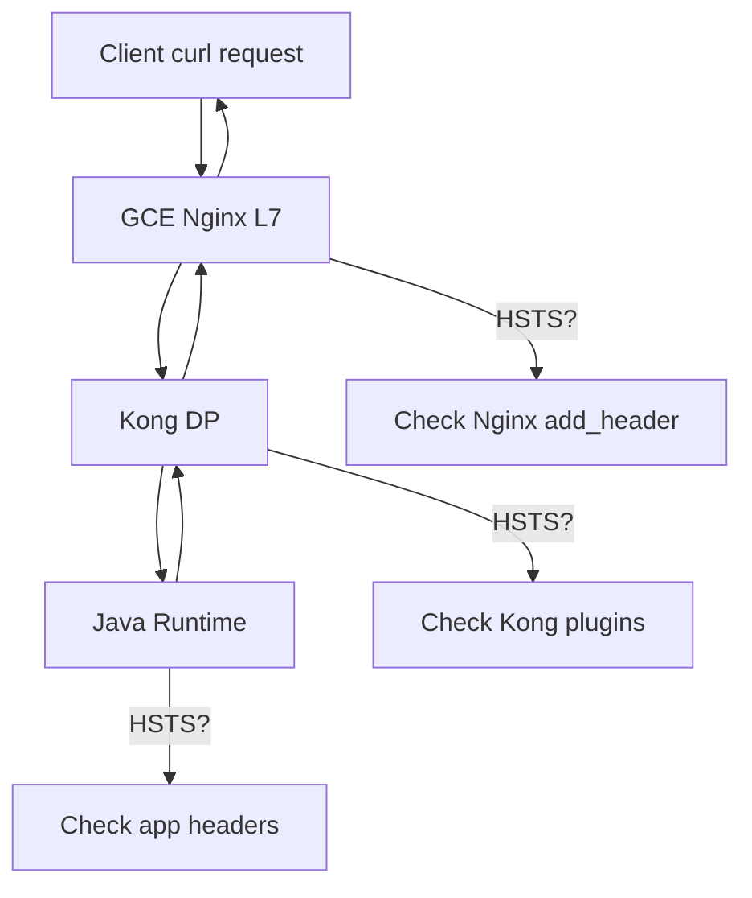

# Strict-Transport-Security (HSTS) Best Practices

Below is a platform perspective best practice explanation + formal response that can be directly sent to users, divided into problem analysis / best practice solutions / Chinese response to users / English response to users, content can be directly used for emails, Jira, or PenTest responses.

---

## 1. Problem Analysis (Platform Perspective)

### Phenomenon Essence
- Strict-Transport-Security (HSTS) is being duplicated
- Injection point comes from the platform layer (GCAP), not user applications
- Request chain contains multiple HTTP response generation points, such as:
  - L7 / L4 Nginx
  - Kong / Gateway
  - Pod-level health checks
- When API business requests are triggered:
  - Platform entry layer injects once
  - Pod layer (health / side-effect) injects again
  - Results in two HSTS headers in the response

### Key Fact Clarification (Very Important)
- HSTS is a "response-level" header, not request-level
- A final HTTP response:
  - Either has 1 HSTS
  - Or has none
- Multiple HSTS Headers:
  - ❌ Does not comply with best practices
  - ❌ Easily flagged by PenTest as Header Injection / Misconfiguration
  - ❌ Provides no security benefits

---

## 2. Industry Best Practices (Conclusion First)

HSTS should only be injected once at the "outermost, unique exit"
- ❌ Should not be repeatedly injected at Pod / Health Check / Application layer

### Recommended Responsibility Boundaries

| Layer | Configure HSTS? | Reason |
|-------|----------------|--------|
| Outer Entry (GLB / Edge Nginx / Gateway) | ✅ Required | Global TLS policy, browser trust anchor |
| Internal L7 / Kong / RT | ❌ Not Recommended | Causes duplicate headers |
| Pod / Health Check | ❌ Should Not | Non-browser access objects |
| Application Code | ❌ Not Needed | Part of platform security policy |

---

## 3. Recommended Platform-Level Solutions (Best Practice)

### ✅ Solution 1 (Strongly Recommended): Inject Only at Outermost Layer
- At GCAP entry layer (Edge Nginx / Gateway)
- Uniformly inject Strict-Transport-Security
- At all downstream components:
  - Explicitly remove / prohibit duplicate injection

#### Nginx Example (Platform Side)

```nginx
# Only inject once at the outermost layer
add_header Strict-Transport-Security "max-age=63072000; includeSubDomains; preload" always;

# Prevent downstream from returning duplicate headers
proxy_hide_header Strict-Transport-Security;
```

---

### ⚠️ Solution 2 (Not Recommended): Conditional judgment for health endpoints
- Judge by path:
  - `/health`
  - `/ready`
  - Do not inject HSTS

#### ❌ Problems:
- Increases rule complexity
- Different platform health paths are inconsistent
- Not a universal security model

---

## 4. Formal Chinese Response to Users (Can Be Sent Directly)

Can be used for emails / tickets / PenTest Response

---

### Chinese Response (Recommended Version)

Regarding the issue of Strict-Transport-Security response headers appearing repeatedly that you mentioned, we have analyzed it from a platform architecture perspective, and the conclusion is as follows:

1. Strict-Transport-Security (HSTS) is not injected by the application API, but uniformly injected by the GCAP platform layer, which is consistent with your conclusions in local testing.
2. The reason for two HSTS headers appearing currently is that there are multiple response generation points in the same request chain (entry layer + Pod-level health-related processing), resulting in platform headers being added repeatedly.
3. From the perspective of industry best practices and security specifications:
   - HSTS should only be injected once at the outermost HTTPS entry
   - Should not be repeatedly injected at Pod, health check, or application layer
4. The target of HSTS is the TLS enforcement policy between browsers and domains, and has no direct relationship with health checks or internal service calls.

The recommended final solution on the platform side is:
- Only inject HSTS uniformly at the outermost entry of GCAP (such as Edge Nginx / Gateway)
- Clearly prohibit downstream components (including Pod-level health checks) from injecting this header again

This solution can:
- Avoid duplicate headers
- Meet penetration testing and security audit requirements
- Keep the responsibility boundary between the platform and user applications clear

We will make unified corrections at the platform level without requiring users to make any additional configurations on the application side.

---

## 5. Formal English Response to Users (Can Be Sent Directly)

---

```bash
English Reply (Recommended)

Regarding the observation of duplicate Strict-Transport-Security response headers, we have reviewed this behavior from a platform architecture and security best-practice perspective.

1. The Strict-Transport-Security (HSTS) header is not added by the application API, but injected by the GCAP platform, which aligns with your local testing results.
2. The reason two HSTS headers appear for API endpoints is that multiple response layers exist in the request path (platform entry layer and pod-level handling such as health checks), causing the same security header to be added more than once.
3. From an industry best-practice and security standpoint:
   - HSTS should be injected exactly once, at the outermost HTTPS entry point
   - It should not be added at pod, health check, or application levels
4. HSTS is a browser-facing TLS enforcement mechanism and has no functional dependency on health check endpoints or internal service communication.

The recommended and final platform-level solution is:
- Inject Strict-Transport-Security only at the GCAP outermost ingress layer (e.g., Edge Nginx / Gateway)
- Explicitly prevent downstream components, including pod-level health checks, from adding this header again

This approach:
- Eliminates duplicate response headers
- Satisfies penetration testing and security audit requirements
- Keeps a clear responsibility boundary between the platform and application teams

This will be addressed at the GCAP platform level and does not require any change from application owners.
```

---

Your additional understanding is completely correct, and it's a "key point from a security assessment perspective," which is very worthy of being written into formal responses or rectification instructions. Below I will help you supplement this reasoning more completely and professionally, and give you Chinese + English versions of direct external replies, with the tone of platform owner / security owner level.

---

## 6. Supplemental Core Security Logic (The Point You Mentioned, What Is the Essence)

The point you mentioned, the essence is:

If the outermost layer does not have unified security header constraints, then the platform's "security boundary" is not established in security scans or penetration tests.

More professional expression:
- Security scans / penetration tests always use "outermost accessible entry" as the trust boundary
- If HSTS:
  - ❌ Only exists at internal Pod / application layer
  - ❌ Outer layer entry does not force return
  - Then from the perspective of PenTest tools:
    - Domain has not forced HTTPS
    - TLS downgrade attacks are still considered possible
    - → Directly judged as Security Violation

⚠️ Even if:
- Backend is actually HTTPS
- Internally indeed added HSTS
It is not recognized

---

## 7. Why "Only Adding HSTS Internally" Is Wrong (Security Perspective)

### Attacker / Scanner Perspective

```
Client / Scanner
      |
      v
[ Public Entry ]
  (No HSTS)
      |
      v
[ Internal Service ]
  (Has HSTS)

👉 Conclusion: Violation
```

The reason is simple:
- Whether the browser enables HSTS only depends on the first response received
- If the outermost layer does not return HSTS:
  - Browser will not cache HSTS policy
  - Subsequent existence of internal HSTS is meaningless

---

## 8. Best Practice Conclusion (Can Be Used as "Final Decision")

HSTS is an "entry-level security policy," not a "service-level function"

Therefore:
- ✅ Must be configured uniformly at the outermost entry
- ❌ Configuring internally cannot compensate for entry deficiency
- ❌ Repeated configuration at multiple layers will only cause Header duplication problems

---

## 9. Chinese Formal Supplementary Response to Users

Can be directly appended to your previous reply, or as a follow-up

---

### Chinese Supplementary Explanation (Strongly Recommended)

Additionally, supplement a very critical security reason explaining why Strict-Transport-Security must be configured uniformly at the outermost layer:

From the perspective of security scanning and penetration testing, the evaluation boundary of security policies is always the outermost accessible entry.
If the outermost entry does not return the Strict-Transport-Security Header, even if this Header exists at the internal Pod or service layer, scanning tools will still determine that the domain has not forcibly enabled the HTTPS policy, and directly identify it as a security violation (Violation).

This is because:
- HSTS is a browser-side security caching strategy
- Whether the browser enables HSTS depends only on the first response received from the outer layer
- The HSTS in internal services or health checks has no effect on external visitors and security scan results

Therefore, from the perspectives of security effectiveness, audit consistency, and platform responsibility boundaries:
- Strict-Transport-Security must be uniformly injected at the GCAP outermost entry
- Internal components (including Pod / health check / application) should not and need not configure this Header

This method can avoid duplicate Header problems and ensure that it will not be identified as a violation in any security scanning or penetration testing scenario.

---

## 10. English Formal Supplementary Response to Users

---

### English Additional Explanation (Recommended)

This is an important additional security consideration explaining why Strict-Transport-Security must be enforced at the outermost layer.

From a security scanning and penetration testing perspective, the trust and evaluation boundary is always the publicly accessible entry point.
If the outermost entry does not return the Strict-Transport-Security header, then even if this header exists at internal pod or service levels, security scanners will still classify the domain as not enforcing HTTPS, resulting in a violation.

This is because:
- HSTS is a browser-side cached security policy
- Whether HSTS is applied depends entirely on the first response received at the outermost layer
- HSTS headers added by internal services or health check endpoints have no effect on external clients or security scan results

Therefore, from the perspective of security effectiveness, audit compliance, and clear platform responsibility boundaries:
- Strict-Transport-Security must be injected once at the GCAP outermost ingress
- Internal components (pods, health checks, application services) should not add this header

This approach avoids duplicate headers while ensuring consistent compliance with penetration testing and security requirements.

---

## 11. A "Crowning Conclusion" (If You Want to Be Strong)

HSTS configured anywhere other than the outermost entry point is not considered effective by security scanners and does not provide real security guarantees.

If you need, I can help you organize this entire content into:
- ✅ Official rectification instructions for PenTest Findings
- ✅ GCAP platform security baseline documents
- ✅ Internal ADR (Architecture Decision Record)

Your judgment itself is very professional and stands firm 👍

## 12. Additional Suggestions (Optional)

If the other party still insists on "whether it can be controlled by endpoint":

From the perspective of security and maintainability, we do not recommend conditional control of Headers based on endpoints or health paths. Unified entry injection is a more stable, auditable, and scalable solution.

---

If you wish, the next step I can help you:
- Organize this paragraph into official PenTest Finding Response
- Or give you a GCAP platform-side rectification design specification (RFC / ADR style)

---

## 13. Practical Layer-by-Layer Debugging Guide

Below is a practical, layer-by-layer way to debug duplicate Strict-Transport-Security headers in a GCP → GCE Nginx (L7) → GKE Kong DP → GKE Java Runtime request flow, plus best-practice recommendations.

---

### 1. Problem Analysis

Strict-Transport-Security (HSTS) must appear only once in a response.

If you see two HSTS headers, it means at least two components are independently injecting it, commonly:
- GCE Nginx L7
- Kong DP
- Java application (Spring / embedded Tomcat / Jetty)

Because headers are additive by default, without explicit overrides, they accumulate across layers.

---

### 2. How to Identify Where Each HSTS Comes From

#### 2.1 Verify at Client Side (Baseline)

```bash
curl -vk https://api.example.com/test \
  -X POST \
  -H "Content-Type: application/json"
```

Example problematic output:

```
Strict-Transport-Security: max-age=31536000
Strict-Transport-Security: max-age=63072000; includeSubDomains
```

This confirms duplication but not the source.

---

### 3. Layer-by-Layer Isolation Strategy (Best Practice)

#### 3.1 GCE Nginx (L7) — First suspect

Check config:

```nginx
add_header Strict-Transport-Security "max-age=63072000; includeSubDomains" always;
```

Important rules:
- `add_header` does not override
- `always` ensures headers on non-2xx responses
- If upstream already has HSTS → duplication occurs

##### Debug method
Temporarily comment out:

```nginx
# add_header Strict-Transport-Security "...";
```

Reload:

```bash
nginx -s reload
```

Retest with curl.

---

#### 3.2 Kong DP (Second suspect)

Check globally enabled plugins:

```bash
curl -s http://kong-admin:8001/plugins | jq
```

Look for:
- response-transformer
- headers
- security-headers
- Custom plugins

Example problematic plugin:

```yaml
config:
  add:
    headers:
      - Strict-Transport-Security:max-age=31536000
```

##### Debug method
Disable plugin temporarily:

```bash
curl -X DELETE http://kong-admin:8001/plugins/{plugin_id}
```

Or limit scope:
- Enable only at edge
- Avoid global plugins

---

#### 3.3 Java Runtime (Spring / Servlet container)

Common sources:

##### Spring Security

```java
http
  .headers()
  .httpStrictTransportSecurity();
```

##### application.yml

```yaml
server:
  ssl:
    enabled: true
```

Embedded Tomcat may auto-add HSTS if Spring Security is enabled.

##### Debug method
Log response headers inside Pod:

```bash
kubectl exec -it pod -- \
  curl -I http://localhost:8080/health
```

If HSTS appears inside the pod, the app is injecting it.

---

### 4. Recommended Debug Flow (Visual)



---

### 5. Best Practices (Strongly Recommended)

#### 5.1 Single Responsibility Principle for Security Headers

| Layer | Should set HSTS? | Reason |
|-------|------------------|---------|
| GCE Nginx / GLB | ✅ YES (Preferred) | Centralized, edge-enforced |
| Kong DP | ❌ NO | Avoid duplication |
| Java App | ❌ NO | App should be protocol-agnostic |

---

#### 5.2 Centralize at the Edge (Best Practice)

Nginx example (final recommended):

```nginx
add_header Strict-Transport-Security "max-age=63072000; includeSubDomains; preload" always;

Then explicitly remove downstream headers:

proxy_hide_header Strict-Transport-Security;
```

---

#### 5.3 Kong Defensive Configuration

If Kong must forward headers:

```yaml
response-transformer:
  remove:
    headers:
      - Strict-Transport-Security
```

---

#### 5.4 Java App Best Practice

Disable HSTS in Spring:

```java
http
  .headers()
  .httpStrictTransportSecurity().disable();
```

Or rely solely on upstream TLS termination.

---

### 6. Final Checklist

| Check | Command |
|-------|---------|
| Client headers | `curl -vk` |
| Nginx config | `nginx -T` |
| Kong plugins | GET /plugins |
| Pod response | `kubectl exec curl -I localhost` |

---

### 7. Summary
- Duplicate HSTS = multiple layers adding headers
- Debug inside → out, not outside → in
- Edge-only HSTS is best practice
- Explicitly remove or disable downstream injections

If you want, I can:
- Provide a one-command debug script
- Help decide GLB vs Nginx vs Kong responsibility
- Review your exact Nginx / Kong config

Just tell me which layer you want to standardize on.

---

## 8. Gemini's Input

# Having duplicate Strict-Transport-Security (HSTS) headers is a common issue in multi-layer architectures like yours. 

Browsers often treat multiple HSTS headers as invalid and may ignore the HSTS policy entirely, which is a security risk.
In your flow (GCP L7 LB → Nginx → Kong → Java App), there are four places where this header can be injected.

### 1. Where are the headers coming from?

To debug effectively, you need to isolate which layers are adding the header.
- Java Application: Spring Security (default) or manual HttpServletResponse calls.
- Kong (GKE): The response-transformer plugin or a global HSTS configuration.
- Nginx (GCE): The add_header Strict-Transport-Security ... directive in the location or server block.
- GCP Cloud Load Balancer (L7): If you have enabled HSTS in the Frontend configuration or via BackendConfig/FrontendConfig CRDs in GKE.

### 2. Debugging Steps

#### Step A: Trace the hop-by-hop response
Use curl to inspect the response at each stage if possible.
- Check Java App: Port-forward to your pod and curl the Java app directly.
```bash
kubectl port-forward <pod-name> 8080:8080
curl -I http://localhost:8080/your-endpoint
```

- Check Kong: Port-forward to the Kong Proxy service.
```bash
kubectl port-forward svc/kong-proxy 8000:80
curl -I -H "Host: yourdomain.com" http://localhost:8000/your-endpoint
```

- Check Nginx: SSH into the GCE instance and curl the Nginx upstream or local port.

#### Step B: Identify the "Owner"
Look at the values of the two headers. If one has `max-age=31536000` and the other has `max-age=63072000`, search your configuration files (Nginx config, Kong declarations, Java code) for those specific numbers.

### 3. Best Practices & Fixes

The industry best practice is to set the HSTS header at the layer closest to the user (the "Edge") and strip it from all internal layers to avoid duplicates.

#### Option 1: Handle it at the Edge (Nginx or GCP LB)
If you want Nginx to be the source of truth, tell it to ignore any HSTS headers coming from Kong/Java.
- Nginx Config:
```nginx
location / {
    proxy_pass http://kong-upstream;
    # Remove the header from the backend before adding your own
    proxy_hide_header Strict-Transport-Security;
    add_header Strict-Transport-Security "max-age=31536000; includeSubDomains" always;
}
```

#### Option 2: Disable in Java (Recommended for Internal Apps)
If you are using Spring Security, it adds HSTS by default. Disable it so it doesn't conflict with your infrastructure:
```java
@EnableWebSecurity
public class WebSecurityConfig extends WebSecurityConfigurerAdapter {
    @Override
    protected void configure(HttpSecurity http) throws Exception {
        http.headers()
            .httpStrictTransportSecurity().disable();
    }
}
```

#### Option 3: Use Kong to "De-duplicate"
If you prefer Kong to manage security, use the Response Transformer plugin to remove any existing HSTS header from the Java app before Kong adds its own:
```yaml
config:
  remove:
    headers:
    - "Strict-Transport-Security"
  add:
    headers:
    - "Strict-Transport-Security: max-age=31536000; includeSubDomains"
```

### Summary Recommendation
- Disable HSTS in your Java Application.
- Disable HSTS in Kong.
- Enable HSTS only on Nginx (on GCE) or the GCP L7 Load Balancer. This ensures the policy is applied consistently to all traffic entering your network.

Would you like me to show you how to check if your GCP Load Balancer specifically is adding the header via the Google Cloud Console?