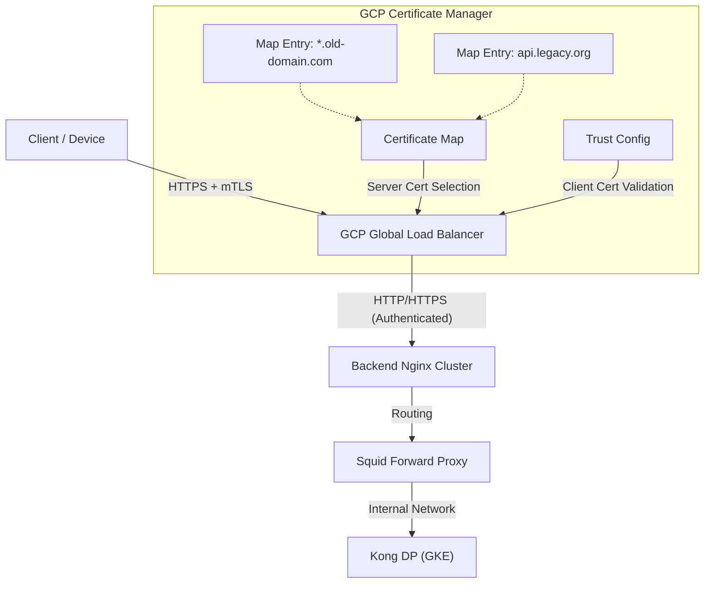

# GCP Certificate Manager & mTLS Integration Guide

本文档旨在为大规模域名迁移场景提供基于 Google Cloud Certificate Manager 的 **Certificate Map** 和 **mTLS** 解决方案。

目标是将原先由 Nginx L7 处理的 **多域名证书管理** 和 **客户端证书校验 (mTLS)** 下沉到 Google Cloud Load Balancer (GLB) 层面，以利用 GCP 的托管能力解决扩容限制，并简化后端 Nginx 架构。

## 1. 架构演进与核心变更

### 1.1 现状 (Before)
*   **流量入口**: Nginx L7 (部署在 GCE 或 GKE 上)。
*   **证书管理**: 所有的 Legacy Domain 证书 (Server Cert) 都在 Nginx 上配置 (`server_name` + `ssl_certificate`)。
*   **mTLS**: Nginx 负责校验客户端证书 (`ssl_verify_client on`)。
*   **瓶颈**: 随着域名数量增加，Nginx 配置文件臃肿；手动管理证书繁琐；GLB 即使挂载证书也有 Quota 限制 (15-100个)。

### 1.2 目标 (After)
*   **流量入口**: GCP Global External HTTPS Load Balancer (L7 GLB)。
*   **证书管理 (Server-Side)**: 使用 **Certificate Map** 挂载到 GLB，支持百万级域名映射，完美解决 "Old Flow" 多域名迁移问题。
*   **mTLS (Client-Side)**: 使用 **Trust Config** 和 **Server TLS Policy** 在 GLB 层面完成客户端证书校验。
*   **后端 Nginx**: 退化为纯路由转发层 (Routing Layer) 或 协议转换层 (Bridge)，不再处理 TLS 握手。



---

## 2. Server-Side: 使用 Certificate Map 管理海量证书

针对 `@nginx/docs/multip-in-explorer.md` 中提到的将大量 Old Flow 域名迁移的场景，直接在 Target Proxy 上挂载证书列表很快会触达上限。**Certificate Map** 是最佳解决方案。

### 2.1 创建证书 (Certificates)
首先将你的 PEM 格式证书上传到 GCP Certificate Manager。

```bash
# 上传自管证书 (Self-managed)
gcloud certificate-manager certificates create cert-legacy-api1 \
    --certificate-file="api1.crt" \
    --private-key-file="api1.key" \
    --location="global"

# 或者使用 Google 托管证书 (Google-managed)
gcloud certificate-manager certificates create cert-legacy-wildcard \
    --domains="*.gcp-project.domain" \
    --location="global"
```

### 2.2 创建证书映射 (Certificate Map)
创建一个 Map 容器。

```bash
gcloud certificate-manager maps create legacy-domain-map \
    --location="global"
```

### 2.3 创建映射条目 (Map Entries)
定义具体的域名与证书的对应关系。支持精确匹配和泛域名匹配。

```bash
# 条目 1: 精确匹配 api1.gcp-project.domain
gcloud certificate-manager maps entries create entry-api1 \
    --map="legacy-domain-map" \
    --certificates="cert-legacy-api1" \
    --hostname="api1.gcp-project.domain" \
    --location="global"

# 条目 2: 泛域名匹配 *.gcp-project.domain (作为兜底)
gcloud certificate-manager maps entries create entry-wildcard \
    --map="legacy-domain-map" \
    --certificates="cert-legacy-wildcard" \
    --hostname="*.gcp-project.domain" \
    --location="global"
```

### 2.4 挂载到负载均衡器
将制作好的 Map 挂载到 Target HTTPS Proxy。

```bash
# 更新 Proxy 以使用 Certificate Map
gcloud compute target-https-proxies update YOUR_TARGET_PROXY_NAME \
    --certificate-map="legacy-domain-map" \
    --global
```

---

## 3. Client-Side: 配置 mTLS (Server TLS Policy)

为了满足 **MTLS** 需求，我们需要配置 GCP 的 **Server TLS Policy**。

### 3.1 创建 Trust Config
上传受信任的客户端 CA 根证书 (Root CA) 和中间证书 (Intermediate CA)。

```bash
# 导入 Trust Config
gcloud certificate-manager trust-configs import client-trust-config \
    --source-file="root-ca.yaml" \
    --location="global"
```

*注意: `root-ca.yaml` 是包含证书 PEM 内容的 YAML 文件格式。*

### 3.2 创建 Server TLS Policy
定义 mTLS 策略，模式建议设为 `REJECT_INVALID` 以强制 GLB 拒绝无证书或证书无效的请求。

```bash
gcloud network-security server-tls-policies create mtls-strict-policy \
    --location="global" \
    --mtls-policy="clientValidationMode=REJECT_INVALID,clientValidationTrustConfig=projects/YOUR_PROJECT_ID/locations/global/trustConfigs/client-trust-config" \
    --allow-open="false"
```

### 3.3 挂载策略到负载均衡器
将 TLS 策略绑定到同一个 Target HTTPS Proxy。

```bash
gcloud compute target-https-proxies update YOUR_TARGET_PROXY_NAME \
    --server-tls-policy="mtls-strict-policy" \
    --global
```

---

## 4. 后端 Nginx 的适配调整

由于 TLS 终止 (Termination) 现在由 GLB 完成，发往后端 Nginx 的流量发生了根本性变化。

### 4.1 协议变化
*   **流量类型**: 根据 GLB 后端服务配置，到达 Nginx 的可能是 **HTTP** (推荐，利用 Google 内网加密) 或 **HTTPS** (自签名/再次加密)。
*   **Client Cert**: GLB **不会** 将客户端证书的原始内容 (PEM) 传递给 Nginx。

### 4.2 Nginx 配置简化
原有的 `ssl_certificate` 和 `ssl_verify_client` 配置应从 Nginx 中移除。Nginx 现在的核心职责是 **路径映射 (Path Mapping)** 和 **Host 伪装**。

**新 Nginx 配置示例**:

```nginx
server {
    # 不再处理 443 SSL，改为监听 80 (或 443 无证书模式/自签名)
    listen 80; 
    
    # 依然根据 Host 分流不同的 Legacy Domain
    server_name api1.gcp-project.domain;

    # 不再需要 SSL 配置
    # ssl_certificate ... (DELETE)
    # ssl_verify_client on; (DELETE)

    location /api-path/ {
        # 纯粹的路由转发
        proxy_pass http://squid-proxy:3128;
        proxy_set_header Host dev.fqnd.domain; # 适配 New Flow
    }
}
```

### 4.3 关于 "njs CN 校验" 的补充说明
在 `@nginx/docs/multip-in-explorer.md` 中你提到使用 Nginx njs 做 CN 校验。
*   **限制**: 切换到 GLB mTLS 后，Nginx 无法获取证书细节，因此原有的 njs CN 校验逻辑将**失效**。
*   **替代方案**: 
    1.  **信任 GLB**: 既然 GLB 的 Trust Config 已经校验了证书是由受信任 CA 签发的，通常这已经满足了大部分安全需求。
    2.  **Custom Headers (需评估)**: 如果必须获取 CN，目前 GLB 对 mTLS Header 的透传能力有限（不同于 TCP Proxy），通常不支持透传 Subject DN。如果这是硬性指标，可能需要保留 TCP Proxy 架构，但这将无法使用 Certificate Map。**建议在 GLB 层面完成所有安全准入。**

## 5. 总结

| 功能 | 旧架构 (Nginx L7) | 新架构 (GLB + Cert Manager) | 优势 |
| :--- | :--- | :--- | :--- |
| **Server 证书** | 配置在 Nginx 本地 | **Certificate Map** | 支持百万级域名，无需重启 Nginx |
| **mTLS 校验** | Nginx 本地 CA 文件 | **Trust Config** | 统一管理，集成 IAM |
| **证书扩容** | 需修改 Nginx Conf | 动态 API 调用 / Terraform | 自动化友好 |
| **Nginx 角色** | 网关 + 证书卸载 | **纯路由桥接** | 职责单一，配置简单 |

此方案完美契合你 "Demise Nginx L4/Ingress" 的长期目标，将基础设施复杂性托管给 Google Cloud.