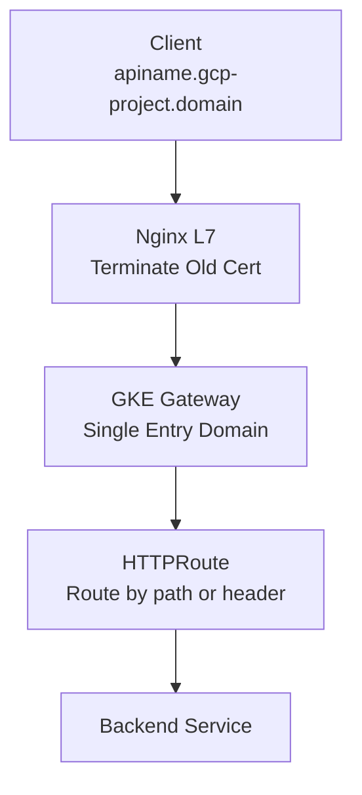
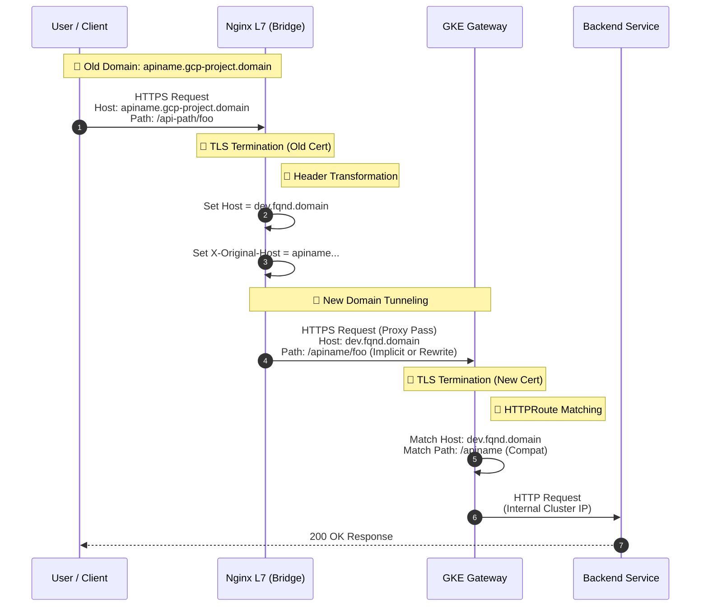
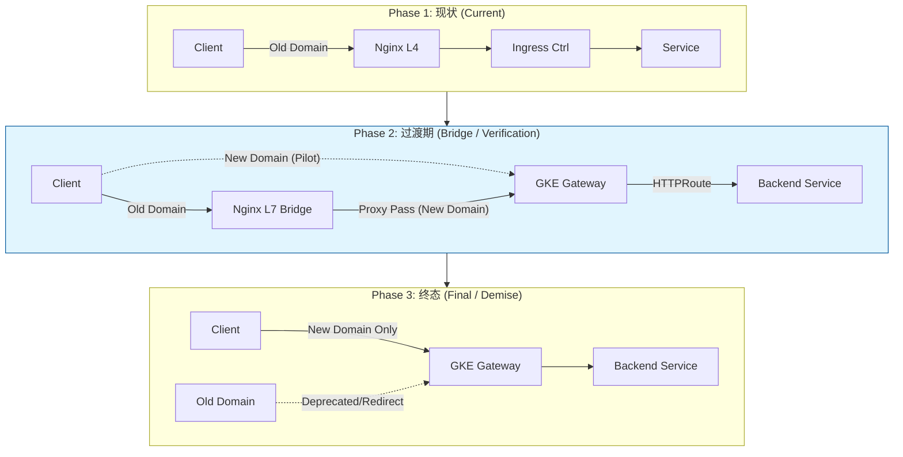
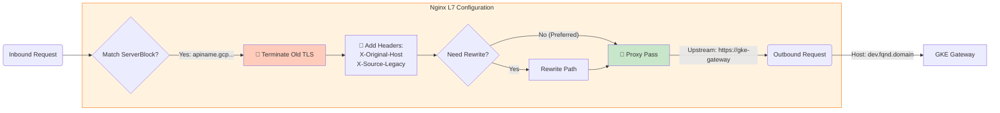
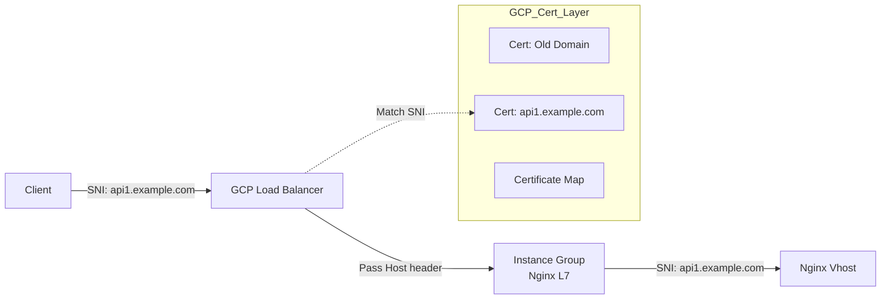
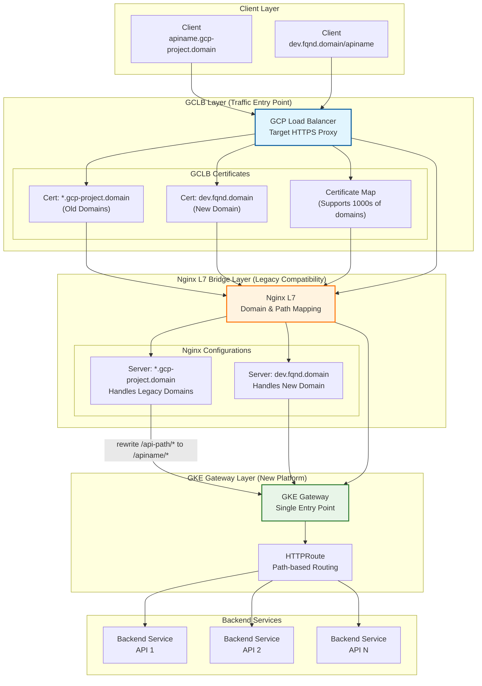

- [my requirement](#my-requirement)
  - [old flow](#old-flow)
  - [New flow](#new-flow)
- [Summary and analysis  block](#summary-and-analysis--block)
- [Chatgpt](#chatgpt)
  - [**一、问题分析（核心矛盾）**](#一问题分析核心矛盾)
  - [**二、总体迁移设计（推荐架构）**](#二总体迁移设计推荐架构)
    - [**目标架构**](#目标架构)
  - [**三、Nginx L7 的核心职责（迁移期）**](#三nginx-l7-的核心职责迁移期)
  - [**四、Nginx L7 推荐配置方式**](#四nginx-l7-推荐配置方式)
    - [**1️⃣ old domain → new unified domain（路径映射）**](#1️⃣-old-domain--new-unified-domain路径映射)
      - [**场景 1：路径需重写**](#场景-1路径需重写)
    - [**2️⃣ 多 old domain 统一转发（推荐规模化方案）**](#2️⃣-多-old-domain-统一转发推荐规模化方案)
  - [**五、GKE Gateway / HTTPRoute 的配合设计**](#五gke-gateway--httproute-的配合设计)
    - [**推荐 HTTPRoute 方式（路径一致）**](#推荐-httproute-方式路径一致)
  - [**六、你需要调整 / 新增的点（Checklist）**](#六你需要调整--新增的点checklist)
    - [**✅ 必须调整**](#-必须调整)
    - [**⚠️ 强烈建议评估**](#️-强烈建议评估)
      - [**1️⃣ Header 透传策略**](#1️⃣-header-透传策略)
      - [**2️⃣ 重试 / 超时归属**](#2️⃣-重试--超时归属)
      - [**3️⃣ 安全边界**](#3️⃣-安全边界)
  - [**七、长期演进路径（非常重要）**](#七长期演进路径非常重要)
    - [**Phase 1（现在）**](#phase-1现在)
    - [**Phase 2（用户逐步迁移）**](#phase-2用户逐步迁移)
    - [**Phase 3（最终）**](#phase-3最终)
  - [**八、结论（回答你的核心问题）**](#八结论回答你的核心问题)
- [Antigravity Analysis](#antigravity-analysis)
  - [补充评估与建议](#补充评估与建议)
    - [1. DNS 切割与流量平滑迁移 (Traffic Cutover)](#1-dns-切割与流量平滑迁移-traffic-cutover)
    - [2. Nginx L7 的 SNI 多租户配置细节](#2-nginx-l7-的-sni-多租户配置细节)
    - [3. `proxy_pass` 的目标地址解析与证书信任](#3-proxy_pass-的目标地址解析与证书信任)
    - [4. 路径 (Path) 处理的策略选择](#4-路径-path-处理的策略选择)
    - [5. 可观测性与流量区分](#5-可观测性与流量区分)
    - [6. 总结建议](#6-总结建议)
  - [九、架构可视化 (Architecture Visualization)](#九架构可视化-architecture-visualization)
    - [1. 核心请求流转时序图 (Request Lifecycle Sequence)](#1-核心请求流转时序图-request-lifecycle-sequence)
    - [2. 架构演进三阶段 (Architecture Evolution Phases)](#2-架构演进三阶段-architecture-evolution-phases)
    - [3. Nginx L7 内部处理逻辑 (The Bridge Logic)](#3-nginx-l7-内部处理逻辑-the-bridge-logic)
- [nginx 配置文件调整](#nginx-配置文件调整)
- [十、Nginx 配置架构调整分析 (Configuration Architecture)](#十nginx-配置架构调整分析-configuration-architecture)
  - [1. 问题核心分析](#1-问题核心分析)
  - [2. 解决方案 (Solution)](#2-解决方案-solution)
    - [推荐方案：增加 vhosts 目录](#推荐方案增加-vhosts-目录)
      - [第一步：修改 nginx.conf](#第一步修改-nginxconf)
      - [第二步：创建目录与新配置](#第二步创建目录与新配置)
  - [3. 验证逻辑 (Verification)](#3-验证逻辑-verification)
- [十、Nginx 配置架构调整分析 (Configuration Architecture)](#十nginx-配置架构调整分析-configuration-architecture-1)
  - [1. 问题核心分析](#1-问题核心分析-1)
  - [2. 解决方案 (Solution)](#2-解决方案-solution-1)
    - [推荐方案：增加 vhosts 目录](#推荐方案增加-vhosts-目录-1)
      - [第一步：修改 nginx.conf](#第一步修改-nginxconf-1)
      - [第二步：创建目录与新配置](#第二步创建目录与新配置-1)
  - [3. 验证逻辑 (Verification)](#3-验证逻辑-verification-1)
- [十一、故障排查：证书总是指向旧的 Localhost (Troubleshooting)](#十一故障排查证书总是指向旧的-localhost-troubleshooting)
  - [1. 现象描述](#1-现象描述)
  - [2. 根本原因排查 (Root Cause Analysis)](#2-根本原因排查-root-cause-analysis)
    - [可能性 A: 配置文件未被加载 (Most DATE)](#可能性-a-配置文件未被加载-most-date)
    - [可能性 B: 默认服务器抢占 (IP/Port Binding)](#可能性-b-默认服务器抢占-ipport-binding)
    - [可能性 C: SNI 匹配失败](#可能性-c-sni-匹配失败)
  - [3. 推荐排查步骤 (Action Plan)](#3-推荐排查步骤-action-plan)
- [十二、深入解析：多域名配置的独立性与隔离 (Deep Dive)](#十二深入解析多域名配置的独立性与隔离-deep-dive)
  - [1. 原理：Server Block 是完全隔离的容器](#1-原理server-block-是完全隔离的容器)
    - [你的修改会对现有配置产生影响吗？](#你的修改会对现有配置产生影响吗)
    - [新配置会独立生效吗？](#新配置会独立生效吗)
  - [2. 关键配置项检查 (Checklist for Isolation)](#2-关键配置项检查-checklist-for-isolation)
    - [A. 端口监听 (Listen Directive)](#a-端口监听-listen-directive)
    - [B. 默认主机的归属 (Default Server)](#b-默认主机的归属-default-server)
    - [C. 证书隔离 (Certificate Isolation)](#c-证书隔离-certificate-isolation)
    - [D. 调试技巧 (OpenSSL SNI)](#d-调试技巧-openssl-sni)
- [十三、推荐的标准化配置 (Recommended Configuration)](#十三推荐的标准化配置-recommended-configuration)
  - [1. 目录结构规划](#1-目录结构规划)
  - [2. 主配置文件 (nginx.conf)](#2-主配置文件-nginxconf)
  - [3. 新域名配置示例 (/etc/nginx/vhosts/api1\_example.conf)](#3-新域名配置示例-etcnginxvhostsapi1_exampleconf)
  - [4. 落地检查验证 (Final Verification)](#4-落地检查验证-final-verification)
- [十四、GCLB 层面的证书适配 (GCLB Certificate Management)](#十四gclb-层面的证书适配-gclb-certificate-management)
  - [1. 核心原理：前置的 SNI 终止](#1-核心原理前置的-sni-终止)
  - [2. 解决方案：在 GCLB 上挂载多证书](#2-解决方案在-gclb-上挂载多证书)
    - [操作步骤 (Console / gcloud)](#操作步骤-console--gcloud)
  - [3. 面向未来：如何管理大量域名？ (Scalability)](#3-面向未来如何管理大量域名-scalability)
    - [推荐方案 A: 使用 Certificate Manager (Map) —— 最推荐](#推荐方案-a-使用-certificate-manager-map--最推荐)
    - [推荐方案 B: 泛域名证书 (Wildcard)](#推荐方案-b-泛域名证书-wildcard)
  - [4. 总结架构图](#4-总结架构图)
  - [5. 完整迁移架构图 (Including GCLB Adjustments)](#5-完整迁移架构图-including-gclb-adjustments)
    - [架构说明：](#架构说明)
    - [GCLB 证书配置策略：](#gclb-证书配置策略)
- [十五、配置复用进阶：双栈共享架构 (Dual-Stack Reuse Strategy)](#十五配置复用进阶双栈共享架构-dual-stack-reuse-strategy)
  - [1. 复用的核心前提 (Prerequisites)](#1-复用的核心前提-prerequisites)
  - [2. 推荐配置架构 (Reuse Architecture)](#2-推荐配置架构-reuse-architecture)
    - [目录结构保持不变](#目录结构保持不变)
    - [修正后的 nginx.conf (Old Flow)](#修正后的-nginxconf-old-flow)
    - [修正后的 vhosts/api1.example.conf (New Flow)](#修正后的-vhostsapi1exampleconf-new-flow)
  - [3. 这种架构的巨大优势](#3-这种架构的巨大优势)
  - [4. 验证复用效果](#4-验证复用效果)


# my requirement
## old flow
nginxL4 + ingress control+ svc deployment
https://apiname.gcp-project.domain/api-path/api-endpoints
https://apiname2.gcp-project.domain/api-path2/api-endpoints2


## New flow
GKE  Gateway flow
nginxL7 + gateway + httproute healcheckPolicy backendpolicy
https://dev.fqnd.domain/apiname/api-endpoints ==> 自己证书 但是我这个域名下 其他的API都是通过location path 来区分的
https://dev.fqnd.domain/apiname2/api-endpoints2 ==> 跟上面一个证书
```nginx
location /apiname {
    proxy_pass https://gke-gateway:8443;
    proxy_set_header Host dev.fqnd.domain;
    proxy_set_header X-Real-IP $remote_addr;
    proxy_set_header X-Forwarded-For $proxy_add_x_forwarded_for;
    proxy_set_header X-Forwarded-Proto $scheme;
    }
```
我现在想把很多个类似old flow 的 api 迁移到 new flow 中
那么我的new flow 已经在提供对应的服务. 那么我的nginxL7 的配置应该怎么写才能满足提供服务给old flow 的 api 呢 ?
apiname.gcp-project.domain -> 自己的独立https证书 -> https://apiname.gcp-project.domain/api-path/api-endpoints
apiname2.gcp-project.domain -> 自己的独立https证书 -> https://apiname2.gcp-project.domain/api-path2/api-endpoints2

或者我有哪些地方需要改动?
我的核心目的是从长久来看 需要Demise掉 nginxL4 + ingress control+ svc deployment 的架构 也就是不要old flow
但是我们的用户因为都是API想要更长久的保留上下游域名和API地址不改变.所以要把Old flow 的API地址映射到New flow中

基于我的这个核心目的帮我看一下我需要做哪些调整或者能不能实现还有哪些地方需要评估和考虑。 

# Summary and analysis  block
- 在不改变用户已有 API 域名 & URL 的前提下，将流量从 old flow 平滑迁移到 new flow，并最终 Demise old flow。
- 如果证书不是 wildcard，则仍需 per-domain server block 所以如果可以的话 ，我们尽量使用泛解系证书 ，这样的话target-https-proxies update 绑定这些泛解析的证书应该就可以了。 
-  Nginx L7 必须配置为支持 SNI (Server Name Indication)。配置要点: 确保每个 server 块准确匹配 server_name，并且分别加载各自的 ssl_certificate
-  gcloud compute target-https-proxies update 官方文档最多挂 15个证书。 
-  你可以使用 Google Cloud Certificate Manager 来管理 HTTPS 证书，并将其绑定到 GLB
   -  https://docs.cloud.google.com/certificate-manager/docs/maps?hl=zh-cn
   -  https://docs.cloud.google.com/certificate-manager/docs/overview?hl=zh-cn#supported-certificates
   -  https://docs.cloud.google.com/certificate-manager/docs/overview?hl=zh-cn#limitations
  如果 配置复用 可以免去二次迁移配置文件的修改
# Chatgpt 

下面基于**核心目标**来系统性拆解，并给出**可落地的迁移方案**与**评估点**，重点放在 **Nginx L7 如何承接 old flow 域名与路径，同时转发到 new flow（GKE Gateway）**，最终 **彻底下线 nginxL4 + ingress**。

---

## **一、问题分析（核心矛盾）**

  

你的真实目标不是「怎么写 nginx 配置」，而是：

  

> **在不改变用户已有 API 域名 & URL 的前提下，将流量从 old flow 平滑迁移到 new flow，并最终 Demise old flow。**

  

核心约束条件：

| **维度**   | **约束**                                  |
| -------- | --------------------------------------- |
| 域名       | apiname.gcp-project.domain **必须保留**     |
| 路径       | /api-path/api-endpoints **必须保留**        |
| 证书       | 每个 old domain 有**独立证书**                 |
| new flow | 已统一到 https://dev.fqnd.domain/{apiname}  |
| 长期目标     | 不再维护 nginxL4 / ingress / svc deployment |

**结论先行：完全可实现，而且是标准的 API 平台迁移模式。**

---

## **二、总体迁移设计（推荐架构）**

  

### **目标架构**



**关键点**：

- **Nginx L7 作为“域名与路径适配层”**
    
- **GKE Gateway 作为唯一后端 API 平台入口**
    
- 用户 **域名、路径、证书全部不变**
    
- old flow 的 infra **可以完全下线**
    

---

## **三、Nginx L7 的核心职责（迁移期）**

  

Nginx L7 不再是业务网关，只做三件事：

1. **承载 old domain 的 TLS（证书不变）**
    
2. **路径重写 / 映射**
    
3. **统一转发到 GKE Gateway**
    

  

👉 这使 Nginx L7 成为 **Legacy Compatibility Layer**

---

## **四、Nginx L7 推荐配置方式**

  

### **1️⃣ old domain → new unified domain（路径映射）**

  

#### **场景 1：路径需重写**

```
server {
    listen 443 ssl;
    server_name apiname.gcp-project.domain;

    ssl_certificate     /etc/nginx/certs/apiname.crt;
    ssl_certificate_key /etc/nginx/certs/apiname.key;

    location /api-path/ {
        proxy_pass https://gke-gateway:8443/apiname/;
        
        proxy_set_header Host dev.fqnd.domain;
        proxy_set_header X-Original-Host $host;
        proxy_set_header X-Original-URI $request_uri;

        proxy_set_header X-Forwarded-For $proxy_add_x_forwarded_for;
        proxy_set_header X-Forwarded-Proto https;
    }
}
```

**效果映射**

|**用户请求**|**实际转发**|
|---|---|
|/api-path/api-endpoints|/apiname/api-endpoints|

---

### **2️⃣ 多 old domain 统一转发（推荐规模化方案）**

  

当 API 数量很多时，避免重复配置：

```
map $host $api_name {
    apiname.gcp-project.domain   apiname;
    apiname2.gcp-project.domain  apiname2;
}

server {
    listen 443 ssl;
    server_name *.gcp-project.domain;

    ssl_certificate     /etc/nginx/certs/wildcard.crt;
    ssl_certificate_key /etc/nginx/certs/wildcard.key;

    location / {
        proxy_pass https://gke-gateway:8443/$api_name/;
        proxy_set_header Host dev.fqnd.domain;
        proxy_set_header X-Original-Host $host;
    }
}
```

> ⚠️ 如果证书不是 wildcard，则仍需 per-domain server block（**证书是唯一没法抽象的**）

---

## **五、GKE Gateway / HTTPRoute 的配合设计**

  

### **推荐 HTTPRoute 方式（路径一致）**

```
apiVersion: gateway.networking.k8s.io/v1
kind: HTTPRoute
metadata:
  name: apiname
spec:
  parentRefs:
  - name: shared-gateway
  rules:
  - matches:
    - path:
        type: PathPrefix
        value: /apiname
    backendRefs:
    - name: apiname-svc
      port: 80
```

> Gateway **不需要感知 old domain**

> 所有 legacy domain 的复杂性 **止于 Nginx L7**

---

## **六、你需要调整 / 新增的点（Checklist）**

  

### **✅ 必须调整**

|**项**|**是否必须**|**说明**|
|---|---|---|
|Nginx L7|✅|承载 legacy domain|
|路径映射规则|✅|old → new|
|HTTPRoute|✅|按 new path 路由|
|BackendPolicy|✅|timeout / retry|
|HealthCheckPolicy|✅|每个 backend 独立|

---

### **⚠️ 强烈建议评估**

  

#### **1️⃣ Header 透传策略**

|**Header**|**用途**|
|---|---|
|X-Original-Host|方便 RT 判断来源|
|X-Original-URI|debug & audit|
|X-API-Version|未来版本治理|

---

#### **2️⃣ 重试 / 超时归属**

|**层级**|**建议**|
|---|---|
|Nginx L7|**不重试**|
|Gateway / BackendPolicy|**统一控制**|
|RT|只处理业务异常|

---

#### **3️⃣ 安全边界**

- mTLS / Client Auth：**放在 Gateway**
    
- Cloud Armor：**Gateway 前**
    
- legacy domain：**只做 TLS terminate**
    

---

## **七、长期演进路径（非常重要）**

  

### **Phase 1（现在）**

```
Client
 → old domain
 → Nginx L7
 → GKE Gateway
```

### **Phase 2（用户逐步迁移）**

```
Client
 → dev.fqnd.domain/apiname
 → GKE Gateway
```

### **Phase 3（最终）**

```
❌ nginxL4
❌ ingress controller
❌ svc deployment
❌ legacy domain
```

---

## **八、结论（回答你的核心问题）**

  

✔ **完全可以实现**

✔ **Nginx L7 是唯一需要承载 legacy 复杂度的组件**

✔ **GKE Gateway 可以保持干净、统一、标准化**

✔ **这是 API 平台长期可维护的唯一正确姿势**

  

如果你愿意，下一步我可以帮你做三件事之一：

1. 给你一套 **Nginx L7 标准化模板（支持上百 API）**
    
2. 帮你设计 **API 元数据 → 自动生成 Nginx & HTTPRoute**
    
3. 评估 **是否可以直接用 GCLB + Gateway 替代 Nginx L7**
    

  

你可以直接选一个继续。
# Antigravity Analysis

## 补充评估与建议

ChatGPT 的方案总体是非常标准且可行的“绞杀者模式”（Strangler Fig Pattern）迁移策略。在此基础上，我补充几个关键的工程细节和潜在风险点，帮助你更稳健地落地。

### 1. DNS 切割与流量平滑迁移 (Traffic Cutover)

分析中提到了架构变更，但**DNS 如何平滑切换**是落地的关键第一步。
由于 `apiname.gcp-project.domain` 目前指向 Old Flow (Nginx L4 IP)，你需要将其指向 New Flow (Nginx L7 IP)。

*   **风险**: 直接修改 DNS A 记录会有 TTL 延迟，导致在 TTL 过期前部分流量仍去旧设施，部分流量去新设施。
*   **建议**: 
    1.  **降低 TTL**: 在正式迁移前 24 小时，将旧域名的 DNS TTL 调低（如 60s），以便快速回滚或生效。
    2.  **灰度验证**: 在切 DNS 前，先修改测试机的 `/etc/hosts`，强制将 `apiname.gcp-project.domain` 指向 New Nginx L7 的 IP，验证全链路（证书、路径转发、后端响应）是否正常。

### 2. Nginx L7 的 SNI 多租户配置细节

既然你有“多个”类似 Old Flow 的 API，且每个都有独立证书，你的 New Nginx L7 必须配置为支持 **SNI (Server Name Indication)**。

*   **配置要点**: 确保每个 `server` 块准确匹配 `server_name`，并且分别加载各自的 `ssl_certificate`。
*   **证书管理**: 
    *   以前在 Ingress 可能有 cert-manager 自动管理。
    *   迁移到 Nginx L7 后，如果这个 Nginx 是手动维护的 (如 VM 上的 Nginx)，你需要一套机制把证书分发过去。
    *   如果是部署在 K8S 中的 Nginx (Deployment)，依然可以挂载 Secret 或使用 cert-manager。确保旧域名的证书能自动续期是长期维护的关键。

### 3. `proxy_pass` 的目标地址解析与证书信任

配置中 `proxy_pass https://gke-gateway:8443;` 涉及 Nginx 如何找到 GKE Gateway。

*   **地址解析**:
    *   **K8S 内部**: 如果 Nginx L7 也在 K8S 集群内，可以使用 Gateway Service 的 FQDN (e.g., `https://gateway-svc.namespace.svc.cluster.local:443`)。
    *   **跨集群/外部**: 如果 Nginx L7 在集群外 (e.g., GCE)，需要指向 Gateway 的 Internal LoadBalancer IP (ILB)。
*   **上游证书验证**: 
    *   Nginx L7 访问 GKE Gateway 时是 HTTPS 请求。
    *   如果 GKE Gateway 使用的是自签名证书或集群内部 CA 签发的证书，Nginx L7 需要配置 `proxy_ssl_trusted_certificate` 来信任该 CA，或者在非生产环境（不推荐）使用 `proxy_ssl_verify off;`。
    *   **Host Header**: 必须严格通过 `proxy_set_header Host dev.fqnd.domain;` 强制覆盖 Host，否则 GKE Gateway 无法匹配到正确的 HTTPRoute。

### 4. 路径 (Path) 处理的策略选择

原有 URL: `.../api-path/api-endpoints`
新 URL: `.../apiname/api-endpoints`

如果是 **一对一映射**（且路径前缀不同），你有两个选择：

**选项 A: 在 Nginx 层做 Rewrite (ChatGPT 方案)**
```nginx
location /api-path/ {
    rewrite ^/api-path/(.*)$ /apiname/$1 break;
    proxy_pass https://gke-gateway;
    ...
}
```
*   优点: GKE Gateway 保持干净，只认标准的新路径。
*   缺点: Nginx 配置会变复杂，包含了业务逻辑（路径映射关系）。

**选项 B: 在 GKE Gateway 层做兼容 (推荐评估)**
在 HTTPRoute 中同时监听新旧两个路径：
```yaml
rules:
  - matches:
    - path:
        type: PathPrefix
        value: /apiname   # 新路径
    - path:
        type: PathPrefix
        value: /api-path  # 旧路径 (为了兼容)
    backendRefs:
    ...
```
*   优点: Nginx 只做透传 (Transparent Proxy)，不用维护 rewrite 规则，逻辑内聚在 K8S Gateway API 对象中。
*   缺点: 如果 `/api-path` 和 `/apiname` 冲突则不可用。

### 5. 可观测性与流量区分

为了日后能放心地 Demise Old Flow 的相关资源，或者分析用户迁移进度：

*   **标记流量**: 在 Nginx L7 添加 Header，例如 `proxy_set_header X-Source-Channel legacy-domain;`。
*   **监控区分**: 在后端或 Gateway 的 Metrics 中，可以通过这个 Header 区分流量来源。
    *   `host="dev.fqnd.domain"` 且没有特殊 Header -> 新用户流量。
    *   `host="dev.fqnd.domain"` 且有 `X-Original-Host` -> 兼容流量。

### 6. 总结建议

你的架构核心目的是 **"Keep IPs/Domains constant for clients, but modernize the backend"**。

建议采用 **选项 B (Gateway 兼容路径)** + **Nginx 透传** 的组合，这样 Nginx L7 的配置可以模板化，极其简单：

```nginx
# 通用模板
server {
    server_name apiname.gcp-project.domain;
    # SSL 配置 ...
    
    location / {
        # 不做 rewrite，直接转发，依靠 Gateway 的多路经匹配
        proxy_pass https://gke-gateway-address;
        proxy_set_header Host dev.fqnd.domain; # 伪装成新域名
        proxy_set_header X-Original-Host $host; # 保留案底
    }
}
```

这样，你的 Nginx L7 真正变成了一个纯粹的 **"TLS Offloading + Header Adapting"** 层，不包含复杂的业务重写逻辑，更易于维护。

## 九、架构可视化 (Architecture Visualization)

为了方便向团队阐述，以下提供核心流程图与架构演进图，帮助理解流量如何在 "Old Flow" 和 "New Flow" 之间桥接。

### 1. 核心请求流转时序图 (Request Lifecycle Sequence)

此图清晰地展示了 **Nginx L7** 如何作为中间层 (Bridge)，在不修改客户端行为的前提下，将流量“伪装”并转发给 **GKE Gateway**。请注意 `Host` Header 的变化。



### 2. 架构演进三阶段 (Architecture Evolution Phases)



### 3. Nginx L7 内部处理逻辑 (The Bridge Logic)

如果需要向运维同事解释 Nginx L7 到底做了什么，可以用这张图：



# nginx 配置文件调整
- 比如我原来的默认配置如下
- nignx.conf

```nginx
user nxadm ngxgrp;
worker_processes 1;
error_log /appvol/nginx/logs/error.log info;

events {
    worker_connections 1024;
}

http {
    include mime.types;
    default_type application/octet-stream;

    # increase proxy buffer size
    proxy_buffer_size 32k;
    proxy_buffers 4 128k;
    proxy_busy_buffers_size 256k;

    # increase the header size to 32K
    large_client_header_buffers 4 32k;

    log_format correlation '$remote_addr - $remote_user [$time_local] "$status $bytes_sent" "$http_referer" '
                          '"$http_user_agent" "$http_x_forwarded_for" "$request_id"';
    access_log /appvol/nginx/logs/access.log correlation;

    server_tokens off;
    sendfile on;
    keepalive_timeout 65;

    server {
        listen 443 ssl;
        server_name localhost;

        client_max_body_size 20m;
        underscores_in_headers on;

        # HTTP/2 Support
        http_version 1.1;

        ssl_certificate /etc/ssl/certs/your_cert.crt; # update with your cert
        ssl_certificate_key /etc/ssl/private/your_key.key; # update with your key
        ssl_dhparam /etc/ssl/certs/your_dhparam.pem; # update with your dh param

        ssl_protocols TLSv1.2 TLSv1.3;
        ssl_ciphers ECDHE-ECDSA-AES128-GCM-SHA256:ECDHE-RSA-AES128-GCM-SHA256:ECDHE-RSA-AES256-GCM-SHA384:ECDHE-RSA-AES128-SHA256:ECDHE-RSA-AES256-SHA384;
        ssl_prefer_server_ciphers off;

        # enable HSTS (HTTP Strict Transport Security)
        add_header X-Content-Type-Options nosniff always;
        proxy_hide_header x-content-type-options;
        add_header Strict-Transport-Security "max-age=31536000; includeSubDomains; preload" always;
        add_header X-Frame-Options "DENY";

        ssl_session_timeout 5m;
        include /etc/nginx/conf.d/*.conf;
    }
}
```
- conf.d 目录下 是我的每个API对应的配置 比如
- api1.conf
```nginx
location /api1 {
    proxy_pass http://backend1;
}
```
- api2.conf
```nginx
location /api2 {
    proxy_pass http://backend2;
}
```

但是我现在需要给我的Nginx增加一个新的侦听域名比如大概配置如下
```yaml
server {
    listen 443 ssl;
    server_name api1.example.com;
    ssl_certificate /etc/ssl/certs/your_cert.crt; # update with your cert
    ssl_certificate_key /etc/ssl/private/your_key.key; # update with your key
    location /api3 {
        proxy_pass http://backend3;
    }
}
```

# 十、Nginx 配置架构调整分析 (Configuration Architecture)

## 1. 问题核心分析

你遇到的核心障碍在于现有的 `nginx.conf` 采用了 **"单Server包含模式"** (Single Server Include Pattern)。

*   **现状**: `include /etc/nginx/conf.d/*.conf;` 被放置在 `http -> server` 块的**内部**。
    ```nginx
    http {
        server {
            listen 443 ssl;
            # ...
            include /etc/nginx/conf.d/*.conf;  <-- 嵌套在 server 内部
        }
    }
    ```
*   **后果**: Nginx 会把 `conf.d/*.conf` 里的内容直接"粘贴"到这个 `server` 块里。
    *   如果 `api1.conf` 里是 `location /api1 {...}`，粘贴进去就是合法的。
    *   如果 `new_domain.conf` 里是 `server { ... }`，粘贴进去就会变成 `server { server { ... } }`。
*   **错误**: 这是一个语法错误，Nginx 不允许 `server` 块嵌套。

## 2. 解决方案 (Solution)

为了在不破坏现有 "Old Flow" (localhost + conf.d locations) 的前提下引入 "New Flow" (独立域名的 Server Block)，你需要引入一个新的配置层级。

### 推荐方案：增加 vhosts 目录

保持 `conf.d` 用作“片段配置”，新建一个目录存放“完整站点配置”。

#### 第一步：修改 nginx.conf

在 `http` 块中，并在原有的 `server` 块闭合**之后**，添加新的 `include` 指令。

```diff
http {
    # ... 其他 http 配置 ...

    # [Old Flow] 原有的默认 Server，处理 old path 路由
    server {
        listen 443 ssl;
        server_name localhost;
        
        # ... SSL 等旧配置 ...
        
        # 保持不变，继续加载 conf.d 下的 location 片段
        include /etc/nginx/conf.d/*.conf; 
    }

+   # [New Flow] 新增：加载独立的 Server 配置文件 (Virtual Hosts)
+   # 注意：这个 include 必须在 http 块内，且在 server 块之外
+   include /etc/nginx/vhosts/*.conf; 
}
```

#### 第二步：创建目录与新配置

1.  **创建目录**:
    ```bash
    mkdir -p /etc/nginx/vhosts
    ```

2.  **添加新域名的配置** (`/etc/nginx/vhosts/api1_example.conf`):
    这里就可以写完整的 `server` 块了：
    ```nginx
    server {
        listen 443 ssl;
        server_name api1.example.com;

        # 独立的证书配置
        ssl_certificate /etc/ssl/certs/your_cert.crt;
        ssl_certificate_key /etc/ssl/private/your_key.key;
        
        # 仅针对此域名的路由
        location /api3 {
            proxy_pass http://backend3;
        }
    }
    ```

## 3. 验证逻辑 (Verification)

修改完成后，Nginx 的加载逻辑会变成：

1.  **Request**: `https://localhost/api1`
    *   Hit `server { localhost }`
    *   Match `location /api1` (from `conf.d/api1.conf`)
    *   Status: **OK (Old Flow Preserved)**

2.  **Request**: `https://api1.example.com/api3`
    *   Nginx SNI 识别域名 `api1.example.com`
    *   Hit `server { api1.example.com }` (from `vhosts/api1_example.conf`)
    *   Match `location /api3`
    *   Status: **OK (New Flow Active)**

# 十、Nginx 配置架构调整分析 (Configuration Architecture)

## 1. 问题核心分析

你遇到的核心障碍在于现有的 `nginx.conf` 采用了 **"单Server包含模式"** (Single Server Include Pattern)。

*   **现状**: `include /etc/nginx/conf.d/*.conf;` 被放置在 `http -> server` 块的**内部**。
    ```nginx
    http {
        server {
            listen 443 ssl;
            # ...
            include /etc/nginx/conf.d/*.conf;  <-- 嵌套在 server 内部
        }
    }
    ```
*   **后果**: Nginx 会把 `conf.d/*.conf` 里的内容直接"粘贴"到这个 `server` 块里。
    *   如果 `api1.conf` 里是 `location /api1 {...}`，粘贴进去就是合法的。
    *   如果 `new_domain.conf` 里是 `server { ... }`，粘贴进去就会变成 `server { server { ... } }`。
*   **错误**: 这是一个语法错误，Nginx 不允许 `server` 块嵌套。

## 2. 解决方案 (Solution)

为了在不破坏现有 "Old Flow" (localhost + conf.d locations) 的前提下引入 "New Flow" (独立域名的 Server Block)，你需要引入一个新的配置层级。

### 推荐方案：增加 vhosts 目录

保持 `conf.d` 用作“片段配置”，新建一个目录存放“完整站点配置”。

#### 第一步：修改 nginx.conf

在 `http` 块中，并在原有的 `server` 块闭合**之后**，添加新的 `include` 指令。

```diff
http {
    # ... 其他 http 配置 ...

    # [Old Flow] 原有的默认 Server，处理 old path 路由
    server {
        listen 443 ssl;
        server_name localhost;
        
        # ... SSL 等旧配置 ...
        
        # 保持不变，继续加载 conf.d 下的 location 片段
        include /etc/nginx/conf.d/*.conf; 
    }

+   # [New Flow] 新增：加载独立的 Server 配置文件 (Virtual Hosts)
+   # 注意：这个 include 必须在 http 块内，且在 server 块之外
+   include /etc/nginx/vhosts/*.conf; 
}
```

#### 第二步：创建目录与新配置

1.  **创建目录**:
    ```bash
    mkdir -p /etc/nginx/vhosts
    ```

2.  **添加新域名的配置** (`/etc/nginx/vhosts/api1_example.conf`):
    这里就可以写完整的 `server` 块了：
    ```nginx
    server {
        listen 443 ssl;
        server_name api1.example.com;

        # 独立的证书配置
        ssl_certificate /etc/ssl/certs/your_cert.crt;
        ssl_certificate_key /etc/ssl/private/your_key.key;
        
        # 仅针对此域名的路由
        location /api3 {
            proxy_pass http://backend3;
        }
    }
    ```

## 3. 验证逻辑 (Verification)

修改完成后，Nginx 的加载逻辑会变成：

1.  **Request**: `https://localhost/api1`
    *   Hit `server { localhost }`
    *   Match `location /api1` (from `conf.d/api1.conf`)
    *   Status: **OK (Old Flow Preserved)**

2.  **Request**: `https://api1.example.com/api3`
    *   Nginx SNI 识别域名 `api1.example.com`
    *   Hit `server { api1.example.com }` (from `vhosts/api1_example.conf`)
    *   Match `location /api3`
    *   Status: **OK (New Flow Active)**

# 十一、故障排查：证书总是指向旧的 Localhost (Troubleshooting)

## 1. 现象描述

*   **操作**: 配置了 `include /etc/nginx/vhosts/*.conf;` 并创建了新域名配置。
*   **现象**: 访问 `api1.example.com` 时，OpenSSL 显示返回的是 `localhost` 的证书（即默认 Server 的证书）。
*   **含义**: Nginx 没有正确匹配到你新加的 `server` 块，因此回退到了 **Default Server**。

## 2. 根本原因排查 (Root Cause Analysis)

出现这种情况通常有以下三种可能，请按顺序排查：

### 可能性 A: 配置文件未被加载 (Most DATE)

虽然你写了 `include`，但可能文件路径不对，或者 Nginx 根本没读到。

*   **检查方法**: 使用 `nginx -T` (大写 T) 打印当前生效的完整配置。
    ```bash
    nginx -T | grep "server_name api1.example.com" -C 5
    ```
*   **判断依据**:
    *   如果不显示你的新配置内容 -> **说明 include 路径不对，或文件扩展名不是 .conf，或权限不足**。
    *   如果显示了 -> 继续看可能性 B。

### 可能性 B: 默认服务器抢占 (IP/Port Binding)

Nginx 的匹配逻辑是先匹配 `listen` (IP:Port)，再匹配 `server_name`。

*   **场景**:
    *   默认 Server 写的是: `listen 443 ssl;` (相当于监听所有 IP 0.0.0.0:443)
    *   **如果** 你的新 Server 写成了: `listen 1.2.3.4:443 ssl;`
*   **结果**:
    *   如果请求进来的目标 IP 是 1.2.3.4，Nginx 会优先匹配指定了 IP 的 block。
    *   但通常大家都写 `listen 443 ssl;`，此时**谁是 Default Server** 很重要。
    *   第一个定义的 Server (在 nginx.conf 里那个 localhost) 隐式成为了 Default。
*   **解决方法**:
    *   确保新 Server 的 `server_name` 拼写与你 OpenSSL `-servicename` **完全一致**。
    *   确保没有其他 `default_server` 参数干扰。

### 可能性 C: SNI 匹配失败

*   **场景**: `server_name` 写错了，或者有多个 wildcard 冲突。
*   **检查**:
    ```nginx
    # 你的文件 /etc/nginx/vhosts/api1_example.conf
    server {
        listen 443 ssl;
        server_name api1.example.com; # <--- 必须严格匹配
        ...
    }
    ```

## 3. 推荐排查步骤 (Action Plan)

请在终端执行以下命令，把结果发出来协助诊断：

1.  **验证配置是否生效**:
    ```bash
    nginx -t
    ```
    *(确保显示 syntax is ok)*

2.  **确认 Nginx 确实加载了新文件**:
    ```bash
    nginx -T | grep "api1.example.com"
    ```
    *(如果没输出，说明 include 失败)*

3.  **检查 include 的位置**:
    再次确认 `include /etc/nginx/vhosts/*.conf;` 是写在 `http { ... }` 这一层，而不是被意外包在某个 `server { ... }` 里面。

    **错误示范**:
    ```nginx
    http {
        server {
            ...
            include /etc/nginx/vhosts/*.conf; # <--- 错！嵌套了
        }
    }
    ```

    **正确示范**:
    ```nginx
    http {
        server { ... } # 旧的 localhost server 结束
        
        # 在这里 include
        include /etc/nginx/vhosts/*.conf; 
    }
    ```

4.  **最后，别忘了重载**:
    ```bash
    nginx -s reload
    ```

# 十二、深入解析：多域名配置的独立性与隔离 (Deep Dive)

针对你的核心疑问，我们从 Nginx 的底层机制来一一解答。

## 1. 原理：Server Block 是完全隔离的容器

### 你的修改会对现有配置产生影响吗？

> **问题**: 我做如下配置554行直接写死一个fqdn (比如 server_name old.example.com)，这个配置应该会生效到577行 (include conf.d) 里面所有的调用？

**回答: 是的，完全正确。**

*   **作用域限制**: `include /etc/nginx/conf.d/*.conf` 位于第一个 `server` 块内部。这意味着 `conf.d` 里的所有 `location /api1` 等规则，**仅** 属于这第一个 Server。
*   **域名绑定**: 一旦你把 554 行的 `server_name localhost` 改为 `server_name old.example.com`，那么 `conf.d` 下的所有 API 就**只有**通过 `old.example.com` 才能访问。
*   **隔离性**: 它们**不会**泄漏到这之外的其他 `server` 块中。

### 新配置会独立生效吗？

> **问题**: 对于配置 597行到 605行之间这个配置 (vhosts/api1.example.com)，我会不会独立生效？

**回答: 是的，绝对独立。**

Nginx 支持在同一个端口 (443) 上定义无数个 `server` 块。 Nginx 使用 **SNI (Server Name Indication)** 来区分流量：

1.  TLS 握手阶段，客户端发送 "Hello, 我想访问 `api1.example.com`"。
2.  Nginx 收到后，查找所有 `listen 443` 的 Server 块。
3.  匹配到 `server_name api1.example.com` 这个块。
4.  **只加载** 该块特有的证书。
5.  **只使用** 该块内部定义的 `location` 规则。

## 2. 关键配置项检查 (Checklist for Isolation)

为了确保“井水不犯河水”，你需要确保以下几点配置得当：

### A. 端口监听 (Listen Directive)
所有 Server 块必须在同一个 IP 上监听，通常都是：
```nginx
listen 443 ssl;
```
如果一个写了 `listen 1.2.3.4:443 ssl`，另一个写了 `listen 443 ssl` (默认监听 0.0.0.0)，Nginx 会优先匹配**具体的 IP**，这可能会导致预期之外的抢占。
**建议**: 大家都统一写 `listen 443 ssl;`。

### B. 默认主机的归属 (Default Server)
当用户请求一个**谁都不匹配**的域名（比如直接访问 IP，或者恶意域名）时，Nginx 会把请求交给 **"Default Server"**。
*   **隐式规则**: 配置文件中按顺序读取到的**第一个** Server。
*   **显式规则**: 加上 `default_server` 参数。

**建议**: 在你的 `server { server_name localhost; ... }` 那里明确加上 `default_server`，让它来兜底旧流量。
```nginx
server {
    listen 443 ssl default_server; # <--- 明确它是兜底的
    server_name localhost;
    # ...
    include /etc/nginx/conf.d/*.conf;
}
```

### C. 证书隔离 (Certificate Isolation)
这是你之前遇到问题的关键。
*   **Server A (Old)**: 加载 Old Certificate (覆盖 `conf.d` 的所有 API)。
*   **Server B (New)**: 加载 New Certificate (覆盖 `/api3`)。
*   **互不干扰**: 只要客户端 SNI 发对了，Nginx 就会给对证书。

### D. 调试技巧 (OpenSSL SNI)
当你使用命令验证时，必须显式指定 `-servername`，否则 OpenSSL 不会发送 SNI，Nginx 就会返回 Default Server 的证书。

*   **测试旧域名**:
    `openssl s_client -connect ip:443 -servername old.example.com`
    -> 应该拿到旧证书
*   **测试新域名**:
    `openssl s_client -connect ip:443 -servername api1.example.com`
    -> 应该拿到新证书

# 十三、推荐的标准化配置 (Recommended Configuration)

基于上述所有探索与验证，这里提供一份经过重构的、标准化的 `nginx.conf` 及其目录结构，你可以直接拿去落地。

## 1. 目录结构规划

```text
/etc/nginx/
├── nginx.conf              # 主配置文件
├── mime.types              # 媒体类型
├── conf.d/                 # [Old Flow] 散落的 location 片段
│   ├── api1.conf
│   └── api2.conf
└── vhosts/                 # [New Flow] 独立的站点 Server 配置
    └── api1.example.com.conf
```

## 2. 主配置文件 (nginx.conf)

```nginx
user nxadm ngxgrp;
worker_processes 1;
error_log /appvol/nginx/logs/error.log info;

events {
    worker_connections 1024;
}

http {
    include mime.types;
    default_type application/octet-stream;

    # 优化参数
    proxy_buffer_size 32k;
    proxy_buffers 4 128k;
    proxy_busy_buffers_size 256k;
    large_client_header_buffers 4 32k;
    
    server_tokens off;
    sendfile on;
    keepalive_timeout 65;

    # 日志格式
    log_format correlation '$remote_addr - $remote_user [$time_local] "$status $bytes_sent" "$http_referer" '
                          '"$http_user_agent" "$http_x_forwarded_for" "$request_id"';
    access_log /appvol/nginx/logs/access.log correlation;

    # ========================================================
    # [Old Flow] Default Server (Localhost + conf.d locations)
    # ========================================================
    server {
        # 显式声明 default_server，处理 IP 直接访问或无匹配域名的请求
        listen 443 ssl default_server;
        server_name localhost;

        # 默认证书 (Old Cert)
        ssl_certificate     /etc/ssl/certs/your_cert.crt;
        ssl_certificate_key /etc/ssl/private/your_key.key;
        ssl_protocols TLSv1.2 TLSv1.3;
        
        # 安全 Header
        add_header Strict-Transport-Security "max-age=31536000; includeSubDomains; preload" always;
        add_header X-Frame-Options "DENY";

        # 加载所有旧的 Location 规则
        include /etc/nginx/conf.d/*.conf; 
    }

    # ========================================================
    # [New Flow] Independent Virtual Hosts (vhosts)
    # ========================================================
    # 重点：在这里引入，与上面的 server 块平级
    include /etc/nginx/vhosts/*.conf; 
}
```

## 3. 新域名配置示例 (/etc/nginx/vhosts/api1_example.conf)

```nginx
server {
    # 同样监听 443，依靠 SNI 区分。不要加 default_server
    listen 443 ssl;
    
    # 必须严格匹配客户端请求的域名
    server_name api1.example.com;

    # 独立证书 (New Cert)
    ssl_certificate     /etc/ssl/certs/api1_example.crt;
    ssl_certificate_key /etc/ssl/private/api1_example.key;

    # 访问日志可以分离，方便排查
    access_log /appvol/nginx/logs/api1_example_access.log correlation;

    # 路由规则
    location / {
        # 新架构通常指向 Gateway
        proxy_pass https://gke-gateway;
        proxy_set_header Host $host;
    }
}
```

## 4. 落地检查验证 (Final Verification)

拿到这个配置后，请按以下顺序执行：

1.  **备份**: `cp nginx.conf nginx.conf.bak`
2.  **创建目录**: `mkdir -p /etc/nginx/vhosts`
3.  **写入配置**: 将上述内容分别写入对应文件。
4.  **语法检查**: `nginx -t` (这是最重要的一步，确保没有 `server` 嵌套错误)。
5.  **重载生效**: `nginx -s reload`
6.  **SNI 测试**:
    *   `openssl s_client -connect localhost:443 -servername localhost` -> `CN=LocalhostCert`
    *   `openssl s_client -connect localhost:443 -servername api1.example.com` -> `CN=Api1Cert`

# 十四、GCLB 层面的证书适配 (GCLB Certificate Management)

发现问题的关键点非常敏锐！既然流量经过了 Google Cloud Load Balancer (GCLB)，且 GCLB 负责了 TLS 终止 (Termination)，那么 **GCLB 必须拥有所有域名的证书**，否则在第一跳通过 GCLB 时就会因为证书不匹配而报错。

## 1. 核心原理：前置的 SNI 终止

请求链路发生了变化：
*   **Client** --(HTTPS, SNI=api1.example.com)--> **GCLB** --(HTTP/HTTPS)--> **Nginx**

如果 GCLB 上只挂了 `old.example.com` 的证书：
1.  Client 发送 SNI `api1.example.com`。
2.  GCLB 只有旧证书，无法匹配，只能返回默认旧证书。
3.  Client 浏览器/OpenSSL 报错：`Subject Mismatch`。
4.  请求可能根本都不会到达 Nginx，或者到达了也是错误的。

## 2. 解决方案：在 GCLB 上挂载多证书

Google Cloud 的 Load Balancer (Target HTTPS Proxy) 原生支持挂载多个证书，但具体限制取决于证书类型：
- **Compute Engine SSL certificates**: 最多 15 个（无法提升）
- **Certificate Manager certificates**: 最多 100 个（无法提升）
- **Certificate Manager certificate maps**: 1 个地图，支持数百万个证书（推荐用于大规模场景）

### 操作步骤 (Console / gcloud)

1.  **上传新证书到 GCP**:
    你需要把 `api1.example.com` 的证书 (CRT + KEY) 上传到 GCP Certificate Manager 或 Classic Certificates。

    ```bash
    gcloud compute ssl-certificates create cert-api1-example \
        --certificate=api1_example.crt \
        --private-key=api1_example.key \
        --global
    ```

2.  **更新 Target HTTPS Proxy**:
    找到你的负载均衡器使用的 Target Proxy，**追加**这个新证书。

    ```bash
    # 获取当前的证书列表（假设有 cert-old）
    # 更新 proxy，同时挂载 cert-old 和 cert-api1-example
    gcloud compute target-https-proxies update YOUR_TARGET_PROXY_NAME \
        --ssl-certificates=cert-old,cert-api1-example \
        --global
    ```

**结果**: GCLB 会根据 Client 发来的 SNI，智能选择返回 `cert-old` 还是 `cert-api1-example`。

## 3. 面向未来：如何管理大量域名？ (Scalability)

如果你以后会有几十个、上百个域名，靠手动一个个往 Proxy 上挂证书（有数量限制）是不可持续的。

### 推荐方案 A: 使用 Certificate Manager (Map) —— 最推荐
GCP 推出的 Certificate Manager 支持 **Certificate Map**。
1.  创建一个 Map。
2.  创建 Map Entry: `*.example.com` -> 对应的一张泛域名证书。
3.  或者 Map Entry: `api1.example.com` -> 对应证书1；`api2.example.com` -> 对应证书2。
4.  将这个 Map 挂载到 Target Proxy 上，而不是挂载单个证书。
*   **优势**: 支持百万级证书，即使每个客户都有独立域名也能轻松应对。

### 推荐方案 B: 泛域名证书 (Wildcard)
如果你的新域名都是 `*.example.com` 下的子域名：
1.  申请一张 `*.example.com` 的泛域名证书。
2.  在 GCLB 上只挂这一张证书。
3.  它可以同时服务 `api1.example.com`、`api2.example.com` 等。

## 4. 总结架构图



**结论**: 必须在 GCP L7 Load Balancer 上添加新域名的证书。这是流量入口的第一道关卡。

## 5. 完整迁移架构图 (Including GCLB Adjustments)

以下是完整的迁移架构，展示从旧架构到新架构的平滑过渡，包括 GCLB 层面的证书配置：



### 架构说明：

1. **GCLB 层**: 作为流量入口，需要配置所有域名的证书，包括旧域名和新域名
2. **Nginx L7 层**: 作为桥接层，处理旧域名到新路径的转换，以及新域名的直通
3. **GKE Gateway 层**: 作为新的统一后端平台，处理所有业务逻辑
4. **迁移路径**: 可以逐步将旧域名流量迁移到新域名，最终下线旧架构

### GCLB 证书配置策略：

- **短期**: 为每个旧域名单独添加证书到 Target HTTPS Proxy
- **中期**: 使用泛域名证书减少证书数量
- **长期**: 使用 Certificate Map 实现大规模证书管理

# 十五、配置复用进阶：双栈共享架构 (Dual-Stack Reuse Strategy)

你的想法非常棒！这实际上是 Nginx 配置管理中的高级技巧——**配置复用 (DRY - Don't Repeat Yourself)**。

将 `conf.d` 里的 `location` 规则同时被 **Old Domain (Legacy)** 和 **New Domain (vhosts)** 引用，可以实现**“一套配置，双重入口”**，极大方便迁移期间的 A/B 测试和回滚。

## 1. 复用的核心前提 (Prerequisites)

要实现 `include /etc/nginx/conf.d/*.conf;` 在两个 Server Block 中同时生效，必须满足以下 **路径一致性** 条件：

*   **前提**: 后端 API 的路径 (Path) 在新旧域名下保持一致。
    *   Old: `https://old.example.com/api1`
    *   New: `https://api1.example.com/api1`
*   **配置**:
    ```nginx
    # /etc/nginx/conf.d/api1.conf
    location /api1 {
        proxy_pass http://backend1;
    }
    ```
*   **结果**:
    *   请求 Old 域名 -> 命中 Default Server -> 加载 `conf.d` -> 匹配 `/api1` -> 成功。
    *   请求 New 域名 -> 命中 New Server -> 加载 `conf.d` -> 匹配 `/api1` -> 成功。

⚠️ **注意**: 如果新旧路径不一致（如 `/api-path/` vs `/apiname/`），则需要在 Server Block 层面做 `rewrite`，或者在 `conf.d` 里同时写两个 `location`。

## 2. 推荐配置架构 (Reuse Architecture)

我们可以修改之前的架构，让 `vhosts` 也复用 `conf.d`。

### 目录结构保持不变
*   `conf.d/` : 存放纯粹的**业务路由规则** (Location blocks)。
*   `vhosts/` : 存放**域名入口定义** (Server blocks)。

### 修正后的 nginx.conf (Old Flow)

```nginx
server {
    listen 443 ssl default_server;
    server_name localhost; 
    # ... 证书配置 (Old Cert) ...

    # [复用点] 加载业务路由
    include /etc/nginx/conf.d/*.conf;
}
```

### 修正后的 vhosts/api1.example.conf (New Flow)

让新域名也去加载同样的业务规则：

```nginx
server {
    listen 443 ssl;
    server_name api1.example.com;
    # ... 证书配置 (New Cert) ...

    # [复用点] 同样加载业务路由！
    # 这样新域名也能访问 /api1, /api2 等所有业务
    include /etc/nginx/conf.d/*.conf;
    
    # 或者，如果你只想加载特定的业务，可以拆分 conf.d 目录
    # include /etc/nginx/conf.d/api1.conf; 
}
```

## 3. 这种架构的巨大优势

1.  **平滑迁移 (Seamless Migration)**: 用户可以使用旧域名，也可以随时尝试新域名，后端服务完全一致。
2.  **维护简单 (Single Source of Truth)**: 当后端 IP 变更或需要调整 `proxy_set_header` 时，只需要修改 `conf.d/api1.conf` 一次，新旧入口同时生效。
3.  **灵活切割**: 
    *   初期：新旧都能访问。
    *   中期：在 Old Server 的 `location` 中加 Warning Header。
    *   终态：直接停用 Old Server (删除 `server { localhost }`)，New Server 依然工作正常，因为配置是分离的。

## 4. 验证复用效果

假设 `conf.d/api1.conf` 内容为 `location /foo { return 200 "OK"; }`。

1.  **Test Old**: `curl https://localhost/foo` -> 200 OK
2.  **Test New**: `curl https://api1.example.com/foo` -> 200 OK

**结论**: 完全可行，且是推荐的最佳实践。
