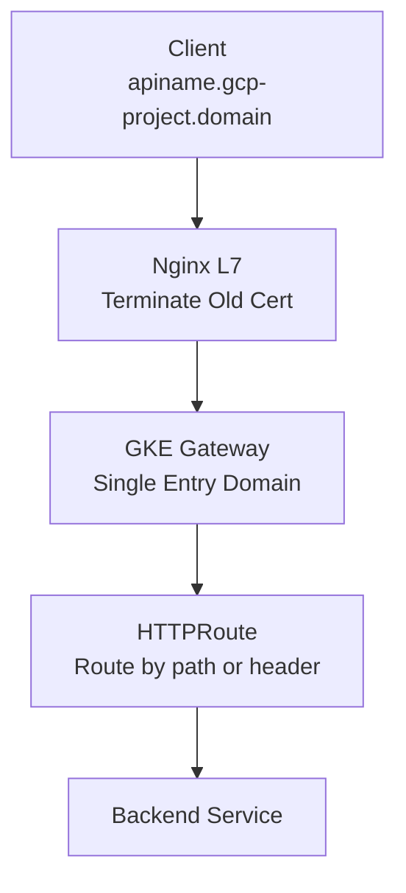
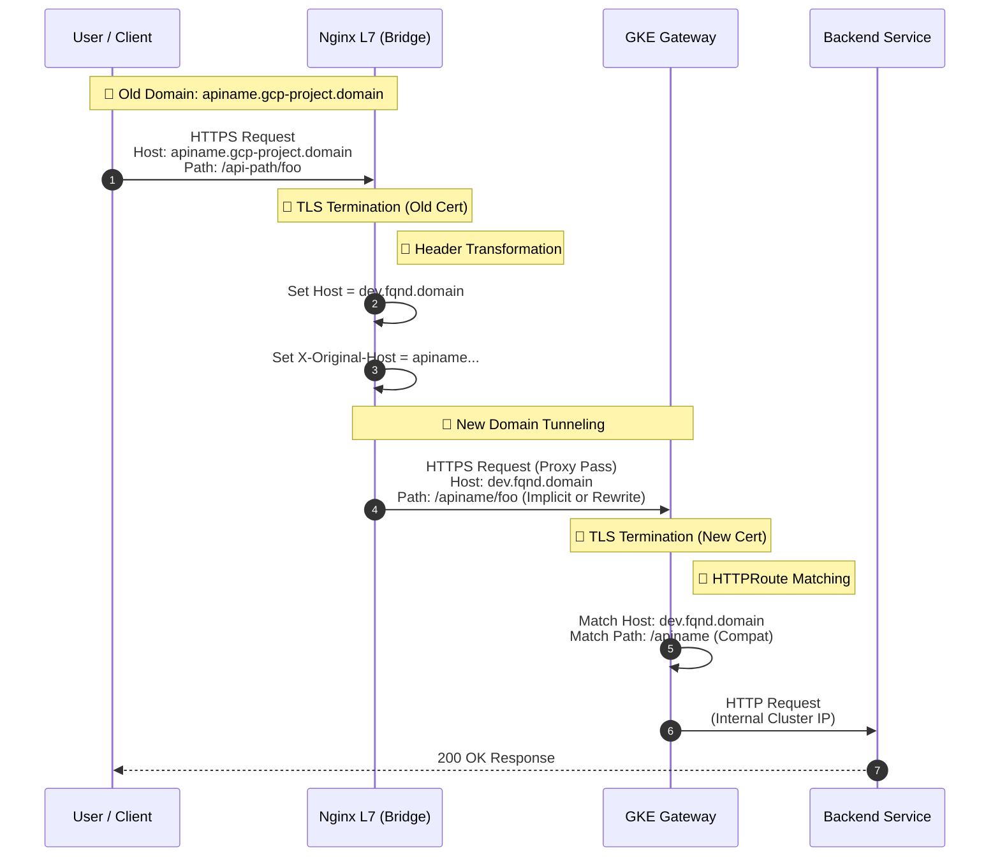
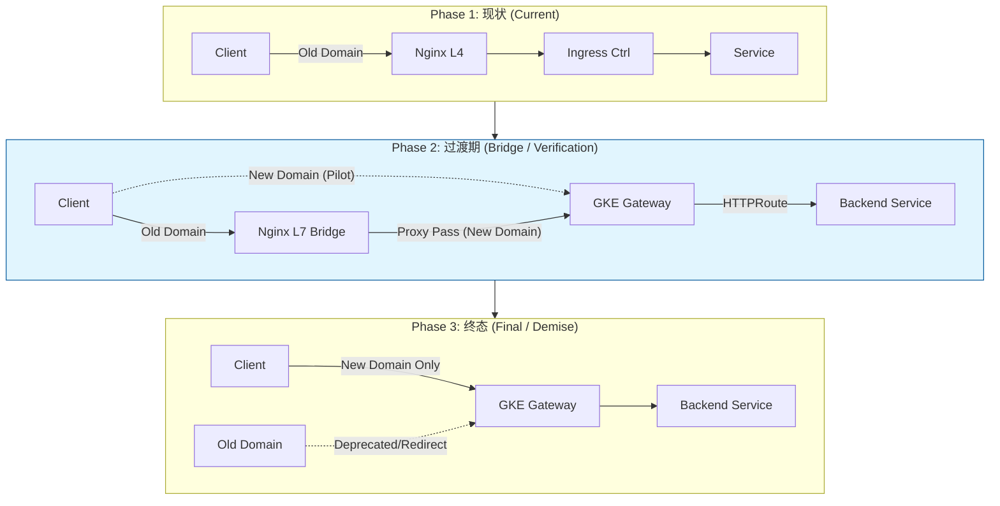
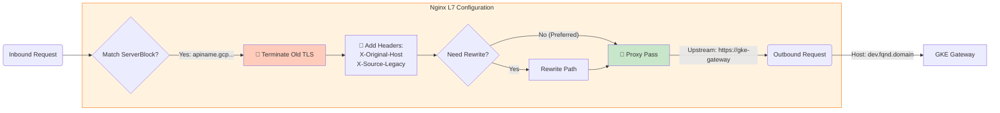

# my requirement
old flow
nginxL4 + ingress control+ svc deployment
https://apiname.gcp-project.domain/api-path/api-endpoints
https://apiname2.gcp-project.domain/api-path2/api-endpoints2


New flow
GKE  Gateway flow
nginxL7 + gateway + httproute healcheckPolicy backendpolicy
https://dev.fqnd.domain/apiname/api-endpoints ==> 自己证书 但是我这个域名下 其他的API都是通过location path 来区分的
https://dev.fqnd.domain/apiname2/api-endpoints2 ==> 跟上面一个证书

location /apiname {
    proxy_pass https://gke-gateway:8443;
    proxy_set_header Host dev.fqnd.domain;
    proxy_set_header X-Real-IP $remote_addr;
    proxy_set_header X-Forwarded-For $proxy_add_x_forwarded_for;
    proxy_set_header X-Forwarded-Proto $scheme;
    }

我现在想把很多个类似old flow 的 api 迁移到 new flow 中
那么我的new flow 已经在提供对应的服务. 那么我的nginxL7 的配置应该怎么写才能满足提供服务给old flow 的 api 呢 ?
apiname.gcp-project.domain -> 自己的独立https证书 -> https://apiname.gcp-project.domain/api-path/api-endpoints
apiname2.gcp-project.domain -> 自己的独立https证书 -> https://apiname2.gcp-project.domain/api-path2/api-endpoints2

或者我有哪些地方需要改动?
我的核心目的是从长久来看 需要Demise掉 nginxL4 + ingress control+ svc deployment 的架构 也就是不要old flow
但是我们的用户因为都是API想要更长久的保留上下游域名和API地址不改变.所以要把Old flow 的API地址映射到New flow中

基于我的这个核心目的帮我看一下我需要做哪些调整或者能不能实现还有哪些地方需要评估和考虑。 

# Chatgpt 

下面基于**你的核心目标**来系统性拆解，并给出**可落地的迁移方案**与**评估点**，重点放在 **Nginx L7 如何承接 old flow 域名与路径，同时转发到 new flow（GKE Gateway）**，最终 **彻底下线 nginxL4 + ingress**。

---

## **一、问题分析（核心矛盾）**

  

你的真实目标不是「怎么写 nginx 配置」，而是：

  

> **在不改变用户已有 API 域名 & URL 的前提下，将流量从 old flow 平滑迁移到 new flow，并最终 Demise old flow。**

  

核心约束条件：

| **维度**   | **约束**                                  |
| -------- | --------------------------------------- |
| 域名       | apiname.gcp-project.domain **必须保留**     |
| 路径       | /api-path/api-endpoints **必须保留**        |
| 证书       | 每个 old domain 有**独立证书**                 |
| new flow | 已统一到 https://dev.fqnd.domain/{apiname}  |
| 长期目标     | 不再维护 nginxL4 / ingress / svc deployment |

**结论先行：完全可实现，而且是标准的 API 平台迁移模式。**

---

## **二、总体迁移设计（推荐架构）**

  

### **目标架构**



**关键点**：

- **Nginx L7 作为“域名与路径适配层”**
    
- **GKE Gateway 作为唯一后端 API 平台入口**
    
- 用户 **域名、路径、证书全部不变**
    
- old flow 的 infra **可以完全下线**
    

---

## **三、Nginx L7 的核心职责（迁移期）**

  

Nginx L7 不再是业务网关，只做三件事：

1. **承载 old domain 的 TLS（证书不变）**
    
2. **路径重写 / 映射**
    
3. **统一转发到 GKE Gateway**
    

  

👉 这使 Nginx L7 成为 **Legacy Compatibility Layer**

---

## **四、Nginx L7 推荐配置方式**

  

### **1️⃣ old domain → new unified domain（路径映射）**

  

#### **场景 1：路径需重写**

```
server {
    listen 443 ssl;
    server_name apiname.gcp-project.domain;

    ssl_certificate     /etc/nginx/certs/apiname.crt;
    ssl_certificate_key /etc/nginx/certs/apiname.key;

    location /api-path/ {
        proxy_pass https://gke-gateway:8443/apiname/;
        
        proxy_set_header Host dev.fqnd.domain;
        proxy_set_header X-Original-Host $host;
        proxy_set_header X-Original-URI $request_uri;

        proxy_set_header X-Forwarded-For $proxy_add_x_forwarded_for;
        proxy_set_header X-Forwarded-Proto https;
    }
}
```

**效果映射**

|**用户请求**|**实际转发**|
|---|---|
|/api-path/api-endpoints|/apiname/api-endpoints|

---

### **2️⃣ 多 old domain 统一转发（推荐规模化方案）**

  

当 API 数量很多时，避免重复配置：

```
map $host $api_name {
    apiname.gcp-project.domain   apiname;
    apiname2.gcp-project.domain  apiname2;
}

server {
    listen 443 ssl;
    server_name *.gcp-project.domain;

    ssl_certificate     /etc/nginx/certs/wildcard.crt;
    ssl_certificate_key /etc/nginx/certs/wildcard.key;

    location / {
        proxy_pass https://gke-gateway:8443/$api_name/;
        proxy_set_header Host dev.fqnd.domain;
        proxy_set_header X-Original-Host $host;
    }
}
```

> ⚠️ 如果证书不是 wildcard，则仍需 per-domain server block（**证书是唯一没法抽象的**）

---

## **五、GKE Gateway / HTTPRoute 的配合设计**

  

### **推荐 HTTPRoute 方式（路径一致）**

```
apiVersion: gateway.networking.k8s.io/v1
kind: HTTPRoute
metadata:
  name: apiname
spec:
  parentRefs:
  - name: shared-gateway
  rules:
  - matches:
    - path:
        type: PathPrefix
        value: /apiname
    backendRefs:
    - name: apiname-svc
      port: 80
```

> Gateway **不需要感知 old domain**

> 所有 legacy domain 的复杂性 **止于 Nginx L7**

---

## **六、你需要调整 / 新增的点（Checklist）**

  

### **✅ 必须调整**

|**项**|**是否必须**|**说明**|
|---|---|---|
|Nginx L7|✅|承载 legacy domain|
|路径映射规则|✅|old → new|
|HTTPRoute|✅|按 new path 路由|
|BackendPolicy|✅|timeout / retry|
|HealthCheckPolicy|✅|每个 backend 独立|

---

### **⚠️ 强烈建议评估**

  

#### **1️⃣ Header 透传策略**

|**Header**|**用途**|
|---|---|
|X-Original-Host|方便 RT 判断来源|
|X-Original-URI|debug & audit|
|X-API-Version|未来版本治理|

---

#### **2️⃣ 重试 / 超时归属**

|**层级**|**建议**|
|---|---|
|Nginx L7|**不重试**|
|Gateway / BackendPolicy|**统一控制**|
|RT|只处理业务异常|

---

#### **3️⃣ 安全边界**

- mTLS / Client Auth：**放在 Gateway**
    
- Cloud Armor：**Gateway 前**
    
- legacy domain：**只做 TLS terminate**
    

---

## **七、长期演进路径（非常重要）**

  

### **Phase 1（现在）**

```
Client
 → old domain
 → Nginx L7
 → GKE Gateway
```

### **Phase 2（用户逐步迁移）**

```
Client
 → dev.fqnd.domain/apiname
 → GKE Gateway
```

### **Phase 3（最终）**

```
❌ nginxL4
❌ ingress controller
❌ svc deployment
❌ legacy domain
```

---

## **八、结论（回答你的核心问题）**

  

✔ **完全可以实现**

✔ **Nginx L7 是唯一需要承载 legacy 复杂度的组件**

✔ **GKE Gateway 可以保持干净、统一、标准化**

✔ **这是 API 平台长期可维护的唯一正确姿势**

  

如果你愿意，下一步我可以帮你做三件事之一：

1. 给你一套 **Nginx L7 标准化模板（支持上百 API）**
    
2. 帮你设计 **API 元数据 → 自动生成 Nginx & HTTPRoute**
    
3. 评估 **是否可以直接用 GCLB + Gateway 替代 Nginx L7**
    

  

你可以直接选一个继续。
# Antigravity Analysis

## 补充评估与建议

ChatGPT 的方案总体是非常标准且可行的“绞杀者模式”（Strangler Fig Pattern）迁移策略。在此基础上，我补充几个关键的工程细节和潜在风险点，帮助你更稳健地落地。

### 1. DNS 切割与流量平滑迁移 (Traffic Cutover)

分析中提到了架构变更，但**DNS 如何平滑切换**是落地的关键第一步。
由于 `apiname.gcp-project.domain` 目前指向 Old Flow (Nginx L4 IP)，你需要将其指向 New Flow (Nginx L7 IP)。

*   **风险**: 直接修改 DNS A 记录会有 TTL 延迟，导致在 TTL 过期前部分流量仍去旧设施，部分流量去新设施。
*   **建议**: 
    1.  **降低 TTL**: 在正式迁移前 24 小时，将旧域名的 DNS TTL 调低（如 60s），以便快速回滚或生效。
    2.  **灰度验证**: 在切 DNS 前，先修改测试机的 `/etc/hosts`，强制将 `apiname.gcp-project.domain` 指向 New Nginx L7 的 IP，验证全链路（证书、路径转发、后端响应）是否正常。

### 2. Nginx L7 的 SNI 多租户配置细节

既然你有“多个”类似 Old Flow 的 API，且每个都有独立证书，你的 New Nginx L7 必须配置为支持 **SNI (Server Name Indication)**。

*   **配置要点**: 确保每个 `server` 块准确匹配 `server_name`，并且分别加载各自的 `ssl_certificate`。
*   **证书管理**: 
    *   以前在 Ingress 可能有 cert-manager 自动管理。
    *   迁移到 Nginx L7 后，如果这个 Nginx 是手动维护的 (如 VM 上的 Nginx)，你需要一套机制把证书分发过去。
    *   如果是部署在 K8S 中的 Nginx (Deployment)，依然可以挂载 Secret 或使用 cert-manager。确保旧域名的证书能自动续期是长期维护的关键。

### 3. `proxy_pass` 的目标地址解析与证书信任

配置中 `proxy_pass https://gke-gateway:8443;` 涉及 Nginx 如何找到 GKE Gateway。

*   **地址解析**:
    *   **K8S 内部**: 如果 Nginx L7 也在 K8S 集群内，可以使用 Gateway Service 的 FQDN (e.g., `https://gateway-svc.namespace.svc.cluster.local:443`)。
    *   **跨集群/外部**: 如果 Nginx L7 在集群外 (e.g., GCE)，需要指向 Gateway 的 Internal LoadBalancer IP (ILB)。
*   **上游证书验证**: 
    *   Nginx L7 访问 GKE Gateway 时是 HTTPS 请求。
    *   如果 GKE Gateway 使用的是自签名证书或集群内部 CA 签发的证书，Nginx L7 需要配置 `proxy_ssl_trusted_certificate` 来信任该 CA，或者在非生产环境（不推荐）使用 `proxy_ssl_verify off;`。
    *   **Host Header**: 必须严格通过 `proxy_set_header Host dev.fqnd.domain;` 强制覆盖 Host，否则 GKE Gateway 无法匹配到正确的 HTTPRoute。

### 4. 路径 (Path) 处理的策略选择

原有 URL: `.../api-path/api-endpoints`
新 URL: `.../apiname/api-endpoints`

如果是 **一对一映射**（且路径前缀不同），你有两个选择：

**选项 A: 在 Nginx 层做 Rewrite (ChatGPT 方案)**
```nginx
location /api-path/ {
    rewrite ^/api-path/(.*)$ /apiname/$1 break;
    proxy_pass https://gke-gateway;
    ...
}
```
*   优点: GKE Gateway 保持干净，只认标准的新路径。
*   缺点: Nginx 配置会变复杂，包含了业务逻辑（路径映射关系）。

**选项 B: 在 GKE Gateway 层做兼容 (推荐评估)**
在 HTTPRoute 中同时监听新旧两个路径：
```yaml
rules:
  - matches:
    - path:
        type: PathPrefix
        value: /apiname   # 新路径
    - path:
        type: PathPrefix
        value: /api-path  # 旧路径 (为了兼容)
    backendRefs:
    ...
```
*   优点: Nginx 只做透传 (Transparent Proxy)，不用维护 rewrite 规则，逻辑内聚在 K8S Gateway API 对象中。
*   缺点: 如果 `/api-path` 和 `/apiname` 冲突则不可用。

### 5. 可观测性与流量区分

为了日后能放心地 Demise Old Flow 的相关资源，或者分析用户迁移进度：

*   **标记流量**: 在 Nginx L7 添加 Header，例如 `proxy_set_header X-Source-Channel legacy-domain;`。
*   **监控区分**: 在后端或 Gateway 的 Metrics 中，可以通过这个 Header 区分流量来源。
    *   `host="dev.fqnd.domain"` 且没有特殊 Header -> 新用户流量。
    *   `host="dev.fqnd.domain"` 且有 `X-Original-Host` -> 兼容流量。

### 6. 总结建议

你的架构核心目的是 **"Keep IPs/Domains constant for clients, but modernize the backend"**。

建议采用 **选项 B (Gateway 兼容路径)** + **Nginx 透传** 的组合，这样 Nginx L7 的配置可以模板化，极其简单：

```nginx
# 通用模板
server {
    server_name apiname.gcp-project.domain;
    # SSL 配置 ...
    
    location / {
        # 不做 rewrite，直接转发，依靠 Gateway 的多路经匹配
        proxy_pass https://gke-gateway-address;
        proxy_set_header Host dev.fqnd.domain; # 伪装成新域名
        proxy_set_header X-Original-Host $host; # 保留案底
    }
}
```

这样，你的 Nginx L7 真正变成了一个纯粹的 **"TLS Offloading + Header Adapting"** 层，不包含复杂的业务重写逻辑，更易于维护。

## 九、架构可视化 (Architecture Visualization)

为了方便向团队阐述，以下提供核心流程图与架构演进图，帮助理解流量如何在 "Old Flow" 和 "New Flow" 之间桥接。

### 1. 核心请求流转时序图 (Request Lifecycle Sequence)

此图清晰地展示了 **Nginx L7** 如何作为中间层 (Bridge)，在不修改客户端行为的前提下，将流量“伪装”并转发给 **GKE Gateway**。请注意 `Host` Header 的变化。



### 2. 架构演进三阶段 (Architecture Evolution Phases)



### 3. Nginx L7 内部处理逻辑 (The Bridge Logic)

如果需要向运维同事解释 Nginx L7 到底做了什么，可以用这张图：


