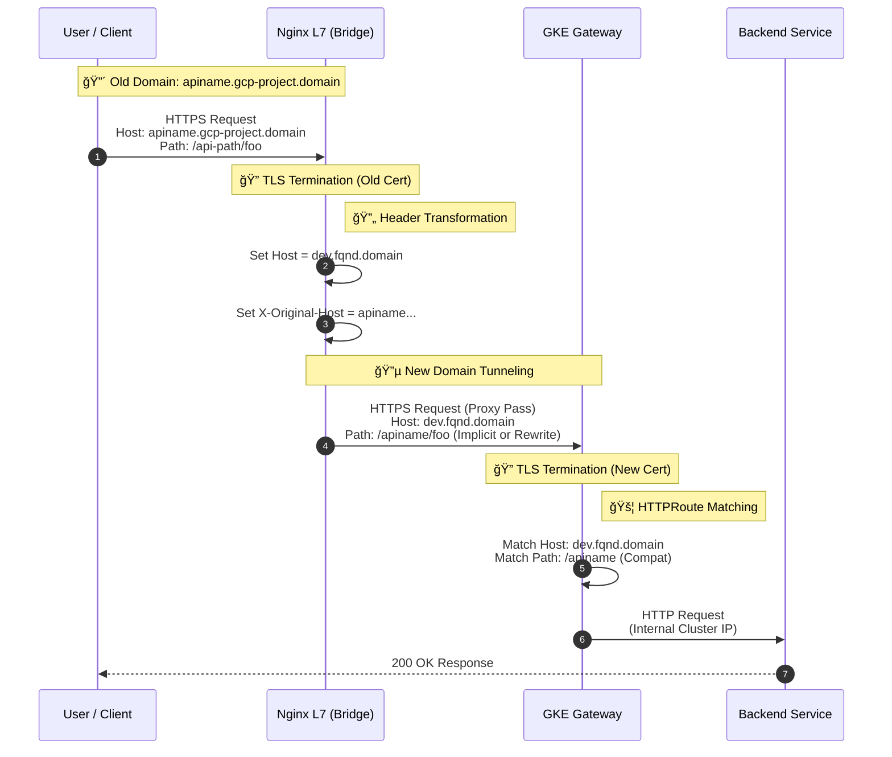
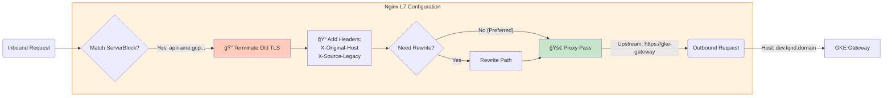

# my requirement
old flow
nginxL4 + ingress control+ svc deployment
https://apiname.gcp-project.domain/api-path/api-endpoints
https://apiname2.gcp-project.domain/api-path2/api-endpoints2


New flow
GKE  Gateway flow
nginxL7 + gateway + httproute healcheckPolicy backendpolicy
https://dev.fqnd.domain/apiname/api-endpoints ==> 自己è¯ä¹¦ 但是我这个域å下 其他的API都是通过location path æ¥åŒºåˆ†çš„
https://dev.fqnd.domain/apiname2/api-endpoints2 ==> 跟上é¢ä¸€ä¸ªè¯ä¹¦

location /apiname {
    proxy_pass https://gke-gateway:8443;
    proxy_set_header Host dev.fqnd.domain;
    proxy_set_header X-Real-IP $remote_addr;
    proxy_set_header X-Forwarded-For $proxy_add_x_forwarded_for;
    proxy_set_header X-Forwarded-Proto $scheme;
    }

我ç°åœ¨æƒ³æŠŠå¾ˆå¤šä¸ªç±»ä¼¼old flow çš„ api è¿ç§»åˆ° new flow 中
那么我的new flow å·²ç»åœ¨æ供对应的æœåŠ¡. 那么我的nginxL7 çš„é…置应该æ€ä¹ˆå†™æ‰èƒ½æ»¡è¶³æä¾›æœåŠ¡ç»™old flow çš„ api å‘¢ ?
apiname.gcp-project.domain -> 自己的独立httpsè¯ä¹¦ -> https://apiname.gcp-project.domain/api-path/api-endpoints
apiname2.gcp-project.domain -> 自己的独立httpsè¯ä¹¦ -> https://apiname2.gcp-project.domain/api-path2/api-endpoints2

或者我有哪些地方需è¦æ”¹åŠ¨?
我的核心目的是ä»é•¿ä¹…æ¥çœ‹ 需è¦Demiseæ‰ nginxL4 + ingress control+ svc deployment çš„æ¶æ„ 也就是ä¸è¦old flow
但是我们的用户因为都是API想è¦æ›´é•¿ä¹…çš„ä¿ç•™ä¸Šä¸‹æ¸¸åŸŸåå’ŒAPI地å€ä¸æ”¹å˜.所以è¦æŠŠOld flow çš„API地å€æ˜ å°„到New flow中

基äºæˆ‘的这个核心目的帮我看一下我需è¦åšå“ªäº›è°ƒæ•´æˆ–者能ä¸èƒ½å®ç°è¿˜æœ‰å“ªäº›åœ°æ–¹éœ€è¦è¯„估和考虑。 

# Chatgpt 

下é¢åŸºäº**你的核心目标**æ¥ç³»ç»Ÿæ€§æ‹†è§£ï¼Œå¹¶ç»™å‡º**å¯è½åœ°çš„è¿ç§»æ–¹æ¡ˆ**ä¸**评估点**，é‡ç‚¹æ”¾åœ¨ **Nginx L7 å¦‚ä½•æ‰¿æ¥ old flow 域åä¸è·¯å¾„，åŒæ—¶è½¬å‘到 new flow（GKE Gateway）**，最终 **彻底下线 nginxL4 + ingress**。

---

## **一ã€é—®é¢˜åˆ†æ（核心矛盾）**

  

你的真å®ç›®æ ‡ä¸æ˜¯ã€Œæ€ä¹ˆå†™ nginx é…ç½®ã€ï¼Œè€Œæ˜¯ï¼š

  

> **在ä¸æ”¹å˜ç”¨æˆ·å·²æœ‰ API 域å & URL çš„å‰æ下，将æµé‡ä» old flow 平滑è¿ç§»åˆ° new flow，并最终 Demise old flow。**

  

核心约æŸæ¡ä»¶ï¼š

| **维度**   | **约æŸ**                                  |
| -------- | --------------------------------------- |
| åŸŸå       | apiname.gcp-project.domain **å¿…é¡»ä¿ç•™**     |
| 路径       | /api-path/api-endpoints **å¿…é¡»ä¿ç•™**        |
| è¯ä¹¦       | æ¯ä¸ª old domain 有**独立è¯ä¹¦**                 |
| new flow | 已统一到 https://dev.fqnd.domain/{apiname}  |
| 长期目标     | ä¸å†ç»´æŠ¤ nginxL4 / ingress / svc deployment |

**结论先行：完全å¯å®ç°ï¼Œè€Œä¸”是标准的 API å¹³å°è¿ç§»æ¨¡å¼ã€‚**

---

## **二ã€æ€»ä½“è¿ç§»è®¾è®¡ï¼ˆæ¨èæ¶æ„）**

  

### **目标æ¶æ„**


**关键点**：

- **Nginx L7 作为“域åä¸è·¯å¾„适é…层â€**
    
- **GKE Gateway 作为唯一å端 API å¹³å°å…¥å£**
    
- 用户 **域åã€è·¯å¾„ã€è¯ä¹¦å…¨éƒ¨ä¸å˜**
    
- old flow çš„ infra **å¯ä»¥å®Œå…¨ä¸‹çº¿**
    

---

## **三ã€Nginx L7 的核心èŒè´£ï¼ˆè¿ç§»æœŸï¼‰**

  

Nginx L7 ä¸å†æ˜¯ä¸šåŠ¡ç½‘关，åªåšä¸‰ä»¶äº‹ï¼š

1. **承载 old domain çš„ TLS（è¯ä¹¦ä¸å˜ï¼‰**
    
2. **路径é‡å†™ / 映射**
    
3. **统一转å‘到 GKE Gateway**
    

  

👉 这使 Nginx L7 æˆä¸º **Legacy Compatibility Layer**

---

## **å››ã€Nginx L7 æ¨èé…置方å¼**

  

### **1ï¸âƒ£ old domain → new unified domain（路径映射）**

  

#### **场景 1：路径需é‡å†™**

```
server {
    listen 443 ssl;
    server_name apiname.gcp-project.domain;

    ssl_certificate     /etc/nginx/certs/apiname.crt;
    ssl_certificate_key /etc/nginx/certs/apiname.key;

    location /api-path/ {
        proxy_pass https://gke-gateway:8443/apiname/;
        
        proxy_set_header Host dev.fqnd.domain;
        proxy_set_header X-Original-Host $host;
        proxy_set_header X-Original-URI $request_uri;

        proxy_set_header X-Forwarded-For $proxy_add_x_forwarded_for;
        proxy_set_header X-Forwarded-Proto https;
    }
}
```

**效æœæ˜ å°„**

|**用户请求**|**å®é™…转å‘**|
|---|---|
|/api-path/api-endpoints|/apiname/api-endpoints|

---

### **2ï¸âƒ£ 多 old domain 统一转å‘（æ¨è规模化方案）**

  

当 API æ•°é‡å¾ˆå¤šæ—¶ï¼Œé¿å…é‡å¤é…置：

```
map $host $api_name {
    apiname.gcp-project.domain   apiname;
    apiname2.gcp-project.domain  apiname2;
}

server {
    listen 443 ssl;
    server_name *.gcp-project.domain;

    ssl_certificate     /etc/nginx/certs/wildcard.crt;
    ssl_certificate_key /etc/nginx/certs/wildcard.key;

    location / {
        proxy_pass https://gke-gateway:8443/$api_name/;
        proxy_set_header Host dev.fqnd.domain;
        proxy_set_header X-Original-Host $host;
    }
}
```

> âš ï¸ å¦‚æœè¯ä¹¦ä¸æ˜¯ wildcard，则ä»éœ€ per-domain server block（**è¯ä¹¦æ˜¯å”¯ä¸€æ²¡æ³•æŠ½è±¡çš„**）

---

## **五ã€GKE Gateway / HTTPRoute çš„é…åˆè®¾è®¡**

  

### **æ¨è HTTPRoute æ–¹å¼ï¼ˆè·¯å¾„一致）**

```
apiVersion: gateway.networking.k8s.io/v1
kind: HTTPRoute
metadata:
  name: apiname
spec:
  parentRefs:
  - name: shared-gateway
  rules:
  - matches:
    - path:
        type: PathPrefix
        value: /apiname
    backendRefs:
    - name: apiname-svc
      port: 80
```

> Gateway **ä¸éœ€è¦æ„ŸçŸ¥ old domain**

> 所有 legacy domain çš„å¤æ‚性 **æ­¢äº Nginx L7**

---

## **å…­ã€ä½ éœ€è¦è°ƒæ•´ / æ–°å¢çš„点（Checklist）**

  

### **✅ 必须调整**

|**项**|**是å¦å¿…é¡»**|**说æ˜**|
|---|---|---|
|Nginx L7|✅|承载 legacy domain|
|路径映射规则|✅|old → new|
|HTTPRoute|✅|按 new path 路由|
|BackendPolicy|✅|timeout / retry|
|HealthCheckPolicy|✅|æ¯ä¸ª backend 独立|

---

### **âš ï¸ å¼ºçƒˆå»ºè®®è¯„ä¼°**

  

#### **1ï¸âƒ£ Header é€ä¼ ç­–ç•¥**

|**Header**|**用途**|
|---|---|
|X-Original-Host|方便 RT 判断æ¥æº|
|X-Original-URI|debug & audit|
|X-API-Version|未æ¥ç‰ˆæœ¬æ²»ç†|

---

#### **2ï¸âƒ£ é‡è¯• / 超时归å±**

|**层级**|**建议**|
|---|---|
|Nginx L7|**ä¸é‡è¯•**|
|Gateway / BackendPolicy|**统一æ§åˆ¶**|
|RT|åªå¤„ç†ä¸šåŠ¡å¼‚常|

---

#### **3ï¸âƒ£ 安全边界**

- mTLS / Client Auth：**放在 Gateway**
    
- Cloud Armor：**Gateway å‰**
    
- legacy domain：**åªåš TLS terminate**
    

---

## **七ã€é•¿æœŸæ¼”进路径（é常é‡è¦ï¼‰**

  

### **Phase 1（ç°åœ¨ï¼‰**

```
Client
 → old domain
 → Nginx L7
 → GKE Gateway
```

### **Phase 2（用户é€æ­¥è¿ç§»ï¼‰**

```
Client
 → dev.fqnd.domain/apiname
 → GKE Gateway
```

### **Phase 3（最终）**

```
⌠nginxL4
⌠ingress controller
⌠svc deployment
⌠legacy domain
```

---

## **å…«ã€ç»“论（å›ç­”你的核心问题）**

  

✔ **完全å¯ä»¥å®ç°**

✔ **Nginx L7 是唯一需è¦æ‰¿è½½ legacy å¤æ‚度的组件**

✔ **GKE Gateway å¯ä»¥ä¿æŒå¹²å‡€ã€ç»Ÿä¸€ã€æ ‡å‡†åŒ–**

✔ **这是 API å¹³å°é•¿æœŸå¯ç»´æŠ¤çš„唯一正确姿势**

  

如æœä½ æ„¿æ„，下一步我å¯ä»¥å¸®ä½ åšä¸‰ä»¶äº‹ä¹‹ä¸€ï¼š

1. 给你一套 **Nginx L7 标准化模æ¿ï¼ˆæ”¯æŒä¸Šç™¾ API）**
    
2. 帮你设计 **API å…ƒæ•°æ® â†’ è‡ªåŠ¨ç”Ÿæˆ Nginx & HTTPRoute**
    
3. 评估 **是å¦å¯ä»¥ç›´æ¥ç”¨ GCLB + Gateway 替代 Nginx L7**
    

  

ä½ å¯ä»¥ç›´æ¥é€‰ä¸€ä¸ªç»§ç»­ã€‚
# Antigravity Analysis

## 补充评估ä¸å»ºè®®

ChatGPT 的方案总体是é常标准且å¯è¡Œçš„“ç»æ€è€…模å¼â€ï¼ˆStrangler Fig Pattern）è¿ç§»ç­–略。在此基础上，我补充几个关键的工程细节和潜在é£é™©ç‚¹ï¼Œå¸®åŠ©ä½ æ›´ç¨³å¥åœ°è½åœ°ã€‚

### 1. DNS 切割ä¸æµé‡å¹³æ»‘è¿ç§» (Traffic Cutover)

分æ中æ到了æ¶æ„å˜æ›´ï¼Œä½†**DNS 如何平滑切æ¢**是è½åœ°çš„关键第一步。
ç”±äº `apiname.gcp-project.domain` ç›®å‰æŒ‡å‘ Old Flow (Nginx L4 IP)，你需è¦å°†å…¶æŒ‡å‘ New Flow (Nginx L7 IP)。

*   **é£é™©**: ç›´æ¥ä¿®æ”¹ DNS A 记录会有 TTL 延迟，导致在 TTL 过期å‰éƒ¨åˆ†æµé‡ä»å»æ—§è®¾æ–½ï¼Œéƒ¨åˆ†æµé‡å»æ–°è®¾æ–½ã€‚
*   **建议**: 
    1.  **é™ä½ TTL**: 在正å¼è¿ç§»å‰ 24 å°æ—¶ï¼Œå°†æ—§åŸŸåçš„ DNS TTL è°ƒä½ï¼ˆå¦‚ 60s），以便快速å›æ»šæˆ–生效。
    2.  **ç°åº¦éªŒè¯**: 在切 DNS å‰ï¼Œå…ˆä¿®æ”¹æµ‹è¯•æœºçš„ `/etc/hosts`，强制将 `apiname.gcp-project.domain` æŒ‡å‘ New Nginx L7 çš„ IP，验è¯å…¨é“¾è·¯ï¼ˆè¯ä¹¦ã€è·¯å¾„转å‘ã€å端å“应）是å¦æ­£å¸¸ã€‚

### 2. Nginx L7 çš„ SNI 多租户é…置细节

既然你有“多个â€ç±»ä¼¼ Old Flow çš„ API，且æ¯ä¸ªéƒ½æœ‰ç‹¬ç«‹è¯ä¹¦ï¼Œä½ çš„ New Nginx L7 å¿…é¡»é…ç½®ä¸ºæ”¯æŒ **SNI (Server Name Indication)**。

*   **é…ç½®è¦ç‚¹**: ç¡®ä¿æ¯ä¸ª `server` å—å‡†ç¡®åŒ¹é… `server_name`，并且分别加载å„自的 `ssl_certificate`。
*   **è¯ä¹¦ç®¡ç†**: 
    *   以å‰åœ¨ Ingress å¯èƒ½æœ‰ cert-manager 自动管ç†ã€‚
    *   è¿ç§»åˆ° Nginx L7 å，如æœè¿™ä¸ª Nginx 是手动维护的 (如 VM 上的 Nginx)，你需è¦ä¸€å¥—机制把è¯ä¹¦åˆ†å‘过å»ã€‚
    *   如æœæ˜¯éƒ¨ç½²åœ¨ K8S 中的 Nginx (Deployment)，ä¾ç„¶å¯ä»¥æŒ‚è½½ Secret 或使用 cert-manager。确ä¿æ—§åŸŸåçš„è¯ä¹¦èƒ½è‡ªåŠ¨ç»­æœŸæ˜¯é•¿æœŸç»´æŠ¤çš„关键。

### 3. `proxy_pass` 的目标地å€è§£æä¸è¯ä¹¦ä¿¡ä»»

é…置中 `proxy_pass https://gke-gateway:8443;` æ¶‰åŠ Nginx 如何找到 GKE Gateway。

*   **地å€è§£æ**:
    *   **K8S 内部**: å¦‚æœ Nginx L7 也在 K8S 集群内，å¯ä»¥ä½¿ç”¨ Gateway Service çš„ FQDN (e.g., `https://gateway-svc.namespace.svc.cluster.local:443`)。
    *   **跨集群/外部**: å¦‚æœ Nginx L7 在集群外 (e.g., GCE)，需è¦æŒ‡å‘ Gateway çš„ Internal LoadBalancer IP (ILB)。
*   **上游è¯ä¹¦éªŒè¯**: 
    *   Nginx L7 访问 GKE Gateway 时是 HTTPS 请求。
    *   å¦‚æœ GKE Gateway 使用的是自签åè¯ä¹¦æˆ–集群内部 CA ç­¾å‘çš„è¯ä¹¦ï¼ŒNginx L7 需è¦é…ç½® `proxy_ssl_trusted_certificate` æ¥ä¿¡ä»»è¯¥ CA，或者在é生产ç¯å¢ƒï¼ˆä¸æ¨è）使用 `proxy_ssl_verify off;`。
    *   **Host Header**: 必须严格通过 `proxy_set_header Host dev.fqnd.domain;` 强制覆盖 Host，å¦åˆ™ GKE Gateway 无法匹é…到正确的 HTTPRoute。

### 4. 路径 (Path) 处ç†çš„策略选择

åŸæœ‰ URL: `.../api-path/api-endpoints`
æ–° URL: `.../apiname/api-endpoints`

如æœæ˜¯ **一对一映射**（且路径å‰ç¼€ä¸åŒï¼‰ï¼Œä½ æœ‰ä¸¤ä¸ªé€‰æ‹©ï¼š

**选项 A: 在 Nginx å±‚åš Rewrite (ChatGPT 方案)**
```nginx
location /api-path/ {
    rewrite ^/api-path/(.*)$ /apiname/$1 break;
    proxy_pass https://gke-gateway;
    ...
}
```
*   优点: GKE Gateway ä¿æŒå¹²å‡€ï¼Œåªè®¤æ ‡å‡†çš„新路径。
*   缺点: Nginx é…置会å˜å¤æ‚，包å«äº†ä¸šåŠ¡é€»è¾‘（路径映射关系）。

**选项 B: 在 GKE Gateway 层åšå…¼å®¹ (æ¨è评估)**
在 HTTPRoute 中åŒæ—¶ç›‘å¬æ–°æ—§ä¸¤ä¸ªè·¯å¾„：
```yaml
rules:
  - matches:
    - path:
        type: PathPrefix
        value: /apiname   # 新路径
    - path:
        type: PathPrefix
        value: /api-path  # 旧路径 (为了兼容)
    backendRefs:
    ...
```
*   优点: Nginx åªåšé€ä¼  (Transparent Proxy)，ä¸ç”¨ç»´æŠ¤ rewrite 规则，逻辑内èšåœ¨ K8S Gateway API 对象中。
*   缺点: å¦‚æœ `/api-path` å’Œ `/apiname` 冲çªåˆ™ä¸å¯ç”¨ã€‚

### 5. å¯è§‚测性ä¸æµé‡åŒºåˆ†

为了日å能放心地 Demise Old Flow 的相关资æºï¼Œæˆ–者分æ用户è¿ç§»è¿›åº¦ï¼š

*   **标记æµé‡**: 在 Nginx L7 添加 Header，例如 `proxy_set_header X-Source-Channel legacy-domain;`。
*   **监æ§åŒºåˆ†**: 在å端或 Gateway çš„ Metrics 中，å¯ä»¥é€šè¿‡è¿™ä¸ª Header 区分æµé‡æ¥æºã€‚
    *   `host="dev.fqnd.domain"` 且没有特殊 Header -> 新用户æµé‡ã€‚
    *   `host="dev.fqnd.domain"` 且有 `X-Original-Host` -> 兼容æµé‡ã€‚

### 6. 总结建议

ä½ çš„æ¶æ„核心目的是 **"Keep IPs/Domains constant for clients, but modernize the backend"**。

建议采用 **选项 B (Gateway 兼容路径)** + **Nginx é€ä¼ ** 的组åˆï¼Œè¿™æ · Nginx L7 çš„é…ç½®å¯ä»¥æ¨¡æ¿åŒ–，æ其简å•ï¼š

```nginx
# 通用模æ¿
server {
    server_name apiname.gcp-project.domain;
    # SSL é…ç½® ...
    
    location / {
        # ä¸åš rewrite，直æ¥è½¬å‘，ä¾é  Gateway 的多路ç»åŒ¹é…
        proxy_pass https://gke-gateway-address;
        proxy_set_header Host dev.fqnd.domain; # 伪装æˆæ–°åŸŸå
        proxy_set_header X-Original-Host $host; # ä¿ç•™æ¡ˆåº•
    }
}
```

这样，你的 Nginx L7 真正å˜æˆäº†ä¸€ä¸ªçº¯ç²¹çš„ **"TLS Offloading + Header Adapting"** 层，ä¸åŒ…å«å¤æ‚的业务é‡å†™é€»è¾‘，更易äºç»´æŠ¤ã€‚

## ä¹ã€æ¶æ„å¯è§†åŒ– (Architecture Visualization)

为了方便å‘团队é˜è¿°ï¼Œä»¥ä¸‹æ供核心æµç¨‹å›¾ä¸æ¶æ„演进图，帮助ç†è§£æµé‡å¦‚何在 "Old Flow" å’Œ "New Flow" 之间桥æ¥ã€‚

### 1. 核心请求æµè½¬æ—¶åºå›¾ (Request Lifecycle Sequence)

此图清晰地展示了 **Nginx L7** 如何作为中间层 (Bridge)，在ä¸ä¿®æ”¹å®¢æˆ·ç«¯è¡Œä¸ºçš„å‰æ下，将æµé‡â€œä¼ªè£…â€å¹¶è½¬å‘ç»™ **GKE Gateway**ã€‚è¯·æ³¨æ„ `Host` Header çš„å˜åŒ–。



### 2. æ¶æ„演进三阶段 (Architecture Evolution Phases)


### 3. Nginx L7 内部处ç†é€»è¾‘ (The Bridge Logic)

如æœéœ€è¦å‘è¿ç»´åŒäº‹è§£é‡Š Nginx L7 到底åšäº†ä»€ä¹ˆï¼Œå¯ä»¥ç”¨è¿™å¼ å›¾ï¼š


