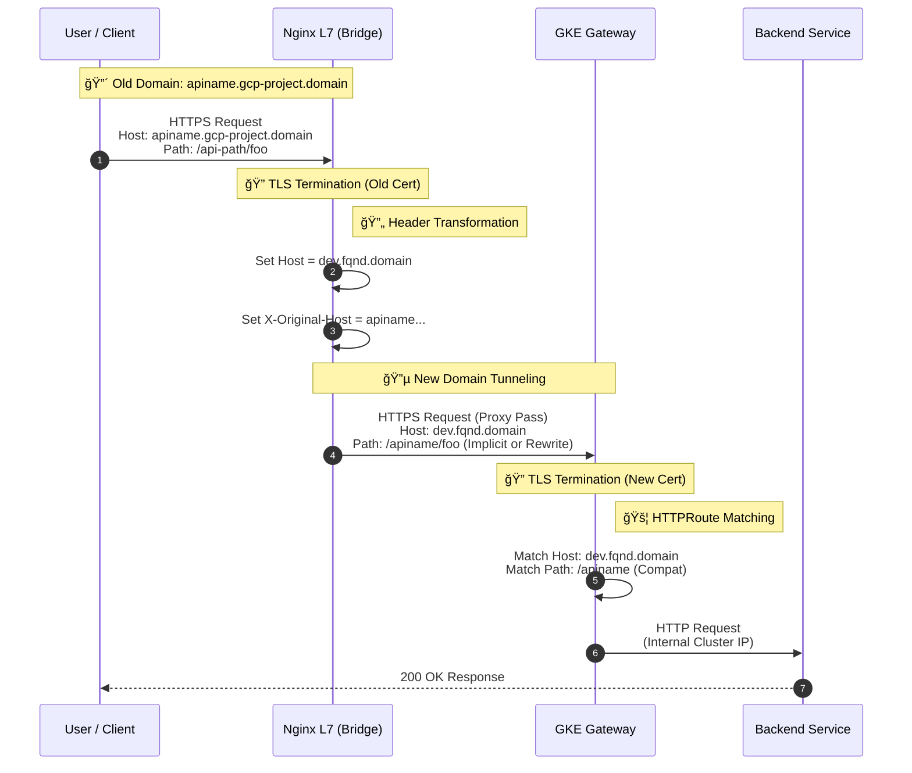
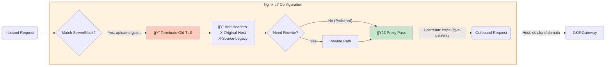

- [my requirement](#my-requirement)
  - [old flow](#old-flow)
  - [New flow](#new-flow)
- [Summary and analysis  block](#summary-and-analysis--block)
- [Chatgpt](#chatgpt)
  - [**一ã€é—®é¢˜åˆ†æ（核心矛盾）**](#一问题分æ核心矛盾)
  - [**二ã€æ€»ä½“è¿ç§»è®¾è®¡ï¼ˆæ¨èæ¶æ„）**](#二总体è¿ç§»è®¾è®¡æ¨èæ¶æ„)
    - [**目标æ¶æ„**](#目标æ¶æ„)
  - [**三ã€Nginx L7 的核心èŒè´£ï¼ˆè¿ç§»æœŸï¼‰**](#三nginx-l7-的核心èŒè´£è¿ç§»æœŸ)
  - [**å››ã€Nginx L7 æ¨èé…置方å¼**](#å››nginx-l7-æ¨èé…置方å¼)
    - [**1ï¸âƒ£ old domain → new unified domain（路径映射）**](#1ï¸âƒ£-old-domain--new-unified-domain路径映射)
      - [**场景 1：路径需é‡å†™**](#场景-1路径需é‡å†™)
    - [**2ï¸âƒ£ 多 old domain 统一转å‘（æ¨è规模化方案）**](#2ï¸âƒ£-多-old-domain-统一转å‘æ¨è规模化方案)
  - [**五ã€GKE Gateway / HTTPRoute çš„é…åˆè®¾è®¡**](#五gke-gateway--httproute-çš„é…åˆè®¾è®¡)
    - [**æ¨è HTTPRoute æ–¹å¼ï¼ˆè·¯å¾„一致）**](#æ¨è-httproute-æ–¹å¼è·¯å¾„一致)
  - [**å…­ã€ä½ éœ€è¦è°ƒæ•´ / æ–°å¢çš„点（Checklist）**](#六你需è¦è°ƒæ•´--æ–°å¢çš„点checklist)
    - [**✅ 必须调整**](#-必须调整)
    - [**âš ï¸ å¼ºçƒˆå»ºè®®è¯„ä¼°**](#ï¸-强烈建议评估)
      - [**1ï¸âƒ£ Header é€ä¼ ç­–ç•¥**](#1ï¸âƒ£-header-é€ä¼ ç­–ç•¥)
      - [**2ï¸âƒ£ é‡è¯• / 超时归å±**](#2ï¸âƒ£-é‡è¯•--超时归å±)
      - [**3ï¸âƒ£ 安全边界**](#3ï¸âƒ£-安全边界)
  - [**七ã€é•¿æœŸæ¼”进路径（é常é‡è¦ï¼‰**](#七长期演进路径é常é‡è¦)
    - [**Phase 1（ç°åœ¨ï¼‰**](#phase-1ç°åœ¨)
    - [**Phase 2（用户é€æ­¥è¿ç§»ï¼‰**](#phase-2用户é€æ­¥è¿ç§»)
    - [**Phase 3（最终）**](#phase-3最终)
  - [**å…«ã€ç»“论（å›ç­”你的核心问题）**](#八结论å›ç­”你的核心问题)
- [Antigravity Analysis](#antigravity-analysis)
  - [补充评估ä¸å»ºè®®](#补充评估ä¸å»ºè®®)
    - [1. DNS 切割ä¸æµé‡å¹³æ»‘è¿ç§» (Traffic Cutover)](#1-dns-切割ä¸æµé‡å¹³æ»‘è¿ç§»-traffic-cutover)
    - [2. Nginx L7 çš„ SNI 多租户é…置细节](#2-nginx-l7-çš„-sni-多租户é…置细节)
    - [3. `proxy_pass` 的目标地å€è§£æä¸è¯ä¹¦ä¿¡ä»»](#3-proxy_pass-的目标地å€è§£æä¸è¯ä¹¦ä¿¡ä»»)
    - [4. 路径 (Path) 处ç†çš„策略选择](#4-路径-path-处ç†çš„策略选择)
    - [5. å¯è§‚测性ä¸æµé‡åŒºåˆ†](#5-å¯è§‚测性ä¸æµé‡åŒºåˆ†)
    - [6. 总结建议](#6-总结建议)
  - [ä¹ã€æ¶æ„å¯è§†åŒ– (Architecture Visualization)](#ä¹æ¶æ„å¯è§†åŒ–-architecture-visualization)
    - [1. 核心请求æµè½¬æ—¶åºå›¾ (Request Lifecycle Sequence)](#1-核心请求æµè½¬æ—¶åºå›¾-request-lifecycle-sequence)
    - [2. æ¶æ„演进三阶段 (Architecture Evolution Phases)](#2-æ¶æ„演进三阶段-architecture-evolution-phases)
    - [3. Nginx L7 内部处ç†é€»è¾‘ (The Bridge Logic)](#3-nginx-l7-内部处ç†é€»è¾‘-the-bridge-logic)
- [nginx é…置文件调整](#nginx-é…置文件调整)
- [åã€Nginx é…ç½®æ¶æ„调整分æ (Configuration Architecture)](#ånginx-é…ç½®æ¶æ„调整分æ-configuration-architecture)
  - [1. 问题核心分æ](#1-问题核心分æ)
  - [2. 解决方案 (Solution)](#2-解决方案-solution)
    - [æ¨è方案：å¢åŠ  vhosts 目录](#æ¨è方案å¢åŠ -vhosts-目录)
      - [第一步：修改 nginx.conf](#第一步修改-nginxconf)
      - [第二步：创建目录ä¸æ–°é…ç½®](#第二步创建目录ä¸æ–°é…ç½®)
  - [3. 验è¯é€»è¾‘ (Verification)](#3-验è¯é€»è¾‘-verification)
- [åã€Nginx é…ç½®æ¶æ„调整分æ (Configuration Architecture)](#ånginx-é…ç½®æ¶æ„调整分æ-configuration-architecture-1)
  - [1. 问题核心分æ](#1-问题核心分æ-1)
  - [2. 解决方案 (Solution)](#2-解决方案-solution-1)
    - [æ¨è方案：å¢åŠ  vhosts 目录](#æ¨è方案å¢åŠ -vhosts-目录-1)
      - [第一步：修改 nginx.conf](#第一步修改-nginxconf-1)
      - [第二步：创建目录ä¸æ–°é…ç½®](#第二步创建目录ä¸æ–°é…ç½®-1)
  - [3. 验è¯é€»è¾‘ (Verification)](#3-验è¯é€»è¾‘-verification-1)
- [å一ã€æ•…éšœæ’查：è¯ä¹¦æ€»æ˜¯æŒ‡å‘旧的 Localhost (Troubleshooting)](#å一故障æ’查è¯ä¹¦æ€»æ˜¯æŒ‡å‘旧的-localhost-troubleshooting)
  - [1. ç°è±¡æè¿°](#1-ç°è±¡æè¿°)
  - [2. 根本åŸå› æ’查 (Root Cause Analysis)](#2-根本åŸå› æ’查-root-cause-analysis)
    - [å¯èƒ½æ€§ A: é…置文件未被加载 (Most DATE)](#å¯èƒ½æ€§-a-é…置文件未被加载-most-date)
    - [å¯èƒ½æ€§ B: 默认æœåŠ¡å™¨æŠ¢å  (IP/Port Binding)](#å¯èƒ½æ€§-b-默认æœåŠ¡å™¨æŠ¢å -ipport-binding)
    - [å¯èƒ½æ€§ C: SNI 匹é…失败](#å¯èƒ½æ€§-c-sni-匹é…失败)
  - [3. æ¨èæ’查步骤 (Action Plan)](#3-æ¨èæ’查步骤-action-plan)
- [å二ã€æ·±å…¥è§£æ：多域åé…置的独立性ä¸éš”离 (Deep Dive)](#å二深入解æ多域åé…置的独立性ä¸éš”离-deep-dive)
  - [1. åŸç†ï¼šServer Block 是完全隔离的容器](#1-åŸç†server-block-是完全隔离的容器)
    - [你的修改会对ç°æœ‰é…置产生影å“å—？](#你的修改会对ç°æœ‰é…置产生影å“å—)
    - [æ–°é…置会独立生效å—？](#æ–°é…置会独立生效å—)
  - [2. 关键é…置项检查 (Checklist for Isolation)](#2-关键é…置项检查-checklist-for-isolation)
    - [A. 端å£ç›‘å¬ (Listen Directive)](#a-端å£ç›‘å¬-listen-directive)
    - [B. é»˜è®¤ä¸»æœºçš„å½’å± (Default Server)](#b-默认主机的归å±-default-server)
    - [C. è¯ä¹¦éš”离 (Certificate Isolation)](#c-è¯ä¹¦éš”离-certificate-isolation)
    - [D. 调试技巧 (OpenSSL SNI)](#d-调试技巧-openssl-sni)
- [å三ã€æ¨è的标准化é…ç½® (Recommended Configuration)](#å三æ¨è的标准化é…ç½®-recommended-configuration)
  - [1. 目录结æ„规划](#1-目录结æ„规划)
  - [2. 主é…置文件 (nginx.conf)](#2-主é…置文件-nginxconf)
  - [3. 新域åé…置示例 (/etc/nginx/vhosts/api1\_example.conf)](#3-新域åé…置示例-etcnginxvhostsapi1_exampleconf)
  - [4. è½åœ°æ£€æŸ¥éªŒè¯ (Final Verification)](#4-è½åœ°æ£€æŸ¥éªŒè¯-final-verification)
- [åå››ã€GCLB 层é¢çš„è¯ä¹¦é€‚é… (GCLB Certificate Management)](#åå››gclb-层é¢çš„è¯ä¹¦é€‚é…-gclb-certificate-management)
  - [1. 核心åŸç†ï¼šå‰ç½®çš„ SNI 终止](#1-核心åŸç†å‰ç½®çš„-sni-终止)
  - [2. 解决方案：在 GCLB 上挂载多è¯ä¹¦](#2-解决方案在-gclb-上挂载多è¯ä¹¦)
    - [æ“作步骤 (Console / gcloud)](#æ“作步骤-console--gcloud)
  - [3. é¢å‘未æ¥ï¼šå¦‚何管ç†å¤§é‡åŸŸå？ (Scalability)](#3-é¢å‘未æ¥å¦‚何管ç†å¤§é‡åŸŸå-scalability)
    - [æ¨è方案 A: 使用 Certificate Manager (Map) —— 最æ¨è](#æ¨è方案-a-使用-certificate-manager-map--最æ¨è)
    - [æ¨è方案 B: 泛域åè¯ä¹¦ (Wildcard)](#æ¨è方案-b-泛域åè¯ä¹¦-wildcard)
  - [4. 总结æ¶æ„图](#4-总结æ¶æ„图)
  - [5. 完整è¿ç§»æ¶æ„图 (Including GCLB Adjustments)](#5-完整è¿ç§»æ¶æ„图-including-gclb-adjustments)
    - [æ¶æ„说æ˜ï¼š](#æ¶æ„说æ˜)
    - [GCLB è¯ä¹¦é…置策略：](#gclb-è¯ä¹¦é…置策略)
- [å五ã€é…ç½®å¤ç”¨è¿›é˜¶ï¼šåŒæ ˆå…±äº«æ¶æ„ (Dual-Stack Reuse Strategy)](#å五é…ç½®å¤ç”¨è¿›é˜¶åŒæ ˆå…±äº«æ¶æ„-dual-stack-reuse-strategy)
  - [1. å¤ç”¨çš„核心å‰æ (Prerequisites)](#1-å¤ç”¨çš„核心å‰æ-prerequisites)
  - [2. æ¨èé…ç½®æ¶æ„ (Reuse Architecture)](#2-æ¨èé…ç½®æ¶æ„-reuse-architecture)
    - [目录结æ„ä¿æŒä¸å˜](#目录结æ„ä¿æŒä¸å˜)
    - [修正åçš„ nginx.conf (Old Flow)](#修正åçš„-nginxconf-old-flow)
    - [修正åçš„ vhosts/api1.example.conf (New Flow)](#修正åçš„-vhostsapi1exampleconf-new-flow)
  - [3. è¿™ç§æ¶æ„的巨大优势](#3-è¿™ç§æ¶æ„的巨大优势)
  - [4. 验è¯å¤ç”¨æ•ˆæœ](#4-验è¯å¤ç”¨æ•ˆæœ)


# my requirement
## old flow
nginxL4 + ingress control+ svc deployment
https://apiname.gcp-project.domain/api-path/api-endpoints
https://apiname2.gcp-project.domain/api-path2/api-endpoints2


## New flow
GKE  Gateway flow
nginxL7 + gateway + httproute healcheckPolicy backendpolicy
https://dev.fqnd.domain/apiname/api-endpoints ==> 自己è¯ä¹¦ 但是我这个域å下 其他的API都是通过location path æ¥åŒºåˆ†çš„
https://dev.fqnd.domain/apiname2/api-endpoints2 ==> 跟上é¢ä¸€ä¸ªè¯ä¹¦
```nginx
location /apiname {
    proxy_pass https://gke-gateway:8443;
    proxy_set_header Host dev.fqnd.domain;
    proxy_set_header X-Real-IP $remote_addr;
    proxy_set_header X-Forwarded-For $proxy_add_x_forwarded_for;
    proxy_set_header X-Forwarded-Proto $scheme;
    }
```
我ç°åœ¨æƒ³æŠŠå¾ˆå¤šä¸ªç±»ä¼¼old flow çš„ api è¿ç§»åˆ° new flow 中
那么我的new flow å·²ç»åœ¨æ供对应的æœåŠ¡. 那么我的nginxL7 çš„é…置应该æ€ä¹ˆå†™æ‰èƒ½æ»¡è¶³æä¾›æœåŠ¡ç»™old flow çš„ api å‘¢ ?
apiname.gcp-project.domain -> 自己的独立httpsè¯ä¹¦ -> https://apiname.gcp-project.domain/api-path/api-endpoints
apiname2.gcp-project.domain -> 自己的独立httpsè¯ä¹¦ -> https://apiname2.gcp-project.domain/api-path2/api-endpoints2

或者我有哪些地方需è¦æ”¹åŠ¨?
我的核心目的是ä»é•¿ä¹…æ¥çœ‹ 需è¦Demiseæ‰ nginxL4 + ingress control+ svc deployment çš„æ¶æ„ 也就是ä¸è¦old flow
但是我们的用户因为都是API想è¦æ›´é•¿ä¹…çš„ä¿ç•™ä¸Šä¸‹æ¸¸åŸŸåå’ŒAPI地å€ä¸æ”¹å˜.所以è¦æŠŠOld flow çš„API地å€æ˜ å°„到New flow中

基äºæˆ‘的这个核心目的帮我看一下我需è¦åšå“ªäº›è°ƒæ•´æˆ–者能ä¸èƒ½å®ç°è¿˜æœ‰å“ªäº›åœ°æ–¹éœ€è¦è¯„估和考虑。 

# Summary and analysis  block
- 在ä¸æ”¹å˜ç”¨æˆ·å·²æœ‰ API 域å & URL çš„å‰æ下，将æµé‡ä» old flow 平滑è¿ç§»åˆ° new flow，并最终 Demise old flow。
- 如æœè¯ä¹¦ä¸æ˜¯ wildcard，则ä»éœ€ per-domain server block 所以如æœå¯ä»¥çš„è¯ ï¼Œæˆ‘ä»¬å°½é‡ä½¿ç”¨æ³›è§£ç³»è¯ä¹¦ ，这样的è¯target-https-proxies update 绑定这些泛解æçš„è¯ä¹¦åº”该就å¯ä»¥äº†ã€‚ 
-  Nginx L7 å¿…é¡»é…ç½®ä¸ºæ”¯æŒ SNI (Server Name Indication)。é…ç½®è¦ç‚¹: ç¡®ä¿æ¯ä¸ª server å—å‡†ç¡®åŒ¹é… server_name，并且分别加载å„自的 ssl_certificate
-  gcloud compute target-https-proxies update 官方文档最多挂 15个è¯ä¹¦ã€‚ 
-  ä½ å¯ä»¥ä½¿ç”¨ Google Cloud Certificate Manager æ¥ç®¡ç† HTTPS è¯ä¹¦ï¼Œå¹¶å°†å…¶ç»‘定到 GLB
   -  https://docs.cloud.google.com/certificate-manager/docs/maps?hl=zh-cn
   -  https://docs.cloud.google.com/certificate-manager/docs/overview?hl=zh-cn#supported-certificates
   -  https://docs.cloud.google.com/certificate-manager/docs/overview?hl=zh-cn#limitations
  å¦‚æœ é…ç½®å¤ç”¨ å¯ä»¥å…å»äºŒæ¬¡è¿ç§»é…置文件的修改
# Chatgpt 

下é¢åŸºäº**核心目标**æ¥ç³»ç»Ÿæ€§æ‹†è§£ï¼Œå¹¶ç»™å‡º**å¯è½åœ°çš„è¿ç§»æ–¹æ¡ˆ**ä¸**评估点**，é‡ç‚¹æ”¾åœ¨ **Nginx L7 å¦‚ä½•æ‰¿æ¥ old flow 域åä¸è·¯å¾„，åŒæ—¶è½¬å‘到 new flow（GKE Gateway）**，最终 **彻底下线 nginxL4 + ingress**。

---

## **一ã€é—®é¢˜åˆ†æ（核心矛盾）**

  

你的真å®ç›®æ ‡ä¸æ˜¯ã€Œæ€ä¹ˆå†™ nginx é…ç½®ã€ï¼Œè€Œæ˜¯ï¼š

  

> **在ä¸æ”¹å˜ç”¨æˆ·å·²æœ‰ API 域å & URL çš„å‰æ下，将æµé‡ä» old flow 平滑è¿ç§»åˆ° new flow，并最终 Demise old flow。**

  

核心约æŸæ¡ä»¶ï¼š

| **维度**   | **约æŸ**                                  |
| -------- | --------------------------------------- |
| åŸŸå       | apiname.gcp-project.domain **å¿…é¡»ä¿ç•™**     |
| 路径       | /api-path/api-endpoints **å¿…é¡»ä¿ç•™**        |
| è¯ä¹¦       | æ¯ä¸ª old domain 有**独立è¯ä¹¦**                 |
| new flow | 已统一到 https://dev.fqnd.domain/{apiname}  |
| 长期目标     | ä¸å†ç»´æŠ¤ nginxL4 / ingress / svc deployment |

**结论先行：完全å¯å®ç°ï¼Œè€Œä¸”是标准的 API å¹³å°è¿ç§»æ¨¡å¼ã€‚**

---

## **二ã€æ€»ä½“è¿ç§»è®¾è®¡ï¼ˆæ¨èæ¶æ„）**

  

### **目标æ¶æ„**


**关键点**：

- **Nginx L7 作为“域åä¸è·¯å¾„适é…层â€**
    
- **GKE Gateway 作为唯一å端 API å¹³å°å…¥å£**
    
- 用户 **域åã€è·¯å¾„ã€è¯ä¹¦å…¨éƒ¨ä¸å˜**
    
- old flow çš„ infra **å¯ä»¥å®Œå…¨ä¸‹çº¿**
    

---

## **三ã€Nginx L7 的核心èŒè´£ï¼ˆè¿ç§»æœŸï¼‰**

  

Nginx L7 ä¸å†æ˜¯ä¸šåŠ¡ç½‘关，åªåšä¸‰ä»¶äº‹ï¼š

1. **承载 old domain çš„ TLS（è¯ä¹¦ä¸å˜ï¼‰**
    
2. **路径é‡å†™ / 映射**
    
3. **统一转å‘到 GKE Gateway**
    

  

👉 这使 Nginx L7 æˆä¸º **Legacy Compatibility Layer**

---

## **å››ã€Nginx L7 æ¨èé…置方å¼**

  

### **1ï¸âƒ£ old domain → new unified domain（路径映射）**

  

#### **场景 1：路径需é‡å†™**

```
server {
    listen 443 ssl;
    server_name apiname.gcp-project.domain;

    ssl_certificate     /etc/nginx/certs/apiname.crt;
    ssl_certificate_key /etc/nginx/certs/apiname.key;

    location /api-path/ {
        proxy_pass https://gke-gateway:8443/apiname/;
        
        proxy_set_header Host dev.fqnd.domain;
        proxy_set_header X-Original-Host $host;
        proxy_set_header X-Original-URI $request_uri;

        proxy_set_header X-Forwarded-For $proxy_add_x_forwarded_for;
        proxy_set_header X-Forwarded-Proto https;
    }
}
```

**效æœæ˜ å°„**

|**用户请求**|**å®é™…转å‘**|
|---|---|
|/api-path/api-endpoints|/apiname/api-endpoints|

---

### **2ï¸âƒ£ 多 old domain 统一转å‘（æ¨è规模化方案）**

  

当 API æ•°é‡å¾ˆå¤šæ—¶ï¼Œé¿å…é‡å¤é…置：

```
map $host $api_name {
    apiname.gcp-project.domain   apiname;
    apiname2.gcp-project.domain  apiname2;
}

server {
    listen 443 ssl;
    server_name *.gcp-project.domain;

    ssl_certificate     /etc/nginx/certs/wildcard.crt;
    ssl_certificate_key /etc/nginx/certs/wildcard.key;

    location / {
        proxy_pass https://gke-gateway:8443/$api_name/;
        proxy_set_header Host dev.fqnd.domain;
        proxy_set_header X-Original-Host $host;
    }
}
```

> âš ï¸ å¦‚æœè¯ä¹¦ä¸æ˜¯ wildcard，则ä»éœ€ per-domain server block（**è¯ä¹¦æ˜¯å”¯ä¸€æ²¡æ³•æŠ½è±¡çš„**）

---

## **五ã€GKE Gateway / HTTPRoute çš„é…åˆè®¾è®¡**

  

### **æ¨è HTTPRoute æ–¹å¼ï¼ˆè·¯å¾„一致）**

```
apiVersion: gateway.networking.k8s.io/v1
kind: HTTPRoute
metadata:
  name: apiname
spec:
  parentRefs:
  - name: shared-gateway
  rules:
  - matches:
    - path:
        type: PathPrefix
        value: /apiname
    backendRefs:
    - name: apiname-svc
      port: 80
```

> Gateway **ä¸éœ€è¦æ„ŸçŸ¥ old domain**

> 所有 legacy domain çš„å¤æ‚性 **æ­¢äº Nginx L7**

---

## **å…­ã€ä½ éœ€è¦è°ƒæ•´ / æ–°å¢çš„点（Checklist）**

  

### **✅ 必须调整**

|**项**|**是å¦å¿…é¡»**|**说æ˜**|
|---|---|---|
|Nginx L7|✅|承载 legacy domain|
|路径映射规则|✅|old → new|
|HTTPRoute|✅|按 new path 路由|
|BackendPolicy|✅|timeout / retry|
|HealthCheckPolicy|✅|æ¯ä¸ª backend 独立|

---

### **âš ï¸ å¼ºçƒˆå»ºè®®è¯„ä¼°**

  

#### **1ï¸âƒ£ Header é€ä¼ ç­–ç•¥**

|**Header**|**用途**|
|---|---|
|X-Original-Host|方便 RT 判断æ¥æº|
|X-Original-URI|debug & audit|
|X-API-Version|未æ¥ç‰ˆæœ¬æ²»ç†|

---

#### **2ï¸âƒ£ é‡è¯• / 超时归å±**

|**层级**|**建议**|
|---|---|
|Nginx L7|**ä¸é‡è¯•**|
|Gateway / BackendPolicy|**统一æ§åˆ¶**|
|RT|åªå¤„ç†ä¸šåŠ¡å¼‚常|

---

#### **3ï¸âƒ£ 安全边界**

- mTLS / Client Auth：**放在 Gateway**
    
- Cloud Armor：**Gateway å‰**
    
- legacy domain：**åªåš TLS terminate**
    

---

## **七ã€é•¿æœŸæ¼”进路径（é常é‡è¦ï¼‰**

  

### **Phase 1（ç°åœ¨ï¼‰**

```
Client
 → old domain
 → Nginx L7
 → GKE Gateway
```

### **Phase 2（用户é€æ­¥è¿ç§»ï¼‰**

```
Client
 → dev.fqnd.domain/apiname
 → GKE Gateway
```

### **Phase 3（最终）**

```
⌠nginxL4
⌠ingress controller
⌠svc deployment
⌠legacy domain
```

---

## **å…«ã€ç»“论（å›ç­”你的核心问题）**

  

✔ **完全å¯ä»¥å®ç°**

✔ **Nginx L7 是唯一需è¦æ‰¿è½½ legacy å¤æ‚度的组件**

✔ **GKE Gateway å¯ä»¥ä¿æŒå¹²å‡€ã€ç»Ÿä¸€ã€æ ‡å‡†åŒ–**

✔ **这是 API å¹³å°é•¿æœŸå¯ç»´æŠ¤çš„唯一正确姿势**

  

如æœä½ æ„¿æ„，下一步我å¯ä»¥å¸®ä½ åšä¸‰ä»¶äº‹ä¹‹ä¸€ï¼š

1. 给你一套 **Nginx L7 标准化模æ¿ï¼ˆæ”¯æŒä¸Šç™¾ API）**
    
2. 帮你设计 **API å…ƒæ•°æ® â†’ è‡ªåŠ¨ç”Ÿæˆ Nginx & HTTPRoute**
    
3. 评估 **是å¦å¯ä»¥ç›´æ¥ç”¨ GCLB + Gateway 替代 Nginx L7**
    

  

ä½ å¯ä»¥ç›´æ¥é€‰ä¸€ä¸ªç»§ç»­ã€‚
# Antigravity Analysis

## 补充评估ä¸å»ºè®®

ChatGPT 的方案总体是é常标准且å¯è¡Œçš„“ç»æ€è€…模å¼â€ï¼ˆStrangler Fig Pattern）è¿ç§»ç­–略。在此基础上，我补充几个关键的工程细节和潜在é£é™©ç‚¹ï¼Œå¸®åŠ©ä½ æ›´ç¨³å¥åœ°è½åœ°ã€‚

### 1. DNS 切割ä¸æµé‡å¹³æ»‘è¿ç§» (Traffic Cutover)

分æ中æ到了æ¶æ„å˜æ›´ï¼Œä½†**DNS 如何平滑切æ¢**是è½åœ°çš„关键第一步。
ç”±äº `apiname.gcp-project.domain` ç›®å‰æŒ‡å‘ Old Flow (Nginx L4 IP)，你需è¦å°†å…¶æŒ‡å‘ New Flow (Nginx L7 IP)。

*   **é£é™©**: ç›´æ¥ä¿®æ”¹ DNS A 记录会有 TTL 延迟，导致在 TTL 过期å‰éƒ¨åˆ†æµé‡ä»å»æ—§è®¾æ–½ï¼Œéƒ¨åˆ†æµé‡å»æ–°è®¾æ–½ã€‚
*   **建议**: 
    1.  **é™ä½ TTL**: 在正å¼è¿ç§»å‰ 24 å°æ—¶ï¼Œå°†æ—§åŸŸåçš„ DNS TTL è°ƒä½ï¼ˆå¦‚ 60s），以便快速å›æ»šæˆ–生效。
    2.  **ç°åº¦éªŒè¯**: 在切 DNS å‰ï¼Œå…ˆä¿®æ”¹æµ‹è¯•æœºçš„ `/etc/hosts`，强制将 `apiname.gcp-project.domain` æŒ‡å‘ New Nginx L7 çš„ IP，验è¯å…¨é“¾è·¯ï¼ˆè¯ä¹¦ã€è·¯å¾„转å‘ã€å端å“应）是å¦æ­£å¸¸ã€‚

### 2. Nginx L7 çš„ SNI 多租户é…置细节

既然你有“多个â€ç±»ä¼¼ Old Flow çš„ API，且æ¯ä¸ªéƒ½æœ‰ç‹¬ç«‹è¯ä¹¦ï¼Œä½ çš„ New Nginx L7 å¿…é¡»é…ç½®ä¸ºæ”¯æŒ **SNI (Server Name Indication)**。

*   **é…ç½®è¦ç‚¹**: ç¡®ä¿æ¯ä¸ª `server` å—å‡†ç¡®åŒ¹é… `server_name`，并且分别加载å„自的 `ssl_certificate`。
*   **è¯ä¹¦ç®¡ç†**: 
    *   以å‰åœ¨ Ingress å¯èƒ½æœ‰ cert-manager 自动管ç†ã€‚
    *   è¿ç§»åˆ° Nginx L7 å，如æœè¿™ä¸ª Nginx 是手动维护的 (如 VM 上的 Nginx)，你需è¦ä¸€å¥—机制把è¯ä¹¦åˆ†å‘过å»ã€‚
    *   如æœæ˜¯éƒ¨ç½²åœ¨ K8S 中的 Nginx (Deployment)，ä¾ç„¶å¯ä»¥æŒ‚è½½ Secret 或使用 cert-manager。确ä¿æ—§åŸŸåçš„è¯ä¹¦èƒ½è‡ªåŠ¨ç»­æœŸæ˜¯é•¿æœŸç»´æŠ¤çš„关键。

### 3. `proxy_pass` 的目标地å€è§£æä¸è¯ä¹¦ä¿¡ä»»

é…置中 `proxy_pass https://gke-gateway:8443;` æ¶‰åŠ Nginx 如何找到 GKE Gateway。

*   **地å€è§£æ**:
    *   **K8S 内部**: å¦‚æœ Nginx L7 也在 K8S 集群内，å¯ä»¥ä½¿ç”¨ Gateway Service çš„ FQDN (e.g., `https://gateway-svc.namespace.svc.cluster.local:443`)。
    *   **跨集群/外部**: å¦‚æœ Nginx L7 在集群外 (e.g., GCE)，需è¦æŒ‡å‘ Gateway çš„ Internal LoadBalancer IP (ILB)。
*   **上游è¯ä¹¦éªŒè¯**: 
    *   Nginx L7 访问 GKE Gateway 时是 HTTPS 请求。
    *   å¦‚æœ GKE Gateway 使用的是自签åè¯ä¹¦æˆ–集群内部 CA ç­¾å‘çš„è¯ä¹¦ï¼ŒNginx L7 需è¦é…ç½® `proxy_ssl_trusted_certificate` æ¥ä¿¡ä»»è¯¥ CA，或者在é生产ç¯å¢ƒï¼ˆä¸æ¨è）使用 `proxy_ssl_verify off;`。
    *   **Host Header**: 必须严格通过 `proxy_set_header Host dev.fqnd.domain;` 强制覆盖 Host，å¦åˆ™ GKE Gateway 无法匹é…到正确的 HTTPRoute。

### 4. 路径 (Path) 处ç†çš„策略选择

åŸæœ‰ URL: `.../api-path/api-endpoints`
æ–° URL: `.../apiname/api-endpoints`

如æœæ˜¯ **一对一映射**（且路径å‰ç¼€ä¸åŒï¼‰ï¼Œä½ æœ‰ä¸¤ä¸ªé€‰æ‹©ï¼š

**选项 A: 在 Nginx å±‚åš Rewrite (ChatGPT 方案)**
```nginx
location /api-path/ {
    rewrite ^/api-path/(.*)$ /apiname/$1 break;
    proxy_pass https://gke-gateway;
    ...
}
```
*   优点: GKE Gateway ä¿æŒå¹²å‡€ï¼Œåªè®¤æ ‡å‡†çš„新路径。
*   缺点: Nginx é…置会å˜å¤æ‚，包å«äº†ä¸šåŠ¡é€»è¾‘（路径映射关系）。

**选项 B: 在 GKE Gateway 层åšå…¼å®¹ (æ¨è评估)**
在 HTTPRoute 中åŒæ—¶ç›‘å¬æ–°æ—§ä¸¤ä¸ªè·¯å¾„：
```yaml
rules:
  - matches:
    - path:
        type: PathPrefix
        value: /apiname   # 新路径
    - path:
        type: PathPrefix
        value: /api-path  # 旧路径 (为了兼容)
    backendRefs:
    ...
```
*   优点: Nginx åªåšé€ä¼  (Transparent Proxy)，ä¸ç”¨ç»´æŠ¤ rewrite 规则，逻辑内èšåœ¨ K8S Gateway API 对象中。
*   缺点: å¦‚æœ `/api-path` å’Œ `/apiname` 冲çªåˆ™ä¸å¯ç”¨ã€‚

### 5. å¯è§‚测性ä¸æµé‡åŒºåˆ†

为了日å能放心地 Demise Old Flow 的相关资æºï¼Œæˆ–者分æ用户è¿ç§»è¿›åº¦ï¼š

*   **标记æµé‡**: 在 Nginx L7 添加 Header，例如 `proxy_set_header X-Source-Channel legacy-domain;`。
*   **监æ§åŒºåˆ†**: 在å端或 Gateway çš„ Metrics 中，å¯ä»¥é€šè¿‡è¿™ä¸ª Header 区分æµé‡æ¥æºã€‚
    *   `host="dev.fqnd.domain"` 且没有特殊 Header -> 新用户æµé‡ã€‚
    *   `host="dev.fqnd.domain"` 且有 `X-Original-Host` -> 兼容æµé‡ã€‚

### 6. 总结建议

ä½ çš„æ¶æ„核心目的是 **"Keep IPs/Domains constant for clients, but modernize the backend"**。

建议采用 **选项 B (Gateway 兼容路径)** + **Nginx é€ä¼ ** 的组åˆï¼Œè¿™æ · Nginx L7 çš„é…ç½®å¯ä»¥æ¨¡æ¿åŒ–，æ其简å•ï¼š

```nginx
# 通用模æ¿
server {
    server_name apiname.gcp-project.domain;
    # SSL é…ç½® ...
    
    location / {
        # ä¸åš rewrite，直æ¥è½¬å‘，ä¾é  Gateway 的多路ç»åŒ¹é…
        proxy_pass https://gke-gateway-address;
        proxy_set_header Host dev.fqnd.domain; # 伪装æˆæ–°åŸŸå
        proxy_set_header X-Original-Host $host; # ä¿ç•™æ¡ˆåº•
    }
}
```

这样，你的 Nginx L7 真正å˜æˆäº†ä¸€ä¸ªçº¯ç²¹çš„ **"TLS Offloading + Header Adapting"** 层，ä¸åŒ…å«å¤æ‚的业务é‡å†™é€»è¾‘，更易äºç»´æŠ¤ã€‚

## ä¹ã€æ¶æ„å¯è§†åŒ– (Architecture Visualization)

为了方便å‘团队é˜è¿°ï¼Œä»¥ä¸‹æ供核心æµç¨‹å›¾ä¸æ¶æ„演进图，帮助ç†è§£æµé‡å¦‚何在 "Old Flow" å’Œ "New Flow" 之间桥æ¥ã€‚

### 1. 核心请求æµè½¬æ—¶åºå›¾ (Request Lifecycle Sequence)

此图清晰地展示了 **Nginx L7** 如何作为中间层 (Bridge)，在ä¸ä¿®æ”¹å®¢æˆ·ç«¯è¡Œä¸ºçš„å‰æ下，将æµé‡â€œä¼ªè£…â€å¹¶è½¬å‘ç»™ **GKE Gateway**ã€‚è¯·æ³¨æ„ `Host` Header çš„å˜åŒ–。



### 2. æ¶æ„演进三阶段 (Architecture Evolution Phases)


### 3. Nginx L7 内部处ç†é€»è¾‘ (The Bridge Logic)

如æœéœ€è¦å‘è¿ç»´åŒäº‹è§£é‡Š Nginx L7 到底åšäº†ä»€ä¹ˆï¼Œå¯ä»¥ç”¨è¿™å¼ å›¾ï¼š



# nginx é…置文件调整
- 比如我åŸæ¥çš„默认é…置如下
- nignx.conf

```nginx
user nxadm ngxgrp;
worker_processes 1;
error_log /appvol/nginx/logs/error.log info;

events {
    worker_connections 1024;
}

http {
    include mime.types;
    default_type application/octet-stream;

    # increase proxy buffer size
    proxy_buffer_size 32k;
    proxy_buffers 4 128k;
    proxy_busy_buffers_size 256k;

    # increase the header size to 32K
    large_client_header_buffers 4 32k;

    log_format correlation '$remote_addr - $remote_user [$time_local] "$status $bytes_sent" "$http_referer" '
                          '"$http_user_agent" "$http_x_forwarded_for" "$request_id"';
    access_log /appvol/nginx/logs/access.log correlation;

    server_tokens off;
    sendfile on;
    keepalive_timeout 65;

    server {
        listen 443 ssl;
        server_name localhost;

        client_max_body_size 20m;
        underscores_in_headers on;

        # HTTP/2 Support
        http_version 1.1;

        ssl_certificate /etc/ssl/certs/your_cert.crt; # update with your cert
        ssl_certificate_key /etc/ssl/private/your_key.key; # update with your key
        ssl_dhparam /etc/ssl/certs/your_dhparam.pem; # update with your dh param

        ssl_protocols TLSv1.2 TLSv1.3;
        ssl_ciphers ECDHE-ECDSA-AES128-GCM-SHA256:ECDHE-RSA-AES128-GCM-SHA256:ECDHE-RSA-AES256-GCM-SHA384:ECDHE-RSA-AES128-SHA256:ECDHE-RSA-AES256-SHA384;
        ssl_prefer_server_ciphers off;

        # enable HSTS (HTTP Strict Transport Security)
        add_header X-Content-Type-Options nosniff always;
        proxy_hide_header x-content-type-options;
        add_header Strict-Transport-Security "max-age=31536000; includeSubDomains; preload" always;
        add_header X-Frame-Options "DENY";

        ssl_session_timeout 5m;
        include /etc/nginx/conf.d/*.conf;
    }
}
```
- conf.d 目录下 是我的æ¯ä¸ªAPI对应的é…ç½® 比如
- api1.conf
```nginx
location /api1 {
    proxy_pass http://backend1;
}
```
- api2.conf
```nginx
location /api2 {
    proxy_pass http://backend2;
}
```

但是我ç°åœ¨éœ€è¦ç»™æˆ‘çš„Nginxå¢åŠ ä¸€ä¸ªæ–°çš„侦å¬åŸŸå比如大概é…置如下
```yaml
server {
    listen 443 ssl;
    server_name api1.example.com;
    ssl_certificate /etc/ssl/certs/your_cert.crt; # update with your cert
    ssl_certificate_key /etc/ssl/private/your_key.key; # update with your key
    location /api3 {
        proxy_pass http://backend3;
    }
}
```

# åã€Nginx é…ç½®æ¶æ„调整分æ (Configuration Architecture)

## 1. 问题核心分æ

ä½ é‡åˆ°çš„核心障ç¢åœ¨äºç°æœ‰çš„ `nginx.conf` 采用了 **"å•Server包å«æ¨¡å¼"** (Single Server Include Pattern)。

*   **ç°çŠ¶**: `include /etc/nginx/conf.d/*.conf;` 被放置在 `http -> server` å—çš„**内部**。
    ```nginx
    http {
        server {
            listen 443 ssl;
            # ...
            include /etc/nginx/conf.d/*.conf;  <-- 嵌套在 server 内部
        }
    }
    ```
*   **åæœ**: Nginx 会把 `conf.d/*.conf` 里的内容直æ¥"粘贴"到这个 `server` å—里。
    *   å¦‚æœ `api1.conf` 里是 `location /api1 {...}`，粘贴进å»å°±æ˜¯åˆæ³•çš„。
    *   å¦‚æœ `new_domain.conf` 里是 `server { ... }`，粘贴进å»å°±ä¼šå˜æˆ `server { server { ... } }`。
*   **错误**: 这是一个语法错误，Nginx ä¸å…许 `server` å—嵌套。

## 2. 解决方案 (Solution)

为了在ä¸ç ´åç°æœ‰ "Old Flow" (localhost + conf.d locations) çš„å‰æ下引入 "New Flow" (独立域åçš„ Server Block)，你需è¦å¼•å…¥ä¸€ä¸ªæ–°çš„é…置层级。

### æ¨è方案：å¢åŠ  vhosts 目录

ä¿æŒ `conf.d` 用作“片段é…ç½®â€ï¼Œæ–°å»ºä¸€ä¸ªç›®å½•å­˜æ”¾â€œå®Œæ•´ç«™ç‚¹é…ç½®â€ã€‚

#### 第一步：修改 nginx.conf

在 `http` å—中，并在åŸæœ‰çš„ `server` å—é—­åˆ**之å**，添加新的 `include` 指令。

```diff
http {
    # ... 其他 http é…ç½® ...

    # [Old Flow] åŸæœ‰çš„默认 Serverï¼Œå¤„ç† old path 路由
    server {
        listen 443 ssl;
        server_name localhost;
        
        # ... SSL 等旧é…ç½® ...
        
        # ä¿æŒä¸å˜ï¼Œç»§ç»­åŠ è½½ conf.d 下的 location 片段
        include /etc/nginx/conf.d/*.conf; 
    }

+   # [New Flow] æ–°å¢ï¼šåŠ è½½ç‹¬ç«‹çš„ Server é…置文件 (Virtual Hosts)
+   # 注æ„：这个 include 必须在 http å—内，且在 server å—之外
+   include /etc/nginx/vhosts/*.conf; 
}
```

#### 第二步：创建目录ä¸æ–°é…ç½®

1.  **创建目录**:
    ```bash
    mkdir -p /etc/nginx/vhosts
    ```

2.  **添加新域åçš„é…ç½®** (`/etc/nginx/vhosts/api1_example.conf`):
    这里就å¯ä»¥å†™å®Œæ•´çš„ `server` å—了：
    ```nginx
    server {
        listen 443 ssl;
        server_name api1.example.com;

        # 独立的è¯ä¹¦é…ç½®
        ssl_certificate /etc/ssl/certs/your_cert.crt;
        ssl_certificate_key /etc/ssl/private/your_key.key;
        
        # 仅针对此域å的路由
        location /api3 {
            proxy_pass http://backend3;
        }
    }
    ```

## 3. 验è¯é€»è¾‘ (Verification)

修改完æˆå，Nginx 的加载逻辑会å˜æˆï¼š

1.  **Request**: `https://localhost/api1`
    *   Hit `server { localhost }`
    *   Match `location /api1` (from `conf.d/api1.conf`)
    *   Status: **OK (Old Flow Preserved)**

2.  **Request**: `https://api1.example.com/api3`
    *   Nginx SNI 识别域å `api1.example.com`
    *   Hit `server { api1.example.com }` (from `vhosts/api1_example.conf`)
    *   Match `location /api3`
    *   Status: **OK (New Flow Active)**

# åã€Nginx é…ç½®æ¶æ„调整分æ (Configuration Architecture)

## 1. 问题核心分æ

ä½ é‡åˆ°çš„核心障ç¢åœ¨äºç°æœ‰çš„ `nginx.conf` 采用了 **"å•Server包å«æ¨¡å¼"** (Single Server Include Pattern)。

*   **ç°çŠ¶**: `include /etc/nginx/conf.d/*.conf;` 被放置在 `http -> server` å—çš„**内部**。
    ```nginx
    http {
        server {
            listen 443 ssl;
            # ...
            include /etc/nginx/conf.d/*.conf;  <-- 嵌套在 server 内部
        }
    }
    ```
*   **åæœ**: Nginx 会把 `conf.d/*.conf` 里的内容直æ¥"粘贴"到这个 `server` å—里。
    *   å¦‚æœ `api1.conf` 里是 `location /api1 {...}`，粘贴进å»å°±æ˜¯åˆæ³•çš„。
    *   å¦‚æœ `new_domain.conf` 里是 `server { ... }`，粘贴进å»å°±ä¼šå˜æˆ `server { server { ... } }`。
*   **错误**: 这是一个语法错误，Nginx ä¸å…许 `server` å—嵌套。

## 2. 解决方案 (Solution)

为了在ä¸ç ´åç°æœ‰ "Old Flow" (localhost + conf.d locations) çš„å‰æ下引入 "New Flow" (独立域åçš„ Server Block)，你需è¦å¼•å…¥ä¸€ä¸ªæ–°çš„é…置层级。

### æ¨è方案：å¢åŠ  vhosts 目录

ä¿æŒ `conf.d` 用作“片段é…ç½®â€ï¼Œæ–°å»ºä¸€ä¸ªç›®å½•å­˜æ”¾â€œå®Œæ•´ç«™ç‚¹é…ç½®â€ã€‚

#### 第一步：修改 nginx.conf

在 `http` å—中，并在åŸæœ‰çš„ `server` å—é—­åˆ**之å**，添加新的 `include` 指令。

```diff
http {
    # ... 其他 http é…ç½® ...

    # [Old Flow] åŸæœ‰çš„默认 Serverï¼Œå¤„ç† old path 路由
    server {
        listen 443 ssl;
        server_name localhost;
        
        # ... SSL 等旧é…ç½® ...
        
        # ä¿æŒä¸å˜ï¼Œç»§ç»­åŠ è½½ conf.d 下的 location 片段
        include /etc/nginx/conf.d/*.conf; 
    }

+   # [New Flow] æ–°å¢ï¼šåŠ è½½ç‹¬ç«‹çš„ Server é…置文件 (Virtual Hosts)
+   # 注æ„：这个 include 必须在 http å—内，且在 server å—之外
+   include /etc/nginx/vhosts/*.conf; 
}
```

#### 第二步：创建目录ä¸æ–°é…ç½®

1.  **创建目录**:
    ```bash
    mkdir -p /etc/nginx/vhosts
    ```

2.  **添加新域åçš„é…ç½®** (`/etc/nginx/vhosts/api1_example.conf`):
    这里就å¯ä»¥å†™å®Œæ•´çš„ `server` å—了：
    ```nginx
    server {
        listen 443 ssl;
        server_name api1.example.com;

        # 独立的è¯ä¹¦é…ç½®
        ssl_certificate /etc/ssl/certs/your_cert.crt;
        ssl_certificate_key /etc/ssl/private/your_key.key;
        
        # 仅针对此域å的路由
        location /api3 {
            proxy_pass http://backend3;
        }
    }
    ```

## 3. 验è¯é€»è¾‘ (Verification)

修改完æˆå，Nginx 的加载逻辑会å˜æˆï¼š

1.  **Request**: `https://localhost/api1`
    *   Hit `server { localhost }`
    *   Match `location /api1` (from `conf.d/api1.conf`)
    *   Status: **OK (Old Flow Preserved)**

2.  **Request**: `https://api1.example.com/api3`
    *   Nginx SNI 识别域å `api1.example.com`
    *   Hit `server { api1.example.com }` (from `vhosts/api1_example.conf`)
    *   Match `location /api3`
    *   Status: **OK (New Flow Active)**

# å一ã€æ•…éšœæ’查：è¯ä¹¦æ€»æ˜¯æŒ‡å‘旧的 Localhost (Troubleshooting)

## 1. ç°è±¡æè¿°

*   **æ“作**: é…置了 `include /etc/nginx/vhosts/*.conf;` 并创建了新域åé…置。
*   **ç°è±¡**: 访问 `api1.example.com` 时，OpenSSL 显示返å›çš„是 `localhost` çš„è¯ä¹¦ï¼ˆå³é»˜è®¤ Server çš„è¯ä¹¦ï¼‰ã€‚
*   **å«ä¹‰**: Nginx 没有正确匹é…到你新加的 `server` å—，因此å›é€€åˆ°äº† **Default Server**。

## 2. 根本åŸå› æ’查 (Root Cause Analysis)

出ç°è¿™ç§æƒ…况通常有以下三ç§å¯èƒ½ï¼Œè¯·æŒ‰é¡ºåºæ’查：

### å¯èƒ½æ€§ A: é…置文件未被加载 (Most DATE)

虽然你写了 `include`，但å¯èƒ½æ–‡ä»¶è·¯å¾„ä¸å¯¹ï¼Œæˆ–者 Nginx 根本没读到。

*   **检查方法**: 使用 `nginx -T` (大写 T) 打å°å½“å‰ç”Ÿæ•ˆçš„完整é…置。
    ```bash
    nginx -T | grep "server_name api1.example.com" -C 5
    ```
*   **判断ä¾æ®**:
    *   如æœä¸æ˜¾ç¤ºä½ çš„æ–°é…置内容 -> **è¯´æ˜ include 路径ä¸å¯¹ï¼Œæˆ–文件扩展åä¸æ˜¯ .conf，或æƒé™ä¸è¶³**。
    *   如æœæ˜¾ç¤ºäº† -> 继续看å¯èƒ½æ€§ B。

### å¯èƒ½æ€§ B: 默认æœåŠ¡å™¨æŠ¢å  (IP/Port Binding)

Nginx 的匹é…é€»è¾‘æ˜¯å…ˆåŒ¹é… `listen` (IP:Port)，å†åŒ¹é… `server_name`。

*   **场景**:
    *   默认 Server 写的是: `listen 443 ssl;` (相当äºç›‘å¬æ‰€æœ‰ IP 0.0.0.0:443)
    *   **如æœ** ä½ çš„æ–° Server 写æˆäº†: `listen 1.2.3.4:443 ssl;`
*   **结æœ**:
    *   如æœè¯·æ±‚è¿›æ¥çš„目标 IP 是 1.2.3.4，Nginx 会优先匹é…指定了 IP çš„ block。
    *   但通常大家都写 `listen 443 ssl;`，此时**è°æ˜¯ Default Server** 很é‡è¦ã€‚
    *   第一个定义的 Server (在 nginx.conf 里那个 localhost) éšå¼æˆä¸ºäº† Default。
*   **解决方法**:
    *   ç¡®ä¿æ–° Server çš„ `server_name` 拼写ä¸ä½  OpenSSL `-servicename` **完全一致**。
    *   ç¡®ä¿æ²¡æœ‰å…¶ä»– `default_server` å‚数干扰。

### å¯èƒ½æ€§ C: SNI 匹é…失败

*   **场景**: `server_name` 写错了，或者有多个 wildcard 冲çªã€‚
*   **检查**:
    ```nginx
    # 你的文件 /etc/nginx/vhosts/api1_example.conf
    server {
        listen 443 ssl;
        server_name api1.example.com; # <--- 必须严格匹é…
        ...
    }
    ```

## 3. æ¨èæ’查步骤 (Action Plan)

请在终端执行以下命令，把结æœå‘出æ¥å助诊断：

1.  **验è¯é…置是å¦ç”Ÿæ•ˆ**:
    ```bash
    nginx -t
    ```
    *(ç¡®ä¿æ˜¾ç¤º syntax is ok)*

2.  **确认 Nginx ç¡®å®åŠ è½½äº†æ–°æ–‡ä»¶**:
    ```bash
    nginx -T | grep "api1.example.com"
    ```
    *(如æœæ²¡è¾“å‡ºï¼Œè¯´æ˜ include 失败)*

3.  **检查 include çš„ä½ç½®**:
    å†æ¬¡ç¡®è®¤ `include /etc/nginx/vhosts/*.conf;` 是写在 `http { ... }` 这一层，而ä¸æ˜¯è¢«æ„外包在æŸä¸ª `server { ... }` 里é¢ã€‚

    **错误示范**:
    ```nginx
    http {
        server {
            ...
            include /etc/nginx/vhosts/*.conf; # <--- é”™ï¼åµŒå¥—了
        }
    }
    ```

    **正确示范**:
    ```nginx
    http {
        server { ... } # 旧的 localhost server 结æŸ
        
        # 在这里 include
        include /etc/nginx/vhosts/*.conf; 
    }
    ```

4.  **最å，别忘了é‡è½½**:
    ```bash
    nginx -s reload
    ```

# å二ã€æ·±å…¥è§£æ：多域åé…置的独立性ä¸éš”离 (Deep Dive)

é’ˆå¯¹ä½ çš„æ ¸å¿ƒç–‘é—®ï¼Œæˆ‘ä»¬ä» Nginx 的底层机制æ¥ä¸€ä¸€è§£ç­”。

## 1. åŸç†ï¼šServer Block 是完全隔离的容器

### 你的修改会对ç°æœ‰é…置产生影å“å—？

> **问题**: 我åšå¦‚下é…ç½®554行直æ¥å†™æ­»ä¸€ä¸ªfqdn (比如 server_name old.example.com)，这个é…置应该会生效到577è¡Œ (include conf.d) 里é¢æ‰€æœ‰çš„调用？

**å›ç­”: 是的，完全正确。**

*   **作用域é™åˆ¶**: `include /etc/nginx/conf.d/*.conf` ä½äºç¬¬ä¸€ä¸ª `server` å—内部。这æ„å‘³ç€ `conf.d` 里的所有 `location /api1` 等规则，**ä»…** å±äºè¿™ç¬¬ä¸€ä¸ª Server。
*   **域å绑定**: 一旦你把 554 行的 `server_name localhost` 改为 `server_name old.example.com`，那么 `conf.d` 下的所有 API å°±**åªæœ‰**通过 `old.example.com` æ‰èƒ½è®¿é—®ã€‚
*   **隔离性**: 它们**ä¸ä¼š**泄æ¼åˆ°è¿™ä¹‹å¤–的其他 `server` å—中。

### æ–°é…置会独立生效å—？

> **问题**: 对äºé…ç½® 597行到 605行之间这个é…ç½® (vhosts/api1.example.com)，我会ä¸ä¼šç‹¬ç«‹ç”Ÿæ•ˆï¼Ÿ

**å›ç­”: 是的，ç»å¯¹ç‹¬ç«‹ã€‚**

Nginx 支æŒåœ¨åŒä¸€ä¸ªç«¯å£ (443) 上定义无数个 `server` å—。 Nginx 使用 **SNI (Server Name Indication)** æ¥åŒºåˆ†æµé‡ï¼š

1.  TLS æ¡æ‰‹é˜¶æ®µï¼Œå®¢æˆ·ç«¯å‘é€ "Hello, 我想访问 `api1.example.com`"。
2.  Nginx 收到å，查找所有 `listen 443` çš„ Server å—。
3.  匹é…到 `server_name api1.example.com` 这个å—。
4.  **åªåŠ è½½** 该å—特有的è¯ä¹¦ã€‚
5.  **åªä½¿ç”¨** 该å—内部定义的 `location` 规则。

## 2. 关键é…置项检查 (Checklist for Isolation)

为了确ä¿â€œäº•æ°´ä¸çŠ¯æ²³æ°´â€ï¼Œä½ éœ€è¦ç¡®ä¿ä»¥ä¸‹å‡ ç‚¹é…置得当：

### A. 端å£ç›‘å¬ (Listen Directive)
所有 Server å—必须在åŒä¸€ä¸ª IP 上监å¬ï¼Œé€šå¸¸éƒ½æ˜¯ï¼š
```nginx
listen 443 ssl;
```
如æœä¸€ä¸ªå†™äº† `listen 1.2.3.4:443 ssl`，å¦ä¸€ä¸ªå†™äº† `listen 443 ssl` (é»˜è®¤ç›‘å¬ 0.0.0.0)，Nginx 会优先匹é…**具体的 IP**，这å¯èƒ½ä¼šå¯¼è‡´é¢„期之外的抢å ã€‚
**建议**: 大家都统一写 `listen 443 ssl;`。

### B. é»˜è®¤ä¸»æœºçš„å½’å± (Default Server)
当用户请求一个**è°éƒ½ä¸åŒ¹é…**的域å（比如直æ¥è®¿é—® IP，或者æ¶æ„域å）时，Nginx 会把请求交给 **"Default Server"**。
*   **éšå¼è§„则**: é…置文件中按顺åºè¯»å–到的**第一个** Server。
*   **显å¼è§„则**: 加上 `default_server` å‚数。

**建议**: 在你的 `server { server_name localhost; ... }` 那里æ˜ç¡®åŠ ä¸Š `default_server`，让它æ¥å…œåº•æ—§æµé‡ã€‚
```nginx
server {
    listen 443 ssl default_server; # <--- æ˜ç¡®å®ƒæ˜¯å…œåº•çš„
    server_name localhost;
    # ...
    include /etc/nginx/conf.d/*.conf;
}
```

### C. è¯ä¹¦éš”离 (Certificate Isolation)
这是你之å‰é‡åˆ°é—®é¢˜çš„关键。
*   **Server A (Old)**: 加载 Old Certificate (覆盖 `conf.d` 的所有 API)。
*   **Server B (New)**: 加载 New Certificate (覆盖 `/api3`)。
*   **互ä¸å¹²æ‰°**: åªè¦å®¢æˆ·ç«¯ SNI å‘对了，Nginx 就会给对è¯ä¹¦ã€‚

### D. 调试技巧 (OpenSSL SNI)
当你使用命令验è¯æ—¶ï¼Œå¿…须显å¼æŒ‡å®š `-servername`，å¦åˆ™ OpenSSL ä¸ä¼šå‘é€ SNI，Nginx å°±ä¼šè¿”å› Default Server çš„è¯ä¹¦ã€‚

*   **测试旧域å**:
    `openssl s_client -connect ip:443 -servername old.example.com`
    -> 应该拿到旧è¯ä¹¦
*   **测试新域å**:
    `openssl s_client -connect ip:443 -servername api1.example.com`
    -> 应该拿到新è¯ä¹¦

# å三ã€æ¨è的标准化é…ç½® (Recommended Configuration)

基äºä¸Šè¿°æ‰€æœ‰æ¢ç´¢ä¸éªŒè¯ï¼Œè¿™é‡Œæ供一份ç»è¿‡é‡æ„çš„ã€æ ‡å‡†åŒ–çš„ `nginx.conf` åŠå…¶ç›®å½•ç»“æ„，你å¯ä»¥ç›´æ¥æ‹¿å»è½åœ°ã€‚

## 1. 目录结æ„规划

```text
/etc/nginx/
├── nginx.conf              # 主é…置文件
├── mime.types              # 媒体类å‹
├── conf.d/                 # [Old Flow] æ•£è½çš„ location 片段
│   ├── api1.conf
│   └── api2.conf
└── vhosts/                 # [New Flow] 独立的站点 Server é…ç½®
    └── api1.example.com.conf
```

## 2. 主é…置文件 (nginx.conf)

```nginx
user nxadm ngxgrp;
worker_processes 1;
error_log /appvol/nginx/logs/error.log info;

events {
    worker_connections 1024;
}

http {
    include mime.types;
    default_type application/octet-stream;

    # 优化å‚æ•°
    proxy_buffer_size 32k;
    proxy_buffers 4 128k;
    proxy_busy_buffers_size 256k;
    large_client_header_buffers 4 32k;
    
    server_tokens off;
    sendfile on;
    keepalive_timeout 65;

    # 日志格å¼
    log_format correlation '$remote_addr - $remote_user [$time_local] "$status $bytes_sent" "$http_referer" '
                          '"$http_user_agent" "$http_x_forwarded_for" "$request_id"';
    access_log /appvol/nginx/logs/access.log correlation;

    # ========================================================
    # [Old Flow] Default Server (Localhost + conf.d locations)
    # ========================================================
    server {
        # 显å¼å£°æ˜ default_serverï¼Œå¤„ç† IP ç›´æ¥è®¿é—®æˆ–无匹é…域å的请求
        listen 443 ssl default_server;
        server_name localhost;

        # 默认è¯ä¹¦ (Old Cert)
        ssl_certificate     /etc/ssl/certs/your_cert.crt;
        ssl_certificate_key /etc/ssl/private/your_key.key;
        ssl_protocols TLSv1.2 TLSv1.3;
        
        # 安全 Header
        add_header Strict-Transport-Security "max-age=31536000; includeSubDomains; preload" always;
        add_header X-Frame-Options "DENY";

        # 加载所有旧的 Location 规则
        include /etc/nginx/conf.d/*.conf; 
    }

    # ========================================================
    # [New Flow] Independent Virtual Hosts (vhosts)
    # ========================================================
    # é‡ç‚¹ï¼šåœ¨è¿™é‡Œå¼•å…¥ï¼Œä¸ä¸Šé¢çš„ server å—平级
    include /etc/nginx/vhosts/*.conf; 
}
```

## 3. 新域åé…置示例 (/etc/nginx/vhosts/api1_example.conf)

```nginx
server {
    # åŒæ ·ç›‘å¬ 443，ä¾é  SNI 区分。ä¸è¦åŠ  default_server
    listen 443 ssl;
    
    # 必须严格匹é…客户端请求的域å
    server_name api1.example.com;

    # 独立è¯ä¹¦ (New Cert)
    ssl_certificate     /etc/ssl/certs/api1_example.crt;
    ssl_certificate_key /etc/ssl/private/api1_example.key;

    # 访问日志å¯ä»¥åˆ†ç¦»ï¼Œæ–¹ä¾¿æ’查
    access_log /appvol/nginx/logs/api1_example_access.log correlation;

    # 路由规则
    location / {
        # æ–°æ¶æ„é€šå¸¸æŒ‡å‘ Gateway
        proxy_pass https://gke-gateway;
        proxy_set_header Host $host;
    }
}
```

## 4. è½åœ°æ£€æŸ¥éªŒè¯ (Final Verification)

拿到这个é…ç½®å，请按以下顺åºæ‰§è¡Œï¼š

1.  **备份**: `cp nginx.conf nginx.conf.bak`
2.  **创建目录**: `mkdir -p /etc/nginx/vhosts`
3.  **写入é…ç½®**: 将上述内容分别写入对应文件。
4.  **语法检查**: `nginx -t` (这是最é‡è¦çš„一步，确ä¿æ²¡æœ‰ `server` 嵌套错误)。
5.  **é‡è½½ç”Ÿæ•ˆ**: `nginx -s reload`
6.  **SNI 测试**:
    *   `openssl s_client -connect localhost:443 -servername localhost` -> `CN=LocalhostCert`
    *   `openssl s_client -connect localhost:443 -servername api1.example.com` -> `CN=Api1Cert`

# åå››ã€GCLB 层é¢çš„è¯ä¹¦é€‚é… (GCLB Certificate Management)

å‘ç°é—®é¢˜çš„关键点é常æ•é”ï¼æ—¢ç„¶æµé‡ç»è¿‡äº† Google Cloud Load Balancer (GCLB)，且 GCLB 负责了 TLS 终止 (Termination)，那么 **GCLB 必须拥有所有域åçš„è¯ä¹¦**，å¦åˆ™åœ¨ç¬¬ä¸€è·³é€šè¿‡ GCLB 时就会因为è¯ä¹¦ä¸åŒ¹é…而报错。

## 1. 核心åŸç†ï¼šå‰ç½®çš„ SNI 终止

请求链路å‘生了å˜åŒ–：
*   **Client** --(HTTPS, SNI=api1.example.com)--> **GCLB** --(HTTP/HTTPS)--> **Nginx**

å¦‚æœ GCLB 上åªæŒ‚了 `old.example.com` çš„è¯ä¹¦ï¼š
1.  Client å‘é€ SNI `api1.example.com`。
2.  GCLB åªæœ‰æ—§è¯ä¹¦ï¼Œæ— æ³•åŒ¹é…，åªèƒ½è¿”å›é»˜è®¤æ—§è¯ä¹¦ã€‚
3.  Client æµè§ˆå™¨/OpenSSL 报错：`Subject Mismatch`。
4.  请求å¯èƒ½æ ¹æœ¬éƒ½ä¸ä¼šåˆ°è¾¾ Nginx，或者到达了也是错误的。

## 2. 解决方案：在 GCLB 上挂载多è¯ä¹¦

Google Cloud çš„ Load Balancer (Target HTTPS Proxy) åŸç”Ÿæ”¯æŒæŒ‚载多个è¯ä¹¦ï¼Œä½†å…·ä½“é™åˆ¶å–决äºè¯ä¹¦ç±»å‹ï¼š
- **Compute Engine SSL certificates**: 最多 15 个（无法æå‡ï¼‰
- **Certificate Manager certificates**: 最多 100 个（无法æå‡ï¼‰
- **Certificate Manager certificate maps**: 1 个地图，支æŒæ•°ç™¾ä¸‡ä¸ªè¯ä¹¦ï¼ˆæ¨è用äºå¤§è§„模场景）

### æ“作步骤 (Console / gcloud)

1.  **上传新è¯ä¹¦åˆ° GCP**:
    你需è¦æŠŠ `api1.example.com` çš„è¯ä¹¦ (CRT + KEY) 上传到 GCP Certificate Manager 或 Classic Certificates。

    ```bash
    gcloud compute ssl-certificates create cert-api1-example \
        --certificate=api1_example.crt \
        --private-key=api1_example.key \
        --global
    ```

2.  **æ›´æ–° Target HTTPS Proxy**:
    找到你的负载å‡è¡¡å™¨ä½¿ç”¨çš„ Target Proxy，**追加**这个新è¯ä¹¦ã€‚

    ```bash
    # è·å–当å‰çš„è¯ä¹¦åˆ—表（å‡è®¾æœ‰ cert-old）
    # æ›´æ–° proxy，åŒæ—¶æŒ‚è½½ cert-old å’Œ cert-api1-example
    gcloud compute target-https-proxies update YOUR_TARGET_PROXY_NAME \
        --ssl-certificates=cert-old,cert-api1-example \
        --global
    ```

**结æœ**: GCLB ä¼šæ ¹æ® Client å‘æ¥çš„ SNIï¼Œæ™ºèƒ½é€‰æ‹©è¿”å› `cert-old` 还是 `cert-api1-example`。

## 3. é¢å‘未æ¥ï¼šå¦‚何管ç†å¤§é‡åŸŸå？ (Scalability)

如æœä½ ä»¥å会有几å个ã€ä¸Šç™¾ä¸ªåŸŸå，é æ‰‹åŠ¨ä¸€ä¸ªä¸ªå¾€ Proxy 上挂è¯ä¹¦ï¼ˆæœ‰æ•°é‡é™åˆ¶ï¼‰æ˜¯ä¸å¯æŒç»­çš„。

### æ¨è方案 A: 使用 Certificate Manager (Map) —— 最æ¨è
GCP æ¨å‡ºçš„ Certificate Manager æ”¯æŒ **Certificate Map**。
1.  创建一个 Map。
2.  创建 Map Entry: `*.example.com` -> 对应的一张泛域åè¯ä¹¦ã€‚
3.  或者 Map Entry: `api1.example.com` -> 对应è¯ä¹¦1ï¼›`api2.example.com` -> 对应è¯ä¹¦2。
4.  将这个 Map 挂载到 Target Proxy 上，而ä¸æ˜¯æŒ‚è½½å•ä¸ªè¯ä¹¦ã€‚
*   **优势**: 支æŒç™¾ä¸‡çº§è¯ä¹¦ï¼Œå³ä½¿æ¯ä¸ªå®¢æˆ·éƒ½æœ‰ç‹¬ç«‹åŸŸå也能轻æ¾åº”对。

### æ¨è方案 B: 泛域åè¯ä¹¦ (Wildcard)
如æœä½ çš„新域å都是 `*.example.com` 下的å­åŸŸå：
1.  申请一张 `*.example.com` 的泛域åè¯ä¹¦ã€‚
2.  在 GCLB 上åªæŒ‚这一张è¯ä¹¦ã€‚
3.  它å¯ä»¥åŒæ—¶æœåŠ¡ `api1.example.com`ã€`api2.example.com` 等。

## 4. 总结æ¶æ„图


**结论**: 必须在 GCP L7 Load Balancer 上添加新域åçš„è¯ä¹¦ã€‚这是æµé‡å…¥å£çš„第一é“å…³å¡ã€‚

## 5. 完整è¿ç§»æ¶æ„图 (Including GCLB Adjustments)

以下是完整的è¿ç§»æ¶æ„，展示ä»æ—§æ¶æ„到新æ¶æ„的平滑过渡，包括 GCLB 层é¢çš„è¯ä¹¦é…置：


### æ¶æ„说æ˜ï¼š

1. **GCLB 层**: 作为æµé‡å…¥å£ï¼Œéœ€è¦é…置所有域åçš„è¯ä¹¦ï¼ŒåŒ…括旧域å和新域å
2. **Nginx L7 层**: 作为桥æ¥å±‚，处ç†æ—§åŸŸå到新路径的转æ¢ï¼Œä»¥åŠæ–°åŸŸå的直通
3. **GKE Gateway 层**: 作为新的统一å端平å°ï¼Œå¤„ç†æ‰€æœ‰ä¸šåŠ¡é€»è¾‘
4. **è¿ç§»è·¯å¾„**: å¯ä»¥é€æ­¥å°†æ—§åŸŸåæµé‡è¿ç§»åˆ°æ–°åŸŸå，最终下线旧æ¶æ„

### GCLB è¯ä¹¦é…置策略：

- **短期**: 为æ¯ä¸ªæ—§åŸŸåå•ç‹¬æ·»åŠ è¯ä¹¦åˆ° Target HTTPS Proxy
- **中期**: 使用泛域åè¯ä¹¦å‡å°‘è¯ä¹¦æ•°é‡
- **长期**: 使用 Certificate Map å®ç°å¤§è§„模è¯ä¹¦ç®¡ç†

# å五ã€é…ç½®å¤ç”¨è¿›é˜¶ï¼šåŒæ ˆå…±äº«æ¶æ„ (Dual-Stack Reuse Strategy)

你的想法é常棒ï¼è¿™å®é™…上是 Nginx é…置管ç†ä¸­çš„高级技巧——**é…ç½®å¤ç”¨ (DRY - Don't Repeat Yourself)**。

å°† `conf.d` 里的 `location` 规则åŒæ—¶è¢« **Old Domain (Legacy)** å’Œ **New Domain (vhosts)** 引用，å¯ä»¥å®ç°**“一套é…置，åŒé‡å…¥å£â€**，æ大方便è¿ç§»æœŸé—´çš„ A/B 测试和å›æ»šã€‚

## 1. å¤ç”¨çš„核心å‰æ (Prerequisites)

è¦å®ç° `include /etc/nginx/conf.d/*.conf;` 在两个 Server Block 中åŒæ—¶ç”Ÿæ•ˆï¼Œå¿…须满足以下 **路径一致性** æ¡ä»¶ï¼š

*   **å‰æ**: å端 API 的路径 (Path) 在新旧域å下ä¿æŒä¸€è‡´ã€‚
    *   Old: `https://old.example.com/api1`
    *   New: `https://api1.example.com/api1`
*   **é…ç½®**:
    ```nginx
    # /etc/nginx/conf.d/api1.conf
    location /api1 {
        proxy_pass http://backend1;
    }
    ```
*   **结æœ**:
    *   请求 Old 域å -> 命中 Default Server -> 加载 `conf.d` -> åŒ¹é… `/api1` -> æˆåŠŸã€‚
    *   请求 New 域å -> 命中 New Server -> 加载 `conf.d` -> åŒ¹é… `/api1` -> æˆåŠŸã€‚

âš ï¸ **注æ„**: 如æœæ–°æ—§è·¯å¾„ä¸ä¸€è‡´ï¼ˆå¦‚ `/api-path/` vs `/apiname/`），则需è¦åœ¨ Server Block 层é¢åš `rewrite`，或者在 `conf.d` 里åŒæ—¶å†™ä¸¤ä¸ª `location`。

## 2. æ¨èé…ç½®æ¶æ„ (Reuse Architecture)

我们å¯ä»¥ä¿®æ”¹ä¹‹å‰çš„æ¶æ„，让 `vhosts` 也å¤ç”¨ `conf.d`。

### 目录结æ„ä¿æŒä¸å˜
*   `conf.d/` : 存放纯粹的**业务路由规则** (Location blocks)。
*   `vhosts/` : 存放**域åå…¥å£å®šä¹‰** (Server blocks)。

### 修正åçš„ nginx.conf (Old Flow)

```nginx
server {
    listen 443 ssl default_server;
    server_name localhost; 
    # ... è¯ä¹¦é…ç½® (Old Cert) ...

    # [å¤ç”¨ç‚¹] 加载业务路由
    include /etc/nginx/conf.d/*.conf;
}
```

### 修正åçš„ vhosts/api1.example.conf (New Flow)

让新域å也å»åŠ è½½åŒæ ·çš„业务规则：

```nginx
server {
    listen 443 ssl;
    server_name api1.example.com;
    # ... è¯ä¹¦é…ç½® (New Cert) ...

    # [å¤ç”¨ç‚¹] åŒæ ·åŠ è½½ä¸šåŠ¡è·¯ç”±ï¼
    # 这样新域å也能访问 /api1, /api2 等所有业务
    include /etc/nginx/conf.d/*.conf;
    
    # 或者，如æœä½ åªæƒ³åŠ è½½ç‰¹å®šçš„业务，å¯ä»¥æ‹†åˆ† conf.d 目录
    # include /etc/nginx/conf.d/api1.conf; 
}
```

## 3. è¿™ç§æ¶æ„的巨大优势

1.  **平滑è¿ç§» (Seamless Migration)**: 用户å¯ä»¥ä½¿ç”¨æ—§åŸŸå，也å¯ä»¥éšæ—¶å°è¯•æ–°åŸŸå，å端æœåŠ¡å®Œå…¨ä¸€è‡´ã€‚
2.  **ç»´æŠ¤ç®€å• (Single Source of Truth)**: 当å端 IP å˜æ›´æˆ–需è¦è°ƒæ•´ `proxy_set_header` 时，åªéœ€è¦ä¿®æ”¹ `conf.d/api1.conf` 一次，新旧入å£åŒæ—¶ç”Ÿæ•ˆã€‚
3.  **çµæ´»åˆ‡å‰²**: 
    *   åˆæœŸï¼šæ–°æ—§éƒ½èƒ½è®¿é—®ã€‚
    *   中期：在 Old Server 的 `location` 中加 Warning Header。
    *   终æ€ï¼šç›´æ¥åœç”¨ Old Server (删除 `server { localhost }`)，New Server ä¾ç„¶å·¥ä½œæ­£å¸¸ï¼Œå› ä¸ºé…置是分离的。

## 4. 验è¯å¤ç”¨æ•ˆæœ

å‡è®¾ `conf.d/api1.conf` 内容为 `location /foo { return 200 "OK"; }`。

1.  **Test Old**: `curl https://localhost/foo` -> 200 OK
2.  **Test New**: `curl https://api1.example.com/foo` -> 200 OK

**结论**: 完全å¯è¡Œï¼Œä¸”是æ¨è的最佳å®è·µã€‚
