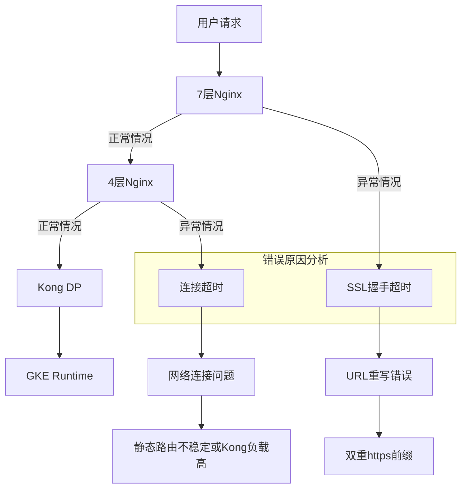
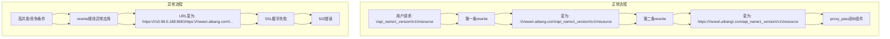

# Google AI Studio

我的架构流整个流量路径:

1. 流量路径:
用户请求 -> A(7层Nginx) -> B(4层Nginx) -> C(Kong DP) -> D(GKE RT)
用户请求
   ↓
A: 7层Nginx（Shared VPC，单网卡）
   ↓
B: 4层Nginx（双网卡，连接 Shared VPC 与 Private VPC）
   ↓
C: Kong DP（192.168.64.33，Private VPC）
   ↓
D: GKE Runtime（最终服务）

流量分层处理：

A组件(7层Nginx)负责API路由和HTTP头部处理
B组件(4层Nginx)负责跨网络的TCP转发
Kong DP处理具体的API网关功能
GKE RT作为最终的服务运行时

2. 网络架构分析:
- A 组件: 单网卡, Shared VPC网络
- B 组件: 双网卡(Shared VPC: 10.98.0.188 + Private VPC: 192.168.0.35) 配置了静态路由可以访问到192.168.64.33
- C 组件: Kong DP, 对外暴露IP 192.168.64.33
- D 组件: GKE Runtime

3. 配置分析:

A组件(7层Nginx)配置:
- 处理了多个API路由,这里侧重的是多个API Name的转发
    - /api_name1_version/v1/
    - /api_name2_version/v1/ 
- 使用rewrite重写URL
- 转发到B组件(10.98.0.188:8081)
- 设置了适当的超时参数
- 保留了原始客户端IP

B组件(4层Nginx)配置:
- SSL Preread模式
- 简单的TCP转发到Kong(192.168.64.33:443)
- 设置了连接超时 5s 

A也就是Nginx的配置如下
api_name1
```nginx
location /api_name1_version1/v1/ {
rewrite ^(.*)$ "://www.aibang.com$1"
rewirte ^(.*)$ "https$1" break;
proxy_pass https://10.98.0.188:8081/;
proxy_set_header Host www.aibang.com;
proxy_set_header X-Real-Ip $remote_addr;
    proxy_read_timeout 300s;
    proxy_connect_timeout 300s;
    proxy_send_timeout 300s;
}
```
api_name2
```nginx
location /api_name2_version/v1/ {
rewrite ^(.*)$ "://www.aibang.com$1"
rewrite ^(.*)$ "https$1" break;
proxy_pass https://10.98.0.188:8081/;
proxy_set_header Host www.aibang.com;
proxy_set_header X-Real-Ip $remote_addr;
    proxy_read_timeout 300s;
    proxy_connect_timeout 300s;
    proxy_send_timeout 300s;
}
```
B的Nginx.conf配置
```bash
 server {
   listen 8081;
   ssl_preread on;
   proxy_connect_timeout 5s;
   proxy_pass 192.168.64.33:443;
 }
```

我现在遇到这样一个问题 我去跟踪A的日志的时候,会有很多502出现
另外对于B这组件也会有502的日志出现
然后也能看到有类似这样的超时日志
A 日志
upstream timed out (110: Connection timed out) while SSL handshaking to upstream, client: ip, server: localhost 
"textPayload": "2025/05/06 03:30:07 [error] 696227#696227:
*4939750 upstream timed out (110: Connection timed out) while
SSL handshaking to upstream, client: 10.91.7.77, server: localhost, request: \"POST /abc-proxy/v1/ generic/entity/query HTTP/1.1|", upstream: \"https:// 10.98.0.188:8081https://www.aibang.com/abc-proxy/v1/generic/entity/guery.", host: ("www.aibang.com)"'",
"insertid": "1b8bcv3fadpn12", 正常情况下都是可以的.但是异常的时候看到的异常请求都是如下
https://10.98.0.188:8081https://www.aibang.com/abc-proxy/v1/generic/entity/query 这个地址看起来都是异常的?

B日志中
upstream timed out (110: Connection timed out) while connecting to upstream, client: A的IP, server: 0.0.0.0:8081, upstream: |"192.168.64.33:443|", from/to client:0/0,,bytes form/to upstream:0/0

我关注现在为什么会产生这些超时?根据超时的详细返回信息 能给我更多信息么 ?比如 while SSL handshaking to upstream和while connecting to upstream 能分析出什么?

需要澄清下 我的服务目前是正常的.这个502的错误只是偶发情况.比如每天百万次请求会出现百次502


# Gemini

TODO: 
-  Nginx A 期望上游服务能够处理 HTTPS 请求并完成 SSL 握手，但上游服务未能在此过程中及时或正确地响应。
- 修改A组件的nginx配置
- ：保留API路径前缀
```nginx
location /api_name2_version/v1/ {
    proxy_pass https://10.98.0.188:8181;
    proxy_set_header Host www.aibang.com;
    proxy_set_header X-Real-IP $remote_addr;
    proxy_read_timeout 300s;
    proxy_connect_timeout 300s;
    proxy_send_timeout 300s;
}
```

```nginx
location /api_name1_version/v1/ { 
    proxy_pass https://10.98.0.188:8081; 
    proxy_set_header Host www.aibang.com; 
    proxy_set_header X-Real-IP $remote_addr; 
    proxy_read_timeout 300s; 
    proxy_connect_timeout 300s; 
    proxy_send_timeout 300s; 
}
```

这种配置会将`/api_name1_version/v1/endpoint`转发为`/api_name1_version/v1/endpoint`

也就是比如用户请求
https://www.aibang.com/api_name1_version/v1/query
会被转发到
https://10.98.0.188:8081/api_name1_version/v1/query

如果写成
proxy_pass https://10.98.0.188:8081/;
（注意最后的 /）
	•	结尾带斜杠 /：Nginx 会截掉 location 匹配部分，只保留后缀。
	•	所以 /api_name1_version/v1/query → /query

-      # 连接到 Kong 的超时设置 (可适当调整)
        proxy_connect_timeout 10s; # 从 5s 增加，作为起点
        proxy_read_timeout 60s;
        proxy_send_timeout 60s;
# Nginx 架构流量路径超时问题分析与优化建议报告

## 1. 引言

本报告旨在对用户提供的 Nginx 架构流量路径中出现的间歇性 502 超时错误进行深入分析，并提供相应的诊断与解决建议。该架构涉及多层 Nginx（七层与四层）、Kong API Gateway (DP) 以及 GKE Runtime 服务。分析将重点关注组件 A (七层 Nginx) 记录的 "SSL handshaking to upstream" 超时以及组件 B (四层 Nginx) 记录的 "connecting to upstream" 超时问题。通过对流量路径、网络架构、Nginx 配置以及相关日志的细致审查，本报告将阐明这些超时错误的根本原因，并提出针对性的优化措施。

## 2. 分析 Nginx A (七层 Nginx) 超时问题

Nginx A 作为流量入口的第一层七层代理，负责 API 路由和 HTTP 头部处理。用户报告在 Nginx A 的日志中观察到大量 "upstream timed out (110: Connection timed out) while SSL handshaking to upstream" 错误，这表明 Nginx A 在与上游（即 Nginx B）进行 SSL 握手时发生了超时。

### 2.1. 解构错误信息："upstream timed out (110: Connection timed out) while SSL handshaking to upstream"

此错误信息明确指出了几个关键点：

- **`upstream timed out (110: Connection timed out)`**: 这表示 Nginx A 在等待上游服务器响应时超过了预设的超时时间，导致连接被判定为超时。错误码 110 通常与网络连接超时相关 1。
- **`while SSL handshaking to upstream`**: 这部分至关重要，它指明了超时发生在 SSL/TLS 握手阶段。SSL/TLS 握手是客户端（此处为 Nginx A）和服务器（此处为 Nginx B）之间建立安全加密连接的过程。此阶段涉及多个步骤，包括协议版本协商、密码套件选择、证书交换和密钥交换 1。如果在此过程中的任何一步骤，Nginx A 未能在规定时间内收到 Nginx B 的预期响应，便会触发此错误。

典型的 SSL 握手阶段包括：ClientHello, ServerHello, Certificate, ServerKeyExchange (如果需要), ServerHelloDone, ClientKeyExchange, ChangeCipherSpec, Finished 1。超时可能发生在这些消息交换的任何环节。例如，Nginx A 发送 ClientHello 后，Nginx B 可能未能及时响应 ServerHello；或者在证书交换、密钥交换等步骤中出现延迟。

常见的导致 SSL 握手超时的服务器端和网络相关原因包括：上游服务器过载、网络连接缓慢或不稳定、上游服务器 SSL/TLS 配置错误（如证书问题、不支持的密码套件）、防火墙阻止或延迟 SSL 握手所需端口的通信 1。

下表总结了 Nginx A 日志中此错误的关键信息点及其直接指示：

**表 2.1: Nginx A 日志分析 - "upstream timed out while SSL handshaking"**

|   |   |
|---|---|
|**日志字段/信息**|**指示意义**|
|`upstream timed out (110:...)`|Nginx A 与上游（Nginx B）建立连接或通信时超时。|
|`while SSL handshaking`|超时明确发生在 SSL/TLS 握手协商阶段。|
|`client: <ip>`|发起请求的原始客户端 IP 地址。|
|`server: localhost`|Nginx A 本身的 server_name (可能配置为 localhost 或未匹配到具体 server_name)。|
|`request: "POST /abc-proxy/..."`|发生超时的具体客户端请求。|
|`upstream: "https://10.98.0.188:8081https://www.aibang.com/..."`|**极其关键**：Nginx A 尝试连接的上游地址。此地址格式异常，是问题诊断的核心线索。|
|`host: "www.aibang.com"`|客户端请求中的 Host 头部。|

日志中 `upstream` 字段显示的 `https://10.98.0.188:8081https://www.aibang.com/...` 是一个明显格式错误的 URL。Nginx A 似乎将 `proxy_pass` 指令中的目标地址 (`https://10.98.0.188:8081/`) 与一个由 `rewrite` 规则生成的、本应作为请求路径部分的绝对 URL (`https://www.aibang.com/...`) 错误地拼接起来。这种格式错误的 URL 传递给 SSL 库或网络栈进行连接时，极有可能导致 SSL 握手失败。

### 2.2. 分析 Nginx A 的 `rewrite` 规则与 `proxy_pass` 的交互

Nginx A 的配置中包含了 `rewrite` 指令和 `proxy_pass` 指令，它们的交互方式直接影响了向上游 Nginx B 发起的请求。

提供的 Nginx A 配置片段如下：

Nginx

```
location /api_name1_version1/v1/ {
    rewrite ^(.*)$ "://www.aibang.com$1"
    rewrite ^(.*)$ "https$1" break;
    proxy_pass https://10.98.0.188:8081/;
    proxy_set_header Host www.aibang.com;
    proxy_set_header X-Real-Ip $remote_addr;
    proxy_read_timeout 300s;
    proxy_connect_timeout 300s;
    proxy_send_timeout 300s;
}
```

**`rewrite` 规则分析**：

1. `rewrite ^(.*)$ "://www.aibang.com$1"`:
    
    - 此规则匹配整个请求 URI (由 `$1` 捕获)。
    - 替换为 `"://www.aibang.com"` 加上原始 URI。例如，如果原始请求 URI 是 `/api_name1_version1/v1/test`，经过此规则后，URI 变为 `://www.aibang.com/api_name1_version1/v1/test`。这是一个不包含协议头的、格式奇特的字符串。
2. `rewrite ^(.*)$ "https$1" break;`:
    
    - 此规则再次匹配整个 (已被上一条规则修改过的) URI。
    - 在前面不完整的 URI 基础上添加 `https`，形成 `https://://www.aibang.com/api_name1_version1/v1/test`。
    - `break` 标志表示停止当前 `ngx_http_rewrite_module` 指令集的处理，并在当前 `location` 内继续处理请求 4。

**`proxy_pass` 行为分析**：

- `proxy_pass https://10.98.0.188:8081/;`:
    - 此指令将请求代理到 Nginx B 的 `10.98.0.188` IP 地址上的 `8081` 端口，并使用 HTTPS 协议。
    - 根据 Nginx 文档，当 `rewrite` 指令修改了 URI，并且使用 `break` 标志在同一 `location` 中处理时，如果 `proxy_pass` 指令中指定了 URI (如此处的 `/`)，Nginx 会将重写后的 URI 附加到 `proxy_pass` 指定的 URL 之后（如果 `proxy_pass` 的 URL 中包含路径）或者替换 `proxy_pass` URL 中的路径部分 6。
    - 然而，当 `rewrite` 规则产生一个绝对 URL (如本例中的 `https://://www.aibang.com/...`) 时，行为可能更为复杂。一些文档表明，如果 `rewrite... break;` 产生绝对 URL，Nginx 会执行客户端重定向，并忽略 `proxy_pass` 7。但从用户提供的日志 `upstream: "https://10.98.0.188:8081https://www.aibang.com/..."` 来看，Nginx A 实际上是尝试向上游发起连接，而不是进行客户端重定向。
    - 这种日志中的 `upstream` 地址表明，Nginx A 正在尝试连接到 `proxy_pass` 中定义的主机和端口 (`10.98.0.188:8081`)，但它试图在此连接上发送的请求的 "路径" 部分，似乎是那个由 `rewrite` 生成的、格式严重错误的绝对 URL (`https://www.aibang.com/...`)。Nginx 内部对这种极端错误的 URL (`https://://`) 的处理方式可能导致了这种拼接行为。

**影响 SSL 握手**：

1. Nginx A 的 `rewrite` 规则产生了格式错误的 URI：`https://://www.aibang.com/path`。
2. Nginx A 的 `proxy_pass` 逻辑似乎将 `https://10.98.0.188:8081/` 与这个错误的 URI 结合，导致尝试连接到一个名为 `https://10.98.0.188:8081https://www.aibang.com/path` 的上游。
3. TCP 连接实际上是建立到 `10.98.0.188:8081`。
4. Nginx A 随后发起 SSL 握手。ClientHello 消息中携带的 SNI (Server Name Indication) 可能是 `www.aibang.com` (基于 `proxy_set_header Host www.aibang.com;` 的设置)。
5. Nginx B (`10.98.0.188:8081`) 接收到这个 ClientHello。Nginx B 配置了 `ssl_preread on;`，它是一个四层代理，并不为 `www.aibang.com` 终止 SSL；它期望将 SSL 流量透传给 Kong。
6. 关键在于，SSL 握手是在 Nginx A 和 Nginx B 之间进行的。如果 Nginx B 的 `ssl_preread` 模块或其底层的 SSL/TLS 库因为 Nginx A 试图代理的这个奇异的 URI 结构而认为请求格式错误，它可能会：
    - 无法正确解析 ClientHello 中的扩展。
    - 如果 SNI 信息混乱，找不到合适的证书或配置（尽管此处 B 是透传）。
    - 直接关闭连接或不发送必要的 SSL 记录（如 ServerHello）给 Nginx A，从而导致 Nginx A 超时。

下表清晰地展示了 URI 的转换过程及其潜在影响：

**表 2.2: Nginx A Rewrite 规则转换及影响**

|   |   |   |   |   |   |
|---|---|---|---|---|---|
|**原始请求 URI (示例)**|**Rewrite 规则 1 输出**|**Rewrite 规则 2 输出 (最终 URI)**|**proxy_pass 尝试连接的上游 URL (根据日志)**|**预期 SSL SNI (发送给 B)**|**对 Nginx B 的潜在问题**|
|`/api_name1_version1/v1/test`|`://www.aibang.com/api_name1_version1/v1/test`|`https://://www.aibang.com/api_name1_version1/v1/test`|`https://10.98.0.188:8081https://www.aibang.com/api_name1_version1/v1/test`|`www.aibang.com`|Nginx B 的 SSL/TCP 栈或 `ssl_preread`模块可能因请求 URI 格式严重错误而无法正确处理 SSL 握手。|
|`/api_name2_version/v1/another`|`://www.aibang.com/api_name2_version/v1/another`|`https://://www.aibang.com/api_name2_version/v1/another`|`https://10.98.0.188:8081https://www.aibang.com/api_name2_version/v1/another`|`www.aibang.com`|同上。|

这种由 `rewrite` 规则引入的严重错误是导致 Nginx A 与 Nginx B 之间 SSL 握手超时的最可能原因。

### 2.3. 配置审查：Nginx A

- `proxy_set_header Host www.aibang.com;`: 此配置正确地将 `Host` 头部设置为 `www.aibang.com`，这对于上游服务器（最终是 Kong 和 GKE RT）正确处理请求至关重要。
- `proxy_set_header X-Real-Ip $remote_addr;`: 保留了原始客户端 IP，这是一个良好的实践，便于后端服务获取真实的客户端来源。
- `proxy_read_timeout 300s; proxy_connect_timeout 300s; proxy_send_timeout 300s;`: 这些超时设置都非常宽松 (300秒)。
    - `proxy_connect_timeout` 定义了 Nginx 与上游服务器建立连接的超时时间。SSL 握手是在连接建立阶段的一部分。
    - `proxy_read_timeout` 定义了 Nginx 从上游服务器读取响应的超时时间。
    - `proxy_send_timeout` 定义了 Nginx向上游服务器发送请求的超时时间。 鉴于这些值都很大，超时本身不太可能是由于设置过短造成的。问题更可能源于 SSL 握手过程由于其他原因（如前述的错误 URI）而根本无法完成，而不是因为网络延迟略微超过了一个较短的超时值。错误信息 "while SSL handshaking to upstream" 表明问题发生在连接建立后的握手阶段，这可能受到 `proxy_connect_timeout` 的约束，或者如果握手过程中的数据交换被视为读取操作，则可能与 `proxy_read_timeout` 相关。然而，根本原因在于握手无法成功进行。
- `proxy_pass https://10.98.0.188:8081/`: 表明 Nginx A 将向上游 Nginx B 发起 HTTPS 连接。

Nginx A 的超时配置本身并非问题所在。核心问题在于 `rewrite` 规则导致了向上游 Nginx B 发送了一个结构异常的请求，这使得 Nginx B 无法正常完成 SSL 握手。因此，调整这些超时参数并非首要解决方案；修复 `rewrite` 规则才是关键。

## 3. 分析 Nginx B (四层 Nginx) 超时问题

Nginx B 作为一个四层代理，配置了双网卡，连接 Shared VPC 和 Private VPC，负责跨网络的 TCP 转发。用户报告在 Nginx B 的日志中观察到 "upstream timed out (110: Connection timed out) while connecting to upstream" 错误，指向上游为 Kong DP (`192.168.64.33:443`)。

### 3.1. 解构错误信息："upstream timed out (110: Connection timed out) while connecting to upstream"

此错误信息表明 Nginx B 在尝试与其上游服务器（即 Kong DP）建立 TCP 连接时失败。

- **`upstream timed out (110: Connection timed out)`**: 与 Nginx A 中的错误类似，这表示 Nginx B 在等待上游响应时超时。
- **`while connecting to upstream`**: 这部分明确指出超时发生在 TCP 连接建立阶段。TCP 连接通常通过三次握手（SYN, SYN-ACK, ACK）建立 8。此错误意味着 Nginx B 发送了初始的 SYN 包到 Kong DP (`192.168.64.33:443`)，但在其 `proxy_connect_timeout`（配置为 5 秒）内未能收到预期的 SYN-ACK 包，或者后续的 ACK 未能成功处理，导致连接尝试失败 9。

此错误是纯粹的 TCP层面问题，此时 SSL/TLS 握手（从 Nginx B 到 Kong C 的角度）尚未开始。失败点在于基础的网络连接未能成功建立。

常见的导致 TCP 连接超时的原因包括 8：

- **网络可达性问题**:
    - 路由配置错误：Nginx B 可能没有正确的路由到达 Kong DP 的 IP 地址。
    - 防火墙拦截：位于 Nginx B 和 Kong DP 之间的 GCP 防火墙规则或 GKE 网络策略（如果 Kong DP 在 GKE 中）可能阻止了从 B 到 C 的 TCP 流量（特别是目标端口 443）。
- **上游服务器 (Kong DP) 问题**:
    - 服务器宕机：Kong DP 服务器可能已关闭或无法访问。
    - 未监听指定端口：Kong DP 可能没有在 `192.168.64.33:443` 上监听。
    - 监听队列已满：如果 Kong DP 过载，其操作系统的 TCP 监听队列可能已满，无法接受新的连接请求。
- **中间网络设备问题**: 路径中可能存在的其他网络设备（尽管未在图中明确标出，如内部负载均衡器或安全设备）可能丢弃了数据包。
- **Nginx B 的 `proxy_connect_timeout` 设置**: 5 秒的连接超时设置，如果 Kong DP 或 B 到 C 的网络路径存在固有的较高延迟，这个值可能过于激进。

下表总结了导致 Nginx B 到 Kong C 连接超时的常见原因：

**表 3.1: Nginx B -> Kong C TCP "Connecting to Upstream" 超时常见原因**

|   |   |   |
|---|---|---|
|**原因类别**|**具体原因**|**如何导致超时**|
|网络问题|GCP 防火墙规则阻止从 B 到 C 的流量|SYN 包被防火墙丢弃，C 无法收到，B 等待 SYN-ACK 超时。|
||GKE 网络策略 (若 Kong 在 GKE) 阻止来自 B 的流量|同上。|
||Nginx B 上静态路由配置错误或不生效|B 无法找到到达 C 的路径，SYN 包无法发送到正确的下一跳。|
||Private VPC 内网络拥塞或丢包|SYN 包或 SYN-ACK 包在传输过程中丢失，导致重传并最终超时。|
|上游服务器 (Kong)|Kong DP 服务未运行或崩溃|C 不响应 SYN 包。|
||Kong DP 未在 `192.168.64.33:443` 监听|C 不响应 SYN 包。|
||Kong DP 主机资源耗尽 (CPU, 内存) 或进程繁忙，无法接受新连接 (listen queue full)|C 可能延迟响应 SYN 包，或根本不响应，导致 B 超时。|
|Nginx B 配置|`proxy_connect_timeout 5s` 对于网络或 Kong 的响应来说过短|即使 C 最终会响应，但如果响应时间超过 5s，B 也会判定为超时。|

诊断此类错误应集中在 Nginx B 和 Kong C 之间的三层/四层网络连通性，以及 Kong C 本身的健康状况和响应能力。

### 3.2. 配置审查：Nginx B

Nginx B 的 `nginx.conf` 配置如下：

Bash

```
 server {
   listen 8081;
   ssl_preread on;
   proxy_connect_timeout 5s;
   proxy_pass 192.168.64.33:443;
 }
```

- `listen 8081;`: Nginx B 在此端口监听来自 Nginx A 的入站 TCP 连接。
- `ssl_preread on;`: 此指令启用了 `ngx_stream_ssl_preread_module` 模块的功能 11。它允许 Nginx B 在不终止 SSL/TLS 连接的情况下，预读 SSL/TLS ClientHello 消息，从而提取诸如 SNI (Server Name Indication) 或 ALPN (Application-Layer Protocol Negotiation) 等信息。这些信息可以用于后续的路由决策（例如，通过 `map` 指令将会话代理到不同的后端集群）。在此特定配置中，虽然启用了 `ssl_preread`，但并没有基于预读信息进行动态路由的逻辑；`proxy_pass` 指向一个固定的上游 Kong DP。因此，`ssl_preread` 的主要作用是使 Nginx B 能够在四层处理 SSL 流量，而无需拥有透传的各个域名的证书和私钥。
- `proxy_connect_timeout 5s;`: 这个指令属于 `ngx_stream_proxy_module` 模块 10。它定义了 Nginx B 尝试与上游服务器（即 Kong DP `192.168.64.33:443`）建立连接的超时时间。默认值为 60 秒 10。此处的 5 秒设置相对较短。如果 Kong DP 响应略有延迟，或者网络路径 B->C 存在一定的抖动，这个 5 秒的超时可能不足够，从而导致间歇性的连接超时。
- `proxy_pass 192.168.64.33:443;`: 此指令将接收到的 TCP 流（其中包含来自 Nginx A 的 SSL 加密数据）转发到 Kong DP 的 `192.168.64.33` IP 地址的 `443` 端口。

5 秒的 `proxy_connect_timeout` 是一个需要关注的关键参数。虽然并非极端地短，但对于可能存在网络抖动或上游服务（Kong）偶尔响应缓慢的环境，它可能成为间歇性超时的来源。可以考虑将其适当调大（例如调整到 15-30 秒，或恢复到默认的 60 秒）作为诊断步骤之一，同时深入调查 Kong C 的响应性能。

### 3.3. Nginx B 中 `ssl_preread on` 的角色

如前所述，`ssl_preread on` 允许 Nginx B 在不解密 SSL 流量的情况下检查 SSL ClientHello 消息 11。这对于需要基于 SNI 进行智能路由的四层负载均衡场景非常有用。在此架构中，Nginx B 似乎主要充当一个 TCP 代理，将来自 Nginx A 的（本应是）SSL 流量直接转发给 Kong DP。

如果 Nginx A 与 Nginx B 之间的 SSL 握手失败（如 Nginx A 的日志所示），那么对于那些失败的请求，Nginx B 可能根本不会达到向上游 Kong C 代理数据的阶段。然而，Nginx B 日志中记录的 "connecting to upstream" 错误表明，对于某些请求，Nginx B _确实_ 尝试连接到 Kong C。这意味着这些请求至少成功通过了客户端到 Nginx B 的初始连接阶段（或者 Nginx B 无论预读成功与否都会尝试连接上游，这对于代理是典型行为）。

因此，`ssl_preread` 本身不太可能直接导致 Nginx B 连接 Kong C 的超时。B 到 C 的连接超时是独立的TCP连接问题，取决于 Kong C 的可用性和网络状况。`ssl_preread` 主要与 Nginx A 到 Nginx B 的交互有关。除非 `ssl_preread` 模块在解析 ClientHello 时发生严重错误，并因此破坏了后续尝试连接上游的状态（可能性较低），否则它不是 B->C 连接超时的直接原因。

## 4. 网络路径和 GCP 基础设施分析

理解整个流量路径上的网络分段和 GCP 组件对于诊断连接问题至关重要。

### 4.1. 端到端流量路径和网络分段回顾

1. **用户请求 -> A (七层 Nginx)**: 流量从外部用户到达位于 Shared VPC 中的 Nginx A (单网卡)。
2. **A -> B (四层 Nginx)**: Nginx A (`Shared VPC`) 通过其 `proxy_pass` 指令将流量发送到 Nginx B 在 Shared VPC 中的网卡 IP (`10.98.0.188`) 的 `8081` 端口。Nginx B 具有双网卡，另一个网卡位于 Private VPC (`192.168.0.35`)。Nginx B 上配置了静态路由，使其能够访问 Kong DP 所在的子网 (`192.168.64.0/x`)。
3. **B -> C (Kong DP)**: Nginx B 通过其 Private VPC 网卡 (`192.168.0.35`) 将流量转发到位于 Private VPC 中的 Kong DP (`192.168.64.33`) 的 `443` 端口。
4. **C -> D (GKE Runtime)**: Kong DP 将请求路由到最终的服务运行时 GKE RT。

关键的网络跃点包括：

- **A 到 B**: 流量在概念上通过 Nginx B 的双网卡从 Shared VPC 跨越到 Private VPC。
- **B 到 C**: 流量在 Private VPC 内部从 Nginx B 转发到 Kong DP。

Nginx B 在此架构中扮演了网络桥梁的角色，连接了 Shared VPC 和 Private VPC。其路由配置和相关的防火墙规则对于流量的正确转发至关重要。任何与 Nginx B 接口相关的路由或防火墙规则配置不当都可能成为问题的关键点。

### 4.2. 识别潜在的网络瓶颈和故障点

间歇性错误通常指向“软”故障，例如瞬时丢包、网络设备的速率限制或资源耗尽，而不是会导致持续故障的“硬”配置错误。

- **Shared VPC 到 Private VPC (通过 Nginx B)**:
    
    - **GCP 防火墙规则 (Shared VPC)**: 是否存在限制从 Nginx A 到 Nginx B (`10.98.0.188:8081`) 出向流量的规则？
    - **GCP 防火墙规则 (Private VPC)**: 是否存在限制进入 Nginx B 私网 IP (`192.168.0.35`) 的入向流量，或从 Nginx B 私网 IP 到 Kong C 子网出向流量的规则？
    - **Nginx B 静态路由**: 确保指向 Kong C 子网 (`192.168.64.0/x`) 的静态路由在 Nginx B 上正确配置且处于活动状态。
    - **Nginx B 转发能力**: 确保 Nginx B 操作系统层面允许 IP 转发（如果它充当路由器）。
- **Private VPC (Nginx B 到 Kong C)**:
    
    - **GCP 防火墙规则**: 检查是否存在限制从 Nginx B 的私网 IP (`192.168.0.35`) 到 Kong C 的 IP (`192.168.64.33`) 在 TCP 端口 `443` 上流量的规则 13。
    - **GKE 网络策略**: 如果 Kong DP 作为 Pod/Service 运行在 GKE 集群中，检查是否有 GKE 网络策略阻止了来自 Nginx B IP 段的流量 13。
    - **网络拥塞/丢包**: Private VPC 内部是否存在网络拥塞或导致数据包丢失的情况。
    - **MTU 问题**: 路径中是否存在 MTU (Maximum Transmission Unit) 不匹配的问题，尤其是在数据包需要分片时。

对 GCP 防火墙规则和 GKE 网络策略进行彻底审计，重点关注特定的源/目标 IP 和端口，是至关重要的步骤。

### 4.3. 利用 GCP VPC Flow Logs 进行诊断

GCP VPC Flow Logs 记录了进出虚拟机实例（包括 GKE 节点）网络接口的 IP 流量样本 15。它们是诊断云原生网络问题的强大工具，可以提供关于数据包是否到达其目标 NIC 以及 GCP 防火墙是否干扰的客观证据。

- **启用与配置**:
    - 为 Nginx A、Nginx B 和 Kong C (如果 Kong DP 是 VM) 所在的子网启用 VPC Flow Logs。
    - 设置合适的聚合间隔（例如，5 秒用于近乎实时的分析）和采样率（例如，1.0 表示记录所有日志，需平衡成本与数据完整性）15。
- **分析内容**:
    - 筛选并分析以下流量的日志：
        - 客户端 IP -> Nginx A 的 IP (用于上下文)。
        - Nginx A 的 IP -> Nginx B 的 Shared VPC IP (`10.98.0.188:8081`)。关注连接是否被接受/拒绝，以及字节数/数据包数。
        - Nginx B 的 Private VPC IP (`192.168.0.35`) -> Kong C 的 IP (`192.168.64.33:443`)。关注连接是否被接受/拒绝，以及字节数/数据包数。
    - 将 Nginx 错误日志中的时间戳与 VPC Flow Logs 条目进行关联，以确定数据包是否被丢弃或连接是否被防火墙拒绝。
    - VPC Flow Logs 捕获的信息包括源/目标 IP、源/目标端口、协议、发送/接收的字节数和数据包数、连接状态（防火墙操作，如允许或拒绝）等 16。虽然不直接提供 RTT，但可以通过分析时间戳间接推断延迟。
- **诊断价值**:
    - 如果 Nginx B 日志记录到 Kong C 的 "connection timed out"，VPC Flow Logs 应显示从 B 到 C 的出向数据包。同时，Kong C 所在子网的 Flow Logs 应显示相应的入向数据包。如果存在差异（例如，B 有出向但 C 无入向，或 C 有入向但被防火墙拒绝），则可以精确定位问题区域。
    - 这有助于区分应用层超时（例如，Kong C 在连接后响应缓慢）和网络层丢包/阻塞。

## 5. 整体视图：相互依赖与级联效应

分析这两个主要的错误类型时，需要考虑它们之间的潜在联系以及它们如何共同导致整体服务出现间歇性 502 错误。

- Nginx A 故障对 Nginx B 的影响:
    
    如果 Nginx A 因为 rewrite 规则导致的错误 URL 而无法与 Nginx B 完成 SSL 握手，Nginx B 可能会关闭来自 Nginx A 的连接。对于这个特定的失败事务，Nginx B 将不会尝试连接到 Kong C。这意味着 Nginx A 的问题会直接阻止某些请求流向后续组件。
    
- 独立的 Nginx B 到 Kong C 的故障:
    
    Nginx B 日志中记录的连接 Kong C 超时，也可能独立于 Nginx A 的问题发生。这些是 Nginx B 确实尝试代理那些已成功通过 A->B 阶段的（或至少 Nginx B 认为是有效的）请求时发生的。
    
- 资源竞争 (对于间歇性问题可能性较低):
    
    虽然可能性较低，但如果 Nginx A 的问题（例如，由于其自身错误导致大量重试）间接导致 Nginx B 负载增加，可能会使 Nginx B 连接到 Kong C 时变得稍微更脆弱。然而，从日志描述来看，这两个主要的错误类型似乎有各自的直接原因。
    

服务在“正常情况下都是可以的”这一描述表明，这些并非导致所有请求都失败的持续性故障。这进一步支持了问题是由特定条件触发的间歇性故障（如 Nginx A 的错误 `rewrite` 对特定请求模式的影响）或偶发性网络/上游性能波动（影响 B->C 连接）造成的。

可以设想两种典型的失败场景：

1. **场景1 (触发 Nginx A 错误)**: 某个请求命中了 Nginx A 中导致 URL 格式错误的 `rewrite` 逻辑。Nginx A 尝试与 Nginx B 进行 SSL 握手失败。Nginx A 记录 "SSL handshaking" 超时错误。Nginx B 可能会记录一个客户端（Nginx A）意外关闭连接的日志。对于此请求，不会有 Nginx B 到 Kong C 的连接尝试。
2. **场景2 (触发 Nginx B 错误)**: 某个请求未触发 Nginx A 中的错误 `rewrite`（或者 Nginx A 的 `rewrite` 问题已修复）。Nginx A 成功与 Nginx B 建立连接并转发请求。Nginx B 尝试连接到 Kong C，但此时 B->C 的 TCP 连接超时。Nginx B 记录 "connecting to upstream" 超时错误。随后，Nginx A 可能会从 Nginx B 收到一个 502 错误，并将其返回给客户端。

因此，这两个问题虽然发生在不同组件和不同阶段，但它们共同构成了观察到的间歇性 502 错误。解决 Nginx A 的 `rewrite` 问题对于 A->B 的稳定性至关重要。同时，解决 B->C 的连接问题或 Kong C 的响应性问题，对于那些成功通过 A 和 B 的请求也同样重要。它们很可能是导致整体 502 错误率的两个不同类别的问题。

## 6. 根本原因假设与优先级排序

基于以上分析，可以提出以下关于超时问题的根本原因假设，并对其进行优先级排序：

- **P1: Nginx A 中由于错误的 `rewrite` 指令导致生成了格式错误的上游 URL (最高优先级)**
    
    - **证据**: Nginx A 的配置和 Nginx A 的错误日志中显示的格式错误的上游 URL (`https://10.98.0.188:8081https://www.aibang.com/...`)。
    - **影响**: 直接导致 Nginx A 与 Nginx B 之间的 "SSL handshaking to upstream" 超时错误。
- **P2: Nginx B 到 Kong C 的网络连接问题或 Kong DP 响应迟缓 (高优先级)**
    
    - **证据**: Nginx B 的错误日志 ("upstream timed out... while connecting to upstream") 和其配置的 `proxy_connect_timeout 5s;`。
    - **可能子原因**:
        - Nginx B 和 Kong C 之间的瞬时网络丢包。
        - GCP 防火墙或 GKE 网络策略间歇性地阻止或延迟从 B 到 C 的 SYN 包。
        - Kong DP (`192.168.64.33:443`) 偶尔接受 TCP 连接缓慢（例如，监听队列已满，进程处理 `accept()` 系统调用缓慢）。
        - Nginx B 的 `proxy_connect_timeout 5s` 对于偶发的网络或 Kong C 延迟来说设置过低。
- **P3: Nginx 超时配置可能欠佳 (中优先级，次于 P1/P2)**
    
    - **证据**: 虽然 Nginx A 的超时设置很长，但 Nginx B 的 5 秒连接超时是一个需要审查的候选参数。
    - **影响**: 可能加剧 P2 中由网络或 Kong C 延迟导致的问题。
- **P4: 任何组件 (A, B, 或 C) 的资源耗尽 (较低优先级，除非监控数据显示)**
    
    - **证据**: 目前缺乏直接证据，但对于间歇性问题，如果发生资源使用峰值，则可能成为诱因 17。
    - **影响**: 可能导致组件响应缓慢或无法处理新连接/请求。

问题的解决可能需要多方面入手。修复一个部分（例如，Nginx A 的 `rewrite`）可能会减少一部分 502 错误，但可能无法解决所有问题。因此，确定问题的优先级至关重要。Nginx A 中格式错误的 URL 是一个明确的配置缺陷，需要立即处理。Nginx B 到 Kong C 的超时问题则需要进行网络和 Kong C 侧的调查。

## 7. 详细建议与诊断步骤

针对上述分析，提出以下详细的诊断步骤和解决建议。

### 7.1. 针对 Nginx A (解决与 Nginx B 的 SSL 握手超时)

**首要任务是修正 Nginx A 中错误的 `rewrite` 规则。**

- 修正 rewrite 规则:
    
    当前的 rewrite 规则：
    
    Nginx
    
    ```
    rewrite ^(.*)$ "://www.aibang.com$1"
    rewrite ^(.*)$ "https$1" break;
    ```
    
    这些规则的意图似乎是想确保请求最终以 `https://www.aibang.com/...` 的形式被处理，但这与 `proxy_pass https://10.98.0.188:8081/;` 的目标（将请求代理到 IP 地址）相冲突，并导致了灾难性的 URL 格式错误。
    
    如果目的是将原始请求路径（例如 `/api_name1_version1/v1/some/path`）传递给 Nginx B，同时确保 `Host` 头部为 `www.aibang.com`，则应**移除这两条错误的 `rewrite` 规则**。`proxy_pass` 本身使用 `https` 已确保到 Nginx B 的连接是加密的，而 `proxy_set_header Host www.aibang.com;` 正确设置了 `Host` 头。
    
    **推荐的 Nginx A 配置修正 (假设原始路径需要被代理到 B，且 B 代理到 Kong，Kong 使用 Host 头部)**：
    
    Nginx
    
    ```
    // 在 Nginx A 的 location 块中
    location /api_name1_version1/v1/ {
        # 移除有问题的 rewrite 规则:
        # rewrite ^(.*)$ "://www.aibang.com$1"
        # rewrite ^(.*)$ "https$1" break;
    
        proxy_pass https://10.98.0.188:8081; 
        # 或者 proxy_pass https://10.98.0.188:8081/api_name1_version1/v1/; 
        # 取决于 Nginx B 是否需要从 proxy_pass 中获取路径前缀，
        # 如果 Nginx A 的 location 匹配的路径部分 (如 /api_name1_version1/v1/) 
        # 也应作为 URI 的一部分传递给 Nginx B，则 proxy_pass 末尾不应有 /，
        # 或者 proxy_pass 的路径应与 location 匹配的路径一致。
        # 当前配置 proxy_pass https://10.98.0.188:8081/; (末尾有 /) 
        # 意味着 location 匹配的 /api_name1_version1/v1/ 会被替换为 /，
        # 并且原始请求中 /api_name1_version1/v1/ 之后的部分会追加到 / 后面。
        # 如果希望将 /api_name1_version1/v1/some/path 完整传递给 B，
        # 则 proxy_pass https://10.98.0.188:8081; (末尾无 /) 更合适，
        # 或者 proxy_pass https://10.98.0.188:8081/api_name1_version1/v1/;
        # (如果 B 的上游期望从 /api_name1_version1/v1/ 开始的路径)。
        # 鉴于原始配置中 proxy_pass 末尾有 /，且没有其他 rewrite 修改路径，
        # 那么 Nginx B 接收到的路径将是 location 块匹配路径之后的部分。
        # 例如，请求 /api_name1_version1/v1/foo/bar 将被代理到 B 的 /foo/bar。
        # 如果这是期望行为，则保持 proxy_pass https://10.98.0.188:8081/;
        # 如果期望将 /api_name1_version1/v1/foo/bar 代理到 B 的 /api_name1_version1/v1/foo/bar，
        # 则应使用 proxy_pass https://10.98.0.188:8081; (无尾部斜杠)
    
        proxy_set_header Host www.aibang.com;
        proxy_set_header X-Real-Ip $remote_addr;
        proxy_read_timeout 300s;
        proxy_connect_timeout 300s;
        proxy_send_timeout 300s;
    }
    ```
    
    需要与架构设计者确认 Nginx B 期望接收到的确切 URI 路径格式，以正确配置 `proxy_pass`。但无论如何，当前导致绝对 URL 拼接的 `rewrite` 规则必须移除。
    
- 从 Nginx A 主机测试到 Nginx B 的 SSL 握手:
    
    在 Nginx A 所在的主机上，使用 openssl s_client 工具测试与 Nginx B (10.98.0.188:8081) 的 SSL 连接 19。
    
    Bash
    
    ```
    openssl s_client -connect 10.98.0.188:8081 -servername www.aibang.com
    ```
    
    (使用 -servername www.aibang.com 是因为 Nginx B 配置了 ssl_preread，它可能会检查 SNI，尽管在此简单转发场景下可能不基于 SNI 做复杂路由，但保持一致性是好的)。
    
    检查输出是否成功完成握手，查看证书链以及是否有任何错误。这有助于隔离问题：是 Nginx A 的请求构造问题，还是 Nginx B 的 SSL 处理本身有问题（考虑到 ssl_preread，后者可能性小）。
    
- **审查 Nginx A 错误日志**: 如果可能，在 Nginx A 上开启更详细的 SSL 调试日志（例如，通过 `error_log` 指令的 `debug` 级别，并确保 Nginx 编译时包含 `--with-debug` 选项），以获取关于 `SSL_do_handshake()` 或 `SSL_connect()` 失败的更多上下文。
    
- **考虑 Nginx A 的 `proxy_ssl_server_name on;` 和 `proxy_ssl_name`**: 如果需要对发送给 Nginx B 的 SNI 进行精确控制，可以考虑使用这些指令。但通常情况下，对于 HTTP/S 代理，`proxy_set_header Host` 的值会影响 Nginx 选择的 SNI。
    

修复 `rewrite` 规则是解决 Nginx A 到 B SSL 握手超时的最直接和最有效的方法。`openssl s_client` 测试将快速验证 Nginx B 在被正确访问时是否能够完成 SSL 握手。这一系列操作的目标是：修正 `rewrite` -> Nginx A 向 B 发送有效请求 -> Nginx B 的 `ssl_preread` 按预期工作 -> A-B SSL 握手成功 -> A 将请求代理给 B -> B 将请求代理给 C。这应能消除 "SSL handshaking" 错误。

### 7.2. 针对 Nginx B (解决与 Kong C 的 TCP 连接超时)

- 从 Nginx B 主机测试到 Kong C 的 TCP 连通性:
    
    在 Nginx B 所在的主机上，使用 telnet 或 nc (netcat) 工具测试与 Kong DP (192.168.64.33:443) 的 TCP 连接。建议重复执行多次以捕捉间歇性故障。
    
    Bash
    
    ```
    telnet 192.168.64.33 443
    # 或者
    nc -zv 192.168.64.33 443
    ```
    
- 从 Nginx B 主机测试到 Kong C 的 SSL 握手:
    
    这可以验证 Kong C 的 SSL 配置是否正确，以及从 B 到 C 的网络路径是否支持 SSL 握手。
    
    Bash
    
    ```
    openssl s_client -connect 192.168.64.33:443 -servername <kong_service_actual_hostname>
    ```
    
    (替换 `<kong_service_actual_hostname>` 为 Kong DP 服务实际期望的 SNI 主机名，如果 Kong C 基于 SNI 提供不同服务或证书)。
    
- 在 Nginx B 中增加 proxy_connect_timeout:
    
    作为诊断步骤，临时将 proxy_connect_timeout 从 5s 增加到一个更大的值，例如 15s 或 30s（ngx_stream_proxy_module 的默认值是 60s 10）。
    
    Nginx
    
    ```
    # 在 Nginx B 的 server 块中
    proxy_connect_timeout 30s;
    ```
    
    如果超时错误数量减少，则表明问题可能与网络延迟或 Kong C 响应缓慢有关。
    
- **调查 Kong DP (`192.168.64.33`)**:
    
    - 检查 Kong DP 的日志，查找在 Nginx B 报告超时期间是否有任何错误、连接问题或过载迹象 18。
    - 监控 Kong DP 实例的资源利用率（CPU、内存、网络、打开的文件描述符）18。
    - 检查 Kong 的上游（即 GKE RT）的健康状况和响应能力。
    - 确保 Kong DP 主机操作系统的 TCP 监听队列没有溢出 (例如，在 Linux 上使用 `ss -s` 或 `netstat -s | grep "listen queue"` 查看相关统计，具体命令因操作系统而异)。

通过结合直接连通性测试和调整 Nginx B 的连接超时，可以快速判断 B->C 的问题是网络层面、Kong C 层面，还是仅仅是超时设置不当。如果 `telnet` 失败，则指向网络/防火墙问题。如果 `telnet` 成功但 `openssl s_client` 失败，则可能是 Kong C 的 SSL 配置问题。如果两者都成功但 Nginx B 仍然超时（在原 5s 设置下），则 Kong C 可能接受连接缓慢，或者 5s 对于某些情况确实太短。增加超时有助于确认后者。如果 Kong C 是瓶颈，则需要对其进行扩容或优化，或者优化其上游 GKE RT。如果是网络问题，则需要进行 GCP 网络故障排除。

### 7.3. 网络故障排除 (GCP 特定及通用方法)

- **VPC Flow Log 分析 (如 4.3 节详述)**:
    
    - 筛选流量: Nginx A (`<A_IP>`) 与 Nginx B (`10.98.0.188:8081`) 之间，以及 Nginx B (`<B_Private_IP>`) 与 Kong C (`192.168.64.33:443`) 之间。
    - 查找与错误时间戳相关的 `action: DENY` 日志条目。
    - 如果可能，通过关联日志比较不同跃点间的 `packetsSent` 与 `packetsReceived` 15。
- **GCP 防火墙规则审查**:
    
    - **Shared VPC**: 确保允许从 Nginx A 到 `10.98.0.188` (Nginx B 的 Shared VPC IP) 的 TCP/8081 出向流量。确保允许客户端流量入向到 Nginx A。
    - **Private VPC**: 确保允许从 Nginx B 的私网 IP (`192.168.0.35`) 到 `192.168.64.33` (Kong C) 的 TCP/443 出向流量。确保允许从 Nginx B 的 Shared VPC IP 段（或具体 IP）的流量入向到其私网 IP（如果防火墙是无状态的，或者需要显式规则允许来自 Shared VPC 的流量到达 Private VPC 接口）。确保允许从 Nginx B 的私网 IP 到 Kong C 的流量。
    - 验证防火墙规则的优先级，确保没有范围更广的 DENY 规则意外地覆盖了必要的 ALLOW 规则 13。
- **GKE 网络策略审查 (如果 Kong DP 在 GKE 中)**:
    
    - 确保网络策略允许从 Nginx B 的私网 IP (`192.168.0.35`) 到 Kong DP Pods/Service 的 TCP/443 入向流量 13。
- **使用 `mtr` 或 `traceroute` 进行路径分析**:
    
    - 从 Nginx A 主机到 Nginx B 的 Shared VPC IP (`10.98.0.188`)。
    - 从 Nginx B 主机到 Kong C 的 IP (`192.168.64.33`)。
    - 查找中间跃点的丢包或高延迟。注意，防火墙可能会阻止 ICMP，这会影响这些工具的有效性，但仍值得尝试 22。
- **检查 Nginx B 上的静态路由**: 确认指向 Kong C 子网 (例如 `192.168.64.0/x`) 且通过 Nginx B 的 Private VPC 接口的静态路由是活动的并且配置正确。
    

VPC Flow Logs 是这里最有力的工具，因为它们能显示网络结构本身的活动。如果 `mtr` 显示在 GCP 内部跃点有丢包，可能指示 GCP 网络问题。如果 VPC Flow Log 显示 `DENY`，则表明是防火墙或网络策略配置错误。如果所有网络检查都通过，问题可能在更高层面（例如 Kong C 的性能，或 Nginx B 的配置）。网络问题可能很棘手，使用 GCP 的工具进行系统性排查至关重要。

### 7.4. 增强监控和日志记录

- **Nginx A & B**:
    - 确保 Nginx 的 `access_log` 包含 `$upstream_connect_time`, `$upstream_header_time`, `$upstream_response_time` 等变量，以获取关于时间消耗在哪个阶段的细粒度数据。
    - 在 Nginx A 中，可以在非高峰时段临时启用 `rewrite_log on;` 指令，以便在错误日志中查看详细的 `rewrite` 处理过程（可能会产生大量日志）5。
- **系统层面监控**: 在 Nginx A、B 和 Kong C (及其宿主机) 上监控 CPU、内存、网络 I/O、打开的文件描述符以及连接状态 (例如，使用 `netstat -anp` 或 `ss -s`)。
- **Kong DP 监控**: 如果尚未完成，利用 Kong 内置的指标或将其与 Prometheus/Grafana 等监控系统集成。

更详细的日志和指标有助于将应用程序行为与系统性能相关联，并识别资源耗尽是否是导致间歇性超时的因素。例如，如果 Nginx B 到 Kong C 的 `$upstream_connect_time` 在超时前一直很高，则进一步证实了 B->C 连接或 Kong C 响应性问题。如果 `rewrite_log` 一致显示格式错误的 URL，则确认了 `rewrite` 问题。更好的可观察性对于快速诊断未来或复发的问题至关重要。

下表总结了推荐的诊断步骤和工具：

**表 7.1: 诊断步骤与工具摘要**

|   |   |   |   |
|---|---|---|---|
|**组件**|**待诊断问题**|**推荐工具/方法**|**关键检查指标/输出**|
|Nginx A|`rewrite` 规则错误导致 URL 格式异常|代码审查, `rewrite_log on;`|`error_log` 中 `rewrite` 过程, 日志中 `upstream:` 字段显示的 URL|
||与 Nginx B 的 SSL 握手失败|`openssl s_client -connect 10.98.0.188:8081`, Nginx A `error_log`|`openssl` 握手是否成功, 证书信息, 错误信息|
|Nginx B|与 Kong C 的 TCP 连接超时|`telnet 192.168.64.33 443`, `nc -zv...`, Nginx B `error_log`|`telnet`/`nc` 是否能连接, Nginx B 日志中 `upstream connect timeout` 相关参数|
||`proxy_connect_timeout`设置是否过短|调整 Nginx B 配置 (`proxy_connect_timeout`)|调整后超时错误是否减少|
|网络路径|A->B, B->C 连通性, 防火墙/网络策略阻塞|GCP VPC Flow Logs, GCP Firewall Rules审查, GKE Network Policy审查, `mtr`, `traceroute`|Flow Logs 中的 `action: DENY`, 丢包率, 延迟, 防火墙/策略规则是否匹配预期流量|
|Kong C (DP)|服务健康状况, 响应能力, SSL 配置|Kong DP 日志, Kong DP 监控指标 (CPU, 内存等), `openssl s_client -connect 192.168.64.33:443`|Kong 日志中的错误, 资源使用率, `openssl` 握手是否成功, 证书信息|
|所有组件|资源利用率, 系统瓶颈|系统监控工具 (`top`, `vmstat`, `iostat`, `netstat`), 应用监控 (Nginx/Kong metrics)|CPU/内存/网络/磁盘 I/O, 连接数, 队列长度|

## 8. 结论与建议

综合分析，当前架构中出现的间歇性 502 超时错误主要源于两个层面、可能独立但也可能相互影响的问题：

1. **Nginx A 的 `rewrite` 规则配置不当**: 这是导致 Nginx A 向 Nginx B 发起请求时出现 "upstream timed out... while SSL handshaking to upstream" 错误的主要原因。错误的 `rewrite` 规则生成了一个格式严重异常的上游 URL，使得 Nginx A 在与 Nginx B 进行 SSL 握手时失败。
2. **Nginx B 与 Kong DP 之间的 TCP 连接问题**: 这是导致 Nginx B 日志中出现 "upstream timed out... while connecting to upstream" 错误的原因。此问题可能由多种因素引起，包括但不限于：网络路径中的瞬时丢包或延迟、GCP 防火墙或 GKE 网络策略的间歇性阻断、Kong DP 本身响应 TCP 连接请求缓慢，或者 Nginx B 设定的 5 秒 `proxy_connect_timeout` 在某些情况下过短。

**核心建议如下**:

- **立即修正 Nginx A 的 `rewrite` 规则 (最高优先级)**:
    
    - 移除当前 `location` 块中导致 URL 格式错误的 `rewrite ^(.*)$ "://www.aibang.com$1"` 和 `rewrite ^(.*)$ "https$1" break;` 规则。
    - 根据 Nginx B 期望接收的 URI 路径格式，正确配置 `proxy_pass` 指令。确保不再产生拼接的、格式错误的绝对 URL 作为上游目标。
    - 此项修复预计将解决 Nginx A 日志中的 SSL 握手超时错误。
- **并行调查 Nginx B 到 Kong DP 的连接问题 (高优先级)**:
    
    - 从 Nginx B 主机执行到 Kong DP (`192.168.64.33:443`) 的 TCP 和 SSL 连通性测试 (`telnet`, `openssl s_client`)，以排查基础网络和 Kong DP SSL 配置问题。
    - **审查并调整 Nginx B 的 `proxy_connect_timeout`**: 考虑将其从 5 秒临时增加到更宽松的值（如 15-30 秒，或默认的 60 秒）进行观察。如果超时减少，则表明原设置可能过于严格。
    - **深入分析 Kong DP 的性能与日志**: 检查 Kong DP 的资源利用率、错误日志，及其上游 GKE RT 的健康状况。
    - **利用 GCP VPC Flow Logs**: 详细分析 Nginx B 与 Kong DP 之间的网络流，查找被拒绝的连接或丢包迹象。
    - **审查 GCP 防火墙规则和 GKE 网络策略**: 确保没有规则错误地阻止或延迟了从 Nginx B 到 Kong DP 的合法流量。
- **实施增强的监控与日志记录**:
    
    - 在 Nginx A 和 B 的访问日志中添加更详细的上游响应时间相关的变量。
    - 对所有关键组件（Nginx A, B, Kong DP, GKE RT）建立全面的系统和应用性能监控。

通过首先解决已知的配置错误（Nginx A 的 `rewrite`），然后系统地诊断网络路径和上游服务（Nginx B 到 Kong C）的潜在问题，应能显著降低乃至消除这些间歇性的 502 错误。持续的监控和定期的配置审计对于维护复杂分布式系统的稳定性至关重要。·


简化配置
是的，您提供的简化后 Nginx A 配置是正确的，并且能够满足您的需求，即在将请求代理到 Nginx B 时保留 API 的完整路径前缀（例如 `/api_name1_version/v1/`）。

您修改后的配置如下：

Nginx

```
location /api_name2_version/v1/ {
    proxy_pass https://10.98.0.188:8181; // 注意：此示例中端口为 8181
    proxy_set_header Host www.aibang.com;
    proxy_set_header X-Real-IP $remote_addr;
    proxy_read_timeout 300s;
    proxy_connect_timeout 300s;
    proxy_send_timeout 300s;
}

location /api_name1_version/v1/ {
    proxy_pass https://10.98.0.188:8081;
    proxy_set_header Host www.aibang.com;
    proxy_set_header X-Real-IP $remote_addr;
    proxy_read_timeout 300s;
    proxy_connect_timeout 300s;
    proxy_send_timeout 300s;
}
```

**为什么这个配置能够满足您的需求：**

1. **移除了错误的 `rewrite` 规则**：您已经正确地移除了之前导致上游 URL 格式错误的 `rewrite` 规则。这是解决 Nginx A 日志中 "SSL handshaking to upstream" 超时错误的关键步骤。
    
2. **`proxy_pass` 指令的行为**：
    
    - 在您的配置中，`proxy_pass https://10.98.0.188:8081;` (或 `https://10.98.0.188:8181;`) 指令的 URL 末尾**没有**包含路径（例如，没有尾部的 `/`）。
    - 根据 Nginx 的工作方式，当 `proxy_pass` 指令中指定的 URL 不包含路径时，Nginx 会将匹配 `location`的完整原始请求 URI 传递给上游服务器 1。
    - 例如，如果一个请求是 `GET /api_name1_version/v1/some/endpoint?param=value HTTP/1.1`：
        - Nginx A 会匹配 `location /api_name1_version/v1/ {... }`。
        - 由于 `proxy_pass https://10.98.0.188:8081;` 没有尾部路径，Nginx A 会将请求以 `/api_name1_version/v1/some/endpoint?param=value` 这个 URI 转发给 Nginx B (`10.98.0.188:8081`)。
    
    这就实现了您“保留API路径前缀”的目标。Nginx B 将会收到包含 `/api_nameX_version/vX/` 的完整请求路径。
    
3. **`proxy_set_header Host www.aibang.com;`**：此指令确保了传递给 Nginx B (以及后续的 Kong DP) 的 `Host` 请求头是 `www.aibang.com`。这对于依赖 `Host` 头进行路由或处理的后端服务（如 Kong DP）非常重要。
    

总结：

您提出的简化配置方案是正确的。它不仅解决了之前由 rewrite 规则引发的严重问题，而且通过正确使用 proxy_pass（不带尾部斜杠），确保了 API 的完整路径前缀会被传递到下一级代理 (Nginx B)。这符合您作为 API 平台服务，通过统一域名 (www.aibang.com) 后跟特定 API 路径和版本来提供服务的架构需求。

只要 Nginx B 在 `10.98.0.188` 的 `8081` 和 `8181` 端口（根据您的不同 `location` 配置）上正确监听并配置为接收这些带有完整路径的请求，那么流量应该能够按照预期进行转发。


# Claude

# 网络架构中的超时问题分析

根据您提供的日志和架构信息，我可以针对偶发性502错误和超时问题进行分析。

## 错误分析

### A组件日志分析

```
upstream timed out (110: Connection timed out) while SSL handshaking to upstream
```

- **SSL握手超时**：A组件尝试与B组件建立SSL连接时超时
- **异常URL**：`https://10.98.0.188:8081https://www.aibang.com/abc-proxy/v1/generic/entity/query`
    - URL中包含两个https前缀，这是由于rewrite规则配置不当导致

### B组件日志分析

```
upstream timed out (110: Connection timed out) while connecting to upstream
```

- **连接超时**：B组件尝试连接到Kong DP (192.168.64.33:443)时发生超时
- 这表明是B到C的网络连接问题，而非SSL握手问题

## 问题原因分析

1. **配置问题**：
    
    - A组件中的rewrite规则导致URL畸形（双重https前缀）
    - `rewrite ^(.*)$ "://www.aibang.com$1"` 和 `rewrite ^(.*)$ "https$1" break;` 组合导致问题
2. **网络问题**：
    
    - B到C的网络连接偶发性超时 (静态路由可能存在稳定性问题)
    - Kong DP (192.168.64.33)可能在高负载时响应变慢
3. **超时配置**：
    
    - A组件设置了300s超时，而B组件只有5s超时
    - 这可能导致B超时后A仍在等待，最终导致502错误

## 流程分析



## 解决方案

1. **修复A组件的Nginx配置**：

```nginx
location /api_name1_version/v1/ {
    proxy_pass https://10.98.0.188:8081/;
    proxy_set_header Host www.aibang.com;
    proxy_set_header X-Real-IP $remote_addr;
    proxy_read_timeout 300s;
    proxy_connect_timeout 300s;
    proxy_send_timeout 300s;
}
```

2. **优化B组件的Nginx配置**：

```nginx
server {
   listen 8081;
   ssl_preread on;
   proxy_connect_timeout 15s;  # 增加超时时间
   proxy_timeout 60s;          # 添加总超时
   proxy_pass 192.168.64.33:443;
}
```

3. **网络稳定性提升**：
    - 检查B和C之间的网络连接质量
    - 确认静态路由配置稳定性
    - 监控Kong DP的负载情况

这种情况（百万请求中百次502）通常是由网络波动或负载高峰引起的偶发性问题，而非持续性配置错误。

# A组件配置分析

感谢您的确认。我们需要分析A组件配置中的rewrite规则工作原理，以及为什么会在正常工作的同时偶尔产生异常。

## 当前配置分析

```nginx
location /api_name1_version/v1/ {
    rewrite ^(.*)$ "://www.aibang.com$1"
    rewrite ^(.*)$ "https$1" break;
    proxy_pass https://10.98.0.188:8081/;
    proxy_set_header Host www.aibang.com;
    proxy_set_header X-Real-Ip $remote_addr;
    proxy_read_timeout 300s;
    proxy_connect_timeout 300s;
    proxy_send_timeout 300s;
}
```

### rewrite规则解析

当用户请求 `/api_name1_version/v1/resource` 时：

1. 第一条rewrite：`^(.*)$ "://www.aibang.com$1"`
    
    - 将路径变为 `://www.aibang.com/api_name1_version/v1/resource`
2. 第二条rewrite：`^(.*)$ "https$1" break;`
    
    - 将上一步结果变为 `https://www.aibang.com/api_name1_version/v1/resource`
    - `break` 表示停止后续rewrite规则处理
3. `proxy_pass https://10.98.0.188:8081/;`
    
    - 将请求转发到B组件

## 错误原因分析

偶发性502和错误日志中的双重https前缀问题可能由以下原因导致：

1. **并发请求处理问题**：
    
    - 在高并发场景下，Nginx的rewrite规则可能对某些请求处理出现异常
    - rewrite规则的正则表达式匹配和替换在高负载时可能不稳定
2. **内部URL重写竞争条件**：
    
    - 两条rewrite规则之间可能存在竞争条件，导致某些请求同时应用了多次规则
3. **Nginx内部状态管理**：
    
    - Nginx worker进程在处理大量请求时可能出现内部状态不一致的情况

## 流程图解析



## 建议解决方案

1. **简化rewrite规则**：

```nginx
location /api_name1_version/v1/ {
    proxy_pass https://10.98.0.188:8081/;
    proxy_set_header Host www.aibang.com;
    proxy_set_header X-Real-IP $remote_addr;
    proxy_read_timeout 300s;
    proxy_connect_timeout 300s;
    proxy_send_timeout 300s;
}
```

2. **如果必须保留Host头处理**：

```nginx
location /api_name1_version/v1/ {
    proxy_pass https://10.98.0.188:8081/;
    proxy_set_header Host www.aibang.com;
    proxy_set_header X-Real-IP $remote_addr;
    proxy_read_timeout 300s;
    proxy_connect_timeout 300s;
    proxy_send_timeout 300s;
}
```

3. **如果需要URL重写但更可靠**：

```nginx
location /api_name1_version/v1/ {
    set $target_host "www.aibang.com";
    proxy_pass https://10.98.0.188:8081/;
    proxy_set_header Host $target_host;
    proxy_set_header X-Real-IP $remote_addr;
    proxy_read_timeout 300s;
    proxy_connect_timeout 300s;
    proxy_send_timeout 300s;
}
```

这些解决方案可以保持功能不变，但避免了复杂的rewrite规则可能导致的问题。


# Google AI Studio 

好的，我们来详细分析一下你遇到的偶发502和超时问题。

**核心问题分析：**

从你提供的日志来看，主要有两种超时：

1.  **A组件日志**: `upstream timed out (110: Connection timed out) while SSL handshaking to upstream`
    *   **含义**: A (7层Nginx) 尝试与上游 B (`10.98.0.188:8081`) 进行 SSL/TLS 握手时超时。这意味着 TCP 连接可能已经建立（或者在尝试建立TCP连接后立刻开始SSL握手时失败），但在 SSL 握手完成之前，连接就断开了或没有收到预期的 SSL 握手响应。
    *   **关键点**: SSL 握手是发生在 TCP 连接建立之后，应用层数据（如HTTP请求）发送之前。

2.  **B组件日志**: `upstream timed out (110: Connection timed out) while connecting to upstream`
    *   **含义**: B (4层Nginx) 尝试与其上游 C (`192.168.64.33:443`, Kong DP) 建立 TCP 连接时超时。这意味着 B 发送了 TCP SYN 包给 C，但在 `proxy_connect_timeout 5s` 内没有收到 C 的 SYN-ACK 包。
    *   **关键点**: 这是纯粹的 TCP 连接层面的问题。

**错误关联性推断：**

B组件的超时 (`while connecting to upstream`) **很可能是导致** A组件超时 (`while SSL handshaking to upstream`) 的根本原因。

*   **逻辑链**:
    1.  用户请求到达 A。
    2.  A (L7 Nginx) 准备将请求通过 HTTPS 代理到 B (`https://10.98.0.188:8081/`)。
    3.  A 尝试与 B 建立 TCP 连接，然后发起 SSL 握手。
    4.  B (L4 Nginx) 收到来自 A 的连接请求。由于 B 是 `ssl_preread on` 并且 `proxy_pass` 到一个 HTTPS 后端，B 实际上不会终止 SSL。它会尝试与 C (`192.168.64.33:443`) 建立 TCP 连接，以便将 A 的 SSL 流量（包括 SSL 握手）直接透传给 C。
    5.  **如果 B 连接 C 超时 (B的日志显示)**，那么 B 无法建立到 C 的通路。
    6.  因此，A 发起的 SSL 握手实际上是想通过 B 与 C 进行。由于 B 无法连接到 C，C 自然无法响应 A 的 SSL ClientHello（通过B转发）。
    7.  最终导致 A 在等待 SSL 握手响应时超时。

所以，**排查的重点应该首先放在 B 到 C 的连接上。**

**A组件Nginx配置中的潜在问题 (与超时不一定直接相关，但需要修正):**

你A组件的 Nginx `rewrite` 规则看起来非常奇怪，尤其是这一行：
`rewrite ^(.*)$ "://www.aibang.com$1"`
以及紧接着的
`rewirte ^(.*)$ "https$1" break;` (这里有拼写错误, `rewirte` -> `rewrite`)

1.  `rewrite ^(.*)$ "://www.aibang.com$1"`: 这一行会尝试将请求的 URI (比如 `/api_name_version1/v1/some/path`) 变成 `://www.aibang.com/api_name_version1/v1/some/path`。这明显是一个格式错误的 URI，因为它缺少协议头（如 `http` 或 `https`）。
2.  `rewrite ^(.*)$ "https$1" break;`: 如果上一条 rewrite 执行了，`$1` 可能是那个错误的 URI。那么这一条会变成 `https://www.aibang.com/api_name_version1/v1/some/path`。

这两条 rewrite 规则的组合和意图非常不清晰，并且很可能导致请求 URI 被错误地修改。
Nginx 的 `proxy_pass` 指令会将被代理的请求 URI 发送给上游。如果 `proxy_pass` 的值包含 URI (比如你例子中的 `/`)，那么匹配 `location` 的部分会被 `proxy_pass` 中的 URI 替换。
例如，对于 `location /api_name_version1/v1/` 和 `proxy_pass https://10.98.0.188:8081/;`：
当请求 `/api_name_version1/v1/foo/bar` 时，发送到上游的请求会是 `https://10.98.0.188:8081/foo/bar`。
你的 `rewrite` 规则似乎是想在 `proxy_pass` 之前改变请求的 URI，但方式不正确。

**关于A日志中异常的 `upstream` 地址:**
`upstream: "https://10.98.0.188:8081https://www.aibang.com/abc-proxy/v1/generic/entity/guery."`
这个日志格式通常表示 Nginx `proxy_pass` 到了 `https://10.98.0.188:8081`，并且请求的 URI 是 `https://www.aibang.com/abc-proxy/v1/generic/entity/guery`。
这印证了你的 `rewrite` 规则确实产生了效果，将本应是 `/abc-proxy/v1/generic/entity/query` 的路径错误地改写成了包含 `https://www.aibang.com` 的绝对路径。
当这个被错误改写的 URI 通过 `proxy_pass` 传递给 B，再由 B 透传给 C (Kong) 时，Kong 可能会因为无法解析这个非标准的请求行而拒绝处理，或者返回错误。
**虽然这个配置错误很严重，但它发生在 SSL 握手之后，即 HTTP 请求发送阶段。而你当前的错误是 SSL 握手超时或 TCP 连接超时，这意味着问题发生在更早的阶段。** 不过，这个配置错误必须修正，否则即使连接成功，后续请求也会失败。

**为什么会偶发超时？**

偶发性问题通常指向以下几个方向：

1.  **网络波动/瞬时拥塞**:
    *   Shared VPC 和 Private VPC 之间的网络路径（B 的双网卡所在）。
    *   Private VPC 内部，从 B 到 C (Kong DP) 的网络路径。
    *   GCP 底层网络偶尔的抖动。
    *   MTU 问题：路径中某个环节的 MTU 较小，导致需要分片，特定情况下可能导致丢包或延迟。

2.  **资源瞬时瓶颈**:
    *   **C (Kong DP)**: Kong DP 或其后的 GKE Runtime (D) 在特定时刻负载过高，无法及时响应新的 TCP 连接请求 (SYN)，导致 B 连接 C 超时。检查 Kong DP 和 GKE 应用的 CPU、内存、连接数等监控。
    *   **B (4层Nginx)**: 虽然 B 的配置简单，但如果到 C 的连接建立非常缓慢或频繁失败，B 的 worker 进程可能会被这些慢连接阻塞，无法处理新的来自 A 的连接。检查 B 机器的 `netstat -s` (查看 TCP retransmits, syncookies sent/failed 等)，以及 Nginx 的 `worker_connections` 是否足够。
    *   **GKE Runtime (D)**: 如果 D 服务实例发生重启、伸缩、健康检查失败等，会导致 C (Kong) 无法将请求转发到健康的后端，进而可能影响 C 接受新连接的能力。

3.  **连接数限制/配额**:
    *   操作系统级别的最大文件描述符限制（Nginx A, B, Kong C）。
    *   GCP 防火墙规则或GKE网络策略可能有隐式的连接数限制或导致连接被丢弃。
    *   `nf_conntrack` 表满：如果 B 或 C 所在节点启用了连接跟踪 (conntrack)，当连接数过多时，`nf_conntrack` 表可能会满，导致新的连接被丢弃。对于高并发代理，通常建议调大 `nf_conntrack_max` 或在特定情况下禁用连接跟踪（需谨慎评估）。

4.  **SSL/TLS 握手相关的资源消耗**:
    *   SSL 握手是 CPU 密集型操作。如果 C (Kong DP) 在某些时刻 CPU 负载很高，处理新的 SSL 握手就会变慢，可能导致 A 在等待 SSL 握手响应时超时。

**分析和排查建议：**

1.  **修正 A 组件的 Nginx 配置** (优先，虽然不直接是超时原因，但这是个 bug)：
    *   删除或修正那两条 `rewrite` 规则。如果你确实需要修改请求 URI，请使用正确的方式。例如，如果只是想去除 `/api_name_version1/v1/` 前缀，并且 `proxy_pass` 后面带 `/`，那么不需要额外的 `rewrite`。
        ```nginx
        location /api_name_version1/v1/ {
            # 移除错误的 rewrite 规则
            # rewrite ^(.*)$ "://www..aibang.com$1";
            # rewrite ^(.*)$ "https$1" break; # 注意拼写

            proxy_pass https://10.98.0.188:8081/; # 尾部的 /很重要，会替换 location 匹配的部分
            proxy_set_header Host www.aibang.com;
            proxy_set_header X-Real-Ip $remote_addr;
            proxy_set_header X-Forwarded-For $proxy_add_x_forwarded_for;
            proxy_set_header X-Forwarded-Proto $scheme;

            proxy_read_timeout 300s;
            proxy_connect_timeout 10s; # 可以适当调低 A 到 B 的连接超时，使其比 B 到 C 的连接超时稍长或相近
            proxy_send_timeout 300s;

            # 考虑为代理连接启用 HTTP/1.1 和 keepalive
            proxy_http_version 1.1;
            proxy_set_header Connection ""; # 清除 Connection header，让Nginx自己管理与上游的keepalive
        }
        ```

2.  **重点排查 B 到 C 的连接问题** (这是超时的主要嫌疑)：
    *   **网络连通性测试**: 在 B 组件的宿主机上，当问题偶发时（如果能抓到时机），尝试手动 `curl -v https://192.168.64.33/some_health_check_endpoint_on_kong`。关注 TCP 连接建立和 SSL 握手的时间。也可以使用 `telnet 192.168.64.33 443` 看是否能立刻连上。
    *   **GCP 防火墙规则**: 确认 Private VPC 内，从 B 的网卡 (`192.168.0.35` 所在子网) 到 C (`192.168.64.33` 所在子网) 的防火墙规则允许 TCP 443 端口的流量。虽然服务大部分时间正常，但偶发问题可能和某些状态性防火墙行为或规则优先级有关。
    *   **GKE 网络策略**: 如果 GKE 集群中为 Kong DP (C) 配置了网络策略 (Network Policies)，确保它们允许来自 B 的 IP (`192.168.0.35`) 的入站连接。
    *   **Kong DP (C) 的健康状况**:
        *   查看 Kong DP Pod 的日志，看是否有错误、重启、OOMKilled 等。
        *   监控 Kong DP Pod 的 CPU、内存使用率。高 CPU 可能导致 SSL 握手慢，或无法及时 accept 新连接。
        *   Kong DP 自身到后端服务 D (GKE Runtime) 的连接是否也存在问题？如果 Kong 无法连接到 D，它可能会拒绝新的入站连接。
    *   **B 组件的 `proxy_connect_timeout`**: 当前是 5s。如果 C (Kong) 或其后的 D (GKE) 偶尔响应慢，5s 可能不够。可以尝试适当增加 B 的 `proxy_connect_timeout` (例如到 10s-15s)，观察 502 是否减少。如果只是超时时间变长但错误依旧，说明连接确实无法建立。

3.  **分析 SSL 握手超时 (A -> B/C)**:
    *   如果 B 到 C 的连接是好的，那么 A 的 SSL 握手超时就指向 A 通过 B 与 C 进行 SSL 握手时，C 响应缓慢。
    *   检查 C (Kong DP) 的 CPU 使用率。
    *   检查 A 和 C (通过B) 之间的网络路径是否有丢包或高延迟。`mtr` 或 `tcptraceroute` 从 A 到 B (`10.98.0.188`) 可能会有帮助，但由于 SSL 发生在 TCP 之上，这些工具不直接显示 SSL 握手问题。

4.  **监控和日志**:
    *   **Nginx 状态**: 在 A 和 B 上启用 `stub_status_module`，监控活跃连接数、等待连接数等。
    *   **连接跟踪**: 在 B 和 C (Kong DP 所在的 GKE 节点) 上检查 `nf_conntrack` 的使用情况。
        `sysctl net.netfilter.nf_conntrack_count net.netfilter.nf_conntrack_max`
        如果 `nf_conntrack_count` 接近 `nf_conntrack_max`，就需要调大 `nf_conntrack_max`。
    *   **TCP/IP 栈统计**: 在 B 和 C 上使用 `netstat -s` 或 `ss -s` 查看是否有大量的 TCP 重传、连接失败、SYN 丢弃等。
    *   **GCP 网络监控**: 利用 GCP Cloud Monitoring 查看 VPC Flow Logs, Firewall Logs, Load Balancer logs (如果A前面还有GCP LB)，分析是否有网络层面的丢包或拒绝。

5.  **超时参数调整的整体考虑**:
    *   A (Nginx L7) `proxy_connect_timeout`：A 连接 B 的超时。
    *   A (Nginx L7) `proxy_read_timeout` / `proxy_send_timeout`：A 与 B 数据传输的超时。
    *   B (Nginx L4) `proxy_connect_timeout`：B 连接 C 的超时。
    *   通常，内部组件间的 `connect_timeout` 可以设置得相对短一些（例如 5-15s），以便快速失败。`read/send_timeout` 则根据业务场景设置。
    *   你的 A 到 B 的 `proxy_connect_timeout` 是 300s，这太长了。应该远小于这个值，例如 5-10s。它应该是等待 TCP 连接建立和 SSL 握手完成的时间。`proxy_read_timeout` 才是等待响应数据的时间。目前的日志显示 "Connection timed out"，这通常与 `proxy_connect_timeout` 相关，或者是 Nginx 内部的 SSL 握手超时（可能继承 `proxy_connect_timeout` 或有独立默认值）。

**总结一下优先级：**

1.  **修正 A 组件 Nginx 的 `rewrite` 规则。** 这是明确的配置错误。
2.  **深入调查 B 到 C 的 TCP 连接超时问题。** 这是最可疑的导致 502 的原因。检查网络、防火墙、Kong DP 健康状况、资源使用。
3.  **检查 C (Kong DP) 及其后端 D (GKE RT) 的健康状况和性能。**
4.  **合理配置 A 和 B 的超时参数**，特别是 `proxy_connect_timeout`。
5.  **加强监控**，尤其是在 B 和 C 组件上，以及它们之间的网络路径。

由于问题是偶发的（百万分之一的概率），抓取问题现场可能比较困难。持续的监控和日志记录是关键。如果可以，在 B 和 C 之间进行持续的、低频的连通性探测（如 `ping` 或 TCP 连接测试脚本）并记录结果，可能会帮助关联问题发生的时间点。

