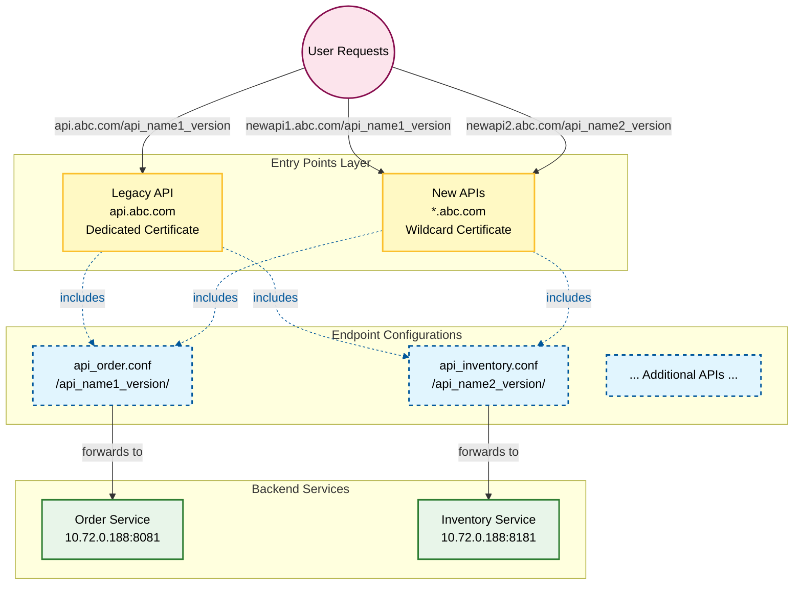

# Nginx Configuration Management: Unifying Multiple API Entry Points

## Overview

This document outlines a strategy for managing multiple API entry points in nginx while maintaining unified configuration management. The goal is to consolidate configuration logic while supporting both legacy and new API access patterns.

## Current Architecture

### Problem Statement
Currently, there are two distinct API access patterns:
- **Legacy API**: Single domain with path-based routing (`api.abc.com/api_name_version/endpoint`)
- **New API**: Multiple domains with shared routing (`newapi1.abc.com/api_name_version/endpoint`, `newapi2.abc.com/api_name_version/endpoint`, etc.)

Each pattern has its own configuration files in separate directories:
- `/etc/nginx/conf.d/` - Legacy API configurations
- `/etc/nginx/vhosts/` - New API configurations

The challenge is to unify the configuration logic while maintaining both access patterns.

### Current Configuration Example

```nginx
user nxadm ngxgrp;
worker_processes 1;
error_log /appvol/nginx/logs/error.log info;

events {
    worker_connections 1024;
}

http {
    include mime.types;
    default_type application/octet-stream;
    server_names_hash_bucket_size 256;
    # increase proxy buffer size
    proxy_buffer_size 32k;
    proxy_buffers 4 128k;
    proxy_busy_buffers_size 256k;

    # increase the header size to 32K
    large_client_header_buffers 4 32k;

    log_format correlation '$remote_addr - $remote_user [$time_local] "$status $bytes_sent" "$http_referer" '
                          '"$http_user_agent" "$http_x_forwarded_for" "$request_id"';
    access_log /appvol/nginx/logs/access.log correlation;

    server_tokens off;
    sendfile on;
    keepalive_timeout 65;

    # Legacy API Server Block
    server {
        listen 443 ssl;
        server_name api.abc.com; # Legacy API entry point

        client_max_body_size 20m;
        underscores_in_headers on;

        # HTTP/2 Support
        http_version 1.1;

        ssl_certificate /etc/ssl/certs/your_cert.crt;
        ssl_certificate_key /etc/ssl/private/your_key.key;
        ssl_dhparam /etc/ssl/certs/your_dhparam.pem;

        ssl_protocols TLSv1.2 TLSv1.3;
        ssl_ciphers ECDHE-ECDSA-AES128-GCM-SHA256:ECDHE-RSA-AES128-GCM-SHA256:ECDHE-RSA-AES256-GCM-SHA384:ECDHE-RSA-AES128-SHA256:ECDHE-RSA-AES256-SHA384;
        ssl_prefer_server_ciphers off;

        # Security headers
        add_header X-Content-Type-Options nosniff always;
        proxy_hide_header x-content-type-options;
        add_header Strict-Transport-Security "max-age=31536000; includeSubDomains; preload" always;
        add_header X-Frame-Options "DENY";

        ssl_session_timeout 5m;
        include /etc/nginx/conf.d/*.conf;  # Legacy API routes
    }
    
    # New API Server Block
    server {
        listen 443 ssl;
        server_name newapi.abc.com; # New API entry point
        client_max_body_size 20m;
        underscores_in_headers on;
        
        # HTTP/2 Support
        http_version 1.1;
        ssl_certificate /etc/ssl/certs/your_cert.crt;
        ssl_certificate_key /etc/ssl/private/your_key.key;
        ssl_dhparam /etc/ssl/certs/your_dhparam.pem;

        ssl_protocols TLSv1.2 TLSv1.3;
        ssl_ciphers ECDHE-ECDSA-AES128-GCM-SHA256:ECDHE-RSA-AES128-GCM-SHA256:ECDHE-RSA-AES256-GCM-SHA384:ECDHE-RSA-AES128-SHA256:ECDHE-RSA-AES256-SHA384;
        ssl_prefer_server_ciphers off;
        
        # Security headers
        add_header X-Content-Type-Options nosniff always;
        proxy_hide_header x-content-type-options;
        add_header Strict-Transport-Security "max-age=31536000; includeSubDomains; preload" always;
        add_header X-Frame-Options "DENY";
        ssl_session_timeout 5m;
        include /etc/nginx/vhosts/*.conf;  # New API routes
    }
}
```

### Current API Configuration Files

**Legacy API Routes** (`/etc/nginx/conf.d/api_name1_version.conf`):
```nginx
location /api_name1_version/ {
    proxy_pass https://10.72.0.188:8081;
    proxy_set_header Host www.aibang.com;
    proxy_set_header X-Real-IP $remote_addr;
    proxy_read_timeout 300s;
    proxy_connect_timeout 300s;
    proxy_send_timeout 300s;
}
```

**New API Routes** (`/etc/nginx/vhosts/newapi1.conf`):
```nginx
location /api_name1_version/ {
    proxy_pass https://10.72.0.188:8081;
    proxy_set_header Host www.aibang.com;
    proxy_set_header X-Real-IP $remote_addr;
}
```

## Proposed Solution: Unified Configuration Architecture

### Conceptual Approach

The solution involves separating concerns by creating a modular configuration structure:

- **Entry Points**: Handle domain routing and SSL termination
- **Endpoints**: Define the actual API routing logic
- **Shared Logic**: Common proxy settings and headers

This approach allows multiple entry points to share the same endpoint configurations.

### Recommended Directory Structure

```bash
/etc/nginx/
├── nginx.conf                 # Main configuration file
├── sites-enabled/             # Entry point configurations
│   ├── 00-legacy-api.conf     # Legacy API entry (api.abc.com)
│   └── 01-new-api-wildcard.conf # New API entry (*.abc.com)
├── endpoints/                 # API routing logic
│   ├── api_order.conf         # Order service routing
│   ├── api_user.conf          # User service routing
│   └── ... (API-specific files)
└── upstreams/                 # Backend server definitions
    └── backend_servers.conf
```

### Implementation Strategy

#### 1. Main Configuration (`nginx.conf`)

```nginx
# /etc/nginx/nginx.conf

user nginx;
worker_processes auto;
error_log /var/log/nginx/error.log warn;
pid /var/run/nginx.pid;

events {
    worker_connections 1024;
}

http {
    include       /etc/nginx/mime.types;
    default_type  application/octet-stream;

    # Log format
    log_format  main  '$remote_addr - $remote_user [$time_local] "$request" '
                      '$status $body_bytes_sent "$http_referer" '
                      '"$http_user_agent" "$http_x_forwarded_for"';
    access_log  /var/log/nginx/access.log  main;

    sendfile        on;
    keepalive_timeout  65;

    # Core optimizations
    server_names_hash_bucket_size 256;
    proxy_buffer_size 32k;
    proxy_buffers 4 128k;
    large_client_header_buffers 4 32k;

    # Load all entry point configurations
    include /etc/nginx/sites-enabled/*.conf;
}
```

#### 2. Endpoint Definitions (`endpoints/`)

**File: `/etc/nginx/endpoints/api_order.conf`**
```nginx
# API Order Service
location /api_name1_version/ {
    proxy_pass https://10.72.0.188:8081;
    proxy_set_header Host www.aibang.com;
    proxy_set_header X-Real-IP $remote_addr;
    proxy_read_timeout 300s;
    proxy_connect_timeout 300s;
    proxy_send_timeout 300s;
}
```

**File: `/etc/nginx/endpoints/api_inventory.conf`**
```nginx
# API Inventory Service
location /api_name2_version/ {
    proxy_pass https://10.72.0.188:8181;
    proxy_set_header Host www.aibang.com;
    proxy_set_header X-Real-IP $remote_addr;
    proxy_read_timeout 300s;
    proxy_connect_timeout 300s;
    proxy_send_timeout 300s;
}
```

#### 3. Entry Point Configurations (`sites-enabled/`)

**Legacy API Entry** (`/etc/nginx/sites-enabled/00-legacy-api.conf`):
```nginx
server {
    listen 443 ssl;
    server_name api.abc.com;

    # Dedicated certificate for legacy API
    ssl_certificate /etc/ssl/certs/legacy.crt;
    ssl_certificate_key /etc/ssl/private/legacy.key;

    # Include all endpoint configurations
    include /etc/nginx/endpoints/*.conf;
}
```

**New API Entry with Wildcard** (`/etc/nginx/sites-enabled/01-new-api-wildcard.conf`):
```nginx
server {
    listen 443 ssl;

    # Wildcard matches all subdomains (newapi1.abc.com, newapi2.abc.com, etc.)
    server_name *.abc.com;

    # Single wildcard certificate for all new API subdomains
    ssl_certificate /etc/ssl/certs/wildcard_abc_com.crt;
    ssl_certificate_key /etc/ssl/private/wildcard_abc_com.key;

    # Include the same endpoint configurations as legacy API
    # This achieves: Two entry points, one configuration
    include /etc/nginx/endpoints/*.conf;
}
```

## Migration Process

### Step 1: Preparation
1. Acquire a wildcard SSL certificate for `*.abc.com`
2. Update DNS records to point `*.abc.com` to your Nginx server IP

### Step 2: Configuration Restructuring
1. Create the new directory structure:
   ```bash
   sudo mkdir -p /etc/nginx/{sites-enabled,endpoints,upstreams}
   ```

2. Extract location blocks from existing configuration files:
   - Move `location` blocks from `/etc/nginx/conf.d/*.conf` to `/etc/nginx/endpoints/*.conf`
   - Move `location` blocks from `/etc/nginx/vhosts/*.conf` to `/etc/nginx/endpoints/*.conf`
   - Ensure no duplicate route definitions exist

### Step 3: Entry Point Setup
1. Create entry point configurations in `/etc/nginx/sites-enabled/`
2. Configure both legacy and new API entry points to include the same endpoint files

### Step 4: Testing and Deployment
1. Validate configuration: `nginx -t`
2. Reload nginx: `nginx -s reload`
3. Test both entry points to ensure functionality
4. Monitor logs for any issues

## Benefits of This Architecture

### 1. Configuration DRY (Don't Repeat Yourself)
- API routing logic is defined in one place
- Changes to backend services only need to be made once
- Reduces risk of configuration inconsistencies

### 2. Scalability
- Easy to add new API endpoints by creating new files in `/etc/nginx/endpoints/`
- Both legacy and new entry points automatically gain access to new endpoints
- Supports unlimited subdomains with wildcard certificate

### 3. Maintainability
- Clear separation of concerns
- Organized directory structure
- Simplified debugging and troubleshooting

### 4. Flexibility
- Supports both legacy and new API access patterns simultaneously
- Gradual migration from legacy to new patterns possible
- Easy to phase out legacy access when ready

## Architecture Visualization



## Implementation Checklist

- [ ] Acquire wildcard SSL certificate for `*.abc.com`
- [ ] Update DNS wildcard record to point to Nginx server
- [ ] Create directory structure: `/etc/nginx/{sites-enabled,endpoints,upstreams}`
- [ ] Extract location blocks from existing configs to `/etc/nginx/endpoints/`
- [ ] Create entry point configs in `/etc/nginx/sites-enabled/`
- [ ] Update main nginx.conf to include sites-enabled
- [ ] Test configuration with `nginx -t`
- [ ] Reload nginx with `nginx -s reload`
- [ ] Verify both legacy and new API endpoints work
- [ ] Monitor logs for any issues
- [ ] Document the new configuration structure for team members