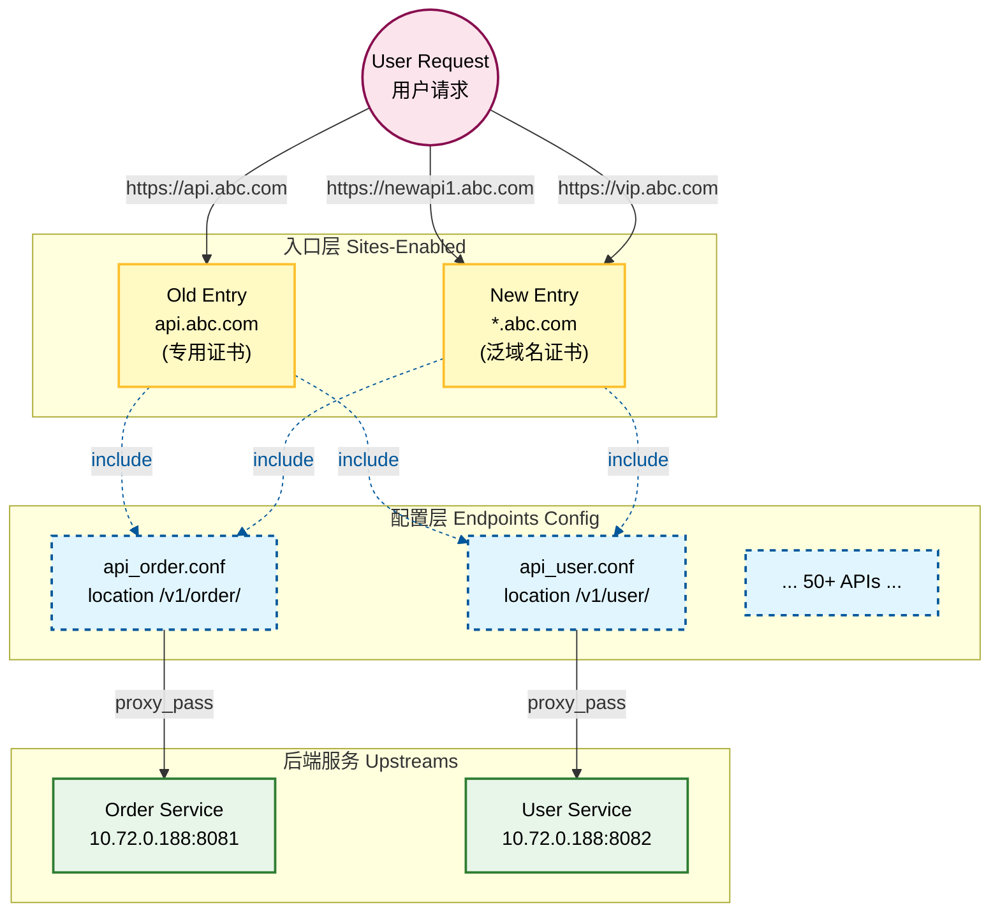

# configuration
- nginx.conf
- the next is my poc configuration
```nginx.conf
user nxadm ngxgrp;
worker_processes 1;
error_log /appvol/nginx/logs/error.log info;

events {
    worker_connections 1024;
}

http {
    include mime.types;
    default_type application/octet-stream;
    server_names_hash_bucket_size 256;
    # increase proxy buffer size
    proxy_buffer_size 32k;
    proxy_buffers 4 128k;
    proxy_busy_buffers_size 256k;

    # increase the header size to 32K
    large_client_header_buffers 4 32k;

    log_format correlation '$remote_addr - $remote_user [$time_local] "$status $bytes_sent" "$http_referer" '
                          '"$http_user_agent" "$http_x_forwarded_for" "$request_id"';
    access_log /appvol/nginx/logs/access.log correlation;

    server_tokens off;
    sendfile on;
    keepalive_timeout 65;

    server {
        listen 443 ssl;
        server_name api.abc.com; # as old api 唯一入口后面根据https://api.abc.com/api_name1_version/v1/

        client_max_body_size 20m;
        underscores_in_headers on;

        # HTTP/2 Support
        http_version 1.1;

        ssl_certificate /etc/ssl/certs/your_cert.crt; # update with your cert
        ssl_certificate_key /etc/ssl/private/your_key.key; # update with your key
        ssl_dhparam /etc/ssl/certs/your_dhparam.pem; # update with your dh param

        ssl_protocols TLSv1.2 TLSv1.3;
        ssl_ciphers ECDHE-ECDSA-AES128-GCM-SHA256:ECDHE-RSA-AES128-GCM-SHA256:ECDHE-RSA-AES256-GCM-SHA384:ECDHE-RSA-AES128-SHA256:ECDHE-RSA-AES256-SHA384;
        ssl_prefer_server_ciphers off;

        # enable HSTS (HTTP Strict Transport Security)
        add_header X-Content-Type-Options nosniff always;
        proxy_hide_header x-content-type-options;
        add_header Strict-Transport-Security "max-age=31536000; includeSubDomains; preload" always;
        add_header X-Frame-Options "DENY";

        ssl_session_timeout 5m;
        include /etc/nginx/conf.d/*.conf;
    }
    server {
        listen 443 ssl;
        server_name newapi.abc.com; # as new api 唯一入口后面根据https://newapi.abc.com 每个 API 都有独立的域名
        client_max_body_size 20m;
        underscores_in_headers on;
        # HTTP/2 Support
        http_version 1.1;
        ssl_certificate /etc/ssl/certs/your_cert.crt; # this cert is for newapi.abc.com
        ssl_certificate_key /etc/ssl/private/your_key.key; # update with your key
        ssl_dhparam /etc/ssl/certs/your_dhparam.pem; # update with your dh param

        ssl_protocols TLSv1.2 TLSv1.3;
        ssl_ciphers ECDHE-ECDSA-AES128-GCM-SHA256:ECDHE-RSA-AES128-GCM-SHA256:ECDHE-RSA-AES256-GCM-SHA384:ECDHE-RSA-AES128-SHA256:ECDHE-RSA-AES256-SHA384;
        ssl_prefer_server_ciphers off;
        # enable HSTS (HTTP Strict Transport Security)
        add_header X-Content-Type-Options nosniff always;
        proxy_hide_header x-content-type-options;
        add_header Strict-Transport-Security "max-age=31536000; includeSubDomains; preload" always;
        add_header X-Frame-Options "DENY";
        ssl_session_timeout 5m;
        include /etc/nginx/vhosts/*.conf; 
    }
}
```
---

## old api
- old api 目录
- `/etc/nginx/conf.d/ 目录 下文件如下`
- api_name2_version.conf
```nginx
location /api_name2_version/ {
    proxy_pass https://10.72.0.188:8181;
    proxy_set_header Host www.aibang.com;
    proxy_set_header X-Real-IP $remote_addr;
    proxy_read_timeout 300s;
    proxy_connect_timeout 300s;
    proxy_send_timeout 300s;
}
```
- api_name1_version.conf
```nginx
location /api_name1_version/ {
    proxy_pass https://10.72.0.188:8081;
    proxy_set_header Host www.aibang.com;
    proxy_set_header X-Real-IP $remote_addr;
    proxy_read_timeout 300s;
    proxy_connect_timeout 300s;
    proxy_send_timeout 300s;
}
```
the url is
- https://api.abc.com/api_name2_version/endpoint
- https://api.abc.com/api_name1_version/endpoint
在这个模式下面的 API都是都统一入口。 
api.abc.com + api_name_version + endpoint


## new api 
- new api 目录
- `/etc/nginx/vhosts/ 目录 下文件如下`
- 这个目录里边的特点就是这些 API，它都要有自己独立的证书。 也就是说他要走自己独立的域名来访问 ，所以说必须要配置。 
- newapi1
```nginx
location /api_name1_version/ {
    proxy_pass https://10.72.0.188:8081;
    proxy_set_header Host www.aibang.com;
    proxy_set_header X-Real-IP $remote_addr;
```
- newapi2    
```nginx
location /api_name2_version/ {
    proxy_pass https://10.72.0.188:8181;
    proxy_set_header Host www.aibang.com;
    proxy_set_header X-Real-IP $remote_addr;
    proxy_read_timeout 300s;
    proxy_connect_timeout 300s;
    proxy_send_timeout 300s;
}
```
- the url is 
  - https://newapi.abc.com/api_name1_version/endpoint
  - https://newapi2.abc.com/api_name2_version/endpoint


在这个模式下面的 API都是走这个模式。 
newapi.abc.com + api_name_version + endpoint
newapi2.abc.com + api_name_version + endpoint

在上面任何一个模式下面 api_name_version 我们认为他都是不重复的。

我现在想实现这样一个目的。 conf.d 和 vhosts 两个目录下的文件，我希望他们能够合并到一起。 
也就是我虽然在外部提供了不同的入口 ，但是我要在这里做一次统一的配置。  因为最终这些新域名的入口也就是说不同的域名的这些都要切换到我的统一入口api.abc.com 这个域名下面来 

但是短期来说 ，你可以理解我同时提供了两个入口。 但是我如果做了对应的配置之后 ，或者说对外提供了两个域名到用户的 API都是可以访问的。 
因为我不同的域名可能要调用不同的证书。 所以说我需要保留这个new api for different domain 的入口。  


---

# 探索方案：统一配置管理与最佳实践 (Exploration: Unified Config Management & Best Practices)

> 💡 **写给"小白"的导读**：
> 想象你在管理一个拥有 50 个房间的大酒店（你的 50 个 API）。
> *   **Old API** 是酒店的正门。
> *   **New API** 是为你尊贵的 VIP 客户开的 50 个专用侧门。
> 若每个门都得配一个独立的保安（配置文件）去记谁能进哪个房间，当你改房间号时，你得通知 51 个保安，累死人！
> 
> **本方案的核心思想**：把"去哪个房间"这张地图（API 规则）统一印在一张纸上，贴在所有门口。保安只负责检查证件（SSL），然后看这一张统一的地图就行了。

---

## 1. 核心架构规划：模块化目录结构 (The "Tree")

这是我们新的家（配置目录），每个文件夹都有明确的分工：

```bash
/etc/nginx/
├── nginx.conf                 # 【总司令】：主配置文件，只管全局，不具体管业务。
│
├── sites-enabled/             # 【大门】：这里定义了流量从哪里进（域名、端口、证书）。
│   ├── 00-legacy-api.conf     # Old API 入口 (api.abc.com)
│   └── 01-new-api-wildcard.conf # New API 入口 (*.abc.com) -> 这个泛域名就是"万能侧门"
│
├── endpoints/                 # 【地图】：这里定义了流量要去哪里（具体的 API 转发逻辑）。
│   ├── api_order.conf         # 订单服务去哪...
│   ├── api_user.conf          # 用户服务去哪...
│   └── ... (50+ 个文件，每个文件只写 location)
│
└── upstreams/                 # (可选)【后台】：定义后端服务器列表。
    └── backend_servers.conf   
```

---

## 2. 详细配置参考 (Full Configuration)

### 2.1 主配置文件 (`nginx.conf`)
这是 Nginx 的心脏。为了让你完全放心，我提供一个**完整的、标准的**配置供参考。

```nginx
# /etc/nginx/nginx.conf

user nginx;
worker_processes auto;
error_log /var/log/nginx/error.log warn;
pid /var/run/nginx.pid;

events {
    worker_connections 1024;
}

http {
    include       /etc/nginx/mime.types;
    default_type  application/octet-stream;

    # 日志格式
    log_format  main  '$remote_addr - $remote_user [$time_local] "$request" '
                      '$status $body_bytes_sent "$http_referer" '
                      '"$http_user_agent" "$http_x_forwarded_for"';
    access_log  /var/log/nginx/access.log  main;

    sendfile        on;
    keepalive_timeout  65;
    
    # 核心优化
    server_names_hash_bucket_size 256;
    proxy_buffer_size 32k;
    proxy_buffers 4 128k;
    large_client_header_buffers 4 32k;

    # 【关键点】：加载所有入口配置
    # 注意：我们不再直接在这里写 Server 块，而是去 include sites-enabled 里的文件
    include /etc/nginx/sites-enabled/*.conf;
}
```

### 2.2 定义"地图" (`endpoints/`)
这里是**唯一**定义业务逻辑的地方。

**文件：`/etc/nginx/endpoints/api_order.conf`**
```nginx
# 只写 location，不要写 frame（Server）
location /v1/order/ {
    proxy_pass https://10.72.0.188:8081;
    proxy_set_header Host www.aibang.com;
    # ... 其他通用配置
}
```

**文件：`/etc/nginx/endpoints/api_user.conf`**
```nginx
location /v1/user/ {
    proxy_pass https://10.72.0.188:8082;
    proxy_set_header Host www.aibang.com;
}
```

### 2.3 配置"大门" (`sites-enabled/`)

#### 大门 A：Old API 入口
**文件：`/etc/nginx/sites-enabled/00-legacy-api.conf`**
```nginx
server {
    listen 443 ssl;
    server_name api.abc.com;
    
    # 专有证书
    ssl_certificate /etc/ssl/certs/legacy.crt; 
    ssl_certificate_key /etc/ssl/private/legacy.key;

    # 【关键】：让这个入口拥有所有名为 "endpoints" 的能力
    include /etc/nginx/endpoints/*.conf;
}
```

#### 大门 B：New API 入口 (泛域名 + 泛解析)
针对你的 50 个 API，我们使用 `*.abc.com` 来统一接管，而不是写 50 个 server 块。

**文件：`/etc/nginx/sites-enabled/01-new-api-wildcard.conf`**
```nginx
server {
    listen 443 ssl;
    
    # 【高光时刻】：泛域名匹配所有二级子域名
    # 无论是 newapi1.abc.com 还是 vip.abc.com，都进这个门
    server_name *.abc.com; 

    # 只需要一张泛域名证书
    ssl_certificate /etc/ssl/certs/wildcard_abc_com.crt; 
    ssl_certificate_key /etc/ssl/private/wildcard_abc_com.key;

    # 【关键】：它也拥有同样的 "endpoints" 能力！
    # 这样你就实现了：两套入口，一套配置。
    include /etc/nginx/endpoints/*.conf;
}
```

---

## 3. 从零开始的实施流程 (Markdown Follow)

如果你明天就要开始干，请按这个清单操作：

1.  **准备阶段**
    *   [ ] 申请一张泛域名证书 `*.abc.com`。
    *   [ ] 在 DNS 服务商处，添加一条泛解析记录：`*.abc.com -> A 记录 -> 你的 Nginx IP`。

2.  **配置搬家**
    *   [ ] 创建目录：`mkdir -p /etc/nginx/{endpoints,sites-enabled}`。
    *   [ ] **做减法**：把旧配置里的 `location /api_xxx { ... }` 这段代码剪切出来，粘贴到 `/etc/nginx/endpoints/api_xxx.conf` 新文件里。
    *   [ ] 重复 50 次？不，用脚本或者手动处理完这 50 个 API。

3.  **重新开门**
    *   [ ] 按照上面的示例，创建 `00-legacy-api.conf` (引用旧证书, include endpoints)。
    *   [ ] 按照上面的示例，创建 `01-new-api-wildcard.conf` (引用泛证书, include endpoints)。

4.  **验证与上线**
    *   [ ] 运行 `nginx -t` 测试配置是否正确。
    *   [ ] 运行 `nginx -s reload` 重载。
    *   [ ] 测试旧入口：访问 `https://api.abc.com/v1/order/` -> 成功。
    *   [ ] 测试新入口：访问 `https://newapi1.abc.com/v1/order/` -> 成功。

这样，你不仅解决了当下的问题，还为未来打好了完美的基础！以后不管你要加什么 `api_shopping`，只需要在 `endpoints/` 加一个文件，reload 一下，所有入口（旧的、新的、甚至未来的）都会自动支持该服务。


---

## 5. 架构可视化流程图 (Architecture Diagram)

为了帮你更直观地理解整个流量走向和配置复用关系，请看下图：



**图解说明 (Diagram Legend)**:
*   **粉色圆圈 (User)**: 用户的发起请求，用户不知道后端结构，只知道访问不同域名。
*   **黄色方块 (Entry Points)**: 你的 Nginx "大门"。
    *   左边是旧门，专人专闸。
    *   右边是新门（泛域名），万能闸口。
*   **蓝色虚线框 (Config Modules)**: 被抽取出来的公共配置（"地图"）。**注意虚线箭头**表示 `include` 引用关系，这意味着无论从哪个门进，最终执行的逻辑都是这里定义的。
*   **绿色方块 (Backends)**: 最终干活的服务器。
