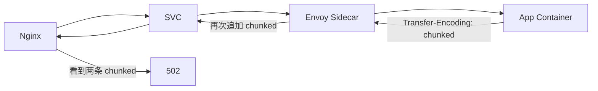
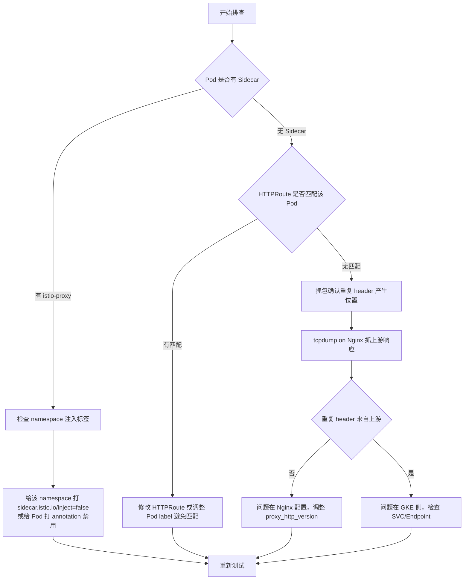
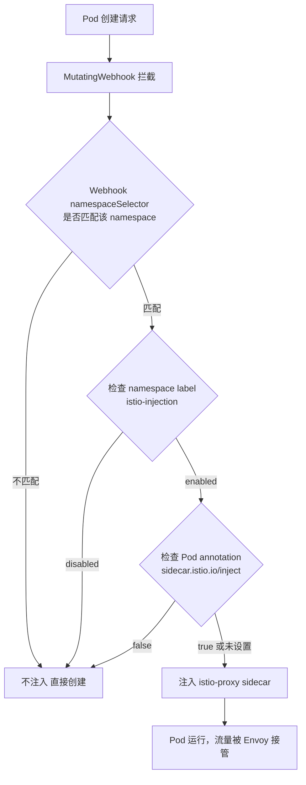
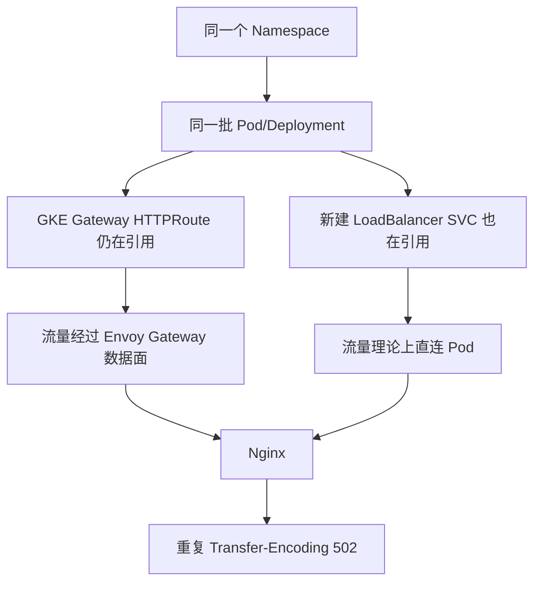
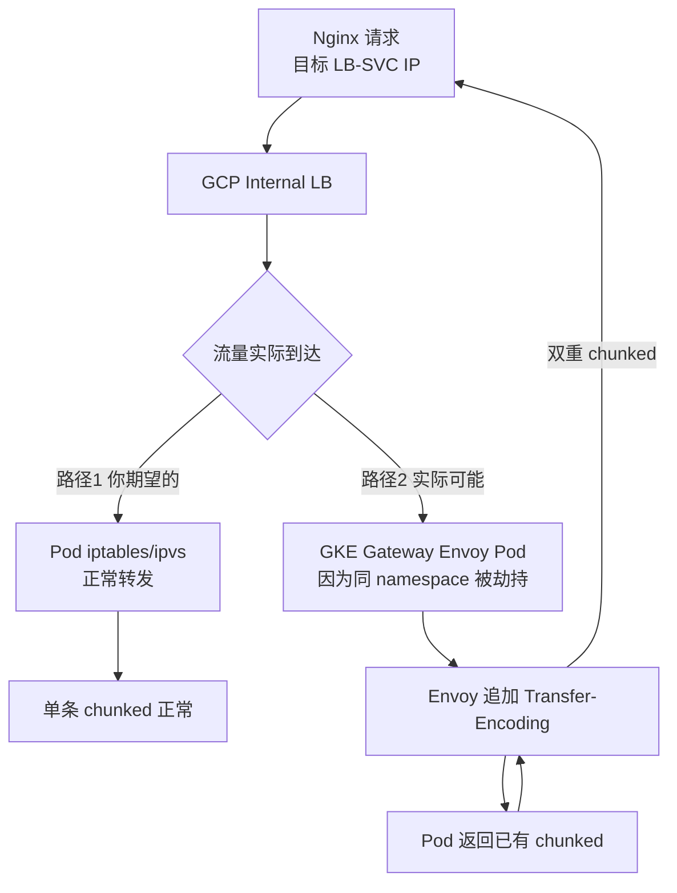
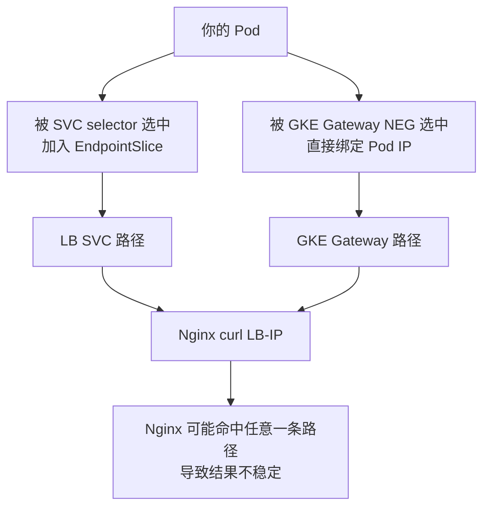
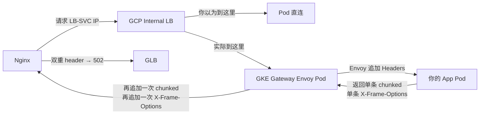

- [Phenomenon](#phenomenon)
  - [问题分析](#问题分析)
  - [可能原因逐层排查](#可能原因逐层排查)
    - [原因 1：GKE 集群内存在 Envoy/Istio Sidecar（最高嫌疑）](#原因-1gke-集群内存在-envoyistio-sidecar最高嫌疑)
    - [原因 2：GKE Gateway 的 BackendPolicy / HTTPRoute 仍在影响流量](#原因-2gke-gateway-的-backendpolicy--httproute-仍在影响流量)
    - [原因 3：Nginx 自身的 chunked 处理配置问题](#原因-3nginx-自身的-chunked-处理配置问题)
    - [原因 4：GLB（Internal HTTPS LB）的 HTTP/2 → HTTP/1.1 转换](#原因-4glbinternal-https-lb的-http2--http11-转换)
  - [推荐排查步骤](#推荐排查步骤)
    - [关键抓包命令](#关键抓包命令)
  - [快速验证方法](#快速验证方法)
  - [注意事项](#注意事项)
  - [问题分析](#问题分析-1)
  - [GKE Enterprise CSM 的正确 Sidecar 控制方式](#gke-enterprise-csm-的正确-sidecar-控制方式)
    - [方式 1：Namespace 级别控制（标准方式）](#方式-1namespace-级别控制标准方式)
    - [方式 2：Pod 级别控制（GKE Enterprise 标准 Annotation）](#方式-2pod-级别控制gke-enterprise-标准-annotation)
  - [验证当前集群的 CSM 注入配置](#验证当前集群的-csm-注入配置)
  - [GKE Enterprise CSM 的注入判断流程](#gke-enterprise-csm-的注入判断流程)
  - [针对你的场景：绕开 CSM 干扰的推荐方案](#针对你的场景绕开-csm-干扰的推荐方案)
    - [方案 A：对问题 Deployment 禁用注入（最小影响）](#方案-a对问题-deployment-禁用注入最小影响)
    - [方案 B：确认 CSM revision 标签（Enterprise 多版本场景）](#方案-b确认-csm-revision-标签enterprise-多版本场景)
  - [快速诊断命令汇总](#快速诊断命令汇总)
  - [注意事项](#注意事项-1)
  - [背景理解](#背景理解)
  - [GKE Enterprise 下的双重引用机制分析](#gke-enterprise-下的双重引用机制分析)
    - [GKE Gateway 如何"引用" Pod](#gke-gateway-如何引用-pod)
    - [两条路径的实际流量走向](#两条路径的实际流量走向)
  - [关键排查：确认流量是否被 Gateway Envoy 劫持](#关键排查确认流量是否被-gateway-envoy-劫持)
    - [Step 1：确认 HTTPRoute 的 backendRef 是否还指向你的 SVC](#step-1确认-httproute-的-backendref-是否还指向你的-svc)
    - [Step 2：确认 Pod 实际收到的请求来源 IP](#step-2确认-pod-实际收到的请求来源-ip)
    - [Step 3：对比 EndpointSlice 被谁消费](#step-3对比-endpointslice-被谁消费)
  - [问题根因：NEG 与 SVC 的双重绑定](#问题根因neg-与-svc-的双重绑定)
  - [解决方案](#解决方案)
    - [方案 A：迁移期间隔离 Pod（推荐）](#方案-a迁移期间隔离-pod推荐)
    - [方案 B：直接删除 HTTPRoute（如旧路径已不需要）](#方案-b直接删除-httproute如旧路径已不需要)
    - [方案 C：检查并清理 BackendPolicy 残留](#方案-c检查并清理-backendpolicy-残留)
  - [注意事项](#注意事项-2)
  - [直接结论](#直接结论)
  - [实际流量路径（与你预期不符）](#实际流量路径与你预期不符)
  - [为什么会这样：NEG 路由问题](#为什么会这样neg-路由问题)
  - [关键验证：确认 Envoy Pod IP](#关键验证确认-envoy-pod-ip)
  - [解决方案](#解决方案-1)
    - [立即止血：强制 SVC 走 NodePort 模式而非 NEG](#立即止血强制-svc-走-nodeport-模式而非-neg)
    - [根治：删除旧 HTTPRoute 切断 Gateway 对这批 Pod 的引用](#根治删除旧-httproute-切断-gateway-对这批-pod-的引用)
  - [预期修复后的响应头](#预期修复后的响应头)

#  Phenomenon
```bash
我现在遇到下面这样一个问题通过 在我的谷歌工程里面，我使用Internal的glb httpsx 协议 后面跟一个Nginx
Flow
Glb nginx GKE svc
我最初配置了nginx +GKE gateway

Nginx 反代访问时，Nginx 报错并返回 502：
• upstream sent duplicate header line: "Transfer-Encoding:
chunked"
... while reading response header from upstream
2.从 Nginx 机器上直接 curl 上游时“看起来能拿到结果”，但用-V 打印响应头后，
• Transfer-Encoding: chunked 出现两次（重复 header）
3. 在Pod 内用 curl 直连：8080时，响应头里 只有一条 Transfer-Encodin
那么我应该如何排查这个问题？

其实我已经尝试绕开GKE Gateway,直接通过GKE里面的一个SVC来暴露我的服务,当然我暴露这个服务用的是load balance的IP,但是看起来只要从外部访问,经过我的NGX,就会出现这种问题,那么可能的原因还有哪些呢?因为我的集群里边既有GKE的Gateway,又有普通的没有经过GKE Gateway的一些deployment。
```

## 问题分析

根据你描述的现象，核心矛盾点非常清晰：

| 访问路径                              | 结果                                |
| ------------------------------------- | ----------------------------------- |
| Pod 内 `curl :8080`                   | ✅ 单条 `Transfer-Encoding: chunked` |
| Nginx 机器 `curl` SVC LoadBalancer IP | ⚠️ 双重 `Transfer-Encoding: chunked` |
| GLB → Nginx → GKE SVC                 | ❌ 502                               |

**重复 header 的根本原因**：链路中某一层在已有 `Transfer-Encoding: chunked` 的情况下**再次追加**了该 header，而不是透传。

---

## 可能原因逐层排查

### 原因 1：GKE 集群内存在 Envoy/Istio Sidecar（最高嫌疑）

你的集群里**同时存在 GKE Gateway**，GKE Gateway 使用的是 Envoy 作为数据面。如果你的 Namespace 或 Pod 被注入了 **Istio/Cloud Service Mesh sidecar**，即使你绕开了 GKE Gateway 资源，流量依然会经过 sidecar proxy。

```bash
# 检查目标 Pod 是否有 sidecar 注入
kubectl get pod <pod-name> -n <namespace> -o jsonpath='{.spec.containers[*].name}'

# 如果输出里包含 istio-proxy 或 envoy，则存在 sidecar
kubectl describe pod <pod-name> -n <namespace> | grep -i "istio\|envoy\|sidecar"

# 检查 namespace 是否开启了自动注入
kubectl get namespace <namespace> --show-labels | grep istio-injection
```

**Sidecar 导致重复 header 的机制：**



---

### 原因 2：GKE Gateway 的 BackendPolicy / HTTPRoute 仍在影响流量

即使你创建了新的普通 SVC（LoadBalancer），如果集群里的 GKE Gateway 有 `HTTPRoute` 通过 **label selector** 匹配到了你的 Pod，流量依然可能被 Gateway 数据面介入。

```bash
# 检查所有 HTTPRoute，看是否有匹配到你的 Service 或 Pod label
kubectl get httproute -A -o yaml | grep -A5 "backendRefs"

# 检查 GKEGateway 的 BackendPolicy
kubectl get gcpbackendpolicy -A
kubectl get healthcheckpolicy -A
```

---

### 原因 3：Nginx 自身的 chunked 处理配置问题

当上游返回 `Transfer-Encoding: chunked` 时，Nginx 作为反代默认会**解码 chunked** 然后重新封装。但如果上游同时返回了某些触发 Nginx 直接透传的条件（如 `proxy_pass` 使用了 HTTP/1.0，或配置了 `proxy_buffering off`），可能导致行为异常。

```nginx
# 检查你的 nginx 反代配置
# 关键指令
proxy_http_version 1.1;          # 必须是 1.1，否则 chunked 行为异常
proxy_buffering off;              # 这个配置会改变 chunked 处理方式

# 建议配置
location / {
    proxy_pass http://<SVC-LB-IP>;
    proxy_http_version 1.1;
    proxy_set_header Connection "";        # 清除 hop-by-hop header
    proxy_set_header Host $host;
    
    # 明确处理 chunked
    chunked_transfer_encoding on;
}
```

---

### 原因 4：GLB（Internal HTTPS LB）的 HTTP/2 → HTTP/1.1 转换

Internal GLB 与后端（Nginx）之间默认使用 **HTTP/2**，而 HTTP/2 本身没有 `Transfer-Encoding: chunked`（使用 DATA frame 替代）。当 GLB 将响应从 HTTP/2 转换回 HTTP/1.1 时，如果后端响应已经包含了 chunked header，可能出现重复追加。

```bash
# 在 Nginx 机器上，测试直接 HTTP/1.1 vs HTTP/2 的响应差异
curl -v --http1.1 http://<SVC-LB-IP>/path 2>&1 | grep -i "transfer\|encoding"
curl -v --http2 https://<SVC-LB-IP>/path 2>&1 | grep -i "transfer\|encoding"
```

---

## 推荐排查步骤



### 关键抓包命令

```bash
# 在 Nginx 机器上抓包，过滤到 SVC LB IP 的流量
sudo tcpdump -i eth0 -A host <SVC-LB-IP> and port 80 -w /tmp/abjture.pabj

# 用 tcpdump 直接看 header（不写文件）
sudo tcpdump -i eth0 -A host <SVC-LB-IP> and port 80 2>/dev/null | grep -i "transfer-encoding"
```

---

## 快速验证方法

```bash
# Step 1: 确认 Pod 内响应干净
kubectl exec -it <pod> -- curl -sv http://localhost:8080/ 2>&1 | grep -i transfer

# Step 2: 确认 SVC ClusterIP 响应（在集群内节点上）
curl -sv http://<ClusterIP>:<port>/ 2>&1 | grep -i transfer

# Step 3: 确认 SVC LoadBalancer IP 响应（在 Nginx 机器上）
curl -sv http://<LB-IP>:<port>/ 2>&1 | grep -i transfer

# 如果 Step2 干净但 Step3 有重复 → 问题在 LB/Cloud 网络层
# 如果 Step2 已经重复 → 问题在集群内（sidecar 可能性极大）
```

---

## 注意事项

- **优先排查 Sidecar 注入**，这是混合使用 GKE Gateway 的集群里最常见的"幽灵干扰"来源
- 确认 Nginx `proxy_http_version 1.1` 且 `proxy_set_header Connection ""` 已配置
- Internal GLB 后端协议建议统一为 **HTTP/1.1**，避免协议转换引入额外 header 操作
- 如果确认是 sidecar 问题，不要直接删除 sidecar，而是通过 annotation 控制：

```yaml
# 在 Pod spec 中禁用 sidecar 注入
annotations:
  sidecar.istio.io/inject: "false"
```

## 问题分析

你使用的是 **GKE Enterprise**，其内置的服务网格是 **Cloud Service Mesh (CSM)**，前身是 Anthos Service Mesh (ASM)，基于 Istio 但由 Google 托管，注入和控制方式与社区 Istio 有差异。

---

## GKE Enterprise CSM 的正确 Sidecar 控制方式

### 方式 1：Namespace 级别控制（标准方式）

```bash
# 查看当前 namespace 的注入标签
kubectl get namespace <your-namespace> --show-labels

# GKE Enterprise CSM 使用的标签键名
# 启用注入
kubectl label namespace <your-namespace> istio-injection=enabled --overwrite

# 禁用注入（对新 Pod 生效，存量 Pod 需重建）
kubectl label namespace <your-namespace> istio-injection=disabled --overwrite

# 或者移除标签（行为取决于 MeshConfig 的 defaultConfig）
kubectl label namespace <your-namespace> istio-injection-
```

### 方式 2：Pod 级别控制（GKE Enterprise 标准 Annotation）

```yaml
apiVersion: apps/v1
kind: Deployment
metadata:
  name: your-app
spec:
  template:
    metadata:
      annotations:
        # GKE Enterprise CSM 标准注解
        sidecar.istio.io/inject: "false"
    spec:
      containers:
        - name: your-app
          image: your-image
```

---

## 验证当前集群的 CSM 注入配置

```bash
# 1. 确认 CSM / ASM 控制面版本和模式
kubectl get controlplanerevision -n istio-system
kubectl get pods -n istio-system

# 2. 查看 MeshConfig，确认默认注入策略
kubectl get configmap istio -n istio-system -o jsonpath='{.data.mesh}' | grep -A3 "defaultConfig\|enableAutoMtls\|injection"

# 3. 查看注入的 webhook 配置（决定哪些 namespace 被拦截）
kubectl get mutatingwebhookconfiguration | grep -i istio
kubectl get mutatingwebhookconfiguration istiod-asm-<revision> -o yaml | grep -A10 "namespaceSelector"
```

---

## GKE Enterprise CSM 的注入判断流程



---

## 针对你的场景：绕开 CSM 干扰的推荐方案

### 方案 A：对问题 Deployment 禁用注入（最小影响）

```bash
# 确认当前 Pod 是否有 sidecar
kubectl get pod <pod-name> -n <namespace> \
  -o jsonpath='{.spec.containers[*].name}' && echo

# 如果含有 istio-proxy，patch 该 deployment 禁用注入
kubectl patch deployment <your-deployment> -n <namespace> \
  --type=json \
  -p='[{"op":"add","path":"/spec/template/metadata/annotations","value":{"sidecar.istio.io/inject":"false"}}]'

# 触发滚动重启使其生效
kubectl rollout restart deployment/<your-deployment> -n <namespace>

# 验证新 Pod 不再有 sidecar
kubectl get pod -n <namespace> -l app=<your-app> \
  -o jsonpath='{.items[0].spec.containers[*].name}'
```

### 方案 B：确认 CSM revision 标签（Enterprise 多版本场景）

GKE Enterprise 经常使用 **revision-based injection**，标签不是 `istio-injection` 而是 `istio.io/rev`：

```bash
# 查看当前 revision 名称
kubectl get controlplanerevision -n istio-system

# 如果 namespace 使用的是 revision 标签
kubectl get namespace <your-namespace> --show-labels | grep istio

# revision 模式下禁用注入的正确方式：移除 rev 标签
kubectl label namespace <your-namespace> istio.io/rev- --overwrite

# 同时加上显式禁用（双保险）
kubectl label namespace <your-namespace> istio-injection=disabled --overwrite
```

---

## 快速诊断命令汇总

```bash
# 一键检查整个集群的注入状态
echo "=== Namespace 注入标签 ===" && \
kubectl get namespace -L istio-injection,istio.io/rev && \
echo "=== MutatingWebhook ===" && \
kubectl get mutatingwebhookconfiguration | grep istio && \
echo "=== 目标 Pod Containers ===" && \
kubectl get pod -n <namespace> -o custom-columns=\
'NAME:.metadata.name,CONTAINERS:.spec.containers[*].name,ANNOTATIONS:.metadata.annotations'
```

---

## 注意事项

| 操作                 | 影响范围                | 生效时机             |
| -------------------- | ----------------------- | -------------------- |
| 修改 namespace label | 该 namespace 所有新 Pod | 立即（存量需重建）   |
| 修改 Pod annotation  | 单个 Deployment         | `rollout restart` 后 |
| 修改 MeshConfig      | 全集群默认行为          | **谨慎操作，需审批** |

- GKE Enterprise CSM 中，**不要直接修改 `istiod` 的 ConfigMap**，应通过 `ControlPlaneRevision` CRD 或 Google Cloud Console 管理
- 禁用 sidecar 后，该服务将**退出 mTLS 自动加密和流量策略**，如有安全合规要求需评估影响
- 建议在 staging 环境验证后再操作生产

## 背景理解

你的场景本质是一个**迁移中间态**：



**核心问题**：你以为走的是 `LB SVC → Pod` 直连路径，但实际上 GKE Gateway 的数据面（Envoy）可能仍在拦截流量。

---

## GKE Enterprise 下的双重引用机制分析

### GKE Gateway 如何"引用" Pod

GKE Gateway 不通过 SVC 的 ClusterIP 转发，而是**直接通过 EndpointSlice 拿到 Pod IP**，绕过 kube-proxy：

```bash
# 验证 GKE Gateway 的 Backend 是否直接指向 Pod IP
kubectl get endpointslice -n <namespace> -o wide

# 查看 GKE Gateway 生成的 GCP Backend Service
kubectl get gcpbackendpolicy -n <namespace> -o yaml

# 查看 HTTPRoute 当前绑定的 backend
kubectl get httproute -n <namespace> -o yaml | grep -A10 "backendRefs"
```

### 两条路径的实际流量走向



---

## 关键排查：确认流量是否被 Gateway Envoy 劫持

### Step 1：确认 HTTPRoute 的 backendRef 是否还指向你的 SVC

```bash
# 列出所有 HTTPRoute
kubectl get httproute -A

# 详细查看是否引用了你的 Service
kubectl get httproute -n <namespace> <route-name> -o yaml
```

输出重点关注：

```yaml
spec:
  rules:
    - backendRefs:
        - name: your-service   # ← 如果这里还是你的 SVC，Gateway 仍在介入
          port: 80
```

### Step 2：确认 Pod 实际收到的请求来源 IP

```bash
# 在 Pod 内抓包，看请求来源 IP 是否是 Envoy Pod IP 而非 Nginx IP
kubectl exec -it <pod-name> -n <namespace> -- \
  tcpdump -i eth0 -nn 'tcp port 8080' -A 2>/dev/null | grep -E "IP |transfer"

# 同时查看 GKE Gateway（Envoy）Pod 的 IP 范围
kubectl get pods -n <gateway-namespace> -o wide | grep -i gateway
```

### Step 3：对比 EndpointSlice 被谁消费

```bash
# 查看你的 SVC 对应的 EndpointSlice
kubectl get endpointslice -n <namespace> \
  -l kubernetes.io/service-name=<your-svc-name> -o yaml

# 查看 GKE Gateway 对应的 NEG（Network Endpoint Group）
# GKE Gateway 使用 NEG 直接绑定 Pod IP
gcloud compute network-endpoint-groups list \
  --filter="name~<your-namespace>" \
  --format="table(name,networkEndpointType,size)"
```

---

## 问题根因：NEG 与 SVC 的双重绑定



GKE Gateway 创建的 **NEG（Network Endpoint Group）** 是通过 Pod label 直接绑定的，**和你新建的 LB SVC 互相独立但共享同一批 Pod IP**。

---

## 解决方案

### 方案 A：迁移期间隔离 Pod（推荐）

给旧的 Gateway 路径和新的 SVC 路径使用**不同的 Pod label**，彻底隔离：

```yaml
# 新 Deployment（走 LB SVC 路径）
metadata:
  labels:
    app: your-app
    routing: direct-lb        # 新增区分标签

# 新 SVC selector 只选新 label
spec:
  selector:
    app: your-app
    routing: direct-lb

# 旧 HTTPRoute backendRef 对应的 SVC selector
spec:
  selector:
    app: your-app
    routing: gateway          # 旧路径保持不变
```

### 方案 B：直接删除 HTTPRoute（如旧路径已不需要）

```bash
# 确认 HTTPRoute 列表
kubectl get httproute -n <namespace>

# 删除旧 HTTPRoute，切断 GKE Gateway 对该 Pod 的引用
kubectl delete httproute <route-name> -n <namespace>

# 验证 NEG 是否自动解绑
gcloud compute network-endpoint-groups list \
  --filter="name~<your-namespace>"
```

### 方案 C：检查并清理 BackendPolicy 残留

```bash
# GKE Gateway 相关资源全量检查
kubectl get httproute,gcpbackendpolicy,healthcheckpolicy,gcpgatewaypolicy -n <namespace>

# 逐一确认是否还引用你的 Pod/SVC
kubectl get gcpbackendpolicy -n <namespace> -o yaml | grep -A5 "targetRef"
```

---

## 注意事项

| 检查项                | 命令                                    | 预期结果                   |
| --------------------- | --------------------------------------- | -------------------------- |
| HTTPRoute 是否仍绑定  | `kubectl get httproute -n <ns> -o yaml` | backendRef 已移除或不存在  |
| NEG 是否自动清理      | `gcloud compute negs list`              | 无对应 namespace 的 NEG    |
| Pod 收到请求的来源 IP | Pod 内 tcpdump                          | 来源是 Nginx IP 而非 Envoy |
| SVC Endpoints 正常    | `kubectl get endpoints <svc>`           | 只有你的 Pod IP            |

- **迁移期间最危险的状态**就是你现在的状态：两条路径共享同一批 Pod，流量命中哪条路径具有随机性，导致问题难以稳定复现
- 建议优先执行 **Step 1 的 HTTPRoute 检查**，大概率会发现旧 HTTPRoute 仍然存在并引用你的 SVC


下面结果是我从 Nginx上请求的头
```bash
* We are completely uploaded and fine
< HTTP/1.1200
< Date: Thu, 19 Mar 2026 00:55:32 GMT
< Server: istio-envoy
< X-Frame-Options: SAMEORIGIN
< X-Frame-Options: DENY
< Strict-Transport-Security: max-age=31536000；
includeSubDomains; preload
< X-RateLimit-Remaining-Minute: 99
< RateLimit-Reset: 28
< RateLimit-Remaining: 99
< RateLimit-Limit: 100
< X-RateLimit-Limit-Minute: 100
< x-content-type-options: nosniff
< x-Xss-protection: 1; mode=block
< cache-control: max-age=0, no-store
< pragma: no-cache
< pragma: no-cache
< expires: 0
< X-envoy-upstream-service-time: 447
<x-request-id: d9fa3055-f1c0-4a08-a79f-249c86ff2087：-：-：-
< x-aibang-request-correlation-id: 123456
< Content-Security-Policy: default-src 'self'；
< S: rproxy_hkg3v|7600
< Keep-Alive: timeout=5, max=100
< Connection: Keep-Alive
< Transfer-Encoding: chunked
< Content-Type: application/json
< Transfer-Encoding: chunked

｛ ［7364 bytes data］
* Connection #O to host 192.168.95.152 left intact
```
特别是这几个
< Server: istio-envoy
< X-Frame-Options: SAMEORIGIN
< X-Frame-Options: DENY
我环境里没有装istio的东西为什么会有这些 而且明显是Transfer-Encoding: chunked 重复了


## 直接结论

你的响应头已经**实锤**了问题所在，三个关键证据：

| 异常 Header                           | 说明                                         |
| ------------------------------------- | -------------------------------------------- |
| `Server: istio-envoy`                 | 流量**确实经过了 Envoy**，不管你装没装 Istio |
| `X-Frame-Options` 出现两次            | 两层代理各自追加了一次                       |
| `Transfer-Encoding: chunked` 出现两次 | 同上，两层各追加一次                         |

**你没有装 Istio，但 `Server: istio-envoy` 出现了** —— 这只有一个解释：

> **GKE Gateway 的数据面就是 Envoy，它自己标注 `Server: istio-envoy`**，你的流量仍然在经过 GKE Gateway 的 Envoy 代理层，而不是直连 Pod。

---

## 实际流量路径（与你预期不符）



---

## 为什么会这样：NEG 路由问题

你新建的 LoadBalancer SVC，其背后的 **GCP Backend** 很可能指向的不是 Pod 的 NodePort，而是被 GKE Gateway 创建的 **NEG（Network Endpoint Group）** 复用了，导致流量兜回 Envoy。

```bash
# 立即执行：确认你的 LB SVC 背后的 NEG 类型
kubectl describe svc <your-svc-name> -n <namespace>
# 重点看 Annotations 里是否有：
# cloud.google.com/neg: '{"ingress":true}' 或类似 NEG 注解

# 查看该 SVC 对应的 NEG
gcloud compute network-endpoint-groups list \
  --format="table(name,networkEndpointType,region,size)" \
  | grep <namespace>

# 查看 NEG 里的实际 endpoint 是 Pod IP 还是 Envoy Pod IP
gcloud compute network-endpoint-groups list-network-endpoints \
  <neg-name> --zone=<zone> \
  --format="table(networkEndpoint.ipAddress,networkEndpoint.port)"
```

---

## 关键验证：确认 Envoy Pod IP

```bash
# 找到 GKE Gateway 的 Envoy Pod IP
kubectl get pods -n <gateway-namespace> -o wide | grep -i "gateway\|envoy"

# 在你的 App Pod 内抓包，看请求来源 IP
kubectl exec -it <your-pod> -n <namespace> -- \
  tcpdump -i eth0 -nn 'tcp port 8080' -e 2>/dev/null | head -20

# 如果来源 IP 是上面 Envoy Pod 的 IP → 确认流量经过 Gateway
# 如果来源 IP 是 Nginx 的 IP → 说明是直连，问题在别处
```

---

## 解决方案

### 立即止血：强制 SVC 走 NodePort 模式而非 NEG

```yaml
apiVersion: v1
kind: Service
metadata:
  name: your-svc
  namespace: <namespace>
  annotations:
    # 明确禁用 NEG，强制走 kube-proxy/iptables 路径
    cloud.google.com/neg: '{"ingress": false}'
spec:
  type: LoadBalancer
  selector:
    app: your-app
  ports:
    - port: 80
      targetPort: 8080
```

```bash
# 应用后重建 SVC
kubectl apply -f your-svc.yaml

# 验证 NEG 是否消失
gcloud compute network-endpoint-groups list | grep <namespace>
```

### 根治：删除旧 HTTPRoute 切断 Gateway 对这批 Pod 的引用

```bash
# 查看还存在的 HTTPRoute
kubectl get httproute -n <namespace> -o yaml | grep -B5 -A15 "backendRefs"

# 删除仍指向你 Pod/SVC 的 HTTPRoute
kubectl delete httproute <old-route-name> -n <namespace>

# 等待 GKE Gateway 控制面同步（约 30-60s），再测试
curl -sv http://<LB-IP>/ 2>&1 | grep -i "server\|transfer\|x-frame"
```

---

## 预期修复后的响应头

修复后你应该看到：

```
< Server: nginx  （或你 App 自己的 Server header）
< X-Frame-Options: DENY   （只出现一次）
< Transfer-Encoding: chunked  （只出现一次）
```

`Server: istio-envoy` 消失是验证修复成功的**最直接标志**。