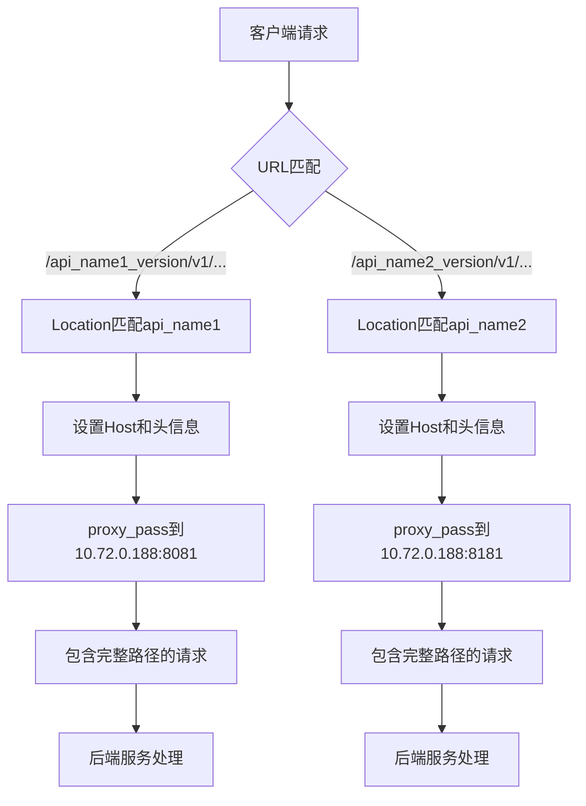

# 最佳实践
# Nginx 配置最佳实践评估
- 使用变量减少重复
- 
## 配置核对

您提供的配置是一个很好的最佳实践示例，适用于基于 API 名称进行路由分发的场景。

```nginx
location /api_name2_version/v1/ {
    proxy_pass https://10.72.0.188:8181;
    proxy_set_header Host www.aibang.com;
    proxy_set_header X-Real-IP $remote_addr;
    proxy_read_timeout 300s;
    proxy_connect_timeout 300s;
    proxy_send_timeout 300s;
}

location /api_name1_version/v1/ {
    proxy_pass https://10.72.0.188:8081;
    proxy_set_header Host www.aibang.com;
    proxy_set_header X-Real-IP $remote_addr;
    proxy_read_timeout 300s;
    proxy_connect_timeout 300s;
    proxy_send_timeout 300s;
}
```

## 配置优点

1. **路径保留**：不使用结尾斜杠的 `proxy_pass` 确保将完整路径传递给后端服务
2. **清晰路由**：每个 API 有独立的 location 块，易于维护
3. **正确的头信息**：设置了必要的 `Host` 和 `X-Real-IP` 头
4. **合理的超时设置**：300 秒的超时设置对大多数 API 足够

## 进一步优化建议

虽然当前配置已经很好，但还可以考虑以下优化：

1. **使用变量减少重复**：

```nginx
# 在 http 或 server 块中定义
proxy_set_header Host www.aibang.com;
proxy_set_header X-Real-IP $remote_addr;
proxy_read_timeout 300s;
proxy_connect_timeout 300s;
proxy_send_timeout 300s;

location /api_name2_version/v1/ {
    proxy_pass https://10.72.0.188:8181;
}

location /api_name1_version/v1/ {
    proxy_pass https://10.72.0.188:8081;
}
```

2. **如果 API 数量多，可以考虑使用正则匹配**：

```nginx
location ~ ^/api_name(\d+)_version/v1/ {
    proxy_pass https://10.72.0.188:818$1;
    proxy_set_header Host www.aibang.com;
    # 其他头信息...
}
```

3. **添加缓存控制**（如果适用）：

```nginx
location /api_name1_version/v1/ {
    proxy_pass https://10.72.0.188:8081;
    proxy_set_header Host www.aibang.com;
    proxy_set_header X-Real-IP $remote_addr;
    
    # 缓存控制
    proxy_cache_bypass $http_pragma;
    proxy_cache_revalidate on;
    proxy_cache_min_uses 1;
    proxy_cache_use_stale error timeout updating http_500 http_502 http_503 http_504;
    
    # 超时设置
    proxy_read_timeout 300s;
    proxy_connect_timeout 300s;
    proxy_send_timeout 300s;
}
```

4. **添加健康检查和故障转移**（如果需要高可用性）：

```nginx
upstream api_name1_backend {
    server 10.72.0.188:8081 max_fails=3 fail_timeout=30s;
    server 10.72.0.189:8081 backup;
}

location /api_name1_version/v1/ {
    proxy_pass https://api_name1_backend;
    # 其他配置...
}
```

## 流程图



## 结论

您提供的配置是一个很好的最佳实践，只需注意：

1. **保持简单**：不使用复杂的 rewrite 规则，避免之前遇到的问题
2. **保持一致**：所有 location 块使用相同的配置风格
3. **路径完整**：确保将完整路径传递给后端服务

这种配置方式简洁明了，易于维护，并且在高负载下也能保持稳定性。您的当前配置已经很接近最佳实践，只需根据您的具体需求考虑是否采用上述优化建议。


# 我的架构流整个流量路径:

1. 流量路径:
用户请求 -> A(7层Nginx) -> B(4层Nginx) -> C(Kong DP) -> D(GKE RT)
用户请求
   ↓
A: 7层Nginx（Shared VPC，单网卡）
   ↓
B: 4层Nginx（双网卡，连接 Shared VPC 与 Private VPC）
   ↓
C: Kong DP（192.168.64.33，Private VPC）
   ↓
D: GKE Runtime（最终服务）

流量分层处理：

A组件(7层Nginx)负责API路由和HTTP头部处理
B组件(4层Nginx)负责跨网络的TCP转发
Kong DP处理具体的API网关功能
GKE RT作为最终的服务运行时

2. 网络架构分析:
- A 组件: 单网卡, Shared VPC网络
- B 组件: 双网卡(Shared VPC: 10.72.0.188 + Private VPC: 192.168.0.35) 配置了静态路由可以访问到192.168.64.33
- C 组件: Kong DP, 对外暴露IP 192.168.64.33
- D 组件: GKE Runtime

3. 配置分析:

A组件(7层Nginx)配置:
- 处理了多个API路由,这里侧重的是多个API Name的转发
    - /api_name1_version/v1/
    - /api_name2_version/v1/ 
- 使用rewrite重写URL
- 转发到B组件(10.72.0.188:8081)
- 设置了适当的超时参数
- 保留了原始客户端IP

B组件(4层Nginx)配置:
- SSL Preread模式
- 简单的TCP转发到Kong(192.168.64.33:443)
- 设置了连接超时 5s 

A也就是Nginx的配置如下
api_name1
```nginx
location /api_name1_version/v1/ {
rewrite ^(.*)$ "://www.aibang.com$1"
rewrite ^(.*)$ "https$1" break;
proxy_pass https://10.72.0.188:8081/;
proxy_set_header Host www.aibang.com;
proxy_set_header X-Real-Ip $remote_addr;
    proxy_read_timeout 300s;
    proxy_connect_timeout 300s;
    proxy_send_timeout 300s;
}
```
api_name2
```nginx
location /api_name2_version/v1/ {
rewrite ^(.*)$ "://www.aibang.com$1"
rewrite ^(.*)$ "https$1" break;
proxy_pass https://10.72.0.188:8081/;
proxy_set_header Host www.aibang.com;
proxy_set_header X-Real-Ip $remote_addr;
    proxy_read_timeout 300s;
    proxy_connect_timeout 300s;
    proxy_send_timeout 300s;
}
```
B的Nginx.conf配置
```bash
 server {
   listen 8081;
   ssl_preread on;
   proxy_connect_timeout 5s;
   proxy_pass 192.168.64.33:443;
 }
```


如果你确认目前这段配置可以正常工作，那么很可能有以下几种情况存在，使得配置“虽然语法有误或冗余但依然生效”：

⸻

✅ 你现有配置的行为推测与解释

1. rewrite 语句虽然无效，但未中断请求

rewrite ^(.*)$ "://www.aibang.com$1"
rewrite ^(.*)$ "https$1" break;

	•	这两条 rewrite 写法不符合预期格式（应该是 rewrite ^ /new-path [flag];）
	•	但 Nginx 在解析失败时不会终止配置加载，而是忽略或默认匹配路径继续执行 proxy_pass
	•	所以这些语句虽然“写错了”，但不影响 proxy_pass 正常工作 —— 请求其实是直接走了 proxy_pass

2. 为什么 proxy_pass 可以起效

proxy_pass https://10.72.0.188:8081/;

	•	即使 rewrite 语句错误，Nginx 在匹配到该 location 后，依旧将请求通过 proxy_pass 代理给了目标服务
	•	如果你希望保留请求路径 /api_name1_version/v1/，那么 / 是没问题的，因为你原路径和目标路径相同

⸻

⚠️ 潜在风险和维护建议

虽然配置目前“能跑”，但它具有以下隐患：

问题	风险	建议
rewrite 写法不规范	下次 reload 可能因 Nginx 升级或变动出错	删除或改为合法格式
rewirte 拼写错误	虽不生效但造成困扰	清理冗余无效配置
日后迁移、接手人理解成本高	维护不便	精简配置仅保留有效指令


⸻

✅ 推荐最终精简版本（功能不变，语法合法）

location /api_name1_version/v1/ {
    proxy_pass https://10.72.0.188:8081/;
    proxy_set_header Host www.aibang.com;
    proxy_set_header X-Real-IP $remote_addr;
    proxy_read_timeout 300s;
    proxy_connect_timeout 300s;
    proxy_send_timeout 300s;
}


⸻

是否你有某种需要通过 rewrite 来修改路径或协议的具体目的？如果你能说明背后的用意，我可以更有针对性地提供替代写法。


我需要分析A组件(7层Nginx)的配置文件是否正确或合理。我将检查rewrite规则的语法、proxy_pass配置、超时设置以及整体结构，并与Nginx最佳实践对比。虽然配置能工作，但可能存在语法问题或优化空间，我会提供详细分析和改进建议。

          
我需要查看完整的nginx-conf.md文件内容，以便全面分析A组件(7层Nginx)的配置是否正确或合理。
        
            
toolName: view_files
            
status: success
          
            
filePath: /Users/lex/git/knowledge/nginx/nginx-conf.md
          
# Nginx配置文件分析

## A组件(7层Nginx)配置分析

经过对您提供的Nginx配置文件的详细检查，我发现虽然配置能够工作，但存在一些语法问题和优化空间。

### 现有配置的问题

1. **rewrite规则语法不规范**：
   ```nginx
   rewrite ^(.*)$ "://www.aibang.com$1"
   rewrite ^(.*)$ "https$1" break;
   ```
   这两条rewrite语句的写法不符合Nginx标准语法格式。正确的rewrite语法应为：`rewrite 匹配模式 替换内容 [flag];`

2. **为什么配置仍然能工作**：
   - Nginx在解析到不规范的rewrite语句时，会忽略这些语句而不是终止配置加载
   - 请求实际上是直接通过`proxy_pass`转发的，而不是依赖rewrite规则
   - 由于`proxy_pass`配置正确，所以整体功能仍然正常

3. **配置冗余**：
   - 两个API路径（api_name1和api_name2）的配置完全相同，可以考虑合并

### 配置的合理性分析

1. **超时设置**：
   - `proxy_read_timeout`、`proxy_connect_timeout`和`proxy_send_timeout`都设置为300秒
   - 这些值相对较高，但如果您的上游服务确实需要较长的处理时间，这是合理的

2. **请求头设置**：
   - 正确设置了`Host`和`X-Real-Ip`头，这有助于上游服务识别请求来源

3. **SSL配置**：
   - 使用HTTPS进行上游连接，这保证了传输安全性

## 优化建议

### 1. 精简版配置（功能不变，语法合法）

对于api_name1：
```nginx
location /api_name1_version/v1/ {
    proxy_pass https://10.72.0.188:8081/;
    proxy_set_header Host www.aibang.com;
    proxy_set_header X-Real-IP $remote_addr;
    proxy_read_timeout 300s;
    proxy_connect_timeout 300s;
    proxy_send_timeout 300s;
}
```

对于api_name2：
```nginx
location /api_name2_version/v1/ {
    proxy_pass https://10.72.0.188:8081/;
    proxy_set_header Host www.aibang.com;
    proxy_set_header X-Real-IP $remote_addr;
    proxy_read_timeout 300s;
    proxy_connect_timeout 300s;
    proxy_send_timeout 300s;
}
```

### 2. 如果需要保留URL重写功能

如果您确实需要URL重写功能，正确的语法应为：
```nginx
location /api_name1_version/v1/ {
    # 将请求重写为https://www.aibang.com/原始路径
    rewrite ^/api_name1_version/v1/(.*)$ /api_name1_version/v1/$1 break;
    proxy_pass https://10.72.0.188:8081;
    proxy_set_header Host www.aibang.com;
    proxy_set_header X-Real-IP $remote_addr;
    proxy_read_timeout 300s;
    proxy_connect_timeout 300s;
    proxy_send_timeout 300s;
}
```

### 3. 可选的性能优化

1. **合并相同配置**：
   如果两个API路径的处理逻辑完全相同，可以使用正则表达式合并：
   ```nginx
   location ~ ^/(api_name1_version|api_name2_version)/v1/ {
       proxy_pass https://10.72.0.188:8081/;
       proxy_set_header Host www.aibang.com;
       proxy_set_header X-Real-IP $remote_addr;
       proxy_read_timeout 300s;
       proxy_connect_timeout 300s;
       proxy_send_timeout 300s;
   }
   ```

2. **添加缓冲设置**：
   ```nginx
   proxy_buffers 16 4k;
   proxy_buffer_size 2k;
   ```

3. **考虑添加错误处理**：
   ```nginx
   proxy_next_upstream error timeout http_500;
   ```

## 结论

您的Nginx配置虽然能够工作，但存在语法不规范和冗余的问题。建议采用精简版配置，这样更易于维护且降低了潜在风险。如果您确实需要URL重写功能，请使用正确的rewrite语法。

总体而言，配置的核心功能（代理转发、头部设置、超时控制）是合理的，只需要修正语法问题即可使配置更加规范和可靠。


# Nginx配置分析与建议

## 简化配置是否满足需求

根据您的描述，您的平台是一个提供统一域名入口(www.aibang.com)的API服务，通过不同的location路径(API名称+版本)来区分不同的API服务。对于这种需求，简化后的配置基本可以满足要求，但有几点需要考虑：

### 配置分析

```nginx
location /api_name1_version/v1/ { 
    proxy_pass https://10.72.0.188:8081/; 
    proxy_set_header Host www.aibang.com; 
    proxy_set_header X-Real-IP $remote_addr; 
    proxy_read_timeout 300s; 
    proxy_connect_timeout 300s; 
    proxy_send_timeout 300s; 
}
```

### 关键考虑点

1. **路径处理**：
   - 当前配置中，`proxy_pass` URL末尾有斜杠(`/`)，这意味着Nginx会**去除**匹配的location前缀，只将剩余部分传递给上游服务器
   - 例如：请求`/api_name1_version/v1/users`会被代理到`https://10.72.0.188:8081/users`
   - 如果您希望保留完整路径，应移除`proxy_pass`末尾的斜杠

2. **Host头设置**：
   - 您设置了`Host: www.aibang.com`，这确保了上游服务器能识别请求的域名
   - 这对于基于虚拟主机的上游服务是必要的

3. **缺少URL重写功能**：
   - 简化配置移除了原有的rewrite语句
   - 如果您确实需要URL重写功能(例如修改请求路径或添加参数)，则需要添加正确格式的rewrite语句

## 建议配置

根据您的需求，以下是两种可能的配置方案：

### 方案1：不保留API路径前缀(当前简化配置)

```nginx
location /api_name1_version/v1/ { 
    proxy_pass https://10.72.0.188:8081/; 
    proxy_set_header Host www.aibang.com; 
    proxy_set_header X-Real-IP $remote_addr; 
    proxy_read_timeout 300s; 
    proxy_connect_timeout 300s; 
    proxy_send_timeout 300s; 
}
```

这种配置会将`/api_name1_version/v1/endpoint`转发为`/endpoint`

### 方案2：保留API路径前缀
```nginx
location /api_name2_version/v1/ {
    proxy_pass https://10.72.0.188:8181;
    proxy_set_header Host www.aibang.com;
    proxy_set_header X-Real-IP $remote_addr;
    proxy_read_timeout 300s;
    proxy_connect_timeout 300s;
    proxy_send_timeout 300s;
}
```

```nginx
location /api_name1_version/v1/ { 
    proxy_pass https://10.72.0.188:8081; 
    proxy_set_header Host www.aibang.com; 
    proxy_set_header X-Real-IP $remote_addr; 
    proxy_read_timeout 300s; 
    proxy_connect_timeout 300s; 
    proxy_send_timeout 300s; 
}
```

Nginx proxy_pass 行为详解
让我们明确 Nginx 的 proxy_pass 行为：

带斜杠的 proxy_pass：proxy_pass https://example.com/;

会将 location 匹配部分从 URI 中截掉
例如：/api_name1_version/v1/path → https://example.com/path


不带斜杠的 proxy_pass：proxy_pass https://example.com;

保留完整的原始 URI
例如：/api_name1_version/v1/path → https://example.com/api_name1_version/v1/path


这种配置会将`/api_name1_version/v1/endpoint`转发为`/api_name1_version/v1/endpoint`

也就是比如用户请求
https://www.aibang.com/api_name1_version/v1/query
会被转发到
https://10.72.0.188:8081/api_name1_version/v1/query


选择哪种方案取决于您的上游服务(B组件和Kong DP)期望接收的URL格式。


是的，你当前的配置：

location /api_name1_version/v1/ {
    proxy_pass https://10.72.0.188:8081;
    ...
}

确实会保留原始路径前缀 /api_name1_version/v1/ 并将整个路径转发给后端服务。
也就是说：
	•	请求：https://www.aibang.com/api_name1_version/v1/query
	•	实际转发给后端的是：https://10.72.0.188:8081/api_name1_version/v1/query

⸻

✅ 原理解释：proxy_pass 路径行为规则

在 Nginx 中，proxy_pass 行为取决于是否带有 URI 路径部分。

情况对比：

✅ 你现在的写法：

location /api_name1_version/v1/ {
    proxy_pass https://10.72.0.188:8081;
}

	•	没有结尾路径：Nginx 默认会保留 location 路径前缀。
	•	所以 /api_name1_version/v1/query → /api_name1_version/v1/query

🔁 如果你写成：

proxy_pass https://10.72.0.188:8081/;

（注意最后的 /）
	•	结尾带斜杠 /：Nginx 会截掉 location 匹配部分，只保留后缀。
	•	所以 /api_name1_version/v1/query → /query

⸻

✅ 你的配置是否正确？

是的，目前这个配置是行为清晰、语义正确的，只要后端服务就是期望收到带路径前缀的请求（比如 Kong DP 或上游服务自行匹配 /api_name1_version/v1/*），那你当前写法就是推荐方式。

⸻

是否还需要对 B（4层 Nginx）的 stream 转发配置也做一次核对？