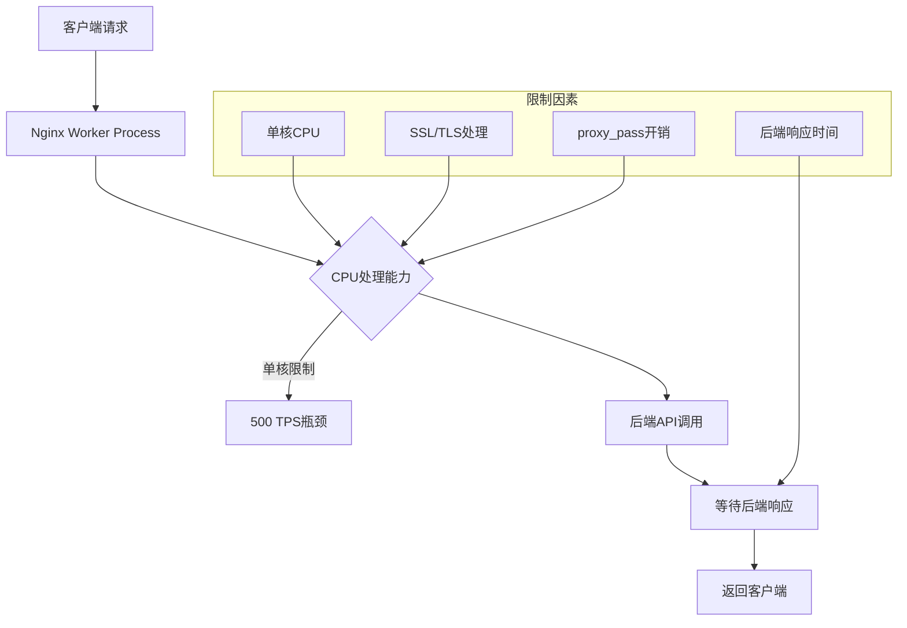
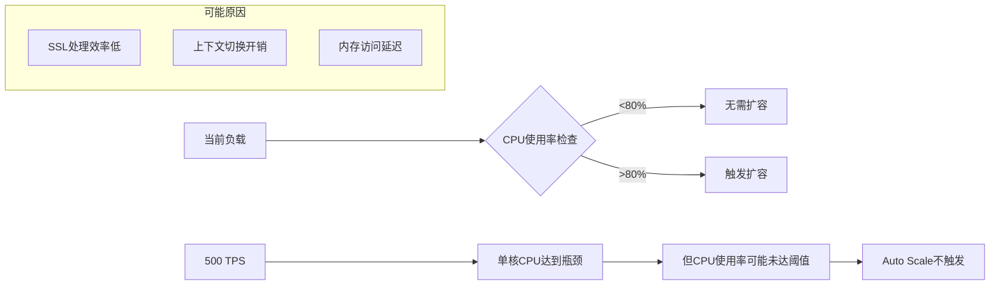

# Summary

- todo

    - nginx-session-cache

- explorer

```bash
(1) 查找并定义谷歌计算引擎（GCE）的托管实例组（MIG）和单个虚拟机实例（Instance）的核心概念，为理解监控指标提供必要的背景知识。
(2) 针对托管实例组（MIG），研究用户列出的每一项性能指标，包括：
(a) 自动扩缩器利用率（Autoscaler utilization）：解释其如何基于CPU利用率来管理实例组的容量和实际利用情况。
(b) CPU利用率（CPU utilization）：定义实例组的“平均利用率”是如何聚合计算的。
(c) 磁盘I/O（字节与操作）：解释整个组的平均读/写吞吐量和IOPS。
(d) 网络流量（字节与数据包）：解释整个组的平均传入/传出吞吐量和数据包速率。
(3) 针对单个虚拟机实例（Instance），研究与MIG相对应的同一系列性能指标，并阐明它们在单个计算单元上的具体含义。
(4) 分析每个指标的性能意义，解释其数值高低对于运行Nginx L7负载的应用可能意味着什么，例如计算瓶颈、存储限制或网络饱和等。
(5) 综合所有收集到的信息，创建两个独立的Markdown表格，一个用于MIG，另一个用于单个实例。
(6) 在表格中，为每个指标提供“指标名称”、“详细解释”和“性能影响解读”等列，并用清晰的语言填充内容，确保解释的准确性和实用性。


```

- 

# Gemini

# GCE Nginx L7 性能监控深度解析：从单一实例到托管实例组的专家指南

## 第一部分：性能监控的战略框架

### 1.1 导论：超越阈值监控

在现代云原生架构中，对 Nginx L7 这类关键应用进行性能监控，其意义已远超传统基于静态阈值的被动告警模式（例如，当 CPU 利用率超过 90%时发送警报）。一种更先进、更具前瞻性的监控哲学，是将系统视为一个动态的、相互关联的整体。这种理念要求我们从被动响应转向主动分析，其核心目标在于理解系统行为、预测潜在瓶颈，并最终保障服务的可靠性与用户体验。

为了构建这一分析框架，可以借鉴 Google SRE 团队提出的“四个黄金信号”（Four Golden Signals）理论：延迟（Latency）、流量（Traffic）、错误（Errors）和饱和度（Saturation）。您所关注的四个核心指标领域可以精确地映射到这个理论框架中：

- **饱和度 (Saturation):** 这是衡量服务资源压力最直接的指标，描述了系统“有多满”。**CPU 利用率**、**磁盘 I/O** 和 **网络流量** 都是饱和度的关键体现。监控饱和度旨在回答：“我们的系统还能承受多大的负载？”
- **流量 (Traffic):** 这是衡量服务需求高低的指标。对于托管实例组（MIG），**自动扩缩器利用率** 本质上是系统为响应流量（Traffic）变化而采取的自动化调节能力的量化体现。

本报告将基于此框架，深入剖析每一项指标，并阐明它们之间的内在联系。

### 1.2 监控哲学的二元性：静态资产 vs. 动态集群

在 Google Cloud Engine (GCE) 环境中，单一实例（Standalone Instance）和托管实例组（Managed Instance Groups, MIG）代表了两种截然不同的部署与运维哲学，因此它们的监控策略也应有所区别。

- 单一实例：视为“宠物 (Pet)”
    一个独立的虚拟机实例，如同一个精心照料的宠物。它的身份是唯一的，不可轻易替代。因此，对其监控的重点在于保障其个体健康、性能极限和长期稳定性。分析的目标是最大化这一个点的性能和可靠性，任何异常都需要被精确诊断和修复。我们会深入到该实例的内核层面，分析 CPU 的每一种状态、磁盘的每一次操作。
- 托管实例组：视为“牛群 (Cattle)”
    一个 MIG 中的实例群，则更像是一个庞大的牛群。群体中的每个个体都是同质化且可替代的。如果一个实例出现问题，最有效的处理方式往往是替换它，而不是修复它。因此，监控的重点从个体健康转向群体行为的健康、伸缩策略的有效性以及整体服务的可用性。分析的目标是确保整个集群能够作为一个整体，高效、经济地承载业务流量，而非纠结于某一个别实例的瞬时波动。

这一“宠物”与“牛群”的理念差异，是理解和实施有效监控策略的根本出发点，并将贯穿本报告的后续所有分析。

## 第二部分：单一实例（Standalone Instance）的性能剖析

本部分将聚焦于构成计算基础的单个虚拟机，为其建立一个精确、多维度的性能画像。对于“宠物”般的单一实例，任何性能的细微抖动都值得深入探究。

### 2.1 CPU 利用率：工作负载的核心引擎

CPU 是执行 Nginx 工作负载的核心计算单元。然而，简单地观察一个总的 CPU 利用率指标（如 `compute.googleapis.com/instance/cpu/utilization`）往往会掩盖问题的本质。一个看似“健康”的 CPU 利用率背后，可能隐藏着严重的性能瓶颈。要进行深度诊断，必须将 CPU 时间进行细粒度的拆解。

通过安装并使用 Cloud Monitoring Agent，可以获取到更深层次的 CPU 指标 `agent.googleapis.com/cpu/utilization`，该指标通过 `state` 标签提供了对 CPU 时间构成的详细视图。对于 Nginx L7 服务，以下几种状态尤为关键：

- **`user` (用户态时间):** 这部分 CPU 时间主要消耗在执行 Nginx worker 进程的用户空间代码上。具体活动包括处理 HTTP 请求、执行 Gzip 压缩、运行嵌入的 Lua 脚本或处理 SSL/TLS 握手（软件加密部分）。高 `user` 时间通常直接与业务逻辑的复杂度和请求处理量成正比。
- **`system` (内核态时间):** 这部分时间用于执行内核代码以响应 Nginx 进程的系统调用。主要活动包括网络套接字（socket）的读写、磁盘文件的读写、进程调度等。高吞吐量的 Nginx 服务通常会伴随着显著的 `system` 时间占比。
- **`iowait` (I/O 等待时间):** 这是 CPU 因等待磁盘 I/O 操作（如读或写）完成而处于空闲状态的时间。**`iowait` 是诊断磁盘性能瓶颈最直接、最明确的信号**。如果 Nginx 配置了同步写入访问日志，而底层磁盘性能不足，`iowait` 将会飙升，直接阻塞 Nginx worker 进程，导致请求处理能力下降和延迟增加。
- **`softirq` (软中断时间):** 对于网络密集型应用如 Nginx，**`softirq` 是一个至关重要但常常被忽视的性能指标**。网络数据包的接收和发送由硬件中断触发，但大量后续处理工作（如将数据包从驱动程序缓冲区复制到内核协议栈）是在一种名为“软中断”的机制中完成的。当网络流量，特别是每秒数据包数（Packets Per Second, PPS）极高时，内核需要花费大量的 CPU 时间来处理这些软中断。

一个典型的性能陷阱是：系统总 CPU 利用率可能只有 60%，看似远未饱和。但如果通过分解发现，其中 40% 的时间都消耗在了 `softirq` 上，那么留给 `user` 空间执行 Nginx 业务逻辑的 CPU 时间就非常有限了。这会导致 Nginx 无法及时处理新请求，表现为高延迟和连接拒绝，尽管宏观 CPU 指标看起来“正常”。因此，将 `softirq` 利用率与网络 PPS 指标进行关联分析，是发现此类“CPU 伪空闲”瓶颈的关键。

此外，GCE 提供的不同机器系列对 CPU 性能有显著影响。例如，计算优化型（C-series）的 C2 实例提供最高的单核性能，非常适合 CPU 密集型的 Nginx 任务（如大量 SSL 计算或复杂重写规则）。通用型（N-series）的 N2 实例则在性能和成本之间提供了良好的平衡。选择与工作负载特征相匹配的机器系列是性能优化的第一步。

下表总结了用于深度分析 Nginx CPU 性能的关键指标。

**表 1：关键 CPU 指标详解**

| 参数/指标名称 (Metric Name)                              | 描述 (Description)                                                    | 单位 (Unit)     | 对 Nginx 的解读与重要性 (Interpretation & Significance for Nginx)                                                                        |
| -------------------------------------------------------- | --------------------------------------------------------------------- | --------------- | ---------------------------------------------------------------------------------------------------------------------------------------- |
| `compute.googleapis.com/instance/cpu/utilization`        | 由 GCE Hypervisor 提供的标准化 CPU 利用率，其值为 0 到 1 之间的小数。 | 比例 (Fraction) | 宏观饱和度指标。适合用于高层仪表盘展示、基础告警和自动扩缩容策略的触发信号。                                                             |
| `agent.googleapis.com/cpu/utilization` (state="user")    | CPU 用于执行用户空间进程的时间占比。                                  | 百分比 (%)      | 直接反映 Nginx worker 进程执行业务逻辑（如 Gzip 压缩、Lua 脚本）的繁忙程度。此值过高表明应用层逻辑是瓶颈。                               |
| `agent.googleapis.com/cpu/utilization` (state="system")  | CPU 用于执行内核空间代码的时间占比。                                  | 百分比 (%)      | 反映系统调用开销，主要与网络和文件 I/O 相关。高网络吞吐量会自然推高此值。                                                                |
| `agent.googleapis.com/cpu/utilization` (state="iowait")  | CPU 因等待块设备（磁盘）I/O 而空闲的时间占比。                        | 百分比 (%)      | **磁盘瓶颈的明确信号**。直接关联到 Nginx 日志写入或从磁盘缓存读取文件的性能。持续的 `iowait` 会严重影响请求延迟。                        |
| `agent.googleapis.com/cpu/utilization` (state="softirq") | CPU 用于处理软中断（特别是网络数据包）的时间占比。                    | 百分比 (%)      | **网络性能瓶颈的核心诊断指标**。高 PPS（每秒数据包数）会直接导致此值飙升，是诊断网络处理能力饱和的先行指标，其影响甚至先于网络带宽饱和。 |

### 2.2 磁盘 I/O：沉默的性能杀手

磁盘 I/O 常常是 Web 服务器中一个被低估的性能瓶颈。对于 Nginx 而言，其对磁盘的依赖主要体现在两个方面：作为静态文件服务器或缓存服务器时的文件读取，以及记录访问日志和错误日志时的文件写入。监控磁盘性能需要区分两个维度：吞吐量（Bytes/s）和每秒操作数（IOPS）。

- **吞吐量 (Throughput):** 由 `read_bytes_count` 和 `write_bytes_count` 指标体现。当 Nginx 用于分发大文件（如视频流、软件安装包、ISO 镜像）时，磁盘的顺序读取吞吐量是关键瓶颈。
- **操作数 (IOPS):** 由 `read_ops_count` 和 `write_ops_count` 指标体现。当 Nginx 处理大量短小请求，并且为每个请求记录访问日志时，磁盘的写入 IOPS 成为决定性因素。

**Nginx 日志是导致磁盘 I/O 瓶颈最常见的元凶**。其背后的因果关系链条非常清晰：

1. 在默认配置下（`access_log /path/to/log main;`），Nginx 会对每一个接收到的请求进行一次同步或接近同步的磁盘写入操作。
2. 在一个高流量的网站上，例如 QPS (Queries Per Second) 达到 10,000，这意味着磁盘系统需要承受接近每秒 10,000 次的写入操作（Write IOPS）。
3. Google Cloud 的标准永久性磁盘（`pd-standard`）是基于 HDD 的，其 IOPS 性能非常有限，通常每 GB 容量仅提供 0.75 次写入 IOPS，远不能满足高 QPS 场景的需求。
4. 一旦请求的写入 IOPS 超过磁盘的处理上限，写操作就会被阻塞。由于 Nginx worker 进程需要等待写日志操作完成才能处理下一个请求，这将导致进程被挂起，无法接收新连接，最终体现为请求处理延迟急剧上升，甚至出现请求超时或丢失。

因此，选择合适的持久化磁盘（Persistent Disk）类型至关重要。对于需要高频写入日志或用作缓存的 Nginx 服务器，**SSD 永久性磁盘（`pd-ssd`）是必然选择**，因为它能提供远高于标准磁盘的 IOPS 性能。一个更具成本效益的优化是在 Nginx 配置中为 `access_log` 指令启用缓冲区（例如 `buffer=32k`）。这使得 Nginx 先将日志写入内存缓冲区，待缓冲区满或满足特定条件后再一次性批量写入磁盘，从而将大量随机的小写入合并为较少次数的顺序大写入，极大缓解了对磁盘 IOPS 的压力。在极端情况下，如果访问日志不是强需求，直接关闭 (`access_log off;`) 是最立竿见影的性能提升手段。

**表 2：关键磁盘 I/O 指标详解**

| 参数/指标名称 (Metric Name)                              | 描述 (Description)                         | 单位 (Unit)    | 对 Nginx 的解读与重要性 (Interpretation & Significance for Nginx)                                                  |
| -------------------------------------------------------- | ------------------------------------------ | -------------- | ------------------------------------------------------------------------------------------------------------------ |
| `compute.googleapis.com/instance/disk/read_bytes_count`  | 从磁盘读取的字节总数，通常以速率形式观察。 | Bytes/s        | 衡量 Nginx 作为静态文件服务器或反向缓存时，从磁盘提供服务的吞吐能力。需对照磁盘类型的吞吐量上限进行分析。          |
| `compute.googleapis.com/instance/disk/write_bytes_count` | 写入磁盘的字节总数，通常以速率形式观察。   | Bytes/s        | 主要反映日志写入的吞吐量。通常与写入 IOPS 一起分析，以判断是写入数据量大还是写入频率高。                           |
| `compute.googleapis.com/instance/disk/read_ops_count`    | 磁盘读取操作的次数，通常以速率形式观察。   | Count/s (IOPS) | 衡量 Nginx 读取缓存文件或静态文件的频率。对于大量小文件的场景，此指标比吞吐量更重要。                              |
| `compute.googleapis.com/instance/disk/write_ops_count`   | 磁盘写入操作的次数，通常以速率形式观察。   | Count/s (IOPS) | **Nginx 日志性能的关键诊断指标**。高 QPS 会直接转化为高写入 IOPS。此指标接近磁盘上限是服务延迟上升的强烈预警信号。 |

### 2.3 网络流量：数据流动的生命线

网络是 Nginx 作为 L7 代理的生命线。与磁盘 I/O 类似，网络性能的监控也需要从字节数（带宽）和数据包数（PPS）两个维度进行。

- **字节数 (Bytes):** 由 `received_bytes_count` 和 `sent_bytes_count` 指标体现。这通常被称为带宽利用率，反映了数据传输的总量。对于提供大文件下载、视频流或高清图片的 Nginx 服务，出口带宽（`sent_bytes_count`）是主要瓶颈。需要密切关注该指标是否接近 GCE 实例类型所规定的出口带宽上限。
- **数据包数 (Packets):** 由 `received_packets_count` 和 `sent_packets_count` 指标体现。这通常被称为 PPS (Packets Per Second)，反映了网络交互的频率。对于作为 API 网关、微服务入口或处理大量短连接（如心跳、轮询）的 Nginx 服务，PPS 是一个比带宽更为关键的指标。

**PPS 是一个比带宽更隐蔽、也更危险的性能瓶颈**。其根本原因在于，处理每一个网络数据包（无论大小）都需要消耗一定的 CPU 资源，这部分开销主要体现在前文所述的 `softirq` 上。一个处理大量小尺寸 API 请求的 Nginx 服务器，其网络带宽可能非常低（例如只有几十 Mbps），但其 PPS 可能极高（数十万甚至上百万）。在这种情况下，系统很可能在远未达到 GCE 实例的带宽上限时，就因为 PPS 过高而耗尽了 CPU 处理网络数据包的能力（即 `softirq` 占用率达到 100%），导致内核开始随机丢弃数据包（drop packets），从而引发严重的延迟抖动和请求失败。

因此，对 Nginx 服务器的监控，必须将网络 PPS 指标与 CPU `softirq` 指标并列分析。当发现 `softirq` 异常升高时，应立即检查 PPS 指标，以确认瓶颈是否源于网络数据包处理压力。

此外，通过观察 `received_bytes_count` 和 `sent_bytes_count` 的比例，可以快速判断 Nginx 的工作模式。如果 `sent` 远大于 `received`，它很可能主要扮演内容分发服务器的角色。如果两者大致相当，它可能在执行更复杂的反向代理、API 网关或负载均衡任务。

**表 3：关键网络流量指标详解**

| 参数/指标名称 (Metric Name)                                      | 描述 (Description)                               | 单位 (Unit)     | 对 Nginx 的解读与重要性 (Interpretation & Significance for Nginx)                                                  |
| ---------------------------------------------------------------- | ------------------------------------------------ | --------------- | ------------------------------------------------------------------------------------------------------------------ |
| `compute.googleapis.com/instance/network/sent_bytes_count`       | 从实例网络接口发送的字节总数，通常以速率观察。   | Bytes/s         | 衡量 Nginx 对外提供服务的总带宽。需对照 GCE 实例类型的出口带宽上限 进行容量规划和瓶颈分析。                        |
| `compute.googleapis.com/instance/network/received_bytes_count`   | 实例网络接口接收的字节总数，通常以速率观察。     | Bytes/s         | 衡量 Nginx 从客户端或上游服务接收数据的带宽。对于反向代理，此值与 `sent_bytes_count` 共同反映了流量特征。          |
| `compute.googleapis.com/instance/network/sent_packets_count`     | 从实例网络接口发送的数据包总数，通常以速率观察。 | Packets/s (PPS) | **API 网关和小请求处理场景下的核心性能指标**。高 PPS 会直接增加 CPU `softirq` 负载，是网络处理能力饱和的先行指标。 |
| `compute.googleapis.com/instance/network/received_packets_count` | 实例网络接口接收的数据包总数，通常以速率观察。   | Packets/s (PPS) | 同上，反映了入口请求的频率。在遭受 DDoS 攻击（如 SYN Flood）时，此指标会异常飙升。                                 |

## 第三部分：托管实例组（MIG）的动态监控与治理

当部署模式从单一实例转向托管实例组（MIG），监控的焦点也必须从微观的个体健康转向宏观的集群治理。在这里，我们关注的不再是“这台服务器怎么样了？”，而是“整个服务集群是否健康？我们的自动化策略是否有效？”

### 3.1 自动扩缩容的艺术：目标与现实

MIG 的核心价值在于其自动扩缩容（Autoscaling）能力，它能根据负载动态调整实例数量，以在保障服务可用性的同时优化成本。监控自动扩缩容行为的关键指标是 `autoscaler/instance_group/utilization`。

这个指标的计算方式是：

Utilization=Target ValueActual Measured Value​

其中，“Actual Measured Value”是当前从实例组中采集到的指标的平均值（例如，平均 CPU 利用率），而“Target Value”是您在自动扩缩容策略中设定的目标值（例如，目标 CPU 利用率为 60%）。

理解此指标的关键在于，它是一个**控制平面 (Control Plane) 的指标**，而非数据平面 (Data Plane) 的性能指标。它反映的不是实例的真实性能，而是**扩缩容决策的“输入信号强度”**。

- 当 `utilization` **持续大于 1.0** 时，意味着当前负载已超过目标设定，自动扩缩容器将触发**扩容（Scale Out）**决策，增加实例数量。
- 当 `utilization` **持续小于 1.0** 时，意味着当前资源存在冗余，自动扩缩容器将触发**缩容（Scale In）**决策，减少实例数量。
- 当 `utilization` **在 1.0 附近平稳波动**时，表明系统已达到或接近理想的平衡状态。

一个健康的自动扩缩容系统，其 `utilization` 指标不应长期显著偏离 1.0。对该指标的时间序列图进行分析，可以诊断扩缩容策略的健康度：

- **延迟 (Lag):** 从 `utilization` 超过 1.0 到新实例成功创建并开始处理流量，存在一个固有的时间延迟。如果流量增长非常迅速，可能会看到 `utilization` 持续高于 1.0 一段时间，这表明扩容速度跟不上流量增长。
- **抖动 (Thrashing):** 如果 `utilization` 指标在 1.0 上下剧烈、频繁地穿越，同时伴随着实例数量的反复增减，这通常被称为“抖动”。它可能由不合理的冷却期（`coolDownPeriodSec`）设置导致。冷却期定义了一次扩缩容活动后，系统需要等待多长时间才能进行下一次活动，以防止对短暂的指标波动做出过度反应。
- **过早缩容:** 如果在流量低谷后，`utilization` 刚刚降到 1.0 以下，实例就被迅速缩容，而紧接着流量回升又导致紧急扩容，这可能是稳定期（`stabilizationPeriodSec`）设置过短。稳定期要求指标持续低于目标一段时间后，才做出缩容决策，以避免对短暂的流量波动做出误判。

因此，监控 `autoscaler/instance_group/utilization` 的目的，不是看实例的 CPU 忙不忙，而是为了**评估和优化自动扩缩容策略本身是否健康、高效和经济**。

**表 4：自动扩缩器关键指标详解**

| 参数/指标名称 (Metric Name)                  | 描述 (Description)                                              | 单位 (Unit)     | 解读与治理策略 (Interpretation & Governance Strategy)                                                                                                                    |
| -------------------------------------------- | --------------------------------------------------------------- | --------------- | ------------------------------------------------------------------------------------------------------------------------------------------------------------------------ |
| `autoscaler/instance_group/utilization`      | 实例组当前观测到的指标值与扩缩容策略中设定的目标值的比率。      | 比例 (Fraction) | **核心决策信号**。持续 > 1.1 可能表示扩容速度跟不上流量增长或目标值设置过低；持续 < 0.9 可能表示缩容过于保守或目标值设置过高；剧烈震荡表示冷却期或稳定期等策略需要调整。 |
| `autoscaler/instance_group/num_instances`    | 实例组中当前处于 `RUNNING` 状态的实例总数量。                   | 整数 (Count)    | **扩缩容行为的直接结果**。将此指标与 `utilization` 指标叠加在同一图表中分析，可以直观地验证扩缩容决策是否被正确执行，以及执行的延迟情况。                                |
| `autoscaler/instance_group/recommended_size` | 自动扩缩容器根据当前 `utilization` 计算后，建议的理想实例数量。 | 整数 (Count)    | **扩缩容器的“意图”**。当 `recommended_size` 与 `num_instances` 不一致时，通常表示正在进行扩缩容操作，或者扩缩容请求受到了 `maxReplicas` 或 `minReplicas` 限制。          |

### 3.2 从个体到群体：聚合指标解读

在 MIG 环境中，我们通常首先关注聚合指标，例如整个实例组的平均 CPU 利用率、P95 响应延迟等。这提供了一个快速了解集群整体健康状况的宏观视图。

然而，**平均值会掩盖个体问题**。一个性能低下的“慢”实例或一个完全故障的实例，其负面影响可能被大量健康实例的良好数据所稀释，导致平均值看起来依然正常。这正是“牛群”监控理念中需要警惕的陷阱。

因此，一套成熟的 MIG 监控与诊断策略应采用**“自顶向下，逐层下钻 (Top-down, Drill-down)”** 的方法：

1. **Top-down (自顶向下):** 从聚合指标（如平均值、P95、P99）开始监控。当发现聚合指标出现异常（例如，整个 MIG 的平均 CPU 利用率上升）时，触发告警或进行调查。
2. **Drill-down (逐层下钻):** 一旦发现宏观异常，立即利用 Cloud Monitoring 的分组（Group By）功能，按 `instance_id` 或 `zone` 等维度对指标进行拆分。这样可以迅速定位到是哪个或哪些具体的实例导致了整体指标的恶化，即找到“害群之马”。

为了实现有效的下钻分析，必须确保所有从实例收集的指标和日志都包含了可用于识别个体的标签，如 `instance_id` 和 `zone`。只有这样，才能在庞大的“牛群”中，快速隔离并处理有问题的个体。

## 第四部分：综合诊断与优化策略

孤立地看任何一个指标都可能得出片面的结论。真正的专家级诊断在于将所有相关指标联系起来，构建一个完整的性能画像，并基于此进行系统性优化。

### 4.1 关联性分析：构建完整的性能画像

以下通过两个典型的 Nginx 性能问题案例，展示如何通过关联不同维度的指标进行根本原因分析。

#### 案例研究 1：日志引发的“静默风暴”

- **现象:** 应用层监控系统报告，Nginx 服务的 P99 响应延迟在流量高峰期无预兆地急剧上升。然而，Cloud Monitoring 仪表盘上，MIG 的平均 CPU 利用率却维持在 60% 左右的健康水平。
- **诊断路径:**
    1. **初步怀疑与排查:** 平均 CPU 利用率正常，排除了计算能力饱和的普遍性问题。开始怀疑是 I/O 瓶颈或某个别实例的问题。
    2. **下钻分析:** 将 CPU 利用率指标按 `instance_id` 分组，并分解 CPU 时间状态。发现有几个实例的总 CPU 利用率虽然不高，但其 `agent.googleapis.com/cpu/utilization` 指标中 `state="iowait"` 的部分占比异常地高（例如达到 30-40%）。
    3. **关联磁盘指标:** 针对这些高 `iowait` 的实例，检查其磁盘 I/O 指标。发现 `instance/disk/write_ops_count` 指标非常高，已经触及或非常接近其所使用的 `pd-standard` 磁盘的 IOPS 上限。
    4. **追溯应用配置:** 检查部署在实例上的 Nginx 配置文件，确认 `access_log` 指令处于开启状态，并且没有配置 `buffer` 参数。
    5. **结论:** 问题根源被定位。高 QPS 导致了海量的日志写入请求，这些请求耗尽了标准磁盘的写入 IOPS 能力。磁盘写入的阻塞导致 Nginx worker 进程被挂起，无法处理新的客户端请求，从而引发了应用层可观测到的高延迟。这是一个典型的、由磁盘 I/O 瓶颈引发的“静默风暴”，因为它在宏观 CPU 指标上几乎不可见。

#### 案例研究 2：小包攻击下的 CPU 耗尽

- **现象:** 运维团队收到告警，MIG 正在基于 CPU 利用率策略进行紧急扩容。然而，查看网络监控仪表盘时，发现实例组的总出口带宽 `sent_bytes_count` 利用率极低，远未达到带宽上限。
- **诊断路径:**
    1. **初步怀疑与排查:** 带宽使用率低排除了大流量攻击。CPU 利用率高但带宽低，这是一个反常的信号，指向了 CPU 消耗在了非数据传输的任务上。
    2. **分解 CPU 指标:** 查看实例的 CPU 时间分解图，发现 `agent.googleapis.com/cpu/utilization` 指标中 `state="softirq"` 的部分占比极高，甚至超过了 `user` 和 `system` 时间的总和。
    3. **关联网络指标:** 检查网络数据包指标。发现 `instance/network/received_packets_count` 和 `sent_packets_count` 指标达到了历史峰值，比正常时期高出数个数量级。
    4. **结论:** 根本原因清晰。服务正遭受大量小数据包的网络冲击（可能是低速率的 DDoS 攻击，如 UDP/TCP Flood，或由配置错误的客户端引发）。处理海量数据包的开销（`softirq`）耗尽了 CPU 资源，导致 Nginx worker 进程无法获得足够的 CPU 时间来处理正常业务，从而触发了基于 CPU 的扩容。这是一个典型的 PPS 瓶颈案例，证明了监控 PPS 和 `softirq` 的重要性。

### 4.2 优化建议：从响应式到预测式

基于以上分析，可以从应用、系统和基础设施三个层面进行综合优化。

- **Nginx 应用调优:**
    - **日志管理:** 为 `access_log` 启用 `buffer` 和 `flush` 参数，或将日志推送到专门的日志收集服务，避免本地磁盘写入瓶颈。
    - **工作进程调优:** 合理设置 `worker_processes` (通常设为 CPU 核心数) 和 `worker_connections` (单个 worker 进程能处理的最大连接数)。
    - **连接管理:** 调整 `keepalive_timeout` 和 `keepalive_requests`，在长连接带来的性能优势和资源占用之间取得平衡。
- **操作系统内核调优 (`sysctl`):**
    - 针对高并发连接场景，调高内核参数，如 `net.core.somaxconn` (TCP 监听队列长度) 和 `net.ipv4.tcp_max_syn_backlog` (SYN 半连接队列长度)。
    - 启用 `net.ipv4.tcp_tw_reuse`，允许快速重用处于 `TIME_WAIT` 状态的套接字，以应对大量短连接。
- **GCE 基础设施优化:**
    - **实例与磁盘选型:** 根据工作负载特征选择最合适的机器类型（如为 CPU 密集型任务选择 C2）和磁盘类型（为高 IOPS 需求选择 `pd-ssd`）。
    - **自动扩缩容策略调优:** 基于历史负载数据，反复调整自动扩缩容的目标值、冷却期和稳定期，使其与业务流量模式相匹配，避免抖动和延迟。
    - **采用预测性扩缩容:** 对于具有明显周期性（如工作日白天流量高，夜间低）的业务，应配置**计划性扩缩容 (Scheduled Autoscaling)**。在预期流量高峰到来之前，提前增加实例数量，变被动的响应式扩容为主动的预测式扩容，从而消除扩容延迟，确保高峰期服务的平滑和稳定。

# Enhance instance nginx

这是一个非常经典的问题，答案是：**“这取决于具体情况”**。为一台配置为 1vCPU 和 8GB 内存的 Nginx L7 转发服务器提供一个精确的每秒请求数（RPS）指标是极其困难的，因为最终的性能表现受到多个相互关联的变量的严重影响。

不过，基于您的配置和行业内的基准测试，我们可以给出一个合理的预估范围，并深入探讨决定性能上限的关键因素。对于一个纯粹作为 API 网关、处理简单转发和 SSL 卸载的单核 Nginx 实例，其性能范围可能在 **每秒几百到几千个请求** 之间。

- 如果后端 API 响应迅速（例如，<50ms），并且启用了所有优化，您可能会看到数千 RPS 1。
- 然而，由于您的配置中包含了 SSL/TLS 的“再加密”（即 `proxy_pass` 到一个 `https://` 地址），这将显著增加 CPU 负载，可能会将性能拉低到数百 RPS 的水平，尤其是在有大量新建连接时 3。

真正的价值不在于一个模糊的数字，而在于理解哪些因素正在消耗您唯一的那个 CPU 核心的宝贵资源，以及如何优化它们。下面，我们将结合您的配置文件，对这些关键因素进行详细分析。

### 决定 Nginx 性能上限的四大核心因素

#### 1. CPU 与 SSL/TLS 处理（最大的性能瓶颈）

对于一个单核实例来说，CPU 是最宝贵的资源。在您的场景中，CPU 的主要工作是处理网络连接和执行 SSL/TLS 加密/解密。

- **SSL 终止与再加密**：您的配置 `listen 443 ssl;` 意味着 Nginx 需要解密来自客户端的传入流量（SSL 终止）。紧接着，`proxy_pass https://10.72.0.188:8081/;` 指令又要求 Nginx 重新加密流量，并与后端服务器建立一个新的 SSL 连接。这个“解密再加密”的过程，使得每一次请求的 SSL 计算成本**增加了一倍**。这是您当前配置中最大的性能消耗点。
- **SSL 握手**：每个新的 HTTPS 连接都需要一次完整的 SSL 握手，这是一个非常消耗 CPU 的过程。后续的请求可以通过会话复用（Session Resumption）来避免这次握手，从而大幅提升性能。

**优化建议：**

- **（最重要）避免再加密**：如果您的 Nginx 实例和后端 API 服务器（`10.72.0.188`）位于一个安全的私有网络中（例如，同一个 VPC 内），强烈建议将 `proxy_pass` 指向后端的 HTTP 端口，而非 HTTPS 端口。这将消除一半的 SSL 计算开销，是提升性能最有效的方法。
- **启用 SSL 会话缓存**：您的配置中缺少 `ssl_session_cache` 指令。没有它，Nginx 无法有效缓存 SSL 会话，导致更多代价高昂的完整握手。请在 `http` 块中添加此配置 4：
    Nginx
    ```
    http {
        #... 其他配置...
        ssl_session_cache shared:SSL:10m; # 10MB 缓存大约可存储 40,000 个会话
        ssl_session_timeout 1h;
        #... 其他配置...
    }
    ```
    `ssl_session_cache` 通过在服务器端缓存会话信息来减少握手开销，而 `ssl_session_tickets`（默认为 on）则是将加密的会话信息存储在客户端 5。启用
    `ssl_session_cache` 是标准的高性能实践。

#### 2. 上游（后端）连接管理

Nginx 如何与您的后端 API 通信，对其自身的性能和吞吐量有直接影响。

- **连接复用**：默认情况下，Nginx 可能为每个代理请求都与后端建立一个新的 TCP 连接。在高流量下，频繁地创建和销毁连接（特别是昂贵的 SSL 连接）会带来巨大的开销。
- **后端延迟**：Nginx 的速度受限于它所代理的后端服务的响应速度。如果后端 API 响应缓慢，Nginx 的 `worker_connections` 将被长时间占用，等待响应，从而无法处理新的传入请求。

**优化建议：**

- **启用上游 Keepalive**：为了复用与后端服务器的连接，您应该使用 `upstream` 块，并启用 `keepalive`。这会为到后端服务器的连接维护一个连接池，极大地减少延迟和资源消耗 8。
    修改您的配置如下：
    Nginx
    ```
    http {
        #...
        upstream api_backend_1 {
            server 10.72.0.188:8081;
            keepalive 32; # 每个 worker 进程缓存的到上游的空闲连接数
        }

        server {
            #...
            location /api_name1_version/v1/ {
                proxy_pass https://api_backend_1; # 指向 upstream 块
                proxy_http_version 1.1;
                proxy_set_header Connection "";
                proxy_set_header Host www.aibang.com;
                proxy_set_header X-Real-IP $remote_addr;
            }
            #...
        }
        #...
    }
    ```
    注意，启用 `proxy_keepalive` 需要将 `proxy_http_version` 设置为 `1.1`，并将 `Connection` 头设置为空字符串 10。

#### 3. 日志记录

日志记录虽然对于调试和监控至关重要，但它也是一项 I/O 操作，在高并发下可能成为瓶颈 11。

- **同步写入**：您的配置 `access_log /appvol/nginx/logs/access.log correlation;` 会为每个请求向磁盘写入一条日志。在高 RPS 下，这意味着大量的磁盘 I/O 操作，可能会导致 CPU 出现 `iowait`，从而阻塞 Nginx worker 进程。

**优化建议：**

- **启用访问日志缓冲**：通过添加 `buffer` 参数，可以让 Nginx 先将日志写入内存缓冲区，然后批量写入磁盘，从而显著降低 I/O 压力 13。
    Nginx
    ```
    access_log /appvol/nginx/logs/access.log correlation buffer=32k;
    ```

#### 4. Worker 配置

您的 `worker_processes` 和 `worker_connections` 配置是性能的基础。

- `worker_processes 1;`: 对于单核 CPU 是正确的设置，这避免了不必要的进程间上下文切换开销 14。
- `worker_connections 1024;`: 这意味着您的单个 worker 进程最多可以处理 1024 个连接。由于作为反向代理时，每个客户端请求会占用两个连接（客户端到 Nginx，Nginx 到后端），因此理论上您的服务器可以同时处理 `1024 / 2 = 512` 个并发客户端请求 9。这个值通常足够，但如果您的 API 响应时间很长，可能需要根据
    `ulimit -n` 的值适当调高。

### 结论与行动指南

要确定您的 Nginx 实例的真实容量，**唯一的可靠方法是进行压力测试** 4。使用

`wrk` 或 `ab` 等工具，模拟您的真实 API 请求流量，并监控 CPU 利用率、延迟和 RPS。

在进行测试之前，强烈建议您实施以下**三大优化**，它们将对性能产生最显著的提升：

1. **启用 SSL 会话缓存**：在 `http` 块中添加 `ssl_session_cache shared:SSL:10m;`。
2. **启用上游 Keepalive**：使用 `upstream` 块并配置 `keepalive` 指令。
3. **（如果网络安全允许）消除向上游的再加密**：将 `proxy_pass` 的目标从 `https://...` 改为 `http://...`。

通过实施这些优化并进行基准测试，您将能够准确地了解您的 Nginx 实例在特定工作负载下的真实性能上限，并为其找到最佳配置。

# Grok

### 关键要点

- 研究表明，单 CPU、8GB 内存的 Nginx 服务器理论上可支持数千至数万的请求每秒，具体取决于请求类型（HTTP/HTTPS）和响应大小。
- 实际性能可能受后端服务限制，您的 500 TPS 结果可能表明瓶颈在后端而非 Nginx。
- 证据倾向于认为，优化后端性能和 Nginx 配置（如缓冲区大小）可提升吞吐量。

### Nginx 性能概览

单 CPU、8GB 内存的 Nginx 服务器作为 7 层反向代理（处理 HTTP/HTTPS 请求），理论上能处理高吞吐量，但实际表现依赖于后端 API 的响应速度和请求特征。

#### 理论性能

根据基准测试，单 CPU Nginx 可达到以下性能：

- **HTTP 请求**：小文件（如 1 KB）约 74,091 RPS，大文件（如 100 KB）约 33,125 RPS。
- **HTTPS 请求**（您使用的是 HTTPS）：小文件（如 1 KB）约 40,207 RPS，大文件（如 100 KB）约 4,830 RPS。

这些数字表明，Nginx 本身在单 CPU 下有很强的处理能力，但 HTTPS 因加密解密开销略低。

#### 实际性能分析

您测试的 500 TPS 远低于基准，可能是：

- 后端 API 响应慢，限制了整体吞吐量。
- 请求涉及较大响应体或复杂处理，降低性能。
- 网络延迟影响了客户端与后端通信。

#### 建议优化

- 检查后端服务性能，使用工具如 `ab` 或 `wrk` 测试。
- 监控 CPU 使用率，若未饱和，瓶颈在后端。
- 调整 Nginx 配置，如增大 `proxy_buffers` 以处理大响应。

**支持链接**：

- [Nginx 性能基准测试](https://blog.nginx.org/blog/testing-the-performance-of-nginx-and-nginx-plus-web-servers/)

---

### 详细分析报告

#### 背景与问题

您的问题是关于单 CPU、8GB 内存的 Nginx 服务器作为 7 层反向代理（主要用于多 API 入口转发）的性能表现，具体问及：

- 这样的配置一般支持的访问量（TPS）是多少？
- 是否有具体指标参考？
- 您提到测试结果约为 500 TPS，且有基于 CPU 的自动伸缩，但从未超过 500 TPS。

#### Nginx 配置分析

您的 Nginx 配置包括：

- `worker_processes 1;`：与单 CPU 匹配，推荐配置，避免上下文切换开销。
- `worker_connections 1024;`：每个 worker 可处理 1024 并发连接。
- HTTPS 配置：监听 443 端口，使用 SSL/TLS，支持 HTTP/2。
- 反向代理设置：如 `location /api_name1_version/v1/` 转发到后端（如 `https://10.72.0.188:8081/`）。

配置合理，但性能受限于单 CPU 和后端服务。

#### 理论性能基准

根据 2025 年最新的 Nginx 性能基准测试（测试环境为 Ubuntu 14.04.1，Nginx 1.9.7），单 CPU 的性能如下表所示：

| 协议  | 文件大小 | 请求每秒 (RPS) |
| ----- | -------- | -------------- |
| HTTP  | 0 KB     | 145,551        |
| HTTP  | 1 KB     | 74,091         |
| HTTP  | 10 KB    | 54,684         |
| HTTP  | 100 KB   | 33,125         |
| HTTPS | 0 KB     | 71,561         |
| HTTPS | 1 KB     | 40,207         |
| HTTPS | 10 KB    | 23,308         |
| HTTPS | 100 KB   | 4,830          |

此外，连接每秒（CPS）：

- HTTP：34,344
- HTTPS：428

吞吐量（Gbps，HTTP）：

- 100 KB 文件：13
- 1 MB 文件：48
- 10 MB 文件：68

这些数据表明，单 CPU Nginx 在处理小文件 HTTPS 请求时可达 40,207 RPS，处理大文件（如 100 KB）时降至 4,830 RPS。

#### 实际性能与瓶颈分析

您测试的 500 TPS 远低于基准，分析如下：

1. **CPU 使用率**：

    - 以 HTTPS 1 KB 为例，基准为 40,207 RPS，500 TPS 对应 CPU 使用率约 \( \frac{500}{40,207} \times 100\% \approx 1.24\% \)。
    - 即使为 100 KB，4,830 RPS，500 TPS 对应约 \( \frac{500}{4,830} \times 100\% \approx 10.35\% \)。
    - 这表明 CPU 未饱和，瓶颈不在 Nginx。

2. **后端服务限制**：

    - 作为反向代理，Nginx 的性能受限于后端 API 响应时间。如果后端处理慢（如数据库查询、网络延迟），整体 TPS 受限。
    - 您的 `proxy_pass` 配置（如 `https://10.72.0.188:8081/`）表明后端可能为远程服务，网络延迟可能影响。

3. **请求特征**：

    - 如果响应体较大（如 >100 KB），实际 TPS 接近基准中的低值（4,830 RPS）。
    - 如果请求涉及复杂逻辑（如认证、计算），也会降低吞吐量。

4. **自动伸缩观察**：
    - 您提到基于 CPU 的自动伸缩未触发，可能是负载未达到 CPU 阈值，或伸缩策略未生效。
    - 这进一步支持瓶颈在后端而非 Nginx 的假设。

#### 优化建议

1. **后端性能测试**：

    - 使用 `ab -n 10000 -c 100 http://backend-url/` 或 `wrk -t12 -c400 -d30s http://backend-url/` 测试后端服务能力。
    - 关注后端响应时间（RTT）和错误率。

2. **Nginx 配置调整**：

    - 如果响应体大，增大 `proxy_buffer_size` 和 `proxy_buffers`：
        ```nginx
        proxy_buffer_size 64k;
        proxy_buffers 8 64k;
        proxy_busy_buffers_size 128k;
        ```
    - 确保 `keepalive_timeout 65;` 适合您的连接模式，可适当调小以释放资源。

3. **监控与分析**：

    - 使用 `htop` 或 `top` 监控 CPU 和内存使用率。
    - 检查 Nginx 日志（`access.log` 和 `error.log`）以发现慢请求。

4. **自动伸缩策略**：
    - 确保 CPU 利用率阈值合理（如 70%-80% 触发伸缩）。
    - 考虑基于其他指标（如 TPS、队列长度）触发伸缩。

#### 结论

理论上，单 CPU、8GB 内存的 Nginx 服务器可支持数千至数万 RPS，具体取决于请求类型和后端性能。您的 500 TPS 结果表明瓶颈可能在后端服务，而非 Nginx 本身。通过优化后端性能和调整配置，可显著提升吞吐量。

**参考资料**：

- [Nginx 性能基准测试](https://blog.nginx.org/blog/testing-the-performance-of-nginx-and-nginx-plus-web-servers/)

# Gemini 2

# Nginx 反向代理性能瓶颈深度分析与优化路线图

## 一、初步评估与战略概览

### 报告摘要

本报告旨在对一台配置为 1 vCPU、8GB 内存的 Nginx 实例在作为七层反向代理时遇到的 500 TPS (每秒事务数) 性能瓶颈进行深度分析。分析结论明确指出，观测到的 500 TPS 性能表现远低于该硬件配置的预期能力。基准测试数据显示，一个经过适当配置的同类服务器，其处理能力至少应是当前水平的 10 到 50 倍 1。

### 核心假设

当前的性能上限并非由原始的 CPU 计算能力或内存资源耗尽所致。几乎可以肯定，瓶颈源于连接管理层面的系统性低效，具体表现为以下两点：

1. **上游连接缺乏 Keepalive (长连接)**：当前配置迫使 Nginx 为每一个客户端请求都与后端 API 服务器建立一次全新的 TCP 和 TLS 连接。这一过程引入了巨大的网络延迟和系统开销，形成了一个 I/O 密集型瓶颈，导致 Nginx 的工作进程（worker process）将大部分时间消耗在等待网络握手完成上。
2. **SSL/TLS 会话复用机制不佳**：`ssl_session_cache` 指令的缺失或不当配置，阻碍了与客户端之间 TLS 会话的高效复用。这导致了对于重复访问的客户端，系统仍需频繁执行资源消耗巨大的完整 TLS 握手，不必要地占用了宝贵的 CPU 周期。

### “CPU 未触发弹性伸缩”的关键线索

一个至关重要的诊断线索是，基于 CPU 的自动伸缩（auto scale）机制从未被触发。这一现象强有力地支持了我们的核心假设：瓶颈的性质是 I/O 等待（I/O Wait），即等待与上游服务器的网络操作完成，而非 CPU 密集型（CPU-Bound），即被 SSL 握手或请求处理等计算任务饱和。

### 报告目标与路线图

本报告将系统性地解构当前环境，通过多层次的分析来验证上述假设，并提供一个按优先级排序的、步骤清晰的优化路线图，旨在帮助您释放 Nginx 实例的全部性能潜力。

## 二、解构 Nginx 性能：一个基础框架

在深入具体的配置细节之前，有必要建立一个理解 Nginx 性能的理论框架。其吞吐能力主要由四大支柱决定。

### Nginx 吞吐量的四大支柱

1. **CPU**：主导计算密集型任务的速率，主要包括 SSL/TLS 握手、Gzip 压缩以及复杂的请求处理逻辑（如 Lua 脚本）1。
2. **内存**：用于维持连接池、I/O 缓冲区（如 `proxy_buffers`）以及各类缓存（如 `ssl_session_cache`, `proxy_cache`）3。
3. **网络 I/O**：处理入站和出站数据包的能力。性能瓶颈往往受限于建立新连接的延迟，而不仅仅是带宽 5。
4. **工作负载特征**：流量的性质（例如，小体积的 API 调用 vs. 大文件传输；HTTP vs. HTTPS）直接决定了以上三个支柱中哪一个会率先成为瓶颈 1。

### 关键性能指标 (KPIs)：超越 TPS

仅仅关注 TPS 是不够的，一个全面的性能评估需要考察多个维度：

- **每秒事务/请求数 (TPS/RPS)**：衡量吞吐量的主要指标。
- **每秒连接数 (CPS)**：一个至关重要的指标，尤其对于 HTTPS 场景。它直接衡量服务器处理新连接握手的能力。高 RPS 和低 CPS 表明连接复用（Keepalives）非常有效 1。
- **延迟分布 (百分位)**：超越平均延迟，关注用户体验的“长尾效应”（如 p90, p99, p99.9）。即使平均延迟良好，一个高的 p99 延迟也意味着周期性的性能恶化，影响部分用户的体验 8。

### 单核代理的参考基准：设定一个现实的目标

为了将观测到的 500 TPS 置于一个合理的参照系中，我们必须建立一个由数据驱动的性能目标。官方的 Nginx 性能测试数据清晰地揭示了您当前硬件的潜力。

将观测到的 500 TPS 与基准数据对比，可以发现一个数量级的性能差距。Nginx 官方发布的基准测试 1 显示，即便在有 HTTPS 开销的情况下，对于小负载请求，单核 CPU 也能实现每秒数万次的请求处理。这直接表明，硬件本身并非主要限制因素，问题几乎完全出在配置或架构层面。

进一步分析，Nginx 在单核 HTTPS 条件下处理新连接的能力（CPS）约为 428 1。您观测到的 500 TPS 与这个 428 CPS 的数值惊人地接近。这强烈暗示，几乎每一个进入的请求都在触发一次完整的连接建立过程，无论是在客户端与 Nginx 之间，还是在 Nginx 与上游服务器之间，或者两者兼有。这是对我们核心假设——连接管理效率低下——的一个强有力的数据佐证。

为了更直观地展示性能差距，下表列出了单核系统在处理不同大小负载时的 HTTPS 性能基准。

| 工作负载 (负载大小)                  | 每秒请求数 (RPS) | 每秒连接数 (CPS) |
| ------------------------------------ | ---------------- | ---------------- | --- |
| 0 KB (静态文件)                      | 71,561           | 428              |
| 1 KB (静态文件)                      | 40,207           | 428              |
| 10 KB (静态文件)                     | 23,308           | 428              |
| 数据来源: Nginx, Inc. 性能测试报告 1 |                  |                  |     |

此表格清晰地表明，您的实例有潜力达到数万级别的 RPS，当前的 500 TPS 仅仅发挥了其能力的冰山一角。

## 三、当前环境分析：配置深度剖析

本节将对您提供的 Nginx 配置进行逐条审查，以识别出关键的疏漏和不当设置。

### 单核 CPU 的约束 (`worker_processes 1`)

此项配置对于 1 vCPU 的实例是完全正确且最优的。通常原则是为每个 CPU 核心分配一个工作进程，以避免不必要的上下文切换开销 1。

**Implication**: 这意味着单个工作进程是整个服务的唯一引擎。它必须处理每个连接的所有环节：接受客户端连接、执行 TLS 握手、解析 HTTP 请求、建立到上游的连接、代理数据以及记录日志。在这个单进程模型中，任何阻塞性操作或效率低下的环节都会直接拖慢所有其他操作。

### `nginx.conf` 审查：识别关键疏漏与不当配置

#### `events { worker_connections 1024; }`

- **分析**: 该指令设置了每个工作进程可以打开的最大并发连接数。这个数字包括了所有类型的连接，即客户端连接和到上游代理服务器的连接 9。1024 是一个常见的默认值，但对于一个高性能代理来说可能偏低。
- **文件描述符陷阱**: `worker_connections` 的限制如果超过了操作系统为每个进程设定的文件描述符数量上限，那么这个设置将毫无意义。在标准的 Linux 系统中，`ulimit` 的默认值通常是 1024。由于每个代理连接至少需要两个文件描述符（一个用于客户端，一个用于上游），`worker_connections` 设置为 1024 理论上可能需要 2048 个文件描述符，这会超出默认的 OS 限制，导致连接失败。您的配置中缺失了 `worker_rlimit_nofile` 指令，这是 Nginx 官方推荐的、在 Nginx 内部提升此限制的方法 11。

#### `ssl_session_timeout 5m;`

- **分析**: 该指令设置了已缓存 SSL 会话的生命周期。
- **不完整的指令**: 如果没有相应的 `ssl_session_cache` 指令来定义一个用于存储会话数据的共享内存区域，`ssl_session_timeout` 指令实际上是无效的 13。没有缓存区，Nginx 就没有地方存储会话参数以供复用，这使得超时设置形同虚设。这是一个关键的配置错误，它迫使更多客户端执行资源消耗巨大的完整 TLS 握手。

#### `location /api_name1_version/v1/ { proxy_pass https://...;... }`

- **分析**: 这个 `location` 块正确地代理了请求。然而，它缺少了实现连接池化（connection pooling）所必需的关键指令。
- **“确凿证据”——无上游 Keepalives**: 配置中没有 `proxy_http_version 1.1;`、`proxy_set_header "Connection" "";` 以及一个包含 `keepalive` 指令的 `upstream` 块，这是当前配置中单一最严重的性能瓶颈。默认情况下，Nginx 使用 HTTP/1.0 协议进行代理，该协议在每次请求后都会关闭连接。这意味着，对于 500 TPS 中的每一个请求，Nginx 都在与后端执行一次完整的 TCP 握手（并且由于上游是 `https`，还包括一次完整的 TLS 握手）。对于一个处理大量、快速、小型请求的 API 网关来说，这种做法的效率是灾难性的 11。正是这些握手带来的延迟，而不是 CPU 算力，限制了整体吞吐量。

#### 代理缓冲 (`proxy_buffer_size 32k; proxy_buffers 4 128k;`)

- **分析**: 您配置了相当大的代理缓冲区。`proxy_buffer_size` 用于处理响应头，而 `proxy_buffers` 用于处理响应体。缓冲机制允许 Nginx 快速地从后端接收完整响应，从而释放后端服务器去处理其他请求，同时由 Nginx 负责将数据发送给可能速度较慢的客户端 4。
- **评估**: 对于一个 API 网关，其响应通常是较小的 JSON 负载（例如，小于 128k），这些设置可能显得过大，但本身并无害处。它们会比必要时消耗更多的内存，但并非主要的性能瓶颈。这表明您曾尝试进行性能调优，但可能关注点有误。我们将在后续章节推荐更合适的数值，但需要强调的是，这属于次级优化。

## 四、定位 500 TPS 瓶颈：多层次调查

本节将提供一个系统性的诊断流程，从操作系统底层逐级向上，直至应用逻辑。

### 第一层：操作系统与网络协议栈

#### 文件描述符："Too Many Open Files" 陷阱

- **关系解释**: 总连接数由 `worker_processes * worker_connections` 决定。对于代理服务，所需文件描述符数量至少是 `2 * 总连接数`。
- **检查与解决**: 您可以通过 `ulimit -n` 命令检查当前系统的限制。最简洁的解决方案是在 `nginx.conf` 的主配置块中直接使用 `worker_rlimit_nofile` 指令来为 Nginx 进程提升此限制，这比修改系统全局设置更为清晰和安全 9。推荐设置一个远高于
    `worker_connections` 的值，例如 `worker_rlimit_nofile 65535;`。

#### 使用 `sysctl` 进行内核调优

- **背景**: 默认的 Linux 内核网络栈是为通用目的而优化的，并非针对高并发、高性能的反向代理场景。
- **关键参数**: 通过调整关键的 `sysctl` 参数，可以显著提升 TCP 性能，例如增大缓冲区、允许更多的连接处于 `TIME_WAIT` 状态（这对于处理大量短连接的服务器至关重要，尤其是在未使用 keepalive 的情况下），以及扩展可用的出站端口范围。
    - Nginx 作为代理，会向上游服务器发起大量出站连接，每个连接都需要一个源端口。默认的 `ip_local_port_range` 可能受限。如果连接的回收速度（从 `TIME_WAIT` 状态清除）跟不上新建速度，就可能耗尽可用端口，导致连接失败。因此，增大 `net.ipv4.ip_local_port_range` 并审慎调整 `net.ipv4.tcp_tw_reuse` 或 `net.ipv4.tcp_fin_timeout` 可以缓解此问题。
    - 同样，增加 TCP 内存缓冲区（`net.core.rmem_max`, `net.core.wmem_max`, `net.ipv4.tcp_rmem`, `net.ipv4.tcp_wmem`）允许内核为每个连接处理更多在途数据，这对于高延迟或高带宽链路至关重要。
    - 增加连接积压队列（`net.core.somaxconn`）允许内核在 Nginx 繁忙时缓存更多的新进连接，防止在高负载下丢弃连接。

下表提供了一组推荐用于高性能 Nginx 代理的 `sysctl.conf` 参数。

| 参数                           | 推荐值                | 解释                                                                 |
| ------------------------------ | --------------------- | -------------------------------------------------------------------- | --- |
| `fs.file-max`                  | `1000000`             | 系统级别最大可打开文件描述符数量。                                   |
| `net.core.somaxconn`           | `65535`               | 监听队列的最大长度，防止在高并发时因队列满而拒绝新连接。             |
| `net.core.netdev_max_backlog`  | `65535`               | 当网络接口接收数据包的速度快于内核处理速度时，允许排队的数据包数量。 |
| `net.ipv4.ip_local_port_range` | `1024 65535`          | 扩大可用于出站连接的本地端口范围，对代理至关重要。                   |
| `net.ipv4.tcp_fin_timeout`     | `15`                  | 缩短 `FIN-WAIT-2` 状态的超时时间，更快地回收已关闭的连接资源。       |
| `net.ipv4.tcp_tw_reuse`        | `1`                   | 允许将 `TIME-WAIT` 状态的套接字重新用于新的 TCP 连接，需谨慎使用。   |
| `net.ipv4.tcp_max_syn_backlog` | `65535`               | SYN 队列的长度，有助于抵御 SYN 洪水攻击。                            |
| `net.ipv4.tcp_rmem`            | `4096 87380 67108864` | TCP 接收缓冲区大小（最小、默认、最大值）。                           |
| `net.ipv4.tcp_wmem`            | `4096 65536 67108864` | TCP 发送缓冲区大小（最小、默认、最大值）。                           |
| 数据来源: 20                   |                       |                                                                      |     |

### 第二层：SSL/TLS 性能开销

#### 握手的成本

一次完整的 TLS 握手涉及非对称加密运算，这是一个消耗 CPU 资源的操作。优化的核心在于尽可能地避免完整握手。

#### 掌握会话复用

- **机制解释**: 主要有两种机制：`ssl_session_cache`（服务器端缓存）和 `ssl_session_tickets`（客户端缓存）25。
- **修正配置**: 提供精确的修复方案：在 `http` 块中添加 `ssl_session_cache shared:SSL:20m;`。这里的 `20m` 创建了一个 20MB 的共享内存区域，能够存储大约 80,000 个会话 14。这个指令与您已有的
    `ssl_session_timeout` 结合，将为返回的客户端启用会话复用。
- **权衡利弊**: 关于 `ssl_session_tickets`，虽然它将状态卸载到客户端，但如果票据加密密钥不轮换（这在较旧的 Nginx 版本中是个问题），则存在安全隐患。为简单和安全起见，建议从 `ssl_session_cache` 开始，并设置 `ssl_session_tickets off;` 28。

#### 优化加密套件与协议

- 您当前的加密套件是现代且合理的。然而，将 `ssl_prefer_server_ciphers` 设置为 `on`（您当前为 `off`）至关重要。这确保了服务器会选择其支持的最强、性能最高的加密套件，而不是听从客户端的偏好 14。
- 推荐使用现代、高性能的 ECC 证书代替 RSA 证书。ECC 证书在提供同等级别安全性的同时，密钥尺寸更小，握手速度更快 30。

#### 使用 OCSP Stapling 降低延迟

- **机制解释**: OCSP Stapling 是一种优化技术，由 Nginx 主动向证书颁发机构（CA）查询证书的吊销状态，并将该状态信息“钉”在 TLS 握手过程中一并发送给客户端。这为客户端节省了一次独立的、阻塞性的网络请求 31。
- **完整配置**: 提供完整的配置块：`ssl_stapling on;`、`ssl_stapling_verify on;`，以及至关重要的 `ssl_trusted_certificate` 指令，该指令需要指向包含 CA 根证书和中间证书链的文件 32。

### 第三层：反向代理引擎

#### 上游 Keepalives：单一最重要的优化

- **重申瓶颈**: 再次强调这是导致性能瓶颈的首要原因。
- **提供完整、正确的配置范例**: 使用 `upstream` 块是实现此优化的标准做法。这是一个关键的、可直接操作的解决方案。

Nginx

```
# 定义一个上游服务器组
upstream api_backends {
    # 指定后端服务器地址
    server 10.72.0.188:8081;
    # 如果有多个后端服务器，可在此处添加

    # 为每个 worker 进程维护一个包含 16 个空闲长连接的连接池
    keepalive 16;
}

server {
    #... 其他 server 配置...

    location /api_name1_version/v1/ {
        # 将请求代理到上游服务器组
        proxy_pass https://api_backends/;

        # 启用 HTTP/1.1 协议，这是 keepalive 的前提
        proxy_http_version 1.1;

        # 清除 "Connection" 头，防止 Nginx 发送 "close" 指令
        proxy_set_header Connection "";

        # 传递原始的 Host 头和客户端真实 IP
        proxy_set_header Host www.aibang.com;
        proxy_set_header X-Real-IP $remote_addr;
    }
}
```

数据来源: 11

- **详细解释**:
    - `upstream {}`: 定义了一个名为 `api_backends` 的服务器池 17。
    - `keepalive N;`: 这是实现优化的核心指令。它指示 Nginx 为该上游组中的服务器保留最多 `N` 个空闲的连接，以便即时复用。这完全消除了后续请求的 TCP 和 TLS 握手开销 11。
    - `proxy_http_version 1.1;`: Keepalives 是 HTTP/1.1 的特性，因此该指令是强制性的 11。
    - `proxy_set_header Connection "";`: 此指令清除 "Connection" 头，防止 Nginx 向后端发送 `Connection: close`，从而确保长连接得以维持 11。

#### 为 API 网关调优代理缓冲区

- 重新审视您当前的缓冲区设置。对于小而快的 API 响应，过大的缓冲区可能是一种内存资源的浪费。
- 推荐一个更保守的起点，例如 `proxy_buffer_size 8k;`、`proxy_buffers 8 8k;`、`proxy_busy_buffers_size 16k;`。关键在于通过测试找到最适合您特定 API 响应大小的平衡点 18。

### 第四层：区分 Nginx 与上游瓶颈

#### 为性能分析武装 Nginx 日志

- **背景**: 默认的日志格式不足以进行性能调试，必须使用自定义格式。
- **诊断逻辑**: `$request_time`、`$upstream_response_time` 和 `$upstream_connect_time` 这三个变量之间的关系，是量化分析时间消耗在何处的关键。
    - `$request_time`: 从客户端第一个字节到达 Nginx 到 Nginx 发送最后一个字节的总时间。这是用户感知的延迟。
    - `$upstream_response_time`: 从 Nginx 将请求发送到上游，到接收到响应最后一个字节的时间。这是“后端时间”。
    - `$upstream_connect_time`: 建立与上游服务器连接所花费的时间。
    - **诊断推导**:
        - 如果 `($request_time - $upstream_response_time)` 的值很大，说明瓶颈在 Nginx 本身或客户端与 Nginx 之间的网络。
        - 如果 `$upstream_response_time` 的值很大，说明瓶颈在后端应用本身。
        - 如果 `$upstream_connect_time` 持续很大且非零，这是 keepalives 未生效的决定性证据，表明连接握手延迟是总时间的主要组成部分。

下表列出了用于性能诊断的关键 Nginx 日志变量。

| 变量                      | 描述                               | 诊断价值                                |
| ------------------------- | ---------------------------------- | --------------------------------------- | --- |
| `$request_time`           | 处理请求的总时间（秒）             | 衡量用户感知的总延迟。                  |
| `$upstream_response_time` | 从上游接收响应所需的时间（秒）     | 隔离后端应用处理时间。                  |
| `$upstream_connect_time`  | 与上游建立连接所需的时间（秒）     | 诊断连接握手延迟，验证 keepalive 效果。 |
| `$upstream_header_time`   | 从上游接收响应头所需的时间（秒）   | 衡量后端 TTFB（首字节时间）。           |
| `$status`                 | 响应状态码                         | 识别错误（如 5xx）。                    |
| `$bytes_sent`             | 发送给客户端的字节数               | 了解响应大小。                          |
| `$connection`             | 连接的序列号                       | 跟踪单个连接上的请求。                  |
| `$pipe`                   | "p" 如果请求是管道式的，否则为 "." | 识别管道请求。                          |
| 数据来源: 37              |                                    |                                         |     |

提供一个完整的 `log_format` 示例供您实施 37：

Nginx

```
log_format upstream_time '$remote_addr - $remote_user [$time_local] '
                         '"$request" $status $body_bytes_sent '
                         '"$http_referer" "$http_user_agent" '
                         'rt=$request_time uct=$upstream_connect_time '
                         'uht=$upstream_header_time urt=$upstream_response_time';

access_log /appvol/nginx/logs/access.log upstream_time;
```

#### 使用 `stub_status` 模块

- **启用与解读**: 解释如何启用 `stub_status` 模块及其输出（Active, Reading, Writing, Waiting）的含义 38。
- **诊断价值**: 大量的 `Waiting` 连接是健康 keepalive 使用的标志。如果 `Waiting` 连接数很少，而 `accepts`/`handled` 计数器快速增长，则表明连接正在被频繁地创建和销毁。

## 五、基准测试与验证的实践指南

### 为工作选择合适的工具

- **`wrk` / `wrk2`**: 适用于寻找单个端点的最大原始吞吐量（RPS）。非常适合压力测试和定位服务器的崩溃点。它简单、快速，但灵活性较低 39。
- **`k6`**: 一个现代的、可编写脚本的负载测试工具。对于您这种多 API 网关的场景非常理想。它允许编写复杂的用户旅程脚本，访问不同的端点，并对响应进行断言。它支持渐进式加压，这更贴近真实世界 40。

### 设计有意义的负载测试

- **建立基线**: 使用当前配置运行一次测试，以验证 500 TPS 的上限。
- **隔离变更**: 一次只应用一个主要变更（例如，先添加上游 keepalives，再添加 SSL 会话缓存），然后重新测试，以衡量每个优化的具体影响。
- **使用 `k6` 的 `stages` 模拟真实流量**: 提供一个 `k6` 脚本示例，演示一个包含“爬坡、平稳、降坡”阶段的测试。这比简单的“瞬间满载”测试更有价值 43。

JavaScript

```
// k6 脚本示例
import http from 'k6/http';
import { sleep } from 'k6';

export const options = {
  stages: [
    { duration: '1m', target: 200 }, // 在 1 分钟内将虚拟用户数（VU）从 0 增加到 200
    { duration: '3m', target: 200 }, // 维持 200 VU 运行 3 分钟
    { duration: '1m', target: 0 },   // 在 1 分钟内将 VU 降至 0
  ],
};

export default function () {
  // 模拟访问其中一个 API
  http.get('https://your-nginx-proxy/api_name1_version/v1/some-endpoint');
  sleep(1); // 模拟用户思考时间
}
```

### 解读结果

强调要全面看待结果：RPS、错误率（如 5xx 错误）和延迟百分位（p95, p99）。一次成功的优化应该能在保持错误率为零和延迟较低的同时，显著提升 RPS。

## 六、战略性建议与优化路线图

这是一个清晰的、按优先级排序的行动计划，旨在引导您从关键修复走向长期健康运维。

### 第一阶段：即时关键修复 (预期 10-50 倍性能提升)

1. **实施上游 Keepalives**: 创建 `upstream` 块，并按照第四节的详细说明添加 `keepalive`、`proxy_http_version` 和 `proxy_set_header` 指令。这是最高优先级的任务。
2. **启用 SSL 会话缓存**: 在 `http` 块中添加 `ssl_session_cache shared:SSL:20m;` 以启用客户端会话复用。
3. **修正服务器端加密套件偏好**: 将 `ssl_prefer_server_ciphers` 的值更改为 `on`。
4. **基准测试**: 重新运行基线负载测试。您应该能观察到 TPS 的即时且显著的提升。

### 第二阶段：系统级加固与优化

1. **提升文件描述符限制**: 在 `nginx.conf` 的主配置块中添加 `worker_rlimit_nofile 65535;`。
2. **应用内核调优**: 实施第四节表格中推荐的 `sysctl` 设置。
3. **启用 OCSP Stapling**: 添加必要的 `ssl_stapling` 指令，以降低新客户端的 TLS 握手延迟。
4. **基准测试**: 再次测试，以衡量这些优化带来的增量收益。

### 第三阶段：持续监控与高级调优

1. **实施性能日志**: 部署第四节中的自定义 `log_format`，以获得对请求计时的永久可见性，并识别未来的瓶颈。
2. **启用 `stub_status`**: 配置状态模块，用于实时连接监控。
3. **审查代理缓冲区**: 在主要瓶颈解决后，分析 API 响应大小，并调优 `proxy_buffers` 以优化内存使用。
4. **建立监控基线**: 使用 Prometheus 和 Grafana 等工具 38，将关键指标（RPS、延迟、连接状态、CPU/内存）图表化并长期跟踪，将性能调优从一次性修复转变为一个持续的过程。


# Claude
基于您提供的nginx配置和硬件规格，我来分析一下性能指标和瓶颈：

## 硬件配置分析

|组件|配置|影响|
|---|---|---|
|CPU|1 core|严重限制并发处理能力|
|内存|8GB|足够nginx使用|
|worker_processes|1|匹配CPU核心数|
|worker_connections|1024|单worker最大连接数|

## 性能瓶颈分析



## 500 TPS分析

**理论最大连接数**: 1 worker × 1024 connections = 1024并发连接

**实际TPS限制因素**:

1. **CPU单核瓶颈**
    
    - SSL/TLS握手和加密解密消耗大量CPU
    - 单核处理能力限制了并发请求处理
2. **配置限制**
    
    ```nginx
    worker_processes 1;        # 单进程处理
    worker_connections 1024;   # 理论上限
    ```
    
3. **SSL处理开销**
    
    ```nginx
    ssl_protocols TLSv1.2 TLSv1.3;
    ssl_ciphers ECDHE-ECDSA-AES128-GCM-SHA256:...;
    ```
    

## 性能优化建议

### 1. 硬件升级

```bash
# 推荐配置
CPU: 2-4 cores
Memory: 8GB (当前已足够)
```

### 2. Nginx配置优化

```nginx
# 根据CPU核心数调整
worker_processes auto;

# 增加连接数
events {
    worker_connections 4096;
    use epoll;
    multi_accept on;
}

# 优化SSL性能
ssl_session_cache shared:SSL:10m;
ssl_session_timeout 10m;
ssl_stapling on;
ssl_stapling_verify on;

# 开启HTTP/2
listen 443 ssl http2;
```

### 3. 系统级优化

```bash
# 调整系统限制
echo "* soft nofile 65536" >> /etc/security/limits.conf
echo "* hard nofile 65536" >> /etc/security/limits.conf

# 网络参数调优
echo "net.core.somaxconn = 65535" >> /etc/sysctl.conf
echo "net.ipv4.tcp_max_syn_backlog = 65535" >> /etc/sysctl.conf
```

## 性能测试对比

|配置|预期TPS|瓶颈|
|---|---|---|
|当前 (1C/8G)|500-800|CPU单核|
|优化后 (2C/8G)|1500-2500|后端API响应时间|
|进一步优化 (4C/8G)|3000-5000|网络带宽/后端性能|

## Auto Scale触发分析



## 建议的监控指标

```bash
# CPU使用率
top -p $(pgrep nginx)

# 连接数监控
ss -tuln | grep :443

# Nginx状态
curl http://localhost/nginx_status
```

## 结论

500 TPS在单核CPU + SSL处理的场景下是合理的性能表现。主要瓶颈是CPU单核限制，而非配置问题。建议：

1. **立即优化**: 调整nginx配置参数
2. **中期方案**: 升级到2-4核CPU
3. **长期方案**: 考虑负载均衡集群

这个性能水平说明您的nginx配置基本合理，但硬件成为了主要限制因素。