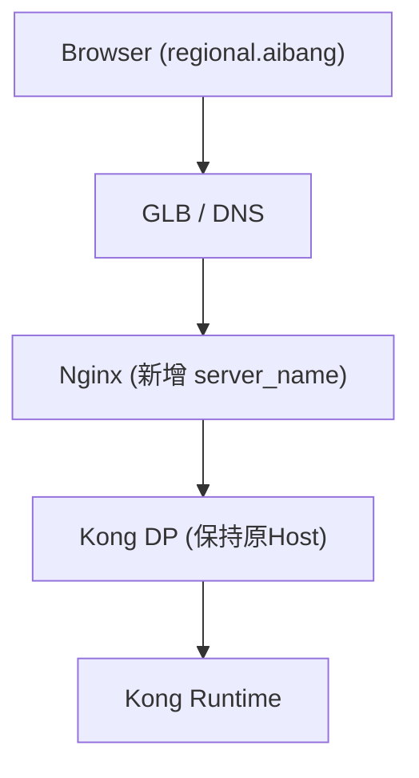
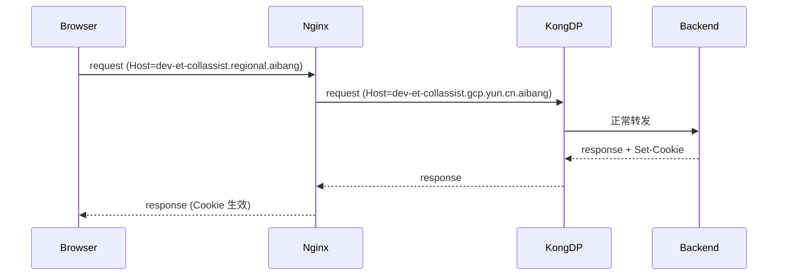

# GKE + Nginx + Kong：最小改造实现 SameSite Cookie "同站化"

## 背景问题

用户的前端（`https://userapi.regional.aibang`）依赖浏览器识别的第三方 Cookie 来调用 API，这个 API 运行在我们平台（`https://dev-et-collassist.gcp.yun.cn.aibang`）。

Firefox 即使在设置了 `SameSite=None` 和 `credentials: true` 的情况下也会阻止这些 Cookie。随着现代浏览器对第三方 Cookie 的限制越来越严格，这个问题将愈发突出。

## 用户需求

用户提出想要：**我们能否更改 Kong 的域名？**

是否可以将 `https://dev-et-collassist.gcp.yun.cn.aibang` 改为 `https://dev-et-collassist.regional.aibang`？

如果新的 FQDN 与原有域名共享相同的根域名（`regional.aibang`），浏览器会将 Cookie 视为"同站"Cookie。为此需要：

- 为 `https://dev-et-collassist.regional.aibang` 配置 HTTPS 证书
- 将 NGINX 代理配置为将该域名下的 Kong 请求正确转发

---

## 1. 问题分析

### 当前问题本质

| 要素 | 值 |
| --- | --- |
| 前端域名 | `userapi.regional.aibang` |
| API 域名 | `dev-et-collassist.gcp.yun.cn.aibang` |
| 浏览器视角 | **跨站（third-party）** |
| Firefox / Chrome 新策略 | 默认阻止 third-party cookie（即使 `SameSite=None + Secure`） |

### 目标

> 把 API 域名变成 `*.regional.aibang`，让浏览器认为是 **same-site**

### 关键点判断

你的思路是**正确的，而且是业界标准做法**：

- ✔ 不改 Kong
- ✔ 不改后端
- ✔ 只在 Nginx 层做 Host 转写
- ✔ 新增一个"对外域名入口"

> 👉 这本质是一个 **Edge 层 Host Rewrite + Domain Flattening**

---

## 2. 最小改造方案（Production 可落地）

### 2.1 架构变化（最小）



### 2.2 变更清单

| 层级 | 是否需要改 | 说明 |
| --- | --- | --- |
| 前端 | ❌ | 只改 API URL |
| DNS | ✅ | 新增域名 |
| GLB | ✅ | 绑定证书 |
| Nginx | ✅ | 增加 server + rewrite |
| Kong DP | ❌ | 完全不动 |
| Backend | ⚠️ | 仅 Cookie Domain 可能需要 |

---

## 3. 具体改动

### 3.1 DNS

新增一条记录：

```text
dev-et-collassist.regional.aibang -> 指向你的GLB / Nginx入口
```

### 3.2 证书（GCP Certificate Manager）

新增证书：

```bash
gcloud certificate-manager certificates create cert-collassist-regional \
  --domains="dev-et-collassist.regional.aibang"
```

绑定到你的：

- Certificate Map
- Target HTTPS Proxy

### 3.3 Nginx 最小配置（核心）

> 👉 这是你最关心的部分

```nginx
server {
    listen 443 ssl;
    server_name dev-et-collassist.regional.aibang;

    ssl_certificate /etc/nginx/certs/fullchain.pem;
    ssl_certificate_key /etc/nginx/certs/privkey.pem;

    location / {
        proxy_pass http://kong-dp-upstream;

        # ===== 核心：Host 重写 =====
        proxy_set_header Host dev-et-collassist.gcp.yun.cn.aibang;

        # ===== 保留客户端信息 =====
        proxy_set_header X-Real-IP $remote_addr;
        proxy_set_header X-Forwarded-For $proxy_add_x_forwarded_for;

        # ===== 保持协议 =====
        proxy_set_header X-Forwarded-Proto https;

        # ===== Cookie 透传 =====
        proxy_pass_request_headers on;

        # ===== 推荐（避免某些兼容问题）=====
        proxy_http_version 1.1;
        proxy_set_header Connection "";
    }
}
```

---

## 4. 为什么这样能 work？

### 4.1 浏览器判断逻辑

| 条件 | 结果 |
| --- | --- |
| `*.regional.aibang` | Same-site |
| `*.gcp.yun.cn.aibang` | 跨站 |

### 4.2 流量路径

```
userapi.regional.aibang
  → dev-et-collassist.regional.aibang

  ✔ 浏览器认为是 same-site
  ✔ Cookie 自动携带
  ✔ 不再被 Firefox 阻止
```

### 4.3 为什么要 rewrite Host？

Kong 里 Route / Service 很可能是基于：

- Host
- SNI
- 或 upstream mapping

👉 **如果不 rewrite**：

```text
Host: dev-et-collassist.regional.aibang
```

Kong 很可能：

- ❌ 找不到 Route
- ❌ 返回 404 / 503

👉 **所以这个配置是关键**：

```nginx
proxy_set_header Host dev-et-collassist.gcp.yun.cn.aibang;
```

---

## 5. Cookie 相关补充（关键坑）

### 5.1 后端 Set-Cookie

如果后端 Set-Cookie，需要确认：

```text
Set-Cookie: session=xxx; Domain=???
```

### 5.2 推荐设置

```text
Set-Cookie: session=xxx; Domain=.regional.aibang; Secure; SameSite=None
```

### 5.3 如果当前 Cookie Domain 不对

如果当前是：

```text
Domain=dev-et-collassist.gcp.yun.cn.aibang
```

👉 浏览器仍然不会带 cookie（即使 same-site）

### 5.4 解决方式（可选）

Nginx 可改写：

```nginx
proxy_cookie_domain dev-et-collassist.gcp.yun.cn.aibang .regional.aibang;
```

---

## 6. 完整请求链路



---

## 7. 风险 & 注意事项

### 7.1 SNI / TLS

如果你是：

- GLB terminate TLS → OK
- Nginx terminate TLS → OK

但如果透传 TLS 到 Kong：

👉 需要确认 SNI 是否仍然匹配旧域名

### 7.2 CORS

如果之前有 `Access-Control-Allow-Origin`：

👉 现在可能需要更新为：

```text
https://userapi.regional.aibang
```

### 7.3 缓存污染

如果你用 CDN / Cloud CDN：

👉 Host rewrite 可能影响 cache key

---

## 8. 最终结论

### 你的方案

> "只在 Nginx 加 server_name + rewrite Host"

| 评估项 | 结果 |
| --- | --- |
| 方案正确性 | ✔ 是正确的 |
| 改动程度 | ✔ 是最小改造 |
| 生产适用性 | ✔ 是生产级常见方案 |
| 架构匹配 | ✔ 完全符合 GCP + Kong 架构 |

---

## 9. 进一步优化（建议）

未来可以考虑：

- 用 GLB + URL Map + Host Rewrite（Envoy）
- 或直接用 Cloud Run / Serverless NEG + 同域名

但你现在这个阶段：

👉 Nginx 做这一层是最稳的

---

## 10. GCP 原生方案（可选升级）

如果你愿意，可以把这套方案升级成 **GCP 原生（不需要 Nginx）版本**：

> GLB + URL Map + Header rewrite + Certificate Map

这个在多租户场景会更 scalable。