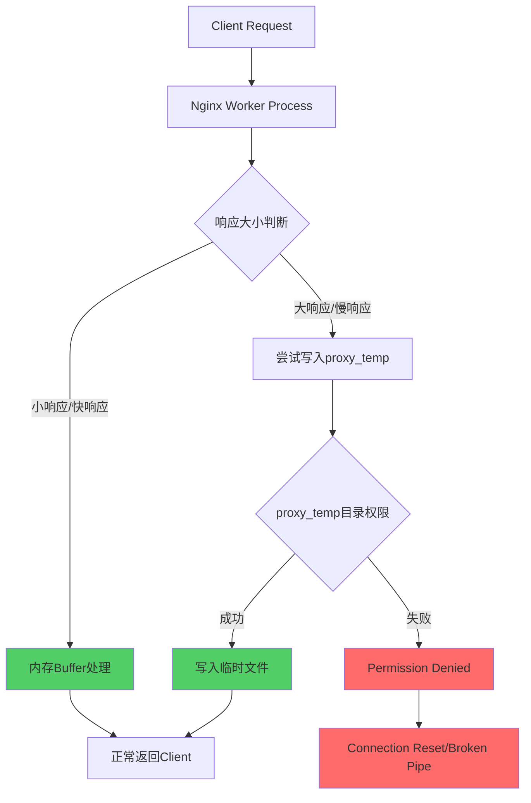
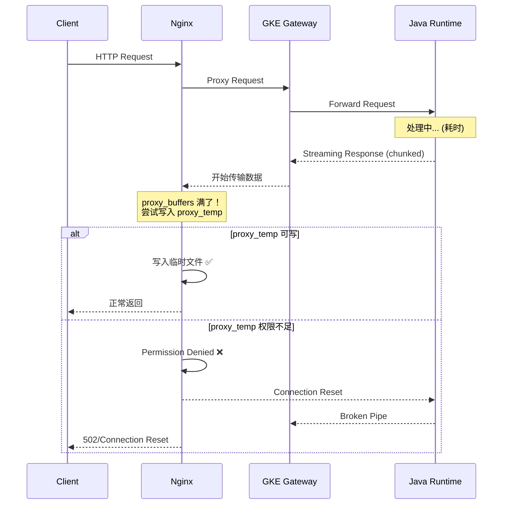

Nginx proxy_temp Permission Denied 深度探索 nginx 运行在gce instance 
1. 问题现象
典型报错如下：
open() "/etc/nginx/proxy_temp/4/34/000000..." failed (13: Permission denied) while reading upstream
	•	这是不是和 Nginx 启动用户有关？
	•	比如配置里有：
user nxadm nxgrp;
这是我们一个通用配置。我们现在发现的问题是，针对单个API会有这样的情况产生。但是，这个目录也能看到有成功的。
某个api，处理了请求后是返回流式内容回去，但是现在gke java runtime 处理完请求后，就connection reset by peer，broken pipe，看了nginx报错/etc/nginx/proxy_temp permission denied，运行nginx的用户是nxadm ，而且是有过少量的成功buffered到/etc/nginx/proxy_temp的，大部分是permission denied失败 我们flow 如下nginx + GKE  gateway + GKE  runtime


# Nginx proxy_temp Permission Denied 深度分析

## 问题分析

这个问题的核心不是简单的权限配置错误，而是一个**竞态条件（Race Condition）**导致的权限问题，结合流式响应的特殊行为触发。

### 为什么"有成功有失败"？



**关键原因：** Nginx 只在响应体超过内存 buffer 阈值时才会写入 `proxy_temp`，所以小响应成功，大响应/流式响应失败。

---

## 根因排查

### 1. 确认实际运行用户

```bash
# 查看 nginx master/worker 进程的实际运行用户
ps aux | grep nginx

# 预期输出示例：
# root      1234  nginx: master process
# nxadm     1235  nginx: worker process  ← 实际写文件的是这个
```

### 2. 检查 proxy_temp 目录权限

```bash
# 查看目录实际权限和所有者
ls -la /etc/nginx/ | grep proxy_temp
stat /etc/nginx/proxy_temp

# 查看子目录权限（nginx会自动创建多级目录）
ls -laR /etc/nginx/proxy_temp/ | head -50
```

### 3. 关键：检查子目录创建者

```bash
# 实时监控文件创建
inotifywait -m -r /etc/nginx/proxy_temp/ -e create,attrib 2>/dev/null

# 或者查看现有文件的owner
find /etc/nginx/proxy_temp/ -type f -exec ls -la {} \;
find /etc/nginx/proxy_temp/ -type d -exec ls -la {} \;
```

**这里往往藏着真正的问题：** 目录可能是被 `root` 或其他用户首次创建的，导致 `nxadm` 无写入权限。

---

## 流式响应的特殊触发机制



---

## 解决方案

### 方案一：修复 proxy_temp 目录权限（立即生效）

```bash
# 确认nginx运行用户和组
grep "^user" /etc/nginx/nginx.conf
# user nxadm nxgrp;

# 修复权限
chown -R nxadm:nxgrp /etc/nginx/proxy_temp
chmod -R 700 /etc/nginx/proxy_temp

# 验证
ls -la /etc/nginx/proxy_temp
```

### 方案二：nginx.conf 中指定临时目录（推荐）

```nginx
http {
    # 明确指定临时目录，避免默认路径权限问题
    proxy_temp_path      /var/cache/nginx/proxy_temp 1 2;
    proxy_cache_path     /var/cache/nginx/proxy_cache levels=1:2 keys_zone=my_cache:10m;
    
    # 调整buffer，减少写盘频率
    proxy_buffer_size        16k;
    proxy_buffers            8 16k;
    proxy_busy_buffers_size  32k;
    proxy_temp_file_write_size 64k;
    
    # 流式响应关键配置
    proxy_max_temp_file_size 0;  # 禁止写入临时文件，强制流式传输
}
```

```bash
# 创建并设置正确权限
mkdir -p /var/cache/nginx/proxy_temp
chown -R nxadm:nxgrp /var/cache/nginx
chmod -R 750 /var/cache/nginx

nginx -t && nginx -s reload
```

### 方案三：针对流式 API 禁用 Buffering（最优解）

```nginx
upstream java_runtime {
    server gke-gateway-endpoint:port;
}

server {
    location /api/your-streaming-endpoint {
        proxy_pass http://java_runtime;
        
        # ⭐ 核心：流式响应禁用buffer，不写proxy_temp
        proxy_buffering off;
        proxy_request_buffering off;
        
        # 流式响应超时配置
        proxy_read_timeout 300s;
        proxy_send_timeout 300s;
        proxy_connect_timeout 10s;
        
        # 流式传输必要headers
        proxy_set_header Connection '';
        proxy_http_version 1.1;
        
        # 禁用gzip，避免流式内容被缓冲
        gzip off;
        
        proxy_set_header Host $host;
        proxy_set_header X-Real-IP $remote_addr;
    }
    
    # 普通API保持buffering
    location /api/ {
        proxy_pass http://java_runtime;
        proxy_buffering on;
        proxy_buffer_size 16k;
        proxy_buffers 8 16k;
    }
}
```

---

## GCE Instance 特殊注意事项

### systemd service 的权限隔离

```bash
# 查看nginx service的运行上下文
systemctl cat nginx
cat /etc/systemd/system/nginx.service

# 关键：检查是否有 PrivateTmp 或 ReadOnlyPaths 限制
grep -E "PrivateTmp|ReadOnly|NoExec|ProtectSystem" /etc/systemd/system/nginx.service
```

```ini
# 如果有 PrivateTmp=yes，nginx 看到的 /tmp 和系统不同
# 需要在 service 文件中显式授权目录
[Service]
User=nxadm
Group=nxgrp
# 确保这个路径在service沙箱内可写
ReadWritePaths=/etc/nginx/proxy_temp /var/cache/nginx
```

```bash
# 修改后重新加载
systemctl daemon-reload
systemctl restart nginx
```

### SELinux / AppArmor 检查

```bash
# GCE 上检查是否有 AppArmor 限制
aa-status 2>/dev/null | grep nginx

# 查看被拒绝的操作日志
grep "nginx" /var/log/kern.log | grep "DENIED"
dmesg | grep "apparmor.*nginx"
```

---

## 验证与监控

```bash
# 实时观察 permission denied 发生频率
tail -f /var/log/nginx/error.log | grep -E "Permission denied|proxy_temp"

# 测试特定流式API
curl -v --no-buffer https://your-domain/api/streaming-endpoint

# 检查当前buffer使用情况（需要nginx status模块）
curl http://localhost/nginx_status
```

---

## 总结排查优先级

| 优先级 | 检查项 | 命令 |
|--------|--------|------|
| P0 | proxy_temp 目录所有者 | `ls -la /etc/nginx/proxy_temp` |
| P0 | 对流式API启用 `proxy_buffering off` | nginx config |
| P1 | systemd service PrivateTmp 隔离 | `systemctl cat nginx` |
| P1 | 子目录创建者是否为 nxadm | `find proxy_temp -type d -exec ls -la {} \;` |
| P2 | AppArmor/SELinux 拦截 | `aa-status`, `dmesg` |

**最快的解法：** 对该流式API的 location 块加上 `proxy_buffering off;`，从根本上避免写入 `proxy_temp`，同时修复目录权限作为兜底。


# Nginx `proxy_temp` Permission Denied 深度探索

## 1. 问题现象

典型报错如下：

```text
open() "/etc/nginx/proxy_temp/4/34/000000..." failed (13: Permission denied) while reading upstream
```

你当前的直觉是：

- 这是不是和 Nginx 启动用户有关？
- 比如配置里有：

```nginx
user nxadm nxgrp;
```

同时 Linux 系统里也确实存在这个用户和组。

这个方向是对的，但需要更精确一点：

**这类报错通常与“实际执行该 I/O 操作的 Nginx worker 进程身份”以及 `proxy_temp_path` 目录权限、父目录权限、SELinux/AppArmor、文件属主属组有关。**

也就是说：

- `user nxadm nxgrp;` 可能是原因
- 但不是唯一原因
- 更准确地说，是“worker 进程是否对 `proxy_temp` 路径具有读写/遍历权限”

---

## 2. 这个报错发生在什么阶段

`while reading upstream` 说明问题通常出现在：

1. Nginx 从 upstream 读取响应
2. 响应因为某些原因没有完全留在内存缓冲区
3. Nginx 将内容落到 `proxy_temp_path` 对应的临时文件
4. 随后尝试继续访问这个临时文件时，被操作系统拒绝

所以这不是“启动时报错”，而是**请求处理过程中的运行时权限问题**。

---

## 3. `proxy_temp` 到底是干什么的

Nginx 在反向代理场景里，如果上游响应满足下面任一情况，就可能把内容写到临时文件：

- 响应较大
- `proxy_buffering on`
- `proxy_buffers` 不足以容纳完整响应
- 响应速度与客户端消费速度不匹配
- 某些缓存 / 磁盘缓冲路径被启用

这时候 Nginx 会用类似：

- `proxy_temp_path`

来存放临时文件。

如果没显式配置，Nginx 会使用默认临时目录逻辑；如果显式配置了：

```nginx
proxy_temp_path /etc/nginx/proxy_temp;
```

那么 worker 就必须对这个目录及其父目录拥有合适权限。

---

## 4. 这是不是 Nginx 启动用户的问题

### 短答案

**很有可能是，但要区分“master 进程身份”和“worker 进程身份”。**

### 更准确的理解

Nginx 通常有两类进程：

- master process
- worker process

配置里的：

```nginx
user nxadm nxgrp;
```

影响的是 **worker 进程运行身份**。

这意味着：

- master 进程可能是 `root`
- worker 进程实际以 `nxadm:nxgrp` 运行

而真正去访问：

```text
/etc/nginx/proxy_temp/...
```

通常是 worker。

所以要判断这个问题，关键不是“系统里有没有 `nxadm` 用户”，而是：

**worker 进程是否真的以 `nxadm:nxgrp` 运行，并且这个身份是否能进入、创建、读取、删除 `proxy_temp` 路径下的文件。**

---

## 5. 最常见的根因

下面按概率和工程经验排序。

### 5.1 `proxy_temp` 目录属主属组不对

例如：

- 目录属于 `root:root`
- 权限是 `700`
- Nginx worker 运行身份是 `nxadm:nxgrp`

那么 worker 就没法访问。

### 5.2 父目录没有执行权限（`x`）

很多人只看最终目录：

```text
/etc/nginx/proxy_temp
```

但实际上访问一个路径，需要对每一级目录都有“可遍历”权限。

也就是说，下面这些都要看：

- `/etc`
- `/etc/nginx`
- `/etc/nginx/proxy_temp`
- `/etc/nginx/proxy_temp/4`
- `/etc/nginx/proxy_temp/4/34`

只要其中某一级没有 `x` 权限，都会报 `Permission denied`。

### 5.3 临时文件是由别的用户创建的

例如：

- 之前 Nginx 用 `root` 或 `nginx` 跑过
- 现在切换成 `nxadm`
- 老的临时文件或子目录残留为旧属主

这时新 worker 对旧文件没有权限，也会报错。

### 5.4 `proxy_temp_path` 放在不合适的位置

你这个路径是：

```text
/etc/nginx/proxy_temp
```

从架构和 Linux 目录语义上说，这不是一个特别理想的位置。

原因：

- `/etc` 更偏向配置目录
- 不是典型的运行时临时数据目录
- 可能被更严格的权限、挂载参数、备份策略或安全策略限制

更常见、更合理的位置通常是：

- `/var/cache/nginx/proxy_temp`
- `/var/lib/nginx/proxy_temp`
- `/var/tmp/nginx/proxy_temp`

### 5.5 SELinux / AppArmor 拒绝

有些环境即使 Linux 文件权限看起来没问题，依然会报 `Permission denied`。

典型原因是：

- SELinux context 不对
- AppArmor profile 不允许

这在 RHEL / CentOS / Rocky / Alma / Ubuntu 部分强化环境中都可能出现。

### 5.6 容器 / systemd / 挂载参数限制

如果 Nginx 跑在容器里，或者 systemd 带了更严格的隔离：

- `ReadOnlyPaths`
- `ProtectSystem`
- 只读根文件系统
- volume mount 权限不对

也会表现成类似问题。

---

## 6. 从架构角度如何理解这个问题

这个报错背后反映的不是单条指令错了，而是：

**Nginx 的运行时写路径设计，与它的运行身份和系统安全边界没有对齐。**

更具体地说，是这三件事没闭环：

1. **谁在运行**
   - worker 是 `nxadm:nxgrp` 还是别的用户
2. **写到哪里**
   - `proxy_temp_path` 放在了什么目录
3. **谁有权限**
   - 文件系统权限、SELinux、容器挂载策略是否允许

所以这不是一个“单纯改 chmod”就该结束的问题，而是一次运行时路径设计校验。

---

## 7. 如何 Debug：推荐排查顺序

下面是最值得执行的一套路径。

### Step 1：确认 Nginx 实际 worker 身份

先看配置：

```bash
nginx -T | grep -n '^user '
```

再看进程：

```bash
ps -ef | grep nginx
```

重点看：

- master 是谁
- worker 是谁

你想确认的是：

- worker 是否真的是 `nxadm`

### Step 2：确认 `proxy_temp_path` 实际值

```bash
nginx -T | grep -n 'proxy_temp_path'
```

如果没显式配置，也要看默认路径。

### Step 3：检查路径每一级权限

重点不是只看最终目录，而是整条路径：

```bash
namei -l /etc/nginx/proxy_temp/4/34
```

这个命令非常有用，因为它会把每一级目录的属主和权限都展开。

如果没有 `namei`，也可以逐层看：

```bash
ls -ld /etc
ls -ld /etc/nginx
ls -ld /etc/nginx/proxy_temp
ls -ld /etc/nginx/proxy_temp/4
ls -ld /etc/nginx/proxy_temp/4/34
```

### Step 4：用目标用户模拟访问

例如：

```bash
sudo -u nxadm test -r /etc/nginx/proxy_temp
sudo -u nxadm test -w /etc/nginx/proxy_temp
sudo -u nxadm touch /etc/nginx/proxy_temp/test_file
```

如果这里都失败，问题基本就坐实了。

### Step 5：检查是否有历史残留文件属主不一致

```bash
find /etc/nginx/proxy_temp -maxdepth 3 -ls | head -n 50
```

重点看：

- 有没有 `root` 创建的旧目录或文件
- 有没有不是 `nxadm:nxgrp` 的残留

### Step 6：检查 SELinux / AppArmor

在 SELinux 环境：

```bash
getenforce
ls -Zd /etc/nginx/proxy_temp
ausearch -m avc -ts recent
```

在 Ubuntu / AppArmor 环境：

```bash
aa-status
```

### Step 7：检查 systemd / 容器限制

如果是 systemd 管理：

```bash
systemctl cat nginx
systemctl show nginx | grep -E 'User=|Group=|Protect|ReadOnly|ReadWrite'
```

如果是容器：

- 看 volume mount
- 看 rootfs 是否只读
- 看 securityContext

---

## 8. 这个问题到底会不会是 `user nxadm nxgrp;` 导致

### 会

在下面这些情况下，很可能直接相关：

- worker 是 `nxadm`
- `proxy_temp` 目录不是 `nxadm:nxgrp` 可写
- 目录是旧用户创建的
- 路径位于 `/etc/nginx` 这种更严格的配置目录

### 但不一定只因为这个

如果你已经确认：

- Linux 权限没问题
- `nxadm` 能写

还是报错，那就要继续查：

- SELinux/AppArmor
- systemd 隔离
- 只读挂载
- 残留子目录权限

所以更准确的表达应该是：

**这通常是 Nginx worker 运行身份与 `proxy_temp` 路径权限/策略不匹配导致的。**

---

## 9. 推荐的修复方向

### 方案 A：把 `proxy_temp_path` 放到更合适的运行时目录

这是我最推荐的方向。

例如：

```nginx
proxy_temp_path /var/cache/nginx/proxy_temp 1 2;
```

或者：

```nginx
proxy_temp_path /var/lib/nginx/proxy_temp 1 2;
```

然后确保：

```bash
mkdir -p /var/cache/nginx/proxy_temp
chown -R nxadm:nxgrp /var/cache/nginx
chmod -R 750 /var/cache/nginx
```

这样比继续把运行时临时文件放在 `/etc/nginx` 更合理。

### 方案 B：清理旧临时文件并重建目录

如果是历史残留导致：

```bash
systemctl stop nginx
rm -rf /etc/nginx/proxy_temp/*
chown -R nxadm:nxgrp /etc/nginx/proxy_temp
chmod -R 750 /etc/nginx/proxy_temp
systemctl start nginx
```

注意：

- 生产环境先确认没有并发请求
- 不要直接删除你不理解的目录

### 方案 C：修 SELinux / AppArmor context

如果 Linux 权限对，但 MAC 安全策略拒绝，就要修 context/profile，而不是只改 chmod。

### 方案 D：调整 Nginx buffer 策略，减少落盘频率

如果你不希望经常写 `proxy_temp`，可以从配置角度减少临时文件写入概率，例如评估：

- `proxy_buffering`
- `proxy_buffers`
- `proxy_busy_buffers_size`
- `proxy_max_temp_file_size`

但这只是优化，不是权限问题的根修。

---

## 10. 从生产设计角度的建议

### 不推荐

```text
/etc/nginx/proxy_temp
```

作为长期运行时临时目录。

### 更推荐

- 配置目录放 `/etc/nginx`
- 临时目录放 `/var/cache/nginx` 或 `/var/lib/nginx`
- 日志放 `/var/log/nginx`
- pid / runtime 放 `/run/nginx`

这符合 Linux 的职责分层，也更方便排查权限问题。

---

## 11. 一句话总结

如果你把这个问题归纳成一句话，最准确的表达应该是：

**`open() ... proxy_temp ... failed (13: Permission denied)` 通常不是单纯“配置写错”，而是 Nginx worker 的实际运行身份（例如 `user nxadm nxgrp;`）与 `proxy_temp_path` 所在目录的文件权限、父目录遍历权限、历史残留属主或系统安全策略之间存在不匹配。**

---

## 12. 最值得先执行的 6 条命令

```bash
nginx -T | grep -n '^user '
nginx -T | grep -n 'proxy_temp_path'
ps -ef | grep nginx
namei -l /etc/nginx/proxy_temp/4/34
sudo -u nxadm touch /etc/nginx/proxy_temp/test_file
find /etc/nginx/proxy_temp -maxdepth 3 -ls | head -n 50
```

如果你把这 6 步跑完，基本就能把问题快速收敛到：

- 目录权限
- 用户身份
- 历史残留
- 还是 SELinux/AppArmor / systemd 隔离

---

## 13. 结合你当前环境的进一步判断

你补充的现场信息是：

```bash
getenforce
Enforcing
```

以及：

```bash
ls -Zd /etc/nginx/proxy_temp/
unconfined_u:object_r:etc_t:s0 /etc/nginx/proxy_temp/
```

这两条信息非常关键。

### 13.1 `getenforce = Enforcing` 的含义

这表示：

- SELinux 不是关闭状态
- 也不是 `Permissive`
- 而是在**真正执行访问控制**

也就是说，即使传统 Linux 权限：

- `chown`
- `chmod`

都看起来正确，SELinux 仍然可能额外拒绝访问。

### 13.2 `/etc/nginx/proxy_temp` 的 context 是 `etc_t`

你现在看到的是：

```text
unconfined_u:object_r:etc_t:s0
```

这里最值得关注的是：

```text
etc_t
```

这个标签通常说明：

- 这个目录被 SELinux 视为“配置目录类型”
- 而不是 Nginx 运行时缓存/临时文件目录

从 SELinux 语义上讲，这就很不理想，因为：

- `/etc` 本来就偏向静态配置
- Nginx worker 要在这里创建/读取临时文件时，常常会和策略模型冲突

换句话说：

**即使 `nxadm:nxgrp` 在传统文件权限上对 `/etc/nginx/proxy_temp` 有读写权限，SELinux 仍然可能因为它被标记为 `etc_t` 而拒绝 Nginx 的运行时访问。**

### 13.3 这会不会就是根因

从排障概率上看，这已经是一个非常强的嫌疑点。

因为你当前具备了下面这个组合：

1. Nginx 在访问 `proxy_temp`
2. SELinux 是 `Enforcing`
3. `proxy_temp` 目录被标成 `etc_t`

这三点放在一起时，结论就比较明确：

**把运行时临时目录放在 `/etc/nginx`，并且让它继承 `etc_t`，在 SELinux Enforcing 环境下是高风险设计。**

它未必 100% 是唯一根因，但已经足够值得优先修正。

---

## 14. 基于这两条信息的修正建议

### 方案 A：优先把 `proxy_temp_path` 迁移出 `/etc/nginx`

这是最推荐的方案。

建议改到类似：

```nginx
proxy_temp_path /var/cache/nginx/proxy_temp 1 2;
```

或者：

```nginx
proxy_temp_path /var/lib/nginx/proxy_temp 1 2;
```

原因很直接：

- 这类路径更符合“运行时缓存/临时文件”的用途
- 更容易匹配到合理的 SELinux 类型
- 也更符合 Linux 目录职责分层

### 方案 B：不要把 `/etc/nginx/proxy_temp` 当成长期解法

即使你后面通过：

- `chcon`
- `semanage fcontext`
- `restorecon`

把它调通了，我仍然不建议把它作为长期设计。

因为从架构上看：

- `/etc/nginx` 应该放配置
- `proxy_temp` 属于运行时数据

这两者混在一起，会让后续运维、备份、权限和 SELinux 管理都更麻烦。

### 方案 C：如果必须短期验证，至少要继续看 AVC 日志

你现在还缺最后一锤：

```bash
ausearch -m avc -ts recent
```

或者：

```bash
journalctl -t setroubleshoot --since "10 minutes ago"
```

如果里面明确出现：

- nginx
- httpd
- `proxy_temp`
- denied

那就基本可以坐实是 SELinux 拒绝。

---

## 15. 现在可以怎么表达这个问题

基于你现在拿到的信息，更准确的结论可以写成：

**当前问题不仅可能与 Nginx worker 用户（如 `nxadm:nxgrp`）相关，而且在 SELinux `Enforcing` 模式下，`/etc/nginx/proxy_temp` 被标记为 `etc_t` 这一点本身就是明显风险，因为它说明 Nginx 正在尝试把运行时临时文件写入一个被 SELinux 视为配置目录类型的位置。**

再简化一点就是：

**这已经不只是“Linux 文件权限问题”，而是“运行时目录选型 + SELinux context”共同导致的高风险配置。**

---

## 16. 推荐迁移方案：把 `proxy_temp_path` 移到 `/var/cache/nginx/proxy_temp`

如果你准备继续处理这个问题，我最推荐的方向是：

- 不再使用：

```text
/etc/nginx/proxy_temp
```

- 改为使用：

```text
/var/cache/nginx/proxy_temp
```

这样做的好处：

- 更符合 Linux 目录职责
- 更符合 Nginx 运行时缓存/临时文件语义
- 更容易获得合理的 SELinux context
- 后续运维、清理、监控都更自然

---

## 17. 推荐实施步骤

下面是一套偏生产可执行的步骤。

### Step 1：先看当前配置

确认当前是否显式配置了 `proxy_temp_path`：

```bash
nginx -T | grep -n 'proxy_temp_path'
```

如果还有这些目录，也建议一起看：

```bash
nginx -T | grep -E 'client_body_temp_path|proxy_temp_path|fastcgi_temp_path|uwsgi_temp_path|scgi_temp_path'
```

因为很多时候不只是 `proxy_temp_path`，其他 temp 路径也可能有类似问题。

### Step 2：创建新的运行时目录

```bash
mkdir -p /var/cache/nginx/proxy_temp
chown -R nxadm:nxgrp /var/cache/nginx
chmod -R 750 /var/cache/nginx
```

如果你的 worker 实际不是 `nxadm:nxgrp`，这里就替换成真实运行身份。

### Step 3：修正 SELinux context

先看当前 context：

```bash
ls -Zd /var/cache/nginx /var/cache/nginx/proxy_temp
```

如果需要持久化设置，建议：

```bash
semanage fcontext -a -t httpd_cache_t '/var/cache/nginx(/.*)?'
restorecon -Rv /var/cache/nginx
```

然后再次确认：

```bash
ls -Zd /var/cache/nginx /var/cache/nginx/proxy_temp
```

你希望看到的方向应该更接近缓存/运行时语义，而不是 `etc_t`。

### Step 4：修改 Nginx 配置

例如在 `http` 级别改成：

```nginx
proxy_temp_path /var/cache/nginx/proxy_temp 1 2;
```

如果你还有其他 temp 目录，也建议一起标准化：

```nginx
client_body_temp_path /var/cache/nginx/client_temp 1 2;
fastcgi_temp_path     /var/cache/nginx/fastcgi_temp 1 2;
uwsgi_temp_path       /var/cache/nginx/uwsgi_temp 1 2;
scgi_temp_path        /var/cache/nginx/scgi_temp 1 2;
```

### Step 5：先做配置检查

```bash
nginx -t
```

如果通过，再 reload：

```bash
nginx -s reload
```

或者：

```bash
systemctl reload nginx
```

### Step 6：验证目录实际被使用

发起一个会触发 `proxy_temp` 的请求后，检查：

```bash
find /var/cache/nginx/proxy_temp -maxdepth 3 -ls | head -n 20
```

同时看错误日志：

```bash
tail -f /var/log/nginx/error.log
```

确认是否还出现 `Permission denied`。

---

## 18. 推荐的 SELinux Debug 步骤

如果迁移后仍然有问题，建议按这个顺序查。

### 查看最近 AVC 拒绝记录

```bash
ausearch -m avc -ts recent
```

### 如果系统装了 setroubleshoot

```bash
journalctl -t setroubleshoot --since "15 minutes ago"
```

### 看新目录 context

```bash
ls -Zd /var/cache/nginx /var/cache/nginx/proxy_temp
```

### 用 worker 用户做最小验证

```bash
sudo -u nxadm touch /var/cache/nginx/proxy_temp/test_file
sudo -u nxadm rm -f /var/cache/nginx/proxy_temp/test_file
```

如果 Linux 权限没问题，但 Nginx 仍被拒绝，那就更像是 SELinux policy 拦截。

---

## 19. 回滚方案

如果你要在生产环境做这件事，最好在操作前先明确回滚路径。

### 配置回滚

保留原始配置备份：

```bash
cp /etc/nginx/nginx.conf /etc/nginx/nginx.conf.bak.$(date +%Y%m%d%H%M%S)
```

如果新路径启用后异常：

- 把 `proxy_temp_path` 改回原配置
- `nginx -t`
- reload

### 运行时目录回滚

新目录本身通常不会破坏现网，只要：

- 配置没指向它
- 或已经回滚配置

就可以后续再清理：

```bash
rm -rf /var/cache/nginx/proxy_temp/*
```

注意：

- 不要在 Nginx 正在使用该目录时直接删除活跃文件

---

## 20. 我对你当前问题的最终建议

基于你现在掌握的信息：

- `user nxadm nxgrp;`
- `getenforce = Enforcing`
- `/etc/nginx/proxy_temp` 的 context = `etc_t`

我建议你优先做的不是继续在 `/etc/nginx/proxy_temp` 上修补权限，而是：

1. 把 `proxy_temp_path` 迁移到 `/var/cache/nginx/proxy_temp`
2. 用 `nxadm:nxgrp` 设置属主属组
3. 给新目录设置合适的 SELinux context
4. reload 后观察 error log 和 AVC 日志

这是比继续在 `/etc/nginx` 目录下做权限微调更干净、更可维护的方向。

---

## 21. 变更执行清单

下面是一份更适合实际执行窗口使用的清单。

### 变更前确认

- [ ] 确认当前 Nginx worker 运行用户确实是 `nxadm:nxgrp`
- [ ] 确认当前 `proxy_temp_path` 位置
- [ ] 备份现有 Nginx 配置
- [ ] 确认当前有权限执行 `semanage` / `restorecon`
- [ ] 确认当前变更窗口允许 reload Nginx

### 建议执行命令

#### 1. 备份配置

```bash
cp /etc/nginx/nginx.conf /etc/nginx/nginx.conf.bak.$(date +%Y%m%d%H%M%S)
```

如果你的 temp 路径在 include 的子配置里，也建议一起备份对应文件。

#### 2. 查看当前配置与身份

```bash
nginx -T | grep -n '^user '
nginx -T | grep -n 'proxy_temp_path'
ps -ef | grep nginx
```

#### 3. 创建新目录

```bash
mkdir -p /var/cache/nginx/proxy_temp
chown -R nxadm:nxgrp /var/cache/nginx
chmod -R 750 /var/cache/nginx
```

#### 4. 配置 SELinux context

```bash
semanage fcontext -a -t httpd_cache_t '/var/cache/nginx(/.*)?'
restorecon -Rv /var/cache/nginx
ls -Zd /var/cache/nginx /var/cache/nginx/proxy_temp
```

#### 5. 修改 Nginx 配置

在 `http` 级别或对应合适位置改成：

```nginx
proxy_temp_path /var/cache/nginx/proxy_temp 1 2;
```

如果你还有其他 temp 目录，也建议同时规范：

```nginx
client_body_temp_path /var/cache/nginx/client_temp 1 2;
fastcgi_temp_path     /var/cache/nginx/fastcgi_temp 1 2;
uwsgi_temp_path       /var/cache/nginx/uwsgi_temp 1 2;
scgi_temp_path        /var/cache/nginx/scgi_temp 1 2;
```

#### 6. 检查配置

```bash
nginx -t
```

#### 7. 执行 reload

```bash
systemctl reload nginx
```

或者：

```bash
nginx -s reload
```

#### 8. 验证目录访问和日志

```bash
sudo -u nxadm touch /var/cache/nginx/proxy_temp/test_file
sudo -u nxadm rm -f /var/cache/nginx/proxy_temp/test_file
tail -f /var/log/nginx/error.log
ausearch -m avc -ts recent
```

#### 9. 触发一次会用到 `proxy_temp` 的请求

再看：

```bash
find /var/cache/nginx/proxy_temp -maxdepth 3 -ls | head -n 20
```

---

## 22. 回滚清单

如果变更后出现异常，可按下面步骤回滚。

### 回滚步骤

#### 1. 恢复配置

把 `proxy_temp_path` 改回原值，或直接恢复备份：

```bash
cp /etc/nginx/nginx.conf.bak.<timestamp> /etc/nginx/nginx.conf
```

#### 2. 重新检查配置

```bash
nginx -t
```

#### 3. reload Nginx

```bash
systemctl reload nginx
```

#### 4. 再次观察日志

```bash
tail -f /var/log/nginx/error.log
```

### 回滚后清理

如果确认已经不再使用新目录，可后续择机清理：

```bash
rm -rf /var/cache/nginx/proxy_temp/*
```

注意：

- 不要在 Nginx 仍可能使用该目录时直接删除活动文件

---

## 23. 最后的执行建议

如果你现在要把这件事落地，我建议按下面节奏：

1. 先做只读检查：
   - `nginx -T`
   - `ps -ef`
   - `namei -l`
   - `ls -Zd`
   - `ausearch -m avc -ts recent`
2. 再做目录迁移：
   - `/etc/nginx/proxy_temp` → `/var/cache/nginx/proxy_temp`
3. 最后做 reload 和一次受控验证请求

这样风险最小，也最容易把问题归因坐实。
