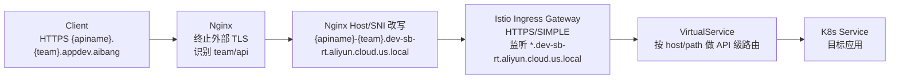
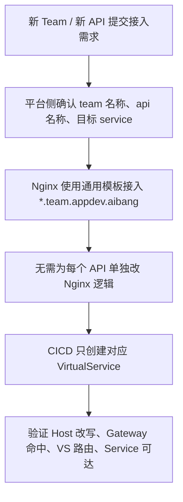
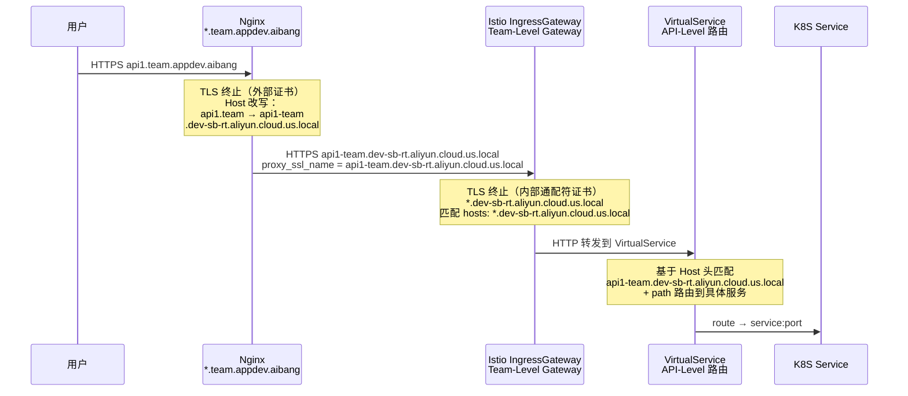

# Nginx 7层代理 + Istio 增强方案

## 1. 文档目标

这份文档基于现有需求记录，整理出以下内容：

- 核心需求是什么
- 当前证书与域名约束下，什么方案最现实
- 哪些配置应该放在 Nginx，哪些应该放在 Istio Gateway / VirtualService
- 这样做对 Onboarding、CI/CD、运维复杂度分别有什么影响
- 给出一套可直接参考的配置模板

这份文档尽量不改动原始内容。原始记录保留在文末，作为独立章节。

---

## 2. 核心需求整理

### 2.1 业务目标

你当前想解决的问题，本质上是：

1. 外部统一使用团队级通配符域名接入：
   `{apiname}.{team}.appdev.aibang`
2. Nginx 作为统一入口，接收外部请求后转发到 Istio Ingress Gateway。
3. 转发过程中，需要把外部 Host 改写成内部可被现有证书覆盖的域名。
4. Team 级配置尽量模板化，降低 onboarding 成本。
5. API 级差异化路由和配置，尽量收敛到 Istio VirtualService 层。
6. 不希望把过多 team-level 规则下沉到每个 API/每个团队自己的 CI/CD 流程里。
7. Nginx 接外部域名 -> 改写 Host/SNI -> Gateway 监听内部 wildcard -> VirtualService 做 API 级路由

### 2.2 技术约束

| 约束项       | 当前现实                                              |
| ------------ | ----------------------------------------------------- |
| 外部访问域名 | `{apiname}.{team}.appdev.aibang`                      |
| 内部证书     | `*.dev-sb-rt.aliyun.cloud.us.local`                   |
| 证书覆盖能力 | 只能覆盖单层子域                                      |
| 可覆盖示例   | `api1-abjx.dev-sb-rt.aliyun.cloud.us.local`           |
| 不可覆盖示例 | `api1.abjx.dev-sb-rt.aliyun.cloud.us.local`           |
| 直接影响     | 内部域名不能继续按 `api.team.domain` 这种两层子域设计 |

### 2.3 核心结论

在你当前证书约束下，内部域名必须改成单层子域形态，最合理的映射方式是：

| 外部域名                  | 内部域名                                    |
| ------------------------- | ------------------------------------------- |
| `api1.abjx.appdev.aibang` | `api1-abjx.dev-sb-rt.aliyun.cloud.us.local` |
| `api2.abjx.appdev.aibang` | `api2-abjx.dev-sb-rt.aliyun.cloud.us.local` |

也就是说：

`{apiname}.{team}.appdev.aibang` -> `{apiname}-{team}.dev-sb-rt.aliyun.cloud.us.local`

这个映射不是“可选优化”，而是你当前证书模型下最现实的落地方案。

---

## 3. 架构评估

### 3.1 需要先明确的一点

你原始诉求里有一句：

`gateway 里面也是侦听 *.team.appdev.aibang 的通配符域名`

这件事要分场景看：

| 场景                                                              | 是否成立               | 说明                                                                          |
| ----------------------------------------------------------------- | ---------------------- | ----------------------------------------------------------------------------- |
| Nginx 改写 Host/SNI 后，再由 Istio Gateway 做 `HTTPS/SIMPLE` 终止 | 不推荐继续监听外部域名 | 因为进入 Gateway 的 Host/SNI 已经是内部域名，Gateway 更应该监听内部域名       |
| Nginx 不改写 Host，直接透传外部 Host 给 Gateway                   | 可以                   | 但 Gateway 需要处理外部域名证书与团队级 host 管理，CI/CD 和证书管理成本会上升 |
| Nginx TLS 终止，转内网 HTTP 给 Gateway                            | 可以监听外部 host      | 但这会改变当前的 TLS 安全边界，不是你现在最贴近的设计                         |

### 3.2 推荐架构

推荐把职责切成三层：

| 层级           | 推荐职责                                                                               | 是否推荐 |
| -------------- | -------------------------------------------------------------------------------------- | -------- |
| Nginx          | 外部 TLS 接入、团队级通配符接入、Host/SNI 改写、保留 `X-Original-Host`                 | 推荐     |
| Istio Gateway  | 监听内部通配符域名 `*.dev-sb-rt.aliyun.cloud.us.local`，使用内部 wildcard 证书统一接入 | 强烈推荐 |
| VirtualService | API 级路由、路径匹配、超时/重试、Header 补充、灰度等                                   | 强烈推荐 |

### 3.3 为什么这是更稳的 V1

| 维度       | 推荐方案：Nginx 做 Team 级改写，Istio 做 API 级路由 | 把更多逻辑下沉到每个 team / API 的 VS   |
| ---------- | --------------------------------------------------- | --------------------------------------- |
| 证书适配   | 简单，直接适配现有内部 wildcard 证书                | 复杂，容易反向推动证书模型变化          |
| Onboarding | 稳定模板化                                          | 容易分散到不同团队流水线                |
| CI/CD 负担 | CI/CD 只管 API 级 VS                                | CI/CD 需要参与更多 team-level host 规则 |
| 可维护性   | 高                                                  | 中                                      |
| 架构一致性 | 高                                                  | 中                                      |
| 风险       | 低                                                  | 中高                                    |

### 3.4 复杂度评级

`Moderate`

原因：

- 方案本身不复杂
- 但涉及外部域名、内部证书、Nginx Host/SNI 改写、Istio Gateway TLS 行为的一致性
- 一旦 Host、SNI、Gateway `hosts`、证书 `credentialName` 不一致，就会出现握手失败或 404 路由失败

---

## 4. 推荐流量模型

### 4.1 推荐 Follow Flow



### 4.2 关键头与关键字段的变化

| 阶段               | Host                                               | SNI                                                | 备注                       |
| ------------------ | -------------------------------------------------- | -------------------------------------------------- | -------------------------- |
| 用户请求到 Nginx   | `{apiname}.{team}.appdev.aibang`                   | `{apiname}.{team}.appdev.aibang`                   | 外部真实域名               |
| Nginx 转发到 Istio | `{apiname}-{team}.dev-sb-rt.aliyun.cloud.us.local` | `{apiname}-{team}.dev-sb-rt.aliyun.cloud.us.local` | 满足内部 wildcard 证书     |
| 附加透传头         | `X-Original-Host: {apiname}.{team}.appdev.aibang`  | 不适用                                             | 后端如需识别原始域名可使用 |

### 4.3 Onboarding Flow



---

## 5. 推荐配置边界

### 5.1 放在 Nginx 的内容

推荐放在 Nginx 的配置：

- 外部通配符域名接入
- 外部 TLS 证书
- Host 改写
- `proxy_ssl_name` / SNI 改写
- `X-Original-Host`、`X-Forwarded-*` 等基础透传头
- 非业务性的统一入口安全头

不建议在 Nginx 大量堆积的内容：

- 每个 API 的路由分发逻辑
- 频繁变化的 API 级策略
- 每个团队单独维护的大量 `location` 特例

### 5.2 放在 Gateway 的内容

推荐放在 Istio Gateway 的内容：

- 监听内部 wildcard host
- 绑定内部 wildcard 证书
- 统一 HTTPS 入口

### 5.3 放在 VirtualService 的内容

推荐放在 VirtualService 的内容：

- API 级 Host 精确匹配
- Path 路由
- 超时
- 重试
- Header 注入
- 灰度发布
- 分流策略

---

## 6. 推荐配置模板

下面这套配置以你的目标架构为前提：

- Nginx 接受外部域名
- Nginx 改写 Host/SNI
- Gateway 监听内部域名
- VirtualService 实现 API 级路由

### 6.1 Nginx 配置

说明：

- `server_name` 用正则捕获 `api` 和 `team`
- 内部目标 Host 通过变量拼成 `${api}-${team}.dev-sb-rt.aliyun.cloud.us.local`
- 对 Istio Ingress Gateway 进行 re-encrypt
- 保留原始 Host 到 `X-Original-Host`

```nginx
server {
    listen 443 ssl http2;
    server_name ~^(?<api>[a-z0-9-]+)\.(?<team>[a-z0-9-]+)\.appdev\.aibang$;

    ssl_certificate /etc/pki/tls/certs/wildcard.appdev.aibang.crt;
    ssl_certificate_key /etc/pki/tls/private/wildcard.appdev.aibang.key;

    client_max_body_size 50m;
    underscores_in_headers on;
    proxy_http_version 1.1;
    proxy_set_header Connection "";
    proxy_set_header X-aibang-CAP-Correlation-Id $request_id;
    proxy_set_header X-Forwarded-For $proxy_add_x_forwarded_for;
    proxy_set_header X-Forwarded-Proto https;
    proxy_set_header X-Original-Host $host;

    ssl_protocols TLSv1.2 TLSv1.3;
    ssl_prefer_server_ciphers off;
    ssl_session_timeout 5m;

    add_header X-Content-Type-Options nosniff always;
    add_header Strict-Transport-Security "max-age=31536000; includeSubDomains; preload" always;
    add_header X-Frame-Options "DENY";

    location / {
        set $internal_host "${api}-${team}.dev-sb-rt.aliyun.cloud.us.local";

        proxy_pass https://int-istio-ingressgateway.aliyun.cloud.us.local:443;
        proxy_set_header Host $internal_host;

        proxy_ssl_server_name on;
        proxy_ssl_name $internal_host;

        # 生产上更推荐挂内部 CA 校验，而不是 off
        proxy_ssl_verify off;
    }
}
```

### 6.2 Gateway 配置

这里的关键点是：

- 如果 Nginx 已经把上游 Host/SNI 改写为内部域名
- 那么 Gateway 就应该监听内部域名，而不是外部域名

```yaml
apiVersion: networking.istio.io/v1beta1
kind: Gateway
metadata:
  name: team-api-gateway
  namespace: abjx-int
spec:
  selector:
    app: int-istio-ingressgateway
  servers:
  - port:
      number: 443
      name: https-internal-wildcard
      protocol: HTTPS
    hosts:
    - "*.dev-sb-rt.aliyun.cloud.us.local"
    tls:
      mode: SIMPLE
      credentialName: wildcard-dev-sb-rt-gcp-cloud-us-local-cert
      minProtocolVersion: TLSV1_2
```

### 6.3 VirtualService 配置

这里演示两个路由：

- `api1.abjx.appdev.aibang` -> `api1-abjx.dev-sb-rt.aliyun.cloud.us.local`
- `api2.abjx.appdev.aibang` -> `api2-abjx.dev-sb-rt.aliyun.cloud.us.local`

VirtualService 看到的是改写后的内部 Host，所以 `hosts` 应该写内部域名。

```yaml
apiVersion: networking.istio.io/v1beta1
kind: VirtualService
metadata:
  name: api-abjx-vs
  namespace: abjx-int
spec:
  gateways:
  - team-api-gateway
  hosts:
  - api1-abjx.dev-sb-rt.aliyun.cloud.us.local
  - api2-abjx.dev-sb-rt.aliyun.cloud.us.local
  http:
  - name: route-api1
    match:
    - authority:
        exact: api1-abjx.dev-sb-rt.aliyun.cloud.us.local
      uri:
        prefix: /
    route:
    - destination:
        host: api1-service.abjx-int.svc.cluster.local
        port:
          number: 8080
    timeout: 60s
    retries:
      attempts: 2
      perTryTimeout: 20s
      retryOn: gateway-error,connect-failure,reset

  - name: route-api2
    match:
    - authority:
        exact: api2-abjx.dev-sb-rt.aliyun.cloud.us.local
      uri:
        prefix: /
    route:
    - destination:
        host: api2-service.abjx-int.svc.cluster.local
        port:
          number: 8080
    timeout: 60s
```

### 6.4 如果你只想每个 API 一个 VirtualService

这也可以，更适合由 CI/CD 同事按 API 维度生成。

```yaml
apiVersion: networking.istio.io/v1beta1
kind: VirtualService
metadata:
  name: api1-abjx-vs
  namespace: abjx-int
spec:
  gateways:
  - team-api-gateway
  hosts:
  - api1-abjx.dev-sb-rt.aliyun.cloud.us.local
  http:
  - route:
    - destination:
        host: api1-service.abjx-int.svc.cluster.local
        port:
          number: 8080
```

---

## 7. 推荐落地方式

### 7.1 V1 方案

推荐采用：

| 项目            | V1 建议                                        |
| --------------- | ---------------------------------------------- |
| 外部入口        | Nginx                                          |
| 外部域名        | `*.{team}.appdev.aibang`                       |
| 内部域名        | `{api}-{team}.dev-sb-rt.aliyun.cloud.us.local` |
| Host 改写位置   | Nginx                                          |
| SNI 改写位置    | Nginx                                          |
| Gateway hosts   | `*.dev-sb-rt.aliyun.cloud.us.local`            |
| VS 管理维度     | API 级                                         |
| Onboarding 模式 | Team 级模板 + API 级 VS                        |

### 7.2 为什么不建议把 team-level 复杂性压给 CI/CD

| 做法                                                 | 风险                                  |
| ---------------------------------------------------- | ------------------------------------- |
| Team 级域名、证书、入口规则都交给 API 维度流水线维护 | 容易把平台入口职责打散                |
| 每个 API 自己声明更多 Gateway / Host 规则            | 容易产生重复定义、证书错配、host 冲突 |
| 让业务团队自己理解 Host/SNI/证书层级                 | 学习成本高，出错概率高                |

更好的职责边界是：

| 角色         | 负责内容                         |
| ------------ | -------------------------------- |
| 平台 / Nginx | 统一入口、统一改写、统一安全边界 |
| Mesh / 平台  | Gateway 标准模板                 |
| CI/CD        | VirtualService 和目标服务路由    |

---

## 8. 这样解决的好处

| 好处                 | 说明                                            |
| -------------------- | ----------------------------------------------- |
| 适配现有证书现实     | 不需要先重构证书体系                            |
| 降低 Onboarding 成本 | Team 级接入可以模板化                           |
| 降低 CI/CD 复杂度    | CI/CD 聚焦 API 级路由，不承担入口体系设计       |
| 架构分层清晰         | Nginx 管接入，Gateway 管入口，VS 管 API 路由    |
| 易于规模化           | 新增 team / api 时扩展模式稳定                  |
| 易于排障             | Host 改写链路清晰，问题定位更快                 |
| 便于后续演进         | 后续可继续往 Gateway API / 标准化 Helm 模板演进 |

---

## 9. 需要特别注意的风险点

| 风险点                                        | 建议                             |
| --------------------------------------------- | -------------------------------- |
| Nginx 改写 Host 但未同步改写 `proxy_ssl_name` | 会导致上游 TLS/SNI 不匹配        |
| Gateway 仍监听外部域名                        | 会和内部证书模型不一致           |
| VS `hosts` 仍写外部域名                       | 在 Host 已改写的模式下会路由不到 |
| 过度在 Nginx 写 API 特例                      | 会让入口层越来越难维护           |
| `proxy_ssl_verify off` 长期保留               | 建议后续替换为内部 CA 校验       |

---

## 10. 验证与回滚建议

### 10.1 验证步骤

1. 用 `curl --resolve` 或 DNS 验证外部域名是否能命中 Nginx。
2. 在 Nginx access log 中确认原始 Host 是否正确。
3. 在 Nginx debug/access log 中确认转发 Host 是否已变成内部域名。
4. 在 Istio Ingress Gateway access log 中确认收到的 `:authority` 为内部域名。
5. 确认 VirtualService 命中对应 route。
6. 确认后端服务收到 `X-Original-Host`。

### 10.2 回滚策略

推荐最小回滚单元如下：

| 变更层         | 回滚方式                                 |
| -------------- | ---------------------------------------- |
| Nginx          | 回滚 server block 或恢复旧 upstream host |
| Gateway        | 回滚到旧 `hosts` / `credentialName`      |
| VirtualService | 回滚到旧 route 或旧 host 匹配            |

---

## 11. 建议的后续增强

后续如果你继续往生产化增强，可以继续补这些内容：

- `Helm values` 模板化 team / api 映射
- 用 `ExternalName` 或统一中间 Service 抽象 ingressgateway 地址
- 用 `RequestAuthentication` / `AuthorizationPolicy` 叠加 API 安全控制
- 用 `DestinationRule` 补连接池、熔断、TLS 策略
- 把 Nginx 配置生成也纳入平台模板，而不是人工编辑

---

## 12. 原始需求记录（保留）

下面内容保留原始表达，作为需求来源记录。
1. 外部统一使用团队级通配符域名接入：
   `{apiname}.{team}.appdev.aibang`
2. Nginx 作为统一入口，接收外部请求后转发到 Istio Ingress Gateway。
3. 转发过程中，需要把外部 Host 改写成内部可被现有证书覆盖的域名。
4. Team 级配置尽量模板化，降低 onboarding 成本。
5. API 级差异化路由和配置，尽量收敛到 Istio VirtualService 层。
6. 不希望把过多 team-level 规则下沉到每个 API/每个团队自己的 CI/CD 流程里。
7. Nginx 接外部域名 -> 改写 Host/SNI -> Gateway 监听内部 wildcard -> VirtualService 做 API 级路由

> Nginx 7层代理 - Team级别+API级别配置最佳实践分析
> 这也是一个方向基于通配符域名实现团队级 API 管理的 Istio 配置方案
> Nginx作为入口，监听通配符域名（如果我们把这个理解成 team level，比如*.team.appdev.aibang），但真实的情况是，我可能还有一个 API level 的用户
> api1.team.appdev.aibang
> api2.team.appdev.aibang
> 进来然后将请求转发到Istio Gateway，我们想要在转发的时候，将主机头进行一次转换。转换成我们一个内部的对应的有证书的域名。这样的话等于是用户的请求在这里就终止了，也不算终止，
> 但是域名就到这里了。然后内部的请求都走另外一个域名。但是这里有一个需要注意的地方，就是我内部，比如说域名只有这样一个模式。因为我的证书的级别决定了
> *.dev-sb-rt.aliyun.cloud.us.local 有证书：*.dev-sb-rt.aliyun.cloud.us.local 它能覆盖的内部域名形态必须是单层子域：
> 我目前理解，如果我这样去要求的话，可能转换的时候就有这样一个对应的关系。
> 我需要将对应的请求 api1.team.appdev.aibang 转换成类似这样一个格式。api1-team.dev-sb-rt.aliyun.cloud.us.local 我目前理解要实现这个只能好像通过这种方式来做，
> 而Istio Gateway也配置同样的*.team.appdev.aibang通配符域名。因为我们想把这做成用户 onboarding 的一部分。既然是 onboarding，那么这个模板的改动肯定是越小越好。或者说最少是一个标准的模式 ==> 这个说法看起来不对，因为已经经过了前面的转写头，所以这个说法就不正确了。
> 对应的后面就是通过VirtualService在Istio层实现基于不同子域名的路由，例如api1.team.appdev.aibang和api2.team.app.aiabng分别路由到不同的服务
> 当然，基于我这个需求的配置文件我还没有创建。所以说我需要你给我一些对应的建议。但是下面这个部分是证明我的 follow 流已经实现的部分，你可以作为一个参考。
> 下面是我的一些信息的具体补充和一些描述。我现在需要你根据我这个Happy Follow的这个过程，帮我整理出来一个满足我现在的这个强需求的一个对应的配置文件，包括Nginx配置文件和我的Gateway的配置文件，
> 还有一个Virutal service 的配置文件。
> 要求nginx 支持通配符域名*.team.appdev.aibang的访问，
> 然后改写对应的头 比如可能是 api1.team.appdev.aibang 转换成 api1-team.dev-sb-rt.aliyun.cloud.us.local
> 然后gateway里面也是侦听*.team.appdev.aibang的通配符域名，
> 具体的API Level的配置可以在VirtualService里面实现，
>
> 外部（用户访问）：
> {apiname}.{team}.appdev.aibang
>
> NGINX 转发到内部（Host/SNI 改写）： {apiname}.{team}.dev-sb-rt.aliyun.cloud.us.local
>
> Istio Gateway（team-level）接入：如果 Istio Gateway 要用 HTTPS/SIMPLE 终止 TLS，那么 Gateway 的 hosts（SNI）必须落在你有证书覆盖的域名上。*.{team}.dev-sb-rt.aliyun.cloud.us.local
>
> VirtualService（API-level）： dev-api.abjx.dev-sb-rt.aliyun.cloud.us.local + path → service:8443
>
> 有证书：*.dev-sb-rt.aliyun.cloud.us.local 它能覆盖的内部域名形态必须是单层子域：
>
> ✓ dev-api-abjx.dev-sb-rt.aliyun.cloud.us.local
> ✓ api1-abjx.dev-sb-rt.aliyun.cloud.us.local
> ✗ dev-api.abjx.dev-sb-rt.aliyun.cloud.us.local（两层子域，不匹配） 所以把内部域名从点分层改成连字符拼接：
>
> 外部：{apiname}.{team}.appdev.aibang 内部：{apiname}-{team}.dev-sb-rt.aliyun.cloud.us.local 这样内部仍然保留 team 信息（在 hostname里），同时满足你现有 wildcard 证书覆盖范围。
>
> 可以，这个处理方式在证书层面是完全可行的，而且是你当前证书约束下最干净的折衷方案。
>
> 为什么可行
>
> 有证书：*.dev-sb-rt.aliyun.cloud.us.local
> 它能覆盖的内部域名形态必须是单层子域：
>
> • ✓ dev-api-abjx.dev-sb-rt.aliyun.cloud.us.local
> • ✓ api1-abjx.dev-sb-rt.aliyun.cloud.us.local
> • ✗ dev-api.abjx.dev-sb-rt.aliyun.cloud.us.local（两层子域，不匹配）
>
> 所以把内部域名从点分层改成连字符拼接：
> • 外部：{apiname}.{team}.appdev.aibang
> • 内部：{apiname}-{team}.dev-sb-rt.aliyun.cloud.us.local
> 这样内部仍然保留 team 信息（在 hostname里），同时满足你现有 wildcard 证书覆盖范围。
>
> 下面是我已经实现了一个Happy follow 当然，这个也仅仅是证明我的整个Follow流是OK的。
> nginx+ istio ingress gateway + (User Runtime istio gateway + istio virtualservice)
>
> ```nginx.conf
> server {
>     listen 443 ssl;
>     server_name dev-api.aliyun.cloud.us.aibang;
>     ssl_certificate /etc/pki/tls/certs/dev-api.aliyun.cloud.us.aibang.cer;
>     ssl_certificate_key /etc/pki/tls/private/dev-api.aliyun.cloud.us.aibang.key;
>
>     client_max_body_size 50m;
>     underscores_in_headers on;
>     proxy_http_version 1.1;
>     proxy_set_header Connection "";
>     proxy_set_header X-aibang-CAP-Correlation-Id $request_id;
>     proxy_set_header X-Forwarded-For $proxy_add_x_forwarded_for;
>     ssl_protocols TLSv1.2 TLSv1.3;
>     ssl_ciphers ECDHE-ECDSA-AES128-GCM-SHA256:ECDHE-RSA-AES128-GCM-SHA256:ECDHE-ECDSA-AES256-GCM-SHA384:ECDHE-RSA
>     ssl_prefer_server_ciphers off;
>     add_header X-Content-Type-Options nosniff always;
>     proxy_hide_header x-content-type-options;
>     add_header Strict-Transport-Security "max-age=31536000; includeSubDomains; preload" always;
>     add_header X-Frame-Options "DENY";
>     ssl_session_timeout 5m;
>
>     location / {
>         proxy_pass https://int-istio-ingressgateway.aliyun.cloud.us.local:443; # intio istio ingressgateway
>         proxy_set_header Host $host;
>         proxy_set_header X-Original-Host $host;
>         proxy_ssl_server_name on;
>         proxy_ssl_name $host;
>         proxy_ssl_verify off;
>     }
> }
> ```
>
> ```yaml
> apiVersion: networking.istio.io/v1beta1
> kind: VirtualService
> metadata:
>   name: api-abjx-vs
>   namespace: abjx-int
> spec:
>   gateways:
>   - api-abjx-gw
>   hosts:
>   - dev-api.aliyun.cloud.us.aibang
>   http:
>   - match:
>     - uri:
>       prefix: /wsit-ssvc-abj-pa-ri-sb-samples/v2025.11.24/
>     route:
>     - destination:
>         host: wsit-ssvc-abj-pa-ri-sb-samples-2025-11-24-notls-service.abjx-int.svc.cluster.local
>         port:
>         number: 8080
> ---
> apiVersion: networking.istio.io/v1beta1
> kind: Gateway
> metadata:
>   name: api-abjx-gw
>   namespace: abjx-int
> spec:
>   selector:
>     app: int-istio-ingressgateway
>   servers:
>   - port:
>       number: 443
>       name: https-dev-api
>       protocol: HTTPS
>   hosts:
>   - dev-api.aliyun.cloud.us.aibang
>   tls:
>     mode: SIMPLE
>     credentialName: dev-api-gcp-cloud-us-aibang-cert
>     minProtocolVersion: TLSV1_2
> ```


# Claude
我来阅读GCP技能文档，然后分析你的需求。## 🔍 问题分析

你的核心诉求是：

| 层次           | 目标                                               |
| -------------- | -------------------------------------------------- |
| 外部接入       | 用户用 `{apiname}.{team}.appdev.aibang` 访问       |
| Nginx 层       | 通配符监听 + Host 改写（点分 → 连字符）            |
| Istio Gateway  | Team 级模板，监听改写后的内部通配符域名            |
| VirtualService | API 级路由，差异化配置收敛在此层                   |
| 证书约束       | `*.dev-sb-rt.aliyun.cloud.us.local` 只覆盖单层子域 |

**关键改写规则：**

```
api1.team.appdev.aibang  →  api1-team.dev-sb-rt.aliyun.cloud.us.local
```

---

## 📊 整体流程



---

## 🛠 解决方案

### 层次职责划分

```
外部域名:  api1.team.appdev.aibang
              │
         [Nginx] ── 通配符监听 + Lua/map 改写 Host
              │
内部域名:  api1-team.dev-sb-rt.aliyun.cloud.us.local
              │
     [Istio Gateway] ── Team模板，监听 *.dev-sb-rt.aliyun.cloud.us.local
              │
     [VirtualService] ── API级，按 host+path 路由到 svc
```

---

## 💻 配置文件

### 1. Nginx 配置（Team 级通配符 + Host 改写）

Host 改写核心逻辑：`api1.team.appdev.aibang` → `api1-team.dev-sb-rt.aliyun.cloud.us.local`

需要用 `map` 或 Lua 做动态拼接，这里用 `map` + 正则实现：

```nginx
# /etc/nginx/conf.d/team-wildcard.conf

# 提取 apiname 和 team，拼接内部 Host
# 外部 Host 格式: {apiname}.{team}.appdev.aibang
# 内部 Host 格式: {apiname}-{team}.dev-sb-rt.aliyun.cloud.us.local

map $host $internal_host {
    # 正则提取: api1.team.appdev.aibang -> api1-team.dev-sb-rt.aliyun.cloud.us.local
    "~^(?P<apiname>[^.]+)\.(?P<team>[^.]+)\.appdev\.aibang$"
        "${apiname}-${team}.dev-sb-rt.aliyun.cloud.us.local";
    default "";
}

server {
    listen 443 ssl;
    server_name *.appdev.aibang;  # 通配符监听，需 DNS 泛解析配合

    # 外部通配符证书（需覆盖 *.appdev.aibang 或 *.team.appdev.aibang）
    ssl_certificate     /etc/pki/tls/certs/wildcard.appdev.aibang.cer;
    ssl_certificate_key /etc/pki/tls/private/wildcard.appdev.aibang.key;

    ssl_protocols TLSv1.2 TLSv1.3;
    ssl_ciphers ECDHE-ECDSA-AES128-GCM-SHA256:ECDHE-RSA-AES128-GCM-SHA256:ECDHE-ECDSA-AES256-GCM-SHA384:ECDHE-RSA-AES256-GCM-SHA384;
    ssl_prefer_server_ciphers off;
    ssl_session_timeout 5m;

    client_max_body_size 50m;
    underscores_in_headers on;
    proxy_http_version 1.1;
    proxy_set_header Connection "";

    add_header Strict-Transport-Security "max-age=31536000; includeSubDomains; preload" always;
    add_header X-Content-Type-Options nosniff always;
    add_header X-Frame-Options "DENY";
    proxy_hide_header x-content-type-options;

    # 如果 map 未匹配（非法域名），直接返回 400
    if ($internal_host = "") {
        return 400 "Invalid host format";
    }

    location / {
        proxy_pass https://int-istio-ingressgateway.aliyun.cloud.us.local:443;

        # 核心：将外部 Host 改写成内部拼接后的域名
        proxy_set_header Host              $internal_host;
        proxy_set_header X-Original-Host   $host;          # 保留原始外部域名，便于后端审计
        proxy_set_header X-Forwarded-For   $proxy_add_x_forwarded_for;
        proxy_set_header X-aibang-CAP-Correlation-Id $request_id;

        # SNI 必须与 Host 一致，Istio Gateway 才能正确匹配证书和路由
        proxy_ssl_server_name on;
        proxy_ssl_name        $internal_host;
        proxy_ssl_verify      off;  # 内部自签/私有 CA 场景，如有内部 CA 可改为 on
    }
}
```

> **说明**：Nginx `server_name *.appdev.aibang` 是二级通配，实际上 Nginx 原生支持 `*.domain.com` 但不支持 `*.team.domain.com` 这种跨两级的通配。如果你的外部域名是 `api1.team.appdev.aibang`，那么 `*.appdev.aibang` 无法直接匹配三级域名。解决方案见注意事项。

---

### 2. Istio Gateway（Team 级模板）

```yaml
# gateway-team-template.yaml
# Team: {team} 替换为实际团队名，如 abjx、platformeng 等
# 这是 Team Onboarding 的模板文件，每个 Team 一份，仅需替换 TEAM_NAME

apiVersion: networking.istio.io/v1beta1
kind: Gateway
metadata:
  name: gw-{team}                    # 示例: gw-abjx
  namespace: {team}-int              # 示例: abjx-int
  labels:
    team: "{team}"
    managed-by: platform-onboarding
spec:
  selector:
    app: int-istio-ingressgateway    # 指向共享的 Istio Ingress Gateway
  servers:
  - port:
      number: 443
      name: https-{team}
      protocol: HTTPS
    hosts:
    # 内部通配符域名，匹配所有经 Nginx 改写后的该 Team 请求
    # 格式: {apiname}-{team}.dev-sb-rt.aliyun.cloud.us.local
    # 用 * 通配 apiname 部分（需注意：Istio hosts 是精确或前缀 * 匹配）
    - "*.dev-sb-rt.aliyun.cloud.us.local"
    tls:
      mode: SIMPLE
      credentialName: wildcard-dev-sb-rt-cert   # Secret 名称，存放 *.dev-sb-rt.aliyun.cloud.us.local 证书
      minProtocolVersion: TLSV1_2
```

> **重要**：如果多个 Team 共用同一个 `int-istio-ingressgateway`，建议 Gateway 的 hosts 范围**收敛到 team 维度**。但因为证书只有一个通配符 `*.dev-sb-rt.aliyun.cloud.us.local`，所有 team 的内部域名都落在这个范围内，所以可以**共用一个 Gateway**，差异化在 VirtualService 层实现：

```yaml
# 推荐：共享 Gateway（平台级，只需部署一次）
apiVersion: networking.istio.io/v1beta1
kind: Gateway
metadata:
  name: gw-internal-shared
  namespace: istio-system
  labels:
    managed-by: platform
spec:
  selector:
    app: int-istio-ingressgateway
  servers:
  - port:
      number: 443
      name: https-internal-wildcard
      protocol: HTTPS
    hosts:
    - "*.dev-sb-rt.aliyun.cloud.us.local"
    tls:
      mode: SIMPLE
      credentialName: wildcard-dev-sb-rt-cert
      minProtocolVersion: TLSV1_2
```

---

### 3. VirtualService（API 级，每个 API 一份）

```yaml
# virtualservice-api1-team.yaml
# 每个 API Onboarding 时提交此文件，Team 和 API 信息通过模板变量注入

apiVersion: networking.istio.io/v1beta1
kind: VirtualService
metadata:
  name: vs-{apiname}-{team}              # 示例: vs-api1-abjx
  namespace: {team}-int                  # 示例: abjx-int
  labels:
    team: "{team}"
    api: "{apiname}"
spec:
  gateways:
  - istio-system/gw-internal-shared      # 引用共享平台级 Gateway
  hosts:
  # 精确匹配经 Nginx 改写后的内部域名
  - "{apiname}-{team}.dev-sb-rt.aliyun.cloud.us.local"
  # 示例: api1-abjx.dev-sb-rt.aliyun.cloud.us.local
  http:
  - match:
    - uri:
        prefix: "/{service-path}/v{version}/"
        # 示例: /wsit-ssvc-abj-pa-ri-sb-samples/v2025.11.24/
    route:
    - destination:
        host: "{k8s-service-name}.{team}-int.svc.cluster.local"
        # 示例: wsit-ssvc-abj-pa-ri-sb-samples-2025-11-24-notls-service.abjx-int.svc.cluster.local
        port:
          number: 8080
    # 可选：超时 & 重试
    timeout: 30s
    retries:
      attempts: 2
      perTryTimeout: 10s
      retryOn: gateway-error,connect-failure,retriable-4xx
  # 兜底路由（可选，返回 404 或转发到默认服务）
  - route:
    - destination:
        host: "{k8s-service-name}.{team}-int.svc.cluster.local"
        port:
          number: 8080
```

---

## 具体示例（abjx team / api1）

```yaml
# 实例化示例：api1.abjx.appdev.aibang → api1-abjx.dev-sb-rt.aliyun.cloud.us.local

apiVersion: networking.istio.io/v1beta1
kind: VirtualService
metadata:
  name: vs-api1-abjx
  namespace: abjx-int
spec:
  gateways:
  - istio-system/gw-internal-shared
  hosts:
  - "api1-abjx.dev-sb-rt.aliyun.cloud.us.local"
  http:
  - match:
    - uri:
        prefix: "/api1-service/v1/"
    route:
    - destination:
        host: api1-service-notls.abjx-int.svc.cluster.local
        port:
          number: 8080
    timeout: 30s
```

---

## ⚠️ 注意事项与最佳实践

### 1. Nginx 通配符域名匹配问题（重要）

Nginx `server_name` 的通配符 `*` 只能匹配**一个 label**（即一段不含点的字符串）：

| server_name 写法       | 能匹配                    | 不能匹配                       |
| ---------------------- | ------------------------- | ------------------------------ |
| `*.appdev.aibang`      | `team.appdev.aibang`      | `api1.team.appdev.aibang`      |
| `*.team.appdev.aibang` | `api1.team.appdev.aibang` | `api1.api2.team.appdev.aibang` |

**结论**：每个 Team Onboarding 时，需要增加一个对应的 `server_name *.{team}.appdev.aibang` 的 server block（或 include 模板）。这是 Nginx 原生限制，无法用单一通配符覆盖 `{apiname}.{team}.appdev.aibang`。

**推荐方案**：用 `include` 模板化，每个 Team 生成一个独立配置文件：

```bash
# /etc/nginx/conf.d/team-abjx.conf  （由 CI/CD 模板生成）
# include /etc/nginx/team-common.conf;  # 公共 proxy 参数
server {
    listen 443 ssl;
    server_name *.abjx.appdev.aibang;
    # ... 其余继承公共模板
}
```

### 2. Istio Gateway hosts 范围建议

- 平台级共享 Gateway 使用 `*.dev-sb-rt.aliyun.cloud.us.local` 完全覆盖
- VirtualService 的 `hosts` 字段用**精确域名**，确保不同 Team 的 API 不会互相误路由

### 3. X-Original-Host 透传

Nginx 增加 `proxy_set_header X-Original-Host $host` 后，后端服务可通过此 header 获知真实的外部访问域名，便于：
- 审计日志
- 多租户鉴权（判断请求来自哪个 team/api）

### 4. Onboarding 变量清单

每次新 API 接入，只需提供以下变量，其余由模板生成：

| 变量                 | 示例值                           | 用途                                               |
| -------------------- | -------------------------------- | -------------------------------------------------- |
| `{team}`             | `abjx`                           | Nginx server_name、Gateway namespace、VS namespace |
| `{apiname}`          | `api1`                           | Nginx map 改写、VS hosts                           |
| `{service-path}`     | `wsit-ssvc-abj-pa-ri-sb-samples` | VS match uri prefix                                |
| `{version}`          | `v2025.11.24`                    | VS match uri prefix                                |
| `{k8s-service-name}` | `api1-service-notls`             | VS destination host                                |
| `{port}`             | `8080`                           | VS destination port                                |

---

## Mapping

这里补充比较两种 Host 映射写法。

你的两个方案本质上都在做同一件事：

`api1.team.appdev.aibang` -> `api1-team.dev-sb-rt.aliyun.cloud.us.local`

差异不在“功能能不能实现”，而在：

- 映射逻辑放在哪里
- 可维护性如何
- 异常输入时是否更容易兜底
- 后续做 team 模板化时，哪种方式更稳

### 1. 方案 A：在 `server_name` 捕获变量，在 `location` 里 `set`

```nginx
server {
    listen 443 ssl http2;
    server_name ~^(?<api>[a-z0-9-]+)\.(?<team>[a-z0-9-]+)\.appdev\.aibang$;

    location / {
        set $internal_host "${api}-${team}.dev-sb-rt.aliyun.cloud.us.local";

        proxy_pass https://int-istio-ingressgateway.aliyun.cloud.us.local:443;
        proxy_set_header Host $internal_host;
        proxy_ssl_server_name on;
        proxy_ssl_name $internal_host;
    }
}
```

#### 特点

- 映射逻辑和 `server` 配置写在一起，阅读路径短
- 单个 `server` 自包含，适合快速验证 PoC
- 不需要额外在 `http` 块声明 `map`

#### 风险和限制

- `set` 属于请求处理阶段变量赋值，后续如果同一类逻辑越来越多，可读性会下降
- 映射规则分散在各个 `server` / `location` 中，团队多了以后不容易统一维护
- 如果以后要扩展更多外部域名模式，通常要复制更多正则和 `set` 逻辑
- 这种方式更像“局部拼接”，不如 `map` 那样直观表达“这是一个统一映射表”

### 2. 方案 B：在 `http` 级别使用 `map $host $internal_host`

```nginx
map $host $internal_host {
    "~^(?P<apiname>[^.]+)\.(?P<team>[^.]+)\.appdev\.aibang$"
        "${apiname}-${team}.dev-sb-rt.aliyun.cloud.us.local";
    default "";
}

server {
    listen 443 ssl http2;
    server_name *.team.appdev.aibang;

    location / {
        proxy_pass https://int-istio-ingressgateway.aliyun.cloud.us.local:443;
        proxy_set_header Host            $internal_host;
        proxy_set_header X-Original-Host $host;
        proxy_ssl_server_name on;
        proxy_ssl_name        $internal_host;
    }
}
```

#### 特点

- 映射逻辑集中管理，更适合平台模板化
- `map` 天然就是“输入 host -> 输出内部 host”的表达，语义更清晰
- 以后要支持更多域名模式时，可以继续在 `map` 中扩展
- 对 `proxy_set_header Host $internal_host`、`proxy_ssl_name $internal_host` 这种依赖关系更直观

#### 风险和限制

- 需要在 `http` 上下文里定义，配置拆分时要注意包含顺序
- 如果 `default ""` 且没有配保护逻辑，异常 host 可能会把空值传给 upstream
- `server_name *.team.appdev.aibang` 这类写法只能匹配固定 team 模式，不能单靠一个通配符覆盖所有 `{api}.{team}.appdev.aibang`

### 3. 对比结果

| 维度 | 方案 A：`server_name` 捕获 + `set` | 方案 B：`map $host $internal_host` |
|---|---|---|
| 功能实现 | 可以 | 可以 |
| 可读性 | 单文件直观 | 全局语义更清晰 |
| 可维护性 | 中 | 高 |
| 复用性 | 中 | 高 |
| 模板化能力 | 中 | 高 |
| 适合 PoC | 很适合 | 适合 |
| 适合生产长期演进 | 可用，但容易分散 | 更推荐 |
| 风险控制 | 依赖每个 `server` 自己写对 | 可集中加兜底和统一校验 |

### 4. 架构建议

如果从架构和平台可维护性角度评估，我更推荐：

`map $host $internal_host`

原因：

1. 这是一个标准的“域名映射”问题，`map` 比 `set` 更贴近问题本质。
2. 后续 team 多了以后，映射规则集中在一个地方更容易审计和排障。
3. 对平台团队来说，更容易做模板化、代码生成和配置 review。
4. 对 CI/CD 同事来说，入口层逻辑越集中，越不容易把域名转换规则散落到不同文件。

### 5. 什么时候可以继续用 `set`

下面这些场景继续用 `set` 也完全合理：

- 当前只是单 team 或少量 team 验证
- 你希望一个 `server` 文件自包含，方便阅读
- 暂时不打算把映射规则抽成平台级公共配置

换句话说：

- `set` 更适合 PoC / 小规模阶段
- `map` 更适合平台化 / 长期维护阶段

### 6. 生产建议

如果采用 `map` 方案，建议再补一个保护，避免异常 host 进入上游：

```nginx
map $host $internal_host {
    "~^(?P<apiname>[^.]+)\.(?P<team>[^.]+)\.appdev\.aibang$"
        "${apiname}-${team}.dev-sb-rt.aliyun.cloud.us.local";
    default "";
}

server {
    listen 443 ssl http2;
    server_name *.appdev.aibang;

    if ($internal_host = "") {
        return 400;
    }

    location / {
        proxy_pass https://int-istio-ingressgateway.aliyun.cloud.us.local:443;
        proxy_set_header Host            $internal_host;
        proxy_set_header X-Original-Host $host;
        proxy_ssl_server_name on;
        proxy_ssl_name        $internal_host;
        proxy_ssl_verify      off;
    }
}
```

不过这里还要注意一个实际限制：

- `server_name *.appdev.aibang` 只能匹配单层子域，例如 `team.appdev.aibang`
- 对于 `{api}.{team}.appdev.aibang` 这种两层前缀结构，仍然通常需要按 team 维度生成 `server_name *.{team}.appdev.aibang`

所以最终更稳的生产形态通常是：

- 用 `server_name *.{team}.appdev.aibang` 承接 team 级入口
- 用 `map` 统一生成 `$internal_host`
- 用 VirtualService 承接 API 级路由

### 7. 最终结论

| 结论项 | 建议 |
|---|---|
| 当前两种方式是否都能实现需求 | 能 |
| 从平台架构角度哪种更好 | `map` 更好 |
| 从 PoC 角度哪种更简单 | `set` 更直接 |
| 从长期维护角度哪种更推荐 | `map` |
| 推荐的最终组合 | `team 级 server_name` + `http 级 map` + `VS API 路由` |
