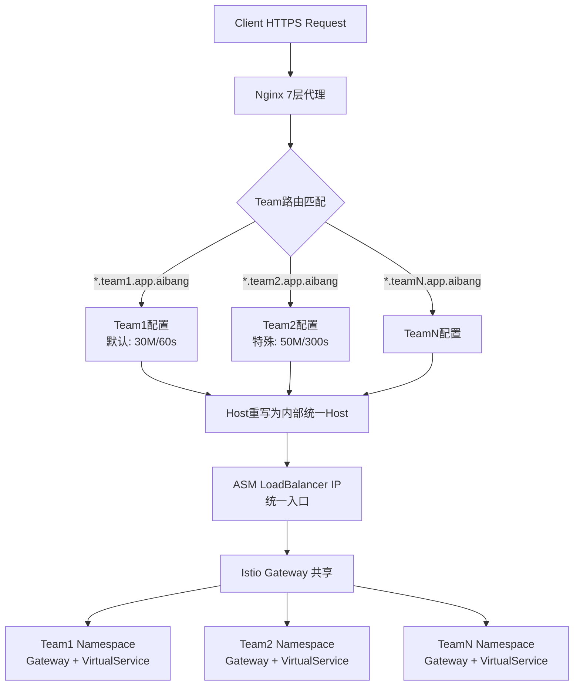
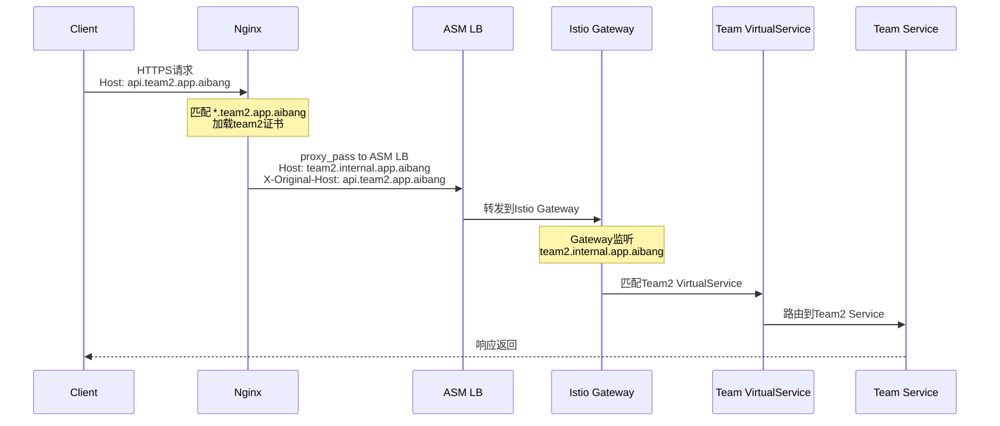

# Nginx 7层代理 - Team级别配置最佳实践分析

## 目标分析



## 架构设计原则

| 维度 | 设计决策 |
|------|----------|
| 路由粒度 | Team级别（非API级别） |
| 证书管理 | 每Team独立泛域名证书 |
| 上游 | 单一ASM LB IP，靠Host头区分流量 |
| 配置覆盖 | 默认值 + Team级别覆盖 |
| Host重写 | Nginx统一重写为ASM内部Host |

---

## Nginx 配置结构规划

```
/etc/nginx/
├── nginx.conf                    # 主配置，全局默认值
├── conf.d/
│   ├── upstream.conf             # ASM上游定义
│   ├── default_params.conf       # 默认proxy参数片段
│   └── ssl_common.conf           # 公共SSL参数
└── sites-enabled/
    ├── team1.conf                # team1 默认配置
    └── team2.conf                # team2 特殊配置(50M/300s)
```

---

## 核心配置文件

### 1. `nginx.conf` - 全局默认

```nginx
user nginx;
worker_processes auto;
error_log /var/log/nginx/error.log warn;
pid /var/run/nginx.pid;

events {
    worker_connections 4096;
    use epoll;
    multi_accept on;
}

http {
    include       /etc/nginx/mime.types;
    default_type  application/octet-stream;

    # 日志格式
    log_format main '$remote_addr - $remote_user [$time_local] "$request" '
                    '$status $body_bytes_sent "$http_referer" '
                    '"$http_user_agent" "$http_x_forwarded_for" '
                    'host=$host upstream=$upstream_addr '
                    'rt=$request_time uct=$upstream_connect_time '
                    'uht=$upstream_header_time urt=$upstream_response_time';

    access_log /var/log/nginx/access.log main;

    sendfile        on;
    tcp_nopush      on;
    tcp_nodelay     on;
    keepalive_timeout 65;

    # ========================================
    # 全局默认值 (Team级别可覆盖)
    # ========================================
    client_max_body_size     30m;       # 默认上传限制
    client_body_timeout      60s;
    proxy_connect_timeout    10s;
    proxy_send_timeout       60s;       # 默认超时
    proxy_read_timeout       60s;       # 默认超时

    # Gzip
    gzip on;
    gzip_types text/plain application/json application/xml;

    include /etc/nginx/conf.d/*.conf;
    include /etc/nginx/sites-enabled/*.conf;
}
```

### 2. `conf.d/upstream.conf` - ASM上游

```nginx
upstream asm_gateway {
    # ASM暴露的统一LB IP
    server 10.x.x.x:443;          # ASM LB IP

    keepalive 32;
    keepalive_requests 1000;
    keepalive_timeout 60s;
}
```

### 3. `conf.d/default_params.conf` - 可复用Proxy参数片段

```nginx
# 这个文件作为公共片段被各team include

# 注意：此文件不能独立使用，需在server/location块中include

# Proxy 基础头
proxy_http_version  1.1;
proxy_set_header    Connection        "";
proxy_set_header    X-Real-IP         $remote_addr;
proxy_set_header    X-Forwarded-For   $proxy_add_x_forwarded_for;
proxy_set_header    X-Forwarded-Proto $scheme;

# 关键：重写Host为ASM内部统一入口Host
# ASM Istio Gateway通过Host头路由到对应Team的VirtualService
proxy_set_header    Host              $host;

# 透传原始请求信息给上游
proxy_set_header    X-Original-Host   $host;
proxy_set_header    X-Original-URI    $request_uri;
```

---

## Team配置文件

### 4. `sites-enabled/team1.conf` - 标准Team（默认配置）

```nginx
# ============================================================
# Team1: *.team1.app.aibang
# 配置级别: 默认 (30M / 60s)
# ============================================================

server {
    listen 443 ssl;
    http2  on;

    # 泛域名匹配
    server_name *.team1.app.aibang;

    # Team1 独立泛证书
    ssl_certificate     /etc/nginx/ssl/team1/fullchain.pem;
    ssl_certificate_key /etc/nginx/ssl/team1/privkey.pem;
    ssl_protocols       TLSv1.2 TLSv1.3;
    ssl_ciphers         HIGH:!aNULL:!MD5;
    ssl_session_cache   shared:SSL_team1:10m;
    ssl_session_timeout 10m;

    # Team级别日志
    access_log /var/log/nginx/team1_access.log main;
    error_log  /var/log/nginx/team1_error.log warn;

    # 使用全局默认值 (30M / 60s) 无需重复声明

    location / {
        proxy_pass https://asm_gateway;

        # 引入公共proxy头配置
        include /etc/nginx/conf.d/default_params.conf;

        # ★ 核心：Host重写为Team1对应的ASM内部路由Host
        # Istio VirtualService 通过此Host匹配路由规则
        proxy_set_header Host team1.internal.app.aibang;

        # 保留原始域名供上游业务识别
        proxy_set_header X-Original-Host $host;

        # 上游使用HTTPS，忽略内部自签证书校验（内网信任）
        proxy_ssl_verify  off;
        proxy_ssl_name    team1.internal.app.aibang;
    }
}

# HTTP -> HTTPS 重定向
server {
    listen 80;
    server_name *.team1.app.aibang;
    return 301 https://$host$request_uri;
}
```

### 5. `sites-enabled/team2.conf` - 特殊Team（上传50M/超时300s）

```nginx
# ============================================================
# Team2: *.team2.app.aibang
# 配置级别: 特殊覆盖 (50M / 300s)
# 场景: 需要大文件上传和长超时
# ============================================================

server {
    listen 443 ssl;
    http2  on;

    server_name *.team2.app.aibang;

    # Team2 独立泛证书
    ssl_certificate     /etc/nginx/ssl/team2/fullchain.pem;
    ssl_certificate_key /etc/nginx/ssl/team2/privkey.pem;
    ssl_protocols       TLSv1.2 TLSv1.3;
    ssl_ciphers         HIGH:!aNULL:!MD5;
    ssl_session_cache   shared:SSL_team2:10m;
    ssl_session_timeout 10m;

    access_log /var/log/nginx/team2_access.log main;
    error_log  /var/log/nginx/team2_error.log warn;

    # ★ Team级别覆盖全局默认值
    client_max_body_size  50m;     # 覆盖: 30m -> 50m
    client_body_timeout   300s;    # 覆盖: 60s -> 300s
    proxy_send_timeout    300s;    # 覆盖: 60s -> 300s
    proxy_read_timeout    300s;    # 覆盖: 60s -> 300s

    location / {
        proxy_pass https://asm_gateway;

        include /etc/nginx/conf.d/default_params.conf;

        # ★ 重写为Team2的ASM内部Host
        proxy_set_header Host team2.internal.app.aibang;
        proxy_set_header X-Original-Host $host;

        proxy_ssl_verify  off;
        proxy_ssl_name    team2.internal.app.aibang;

        # 大文件上传优化
        proxy_request_buffering off;    # 流式转发，不在nginx缓冲请求体
        proxy_buffering         off;    # 流式响应
    }
}

server {
    listen 80;
    server_name *.team2.app.aibang;
    return 301 https://$host$request_uri;
}
```

---

## Host重写流量路由全链路



---

## ASM侧对应配置参考

```yaml
# Team2 Istio Gateway
apiVersion: networking.istio.io/v1beta1
kind: Gateway
metadata:
  name: team2-gateway
  namespace: team2
spec:
  selector:
    istio: ingressgateway
  servers:
    - port:
        number: 443
        name: https
        protocol: HTTPS
      hosts:
        - "team2.internal.app.aibang"   # 对应Nginx重写的Host
      tls:
        mode: SIMPLE
        credentialName: team2-internal-cert
---
# Team2 VirtualService
apiVersion: networking.istio.io/v1beta1
kind: VirtualService
metadata:
  name: team2-vs
  namespace: team2
spec:
  hosts:
    - "team2.internal.app.aibang"
  gateways:
    - team2/team2-gateway
  http:
    - match:
        - uri:
            prefix: "/"
      route:
        - destination:
            host: team2-service
            port:
              number: 8080
```

---

## 最佳实践总结

| 实践项 | 建议 | 原因 |
|--------|------|------|
| 配置分层 | 全局默认 + Team覆盖 | 减少重复，便于维护 |
| Host重写 | `proxy_set_header Host team.internal.*` | ASM靠Host路由，必须统一 |
| 保留原始Host | `X-Original-Host: $host` | 上游业务可能需要识别原始域名 |
| 大文件上传 | `proxy_request_buffering off` | 避免nginx内存/磁盘压力 |
| 证书隔离 | 每Team独立泛证书目录 | 证书轮换互不影响 |
| upstream keepalive | `keepalive 32` | 复用TCP连接，减少延迟 |
| 内部TLS | `proxy_ssl_verify off` + `proxy_ssl_name` | 内网信任但保持SNI正确 |
| 日志分离 | 每Team独立access/error log | 便于排障和审计 |

> **注意事项**
> - `client_max_body_size` 必须在 `server` 块声明才能覆盖全局，放在 `location` 块对已读取的请求头无效
> - `proxy_request_buffering off` 时，上游必须支持chunked transfer，否则可能出现兼容性问题
> - ASM侧的 Gateway `hosts` 必须与Nginx `proxy_set_header Host` 完全一致，否则流量无法匹配VirtualService