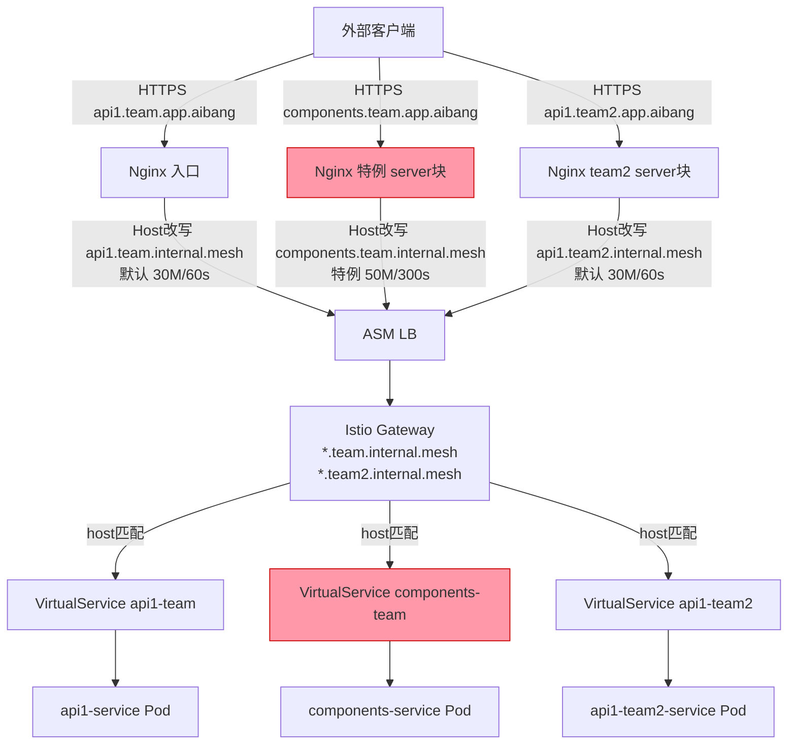
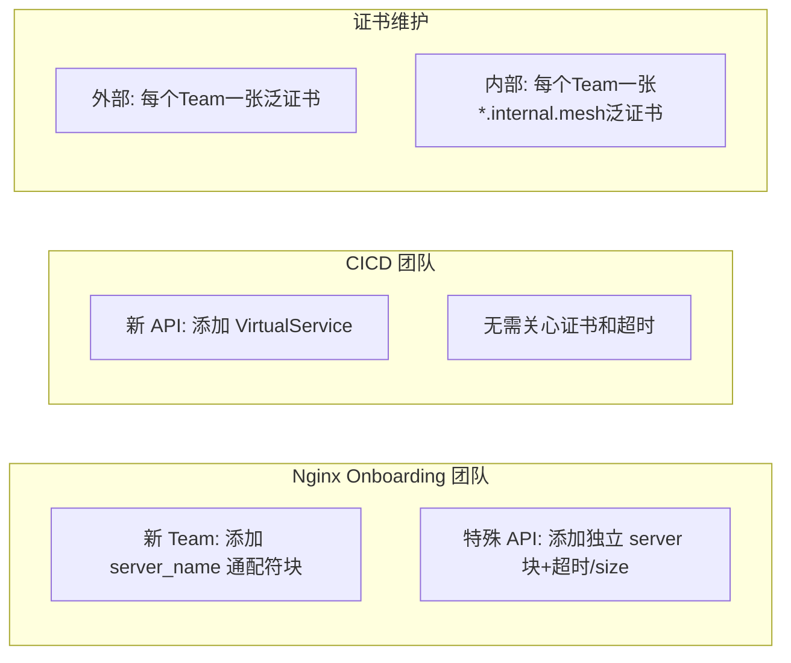
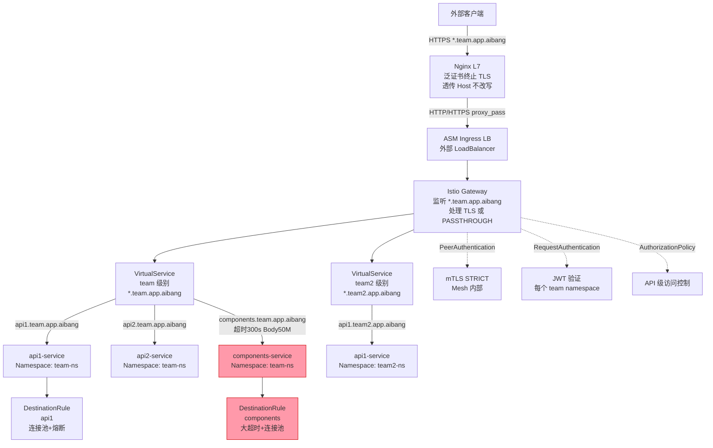
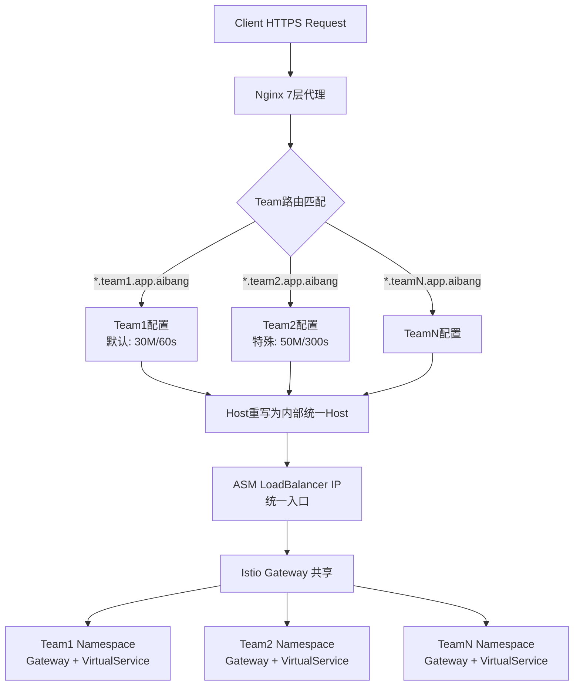
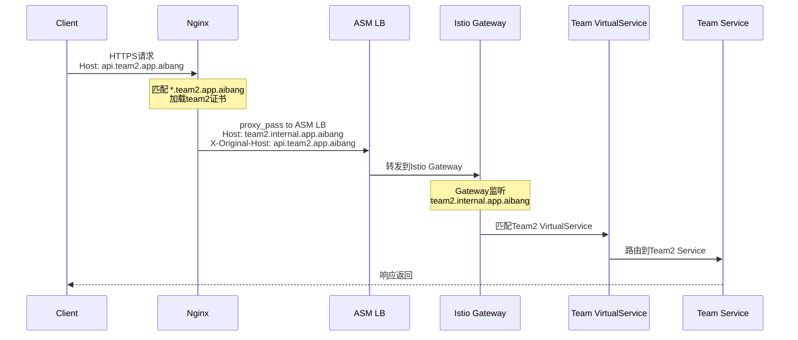

文档无法直接访问（GitHub 私有仓库或网络限制），但基于你描述的需求已经足够完整，我直接进行方案分析。

---

## 问题分析

核心矛盾点：**在哪一层做 Host 改写，决定了后续每一层的复杂度分布**。

| 决策点 | Nginx 改写 Host | Nginx 不改写 Host |
|--------|-----------------|-------------------|
| Nginx 配置复杂度 | 中（需维护改写规则） | 低（纯透传） |
| 内部证书 | 只需一套内部证书 | 证书数量随 team 增长 |
| Gateway/VS 配置 | 统一 host 匹配，简单 | 需匹配外部域名，复杂 |
| Onboarding 负担 | Nginx 层需介入 | CICD 团队维护 Gateway+VS |
| API 级特例（大小/超时） | Nginx location 块 | Nginx location 块（相同） |

---

## 最佳实践方案：推荐 **方案 A —— Nginx 做 Team 级 Host 改写 + Istio 做 API 级路由**

### 核心思路

```
外部请求 (*.team.app.aibang / *.team2.app.aibang)
    │
    ▼
Nginx (7层入口)
    ├── 泛证书终止 TLS
    ├── Team 级通配符 server_name 匹配
    ├── API 级特例 location（超时/body size）
    ├── Host 改写: *.team.app.aibang → internal.team.mesh / *.team2.app.aibang → internal.team2.mesh
    └── proxy_pass → ASM LB (统一入口)
            │
            ▼
    Istio Gateway（监听 internal.*.mesh 内部域名）
            │
            ▼
    VirtualService（按 host 精确匹配路由到对应 Service）
```

---

## 解决方案

### 第一层：Nginx 配置

#### Team 级通配符块（默认策略）

```nginx
# *.team.app.aibang 默认 server 块
server {
    listen 443 ssl;
    server_name *.team.app.aibang;

    ssl_certificate     /etc/ssl/team/wildcard.team.app.aibang.crt;
    ssl_certificate_key /etc/ssl/team/wildcard.team.app.aibang.key;

    # 默认限制
    client_max_body_size 30M;
    proxy_read_timeout   60s;
    proxy_send_timeout   60s;

    # 改写 Host：把外部 team 域名统一改为内部标识
    # api1.team.app.aibang → api1.team.internal.mesh
    set $internal_host "";
    if ($host ~* "^(.+)\.team\.app\.aibang$") {
        set $internal_host "$1.team.internal.mesh";
    }

    location / {
        proxy_set_header Host $internal_host;
        proxy_set_header X-Original-Host $host;
        proxy_set_header X-Forwarded-For $proxy_add_x_forwarded_for;
        proxy_pass https://asm-loadbalancer-ip;
    }
}
```

#### API 级特例（独立 server 块，优先级更高）

```nginx
# components.team.app.aibang 特例 server 块
server {
    listen 443 ssl;
    server_name components.team.app.aibang;

    ssl_certificate     /etc/ssl/team/wildcard.team.app.aibang.crt;
    ssl_certificate_key /etc/ssl/team/wildcard.team.app.aibang.key;

    # API 级特例限制
    client_max_body_size 50M;
    proxy_read_timeout   300s;
    proxy_send_timeout   300s;

    location / {
        proxy_set_header Host components.team.internal.mesh;
        proxy_set_header X-Original-Host $host;
        proxy_set_header X-Forwarded-For $proxy_add_x_forwarded_for;
        proxy_pass https://asm-loadbalancer-ip;
    }
}
```

#### team2 的通配符块

```nginx
server {
    listen 443 ssl;
    server_name *.team2.app.aibang;

    ssl_certificate     /etc/ssl/team2/wildcard.team2.app.aibang.crt;
    ssl_certificate_key /etc/ssl/team2/wildcard.team2.app.aibang.key;

    client_max_body_size 30M;
    proxy_read_timeout   60s;

    set $internal_host "";
    if ($host ~* "^(.+)\.team2\.app\.aibang$") {
        set $internal_host "$1.team2.internal.mesh";
    }

    location / {
        proxy_set_header Host $internal_host;
        proxy_set_header X-Original-Host $host;
        proxy_set_header X-Forwarded-For $proxy_add_x_forwarded_for;
        proxy_pass https://asm-loadbalancer-ip;
    }
}
```

---

### 第二层：Istio Gateway 配置

内部只需维护 `.internal.mesh` 泛域名证书，Gateway 监听这些内部 host。

```yaml
apiVersion: networking.istio.io/v1beta1
kind: Gateway
metadata:
  name: team-gateway
  namespace: istio-system
spec:
  selector:
    istio: ingressgateway
  servers:
    - port:
        number: 443
        name: https
        protocol: HTTPS
      tls:
        mode: SIMPLE
        credentialName: team-internal-mesh-cert   # 内部通配符证书
      hosts:
        - "*.team.internal.mesh"
    - port:
        number: 443
        name: https-team2
        protocol: HTTPS
      tls:
        mode: SIMPLE
        credentialName: team2-internal-mesh-cert
      hosts:
        - "*.team2.internal.mesh"
```

---

### 第三层：VirtualService 配置（CICD 团队负责）

每个 API 对应一个 VirtualService，按内部 host 精确路由。

```yaml
# api1.team 的 VirtualService
apiVersion: networking.istio.io/v1beta1
kind: VirtualService
metadata:
  name: api1-team-vs
  namespace: team-ns
spec:
  hosts:
    - api1.team.internal.mesh
  gateways:
    - istio-system/team-gateway
  http:
    - route:
        - destination:
            host: api1-service.team-ns.svc.cluster.local
            port:
              number: 8080
```

```yaml
# components.team 的 VirtualService（无需特殊配置超时，已在 Nginx 处理）
apiVersion: networking.istio.io/v1beta1
kind: VirtualService
metadata:
  name: components-team-vs
  namespace: team-ns
spec:
  hosts:
    - components.team.internal.mesh
  gateways:
    - istio-system/team-gateway
  http:
    - route:
        - destination:
            host: components-service.team-ns.svc.cluster.local
            port:
              number: 8080
```

---

## 流程图



---

## Onboarding 职责划分



| 角色 | 职责 | 触发时机 |
|------|------|----------|
| Nginx/Onboarding | 新增 Team 通配符 server 块 | 新 Team 接入 |
| Nginx/Onboarding | 新增 API 级特例 server 块 | API 有特殊超时/size 需求 |
| CICD 团队 | 新增 VirtualService | 每个新 API 上线 |
| 证书团队 | 申请外部泛证书 | 新 Team 接入 |
| 证书团队 | 签发内部泛证书 | 新 Team 接入（内部 .mesh 域名） |

---

## 注意事项

1. **Nginx `if` 使用限制**：Nginx 中 `if` 有副作用，建议用 `map` 替代正则 `if` 做 host 映射：

```nginx
# nginx.conf http 块中定义
map $host $internal_host {
    ~^(?<sub>.+)\.team\.app\.aibang$   $sub.team.internal.mesh;
    ~^(?<sub>.+)\.team2\.app\.aibang$  $sub.team2.internal.mesh;
    default                             $host;
}
```

2. **ASM LB 的 TLS 处理**：Nginx `proxy_pass` 到 ASM LB 时，需确认是 TLS passthrough 还是 re-encrypt，建议配置 `proxy_ssl_verify off`（内网信任）或挂载内部 CA。

3. **X-Original-Host 透传**：后端服务若需要知道原始外部域名，通过 `X-Original-Host` header 获取，不依赖 `Host`。

4. **内部证书规模**：每新增一个 Team，增加一张外部泛证书 + 一张内部泛证书，总量 = `2 × Team数`，可控。

5. **特例 server 块优先级**：Nginx 精确域名 server 块优先级高于通配符，`components.team.app.aibang` 的精确块会自动覆盖 `*.team.app.aibang` 的通配符块，无需额外配置。


我先读取你的原始文档，再结合新需求给出完整方案。基于你的需求，给出一套**完整的、生产级的、可直接参考的配置集合**。

---

## 🔍 问题分析

**目标**：将策略配置从 Nginx 下沉到 Istio 层，在 Gateway + VirtualService 层实现：

| 维度 | 能力 |
|------|------|
| Team 级 | 超时、重试、熔断策略 |
| API 级 | 精细化路由、Header 改写、超时覆盖 |
| 安全 | mTLS、JWT 认证、请求限流 |
| 可观测 | Header 注入、Fault Injection（测试用） |

---

## 🛠 架构设计



---

## 💻 完整配置文件

### 1. Nginx 层（极简透传，不改写 Host）

```nginx
# /etc/nginx/conf.d/team-passthrough.conf
# Nginx 仅做 TLS 终止 + 透传，策略全部下沉到 Istio

map $host $upstream_timeout {
    ~^components\.team\.app\.aibang$  300s;
    default                            60s;
}

map $host $upstream_body_size {
    ~^components\.team\.app\.aibang$  50m;
    default                            30m;
}

# *.team.app.aibang
server {
    listen 443 ssl;
    server_name *.team.app.aibang;

    ssl_certificate     /etc/ssl/certs/wildcard.team.app.aibang.crt;
    ssl_certificate_key /etc/ssl/private/wildcard.team.app.aibang.key;
    ssl_protocols       TLSv1.2 TLSv1.3;

    client_max_body_size $upstream_body_size;  # map 变量控制
    proxy_read_timeout   $upstream_timeout;
    proxy_send_timeout   $upstream_timeout;

    location / {
        proxy_pass              https://asm-ingressgateway-lb-ip;
        proxy_set_header Host   $host;          # 保持原始 Host 不改写
        proxy_set_header X-Forwarded-For $proxy_add_x_forwarded_for;
        proxy_set_header X-Forwarded-Proto https;
        proxy_ssl_verify        off;            # 内网信任，关闭 upstream SSL 验证
        proxy_ssl_server_name   on;
    }
}

# *.team2.app.aibang
server {
    listen 443 ssl;
    server_name *.team2.app.aibang;

    ssl_certificate     /etc/ssl/certs/wildcard.team2.app.aibang.crt;
    ssl_certificate_key /etc/ssl/private/wildcard.team2.app.aibang.key;

    client_max_body_size 30m;
    proxy_read_timeout   60s;

    location / {
        proxy_pass              https://asm-ingressgateway-lb-ip;
        proxy_set_header Host   $host;
        proxy_set_header X-Forwarded-For $proxy_add_x_forwarded_for;
        proxy_set_header X-Forwarded-Proto https;
        proxy_ssl_verify        off;
    }
}
```

---

### 2. Istio Gateway（核心入口，统一监听）

```yaml
# gateway.yaml
apiVersion: networking.istio.io/v1beta1
kind: Gateway
metadata:
  name: team-unified-gateway
  namespace: istio-system
  labels:
    app: team-unified-gateway
    managed-by: platform-team
spec:
  selector:
    istio: ingressgateway
  servers:
    # ── team 泛域名 ──────────────────────────────────────
    - port:
        number: 443
        name: https-team
        protocol: HTTPS
      tls:
        mode: SIMPLE                              # TLS 终止（若 Nginx 已终止则改 PASSTHROUGH）
        credentialName: wildcard-team-app-aibang  # Secret 名称，存放证书
      hosts:
        - "*.team.app.aibang"

    # ── team2 泛域名 ─────────────────────────────────────
    - port:
        number: 443
        name: https-team2
        protocol: HTTPS
      tls:
        mode: SIMPLE
        credentialName: wildcard-team2-app-aibang
      hosts:
        - "*.team2.app.aibang"

    # ── HTTP 重定向（可选）────────────────────────────────
    - port:
        number: 80
        name: http-redirect
        protocol: HTTP
      tls:
        httpsRedirect: true
      hosts:
        - "*.team.app.aibang"
        - "*.team2.app.aibang"
```

---

### 3. VirtualService —— Team 级（含 API 级精细化路由）

```yaml
# virtualservice-team.yaml
# 覆盖 team 下所有 API，通过 match 实现 API 级差异化
apiVersion: networking.istio.io/v1beta1
kind: VirtualService
metadata:
  name: team-vs
  namespace: team-ns
  labels:
    team: team
    managed-by: cicd
spec:
  hosts:
    - "*.team.app.aibang"
  gateways:
    - istio-system/team-unified-gateway
  http:

    # ──────────────────────────────────────────────────────
    # [API Level] components.team.app.aibang
    # 特例：超时 300s，重试 1 次，允许大 Body
    # ──────────────────────────────────────────────────────
    - name: "route-components"
      match:
        - authority:                             # 匹配 Host Header
            exact: "components.team.app.aibang"
      timeout: 300s
      retries:
        attempts: 1
        perTryTimeout: 280s
        retryOn: "gateway-error,connect-failure,retriable-4xx"
      headers:
        request:
          add:
            x-api-name: "components"
            x-team-name: "team"
            x-route-policy: "large-body"
        response:
          add:
            x-served-by: "istio-team-gateway"
      route:
        - destination:
            host: components-service.team-ns.svc.cluster.local
            port:
              number: 8080
          weight: 100

    # ──────────────────────────────────────────────────────
    # [API Level] api1.team.app.aibang
    # 标准 API，默认超时 60s，带重试
    # ──────────────────────────────────────────────────────
    - name: "route-api1"
      match:
        - authority:
            exact: "api1.team.app.aibang"
      timeout: 60s
      retries:
        attempts: 3
        perTryTimeout: 20s
        retryOn: "gateway-error,connect-failure,reset,retriable-4xx"
      headers:
        request:
          add:
            x-api-name: "api1"
            x-team-name: "team"
          remove:
            - x-internal-debug              # 移除可能泄露的内部 Header
      route:
        - destination:
            host: api1-service.team-ns.svc.cluster.local
            port:
              number: 8080
          weight: 100

    # ──────────────────────────────────────────────────────
    # [API Level] api2.team.app.aibang
    # Canary 示例：90% 流量到稳定版，10% 到 canary 版
    # ──────────────────────────────────────────────────────
    - name: "route-api2-canary"
      match:
        - authority:
            exact: "api2.team.app.aibang"
      timeout: 60s
      retries:
        attempts: 3
        perTryTimeout: 20s
        retryOn: "gateway-error,connect-failure"
      headers:
        request:
          add:
            x-api-name: "api2"
            x-team-name: "team"
      route:
        - destination:
            host: api2-service.team-ns.svc.cluster.local
            port:
              number: 8080
            subset: stable                   # DestinationRule 中定义的 subset
          weight: 90
        - destination:
            host: api2-service.team-ns.svc.cluster.local
            port:
              number: 8080
            subset: canary
          weight: 10

    # ──────────────────────────────────────────────────────
    # [API Level] Fault Injection 示例（测试 / 混沌工程）
    # internal-test.team.app.aibang 注入 5% 延迟
    # ──────────────────────────────────────────────────────
    - name: "route-internal-test"
      match:
        - authority:
            exact: "internal-test.team.app.aibang"
          headers:
            x-chaos-test:                    # 只有携带该 Header 才注入故障
              exact: "true"
      fault:
        delay:
          percentage:
            value: 5.0
          fixedDelay: 3s
        abort:
          percentage:
            value: 1.0
          httpStatus: 503
      timeout: 60s
      route:
        - destination:
            host: internal-test-service.team-ns.svc.cluster.local
            port:
              number: 8080

    # ──────────────────────────────────────────────────────
    # [Team Level] 通配兜底路由
    # 所有未精确匹配的 *.team.app.aibang 请求
    # ──────────────────────────────────────────────────────
    - name: "route-team-default"
      match:
        - authority:
            regex: "^[a-z0-9-]+\\.team\\.app\\.aibang$"
      timeout: 60s
      retries:
        attempts: 2
        perTryTimeout: 25s
        retryOn: "gateway-error,connect-failure"
      headers:
        request:
          add:
            x-team-name: "team"
            x-route-policy: "default"
      route:
        - destination:
            host: default-backend-service.team-ns.svc.cluster.local
            port:
              number: 8080
```

---

### 4. VirtualService —— team2

```yaml
# virtualservice-team2.yaml
apiVersion: networking.istio.io/v1beta1
kind: VirtualService
metadata:
  name: team2-vs
  namespace: team2-ns
spec:
  hosts:
    - "*.team2.app.aibang"
  gateways:
    - istio-system/team-unified-gateway
  http:
    - name: "route-api1-team2"
      match:
        - authority:
            exact: "api1.team2.app.aibang"
      timeout: 60s
      retries:
        attempts: 3
        perTryTimeout: 20s
        retryOn: "gateway-error,connect-failure"
      headers:
        request:
          add:
            x-team-name: "team2"
            x-api-name: "api1"
      route:
        - destination:
            host: api1-service.team2-ns.svc.cluster.local
            port:
              number: 8080

    - name: "route-team2-default"
      timeout: 60s
      route:
        - destination:
            host: default-backend-service.team2-ns.svc.cluster.local
            port:
              number: 8080
```

---

### 5. DestinationRule —— 连接池 + 熔断 + Subset

```yaml
# destinationrule-team.yaml
---
# api1 标准配置
apiVersion: networking.istio.io/v1beta1
kind: DestinationRule
metadata:
  name: api1-dr
  namespace: team-ns
spec:
  host: api1-service.team-ns.svc.cluster.local
  trafficPolicy:
    connectionPool:
      http:
        http1MaxPendingRequests: 100
        http2MaxRequests: 1000
        idleTimeout: 90s
      tcp:
        connectTimeout: 5s
        maxConnections: 100
    outlierDetection:                          # 熔断配置
      consecutive5xxErrors: 5
      interval: 10s
      baseEjectionTime: 30s
      maxEjectionPercent: 50
  subsets:
    - name: stable
      labels:
        version: stable
    - name: canary
      labels:
        version: canary
---
# components 大超时特例
apiVersion: networking.istio.io/v1beta1
kind: DestinationRule
metadata:
  name: components-dr
  namespace: team-ns
spec:
  host: components-service.team-ns.svc.cluster.local
  trafficPolicy:
    connectionPool:
      http:
        http1MaxPendingRequests: 50
        http2MaxRequests: 200
        idleTimeout: 360s                      # 比超时值大，避免连接被提前回收
      tcp:
        connectTimeout: 10s
        maxConnections: 50
    outlierDetection:
      consecutive5xxErrors: 3
      interval: 30s
      baseEjectionTime: 60s
      maxEjectionPercent: 30
```

---

### 6. 安全层配置（mTLS + JWT + AuthorizationPolicy）

```yaml
# security-team.yaml
---
# Mesh 内部强制 mTLS
apiVersion: security.istio.io/v1beta1
kind: PeerAuthentication
metadata:
  name: team-ns-mtls
  namespace: team-ns
spec:
  mtls:
    mode: STRICT

---
# JWT 认证（验证外部 token）
apiVersion: security.istio.io/v1beta1
kind: RequestAuthentication
metadata:
  name: team-jwt-auth
  namespace: team-ns
spec:
  selector:
    matchLabels:
      app: api1-service                        # 精确绑定到具体服务
  jwtRules:
    - issuer: "https://auth.aibang.com"
      jwksUri: "https://auth.aibang.com/.well-known/jwks.json"
      audiences:
        - "team-api"
      forwardOriginalToken: true               # 透传原始 token 到后端

---
# 授权策略：api1 只允许携带有效 JWT 的请求
apiVersion: security.istio.io/v1beta1
kind: AuthorizationPolicy
metadata:
  name: api1-authz
  namespace: team-ns
spec:
  selector:
    matchLabels:
      app: api1-service
  action: ALLOW
  rules:
    - from:
        - source:
            requestPrincipals:
              - "https://auth.aibang.com/*"   # JWT iss/sub 组合
      when:
        - key: request.auth.claims[team]
          values: ["team"]                     # JWT claims 中 team 字段必须匹配

---
# components 服务：仅允许来自 Nginx 的 IP 段（配合 Nginx 不改写场景）
apiVersion: security.istio.io/v1beta1
kind: AuthorizationPolicy
metadata:
  name: components-ip-authz
  namespace: team-ns
spec:
  selector:
    matchLabels:
      app: components-service
  action: ALLOW
  rules:
    - from:
        - source:
            ipBlocks:
              - "10.0.0.0/8"                  # 内网 Nginx 出口 IP 段
```

---

### 7. EnvoyFilter —— 请求体大小限制（API 级，下沉到 Istio）

```yaml
# envoyfilter-body-limit.yaml
# 在 Istio 层对 components 服务执行 50MB body 限制
apiVersion: networking.istio.io/v1alpha3
kind: EnvoyFilter
metadata:
  name: components-body-limit
  namespace: istio-system
spec:
  workloadSelector:
    labels:
      istio: ingressgateway
  configPatches:
    - applyTo: HTTP_FILTER
      match:
        context: GATEWAY
        listener:
          filterChain:
            filter:
              name: "envoy.filters.network.http_connection_manager"
              subFilter:
                name: "envoy.filters.http.router"
      patch:
        operation: INSERT_BEFORE
        value:
          name: envoy.filters.http.buffer
          typed_config:
            "@type": type.googleapis.com/envoy.extensions.filters.http.buffer.v3.Buffer
            max_request_bytes: 52428800        # 50MB = 50 * 1024 * 1024
```

---

## 📊 配置层级与职责总览

```mermaid
graph TD
    subgraph Nginx层[Nginx 层 - 边缘 TLS 终止]
        N1["泛证书终止\n*.team / *.team2"]
        N2["map 变量控制\nbody size + timeout"]
        N3["透传原始 Host\n不做改写"]
    end

    subgraph Gateway层[Istio Gateway 层 - 统一入口]
        G1["监听 *.team.app.aibang\n*.team2.app.aibang"]
        G2["TLS credentialName\n证书 Secret 挂载"]
        G3["HTTP 80 强制重定向"]
    end

    subgraph VS层[VirtualService 层 - 路由策略]
        V1["authority exact 精确匹配\nAPI 级路由"]
        V2["timeout 覆盖\n各 API 独立超时"]
        V3["retries 重试策略"]
        V4["headers 注入\nx-team-name x-api-name"]
        V5["weight 流量分割\nCanary 发布"]
        V6["fault 故障注入\n混沌测试"]
        V7["通配兜底路由"]
    end

    subgraph DR层[DestinationRule 层 - 连接策略]
        D1["connectionPool 连接池"]
        D2["outlierDetection 熔断"]
        D3["subset 版本分流"]
    end

    subgraph Security层[Security 层 - 安全策略]
        S1["PeerAuthentication\nmTLS STRICT"]
        S2["RequestAuthentication\nJWT 验证"]
        S3["AuthorizationPolicy\n访问控制"]
    end

    subgraph EF层[EnvoyFilter 层 - 深度定制]
        E1["Buffer Filter\nbody size 限制"]
    end

    Nginx层 --> Gateway层
    Gateway层 --> VS层
    VS层 --> DR层
    DR层 --> Security层
    Security层 --> EF层
```



---

## ⚠️ 注意事项

### 关键决策点

| 问题 | 建议 |
|------|------|
| Nginx 与 Gateway 双重 TLS | 若 Nginx 已终止 TLS，Gateway 的 `tls.mode` 改为 `PASSTHROUGH` 或走 HTTP 80 |
| `authority` 匹配 vs `headers.host` | Istio VS 用 `authority` 匹配 HTTP/2 的 `:authority` 伪头，等价于 HTTP/1.1 的 `Host` |
| EnvoyFilter body limit 生效范围 | EnvoyFilter 是全局的，务必用 `workloadSelector` 精确限定 ingressgateway |
| DestinationRule subset 必须与 Pod Label 对应 | `version: stable` 和 `version: canary` 需要在 Deployment 中打对应 Label |
| AuthorizationPolicy 默认行为 | 一旦命名空间有 AuthorizationPolicy，**没有被 ALLOW 规则匹配的请求默认拒绝** |
| 超时优先级 | VS timeout < DestinationRule timeout，VS 设置会覆盖默认值，不要双重设置产生混淆 |

### Onboarding 流程建议

```
新增 Team:
  1. Nginx: 添加 server_name 通配块（或不改动，若已有通配规则）
  2. Gateway: 添加新 server 段 + credentialName Secret
  3. 创建 Namespace + PeerAuthentication

新增 API（CICD 团队自助）:
  1. 在对应 team VS 中添加 authority exact match 块
  2. 如有特殊超时/重试，在该 match 块内覆盖
  3. 添加对应 DestinationRule
  4. 如需 JWT，添加 RequestAuthentication + AuthorizationPolicy
```


# Nginx 7层代理 - Team级别配置最佳实践分析

## 目标分析



## 架构设计原则

| 维度 | 设计决策 |
|------|----------|
| 路由粒度 | Team级别（非API级别） |
| 证书管理 | 每Team独立泛域名证书 |
| 上游 | 单一ASM LB IP，靠Host头区分流量 |
| 配置覆盖 | 默认值 + Team级别覆盖 |
| Host重写 | Nginx统一重写为ASM内部Host |

---

## Nginx 配置结构规划

```
/etc/nginx/
├── nginx.conf                    # 主配置，全局默认值
├── conf.d/
│   ├── upstream.conf             # ASM上游定义
│   ├── default_params.conf       # 默认proxy参数片段
│   └── ssl_common.conf           # 公共SSL参数
└── sites-enabled/
    ├── team1.conf                # team1 默认配置
    └── team2.conf                # team2 特殊配置(50M/300s)
```

---

## 核心配置文件

### 1. `nginx.conf` - 全局默认

```nginx
user nginx;
worker_processes auto;
error_log /var/log/nginx/error.log warn;
pid /var/run/nginx.pid;

events {
    worker_connections 4096;
    use epoll;
    multi_accept on;
}

http {
    include       /etc/nginx/mime.types;
    default_type  application/octet-stream;

    # 日志格式
    log_format main '$remote_addr - $remote_user [$time_local] "$request" '
                    '$status $body_bytes_sent "$http_referer" '
                    '"$http_user_agent" "$http_x_forwarded_for" '
                    'host=$host upstream=$upstream_addr '
                    'rt=$request_time uct=$upstream_connect_time '
                    'uht=$upstream_header_time urt=$upstream_response_time';

    access_log /var/log/nginx/access.log main;

    sendfile        on;
    tcp_nopush      on;
    tcp_nodelay     on;
    keepalive_timeout 65;

    # ========================================
    # 全局默认值 (Team级别可覆盖)
    # ========================================
    client_max_body_size     30m;       # 默认上传限制
    client_body_timeout      60s;
    proxy_connect_timeout    10s;
    proxy_send_timeout       60s;       # 默认超时
    proxy_read_timeout       60s;       # 默认超时

    # Gzip
    gzip on;
    gzip_types text/plain application/json application/xml;

    include /etc/nginx/conf.d/*.conf;
    include /etc/nginx/sites-enabled/*.conf;
}
```

### 2. `conf.d/upstream.conf` - ASM上游

```nginx
upstream asm_gateway {
    # ASM暴露的统一LB IP
    server 10.x.x.x:443;          # ASM LB IP

    keepalive 32;
    keepalive_requests 1000;
    keepalive_timeout 60s;
}
```

### 3. `conf.d/default_params.conf` - 可复用Proxy参数片段

```nginx
# 这个文件作为公共片段被各team include

# 注意：此文件不能独立使用，需在server/location块中include

# Proxy 基础头
proxy_http_version  1.1;
proxy_set_header    Connection        "";
proxy_set_header    X-Real-IP         $remote_addr;
proxy_set_header    X-Forwarded-For   $proxy_add_x_forwarded_for;
proxy_set_header    X-Forwarded-Proto $scheme;

# 关键：重写Host为ASM内部统一入口Host
# ASM Istio Gateway通过Host头路由到对应Team的VirtualService
proxy_set_header    Host              $host;

# 透传原始请求信息给上游
proxy_set_header    X-Original-Host   $host;
proxy_set_header    X-Original-URI    $request_uri;
```

---

## Team配置文件

### 4. `sites-enabled/team1.conf` - 标准Team（默认配置）

```nginx
# ============================================================
# Team1: *.team1.app.aibang
# 配置级别: 默认 (30M / 60s)
# ============================================================

server {
    listen 443 ssl;
    http2  on;

    # 泛域名匹配
    server_name *.team1.app.aibang;

    # Team1 独立泛证书
    ssl_certificate     /etc/nginx/ssl/team1/fullchain.pem;
    ssl_certificate_key /etc/nginx/ssl/team1/privkey.pem;
    ssl_protocols       TLSv1.2 TLSv1.3;
    ssl_ciphers         HIGH:!aNULL:!MD5;
    ssl_session_cache   shared:SSL_team1:10m;
    ssl_session_timeout 10m;

    # Team级别日志
    access_log /var/log/nginx/team1_access.log main;
    error_log  /var/log/nginx/team1_error.log warn;

    # 使用全局默认值 (30M / 60s) 无需重复声明

    location / {
        proxy_pass https://asm_gateway;

        # 引入公共proxy头配置
        include /etc/nginx/conf.d/default_params.conf;

        # ★ 核心：Host重写为Team1对应的ASM内部路由Host
        # Istio VirtualService 通过此Host匹配路由规则
        proxy_set_header Host team1.internal.app.aibang;

        # 保留原始域名供上游业务识别
        proxy_set_header X-Original-Host $host;

        # 上游使用HTTPS，忽略内部自签证书校验（内网信任）
        proxy_ssl_verify  off;
        proxy_ssl_name    team1.internal.app.aibang;
    }
}

# HTTP -> HTTPS 重定向
server {
    listen 80;
    server_name *.team1.app.aibang;
    return 301 https://$host$request_uri;
}
```

### 5. `sites-enabled/team2.conf` - 特殊Team（上传50M/超时300s）

```nginx
# ============================================================
# Team2: *.team2.app.aibang
# 配置级别: 特殊覆盖 (50M / 300s)
# 场景: 需要大文件上传和长超时
# ============================================================

server {
    listen 443 ssl;
    http2  on;

    server_name *.team2.app.aibang;

    # Team2 独立泛证书
    ssl_certificate     /etc/nginx/ssl/team2/fullchain.pem;
    ssl_certificate_key /etc/nginx/ssl/team2/privkey.pem;
    ssl_protocols       TLSv1.2 TLSv1.3;
    ssl_ciphers         HIGH:!aNULL:!MD5;
    ssl_session_cache   shared:SSL_team2:10m;
    ssl_session_timeout 10m;

    access_log /var/log/nginx/team2_access.log main;
    error_log  /var/log/nginx/team2_error.log warn;

    # ★ Team级别覆盖全局默认值
    client_max_body_size  50m;     # 覆盖: 30m -> 50m
    client_body_timeout   300s;    # 覆盖: 60s -> 300s
    proxy_send_timeout    300s;    # 覆盖: 60s -> 300s
    proxy_read_timeout    300s;    # 覆盖: 60s -> 300s

    location / {
        proxy_pass https://asm_gateway;

        include /etc/nginx/conf.d/default_params.conf;

        # ★ 重写为Team2的ASM内部Host
        proxy_set_header Host team2.internal.app.aibang;
        proxy_set_header X-Original-Host $host;

        proxy_ssl_verify  off;
        proxy_ssl_name    team2.internal.app.aibang;

        # 大文件上传优化
        proxy_request_buffering off;    # 流式转发，不在nginx缓冲请求体
        proxy_buffering         off;    # 流式响应
    }
}

server {
    listen 80;
    server_name *.team2.app.aibang;
    return 301 https://$host$request_uri;
}
```

---

## Host重写流量路由全链路



---

## ASM侧对应配置参考

```yaml
# Team2 Istio Gateway
apiVersion: networking.istio.io/v1beta1
kind: Gateway
metadata:
  name: team2-gateway
  namespace: team2
spec:
  selector:
    istio: ingressgateway
  servers:
    - port:
        number: 443
        name: https
        protocol: HTTPS
      hosts:
        - "team2.internal.app.aibang"   # 对应Nginx重写的Host
      tls:
        mode: SIMPLE
        credentialName: team2-internal-cert
---
# Team2 VirtualService
apiVersion: networking.istio.io/v1beta1
kind: VirtualService
metadata:
  name: team2-vs
  namespace: team2
spec:
  hosts:
    - "team2.internal.app.aibang"
  gateways:
    - team2/team2-gateway
  http:
    - match:
        - uri:
            prefix: "/"
      route:
        - destination:
            host: team2-service
            port:
              number: 8080
```

---

## 最佳实践总结

| 实践项 | 建议 | 原因 |
|--------|------|------|
| 配置分层 | 全局默认 + Team覆盖 | 减少重复，便于维护 |
| Host重写 | `proxy_set_header Host team.internal.*` | ASM靠Host路由，必须统一 |
| 保留原始Host | `X-Original-Host: $host` | 上游业务可能需要识别原始域名 |
| 大文件上传 | `proxy_request_buffering off` | 避免nginx内存/磁盘压力 |
| 证书隔离 | 每Team独立泛证书目录 | 证书轮换互不影响 |
| upstream keepalive | `keepalive 32` | 复用TCP连接，减少延迟 |
| 内部TLS | `proxy_ssl_verify off` + `proxy_ssl_name` | 内网信任但保持SNI正确 |
| 日志分离 | 每Team独立access/error log | 便于排障和审计 |

> **注意事项**
> - `client_max_body_size` 必须在 `server` 块声明才能覆盖全局，放在 `location` 块对已读取的请求头无效
> - `proxy_request_buffering off` 时，上游必须支持chunked transfer，否则可能出现兼容性问题
> - ASM侧的 Gateway `hosts` 必须与Nginx `proxy_set_header Host` 完全一致，否则流量无法匹配VirtualService