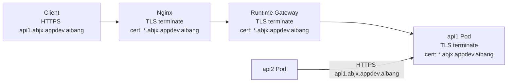
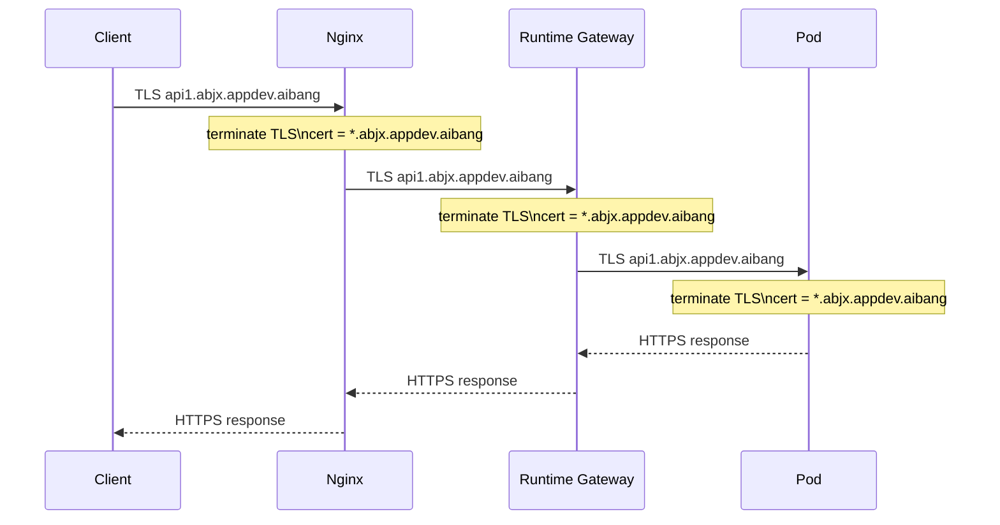
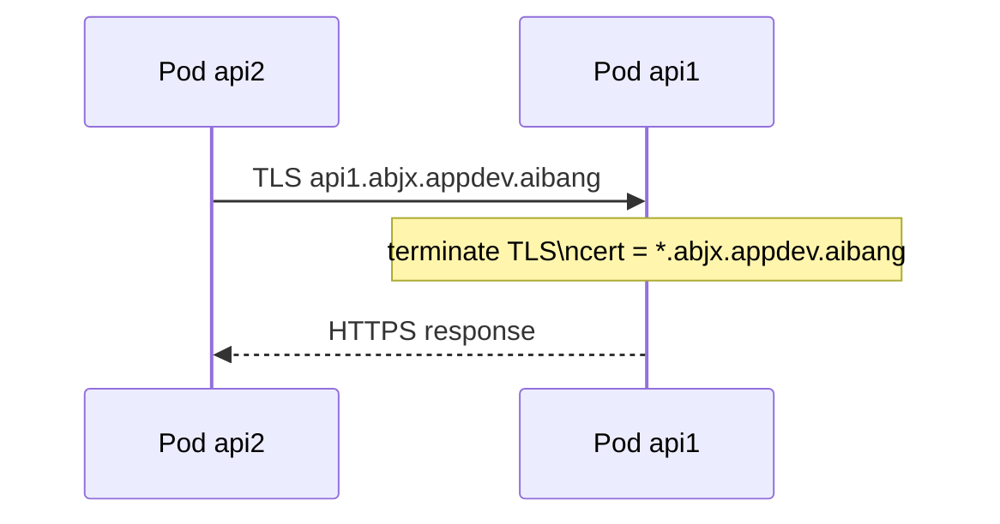

# Nginx + Runtime Gateway + Pod End-to-End TLS 方案

## 1. Goal And Constraints

### 1.1 真实目标

这次方案以你的实际目标为准，不再偏离：

1. 域名始终保持为：`{apiname}.{team}.appdev.aibang`
2. 不做 Host 改写
3. 不做内部域名转换
4. 流量最终要到达 Pod
5. Pod 之间通信也必须加密
6. 加密尽量复用同一套 team wildcard 证书：`*.{team}.appdev.aibang`
7. runtime Gateway 仍然作为标准模板存在
8. 用户最好只关注 runtime 侧的资源创建

### 1.2 关键结论

这个需求可以设计出来，但有一个前提必须接受：

如果你要求 Pod-to-Pod 也继续使用同一套 `*.{team}.appdev.aibang` 证书，那么 Pod 内部调用就不能再默认依赖：

- `service.namespace.svc.cluster.local`

而应该尽量继续使用：

- `api1.{team}.appdev.aibang`

因为证书校验是跟主机名绑定的。  
如果内部调用还是走 `cluster.local`，那同一张 wildcard 证书就不匹配了。

---

## 2. Recommended Architecture (V1)

### 2.1 推荐 V1

按照你的目标，最自洽的 V1 是：

1. Nginx 使用 `*.{team}.appdev.aibang` 证书终止 TLS
2. Nginx 保持原始 Host/SNI 不变，继续用相同域名 re-encrypt 到 runtime Gateway
3. runtime Gateway 使用同一套 `*.{team}.appdev.aibang` 证书再次终止 TLS
4. runtime Gateway 再通过 TLS 把流量转给目标 Pod
5. Pod 本身也使用同一套 `*.{team}.appdev.aibang` 证书对外提供 HTTPS
6. Pod-to-Pod 调用时，也继续使用 `apiX.{team}.appdev.aibang` 这套命名，并通过 TLS 访问

### 2.2 流量模型



### 2.3 复杂度评级

`Advanced`

原因：

- 你要求 north-south 和 east-west 都继续沿用同一套域名与证书体系
- 这意味着 Gateway 与 Pod 都要终止 TLS
- 也意味着 Pod-to-Pod 不能随便再走 `cluster.local`

这条路是可行的，但比“Gateway terminate，Pod 走 mesh mTLS”更复杂。

---

## 3. Core Design Principles

### 3.1 必须遵守的原则

| 原则                      | 说明                                                                     |
| ------------------------- | ------------------------------------------------------------------------ |
| 全链路同域名              | Host/SNI 始终保持 `apiX.{team}.appdev.aibang`                            |
| 全链路加密                | Client -> Nginx -> Gateway -> Pod 都是 TLS                               |
| Pod 自己终止业务 TLS      | 最终业务 Pod 必须挂载 team wildcard 证书并监听 HTTPS                     |
| Pod-to-Pod 继续用业务域名 | 内部调用也尽量使用 `apiX.{team}.appdev.aibang`                           |
| Gateway 与 Pod 证书一致   | runtime Gateway 与 Pod 都使用同一套 team wildcard 证书体系               |
| 用户资源聚焦 runtime      | 用户主要创建 `Gateway / VirtualService / DestinationRule / ServiceEntry` |

### 3.2 这条路的直接收益

| 好处                     | 说明                              |
| ------------------------ | --------------------------------- |
| 不需要 Host 改写         | 配置更直观                        |
| 内外域名统一             | 排障简单                          |
| 证书模型统一             | 团队心智一致                      |
| Pod 最终真正持有业务 TLS | 满足你“直接到达 Pod 且加密”的目标 |
| east-west 也可统一标准   | Pod-to-Pod 不需要两套 TLS 逻辑    |

### 3.3 代价

| 代价               | 说明                                                   |
| ------------------ | ------------------------------------------------------ |
| 私钥分发面扩大     | Nginx、Gateway、Pod 都要拿到同一套证书或同一套签发材料 |
| Secret 轮换复杂    | 三层都要同步                                           |
| 内部服务发现更复杂 | Pod-to-Pod 不能简单只靠 `cluster.local`                |
| 配置对象更多       | 除了 VS，还需要 DR / ServiceEntry / Secret             |

---

## 4. What Must Be True

### 4.1 哪些地方必须配证书

在你的方案里，这三个位置都要具备 TLS 能力：

| 位置            | 是否需要 `*.{team}.appdev.aibang` 证书 | 原因                                            |
| --------------- | -------------------------------------- | ----------------------------------------------- |
| Nginx           | 需要                                   | 终止外部 HTTPS                                  |
| Runtime Gateway | 需要                                   | 终止上游到 Gateway 的 HTTPS                     |
| Runtime Pod     | 需要                                   | 最终业务流量要直达 Pod，且 Pod 自己也终止 HTTPS |

### 4.2 哪些地方不能偷懒

如果你要 Pod-to-Pod 也继续用同一套证书，那下面几件事不能省：

1. Pod 必须监听 HTTPS 端口
2. Pod 必须挂 team wildcard 证书
3. 调用方必须用 `apiX.{team}.appdev.aibang` 发起调用
4. Gateway 到 Pod 不能降级成明文

---

## 5. Reference Flow

### 5.1 North-South Flow



### 5.2 East-West Flow



---

## 6. Runtime Resource Model

为了满足你的目标，runtime 侧建议至少有这些资源：

| 资源                     | 作用                                                              |
| ------------------------ | ----------------------------------------------------------------- |
| `Gateway`                | team 级标准 HTTPS 入口                                            |
| `VirtualService`         | 按业务域名或路径把流量路由到后端                                  |
| `DestinationRule`        | 指定 Gateway -> Pod 的 TLS origination 方式                       |
| `ServiceEntry`           | 让 Pod-to-Pod 可以继续用 `apiX.{team}.appdev.aibang` 访问内部服务 |
| `Secret`                 | 持有 team wildcard 证书                                           |
| `Deployment/StatefulSet` | 把证书挂给业务 Pod，应用监听 HTTPS                                |

---

## 7. Configuration Examples

下面示例以 `abjx` team 和 `api1.abjx.appdev.aibang` 为例。

### 7.1 Nginx 配置

关键点：

- 不改写 Host
- 上游继续使用原始 SNI
- re-encrypt 到 runtime Gateway

```nginx
server {
    listen 443 ssl http2;
    server_name *.abjx.appdev.aibang;

    ssl_certificate /etc/pki/tls/certs/wildcard-abjx-appdev-aibang.crt;
    ssl_certificate_key /etc/pki/tls/private/wildcard-abjx-appdev-aibang.key;

    client_max_body_size 50m;
    underscores_in_headers on;
    proxy_http_version 1.1;
    proxy_set_header Connection "";
    proxy_set_header X-aibang-CAP-Correlation-Id $request_id;
    proxy_set_header X-Forwarded-For $proxy_add_x_forwarded_for;
    proxy_set_header X-Forwarded-Proto https;
    proxy_set_header X-Original-Host $host;
    proxy_set_header Host $host;

    ssl_protocols TLSv1.2 TLSv1.3;
    ssl_session_timeout 5m;

    location / {
        proxy_pass https://runtime-istio-ingressgateway.abjx-int.svc.cluster.local:443;

        proxy_ssl_server_name on;
        proxy_ssl_name $host;

        # 生产建议改成内部 CA 校验
        proxy_ssl_verify off;
    }
}
```

### 7.2 Runtime Gateway 模板

关键点：

- Gateway 监听 team wildcard
- 使用同一套 team 证书

```yaml
apiVersion: networking.istio.io/v1beta1
kind: Gateway
metadata:
  name: runtime-team-gateway
  namespace: abjx-int
spec:
  selector:
    app: runtime-istio-ingressgateway
  servers:
  - port:
      number: 443
      name: https-team
      protocol: HTTPS
    hosts:
    - "*.abjx.appdev.aibang"
    tls:
      mode: SIMPLE
      credentialName: wildcard-abjx-appdev-aibang-cert
      minProtocolVersion: TLSV1_2
```

### 7.3 VirtualService

Gateway 终止 TLS 之后，按外部真实域名继续路由。

```yaml
apiVersion: networking.istio.io/v1beta1
kind: VirtualService
metadata:
  name: api1-abjx-vs
  namespace: abjx-int
spec:
  gateways:
  - runtime-team-gateway
  hosts:
  - api1.abjx.appdev.aibang
  http:
  - name: route-api1
    match:
    - uri:
        prefix: /
    route:
    - destination:
        host: api1-backend.abjx-int.svc.cluster.local
        port:
          number: 8443
    timeout: 60s
    retries:
      attempts: 2
      perTryTimeout: 20s
      retryOn: gateway-error,connect-failure,reset
```

### 7.4 DestinationRule

这个对象很关键。  
它负责让 Gateway 到 Pod 继续使用 TLS，并且 SNI 继续保持真实业务域名。

```yaml
apiVersion: networking.istio.io/v1beta1
kind: DestinationRule
metadata:
  name: api1-backend-dr
  namespace: abjx-int
spec:
  host: api1-backend.abjx-int.svc.cluster.local
  trafficPolicy:
    tls:
      mode: SIMPLE
      sni: api1.abjx.appdev.aibang
```

如果你们要严格校验证书，建议补 `caCertificates`，不要长期依赖“只加密不校验”。

### 7.5 Pod 证书 Secret

```yaml
apiVersion: v1
kind: Secret
metadata:
  name: wildcard-abjx-appdev-aibang-pod-cert
  namespace: abjx-int
type: kubernetes.io/tls
data:
  tls.crt: BASE64_CERT
  tls.key: BASE64_KEY
```

### 7.6 Pod 部署示例

Pod 自己必须监听 HTTPS。

```yaml
apiVersion: apps/v1
kind: Deployment
metadata:
  name: api1
  namespace: abjx-int
spec:
  replicas: 2
  selector:
    matchLabels:
      app: api1
  template:
    metadata:
      labels:
        app: api1
    spec:
      containers:
      - name: api1
        image: your-registry/api1:latest
        ports:
        - containerPort: 8443
        volumeMounts:
        - name: tls-cert
          mountPath: /etc/tls
          readOnly: true
        env:
        - name: TLS_CERT_FILE
          value: /etc/tls/tls.crt
        - name: TLS_KEY_FILE
          value: /etc/tls/tls.key
      volumes:
      - name: tls-cert
        secret:
          secretName: wildcard-abjx-appdev-aibang-pod-cert
```

### 7.7 Service

```yaml
apiVersion: v1
kind: Service
metadata:
  name: api1-backend
  namespace: abjx-int
spec:
  selector:
    app: api1
  ports:
  - name: https
    port: 8443
    targetPort: 8443
```

---

## 8. Pod-To-Pod With The Same Certificate

这是你这个方案最关键的部分。

### 8.1 问题本质

如果 `api2` Pod 想调用 `api1` Pod，并且你要求继续使用同一套 `*.abjx.appdev.aibang` 证书，那么：

- `api2` 不能直接用 `api1-backend.abjx-int.svc.cluster.local`
- 因为这个主机名不被 `*.abjx.appdev.aibang` 覆盖

所以内部调用要尽量继续使用：

- `https://api1.abjx.appdev.aibang`

### 8.2 ServiceEntry 示例

下面给出一个 runtime 内部继续使用业务域名的参考方式。

```yaml
apiVersion: networking.istio.io/v1beta1
kind: ServiceEntry
metadata:
  name: api1-abjx-se
  namespace: abjx-int
spec:
  hosts:
  - api1.abjx.appdev.aibang
  location: MESH_INTERNAL
  ports:
  - number: 443
    name: https
    protocol: TLS
  resolution: DNS
```

这个对象的目的不是做外部出网，而是让 mesh 内继续认可这个业务域名。

### 8.3 Pod-to-Pod DestinationRule 示例

```yaml
apiVersion: networking.istio.io/v1beta1
kind: DestinationRule
metadata:
  name: api1-abjx-eastwest-dr
  namespace: abjx-int
spec:
  host: api1.abjx.appdev.aibang
  trafficPolicy:
    tls:
      mode: SIMPLE
      sni: api1.abjx.appdev.aibang
```

### 8.4 这里必须额外评估的一点

这一段是整个方案最需要提前验证的地方：

`api1.abjx.appdev.aibang` 在集群内部究竟如何解析到目标工作负载

你至少要确定一种方式：

| 方式                        | 说明                               |
| --------------------------- | ---------------------------------- |
| 内部 DNS 解析到 service IP  | 最直接，但要做 DNS 管理            |
| 借助 mesh 注册自定义 host   | 更 mesh-native，但需要额外资源设计 |
| 内部统一回到 gateway 再转发 | 最容易统一，但不是最短路径         |

如果你坚持“尽量直接到 Pod”，那么更推荐：

- 内部 DNS / mesh 注册直接指向服务
- Gateway 只负责 north-south

---

## 9. Suggested Operating Principles

### 9.1 平台团队负责

- team wildcard 证书签发与轮换
- Nginx team 模板
- runtime Gateway 标准模板
- ServiceEntry / DestinationRule 模板
- 证书下发方式统一

### 9.2 API owner 负责

- `VirtualService`
- 业务 Pod HTTPS 配置
- Pod 证书挂载
- 业务依赖调用清单

---

## 10. Validation Checklist

### 10.1 North-South

1. `curl --resolve api1.abjx.appdev.aibang:443:<NGINX_IP> https://api1.abjx.appdev.aibang -vk`
2. 确认 Nginx 收到的 Host 为 `api1.abjx.appdev.aibang`
3. 确认 Gateway 匹配 `*.abjx.appdev.aibang`
4. 确认 Gateway -> Pod 的上游连接使用 TLS
5. 确认 Pod 应用证书 SAN 能覆盖 `api1.abjx.appdev.aibang`

### 10.2 East-West

1. 从 `api2` Pod 内部调用 `https://api1.abjx.appdev.aibang`
2. 确认 DNS / mesh host 解析正确
3. 确认 `api1` Pod 返回的证书仍然是 `*.abjx.appdev.aibang`
4. 确认没有因为 `cluster.local` 触发证书不匹配

---

## 11. Key Risks

| 风险                    | 说明                                                   |
| ----------------------- | ------------------------------------------------------ |
| 证书分发面扩大          | Nginx、Gateway、Pod 都要拿到证书                       |
| 轮换复杂                | 任意一层未同步都会中断                                 |
| east-west host 解析复杂 | 不解决内部域名解析，就无法真正做到“Pod 之间同证书 TLS” |
| 应用必须支持 HTTPS      | Pod 自己必须终止 TLS                                   |
| 私钥暴露面积增加        | 必须有 Secret 生命周期管理与审计                       |

---

## 12. Final Recommendation

严格按你的目标来收敛，我的建议是：

1. 保持全链路域名统一：`{api}.{team}.appdev.aibang`
2. Nginx 不做 Host 改写
3. runtime Gateway 用同一个 team wildcard 证书
4. Pod 也用同一个 team wildcard 证书并监听 HTTPS
5. Gateway -> Pod 必须用 TLS
6. Pod-to-Pod 若也要求同证书，则内部调用统一使用业务域名，而不是 `cluster.local`

### 最重要的架构判断

这个方案能做，但真正的核心难点不是 Nginx，也不是 Gateway，而是：

`Pod-to-Pod 如何继续用 apiX.{team}.appdev.aibang 这套业务域名直达后端工作负载`

只要你把这一步的内部解析和注册方式定下来，这个方案就能完整闭环。

---

## References

- [Set up TLS termination in ingress gateway](https://cloud.google.com/service-mesh/docs/operate-and-maintain/gateway-tls-termination)
- [Istio Gateway reference](https://preliminary.istio.io/latest/docs/reference/config/networking/gateway/)
- [DestinationRule TLS analysis](https://istio.io/latest/docs/reference/config/analysis/ist0128/)
- [Istio ServiceEntry reference](https://preliminary.istio.io/latest/docs/reference/config/networking/service-entry/)
- [Kubernetes TLS Secret](https://kubernetes.io/docs/concepts/configuration/secret/)

---

## Gateway Passthrough

你这里提的核心问题是：

runtime Gateway 这一层是不是可以直接改成 `PASSTHROUGH`，这样 Gateway 配置会更简单。

答案是：

`可以，但要先分清楚你想简化的是哪一层，以及你是否还要在 Gateway 这一层做 HTTP 路由。`

### 1. 如果 Gateway 改成 `PASSTHROUGH`，会发生什么

当 Gateway 使用：

```yaml
tls:
  mode: PASSTHROUGH
```

它的含义是：

- Gateway 不终止 TLS
- Gateway 不需要挂 team wildcard 证书
- TLS 会直接透传到后端 Pod
- 这时真正终止 `*.{team}.appdev.aibang` 证书的是 Pod

这确实会让 Gateway 这一层变简单。

### 2. Gateway `PASSTHROUGH` 的直接好处

| 好处                   | 说明                                 |
| ---------------------- | ------------------------------------ |
| Gateway 不需要证书     | 不用在 Gateway 维护 `credentialName` |
| 证书下沉到最终 Pod     | 更符合“最终由 Pod 终止业务 TLS”      |
| 避免双重 TLS terminate | Gateway 不再解密再发起新 TLS         |
| 配置更薄               | Gateway 更像纯转发层                 |

### 3. 但它带来的限制也很直接

| 限制                            | 说明                                  |
| ------------------------------- | ------------------------------------- |
| Gateway 看不到 HTTP 层          | 因为 TLS 没有解密                     |
| `VirtualService.http` 不能再用  | 这类 HTTP 规则依赖解密后的七层信息    |
| 只能基于 SNI 做 TLS 路由        | 路由粒度会变粗                        |
| 不能在 Gateway 层做 HTTP 头操作 | 比如 header 注入、URI 改写、HTTP 重试 |

### 4. 这时候 VirtualService 应该怎么写

如果 Gateway 是 `PASSTHROUGH`，那 `VirtualService` 一般也要从 `http:` 改成 `tls:` 匹配。

也就是说，路由不再是：

```yaml
http:
- match:
  - uri:
      prefix: /
```

而更接近：

```yaml
tls:
- match:
  - port: 443
    sniHosts:
    - api1.abjx.appdev.aibang
  route:
  - destination:
      host: api1-backend.abjx-int.svc.cluster.local
      port:
        number: 8443
```

### 5. 你的问题：destination 还能不能继续用 `svc.cluster.local`

可以。

这是这一条路里很重要的一点：

- Gateway 是否 `PASSTHROUGH`
- 和 `destination.host` 能不能写成 `svc.cluster.local`

这两件事不是一回事。

换句话说：

- 前端匹配可以继续按 `api1.abjx.appdev.aibang` 的 SNI 匹配
- 后端 destination 仍然可以写成你自己的服务名，例如：
  - `{svcname}.{namespace}.svc.cluster.local`

例如：

```yaml
destination:
  host: api1-backend.abjx-int.svc.cluster.local
  port:
    number: 8443
```

这一点是成立的。

### 6. 但这里有一个必须澄清的关键点

虽然 `destination` 可以继续写成：

`{svcname}.{namespace}.svc.cluster.local`

但是：

后端 Pod 返回的业务证书如果仍然是：

`*.abjx.appdev.aibang`

那么 TLS 校验看的仍然是客户端使用的目标主机名和 SNI。

所以这里要分两种流量来看：

#### 场景 A：Client -> Nginx -> Gateway -> Pod

这条链路里，前端主机名是：

`api1.abjx.appdev.aibang`

只要透传时 SNI 保持这个值，Pod 用 `*.abjx.appdev.aibang` 证书是成立的。  
即使 `VirtualService.route.destination.host` 写的是 `api1-backend.abjx-int.svc.cluster.local`，也不影响前端 TLS 语义。

#### 场景 B：Pod -> Pod

如果是 Pod 自己主动调用另一个 Pod，而调用地址直接写成：

`https://api1-backend.abjx-int.svc.cluster.local`

那证书就不匹配。

所以我前面文档里强调的“Pod-to-Pod 想继续复用同一张 wildcard 证书，就要尽量继续用业务域名调用”，仍然成立。

也就是说：

- Gateway 到 backend service 的 route host 可以是 `svc.cluster.local`
- 但业务调用方自己发起 TLS 时，如果目标证书还是 `*.{team}.appdev.aibang`，那它就应该访问 `api1.{team}.appdev.aibang`

这两件事不要混在一起。

### 7. Gateway `PASSTHROUGH` 的参考配置

#### Gateway

```yaml
apiVersion: networking.istio.io/v1beta1
kind: Gateway
metadata:
  name: runtime-team-gateway-passthrough
  namespace: abjx-int
spec:
  selector:
    app: runtime-istio-ingressgateway
  servers:
  - port:
      number: 443
      name: tls-team
      protocol: TLS
    hosts:
    - "*.abjx.appdev.aibang"
    tls:
      mode: PASSTHROUGH
```

#### VirtualService

```yaml
apiVersion: networking.istio.io/v1beta1
kind: VirtualService
metadata:
  name: api1-abjx-tls-vs
  namespace: abjx-int
spec:
  gateways:
  - runtime-team-gateway-passthrough
  hosts:
  - api1.abjx.appdev.aibang
  tls:
  - match:
    - port: 443
      sniHosts:
      - api1.abjx.appdev.aibang
    route:
    - destination:
        host: api1-backend.abjx-int.svc.cluster.local
        port:
          number: 8443
```

### 8. 这条路适不适合你

如果你的目标是：

- 最终由 Pod 自己终止 TLS
- Gateway 尽量简单
- 不强依赖 Gateway 做 HTTP 路由或 HTTP 级增强

那么：

`Gateway PASSTHROUGH`

是很值得考虑的。

但如果你还希望在 Gateway 层做这些事情：

- path 路由
- header 处理
- HTTP 重试
- URI rewrite
- 基于 HTTP 的精细流量治理

那 `PASSTHROUGH` 就不适合，因为 TLS 没有在 Gateway 解密。

### 9. 最终判断

| 问题                                                                                    | 结论                                 |
| --------------------------------------------------------------------------------------- | ------------------------------------ |
| Gateway 能不能直接走 `PASSTHROUGH`                                                      | 可以                                 |
| 这样 Gateway 会不会更简单                                                               | 会                                   |
| `VirtualService` 还能不能继续写 `destination.host = {svc}.{ns}.svc.cluster.local`       | 可以                                 |
| `VirtualService` 还能不能继续用 `http:` 规则                                            | 一般不行，应改为 `tls:` + `sniHosts` |
| Pod-to-Pod 如果也要复用 `*.{team}.appdev.aibang` 证书，是否还能直接访问 `cluster.local` | 不建议，证书名会不匹配               |

### 10. 我的架构建议

如果你现在的优先级是：

`尽量简化 Gateway`

那你可以把 runtime Gateway 调整为 `PASSTHROUGH`，这是合理的。

但你要接受两个配套结论：

1. Gateway 不再承担 HTTP 层能力
2. Pod-to-Pod 如果也坚持同一张业务证书，内部调用域名体系仍然要单独设计

---

## tls + sniHosts

你这里问得很关键。

前面我写到：

| 问题                                         | 结论                                 |
| -------------------------------------------- | ------------------------------------ |
| `VirtualService` 还能不能继续用 `http:` 规则 | 一般不行，应改为 `tls:` + `sniHosts` |

你现在的问题是：

`这件事我能理解，但它真正的坏处是什么？`

如果你的硬约束是：

`最终 Pod 必须加密`

那这个问题就不应该停留在“语法变了”，而应该看：

- 换成 `tls + sniHosts` 以后你失去了什么
- 这些损失对你来说是不是实质性问题

### 1. 先说结论

如果你的优先级排序是：

1. 最终 Pod 必须终止 TLS
2. Pod-to-Pod 也必须加密
3. 尽量使用同一套 `*.{team}.appdev.aibang` 证书

那么：

`Gateway PASSTHROUGH + VirtualService.tls + sniHosts`

本身不是坏事，反而是比较自然的一条路。

它真正的代价不是“不能用”，而是：

`你把网关层从七层治理层，降成了一个基于 SNI 的 TLS 转发层。`

### 2. 真正失去的能力

这才是 `tls + sniHosts` 的核心坏处。

| 失去的能力               | 为什么会失去                            |
| ------------------------ | --------------------------------------- |
| 基于 URI/path 路由       | Gateway 没解密 HTTP，看不到 `/api1/xxx` |
| 基于 Header 路由         | 看不到 HTTP Header                      |
| Header 注入/改写         | 不能操作 HTTP 报文                      |
| URI rewrite              | 不能改路径                              |
| 基于 Method 的控制       | 看不到 GET/POST                         |
| HTTP 层重试/超时策略     | 只能做更粗粒度的 TLS 转发               |
| 更细粒度的 canary 路由   | 做不了基于 HTTP 属性的灰度              |
| 基于 JWT/HTTP 的入口鉴权 | 不能在这个 Gateway 层直接做             |

换句话说：

一旦你走：

`tls + sniHosts`

Gateway 层能看到的主要就是：

- 端口
- SNI Host

看不到的就是：

- path
- method
- headers
- JWT 内容

### 3. 但什么不是坏处

如果你的场景本来就不依赖这些七层能力，那上面那张表里的很多“坏处”对你来说其实不是坏处。

例如：

| 场景                                   | 影响       |
| -------------------------------------- | ---------- |
| 一个域名基本只对应一个 API 或一个服务  | 影响很小   |
| 你本来就不需要 path 分流               | 影响很小   |
| 你不在 Gateway 层做 header rewrite     | 影响很小   |
| 你接受把更多治理能力下沉到应用或其他层 | 影响可接受 |

所以不能抽象地说：

`tls + sniHosts 不好`

更准确的说法是：

`tls + sniHosts 牺牲了七层治理能力，换来了 TLS 直达 Pod 的纯粹性。`

### 4. 在你的目标下，它是不是合理

基于你现在的硬约束：

- 最终 Pod 必须加密
- Pod-to-Pod 也要加密
- 证书尽量统一

我认为：

`tls + sniHosts`

是合理的，甚至是符合你目标的一种自然结果。

因为如果 Gateway 还要继续用 `http:` 路由，就意味着：

- Gateway 必须解密 TLS
- Gateway 必须看到 HTTP 内容
- 然后再由 Gateway 发起到后端 Pod 的新连接

这条路不是不能做，但它更像：

`Gateway terminate TLS + 再次 origination 到 Pod`

而不是：

`TLS 尽量保持到最终 Pod`

所以从“TLS 直达 Pod”的纯粹性来说，`tls + sniHosts` 反而更贴近你的目标。

### 5. 它最大的实际限制

如果只说一个最实际的限制，那就是：

`一个 Host 基本对应一类后端路由决策`

因为你不能再依赖 path 去拆。

例如：

- `api1.abjx.appdev.aibang` -> `api1 service`
- `api2.abjx.appdev.aibang` -> `api2 service`

这很自然。

但如果你想做这种事情：

- 同一个 Host 下
  - `/v1/*` 去 service-a
  - `/v2/*` 去 service-b

那 `PASSTHROUGH + tls + sniHosts` 就不适合了。

### 6. 所以适合什么样的域名模型

`tls + sniHosts` 最适合这种模型：

| 模式                     | 是否适合 |
| ------------------------ | -------- |
| 一个 API 一个子域名      | 很适合   |
| 一个服务一个子域名       | 很适合   |
| 同 Host 下多 path 多后端 | 不适合   |
| 大量依赖 HTTP 层治理     | 不适合   |

这点其实和你现在的命名方式很契合：

`{apiname}.{team}.appdev.aibang`

因为这个模型天然就是：

`每个 API 一个独立 host`

这恰好适合 `sniHosts` 路由。

### 7. 在你的场景里，最大的好处反而是什么

如果按你的目标来判断，`tls + sniHosts` 最大的正收益其实是：

| 好处                              | 说明                                              |
| --------------------------------- | ------------------------------------------------- |
| TLS 语义更纯粹                    | 业务 TLS 一直保持到 Pod                           |
| Gateway 更轻                      | 不做 HTTP terminate，不持有更多七层逻辑           |
| 路由模型简单                      | 基于 host/SNI 直接转发                            |
| 和 team wildcard 证书模型天然匹配 | `apiX.{team}.appdev.aibang` 本来就是 SNI 友好模型 |
| 更符合“最终由 Pod 自己持证书”目标 | 终止点就在 Pod                                    |

### 8. 什么时候不应该选它

如果未来你有下面这些需求，就要重新评估：

- 同一个域名下按 path 路由到多个后端
- 需要在 Gateway 层做统一鉴权
- 需要在 Gateway 层做 Header 注入
- 需要 HTTP 级流量治理
- 需要在 Gateway 层做金丝雀发布

这些能力一旦变成刚需，你就得回到：

- Gateway terminate TLS
- `VirtualService.http`

这条路线。

### 9. 结合你的目标后的最终判断

基于你现在明确不变的目标：

- 最终 Pod 必须加密
- Pod-to-Pod 也要加密
- 证书尽量统一

我对 `tls + sniHosts` 的判断是：

| 项目                           | 结论                                                        |
| ------------------------------ | ----------------------------------------------------------- |
| 它是不是缺点                   | 不天然是缺点                                                |
| 它有没有代价                   | 有，主要是失去七层路由和治理能力                            |
| 这个代价对你当前是不是不可接受 | 不一定，甚至很可能可接受                                    |
| 它是否更贴近“TLS 直达 Pod”目标 | 是                                                          |
| 你当前域名模型是否适合它       | 适合，因为 `{api}.{team}.appdev.aibang` 天然适合按 SNI 分流 |

### 10. 结论

如果你当前真正坚持的是：

`TLS 最终必须到 Pod`

那么：

`VirtualService 用 tls + sniHosts`

不是坏处本身，而是这个目标带来的自然架构结果。

它的坏处只在于：

`你放弃了 Gateway 这一层的 HTTP 七层治理能力`

如果你当前不依赖这些能力，那么这条路线其实是成立的，而且和你的目标高度一致。

---

## Gateway SIMPLE + VS

你这里的问题可以整理成一句话：

`我能不能让 Gateway 这一层也走加密，然后 VS 这一层也继续走加密？`

先给直接结论：

`可以做全链路加密，但不是通过 VirtualService 自己“配置加密”来实现的。`

更准确地说：

- `Gateway.tls.mode: SIMPLE` 表示 Gateway 终止入站 TLS
- `VirtualService` 负责路由，不负责把到后端的连接变成 TLS
- `DestinationRule.trafficPolicy.tls` 才决定 Gateway 到后端 service / Pod 是否继续加密

也就是说，你想要的其实不是：

`Gateway 也加密，VS 也加密`

而是：

`Gateway 终止 TLS，然后 Gateway 到后端再发起一个新的 TLS 连接`

Gateway tls.mode: SIMPLE 本身就是“网关终止 TLS”

这条链路是能成立的。

### 1. 三个对象的职责要分清

| 对象              | 主要职责                                   | 是否直接决定到后端是否继续 TLS |
| ----------------- | ------------------------------------------ | ------------------------------ |
| `Gateway`         | 接受进入网关的流量，决定是否在网关终止 TLS | 只决定客户端到 Gateway 这一跳  |
| `VirtualService`  | 路由规则                                   | 不直接决定                     |
| `DestinationRule` | 到目标服务的流量策略，包括 TLS origination | 是                             |

所以如果你写的是：

```yaml
tls:
  mode: SIMPLE
  credentialName: wildcard-abjx-appdev-aibang-cert
  minProtocolVersion: TLSV1_2
```

这只能说明：

`客户端到 Gateway 这一跳是 HTTPS，并且在 Gateway 终止。`

它并不自动表示：

`Gateway -> backend Pod 这一跳也是 HTTPS`

### 2. 你要的目标，正确表达方式是什么

如果按你的目标来写，应该分成两步：

1. `Gateway` 用 `SIMPLE` 终止入站 TLS
2. `DestinationRule` 用 `tls.mode: SIMPLE` 再把 Gateway 到后端的连接加密起来

这样才是完整的：

`Client -> Gateway = TLS`

以及：

`Gateway -> Pod = TLS`

### 3. 那 VirtualService 在这里起什么作用

`VirtualService` 在这个模式下仍然是有价值的，只是它负责的是路由，不是加密。

例如：

```yaml
apiVersion: networking.istio.io/v1beta1
kind: VirtualService
metadata:
  name: api1-abjx-vs
  namespace: abjx-int
spec:
  gateways:
  - runtime-team-gateway
  hosts:
  - api1.abjx.appdev.aibang
  http:
  - match:
    - uri:
        prefix: /
    route:
    - destination:
        host: api1-backend.abjx-int.svc.cluster.local
        port:
          number: 8443
```

这里它做的是：

- Gateway 终止 TLS 之后
- 基于 Host / URI 选路
- 把流量送到 `api1-backend.abjx-int.svc.cluster.local:8443`

真正让这一跳继续变成 TLS 的，是下面这个 `DestinationRule`：

```yaml
apiVersion: networking.istio.io/v1beta1
kind: DestinationRule
metadata:
  name: api1-backend-dr
  namespace: abjx-int
spec:
  host: api1-backend.abjx-int.svc.cluster.local
  trafficPolicy:
    tls:
      mode: SIMPLE
      sni: api1.abjx.appdev.aibang
```

### 4. 这种模式的真实效果

如果你采用：

- `Gateway.tls.mode = SIMPLE`
- `VirtualService.http`
- `DestinationRule.tls.mode = SIMPLE`

那么实际链路就是：


也就是说：

- 第一段 TLS：Client -> Gateway
- 第二段 TLS：Gateway -> Pod

这依然是全链路加密，但不是“同一条 TLS 会话一路穿过去”，而是：

`两段 TLS`

### 5. 这种模式的好处

如果你问“那我为什么不直接这样做”，这条路的优势很明确：

| 好处                                        | 说明                                   |
| ------------------------------------------- | -------------------------------------- |
| Pod 最终仍然是加密的                        | 满足你的硬约束                         |
| 还能保留 `VirtualService.http` 能力         | path、header、URI 规则都还能用         |
| Gateway 层可以继续做七层治理                | 比 `PASSTHROUGH + tls+sniHosts` 更灵活 |
| 后端证书仍然可以是 `*.{team}.appdev.aibang` | 只要 DR 的 `sni` 保持业务域名          |

### 6. 这种模式的代价

但它也有明确代价：

| 代价                         | 说明                                  |
| ---------------------------- | ------------------------------------- |
| Gateway 必须终止 TLS         | Gateway 需要证书和私钥                |
| Gateway 到后端要再发起新 TLS | 配置会比 passthrough 多一层           |
| 证书校验要更仔细             | 特别是 `sni`、CA、SAN 是否一致        |
| 不是单条 TLS 直达 Pod        | 而是网关 terminate 后重新 origination |

所以如果你最在意的是：

`Pod 最终必须加密`

它是满足的。

但如果你最在意的是：

`TLS 会话本身必须一路穿透到 Pod，不在 Gateway 解密`

那它就不满足。

### 7. 它和 `tls + sniHosts` 的核心区别

| 模式                                  | Gateway 是否解密 | VS 类型 | 到 Pod 是否加密 | 是否保留 HTTP 七层能力 |
| ------------------------------------- | ---------------- | ------- | --------------- | ---------------------- |
| `PASSTHROUGH + tls + sniHosts`        | 否               | `tls`   | 是              | 否                     |
| `SIMPLE + http + DestinationRule.tls` | 是               | `http`  | 是              | 是                     |

这就是你当前其实真正要选的两条路。

### 8. 所以你能不能“Gateway 里面也走加密，然后到 VS 里面也走加密”

如果把这句话翻译成标准 Istio 语义，答案是：

`可以，但第二段加密不是 VS 负责，而是 DestinationRule 负责。`

更准确的组合应该写成：

- `Gateway.tls.mode: SIMPLE`
- `VirtualService.http`
- `DestinationRule.tls.mode: SIMPLE`

### 9. 在你的目标下，我怎么判断

如果你的核心目标排序是：

1. Pod 最终必须加密
2. 又想尽量保留 path / HTTP 路由能力

那我更建议你优先考虑这一组：

`Gateway SIMPLE + VirtualService.http + DestinationRule.tls`

如果你的核心目标排序是：

1. TLS 尽量不在 Gateway 解密
2. Pod 自己终止 TLS
3. 可以放弃 HTTP 七层能力

那才更适合：

`Gateway PASSTHROUGH + VirtualService.tls + sniHosts`

### 10. 最终结论

| 问题                                      | 结论                               |
| ----------------------------------------- | ---------------------------------- |
| Gateway 能不能用 `tls.mode: SIMPLE`       | 可以                               |
| 这样 Pod 最终还能不能保持加密             | 可以，只要补 `DestinationRule.tls` |
| VirtualService 自己是不是“负责第二段加密” | 不是                               |
| 这条路能不能继续用 `http:` 规则           | 可以                               |
| 这条路是不是比 `tls + sniHosts` 更灵活    | 是                                 |
| 这条路是不是保留了 Pod 最终加密           | 是                                 |


你的这条链路就是：
Client -> Gateway 先做一次 TLS 终止，然后 Gateway -> 后端 Pod 再重新发起一段新的 TLS 连接。

在 Istio 资源模型里，这通常意味着你会多引入一个 DestinationRule 来控制第二段 TLS。职责可以简单记成：

Gateway：终止第一段 TLS
VirtualService：决定流量路由到哪个后端
DestinationRule：决定路由到后端时是否继续用 TLS，以及用什么 SNI
所以如果你保留 Gateway.tls.mode: SIMPLE，又希望 Pod 最终仍然加密，基本上就要加 DestinationRule。
唯一的例外是你完全依赖 mesh 自动 mTLS