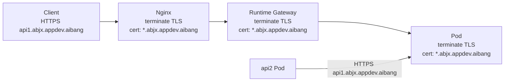
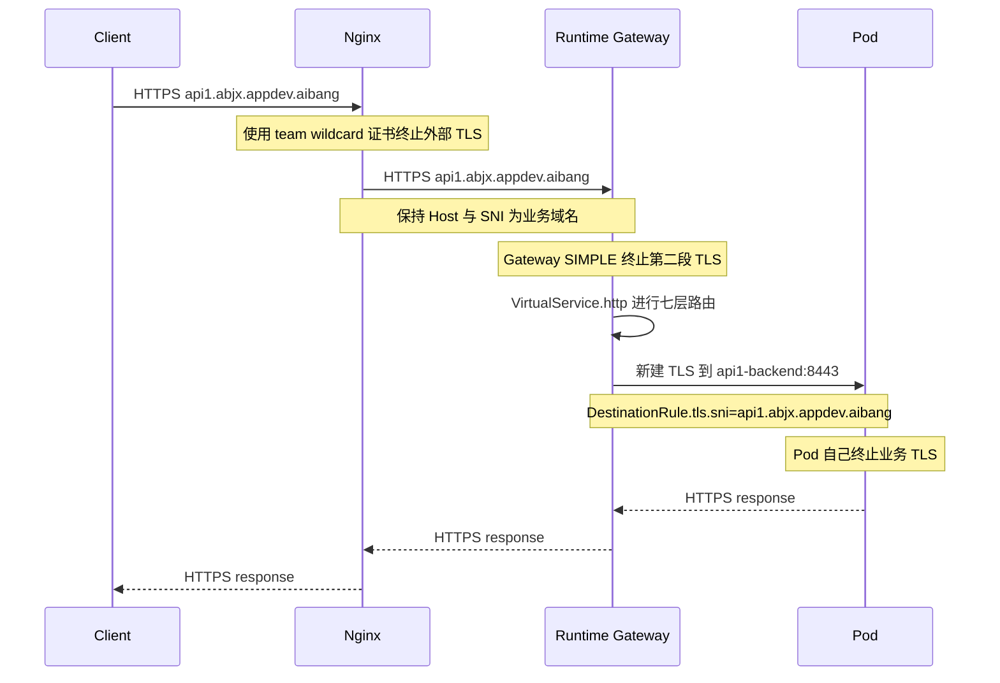
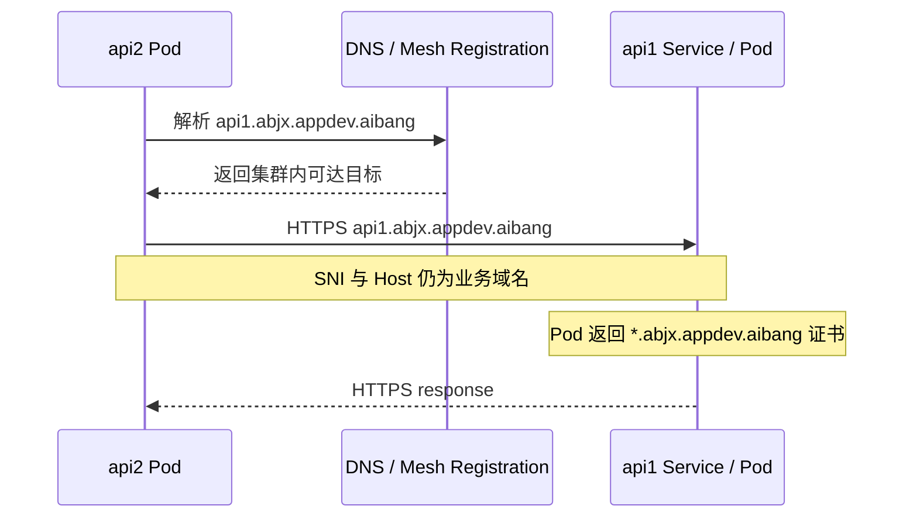
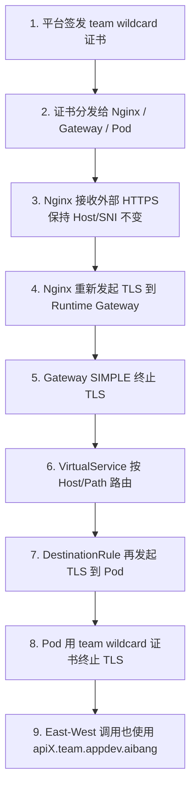

# Nginx + Runtime Gateway + Pod 端到端 TLS 方案（合并定稿版）

> 本文以 `nginx+simple+chatgpt.md` 中的硬需求为唯一基线，吸收 `nginx+simple+claude.md` 中更清晰的配置结构、`VirtualService` 说明和验证方式，整理成一个可直接讨论、落地、交接的最终版本。

---

## 1. Goal And Constraints

### 1.1 硬需求

以下约束视为不变：

| 约束 | 说明 |
| --- | --- |
| 外部访问域名固定 | 始终为 `{apiname}.{team}.appdev.aibang` |
| Nginx 不改写 Host | 不做 Host 改写，不做内部域名转换，尽量保留原始 Host/SNI |
| 全链路 TLS | `Client -> Nginx -> runtime Gateway -> Pod` 每一跳都必须加密 |
| Pod 终止业务 TLS | 最终业务 TLS 必须直达到 Pod，Pod 自己监听 HTTPS 并挂载证书 |
| Pod-to-Pod 也必须加密 | east-west 流量也必须 TLS |
| 证书尽量统一 | 尽量复用 `*.{team}.appdev.aibang` 同一套 team wildcard 证书 |
| Gateway 作为标准模板 | runtime Gateway 需要平台标准化，用户尽量只关注 runtime 侧资源 |
| runtime 资源需模板化 | 至少包括 `Gateway`、`VirtualService`、`DestinationRule`、`ServiceEntry`、`Secret`、`Deployment/StatefulSet`、`Service` |
| 平台要补齐证书能力 | 包括签发、分发、轮换、Secret 生命周期管理和审计 |
| 必须提前验证 east-west 解析 | 集群内部如何把 `apiX.{team}.appdev.aibang` 解析到目标工作负载，必须先验证 |

### 1.2 核心前提

如果 Pod-to-Pod 也要复用同一张 `*.{team}.appdev.aibang` wildcard 证书，那么内部调用不能默认依赖：

```text
service.namespace.svc.cluster.local
```

而应该尽量使用：

```text
https://apiX.{team}.appdev.aibang
```

原因很直接：证书校验绑定的是访问主机名，`cluster.local` 不会被 `*.{team}.appdev.aibang` 覆盖。

### 1.3 复杂度评级

`Advanced`

因为你同时要求：

- 域名不变
- Host/SNI 尽量不变
- north-south 全链路 TLS
- east-west 也 TLS
- Pod 最终终止业务 TLS
- 尽量复用同一套 wildcard 证书

真正的难点不是 Nginx，也不是 Gateway，而是：

`apiX.{team}.appdev.aibang` 如何在集群内部稳定、可校验地解析到目标后端。

---

## 2. Recommended Architecture (V1)

### 2.1 最终推荐

推荐 V1 采用：

`Gateway SIMPLE + VirtualService.http + DestinationRule.tls`

这是两份文档合并后的最终主推荐方案。

原因：

1. 它满足你的硬需求：Pod 最终仍然终止 TLS，Gateway -> Pod 仍然是 TLS。
2. 它保留了 `VirtualService.http` 的七层能力，后续还能做 path 路由、header 处理、重试、超时、灰度。
3. 你的域名模型虽然天然适合 `PASSTHROUGH + tls + sniHosts`，但当前没有必要为了“更纯粹的 TLS 透传”主动放弃 HTTP 治理能力。
4. Gateway 已经是平台标准模板，持有证书不是新增核心风险；真正风险仍然是证书分发和内部域名解析。

### 2.2 三层 TLS 分工

| 层 | 对象 | TLS 角色 |
| --- | --- | --- |
| Client -> Nginx | Nginx `ssl_certificate` | 终止外部 TLS |
| Nginx -> Gateway | `proxy_ssl_server_name` + `proxy_ssl_name` | 重新发起 TLS，并保持原始 SNI |
| Gateway | `Gateway.tls.mode: SIMPLE` | 终止 Nginx -> Gateway 这一跳 TLS |
| Gateway -> Pod | `DestinationRule.trafficPolicy.tls` | 对后端再次发起 TLS |
| Pod | 应用 HTTPS 监听 + 挂载 wildcard 证书 | 终止最终业务 TLS |

### 2.3 流量模型



### 2.4 为什么不是主推 `PASSTHROUGH`

`PASSTHROUGH + VirtualService.tls + sniHosts` 不是错误方案，但它是备选，而不是主方案。

| 维度 | `SIMPLE + http + DR.tls` | `PASSTHROUGH + tls + sniHosts` |
| --- | --- | --- |
| Gateway 是否解密 | 是 | 否 |
| Pod 是否终止 TLS | 是 | 是 |
| Gateway -> Pod 是否 TLS | 是 | 是 |
| path 路由 | 支持 | 不支持 |
| header 操作 | 支持 | 不支持 |
| HTTP 重试/超时 | 支持 | 基本不支持 HTTP 级治理 |
| 基于 JWT/HTTP 的入口控制 | 支持 | 不支持 |
| 适合场景 | 既要 Pod TLS，又要七层治理 | 只按 SNI 转发，不需要七层治理 |

结论：

- 如果你还要保留 HTTP 七层能力，主推 `SIMPLE`。
- 只有在你明确要求“Gateway 不解密 TLS，且放弃七层治理”时，才切到 `PASSTHROUGH`。

---

## 3. End-To-End Process

### 3.1 North-South 详细流程



### 3.2 East-West 详细流程



### 3.3 给同事讲解时的简化版流程图



### 3.4 过程细化

建议把整个落地过程拆成四段，便于平台和业务团队协作：

| 阶段 | 平台动作 | 用户动作 | 输出物 |
| --- | --- | --- | --- |
| 证书准备 | 签发 wildcard 证书，定义 Secret 下发方式 | 无 | `Secret`、轮换规则、审计规则 |
| 入口准备 | 发布 Nginx 模板、Gateway 模板 | 无 | Nginx 配置、`Gateway` |
| 服务接入 | 提供 `VirtualService` / `DestinationRule` / `ServiceEntry` 模板 | 填自己的 API 域名和后端 Service | VS、DR、SE |
| 应用就绪 | 提供 HTTPS 接入规范 | 应用监听 8443 并挂载证书 | `Deployment`、`Service` |

---

## 4. Runtime Resource Model

### 4.1 平台标准模板

平台侧建议统一提供：

| 资源 | 作用 |
| --- | --- |
| Nginx 模板 | 对外终止 TLS，并 re-encrypt 到 runtime Gateway |
| `Gateway` | team 级标准 HTTPS 入口 |
| Gateway 证书 `Secret` | 供 `credentialName` 引用 |
| `ServiceEntry` 模板 | 支持 east-west 使用业务域名 |
| 证书分发/轮换组件 | 保证 Nginx、Gateway、Pod 三处同步 |

### 4.2 API Owner 关注的 runtime 资源

| 资源 | 作用 |
| --- | --- |
| `VirtualService` | 定义业务域名到后端的路由 |
| `DestinationRule` | 控制 Gateway -> Pod 是否继续 TLS，以及 SNI |
| `Deployment/StatefulSet` | Pod 监听 HTTPS、挂载证书 |
| `Service` | 暴露 Pod HTTPS 端口 |
| Pod 证书 `Secret` | 给业务 Pod 挂载 TLS 材料 |

---

## 5. Implementation Steps

### 5.1 Nginx 配置

关键点：

- 不改写 Host
- 到 Gateway 继续使用 TLS
- 保持原始 SNI

```nginx
server {
    listen 443 ssl http2;
    server_name *.abjx.appdev.aibang;

    ssl_certificate     /etc/pki/tls/certs/wildcard-abjx-appdev-aibang.crt;
    ssl_certificate_key /etc/pki/tls/private/wildcard-abjx-appdev-aibang.key;
    ssl_protocols       TLSv1.2 TLSv1.3;
    ssl_session_timeout 5m;

    proxy_set_header Host             $host;
    proxy_set_header X-Original-Host  $host;
    proxy_set_header X-Forwarded-For  $proxy_add_x_forwarded_for;
    proxy_set_header X-Forwarded-Proto https;
    proxy_set_header X-aibang-CAP-Correlation-Id $request_id;

    proxy_http_version 1.1;
    proxy_set_header   Connection "";
    client_max_body_size 50m;
    underscores_in_headers on;

    location / {
        proxy_pass https://runtime-istio-ingressgateway.abjx-int.svc.cluster.local:443;

        proxy_ssl_server_name on;
        proxy_ssl_name        $host;

        # 生产环境改为内部 CA 校验
        proxy_ssl_verify off;
    }
}
```

### 5.2 Gateway 模板

```yaml
apiVersion: networking.istio.io/v1beta1
kind: Gateway
metadata:
  name: runtime-team-gateway
  namespace: abjx-int
spec:
  selector:
    app: runtime-istio-ingressgateway
  servers:
  - port:
      number: 443
      name: https-team
      protocol: HTTPS
    hosts:
    - "*.abjx.appdev.aibang"
    tls:
      mode: SIMPLE
      credentialName: wildcard-abjx-appdev-aibang-cert
      minProtocolVersion: TLSV1_2
```

### 5.3 VirtualService

这是主路由对象。它负责匹配和选路，不负责后端 TLS。

```yaml
apiVersion: networking.istio.io/v1beta1
kind: VirtualService
metadata:
  name: api1-abjx-vs
  namespace: abjx-int
spec:
  gateways:
  - runtime-team-gateway
  hosts:
  - api1.abjx.appdev.aibang
  http:
  - name: route-api1
    match:
    - uri:
        prefix: /
    route:
    - destination:
        host: api1-backend.abjx-int.svc.cluster.local
        port:
          number: 8443
    timeout: 60s
    retries:
      attempts: 2
      perTryTimeout: 20s
      retryOn: gateway-error,connect-failure,reset
```

### 5.4 DestinationRule

这是整个方案里最容易被漏掉、但实际上最关键的对象。

它负责让 Gateway -> Pod 继续使用 TLS，并且把 SNI 维持为真实业务域名。

```yaml
apiVersion: networking.istio.io/v1beta1
kind: DestinationRule
metadata:
  name: api1-backend-dr
  namespace: abjx-int
spec:
  host: api1-backend.abjx-int.svc.cluster.local
  trafficPolicy:
    tls:
      mode: SIMPLE
      sni: api1.abjx.appdev.aibang
      # 生产环境建议补充 CA 校验
      # caCertificates: /etc/ssl/certs/ca-bundle.crt
```

### 5.5 Gateway 证书 Secret

```yaml
apiVersion: v1
kind: Secret
metadata:
  name: wildcard-abjx-appdev-aibang-cert
  namespace: istio-system
type: kubernetes.io/tls
data:
  tls.crt: <BASE64_CERT>
  tls.key: <BASE64_KEY>
```

### 5.6 Pod 证书 Secret

```yaml
apiVersion: v1
kind: Secret
metadata:
  name: wildcard-abjx-appdev-aibang-pod-cert
  namespace: abjx-int
type: kubernetes.io/tls
data:
  tls.crt: <BASE64_CERT>
  tls.key: <BASE64_KEY>
```

### 5.7 Deployment

```yaml
apiVersion: apps/v1
kind: Deployment
metadata:
  name: api1
  namespace: abjx-int
spec:
  replicas: 2
  selector:
    matchLabels:
      app: api1
  template:
    metadata:
      labels:
        app: api1
    spec:
      containers:
      - name: api1
        image: your-registry/api1:latest
        ports:
        - containerPort: 8443
          name: https
        volumeMounts:
        - name: tls-cert
          mountPath: /etc/tls
          readOnly: true
        env:
        - name: TLS_CERT_FILE
          value: /etc/tls/tls.crt
        - name: TLS_KEY_FILE
          value: /etc/tls/tls.key
      volumes:
      - name: tls-cert
        secret:
          secretName: wildcard-abjx-appdev-aibang-pod-cert
```

### 5.8 Service

```yaml
apiVersion: v1
kind: Service
metadata:
  name: api1-backend
  namespace: abjx-int
spec:
  selector:
    app: api1
  ports:
  - name: https
    port: 8443
    targetPort: 8443
    protocol: TCP
```

### 5.9 East-West 的 ServiceEntry

这部分只解决“mesh 内认可该业务域名”这一层，前提仍然是你们已经想清楚内部 DNS / 注册方式。
仅有 `ServiceEntry` 不等于内部解析问题自动解决，仍然要确认 `api1.abjx.appdev.aibang` 在集群内可被正确解析并可达。

```yaml
apiVersion: networking.istio.io/v1beta1
kind: ServiceEntry
metadata:
  name: api1-abjx-se
  namespace: abjx-int
spec:
  hosts:
  - api1.abjx.appdev.aibang
  location: MESH_INTERNAL
  ports:
  - number: 443
    name: https
    protocol: TLS
  resolution: DNS
```

### 5.10 East-West 的 DestinationRule

```yaml
apiVersion: networking.istio.io/v1beta1
kind: DestinationRule
metadata:
  name: api1-abjx-eastwest-dr
  namespace: abjx-int
spec:
  host: api1.abjx.appdev.aibang
  trafficPolicy:
    tls:
      mode: SIMPLE
      sni: api1.abjx.appdev.aibang
```

---

## 6. VirtualService 使用要点

这一节保留第二个文档里最有价值的学习性内容，但只保留和当前方案直接相关的部分。

### 6.1 `VirtualService` 的职责

`VirtualService` 只负责：

- 匹配流量
- 定义路由
- 配置 HTTP 级治理

它不负责：

- 持有证书
- 决定 Gateway 是否终止 TLS
- 决定 Gateway -> Pod 是否继续 TLS

### 6.2 常用能力

#### 基于 URI 前缀匹配

```yaml
http:
- match:
  - uri:
      prefix: /v2
  route:
  - destination:
      host: api1-v2.abjx-int.svc.cluster.local
      port:
        number: 8443
```

#### 基于 Header 匹配

```yaml
http:
- match:
  - headers:
      x-canary:
        exact: "true"
  route:
  - destination:
      host: api1-backend.abjx-int.svc.cluster.local
      subset: v2
      port:
        number: 8443
```

#### 重试与超时

```yaml
timeout: 30s
retries:
  attempts: 3
  perTryTimeout: 10s
  retryOn: gateway-error,connect-failure,reset
```

#### URI Rewrite

```yaml
rewrite:
  uri: /new-api
```

#### Header 注入

```yaml
headers:
  request:
    add:
      x-team: abjx
```

### 6.3 灰度发布示例

```yaml
apiVersion: networking.istio.io/v1beta1
kind: VirtualService
metadata:
  name: api1-canary-vs
  namespace: abjx-int
spec:
  gateways:
  - runtime-team-gateway
  hosts:
  - api1.abjx.appdev.aibang
  http:
  - name: canary-route
    match:
    - headers:
        x-canary:
          exact: "true"
    route:
    - destination:
        host: api1-backend.abjx-int.svc.cluster.local
        subset: v2
        port:
          number: 8443
  - name: stable-route
    route:
    - destination:
        host: api1-backend.abjx-int.svc.cluster.local
        subset: v2
        port:
          number: 8443
      weight: 10
    - destination:
        host: api1-backend.abjx-int.svc.cluster.local
        subset: v1
        port:
          number: 8443
      weight: 90
```

配套 `DestinationRule`：

```yaml
apiVersion: networking.istio.io/v1beta1
kind: DestinationRule
metadata:
  name: api1-backend-dr
  namespace: abjx-int
spec:
  host: api1-backend.abjx-int.svc.cluster.local
  trafficPolicy:
    tls:
      mode: SIMPLE
      sni: api1.abjx.appdev.aibang
  subsets:
  - name: v1
    labels:
      version: v1
  - name: v2
    labels:
      version: v2
```

---

## 7. Validation And Rollback

### 7.1 North-South 验证

```bash
curl --resolve api1.abjx.appdev.aibang:443:<NGINX_IP> \
     https://api1.abjx.appdev.aibang/healthz -v
```

核查项：

1. Nginx 收到的 Host 是否为 `api1.abjx.appdev.aibang`
2. Gateway 是否匹配到正确的 `VirtualService`
3. Gateway -> Pod 是否使用 TLS
4. Pod 返回证书 SAN 是否覆盖 `api1.abjx.appdev.aibang`

可辅助检查：

```bash
istioctl proxy-config routes <gateway-pod> -n abjx-int
istioctl proxy-config cluster <gateway-pod> -n abjx-int | grep api1-backend
```

### 7.2 East-West 验证

```bash
kubectl exec -n abjx-int -it <api2-pod> -- \
  curl https://api1.abjx.appdev.aibang/healthz -v
```

```bash
kubectl exec -n abjx-int -it <api2-pod> -- \
  openssl s_client -connect api1.abjx.appdev.aibang:443 \
  -servername api1.abjx.appdev.aibang
```

核查项：

1. 集群内 DNS / mesh host 解析是否正确
2. 访问地址是否始终是业务域名，而不是 `cluster.local`
3. 返回证书是否仍然是 `*.abjx.appdev.aibang`

### 7.3 证书检查

```bash
openssl x509 -in wildcard.crt -text -noout | grep -A1 "Subject Alternative Name"
```

### 7.4 回滚策略

建议按以下顺序回滚，避免同时动三层：

1. 先回滚 `VirtualService` 和 `DestinationRule`
2. 再回滚 Pod HTTPS 变更
3. 最后再回滚 Gateway / Nginx 模板

原因：

- Nginx 和 Gateway 属于平台共享层，改动影响面最大
- VS/DR 最贴近单 API，最适合作为第一层回滚点

---

## 8. Reliability And Cost Optimizations

### 8.1 高可用建议

- Nginx、Gateway、业务 Pod 都至少双副本
- Gateway 和 Pod 都配置 `PodDisruptionBudget`
- 对业务 Pod 打开 HPA，但注意 HTTPS 握手带来的 CPU 抖动
- Pod 监听 HTTPS 时做好 readiness/liveness，避免证书未挂载完成就接流量

### 8.2 证书与 Secret 管理

- 统一用 `cert-manager` 或 Vault 类方案做证书签发和轮换
- 统一约定 Gateway Secret 与 Pod Secret 的命名规范
- 对证书过期时间做告警，建议至少提前 14 天触发
- Secret 权限最小化，避免 Nginx、Gateway、Pod 所有命名空间都能互相读取

### 8.3 流量治理建议

- HTTP 级超时和重试只放在 Gateway 这一层，不要和应用重试策略叠加过度
- 对长连接和流式请求单独评估是否适合经过 Gateway 解密再重建 TLS
- 若未来 path 路由和灰度需求持续增长，继续坚持 `SIMPLE` 路线

### 8.4 真正要优先验证的点

真正需要优先验证的不是 YAML 能不能写出来，而是：

`apiX.{team}.appdev.aibang` 在集群内部到底如何解析。

推荐按以下优先级评估：

| 方式 | 优点 | 缺点 | 推荐度 |
| --- | --- | --- | --- |
| 内部 DNS 直接指向 Service IP | 路径最短，最直观 | 需要 DNS 管理能力 | 高 |
| ServiceEntry + mesh 注册 | mesh-native | 设计复杂，仍要考虑 DNS | 中高 |
| 内部先回到 Gateway 再转发 | 逻辑统一 | 路径长，性能与治理都更绕 | 中 |

---

## 9. Optional Alternative: PASSTHROUGH

### 9.1 什么时候考虑

只有在以下条件同时满足时，再考虑切到 `PASSTHROUGH`：

- 明确不需要 path 路由
- 明确不需要 header 改写
- 明确不需要 HTTP 级重试、超时、JWT 治理
- 更关心 TLS 不在 Gateway 解密

### 9.2 配置方式

#### Gateway

```yaml
apiVersion: networking.istio.io/v1beta1
kind: Gateway
metadata:
  name: runtime-team-gateway-passthrough
  namespace: abjx-int
spec:
  selector:
    app: runtime-istio-ingressgateway
  servers:
  - port:
      number: 443
      name: tls-team
      protocol: TLS
    hosts:
    - "*.abjx.appdev.aibang"
    tls:
      mode: PASSTHROUGH
```

#### VirtualService

```yaml
apiVersion: networking.istio.io/v1beta1
kind: VirtualService
metadata:
  name: api1-abjx-tls-vs
  namespace: abjx-int
spec:
  gateways:
  - runtime-team-gateway-passthrough
  hosts:
  - api1.abjx.appdev.aibang
  tls:
  - match:
    - port: 443
      sniHosts:
      - api1.abjx.appdev.aibang
    route:
    - destination:
        host: api1-backend.abjx-int.svc.cluster.local
        port:
          number: 8443
```

### 9.3 代价

切到 `PASSTHROUGH` 后，Gateway 层只剩：

- 端口
- SNI Host

失去的能力包括：

- URI/path 路由
- Header 匹配
- Header 注入/改写
- URI rewrite
- HTTP 级重试/超时
- 基于 HTTP/JWT 的统一入口治理

结论：

它不是错误，而是一个更窄、更纯粹的方案。

---

## 10. Handoff Checklist

### 10.1 平台团队

- 是否已经明确 wildcard 证书签发和轮换路径
- 是否已经提供 Nginx 模板
- 是否已经提供 Gateway 模板
- 是否已经约定 Gateway Secret 与 Pod Secret 命名
- 是否已经定义 east-west 域名解析方案
- 是否已经准备证书过期告警和 Secret 审计

### 10.2 API Owner

- 应用是否支持 HTTPS 监听
- 是否挂载了正确的 Pod 证书 Secret
- `VirtualService` 是否绑定正确 Host
- `DestinationRule` 是否配置了 TLS 和正确的 SNI
- east-west 调用是否改成业务域名

### 10.3 最终结论

本次合并后的最终可用版本，主方案明确为：

`Nginx -> Gateway(SIMPLE terminate) -> VirtualService.http -> DestinationRule.tls -> Pod HTTPS`

这是当前最符合你硬需求、同时又最可运营的 V1。

如果未来你们明确不要七层能力，再考虑切到：

`Gateway PASSTHROUGH + VirtualService.tls + sniHosts`

---

## References

- [Istio Gateway reference](https://preliminary.istio.io/latest/docs/reference/config/networking/gateway/)
- [Istio VirtualService reference](https://istio.io/latest/docs/reference/config/networking/virtual-service/)
- [Istio DestinationRule reference](https://istio.io/latest/docs/reference/config/networking/destination-rule/)
- [Istio ServiceEntry reference](https://preliminary.istio.io/latest/docs/reference/config/networking/service-entry/)
- [Istio TLS origination](https://istio.io/latest/docs/tasks/traffic-management/egress/egress-tls-origination/)
- [Set up TLS termination in ingress gateway](https://cloud.google.com/service-mesh/docs/operate-and-maintain/gateway-tls-termination)
- [Kubernetes TLS Secret](https://kubernetes.io/docs/concepts/configuration/secret/)
