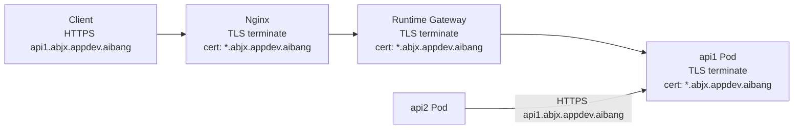
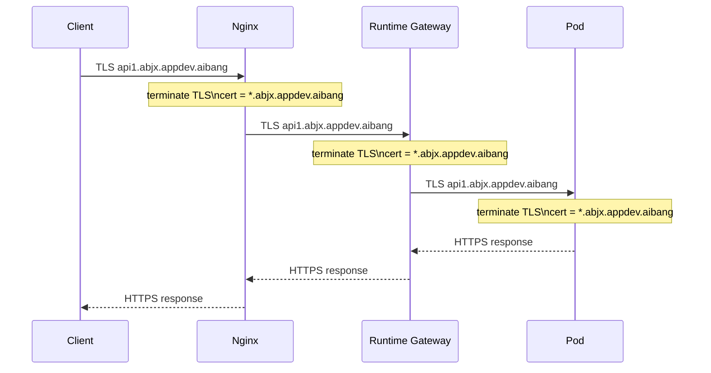
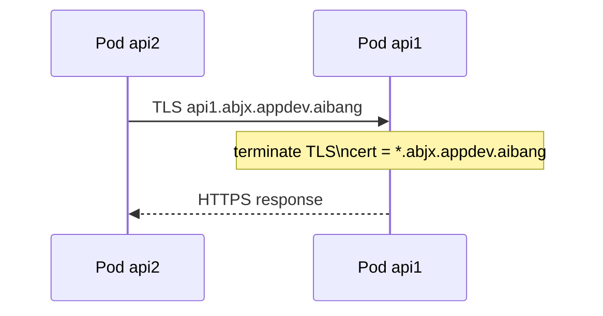

# Nginx + Runtime Gateway + Pod End-to-End TLS Architecture

```bash
The following is a workflow that I've organized. We may need to make some changes to our core resource requirements, so there might be some new resources that need to be analyzed and studied.

In addition, regarding the Network Policy and the corresponding Runtime Deploy files, we need to provide them to the relevant team next week as templates for deployment. Therefore, we need to have a profound understanding of this template.
```

## 1. Goal And Constraints

### 1.1 Real Objectives

This architecture is designed around your actual goals, without deviation:

1. Domain names must always remain as: `{apiname}.{team}.appdev.aibang`
2. No Host rewriting
3. No internal domain conversion
4. Traffic must ultimately reach the Pod
5. Pod-to-Pod communication must also be encrypted
6. Encryption should reuse the same team wildcard certificate: `*.{team}.appdev.aibang`
7. The runtime Gateway remains as a standard template
8. Users should ideally only focus on creating runtime-side resources

### 1.2 Key Conclusions

This requirement can be designed, but one prerequisite must be accepted:

If you require Pod-to-Pod communication to continue using the same `*.{team}.appdev.aibang` certificate, then internal Pod calls can no longer default to relying on:

- `service.namespace.svc.cluster.local`

Instead, they should continue to use:

- `api1.{team}.appdev.aibang`

This is because certificate validation is bound to the hostname.
If internal calls still go through `cluster.local`, the same wildcard certificate will not match.

---

## 2. Recommended Architecture (V1)

### 2.1 Recommended V1

Based on your objectives, the most coherent V1 is:

1. Nginx terminates TLS using the `*.{team}.appdev.aibang` certificate
2. Nginx keeps the original Host/SNI unchanged and re-encrypts to the runtime Gateway using the same domain
3. The runtime Gateway terminates TLS again using the same `*.{team}.appdev.aibang` certificate
4. The runtime Gateway forwards traffic to the target Pod via TLS
5. The Pod itself also uses the same `*.{team}.appdev.aibang` certificate to serve HTTPS
6. During Pod-to-Pod calls, continue using the `apiX.{team}.appdev.aibang` naming convention and access via TLS

### 2.2 Traffic Model



### 2.3 Complexity Rating

`Advanced`

Reasons:

- You require both north-south and east-west traffic to continue using the same domain and certificate system
- This means both Gateway and Pod must terminate TLS
- This also means Pod-to-Pod cannot casually fall back to `cluster.local`

This approach is feasible, but more complex than "Gateway terminates TLS, Pod uses mesh mTLS".

---

## 3. Core Design Principles

### 3.1 Principles That Must Be Followed

| Principle                                   | Description                                                                         |
| ------------------------------------------- | ----------------------------------------------------------------------------------- |
| Consistent domain across the chain          | Host/SNI always remains `apiX.{team}.appdev.aibang`                                 |
| End-to-end encryption                       | Client -> Nginx -> Gateway -> Pod are all TLS                                       |
| Pod terminates business TLS                 | The final business Pod must mount the team wildcard certificate and listen on HTTPS |
| Pod-to-Pod continues using business domains | Internal calls should also use `apiX.{team}.appdev.aibang`                          |
| Gateway and Pod certificates match          | Both runtime Gateway and Pod use the same team wildcard certificate system          |
| User resources focus on runtime             | Users primarily create `Gateway / VirtualService / DestinationRule / ServiceEntry`  |

### 3.2 Direct Benefits of This Approach

| Benefit                                  | Description                                              |
| ---------------------------------------- | -------------------------------------------------------- |
| No Host rewriting needed                 | Configuration is more intuitive                          |
| Unified internal and external domains    | Troubleshooting is simpler                               |
| Unified certificate model                | Consistent team mental model                             |
| Pod ultimately holds business TLS        | Meets your goal of "direct reach to Pod with encryption" |
| east-west can also use unified standards | Pod-to-Pod doesn't need two separate TLS logic paths     |

### 3.3 Trade-offs

| Trade-off                               | Description                                                                          |
| --------------------------------------- | ------------------------------------------------------------------------------------ |
| Expanded private key distribution       | Nginx, Gateway, and Pod all need access to the same certificate or signing materials |
| Complex Secret rotation                 | All three layers must be synchronized                                                |
| More complex internal service discovery | Pod-to-Pod cannot simply rely on `cluster.local` anymore                             |
| More configuration objects              | In addition to VS, you also need DR / ServiceEntry / Secret                          |

---

## 4. What Must Be True

### 4.1 Where Certificates Must Be Configured

In your architecture, these three locations must have TLS abjability:

| Location        | Requires `*.{team}.appdev.aibang` Certificate | Reason                                                                           |
| --------------- | --------------------------------------------- | -------------------------------------------------------------------------------- |
| Nginx           | Yes                                           | Terminates external HTTPS                                                        |
| Runtime Gateway | Yes                                           | Terminates HTTPS from upstream to Gateway                                        |
| Runtime Pod     | Yes                                           | Final business traffic reaches the Pod directly, and Pod itself terminates HTTPS |

### 4.2 Where You Cannot Cut Corners

If you want Pod-to-Pod to continue using the same certificate, the following cannot be skipped:

1. Pod must listen on HTTPS port
2. Pod must mount the team wildcard certificate
3. Callers must initiate calls using `apiX.{team}.appdev.aibang`
4. Gateway to Pod cannot be downgraded to plaintext

---

## 5. Reference Flow

### 5.1 North-South Flow



### 5.2 East-West Flow



---

## 6. Runtime Resource Model

To meet your objectives, the runtime side should have at least these resources:

| Resource                 | Purpose                                                                                     |
| ------------------------ | ------------------------------------------------------------------------------------------- |
| `Gateway`                | Team-level standard HTTPS ingress                                                           |
| `VirtualService`         | Routes traffic to backends by business domain or path                                       |
| `DestinationRule`        | Specifies TLS origination method from Gateway -> Pod                                        |
| `ServiceEntry`           | Allows Pod-to-Pod to continue using `apiX.{team}.appdev.aibang` to access internal services |
| `Secret`                 | Holds the team wildcard certificate                                                         |
| `Deployment/StatefulSet` | Mounts certificates to business Pods, application listens on HTTPS                          |

---

## 7. Configuration Examples

The following examples use the `abjx` team and `api1.abjx.appdev.aibang` as references.

### 7.1 Nginx Configuration

Key points:

- No Host rewriting
- Upstream continues to use original SNI
- Re-encrypt to runtime Gateway

```nginx
server {
    listen 443 ssl http2;
    server_name *.abjx.appdev.aibang;

    ssl_certificate /etc/pki/tls/certs/wildcard-abjx-appdev-aibang.crt;
    ssl_certificate_key /etc/pki/tls/private/wildcard-abjx-appdev-aibang.key;

    client_max_body_size 50m;
    underscores_in_headers on;
    proxy_http_version 1.1;
    proxy_set_header Connection "";
    proxy_set_header X-aibang-CAP-Correlation-Id $request_id;
    proxy_set_header X-Forwarded-For $proxy_add_x_forwarded_for;
    proxy_set_header X-Forwarded-Proto https;
    proxy_set_header X-Original-Host $host;
    proxy_set_header Host $host;

    ssl_protocols TLSv1.2 TLSv1.3;
    ssl_session_timeout 5m;

    location / {
        proxy_pass https://runtime-istio-ingressgateway.abjx-int.svc.cluster.local:443;

        proxy_ssl_server_name on;
        proxy_ssl_name $host;

        # Production recommendation: change to internal CA validation
        proxy_ssl_verify off;
    }
}
```

### 7.2 Runtime Gateway Template

Key points:

- Gateway listens on team wildcard
- Uses the same team certificate

```yaml
apiVersion: networking.istio.io/v1beta1
kind: Gateway
metadata:
  name: runtime-team-gateway
  namespace: abjx-int
spec:
  selector:
    app: runtime-istio-ingressgateway
  servers:
  - port:
      number: 443
      name: https-team
      protocol: HTTPS
    hosts:
    - "*.abjx.appdev.aibang"
    tls:
      mode: SIMPLE
      credentialName: wildcard-abjx-appdev-aibang-cert
      minProtocolVersion: TLSV1_2
```

### 7.3 VirtualService

After the Gateway terminates TLS, continue routing based on the external real domain.

```yaml
apiVersion: networking.istio.io/v1beta1
kind: VirtualService
metadata:
  name: api1-abjx-vs
  namespace: abjx-int
spec:
  gateways:
  - runtime-team-gateway
  hosts:
  - api1.abjx.appdev.aibang
  http:
  - name: route-api1
    match:
    - uri:
        prefix: /
    route:
    - destination:
        host: api1-backend.abjx-int.svc.cluster.local
        port:
          number: 8443
    timeout: 60s
    retries:
      attempts: 2
      perTryTimeout: 20s
      retryOn: gateway-error,connect-failure,reset
```

### 7.4 DestinationRule

This object is critical.
It ensures that Gateway to Pod continues using TLS, and the SNI continues to maintain the real business domain.

```yaml
apiVersion: networking.istio.io/v1beta1
kind: DestinationRule
metadata:
  name: api1-backend-dr
  namespace: abjx-int
spec:
  host: api1-backend.abjx-int.svc.cluster.local
  trafficPolicy:
    tls:
      mode: SIMPLE
      sni: api1.abjx.appdev.aibang
```

If you require strict certificate validation, it is recommended to add `caCertificates` and avoid long-term reliance on "encryption without validation".

### 7.5 Pod Certificate Secret

```yaml
apiVersion: v1
kind: Secret
metadata:
  name: wildcard-abjx-appdev-aibang-pod-cert
  namespace: abjx-int
type: kubernetes.io/tls
data:
  tls.crt: BASE64_CERT
  tls.key: BASE64_KEY
```

### 7.6 Pod Deployment Example

The Pod itself must listen on HTTPS.

```yaml
apiVersion: apps/v1
kind: Deployment
metadata:
  name: api1
  namespace: abjx-int
spec:
  replicas: 2
  selector:
    matchLabels:
      app: api1
  template:
    metadata:
      labels:
        app: api1
    spec:
      containers:
      - name: api1
        image: your-registry/api1:latest
        ports:
        - containerPort: 8443
        volumeMounts:
        - name: tls-cert
          mountPath: /etc/tls
          readOnly: true
        env:
        - name: TLS_CERT_FILE
          value: /etc/tls/tls.crt
        - name: TLS_KEY_FILE
          value: /etc/tls/tls.key
      volumes:
      - name: tls-cert
        secret:
          secretName: wildcard-abjx-appdev-aibang-pod-cert
```

### 7.7 Service

```yaml
apiVersion: v1
kind: Service
metadata:
  name: api1-backend
  namespace: abjx-int
spec:
  selector:
    app: api1
  ports:
  - name: https
    port: 8443
    targetPort: 8443
```

---

## 8. Pod-To-Pod With The Same Certificate

This is the most critical part of your architecture.

### 8.1 The Core Problem

If the `api2` Pod wants to call the `api1` Pod, and you require continuing to use the same `*.abjx.appdev.aibang` certificate, then:

- `api2` cannot directly use `api1-backend.abjx-int.svc.cluster.local`
- Because this hostname is not covered by `*.abjx.appdev.aibang`

Therefore, internal calls should continue to use:

- `https://api1.abjx.appdev.aibang`

### 8.2 ServiceEntry Example

Below is a reference approach for continuing to use business domains internally within the runtime.

```yaml
apiVersion: networking.istio.io/v1beta1
kind: ServiceEntry
metadata:
  name: api1-abjx-se
  namespace: abjx-int
spec:
  hosts:
  - api1.abjx.appdev.aibang
  location: MESH_INTERNAL
  ports:
  - number: 443
    name: https
    protocol: TLS
  resolution: DNS
```

The purpose of this object is not for external egress, but to allow the mesh to continue recognizing this business domain.

### 8.3 Pod-to-Pod DestinationRule Example

```yaml
apiVersion: networking.istio.io/v1beta1
kind: DestinationRule
metadata:
  name: api1-abjx-eastwest-dr
  namespace: abjx-int
spec:
  host: api1.abjx.appdev.aibang
  trafficPolicy:
    tls:
      mode: SIMPLE
      sni: api1.abjx.appdev.aibang
```

### 8.4 An Additional Point That Must Be Evaluated

This section is the most critical part to validate in advance for the entire architecture:

How exactly does `api1.abjx.appdev.aibang` resolve to the target workload within the cluster?

You must determine at least one approach:

| Approach                              | Description                                               |
| ------------------------------------- | --------------------------------------------------------- |
| Internal DNS resolves to service IP   | Most direct, but requires DNS management                  |
| Register custom hosts via mesh        | More mesh-native, but requires additional resource design |
| Route internally back through Gateway | Easiest to unify, but not the shortest path               |

If you insist on "reaching the Pod as directly as possible", then it is more recommended to:

- Have internal DNS / mesh registration point directly to the service
- Let Gateway only handle north-south traffic

---

## 9. Suggested Operating Principles

### 9.1 Platform Team Responsibilities

- Team wildcard certificate issuance and rotation
- Nginx team templates
- Runtime Gateway standard templates
- ServiceEntry / DestinationRule templates
- Unified certificate distribution method

### 9.2 API Owner Responsibilities

- `VirtualService`
- Business Pod HTTPS configuration
- Pod certificate mounting
- Business dependency call inventory

---

## 10. Validation Checklist

### 10.1 North-South

1. `curl --resolve api1.abjx.appdev.aibang:443:<NGINX_IP> https://api1.abjx.appdev.aibang -vk`
2. Confirm Nginx receives Host as `api1.abjx.appdev.aibang`
3. Confirm Gateway matches `*.abjx.appdev.aibang`
4. Confirm Gateway -> Pod upstream connection uses TLS
5. Confirm Pod application certificate SAN covers `api1.abjx.appdev.aibang`

### 10.2 East-West

1. Call `https://api1.abjx.appdev.aibang` from within the `api2` Pod
2. Confirm DNS / mesh host resolution is correct
3. Confirm the `api1` Pod returns a certificate that is still `*.abjx.appdev.aibang`
4. Confirm no certificate mismatch triggered by `cluster.local`

---

## 11. Key Risks

| Risk                              | Description                                                                                        |
| --------------------------------- | -------------------------------------------------------------------------------------------------- |
| Expanded certificate distribution | Nginx, Gateway, and Pod all need access to certificates                                            |
| Complex rotation                  | Any unsynchronized layer will cause interruption                                                   |
| Complex east-west host resolution | Without resolving internal domain names, true "Pod-to-Pod same-certificate TLS" cannot be achieved |
| Applications must support HTTPS   | Pods themselves must terminate TLS                                                                 |
| Increased private key exposure    | Secret lifecycle management and auditing are mandatory                                             |

---

## 12. Final Recommendation

Strictly converging based on your objectives, my recommendations are:

1. Maintain consistent domain names across the entire chain: `{api}.{team}.appdev.aibang`
2. Nginx does not rewrite Host
3. Runtime Gateway uses the same team wildcard certificate
4. Pod also uses the same team wildcard certificate and listens on HTTPS
5. Gateway -> Pod must use TLS
6. If Pod-to-Pod also requires the same certificate, internal calls should uniformly use business domains instead of `cluster.local`

### Most Important Architecture Judgment

This architecture is feasible, but the real core challenge is neither Nginx nor Gateway, but rather:

`How Pod-to-Pod can continue using the apiX.{team}.appdev.aibang business domain naming to directly reach backend workloads`

Once you finalize the internal resolution and registration method for this step, this architecture can be fully closed-loop.

---

## References

- [Set up TLS termination in ingress gateway](https://cloud.google.com/service-mesh/docs/operate-and-maintain/gateway-tls-termination)
- [Istio Gateway reference](https://preliminary.istio.io/latest/docs/reference/config/networking/gateway/)
- [DestinationRule TLS analysis](https://istio.io/latest/docs/reference/config/analysis/ist0128/)
- [Istio ServiceEntry reference](https://preliminary.istio.io/latest/docs/reference/config/networking/service-entry/)
- [Kubernetes TLS Secret](https://kubernetes.io/docs/concepts/configuration/secret/)

---

## Gateway Passthrough

The core question you raised here is:

Can the runtime Gateway layer be directly changed to `PASSTHROUGH`, making the Gateway configuration simpler?

The answer is:

`Yes, but you need to clarify which layer you want to simplify, and whether you still need to perform HTTP routing at the Gateway layer.`

### 1. What Happens If Gateway Is Changed to `PASSTHROUGH`

When Gateway uses:

```yaml
tls:
  mode: PASSTHROUGH
```

Its meaning is:

- Gateway does not terminate TLS
- Gateway does not need to mount the team wildcard certificate
- TLS passes directly through to the backend Pod
- At this point, the Pod is what actually terminates the `*.{team}.appdev.aibang` certificate

This does indeed simplify the Gateway layer.

### 2. Direct Benefits of Gateway `PASSTHROUGH`

| Benefit                            | Description                                                |
| ---------------------------------- | ---------------------------------------------------------- |
| Gateway does not need certificates | No need to maintain `credentialName` on Gateway            |
| Certificates sink to the final Pod | More aligned with "Pod ultimately terminates business TLS" |
| Avoids double TLS termination      | Gateway no longer decrypts and initiates new TLS           |
| Thinner configuration              | Gateway acts more like a pure forwarding layer             |

### 3. But the Limitations It Brings Are Also Direct

| Limitation                                       | Description                                           |
| ------------------------------------------------ | ----------------------------------------------------- |
| Gateway cannot see the HTTP layer                | Because TLS is not decrypted                          |
| `VirtualService.http` can no longer be used      | These HTTP rules rely on decrypted L7 information     |
| Can only perform TLS routing based on SNI        | Routing granularity becomes coarser                   |
| Cannot perform HTTP header operations at Gateway | Such as header injection, URI rewriting, HTTP retries |

### 4. How VirtualService Should Be Written in This Case

If Gateway is `PASSTHROUGH`, then `VirtualService` generally needs to be changed from `http:` to `tls:` matching.

In other words, routing is no longer:

```yaml
http:
- match:
  - uri:
      prefix: /
```

But closer to:

```yaml
tls:
- match:
  - port: 443
    sniHosts:
    - api1.abjx.appdev.aibang
  route:
  - destination:
      host: api1-backend.abjx-int.svc.cluster.local
      port:
        number: 8443
```

### 5. Your Question: Can Destination Continue Using `svc.cluster.local`

Yes.

This is an important point in this approach:

- Whether Gateway is `PASSTHROUGH`
- And whether `destination.host` can be written as `svc.cluster.local`

These two things are not the same.

In other words:

- Frontend matching can continue to match by SNI for `api1.abjx.appdev.aibang`
- Backend destination can still be written as your own service name, for example:
  - `{svcname}.{namespace}.svc.cluster.local`

For example:

```yaml
destination:
  host: api1-backend.abjx-int.svc.cluster.local
  port:
    number: 8443
```

This is valid.

### 6. But There Is a Key Point That Must Be Clarified Here

Although `destination` can continue to be written as:

`{svcname}.{namespace}.svc.cluster.local`

However:

If the business certificate returned by the backend Pod is still:

`*.abjx.appdev.aibang`

Then TLS validation still looks at the target hostname and SNI used by the client.

So here we need to distinguish between two traffic scenarios:

#### Scenario A: Client -> Nginx -> Gateway -> Pod

In this chain, the frontend hostname is:

`api1.abjx.appdev.aibang`

As long as the SNI maintains this value during passthrough, the Pod using the `*.abjx.appdev.aibang` certificate is valid.
Even if `VirtualService.route.destination.host` is written as `api1-backend.abjx-int.svc.cluster.local`, it does not affect the frontend TLS semantics.

#### Scenario B: Pod -> Pod

If a Pod actively calls another Pod, and the call address is directly written as:

`https://api1-backend.abjx-int.svc.cluster.local`

Then the certificate will not match.

Therefore, what I emphasized in the previous document still holds: "If Pod-to-Pod wants to continue reusing the same wildcard certificate, it should continue to use business domain names for calls."

In other words:

- The route host from Gateway to backend service can be `svc.cluster.local`
- But when the business caller itself initiates TLS, if the target certificate is still `*.{team}.appdev.aibang`, then it should access `api1.{team}.appdev.aibang`

These two things should not be mixed together.

### 7. Gateway `PASSTHROUGH` Reference Configuration

#### Gateway

```yaml
apiVersion: networking.istio.io/v1beta1
kind: Gateway
metadata:
  name: runtime-team-gateway-passthrough
  namespace: abjx-int
spec:
  selector:
    app: runtime-istio-ingressgateway
  servers:
  - port:
      number: 443
      name: tls-team
      protocol: TLS
    hosts:
    - "*.abjx.appdev.aibang"
    tls:
      mode: PASSTHROUGH
```

#### VirtualService

```yaml
apiVersion: networking.istio.io/v1beta1
kind: VirtualService
metadata:
  name: api1-abjx-tls-vs
  namespace: abjx-int
spec:
  gateways:
  - runtime-team-gateway-passthrough
  hosts:
  - api1.abjx.appdev.aibang
  tls:
  - match:
    - port: 443
      sniHosts:
      - api1.abjx.appdev.aibang
    route:
    - destination:
        host: api1-backend.abjx-int.svc.cluster.local
        port:
          number: 8443
```

### 8. Is This Approach Suitable for You

If your objectives are:

- Ultimately the Pod itself terminates TLS
- Gateway should be as simple as possible
- No strong reliance on Gateway for HTTP routing or HTTP-level enhancements

Then:

`Gateway PASSTHROUGH`

is well worth considering.

But if you still want to do these things at the Gateway layer:

- Path routing
- Header processing
- HTTP retries
- URI rewriting
- Fine-grained HTTP traffic governance

Then `PASSTHROUGH` is not suitable, because TLS is not decrypted at the Gateway.

### 9. Final Judgment

| Question                                                                                                             | Conclusion                                         |
| -------------------------------------------------------------------------------------------------------------------- | -------------------------------------------------- |
| Can Gateway directly use `PASSTHROUGH`                                                                               | Yes                                                |
| Will this make Gateway simpler                                                                                       | Yes                                                |
| Can `VirtualService` still write `destination.host = {svc}.{ns}.svc.cluster.local`                                   | Yes                                                |
| Can `VirtualService` still use `http:` rules                                                                         | Generally no, should change to `tls:` + `sniHosts` |
| If Pod-to-Pod also wants to reuse `*.{team}.appdev.aibang` certificate, can it still access `cluster.local` directly | Not recommended, certificate names will not match  |

### 10. My Architecture Recommendation

If your current priority is:

`Simplify Gateway as much as possible`

Then you can adjust the runtime Gateway to `PASSTHROUGH`, which is reasonable.

But you need to accept two accompanying conclusions:

1. Gateway no longer承担 HTTP layer abjabilities
2. If Pod-to-Pod also insists on the same business certificate, the internal call domain naming system still needs to be designed separately

---

## tls + sniHosts

Your question here is critical.

Previously I wrote:

| Question                                     | Conclusion                                         |
| -------------------------------------------- | -------------------------------------------------- |
| Can `VirtualService` still use `http:` rules | Generally no, should change to `tls:` + `sniHosts` |

Your current question is:

`I can understand this, but what are the real drawbacks?`

If your hard constraint is:

`The final Pod must be encrypted`

Then this question should not停留在 "the syntax changed", but should look at:

- What you lose after switching to `tls + sniHosts`
- Whether these losses are substantive issues for you

### 1. Conclusion First

If your priority ordering is:

1. The final Pod must terminate TLS
2. Pod-to-Pod must also be encrypted
3. Try to use the same `*.{team}.appdev.aibang` certificate

Then:

`Gateway PASSTHROUGH + VirtualService.tls + sniHosts`

is not a bad thing in itself, but rather a relatively natural path.

Its real cost is not "cannot be used", but rather:

`You downgrade the gateway layer from an L7 governance layer to an SNI-based TLS forwarding layer.`

### 2. The Capabilities Actually Lost

This is the core drawback of `tls + sniHosts`.

| Lost Capability                   | Why It Is Lost                                        |
| --------------------------------- | ----------------------------------------------------- |
| URI/path-based routing            | Gateway hasn't decrypted HTTP, cannot see `/api1/xxx` |
| Header-based routing              | Cannot see HTTP Headers                               |
| Header injection/rewriting        | Cannot manipulate HTTP messages                       |
| URI rewriting                     | Cannot modify paths                                   |
| Method-based control              | Cannot see GET/POST                                   |
| HTTP-layer retry/timeout policies | Can only do coarser-grained TLS forwarding            |
| More fine-grained canary routing  | Cannot do HTTP attribute-based canary releases        |
| JWT/HTTP-based ingress auth       | Cannot be done directly at this Gateway layer         |

In other words:

Once you go:

`tls + sniHosts`

What the Gateway layer can mainly see is:

- Port
- SNI Host

What it cannot see is:

- path
- method
- headers
- JWT content

### 3. But What Is Not a Drawback

If your scenario does not depend on these L7 abjabilities, then many of the "drawbacks" in the table above are actually not drawbacks for you.

For example:

| Scenario                                                                           | Impact     |
| ---------------------------------------------------------------------------------- | ---------- |
| One domain basically corresponds to one API or service                             | Minimal    |
| You don't need path-based分流 anyway                                               | Minimal    |
| You don't do header rewriting at the Gateway layer                                 | Minimal    |
| You accept sinking more governance abjabilities to the application or other layers | Acceptable |

So you cannot abstractly say:

`tls + sniHosts is bad`

A more accurate statement is:

`tls + sniHosts sacrifices L7 governance abjabilities in exchange for the purity of TLS直达 Pod.`

### 4. Is It Reasonable Under Your Objectives

Based on your current hard constraints:

- The final Pod must be encrypted
- Pod-to-Pod must also be encrypted
- Certificates should be unified as much as possible

I believe:

`tls + sniHosts`

is reasonable, and even a natural result that aligns with your objectives.

Because if the Gateway still needs to continue using `http:` routing, it means:

- Gateway must decrypt TLS
- Gateway must see HTTP content
- Then Gateway initiates a new connection to the backend Pod

This path is not impossible to do, but it is more like:

`Gateway terminate TLS + re-originate to Pod`

Rather than:

`TLS maintained to the final Pod as much as possible`

So from the perspective of "TLS直达 Pod" purity, `tls + sniHosts` is actually closer to your objectives.

### 5. Its Most Practical Limitation

If only one most practical limitation is to be stated, it is:

`One host basically corresponds to one type of backend routing decision`

Because you can no longer rely on path to split.

For example:

- `api1.abjx.appdev.aibang` -> `api1 service`
- `api2.abjx.appdev.aibang` -> `api2 service`

This is natural.

But if you want to do things like:

- Under the same Host
  - `/v1/*` goes to service-a
  - `/v2/*` goes to service-b

Then `PASSTHROUGH + tls + sniHosts` is not suitable.

### 6. So What Domain Naming Model Is It Suitable For

`tls + sniHosts` is most suitable for this model:

| Pattern                                         | Suitable      |
| ----------------------------------------------- | ------------- |
| One API per subdomain                           | Very suitable |
| One service per subdomain                       | Very suitable |
| Multiple paths and backends under the same Host | Not suitable  |
| Heavy reliance on HTTP-layer governance         | Not suitable  |

This actually aligns well with your current naming convention:

`{apiname}.{team}.appdev.aibang`

Because this model is naturally:

`Each API has an independent host`

This恰好 suits `sniHosts` routing.

### 7. In Your Scenario, What Is the Biggest Benefit

If judged by your objectives, the biggest positive gain of `tls + sniHosts` is actually:

| Benefit                                                | Description                                            |
| ------------------------------------------------------ | ------------------------------------------------------ |
| Purer TLS semantics                                    | Business TLS maintained all the way to Pod             |
| Lighter Gateway                                        | No HTTP terminate, does not hold more L7 logic         |
| Simple routing model                                   | Direct forwarding based on host/SNI                    |
| Naturally matches team wildcard certificate model      | `apiX.{team}.appdev.aibang` is inherently SNI-friendly |
| More aligned with "Pod itself holds certificates" goal | Termination point is at the Pod                        |

### 8. When Should You Not Choose It

If you have the following requirements in the future, you need to re-evaluate:

- Route to multiple backends by path under the same domain
- Need unified authentication at the Gateway layer
- Need Header injection at the Gateway layer
- Need HTTP-level traffic governance
- Need canary releases at the Gateway layer

Once these abjabilities become hard requirements, you must return to:

- Gateway terminate TLS
- `VirtualService.http`

This path.

### 9. Final Judgment Combined With Your Objectives

Based on your current明确 and unchanged objectives:

- The final Pod must be encrypted
- Pod-to-Pod must also be encrypted
- Certificates should be unified as much as possible

My judgment on `tls + sniHosts` is:

| Item                                         | Conclusion                                                                            |
| -------------------------------------------- | ------------------------------------------------------------------------------------- |
| Is it a drawback                             | Not inherently a drawback                                                             |
| Does it have a cost                          | Yes, mainly losing L7 routing and governance abjabilities                             |
| Is this cost unacceptable for you currently  | Not necessarily, very likely acceptable                                               |
| Is it closer to the "TLS直达 Pod" objective  | Yes                                                                                   |
| Is your current domain model suitable for it | Yes, because `{api}.{team}.appdev.aibang` is naturally suitable for SNI-based routing |

### 10. Conclusion

If what you truly insist on currently is:

`TLS must ultimately reach the Pod`

Then:

`VirtualService using tls + sniHosts`

is not a drawback in itself, but rather a natural architectural result brought by this objective.

Its only drawback lies in:

`You sacrifice the HTTP L7 governance abjabilities at the Gateway layer`

If you currently do not depend on these abjabilities, then this path is actually viable, and highly aligned with your objectives.

---

## Gateway SIMPLE + VS

Your question here can be distilled into one sentence:

`Can I also have the Gateway layer encrypted, and then have the VS layer also encrypted?`

Let me give the direct conclusion first:

`Full-chain encryption is possible, but not achieved by having VirtualService itself "configure encryption".`

More accurately:

- `Gateway.tls.mode: SIMPLE` means Gateway terminates inbound TLS
- `VirtualService` is responsible for routing, not for making the connection to the backend TLS
- `DestinationRule.trafficPolicy.tls` is what decides whether the connection from Gateway to backend service / Pod continues to be encrypted

In other words, what you actually want is not:

`Gateway also encrypted, VS also encrypted`

But rather:

`Gateway terminates TLS, then Gateway initiates a new TLS connection to the backend`

Gateway tls.mode: SIMPLE itself means "gateway terminates TLS".

This chain is viable.

### 1. The Responsibilities of Three Objects Must Be Clear

| Object            | Main Responsibility                                                   | Directly Determines Whether Backend Continues TLS |
| ----------------- | --------------------------------------------------------------------- | ------------------------------------------------- |
| `Gateway`         | Accepts incoming traffic, decides whether to terminate TLS at Gateway | Only decides the Client -> Gateway hop            |
| `VirtualService`  | Routing rules                                                         | No                                                |
| `DestinationRule` | Traffic policies to target services, including TLS origination        | Yes                                               |

So if you write:

```yaml
tls:
  mode: SIMPLE
  credentialName: wildcard-abjx-appdev-aibang-cert
  minProtocolVersion: TLSV1_2
```

This only indicates:

`The hop from Client to Gateway is HTTPS, and terminates at the Gateway.`

It does not automatically mean:

`The hop from Gateway -> backend Pod is also HTTPS`

### 2. What Is the Correct Way to Express Your Objective

If written according to your objectives, it should be split into two steps:

1. `Gateway` uses `SIMPLE` to terminate inbound TLS
2. `DestinationRule` uses `tls.mode: SIMPLE` to re-encrypt the connection from Gateway to backend

This is the complete picture:

`Client -> Gateway = TLS`

And:

`Gateway -> Pod = TLS`

### 3. What Role Does VirtualService Play Here

`VirtualService` still has value in this mode, but it is responsible for routing, not encryption.

For example:

```yaml
apiVersion: networking.istio.io/v1beta1
kind: VirtualService
metadata:
  name: api1-abjx-vs
  namespace: abjx-int
spec:
  gateways:
  - runtime-team-gateway
  hosts:
  - api1.abjx.appdev.aibang
  http:
  - match:
    - uri:
        prefix: /
    route:
    - destination:
        host: api1-backend.abjx-int.svc.cluster.local
        port:
          number: 8443
```

Here it does:

- After Gateway terminates TLS
- Routes based on Host / URI
- Delivers traffic to `api1-backend.abjx-int.svc.cluster.local:8443`

What actually makes this hop continue to become TLS is the following `DestinationRule`:

```yaml
apiVersion: networking.istio.io/v1beta1
kind: DestinationRule
metadata:
  name: api1-backend-dr
  namespace: abjx-int
spec:
  host: api1-backend.abjx-int.svc.cluster.local
  trafficPolicy:
    tls:
      mode: SIMPLE
      sni: api1.abjx.appdev.aibang
```

### 4. The Real Effect of This Mode

If you adopt:

- `Gateway.tls.mode = SIMPLE`
- `VirtualService.http`
- `DestinationRule.tls.mode = SIMPLE`

Then the actual chain is:


In other words:

- First TLS segment: Client -> Gateway
- Second TLS segment: Gateway -> Pod

This is still full-chain encryption, but not "the same TLS session穿透s through", but rather:

`Two TLS segments`

### 5. The Benefits of This Mode

If you ask "why don't I just do it this way", the advantages of this path are clear:

| Benefit                                                   | Description                                         |
| --------------------------------------------------------- | --------------------------------------------------- |
| Pod is ultimately encrypted                               | Meets your hard constraint                          |
| Can still retain `VirtualService.http` abjabilities       | path, header, URI rules are all still usable        |
| Gateway layer can continue L7 governance                  | More flexible than `PASSTHROUGH + tls+sniHosts`     |
| Backend certificate can still be `*.{team}.appdev.aibang` | As long as DR's `sni` maintains the business domain |

### 6. The Cost of This Mode

But it also has clear costs:

| Cost                                     | Description                                           |
| ---------------------------------------- | ----------------------------------------------------- |
| Gateway must terminate TLS               | Gateway needs certificates and private keys           |
| Gateway to backend must initiate new TLS | Configuration will be one layer more than passthrough |
| Certificate validation needs more care   | Especially whether `sni`, CA, SAN are consistent      |
| Not a single TLS session直达 Pod         | Rather, gateway terminates and then re-originates     |

So if what you care about most is:

`Pod must ultimately be encrypted`

It satisfies this.

But if what you care about most is:

`The TLS session itself must穿透 through to the Pod without decryption at Gateway`

Then it does not satisfy this.

### 7. Its Core Difference From `tls + sniHosts`

| Mode                                  | Gateway Decrypts | VS Type | To Pod Encrypted | Retains HTTP L7 Capabilities |
| ------------------------------------- | ---------------- | ------- | ---------------- | ---------------------------- |
| `PASSTHROUGH + tls + sniHosts`        | No               | `tls`   | Yes              | No                           |
| `SIMPLE + http + DestinationRule.tls` | Yes              | `http`  | Yes              | Yes                          |

This is the two paths you actually need to choose between.

### 8. So Can You "Have Gateway Also Encrypted, Then VS Also Encrypted"

If this sentence is translated into standard Istio semantics, the answer is:

`Yes, but the second segment of encryption is not handled by VS, but by DestinationRule.`

A more accurate combination should be written as:

- `Gateway.tls.mode: SIMPLE`
- `VirtualService.http`
- `DestinationRule.tls.mode: SIMPLE`

### 9. How I Judge Under Your Objectives

If your core objective priority ordering is:

1. Pod must ultimately be encrypted
2. Also want to retain path / HTTP routing abjabilities as much as possible

Then I recommend you prioritize this combination:

`Gateway SIMPLE + VirtualService.http + DestinationRule.tls`

If your core objective priority ordering is:

1. TLS should尽量 not be decrypted at Gateway
2. Pod itself terminates TLS
3. Can give up HTTP L7 abjabilities

Then this is more suitable:

`Gateway PASSTHROUGH + VirtualService.tls + sniHosts`

### 10. Final Conclusion

| Question                                                                    | Conclusion                                     |
| --------------------------------------------------------------------------- | ---------------------------------------------- |
| Can Gateway use `tls.mode: SIMPLE`                                          | Yes                                            |
| Can Pod still remain encrypted this way                                     | Yes, as long as `DestinationRule.tls` is added |
| Is VirtualService itself "responsible for the second segment of encryption" | No                                             |
| Can this path continue to use `http:` rules                                 | Yes                                            |
| Is this path more flexible than `tls + sniHosts`                            | Yes                                            |
| Does this path retain Pod ultimate encryption                               | Yes                                            |

Your chain is:
Client -> Gateway performs TLS termination first, then Gateway -> backend Pod re-initiates a new TLS connection.

In the Istio resource model, this typically means you will introduce an additional DestinationRule to control the second segment of TLS. Responsibilities can be simply记 as:

Gateway: Terminates the first segment of TLS
VirtualService: Decides which backend the traffic routes to
DestinationRule: Decides whether to continue using TLS when routing to the backend, and what SNI to use

So if you keep Gateway.tls.mode: SIMPLE, and also want the Pod to ultimately remain encrypted, you basically need to add a DestinationRule.
The only exception is if you fully rely on mesh automatic mTLS.
