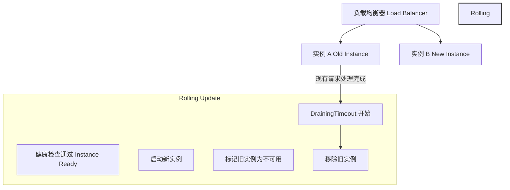

drainingTimeout 是 Google Cloud 环境中确保 Rolling 更新平滑和无 Downtime 的关键机制之一。它主要作用于 负载均衡器的后端服务 (Backend Services)，通过连接排空（Connection Draining）来确保请求在实例下线或更新时能够平稳完成。

什么是 drainingTimeout？
	•	定义：
drainingTimeout 是 Google Cloud Backend Service 的设置，用来控制在实例移除（如更新、删除或故障）时，允许其处理现有连接的最长时间。
	•	机制：
	1.	当实例被标记为“不可用”（如 Rolling Update 或主动移除）时，新的请求不会被路由到该实例。
	2.	对于已经建立的连接，会根据 drainingTimeout 的配置，继续让该实例处理这些连接。
	3.	在超时时间内完成的请求将被正常返回，未完成的请求会被中断。

如何帮助实现平滑 Rolling 和无 Downtime？
	1.	避免强制中断连接：
	•	如果没有配置 drainingTimeout，负载均衡器会立即终止该实例的所有连接，导致请求失败或文件上传中断。
	•	配置了合理的 drainingTimeout 后，现有请求可以继续执行，确保长时间运行的任务（如文件上传、事务处理等）不被强制终止。
	2.	结合 Rolling Update 策略：
	•	配合 Rolling Update 策略中的 健康检查 (Health Check) 和 最大不可用实例数 (maxUnavailable)，可以确保新实例完全启动且健康后，旧实例才被移除。
	•	drainingTimeout 提供了从旧实例平滑过渡到新实例的缓冲时间。
	3.	支持长时间运行的 POST 请求：
	•	对于文件上传等长连接请求，drainingTimeout 可以确保上传任务在移除实例之前完成，避免因实例更新导致的中断。

最佳实践
	1.	设置合理的超时时间：
	•	根据服务的请求特性（如 POST 请求或文件上传的平均时间）设置 drainingTimeout，推荐值为 30 秒到 300 秒。
	•	如果服务包含长时间任务（如流媒体传输或大文件上传），可以设置更长的时间。
	2.	启用健康检查：
	•	在实例接收流量前，确保通过健康检查验证实例的可用性。
	•	在 Rolling Update 中，通过健康检查避免将流量路由到不健康或正在更新的实例。
	3.	结合负载均衡的连接保持 (Connection Draining)：
	•	配置负载均衡器的连接保持功能，结合 drainingTimeout 确保现有请求的连接不被过早关闭。
	4.	GCE Rolling Update 中的细节：
	•	使用 Managed Instance Group (MIG) 的 Rolling Update 策略时，确保设置 maxUnavailable=0 或低值。
	•	同时搭配 drainingTimeout，进一步提高平滑性。

简单流程图示例

以下是 GCE 实例使用 drainingTimeout 配合 Rolling Update 的示例流程图：

总结

drainingTimeout 是 Google Cloud 提供的核心功能之一，用于在 GCE 实例 Rolling Update 中确保平滑过渡。它的作用在于：
	1.	避免请求中断，特别是针对长时间运行的请求（如文件上传）。
	2.	增强服务的高可用性和用户体验。
	3.	配合健康检查和 Rolling Update 策略，进一步实现零 Downtime 的平滑更新。

如果你的服务对请求不中断的要求很高，合理配置 drainingTimeout 是必要且有效的。
