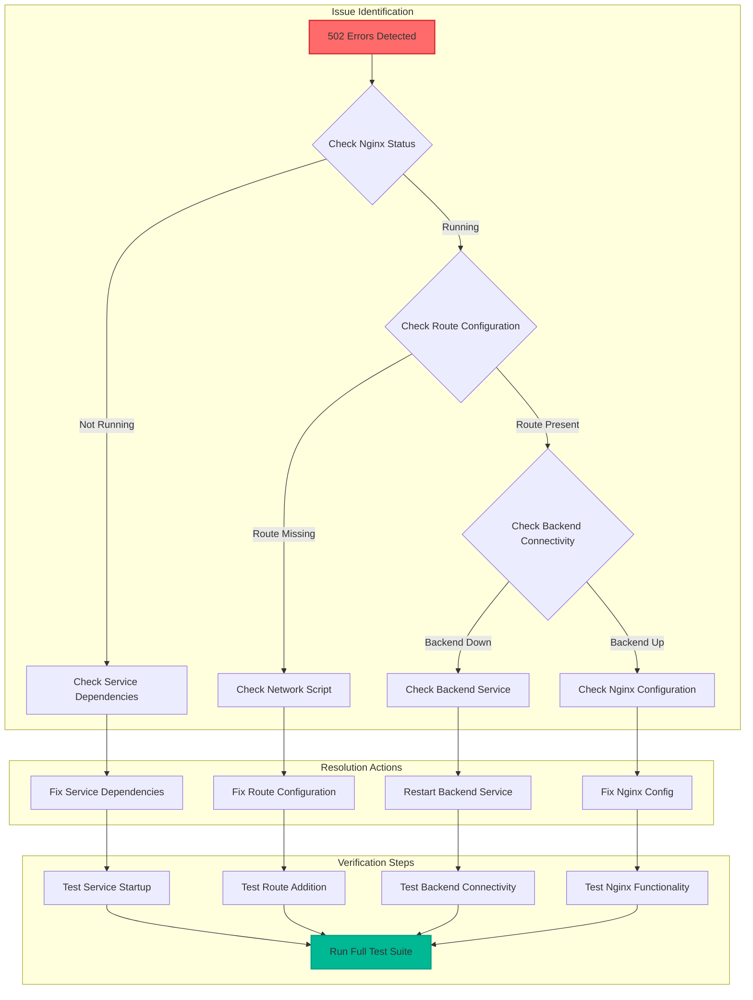

# GCE Dual NIC Nginx L4 Enhanced Routing - Flow Diagrams

This document contains comprehensive Mermaid flow diagrams that illustrate the various scenarios, problems, and solutions for the GCE dual NIC Nginx routing issue.

## Key Flow Diagrams:

- Problem Analysis Flows:
  - Current race condition sequence
  - Network topology and traffic flow
  - Detailed problem timeline
- Solution Implementation Flows:
  - Systemd service dependencies approach
  - Enhanced health check process
  - Startup orchestration with retry logic
- Infrastructure and Operations Flows:
  - MIG autoscaling event handling
  - Terraform configuration structure
  - Testing and validation processes
- Monitoring and Troubleshooting Flows:
  - Continuous monitoring setup
  - Decision trees for issue resolution
  - Implementation timeline with Gantt chart
- Visual Highlights:

- Color-coded elements (green for success, red for errors, yellow for checks)
- Sequence diagrams showing timing relationships
- Decision flowcharts for troubleshooting
- Network topology diagrams

The document provides a complete visual reference for understanding the problem, implementing solutions, and maintaining the system. Each diagram is designed to be self-contained while connecting to the overall solution strategy.

## 1. Current Problem Flow - Race Condition

### 1.1 Problematic Startup Sequence


### 1.2 Detailed Problem Sequence


## 2. Network Architecture Flow

### 2.1 Dual NIC Network Topology


### 2.2 Traffic Flow with Route Dependencies


## 3. Solution Flows

### 3.1 Solution 1: Systemd Service Dependencies


### 3.2 Solution 1 Implementation Flow


### 3.3 Solution 2: Enhanced Health Check Flow

```mermaid
graph TD
    subgraph "Enhanced Health Check Process"
        A[Health Check Triggered] --> B[Check Nginx Process]
        B --> C[Check Port 8081 Listening]
        C --> D[Verify Private Route Exists]
        D --> E[Test Backend Connectivity]
        E --> F[Test Proxy Functionality]
        F --> G{All Checks Pass?}
        G -->|Yes| H[Mark Instance Healthy]
        G -->|No| I[Mark Instance Unhealthy]
    end

    subgraph "Health Check Script Logic"
        J[nginx-readiness-check.sh] --> K[pgrep nginx]
        K --> L[netstat -ln | grep :8081]
        L --> M[ip route | grep 192.168.0.0/24]
        M --> N[nc -z 192.168.64.33 443]
        N --> O[curl localhost:8081/health]
    end

    subgraph "MIG Behavior"
        H --> P[Instance Receives Traffic]
        I --> Q[Instance Excluded from Traffic]
        Q --> R[Wait for Route Configuration]
        R --> A
    end

    style D fill:#fd79a8,stroke:#e84393,stroke-width:2px
    style E fill:#fdcb6e,stroke:#e17055,stroke-width:2px
    style H fill:#00b894,stroke:#00a085,stroke-width:2px
    style I fill:#ff6b6b,stroke:#d63031,stroke-width:2px
```

### 3.4 Solution 3: Startup Orchestration Flow


## 4. Autoscaling and MIG Flow

### 4.1 MIG Autoscaling Event Flow


### 4.2 Infrastructure Configuration Flow


## 5. Testing and Validation Flow

### 5.1 Automated Testing Process


### 5.2 Troubleshooting Decision Flow



## 6. Monitoring and Alerting Flow

### 6.1 Continuous Monitoring Process


## 7. Implementation Timeline Flow

### 7.1 Phased Implementation Process


This comprehensive flow documentation provides visual representations of all aspects of the GCE dual NIC Nginx routing issue, from problem identification through solution implementation and ongoing monitoring.